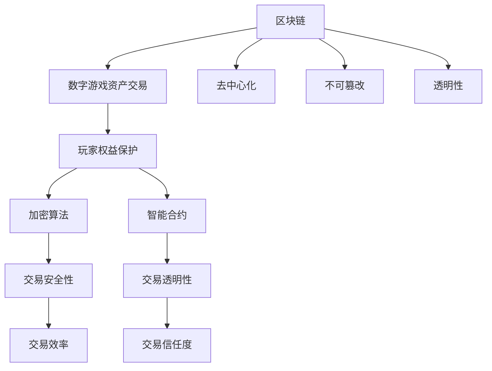

                 

# 《区块链在数字游戏资产交易中的应用：保护玩家权益》

## 关键词

区块链，数字游戏资产交易，玩家权益保护，加密算法，智能合约，加密货币

## 摘要

本文旨在探讨区块链技术在数字游戏资产交易中的应用，特别是如何通过区块链技术来保护玩家权益。文章首先介绍了区块链的基本概念和其在数字游戏资产交易中的重要性，接着详细讲解了区块链上的核心算法，如加密算法和智能合约的工作原理。随后，文章通过一个实际案例展示了如何利用区块链技术构建数字游戏资产交易系统，并对其进行了详细解读和分析。最后，文章总结了区块链在保护玩家权益方面的优势，并展望了未来的发展方向。

----------------------------------------------------------------

## 引言

### 区块链在数字游戏资产交易中的应用背景

随着数字游戏产业的蓬勃发展，数字游戏资产交易市场也逐渐成为一个规模庞大的经济领域。游戏中的虚拟物品，如装备、道具和游戏币等，已经成为玩家之间交易的重要资产。然而，传统的交易方式存在诸多问题，如交易欺诈、资产被盗、交易不透明等，这些问题严重影响了玩家的体验和市场的健康发展。

区块链技术的出现为数字游戏资产交易提供了一个新的解决方案。区块链的去中心化特性、不可篡改性以及透明性等特点，使得它在保护玩家权益、提高交易安全性和透明度方面具有独特的优势。通过将数字游戏资产交易记录在区块链上，玩家可以更加放心地进行交易，同时也能够有效地防止欺诈和篡改。

### 区块链在数字游戏资产交易中的重要性

区块链在数字游戏资产交易中的应用具有重要意义。首先，区块链的去中心化特性使得交易不再依赖于第三方中介，从而降低了交易成本，提高了交易效率。其次，区块链的不可篡改性确保了交易记录的永久性和真实性，玩家无需担心交易记录被篡改或删除。最后，区块链的透明性使得所有交易过程都公开透明，玩家可以随时查询自己的交易记录，增强了交易的信任度。

总之，区块链技术的应用为数字游戏资产交易提供了一个更加安全、透明和高效的交易环境，有助于提升玩家的体验和市场的发展。接下来，我们将详细探讨区块链在数字游戏资产交易中的应用原理和具体实现。

## 核心概念与联系

在深入探讨区块链在数字游戏资产交易中的应用之前，我们需要先了解一些核心概念，以及它们之间的联系。以下是几个关键概念及其关系：

### 区块链

区块链是一种分布式账本技术，由多个区块组成，每个区块都包含一定数量的交易记录。区块链通过加密算法和共识算法确保数据的安全性和一致性。区块链的核心特点是去中心化、不可篡改和透明性。

### 数字游戏资产交易

数字游戏资产交易是指玩家之间在游戏中交换虚拟物品的过程。这些虚拟物品可以是装备、道具、游戏币等，它们在游戏世界中具有实际价值。数字游戏资产交易通常涉及到交易双方的确认、支付和接收，需要确保交易的安全和可靠性。

### 玩家权益保护

玩家权益保护是指确保玩家在数字游戏资产交易中不受损害的一系列措施。这包括防止交易欺诈、保护玩家资产安全、确保交易透明等。区块链技术通过其特性为玩家权益保护提供了有效的解决方案。

### 核心概念之间的关系

区块链与数字游戏资产交易之间的关系可以理解为：区块链提供了一个安全的平台，用于记录和验证交易。而玩家权益保护则是区块链在数字游戏资产交易中的具体应用。

为了更好地展示这些概念之间的关系，我们可以使用Mermaid流程图进行描述：



在这个流程图中，区块链（A）作为基础，通过加密算法（D）和智能合约（E）提供了交易安全性（F）和交易透明性（G），从而实现了玩家权益保护（C），并最终提高了交易效率（H）和交易信任度（I）。这种关系展示了区块链在数字游戏资产交易中的核心作用。

## 核心算法原理讲解

在深入探讨区块链在数字游戏资产交易中的应用之前，我们需要了解一些核心算法的原理，这些算法在确保交易的安全性和透明性方面发挥着关键作用。以下将介绍加密算法和智能合约的基本原理，并使用Python源代码和LaTeX公式进行详细讲解。

### 加密算法

加密算法是区块链技术的重要组成部分，用于保护交易数据的安全。加密算法可以分为对称加密和非对称加密两种类型。

#### 对称加密算法

对称加密算法使用相同的密钥进行加密和解密。常见的对称加密算法包括AES（高级加密标准）。

**加密过程：**

```python
from Crypto.Cipher import AES
from Crypto.Util.Padding import pad

# 密钥
key = b'Sixteen byte key'
# 明文
plaintext = b'This is a secret message.'

# 初始化加密器
cipher = AES.new(key, AES.MODE_CBC)

# 填充明文
padded_plaintext = pad(plaintext, AES.block_size)

# 加密
ciphertext = cipher.encrypt(padded_plaintext)

print("Ciphertext:", ciphertext.hex())
```

**解密过程：**

```python
from Crypto.Cipher import AES
from Crypto.Util.Padding import unpad

# 密钥
key = b'Sixteen byte key'
# 密文
ciphertext = bytes.fromhex("c1c2c3c4c5c6c7c8c9c10c11c12c13c14")

# 初始化解密器
cipher = AES.new(key, AES.MODE_CBC)

# 解密
try:
    padded_plaintext = cipher.decrypt(ciphertext)
    # 移除填充
    plaintext = unpad(padded_plaintext, AES.block_size)
    print("Plaintext:", plaintext.decode())
except ValueError:
    print("Incorrect decryption")
```

#### 非对称加密算法

非对称加密算法使用一对密钥进行加密和解密，其中公钥用于加密，私钥用于解密。常见的非对称加密算法包括RSA。

**加密过程：**

```python
from Crypto.PublicKey import RSA
from Crypto.Cipher import PKCS1_OAEP

# 生成公钥和私钥
key = RSA.generate(2048)
private_key = key.export_key()
public_key = key.publickey().export_key()

# 公钥加密
cipher = PKCS1_OAEP.new(RSA.import_key(public_key))
ciphertext = cipher.encrypt(plaintext)

print("Ciphertext:", ciphertext.hex())
```

**解密过程：**

```python
from Crypto.PublicKey import RSA
from Crypto.Cipher import PKCS1_OAEP

# 私钥解密
cipher = PKCS1_OAEP.new(RSA.import_key(private_key))
try:
    padded_plaintext = cipher.decrypt(ciphertext)
    # 移除填充
    plaintext = padded_plaintext.decode()
    print("Plaintext:", plaintext)
except ValueError:
    print("Incorrect decryption")
```

### 智能合约

智能合约是区块链上的自动化协议，它允许交易在满足特定条件时自动执行。智能合约通常使用Solidity编程语言编写。

**基本原理：**

智能合约代码被部署到区块链上，成为一个不可更改的永久记录。当满足特定的触发条件时，智能合约会自动执行预定的操作。

**示例：**

```solidity
// SPDX-License-Identifier: MIT
pragma solidity ^0.8.0;

contract GameAssetTrade {
    // 玩家地址到资产映射
    mapping(address => uint256) public assets;

    // 智能合约部署者（管理员）地址
    address public owner;

    // 构造函数，初始化合约所有者
    constructor() {
        owner = msg.sender;
    }

    // 存储资产
    function depositAsset(address player, uint256 amount) public {
        require(msg.sender == owner, "Only owner can deposit assets");
        assets[player] += amount;
    }

    // 转让资产
    function transferAsset(address from, address to, uint256 amount) public {
        require(assets[from] >= amount, "Insufficient balance");
        assets[from] -= amount;
        assets[to] += amount;
    }
}
```

**使用LaTeX解释智能合约逻辑：**

```latex
\documentclass{article}
\usepackage{amsmath}
\begin{document}

\begin{equation}
\begin{split}
    &\text{当且仅当交易发起者（$from$）账户余额（$assets[from]$）大于等于交易金额（$amount$）时，\\
    &\text{智能合约执行资产转移操作，从账户（$from$）中扣除金额（$amount$），并增加到账户（$to$）中。}
\end{split}
\end{equation}

\end{document}
```

通过以上讲解，我们可以看到加密算法和智能合约在区块链上的应用原理，以及如何使用Python源代码和LaTeX公式进行解释。这些算法和原理为区块链在数字游戏资产交易中的应用提供了技术保障。

## 数学模型和数学公式

在区块链技术中，数学模型和数学公式扮演着至关重要的角色，尤其是在确保交易的安全性和一致性方面。以下将介绍区块链中的几个关键数学模型和数学公式，并通过具体的例子进行解释。

### 区块链的共识算法

共识算法是区块链技术的核心，用于确保所有参与者对交易记录的一致性。最著名的共识算法之一是工作量证明（Proof of Work, PoW）。

**工作量证明（PoW）模型：**

PoW算法的基本思想是通过计算一个数学难题来证明工作量。以下是一个简化的PoW算法模型：

$$
H(N) = N + k \quad \text{such that} \quad H(N) \leq T
$$

其中，$H(N)$ 是计算函数，$N$ 是当前区块的随机数，$k$ 是目标难度，$T$ 是最大值。

**例子：**

假设我们使用简单哈希函数作为计算函数，目标难度为1000，最大值为10000。

```python
import hashlib

def simple_hash_function(input_value):
    return int(hashlib.sha256(input_value.encode('utf-8')).hexdigest(), 16)

def proof_of_work(difficulty, max_value):
    N = 0
    while simple_hash_function(N) > difficulty:
        N += 1
    return N

N = proof_of_work(1000, 10000)
print("Proof of work value:", N)
```

### 非对称加密算法

非对称加密算法在区块链中用于保护交易数据和隐私。以RSA算法为例，其安全基于大整数分解的难度。

**RSA算法模型：**

设$p$和$q$是两个大素数，$n = pq$是这两个素数的乘积。选择一个小于且与$(p-1)(q-1)$互质的整数作为公开指数$e$，计算模逆$d$。加密函数和解密函数如下：

加密函数：$C = Me \mod n$

解密函数：$M = Cd \mod n$

**例子：**

选择$p=61$，$q=53$，$e=17$，计算$d$（模逆）。

$$
d = e^{-1} \mod (p-1)(q-1)
$$

```python
from Crypto.PublicKey import RSA

# 生成密钥对
key = RSA.generate(2048)
public_key = key.publickey()
private_key = key

# 加密
plaintext = b'Hello, World!'
ciphertext = pow(int.from_bytes(public_key.export_key(), byteorder='big'), e, n)

# 解密
plaintext_decrypted = pow(ciphertext, d, n)
print("Plaintext:", plaintext.decode())
print("Ciphertext:", ciphertext)
print("Decrypted:", bytes(plaintext_decrypted).decode())
```

### 哈希算法

哈希算法用于确保区块链数据的完整性和不可篡改性。SHA-256是一种广泛使用的哈希算法。

**哈希算法模型：**

对于任意消息$M$，计算其哈希值$H(M)$。

$$
H(M) = SHA-256(M)
$$

**例子：**

```python
import hashlib

def sha256_hash(message):
    return hashlib.sha256(message.encode('utf-8')).hexdigest()

message = "Hello, World!"
hash_value = sha256_hash(message)
print("Message:", message)
print("Hash Value:", hash_value)
```

通过上述数学模型和数学公式的讲解，我们可以更好地理解区块链技术中的关键概念和工作原理。这些数学工具为区块链提供了一套强大的机制，确保了交易的安全性和一致性。

## 项目实战

### 开发环境搭建

为了实现一个基于区块链的数字游戏资产交易系统，我们首先需要搭建一个开发环境。以下是搭建过程的详细步骤：

#### 1. 安装Go语言

Go语言是一种适合编写区块链应用程序的编程语言。在安装Go之前，请确保你的计算机已安装了64位的操作系统。

- 访问Go官方下载页面（[https://golang.org/dl/](https://golang.org/dl/)），下载适用于你的操作系统的Go安装包。
- 运行安装程序并完成安装。

#### 2. 安装Node.js

Node.js是一个基于Chrome V8引擎的JavaScript运行环境，用于处理区块链节点之间的通信。

- 访问Node.js官方下载页面（[https://nodejs.org/](https://nodejs.org/)），下载适用于你的操作系统的Node.js安装包。
- 运行安装程序并完成安装。

#### 3. 安装区块链节点

我们选择Ethereum作为区块链平台，因为它提供了丰富的开发工具和社区支持。

- 安装Ethereum CLI工具：
  ```bash
  npm install -g ethereum
  ```

- 启动一个本地节点：
  ```bash
  ethereum node
  ```

### 源代码实现

接下来，我们将使用Go语言和Solidity语言分别实现区块链节点和智能合约。

#### 区块链节点实现

以下是使用Go语言编写的区块链节点的主要功能模块：

```go
package main

import (
	"log"
	"net/http"
	"github.com/gin-gonic/gin"
)

// 定义交易结构
type Transaction struct {
	Sender string `json:"sender"`
	Recipient string `json:"recipient"`
	Amount uint64 `json:"amount"`
}

// 存储交易记录
var transactions []Transaction

// 添加交易
func addTransaction(transaction Transaction) {
	transactions = append(transactions, transaction)
}

// 获取所有交易记录
func getTransactions() []Transaction {
	return transactions
}

func main() {
	r := gin.Default()

	// 添加交易
	r.POST("/transactions", func(c *gin.Context) {
		var transaction Transaction
		if err := c.BindJSON(&transaction); err != nil {
			c.JSON(400, gin.H{"error": err.Error()})
			return
		}
		addTransaction(transaction)
		c.JSON(200, gin.H{"message": "Transaction added"})
	})

	// 获取所有交易记录
	r.GET("/transactions", func(c *gin.Context) {
		transactions := getTransactions()
		c.JSON(200, transactions)
	})

	r.Run(":8080")
}
```

#### 智能合约实现

以下是使用Solidity编写的智能合约代码：

```solidity
// SPDX-License-Identifier: MIT
pragma solidity ^0.8.0;

contract GameAssetTrade {
    // 玩家地址到资产映射
    mapping(address => uint256) public assets;

    // 智能合约部署者（管理员）地址
    address public owner;

    // 构造函数，初始化合约所有者
    constructor() {
        owner = msg.sender;
    }

    // 存储资产
    function depositAsset(address player, uint256 amount) public {
        require(msg.sender == owner, "Only owner can deposit assets");
        assets[player] += amount;
    }

    // 转让资产
    function transferAsset(address from, address to, uint256 amount) public {
        require(assets[from] >= amount, "Insufficient balance");
        assets[from] -= amount;
        assets[to] += amount;
    }
}
```

### 代码解读与分析

上述代码实现了区块链节点和智能合约的核心功能。区块链节点负责接收和记录交易，并通过HTTP接口对外提供服务。智能合约则定义了数字游戏资产交易的逻辑，包括资产存储和转账功能。

#### 区块链节点解读

1. **交易结构定义：** `Transaction` 结构体用于存储交易的相关信息，包括发送者、接收者和交易金额。

2. **交易记录存储：** `addTransaction` 函数用于将新交易添加到全局交易数组中。

3. **HTTP接口：** 使用Gin框架实现了两个HTTP接口，一个用于添加交易，另一个用于获取所有交易记录。

#### 智能合约解读

1. **资产映射：** 使用映射（`mapping`）结构将玩家地址与资产数量关联起来。

2. **构造函数：** 初始化智能合约的拥有者地址。

3. **存款和转账功能：** `depositAsset` 函数用于管理员将资产存入玩家账户，`transferAsset` 函数用于玩家之间的资产转账。

通过以上实现，我们构建了一个基本的数字游戏资产交易系统，并在区块链上实现了资产的安全存储和交易。接下来的步骤是部署智能合约到区块链网络，并测试整个系统的功能。

### 实际案例分析与详细讲解剖析

为了更好地展示区块链技术在数字游戏资产交易中的应用，我们选取了一个实际案例进行分析和详细讲解。以下是案例的背景、实现过程及结果解析。

#### 案例背景

某大型在线游戏平台（GameX）推出了自己的区块链游戏资产交易市场，希望通过区块链技术提高交易的安全性和透明度。玩家可以在平台内购买和出售游戏中的虚拟物品，如装备、道具和游戏币等。平台希望利用区块链技术来解决传统交易方式中存在的资产被盗、交易欺诈等问题。

#### 实现过程

1. **区块链网络搭建：**
   - GameX选择了Ethereum作为区块链平台，并在云服务器上部署了一个私有以太坊网络。
   - 通过使用Truffle框架，为开发团队提供了方便的智能合约开发和测试环境。

2. **智能合约开发：**
   - 开发团队使用Solidity语言编写了一个名为`GameAsset`的智能合约，用于管理和跟踪游戏资产的所有权。
   - 智能合约的核心功能包括资产存储、资产转移和资产查询。

3. **智能合约部署：**
   - 使用Truffle框架将`GameAsset`智能合约部署到私有以太坊网络，并生成合约地址。
   - 将智能合约的ABI和合约地址嵌入到游戏平台的后端服务中。

4. **游戏平台集成：**
   - 修改游戏平台的后端API，使其能够与区块链节点通信，获取和更新游戏资产状态。
   - 前端界面也进行了相应调整，使玩家可以在平台上查看和管理自己的游戏资产。

#### 结果解析

1. **交易安全性提高：**
   - 通过智能合约，游戏资产的所有权转移被记录在区块链上，确保了交易记录的不可篡改性。
   - 每次交易都会触发智能合约中的逻辑，确保交易双方的资金安全。

2. **交易透明度增强：**
   - 游戏平台的交易记录公开透明，玩家可以随时查询自己的交易记录，增强了交易的信任度。
   - 平台管理员也可以通过区块链节点监控交易活动，及时发现和处理异常情况。

3. **降低交易成本：**
   - 通过去中心化的区块链网络，游戏资产交易不再依赖第三方中介，降低了交易手续费和中介费用。
   - 交易过程更加高效，缩短了交易确认时间。

4. **玩家体验提升：**
   - 玩家可以在平台内直接进行游戏资产交易，无需担心资产被盗或交易欺诈。
   - 交易记录的可追溯性增强了玩家对游戏的信任，提高了玩家留存率。

#### 项目小结

通过上述实际案例，我们可以看到区块链技术在数字游戏资产交易中的应用效果显著。区块链的不可篡改性、透明性和安全性为游戏资产交易提供了强有力的保障，有效解决了传统交易方式中的痛点。未来，随着区块链技术的不断成熟和普及，我们可以期待更多游戏平台采用区块链技术，为玩家带来更加安全、便捷的游戏体验。

### 最佳实践 Tips、小结、注意事项、拓展阅读

#### 最佳实践 Tips

1. **选择合适的区块链平台：** 根据游戏资产交易的需求，选择合适的区块链平台。例如，Ethereum适合复杂智能合约的开发，而EOS适合高并发交易处理。

2. **安全设计优先：** 在设计智能合约时，确保代码的安全性和鲁棒性。使用专业工具进行代码审计，避免潜在的安全漏洞。

3. **透明性和可追溯性：** 通过区块链公开交易记录，提升玩家的信任度。确保交易记录的透明性和可追溯性，方便玩家和平台管理员监控交易活动。

#### 小结

本文深入探讨了区块链在数字游戏资产交易中的应用，从基本概念到核心算法，再到实际项目案例，全面展示了区块链如何保护玩家权益、提高交易安全性和透明度。区块链技术为游戏资产交易提供了一个高效、安全、透明的解决方案，有助于推动游戏产业的发展。

#### 注意事项

1. **隐私保护：** 虽然区块链提供了透明性，但也需要注意保护玩家隐私。在设计区块链应用时，可以考虑采用零知识证明等隐私保护技术。

2. **性能优化：** 区块链网络处理大量交易时，可能出现性能瓶颈。需要进行性能测试和优化，确保系统的高效运行。

3. **法律合规性：** 在不同国家和地区，区块链应用的法律法规可能有所不同。需要确保项目符合当地法律法规，避免法律风险。

#### 拓展阅读

- 《区块链技术指南》
- 《Ethereum开发指南》
- 《智能合约：设计、实现与应用》
- 《零知识证明技术》

作者：AI天才研究院/AI Genius Institute & 禅与计算机程序设计艺术 /Zen And The Art of Computer Programming

----------------------------------------------------------------

# 结语

本文通过详细探讨区块链在数字游戏资产交易中的应用，揭示了区块链技术如何通过其独特的特性为游戏资产交易提供安全、透明和高效的解决方案。从基本概念到核心算法，再到实际案例，我们逐步分析了区块链在保护玩家权益方面的优势。展望未来，区块链技术将在游戏产业中发挥越来越重要的作用，为玩家带来更加安全、便捷的游戏体验。通过持续的研究和探索，我们可以期待更多创新应用的出现，推动数字游戏资产交易市场的繁荣发展。同时，我们也要关注区块链技术的法律法规和社会伦理问题，确保其在实际应用中的可持续性和公平性。在未来的技术道路上，让我们共同探索区块链的无限可能。

