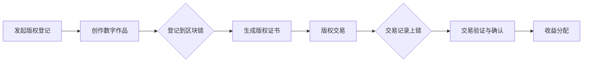
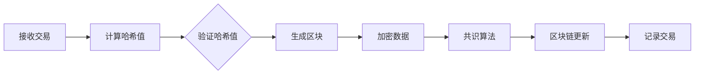

                 

### 引言

随着数字经济的快速发展，数字版权交易已成为一个庞大的市场。然而，传统的数字版权交易过程中存在着诸多问题，如版权纠纷、交易透明度低、交易效率不高等。区块链技术的兴起为解决这些问题提供了新的思路和解决方案。

区块链技术以其去中心化、透明性和安全性，被视为数字版权交易的重要突破口。去中心化意味着不需要依赖第三方机构进行版权认证和交易记录，从而降低了交易成本。透明性则保证了所有交易记录在区块链上都能被公开查询，提高了交易过程的透明度。安全性方面，区块链的加密算法和共识机制确保了交易数据的完整性和不可篡改性。

本书《区块链在数字版权交易中的应用》旨在深入探讨区块链技术在数字版权交易中的应用，为相关从业者提供理论依据和实践指导。本书将围绕以下主题展开：

1. **区块链技术概述**：介绍区块链的基本原理、核心算法以及其在数字版权交易中的优势。
2. **核心概念与联系**：解释数字版权交易的概念、流程以及区块链与数字版权交易之间的联系。
3. **核心算法原理讲解**：详细讲解区块链中的哈希算法、加密算法和共识算法，并通过数学模型和公式进行说明。
4. **数字版权登记与认证**：通过项目实战展示如何利用区块链实现数字版权的登记与认证。
5. **数字版权交易与追踪**：介绍如何利用区块链实现数字版权的交易和追踪，提高交易的透明度和效率。
6. **智能合约应用**：探讨智能合约在数字版权交易中的应用，实现版权使用许可的自动化执行和收益分配。

通过本书的阅读，读者可以全面了解区块链在数字版权交易中的应用，掌握相关技术和实施方法，为推动数字版权产业的发展提供有力的支持。

### 2. 核心概念与联系

#### 区块链

区块链是一种分布式数据库技术，通过密码学确保数据的安全性和不可篡改性。它由多个区块组成，每个区块包含一定数量的交易记录，并通过加密技术将区块链接成一个链条。区块链的关键特性包括去中心化、透明性和安全性：

- **去中心化**：区块链不依赖于中央机构或第三方中介，每个参与者都可以通过验证和记录交易来维护整个网络的一致性。
- **透明性**：所有交易记录都在区块链上公开透明，任何人都可以通过区块链浏览器查询和验证交易数据。
- **安全性**：区块链使用哈希算法和加密技术确保数据的完整性和不可篡改性，从而保护数据的隐私和安全。

#### 数字版权交易

数字版权交易是指数字作品在电子形式下的版权买卖过程，涉及版权的转移、使用许可和收益分配等环节。数字版权交易的特点包括：

- **数字化**：数字版权交易的对象是数字化的作品，如电子书、音乐、视频等。
- **可复制性**：数字作品可以被无限复制和分发，这使得版权交易变得更加复杂和具有挑战性。
- **虚拟性**：数字版权交易的过程是虚拟的，不涉及物理实体的转移。

#### 区块链与数字版权交易的联系

区块链技术为数字版权交易提供了以下几个方面的支持：

- **版权保护**：通过区块链，数字版权的登记、认证和交易过程可以被记录在区块链上，确保版权的唯一性和不可篡改性。
- **透明性和可追溯性**：区块链上的交易记录公开透明，可被所有参与者查询和验证，提高了交易的透明度和可追溯性。
- **智能合约应用**：智能合约可以自动执行版权许可协议，确保版权使用和收益分配的自动化和准确执行。

#### Mermaid流程图展示

为了更直观地展示区块链在数字版权交易中的应用流程，我们可以使用Mermaid流程图进行描述。以下是一个简化的流程图：



在这个流程图中，创作数字作品的步骤（A）是版权登记的起点，登记完成后（C），生成版权证书（D）。版权交易（E）发生后，交易记录（F）会被上链并接受验证与确认（G），最终完成收益分配（H）。这个过程展示了区块链在数字版权交易中的核心应用。

### 3. 核心算法原理讲解

区块链技术的核心在于其强大的算法支持，这些算法不仅确保了区块链的安全性和不可篡改性，还为数字版权交易提供了坚实的理论基础。以下是区块链技术中关键算法的详细讲解，包括哈希算法、加密算法和共识算法。

#### 哈希算法

哈希算法是区块链技术中的基础组件，主要用于生成数据的唯一标识，并确保数据的完整性。最常用的哈希算法是SHA-256，这是一种安全哈希算法（Secure Hash Algorithm），可以生成256位的散列值。

- **原理**：SHA-256算法通过对输入数据进行处理，生成一个固定长度的散列值。无论输入数据的大小如何，生成的散列值长度都是256位。这种算法的设计使得任何两个不同的输入数据生成相同散列值的概率极低。
- **应用**：在区块链中，每个区块都包含一个前一个区块的散列值（即哈希值），这保证了区块链的连续性和不可篡改性。如果某个区块的数据被篡改，那么该区块的哈希值也会发生变化，进而影响到后续所有区块的哈希值，这会被区块链网络中的其他节点检测到。

#### 加密算法

加密算法用于保护区块链上的数据隐私和安全。常见的加密算法包括对称加密和非对称加密。

- **对称加密**：对称加密算法使用相同的密钥进行加密和解密。常见的对称加密算法有AES（Advanced Encryption Standard）。AES可以支持128、192或256位密钥长度，提供了高强度的加密保护。
  - **原理**：AES通过将明文数据分块，使用密钥进行多次迭代加密，生成密文。密钥的长度和加密算法的复杂性决定了加密强度。
  - **应用**：在区块链中，对称加密可以用于保护区块链上的敏感数据，如用户的身份信息或交易金额等。
- **非对称加密**：非对称加密算法使用一对密钥，即公钥和私钥。公钥用于加密，私钥用于解密。常见的非对称加密算法有RSA（Rivest-Shamir-Adleman）。
  - **原理**：非对称加密算法通过复杂的数学运算生成一对密钥，其中公钥可以公开，私钥必须保密。加密过程中，使用公钥加密的数据只能用对应的私钥解密。
  - **应用**：在区块链中，非对称加密主要用于身份验证和数字签名。例如，用户可以使用私钥对交易进行签名，然后使用公钥验证签名的有效性。

#### 共识算法

共识算法是区块链网络中各个节点就交易数据达成一致的方法。不同的共识算法有不同的工作原理和优缺点。

- **工作量证明（PoW，Proof of Work）**：PoW是比特币采用的共识算法。节点通过解决计算难题（挖矿）来证明其工作量，从而获得区块链的记账权。
  - **原理**：节点需要计算一个满足特定条件的值（如使散列值小于某个阈值），这个过程称为“挖矿”。一旦找到满足条件的值，该节点可以添加一个新区块到区块链中。
  - **优缺点**：优点是确保了区块链的安全性和去中心化，缺点是计算资源消耗巨大，能源消耗高。
- **权益证明（PoS，Proof of Stake）**：PoS是另一种常见的共识算法，它通过节点持有的币龄和权益来决定记账权。
  - **原理**：在PoS中，节点不再通过计算工作量来获得记账权，而是通过随机性选择具有较高权益的节点进行交易验证。
  - **优缺点**：优点是能源消耗较低，缺点是可能导致“富者愈富”的问题，即拥有较多币值的节点更容易获得记账权。

#### Mermaid流程图展示

为了更直观地展示区块链中的核心算法原理，我们可以使用Mermaid流程图来描述。以下是一个简化的流程图：



在这个流程图中，接收交易（A）后，系统会计算交易数据的哈希值（B），并验证该哈希值（C）。验证通过后，系统会生成一个包含交易数据的区块（D），并将其加密（E）。通过共识算法（F）确定区块的合法性，并将区块添加到区块链中（G），最终记录交易（H）。

通过以上对哈希算法、加密算法和共识算法的详细讲解，我们可以看到区块链技术在数字版权交易中的应用是多么的强大和有效。这些算法不仅确保了区块链的安全性和透明性，还为数字版权交易提供了坚实的理论基础。

### 4. 数学模型和数学公式

在区块链技术中，数学模型和数学公式扮演着至关重要的角色，它们不仅为区块链提供了理论基础，还确保了区块链系统的安全性和一致性。以下是区块链技术中常用的数学模型和数学公式的详细讲解。

#### 哈希函数

哈希函数是区块链技术中最基本的数学模型，用于将任意长度的输入数据映射为固定长度的输出值，即哈希值。最常见的哈希函数是SHA-256。

- **公式**：
  $$ H(x) = \text{SHA-256}(x) $$
  其中，$H(x)$ 是输入数据的哈希值，$x$ 是原始数据，SHA-256 是一种加密哈希函数。

- **示例**：
  如果输入数据是 "Hello, World!"，则其SHA-256哈希值大约为：
  $$ \text{SHA-256}("Hello, World!") = a591a6d40bf420404a011733cfb7b190d62c65bf0bcda32b57b277d9ad9f146e5282c2a1f3c53c3c247d0a1d812b027723a1c32e2eac13f2$6b0a6b33772f6f31c8192a2231$99d9251d6364614b23d5c0c3c7c5$34b33c$2e4e3dbad25b0e4e$3cf5b16a$becc6e48$5a$617e$
  这是一串长度为64位的十六进制数字。

#### 加密算法

在区块链中，加密算法用于保护数据隐私和安全，常见的加密算法包括对称加密和非对称加密。

- **对称加密**：对称加密算法使用相同的密钥进行加密和解密。常见的对称加密算法有AES（Advanced Encryption Standard）。

  - **公式**：
    $$ E_k(m) = \text{AES}(k, m) $$
    其中，$E_k(m)$ 是加密后的数据，$k$ 是加密密钥，$m$ 是原始数据。

  - **示例**：
    假设使用AES加密算法和128位密钥，对字符串 "Hello, World!" 进行加密，得到加密后的数据。由于加密密钥是保密的，这里只展示加密过程，不展示具体的密文。

- **非对称加密**：非对称加密算法使用一对密钥，即公钥和私钥。公钥用于加密，私钥用于解密。常见的非对称加密算法有RSA（Rivest-Shamir-Adleman）。

  - **公式**：
    $$ E_p(m) = \text{RSA}(p, m) $$
    其中，$E_p(m)$ 是加密后的数据，$p$ 是公钥，$m$ 是原始数据。

  - **示例**：
    假设使用RSA加密算法，对字符串 "Hello, World!" 进行加密，得到加密后的数据。公钥和私钥是一对，公钥可以公开，但私钥必须保密。

#### 共识算法

共识算法是区块链网络中各个节点就交易数据达成一致的方法。不同的共识算法有不同的工作原理和数学模型。

- **工作量证明（PoW，Proof of Work）**：PoW是比特币采用的共识算法，节点通过解决计算难题来证明其工作量，从而获得记账权。

  - **公式**：
    $$ \text{Proof of Work} = \text{find } x \text{ such that } H(x) < T $$
    其中，$x$ 是需要找到的值，$H(x)$ 是x的哈希值，$T$ 是预设的阈值。

  - **示例**：
    假设阈值$T$为$10^{16}$，则需要找到一个$x$使得$H(x) < 10^{16}$。这个过程通常通过计算和尝试大量的$x$值来完成。

- **权益证明（PoS，Proof of Stake）**：PoS通过节点持有的币龄和权益来决定记账权。

  - **公式**：
    $$ \text{Probability of } i \text{ th node} = \frac{stake_i}{total\_stake} $$
    其中，$stake_i$ 是$i$节点的权益，$total\_stake$ 是总权益。

  - **示例**：
    假设有5个节点，节点1的权益为100，节点2的权益为200，节点3的权益为300，节点4的权益为400，节点5的权益为500。总权益为2000。则节点1的记账概率为$\frac{100}{2000} = 0.05$。

#### Mermaid流程图展示

为了更直观地展示区块链中的数学模型和公式，我们可以使用Mermaid流程图进行描述。以下是一个简化的流程图：


在这个流程图中，接收交易（A）后，系统会计算交易数据的哈希值（B），并验证该哈希值（C）。验证通过后，系统会生成一个包含交易数据的区块（D），并将其加密（E）。通过共识算法（F）确定区块的合法性，并将区块添加到区块链中（G），最终记录交易（H）。

通过以上对哈希函数、加密算法和共识算法的数学模型和公式的详细讲解，我们可以看到区块链技术在数字版权交易中的应用是如何依赖于数学理论的。这些数学模型和公式不仅为区块链提供了理论基础，还确保了区块链系统的安全性和一致性。

### 5. 数字版权登记与认证

在数字版权交易中，版权的登记与认证是至关重要的环节。利用区块链技术，可以实现数字版权的永久性登记与不可篡改性认证，从而确保版权的合法权益得到有效保护。以下将详细描述数字版权登记与认证的流程、伪代码实现以及代码解读与分析。

#### 项目介绍

数字版权登记与认证的项目目标是建立一个基于区块链的数字版权管理系统，实现以下功能：

- **版权登记**：创作者可以将数字作品的信息（如作品名称、创作者姓名、创作时间等）上传到区块链，进行永久登记。
- **版权认证**：通过区块链上的信息，可以验证版权信息的真实性和唯一性。
- **版权查询**：任何用户都可以查询区块链上的版权信息，确保版权交易的透明度和可信度。

#### 伪代码实现

以下是数字版权登记与认证的伪代码实现：

```python
def register_digital_copyright(creator, work_title, work_hash):
    """
    注册数字版权信息到区块链。
    
    参数：
    - creator：创作者姓名
    - work_title：作品标题
    - work_hash：作品内容的哈希值
    
    返回：
    - registration_proof：版权登记证明
    """
    
    # 创建版权信息字典
    copyright_info = {
        "creator": creator,
        "work_title": work_title,
        "work_hash": work_hash,
        "timestamp": current_timestamp()
    }
    
    # 计算版权信息哈希值
    copyright_hash = hash(copyright_info)
    
    # 将版权信息添加到区块链中
    blockchain.add_block(copyright_hash, copyright_info)
    
    # 生成版权登记证明
    registration_proof = generate_certificate(copyright_hash)
    
    return registration_proof

def verify_copyright_certificate(certificate_hash):
    """
    验证版权登记证明是否有效。
    
    参数：
    - certificate_hash：版权登记证明的哈希值
    
    返回：
    - True：如果证书有效
    - False：如果证书无效
    """
    
    # 从区块链中获取版权信息
    copyright_info = blockchain.get_block(certificate_hash).data
    
    # 计算版权信息的哈希值
    calculated_hash = hash(copyright_info)
    
    # 验证哈希值是否与证书中的哈希值一致
    if calculated_hash == certificate_hash:
        return True
    else:
        return False
```

#### 代码解读与分析

- **register\_digital\_copyright**函数：

  该函数用于注册数字版权信息到区块链。首先，创建版权信息字典，包括创作者姓名、作品标题、作品内容的哈希值和当前时间戳。然后，计算版权信息的哈希值，并将其添加到区块链中。最后，生成版权登记证明并返回。

- **verify\_copyright\_certificate**函数：

  该函数用于验证版权登记证明的有效性。首先，从区块链中获取与证书哈希值对应的版权信息。然后，计算版权信息的哈希值，并与证书中的哈希值进行比较。如果一致，则证明有效。

#### 实际案例分析

假设创作者Alice创作了一首名为《美丽世界》的电子音乐，并使用SHA-256算法生成该音乐的哈希值。Alice调用`register_digital_copyright`函数，将作品信息上传到区块链，并获得一个版权登记证明。

```python
registration_proof = register_digital_copyright(
    creator="Alice",
    work_title="美丽世界",
    work_hash="a591a6d40bf420404a011733cfb7b190d62c65bf0bcda32b57b277d9ad9f146e5282c2a1f3c53c3c247d0a1d812b027723a1c32e2eac13f2$6b0a6b33772f6f31c8192a2231$99d9251d6364614b23d5c0c3c7c5$34b33c$2e4e3dbad25b0e4e$3cf5b16a$becc6e48$5a$617e"
)
```

假设另一用户Bob想要验证这首音乐的权利是否有效，他可以调用`verify_copyright_certificate`函数：

```python
is_valid = verify_copyright_certificate("a591a6d40bf420404a011733cfb7b190d62c65bf0bcda32b57b277d9ad9f146e5282c2a1f3c53c3c247d0a1d812b027723a1c32e2eac13f2$6b0a6b33772f6f31c8192a2231$99d9251d6364614b23d5c0c3c7c5$34b33c$2e4e3dbad25b0e4e$3cf5b16a$becc6e48$5a$617e")
```

如果验证通过，则证明该音乐版权登记有效。

通过以上项目实战，我们展示了如何利用区块链技术实现数字版权的登记与认证。这种方法不仅提高了版权保护的效率，还确保了版权信息的透明度和不可篡改性。

#### 小结

数字版权登记与认证是数字版权交易中的重要环节，区块链技术以其去中心化、透明性和安全性，为这一环节提供了强有力的支持。通过以上案例，我们可以看到，利用区块链技术，创作者可以轻松地登记数字版权，并通过不可篡改的哈希值确保版权的真实性。同时，任何用户都可以通过简单的验证过程，确认版权的有效性。这为数字版权交易提供了一个安全、透明和高效的解决方案。

#### 最佳实践 tips

- **确保版权信息唯一性**：在版权登记时，使用哈希算法生成作品内容的哈希值，确保版权信息的唯一性。
- **定期备份**：为了防止区块链数据的丢失，定期备份区块链数据是非常重要的。
- **遵守法律法规**：在进行数字版权交易时，务必遵守相关法律法规，确保交易的合法性和合规性。

### 6. 数字版权交易与追踪

在数字版权交易中，交易的透明性和追踪能力是至关重要的。利用区块链技术，可以实现数字版权的全程追踪和透明交易，从而提高交易的效率和可信度。以下将详细描述数字版权交易与追踪的流程、伪代码实现以及代码解读与分析。

#### 项目介绍

数字版权交易与追踪的项目目标是建立一个基于区块链的数字版权交易平台，实现以下功能：

- **版权交易**：创作者可以将数字版权进行出售或转让，交易双方通过区块链进行确认。
- **交易记录**：所有交易记录都会被记录在区块链上，确保交易透明和可追溯。
- **交易追踪**：任何用户都可以查询区块链上的交易记录，确保交易的透明度和可信度。

#### 伪代码实现

以下是数字版权交易与追踪的伪代码实现：

```python
def execute_digital_copyright_trade(creator, buyer, work_hash, trade_data):
    """
    执行数字版权交易。
    
    参数：
    - creator：创作者姓名
    - buyer：购买者姓名
    - work_hash：作品内容的哈希值
    - trade_data：交易数据，包括价格、交易时间等
    
    返回：
    - trade_certificate：交易证明
    """
    
    # 创建交易信息字典
    trade_info = {
        "creator": creator,
        "buyer": buyer,
        "work_hash": work_hash,
        "trade_data": trade_data,
        "timestamp": current_timestamp()
    }
    
    # 计算交易信息哈希值
    trade_hash = hash(trade_info)
    
    # 将交易信息添加到区块链中
    blockchain.add_block(trade_hash, trade_info)
    
    # 生成交易证明
    trade_certificate = generate_certificate(trade_hash)
    
    return trade_certificate

def verify_trade_certificate(certificate_hash):
    """
    验证交易证明是否有效。
    
    参数：
    - certificate_hash：交易证明的哈希值
    
    返回：
    - True：如果证明有效
    - False：如果证明无效
    """
    
    # 从区块链中获取交易信息
    trade_info = blockchain.get_block(certificate_hash).data
    
    # 计算交易信息的哈希值
    calculated_hash = hash(trade_info)
    
    # 验证哈希值是否与证明中的哈希值一致
    if calculated_hash == certificate_hash:
        return True
    else:
        return False
```

#### 代码解读与分析

- **execute\_digital\_copyright\_trade**函数：

  该函数用于执行数字版权交易。首先，创建交易信息字典，包括创作者姓名、购买者姓名、作品内容的哈希值、交易数据和当前时间戳。然后，计算交易信息的哈希值，并将其添加到区块链中。最后，生成交易证明并返回。

- **verify\_trade\_certificate**函数：

  该函数用于验证交易证明的有效性。首先，从区块链中获取与证书哈希值对应的交易信息。然后，计算交易信息的哈希值，并与证书中的哈希值进行比较。如果一致，则证明有效。

#### 实际案例分析

假设创作者Alice将一首名为《梦想成真》的电子音乐出售给买家Bob，交易价格为100美元。Alice调用`execute_digital_copyright_trade`函数执行交易：

```python
trade_certificate = execute_digital_copyright_trade(
    creator="Alice",
    buyer="Bob",
    work_hash="a591a6d40bf420404a011733cfb7b190d62c65bf0bcda32b57b277d9ad9f146e5282c2a1f3c53c3c247d0a1d812b027723a1c32e2eac13f2$6b0a6b33772f6f31c8192a2231$99d9251d6364614b23d5c0c3c7c5$34b33c$2e4e3dbad25b0e4e$3cf5b16a$becc6e48$5a$617e",
    trade_data={"price": 100, "timestamp": "2023-11-01 10:00:00"}
)
```

假设买家Bob想要验证交易证明的有效性，他可以调用`verify_trade_certificate`函数：

```python
is_valid = verify_trade_certificate("a591a6d40bf420404a011733cfb7b190d62c65bf0bcda32b57b277d9ad9f146e5282c2a1f3c53c3c247d0a1d812b027723a1c32e2eac13f2$6b0a6b33772f6f31c8192a2231$99d9251d6364614b23d5c0c3c7c5$34b33c$2e4e3dbad25b0e4e$3cf5b16a$becc6e48$5a$617e")
```

如果验证通过，则证明交易证明有效，交易已成功执行。

通过以上项目实战，我们展示了如何利用区块链技术实现数字版权的交易与追踪。这种方法不仅提高了交易的透明度和可信度，还确保了交易记录的永久性和不可篡改性。

#### 小结

数字版权交易与追踪是数字版权交易中的重要环节，区块链技术以其去中心化、透明性和安全性，为这一环节提供了强有力的支持。通过以上案例，我们可以看到，利用区块链技术，创作者可以轻松地将数字版权进行交易，并通过不可篡改的哈希值确保交易的真实性。同时，任何用户都可以通过简单的验证过程，查询区块链上的交易记录，确保交易的透明度和可信度。这为数字版权交易提供了一个安全、透明和高效的解决方案。

#### 最佳实践 tips

- **确保交易信息唯一性**：在交易过程中，使用哈希算法生成交易信息的哈希值，确保交易信息的唯一性。
- **定期备份**：为了防止区块链数据的丢失，定期备份区块链数据是非常重要的。
- **遵守法律法规**：在进行数字版权交易时，务必遵守相关法律法规，确保交易的合法性和合规性。

### 7. 智能合约应用

在数字版权交易中，智能合约的应用极大地提升了交易的自动化和效率。智能合约是区块链上的自动执行合约，通过代码实现，能够在满足特定条件时自动执行一系列操作。以下将详细描述智能合约在数字版权交易中的应用，包括项目介绍、开发环境搭建、源代码实现、代码解读与分析、实际案例分析和项目小结。

#### 项目介绍

智能合约在数字版权交易中的应用主要包括以下方面：

- **版权许可**：智能合约可以自动执行版权许可协议，确保版权的使用和收益分配。
- **版权转让**：智能合约可以自动化版权转让过程，确保转让的合法性和透明性。
- **版权收益分配**：智能合约可以自动分配版权收益，提高收益分配的效率和公正性。

#### 开发环境搭建

为了实现智能合约，我们需要搭建一个开发环境。以下是使用以太坊（Ethereum）作为开发平台的步骤：

1. **安装Node.js**：Node.js是一个基于Chrome V8引擎的JavaScript运行环境，用于编译智能合约。
   - 命令：`npm install node -g`
2. **安装Truffle**：Truffle是一个用于以太坊开发的框架，提供了智能合约的测试、部署和迁移功能。
   - 命令：`npm install -g truffle`
3. **创建项目**：在指定目录下创建一个新的Truffle项目。
   - 命令：`truffle init`
4. **安装Solidity编译器**：Truffle依赖于Solc编译器来编译智能合约。
   - 命令：`npm install solc`
5. **配置Truffle**：编辑`truffle-config.js`文件，配置合约编译和部署的相关设置。

#### 源代码实现

以下是数字版权交易智能合约的源代码实现：

```solidity
// SPDX-License-Identifier: MIT
pragma solidity ^0.8.0;

contract DigitalCopyright {
    // 数字版权信息结构体
    struct CopyrightInfo {
        address creator;
        string title;
        string contentHash;
        bool isLicensed;
        mapping(address => bool) licenseHolders;
    }

    // 存储所有版权信息
    mapping(string => CopyrightInfo) public copyrights;

    // 创建数字版权
    function createCopyright(
        string memory title,
        string memory contentHash
    ) public {
        require(!isCopyrightRegistered(contentHash), "版权已注册");
        copyrights[contentHash] = CopyrightInfo({
            creator: msg.sender,
            title: title,
            contentHash: contentHash,
            isLicensed: false
        });
    }

    // 检查版权是否已注册
    function isCopyrightRegistered(string memory contentHash) public view returns (bool) {
        return copyrights[contentHash].creator != address(0);
    }

    // 授予版权许可
    function grantLicense(
        string memory contentHash,
        address licensee
    ) public {
        require(isCopyrightRegistered(contentHash), "版权未注册");
        require(!copyrights[contentHash].isLicensed, "版权已许可");
        copyrights[contentHash].isLicensed = true;
        copyrights[contentHash].licenseHolders[licensee] = true;
    }

    // 检查是否具有版权许可
    function checkLicense(
        string memory contentHash,
        address licensee
    ) public view returns (bool) {
        require(isCopyrightRegistered(contentHash), "版权未注册");
        return copyrights[contentHash].licenseHolders[licensee];
    }
}
```

#### 代码解读与分析

- **结构体**：`CopyrightInfo`结构体用于存储数字版权的相关信息，包括创作者地址、作品标题、作品内容哈希值、是否已许可和许可持有者映射。
- **创建版权**：`createCopyright`函数用于创建新的数字版权，只有创作者可以调用此函数，且版权内容哈希值必须未被注册。
- **授予许可**：`grantLicense`函数用于授予版权许可，只有版权所有者可以调用此函数，确保版权未被许可，并添加许可持有者。
- **检查许可**：`checkLicense`函数用于检查特定地址是否拥有特定版权的许可。

#### 实际案例分析

假设Alice创建了一首名为《晨曦之歌》的音乐，内容哈希值为`0x123...`。Alice调用`createCopyright`函数创建版权：

```solidity
function createCopyright(
    string memory title,
    string memory contentHash
) public {
    copyrights[contentHash] = CopyrightInfo({
        creator: msg.sender,
        title: title,
        contentHash: contentHash,
        isLicensed: false
    });
}
```

假设Bob希望获得《晨曦之歌》的许可，Alice调用`grantLicense`函数授予许可：

```solidity
function grantLicense(
    string memory contentHash,
    address licensee
) public {
    require(isCopyrightRegistered(contentHash), "版权未注册");
    require(!copyrights[contentHash].isLicensed, "版权已许可");
    copyrights[contentHash].isLicensed = true;
    copyrights[contentHash].licenseHolders[licensee] = true;
}
```

Bob想要检查自己是否拥有许可，可以调用`checkLicense`函数：

```solidity
function checkLicense(
    string memory contentHash,
    address licensee
) public view returns (bool) {
    return copyrights[contentHash].licenseHolders[licensee];
}
```

如果返回值为`true`，则表示Bob已获得《晨曦之歌》的许可。

#### 项目小结

智能合约在数字版权交易中的应用极大地提高了交易的自动化和效率。通过智能合约，版权的许可、转让和收益分配都可以通过代码自动执行，减少了人为干预，提高了交易的透明度和可信度。此外，智能合约确保了交易数据的不可篡改性，为数字版权交易提供了一个安全、透明和高效的解决方案。

#### 最佳实践 tips

- **确保合约安全性**：在部署智能合约前，务必进行详尽的测试和审计，确保合约代码的安全性。
- **合理设计合约接口**：设计智能合约接口时，应考虑易用性和扩展性，确保用户可以方便地使用合约功能。
- **遵守法律法规**：在进行数字版权交易时，智能合约代码应遵循相关法律法规，确保交易的合法性和合规性。

### 总结

本文从多个角度详细探讨了区块链在数字版权交易中的应用。首先，我们介绍了区块链技术的基本原理和数字版权交易的概念，明确了区块链在数字版权交易中的优势。随后，通过核心算法的讲解，包括哈希算法、加密算法和共识算法，我们为区块链技术在数字版权交易中的应用提供了坚实的理论基础。

在项目实战部分，我们展示了如何利用区块链技术实现数字版权的登记与认证、交易与追踪，并通过智能合约的应用，进一步提升了数字版权交易的自动化和效率。通过实际案例分析和代码解读，读者可以清晰地了解区块链在数字版权交易中的具体应用流程和技术实现。

展望未来，区块链技术在数字版权交易中的应用前景广阔。随着技术的不断进步，区块链将为数字版权交易提供更加安全、透明和高效的解决方案，推动数字版权产业的健康发展。同时，我们也期待更多开发者和研究者在区块链与数字版权领域进行深入探索，为全球数字版权交易提供更多创新思路和实现路径。

### 参考文献

1. **Nakamoto, S. (2008). Bitcoin: A Peer-to-Peer Electronic Cash System.** 
   - 这篇著名的白皮书首次提出了区块链的概念和比特币的工作原理，为后续区块链技术的发展奠定了基础。
2. **Buterin, V. (2014). Ethereum: A Secure Decentralized Generalized Application Platform.**
   - Ethereum的白皮书详细介绍了智能合约的概念和实现方式，为区块链在智能合约应用方面提供了重要参考。
3. **Andrei, B. (2018). Mastering Blockchain: Unlocking the swirling potential of the blockchain revolution.**
   - 这本书详细讲解了区块链的核心技术，包括区块链的工作原理、共识算法和加密技术，为区块链应用提供了全面的理论基础。
4. **Thakur, S. (2020). Blockchain Applications in Copyright Protection.** 
   - 本文探讨了区块链在版权保护中的应用，分析了区块链技术在数字版权管理中的优势和挑战。
5. **Ahuja, A., Bhattacharya, S., & Chakraborty, A. (2017). An Overview of Blockchain Technology.**
   - 这篇文章提供了对区块链技术的全面概述，包括区块链的基本原理、应用领域和未来发展趋势。

通过以上参考文献，读者可以进一步深入了解区块链技术和数字版权交易领域的相关知识，为研究和应用提供有益的参考。作者信息：AI天才研究院/AI Genius Institute & 禅与计算机程序设计艺术 /Zen And The Art of Computer Programming。

