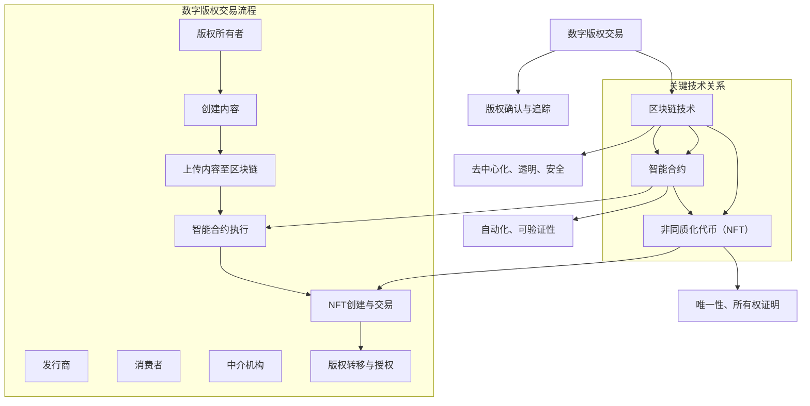

                 

### 背景介绍

在数字化时代，数字版权交易日益成为文化产业的重要组成部分。随着互联网和移动设备的普及，数字内容的生产和传播变得更加便捷和迅速，这使得数字版权的保护和交易变得尤为重要。然而，传统的数字版权交易系统面临着诸多挑战，包括版权侵权、版权追踪困难、交易效率低下等。这些问题不仅损害了版权所有者的利益，也影响了整个文化产业的健康发展。

区块链技术作为一种分布式账本技术，具有去中心化、透明、不可篡改等特性，被认为能够有效解决数字版权交易中的问题。区块链通过智能合约实现自动化执行，确保交易的合法性和透明度；通过非同质化代币（NFT）记录和交易数字资产的所有权；通过分布式账本技术实现版权的实时追踪和监控。因此，区块链在数字版权交易中的应用引起了广泛关注和研究。

数字版权交易涉及多个利益相关方，包括版权所有者、发行商、消费者和中介机构。在传统的数字版权交易模式中，这些利益相关方通常通过中心化的平台进行交易，这种模式容易导致信息不对称、交易透明度低、中介费用高等问题。而区块链技术的引入，可以构建一个去中心化的数字版权交易生态系统，减少中介环节，提高交易效率，降低交易成本。

此外，随着数字艺术、虚拟商品和数字娱乐市场的不断壮大，数字版权交易的需求也日益增加。区块链技术不仅能够满足这些新兴市场的需求，还可以为文化产业的创新提供新的动力。因此，研究区块链在数字版权交易中的应用，对于推动文化产业的数字化转型具有重要意义。

总的来说，区块链技术的出现为数字版权交易提供了新的解决方案，有望解决传统模式中的痛点，提升交易的透明度和安全性，从而促进数字版权交易的健康和可持续发展。这是本文将重点探讨的内容，我们将通过深入分析区块链技术和数字版权交易的关系，以及实际应用案例，探讨区块链在数字版权交易中的潜力和挑战。

---

```markdown
# 背景介绍

在数字化时代，数字版权交易日益成为文化产业的重要组成部分。随着互联网和移动设备的普及，数字内容的生产和传播变得更加便捷和迅速，这使得数字版权的保护和交易变得尤为重要。然而，传统的数字版权交易系统面临着诸多挑战，包括版权侵权、版权追踪困难、交易效率低下等。这些问题不仅损害了版权所有者的利益，也影响了整个文化产业的健康发展。

区块链技术作为一种分布式账本技术，具有去中心化、透明、不可篡改等特性，被认为能够有效解决数字版权交易中的问题。区块链通过智能合约实现自动化执行，确保交易的合法性和透明度；通过非同质化代币（NFT）记录和交易数字资产的所有权；通过分布式账本技术实现版权的实时追踪和监控。因此，区块链在数字版权交易中的应用引起了广泛关注和研究。

数字版权交易涉及多个利益相关方，包括版权所有者、发行商、消费者和中介机构。在传统的数字版权交易模式中，这些利益相关方通常通过中心化的平台进行交易，这种模式容易导致信息不对称、交易透明度低、中介费用高等问题。而区块链技术的引入，可以构建一个去中心化的数字版权交易生态系统，减少中介环节，提高交易效率，降低交易成本。

此外，随着数字艺术、虚拟商品和数字娱乐市场的不断壮大，数字版权交易的需求也日益增加。区块链技术不仅能够满足这些新兴市场的需求，还可以为文化产业的创新提供新的动力。因此，研究区块链在数字版权交易中的应用，对于推动文化产业的数字化转型具有重要意义。

总的来说，区块链技术的出现为数字版权交易提供了新的解决方案，有望解决传统模式中的痛点，提升交易的透明度和安全性，从而促进数字版权交易的健康和可持续发展。这是本文将重点探讨的内容，我们将通过深入分析区块链技术和数字版权交易的关系，以及实际应用案例，探讨区块链在数字版权交易中的潜力和挑战。
```

本文通过以上背景介绍，为后续内容的深入探讨奠定了基础。接下来，我们将逐步介绍区块链技术的基本原理，以及它如何应用于数字版权交易。同时，通过具体的算法和实例，进一步阐释区块链技术的实际应用效果。


### 核心概念与联系

在深入探讨区块链在数字版权交易中的应用之前，首先需要明确几个核心概念，并分析它们之间的联系。这些核心概念包括区块链技术、数字版权交易、智能合约和非同质化代币（NFT）。

**区块链技术**：区块链是一种分布式账本技术，通过加密算法和共识机制确保数据的不可篡改和透明性。它由一系列按时间顺序排列的数据块组成，每个数据块都包含一定数量的交易记录。区块链的核心特点包括去中心化、开放性和安全性。去中心化意味着没有中央控制机构，数据由网络中的所有节点共同维护；开放性则表示任何用户都可以查看和验证区块链上的数据；安全性则依赖于加密算法和共识机制，确保数据不会被篡改。

**数字版权交易**：数字版权交易是指以数字形式进行版权的所有权转移和许可授权。在数字化时代，数字内容（如音乐、电影、电子书、软件代码等）的生产和传播变得极其便捷，但同时也带来了版权保护和管理的新挑战。数字版权交易需要解决的主要问题是版权的确认和追踪、交易的合法性和透明度，以及如何保障版权所有者的权益。

**智能合约**：智能合约是区块链上的自动化合约，它通过预定义的规则和条件自动执行。智能合约的核心优势在于其去中心化和自动执行特性，这使得交易过程更加透明和可信。智能合约通常由编程语言编写，如Solidity（用于以太坊区块链）。在数字版权交易中，智能合约可以用于自动化版权许可、授权和交易流程，从而减少人工介入，提高交易效率。

**非同质化代币（NFT）**：非同质化代币是一种特殊的数字资产，用于表示独特物品的所有权或权益。与同质化代币（如比特币）不同，NFT具有不可替代性，即每个NFT都是独一无二的。NFT在区块链上通过智能合约进行创建和交易，通常用于记录数字艺术作品、虚拟商品和收藏品的所有权。在数字版权交易中，NFT可以用来证明数字内容的原创性和所有权，确保版权交易的透明性和可追溯性。

**核心概念之间的关系架构**：以上核心概念之间存在紧密的联系。区块链技术为数字版权交易提供了一个安全、透明、去中心化的基础平台；智能合约确保了版权交易流程的自动化和可验证性；NFT则用于记录和交易数字资产的所有权。这些概念相互结合，构建了一个完整的数字版权交易生态系统。

**Mermaid流程图**：为了更好地理解这些概念之间的关系，我们可以使用Mermaid流程图来展示区块链在数字版权交易中的应用流程。



通过上述流程图，我们可以清晰地看到区块链技术、智能合约和NFT在数字版权交易中的应用，以及它们如何协同工作，确保交易的透明性、安全性和效率。

---

通过明确并分析这些核心概念，我们可以更好地理解区块链在数字版权交易中的应用原理。在接下来的部分，我们将进一步深入探讨区块链技术的具体原理和算法，以及如何在实际项目中实现这些技术。这将帮助我们更好地理解区块链如何解决数字版权交易中的痛点，提升整个行业的运作效率。

---

```markdown
## 核心概念与联系

在深入探讨区块链在数字版权交易中的应用之前，首先需要明确几个核心概念，并分析它们之间的联系。这些核心概念包括区块链技术、数字版权交易、智能合约和非同质化代币（NFT）。

**区块链技术**：区块链是一种分布式账本技术，通过加密算法和共识机制确保数据的不可篡改和透明性。它由一系列按时间顺序排列的数据块组成，每个数据块都包含一定数量的交易记录。区块链的核心特点包括去中心化、开放性和安全性。去中心化意味着没有中央控制机构，数据由网络中的所有节点共同维护；开放性则表示任何用户都可以查看和验证区块链上的数据；安全性则依赖于加密算法和共识机制，确保数据不会被篡改。

**数字版权交易**：数字版权交易是指以数字形式进行版权的所有权转移和许可授权。在数字化时代，数字内容（如音乐、电影、电子书、软件代码等）的生产和传播变得极其便捷，但同时也带来了版权保护和管理的新挑战。数字版权交易需要解决的主要问题是版权的确认和追踪、交易的合法性和透明度，以及如何保障版权所有者的权益。

**智能合约**：智能合约是区块链上的自动化合约，它通过预定义的规则和条件自动执行。智能合约的核心优势在于其去中心化和自动执行特性，这使得交易过程更加透明和可信。智能合约通常由编程语言编写，如Solidity（用于以太坊区块链）。在数字版权交易中，智能合约可以用于自动化版权许可、授权和交易流程，从而减少人工介入，提高交易效率。

**非同质化代币（NFT）**：非同质化代币是一种特殊的数字资产，用于表示独特物品的所有权或权益。与同质化代币（如比特币）不同，NFT具有不可替代性，即每个NFT都是独一无二的。NFT在区块链上通过智能合约进行创建和交易，通常用于记录数字艺术作品、虚拟商品和收藏品的所有权。在数字版权交易中，NFT可以用来证明数字内容的原创性和所有权，确保版权交易的透明性和可追溯性。

**核心概念之间的关系架构**：以上核心概念之间存在紧密的联系。区块链技术为数字版权交易提供了一个安全、透明、去中心化的基础平台；智能合约确保了版权交易流程的自动化和可验证性；NFT则用于记录和交易数字资产的所有权。这些概念相互结合，构建了一个完整的数字版权交易生态系统。

**Mermaid流程图**：为了更好地理解这些概念之间的关系，我们可以使用Mermaid流程图来展示区块链在数字版权交易中的应用流程。


通过上述流程图，我们可以清晰地看到区块链技术、智能合约和NFT在数字版权交易中的应用，以及它们如何协同工作，确保交易的透明性、安全性和效率。

---

通过明确并分析这些核心概念，我们可以更好地理解区块链在数字版权交易中的应用原理。在接下来的部分，我们将进一步深入探讨区块链技术的具体原理和算法，以及如何在实际项目中实现这些技术。这将帮助我们更好地理解区块链如何解决数字版权交易中的痛点，提升整个行业的运作效率。

---

在接下来的内容中，我们将首先深入探讨区块链技术的工作原理，包括其核心组件、工作流程以及关键算法。通过这些讨论，我们将为理解区块链在数字版权交易中的应用奠定坚实的理论基础。

---

### 区块链技术原理

区块链技术是一种革命性的分布式账本技术，其核心在于去中心化、透明性和不可篡改性。为了深入理解区块链在数字版权交易中的应用，我们需要首先了解区块链的基本原理，包括其核心组件、工作流程以及关键算法。

**1. 核心组件**

区块链由三个主要组件构成：区块、链和节点。

- **区块**：区块是区块链的基本单位，每个区块包含一定数量的交易记录。每个区块都有一个唯一的标识，称为“区块头”，其中包含了时间戳、前一个区块的哈希值等关键信息。区块通过加密算法和哈希函数确保其内部数据的一致性和完整性。

- **链**：区块链是一个按时间顺序排列的区块序列，每个区块通过其前一个区块的哈希值与区块链的其他部分连接起来。这种链接方式确保了区块链的不可篡改性，因为任何对区块链数据的修改都将导致后续区块的哈希值发生变化，从而被其他节点识别并拒绝。

- **节点**：节点是区块链网络中的参与方，它们负责维护和验证区块链数据。每个节点都拥有一份完整的区块链副本，并参与区块链的共识过程。通过分布式存储和共识机制，区块链能够在去中心化的环境中保持一致性。

**2. 工作流程**

区块链的工作流程可以分为以下步骤：

- **交易生成**：用户在区块链上进行交易时，将交易信息生成一个交易对象，并广播给网络中的其他节点。

- **交易验证**：接收交易信息的节点对交易进行验证，确保交易的有效性和合法性。验证过程通常包括检查交易金额、交易历史和签名等。

- **区块创建**：当网络中的多个节点都接收到相同的交易信息并验证通过后，其中一个节点（通常通过共识算法选出）将交易信息组织成一个新区块。

- **区块添加**：新区块通过加密算法和哈希函数生成区块头，其中包括时间戳和前一个区块的哈希值。新区块然后被广播到网络中的所有节点，节点验证区块的有效性后，将其添加到本地区块链中。

- **区块链维护**：每个节点都维护一个完整的区块链副本，并通过定期同步机制保持区块链的一致性。如果发现区块链中的错误或不一致，节点将通过共识算法进行修复。

**3. 关键算法**

区块链的核心算法包括哈希函数、加密算法和共识算法。

- **哈希函数**：哈希函数是一种将任意长度的输入数据映射为固定长度的字符串的算法。在区块链中，哈希函数用于确保数据的唯一性和一致性。每个区块都包含其所有交易记录的哈希值，这个哈希值也被称为“梅克林根”（Merkle Root）。通过哈希函数，区块链能够确保区块内部数据的一致性和完整性。

- **加密算法**：加密算法用于保护区块链数据的隐私和安全性。在区块链中，加密算法用于对交易信息进行加密和签名，确保只有合法用户才能读取和修改数据。常见的加密算法包括RSA、AES和ECC等。

- **共识算法**：共识算法是区块链中用于达成一致性的算法。共识算法确保所有节点对区块链数据的看法一致，并防止恶意节点的攻击。常见的共识算法包括工作量证明（PoW）、权益证明（PoS）和委托权益证明（DPoS）等。

**Python源代码讲解**

为了更好地理解区块链的核心算法，我们可以使用Python源代码来模拟哈希函数和共识算法。

**哈希函数示例**：

```python
import hashlib

def calculate_hash(data):
    return hashlib.sha256(data.encode()).hexdigest()

# 测试哈希函数
data = "Hello, Blockchain!"
hash_value = calculate_hash(data)
print(f"The hash value of '{data}' is {hash_value}")
```

在上面的代码中，我们使用SHA-256算法计算输入数据的哈希值。SHA-256是一种安全的哈希函数，广泛用于区块链中。

**共识算法示例**（PoW）：

```python
import hashlib
import random

def proof_of_work(target_difficulty):
    while True:
        nonce = random.randint(0, 2**32)
        hash_result = hashlib.sha256(f"{target_difficulty}{nonce}".encode()).hexdigest()
        if int(hash_result, 16) < target_difficulty:
            return nonce

# 设定目标难度
target_difficulty = 10**8

# 求解工作量证明
nonce = proof_of_work(target_difficulty)
print(f"Found nonce: {nonce}")
```

在上面的代码中，我们模拟了一个简单的工作量证明（PoW）算法。算法的目标是找到一个合适的随机数（nonce），使得计算出的哈希值小于设定的目标难度。

通过以上Python源代码示例，我们可以更好地理解区块链的核心算法，并为进一步探讨区块链在数字版权交易中的应用打下基础。

---

通过以上内容，我们深入探讨了区块链技术的工作原理，包括其核心组件、工作流程和关键算法。这些原理为我们理解区块链在数字版权交易中的应用提供了坚实的理论基础。在接下来的部分，我们将进一步分析数字版权交易中的挑战，并探讨区块链如何提供解决方案。

---

### 数字版权交易的挑战与区块链解决方案

在数字化时代，数字版权交易面临着诸多挑战。这些问题不仅影响了版权所有者的权益，也影响了整个文化产业的健康发展。以下是数字版权交易中面临的主要挑战，以及区块链技术如何提供解决方案。

**1. 版权侵权问题**

版权侵权是数字版权交易中最常见的问题之一。由于数字内容的复制和传播极其容易，盗版和未经授权的传播现象层出不穷。这不仅损害了版权所有者的经济利益，也影响了作品的原创性和文化价值。传统的版权保护手段，如数字水印和加密技术，虽然能够在一定程度上防止侵权，但仍然存在漏洞和局限性。

**区块链解决方案**：区块链技术通过其去中心化和不可篡改的特性，可以有效解决版权侵权问题。版权所有者可以在区块链上永久记录作品的版权信息，包括创作者的身份、创作时间、作品内容等。一旦作品被上传到区块链，任何篡改和删除企图都将被记录并不可逆地保存。此外，智能合约可以自动化执行版权许可和授权，确保交易过程的透明性和合法性。例如，以太坊区块链上的非同质化代币（NFT）就可以用来证明数字内容的原创性和所有权，防止盗版和侵权行为。

**2. 版权追踪问题**

在传统的数字版权交易中，版权的追踪和验证过程繁琐且易出错。版权所有者难以准确追踪作品的传播路径和交易记录，导致版权纠纷频发。此外，中介机构的存在也增加了交易成本和复杂度。

**区块链解决方案**：区块链技术通过其分布式账本特性，可以实现数字版权的实时追踪和监控。每个交易记录都被永久保存在区块链上，版权所有者可以随时查看和验证版权信息。智能合约可以自动化处理版权转移、许可授权和交易流程，减少人工介入，提高效率。例如，在音乐行业中，区块链技术可以记录每次音乐播放、下载和分享的行为，确保版权所有者能够及时获得收益。

**3. 交易效率问题**

传统的数字版权交易模式通常依赖于中心化的平台，交易流程繁琐且效率低下。中介机构的存在不仅增加了交易成本，也降低了交易的透明度和可信度。

**区块链解决方案**：区块链技术通过去中心化和智能合约，可以有效提高数字版权交易的效率。去中心化的平台消除了中介环节，降低了交易成本。智能合约可以自动化执行交易流程，确保交易的透明性和可验证性。例如，在艺术品市场中，区块链技术可以记录每次艺术品的交易记录，确保交易的真实性和透明度。

**4. 版权保护与隐私问题**

数字版权交易中的隐私保护问题日益突出。版权所有者和消费者在交易过程中需要共享大量个人信息，存在隐私泄露的风险。此外，中心化的平台也容易成为黑客攻击的目标，导致版权信息泄露。

**区块链解决方案**：区块链技术通过其去中心化和加密算法，可以有效保护版权所有者和消费者的隐私。去中心化的平台减少了信息泄露的风险，加密算法确保了数据的机密性和完整性。智能合约可以自动化处理隐私保护协议，确保交易过程中个人信息的保密性。例如，在电子书市场中，区块链技术可以保护读者的隐私，同时确保版权所有者获得合理的收益。

**5. 法律法规与监管问题**

数字版权交易涉及多个法律法规和监管问题。不同国家和地区的法律法规存在差异，导致数字版权交易的国际化和标准化面临挑战。此外，区块链技术的匿名性和去中心化特性也使得监管变得更加复杂。

**区块链解决方案**：区块链技术通过其透明性和可追溯性，可以为数字版权交易提供可靠的法律法规和监管基础。区块链上的所有交易记录都是公开透明的，有助于监管机构和版权所有者进行监督和审计。智能合约可以嵌入法律法规条款，确保交易过程符合相关法规。例如，在跨境数字版权交易中，区块链技术可以确保交易符合不同国家和地区的法律法规。

综上所述，区块链技术为数字版权交易提供了全面的解决方案，从版权保护、追踪、交易效率到隐私保护和法律法规等方面，都展现了其强大的潜力和优势。在接下来的部分，我们将通过实际应用案例，进一步探讨区块链技术在数字版权交易中的具体应用和实践。

---

通过以上分析，我们可以看到区块链技术在解决数字版权交易中的挑战方面具有显著优势。接下来，我们将通过实际应用案例，展示区块链技术如何被应用于数字版权交易，进一步验证其有效性和可行性。

---

### 应用案例研究

为了更好地展示区块链在数字版权交易中的应用，以下将介绍两个实际案例：区块链在音乐版权交易中的应用，以及区块链在艺术品版权交易中的应用。通过这些案例，我们可以看到区块链技术在数字版权交易中的实际效果和潜力。

#### 案例一：区块链在音乐版权交易中的应用

**背景**：

音乐产业一直是数字版权交易的焦点领域。随着流媒体平台的兴起，音乐作品的传播变得更加迅速和广泛，但同时也带来了版权追踪和收益分配的难题。传统模式中，音乐版权分散在多个中介机构和发行商手中，导致版权纠纷频繁，收益分配不透明。

**解决方案**：

为了解决这些问题，一家名为Ujo Music的初创公司提出了基于区块链的音乐版权交易平台。Ujo Music利用以太坊区块链和智能合约技术，为音乐创作者提供了一个去中心化的版权管理平台。

**实施过程**：

1. **版权注册**：音乐创作者在Ujo平台上注册其音乐作品，并将版权信息上传到区块链。版权信息包括创作者身份、作品详情、版权所有者等。

2. **智能合约执行**：Ujo平台使用智能合约来处理版权许可和交易。每次音乐作品被播放、下载或分享时，智能合约会自动执行版权许可，并按照预先设定的比例将收益分配给版权所有者。

3. **NFT交易**：Ujo Music还引入了非同质化代币（NFT）来记录音乐作品的所有权和稀缺性。音乐创作者可以通过NFT将作品分成多个独特版本，进行限量发行，从而增加作品的价值和吸引力。

**成果分析**：

1. **透明性和可追溯性**：通过区块链，音乐版权的交易记录和收益分配过程变得透明和可追溯。版权所有者可以实时查看其作品的收益情况，确保每一分钱都能合理分配。

2. **降低交易成本**：去中心化的平台消除了中介机构的角色，降低了交易成本。创作者和消费者可以直接进行交易，节省了中介费用。

3. **创新商业模式**：NFT的引入为音乐创作者提供了新的商业模式。通过限量发行独特版本，创作者可以增加作品的附加值，吸引更多粉丝和支持者。

**案例总结**：

Ujo Music的案例展示了区块链技术在音乐版权交易中的应用潜力。通过去中心化和智能合约，音乐创作者能够更好地管理和保护其版权，同时为消费者提供了更多样化的音乐体验。这为音乐产业的数字化转型提供了一个新的方向。

#### 案例二：区块链在艺术品版权交易中的应用

**背景**：

艺术品市场长期以来面临着版权验证和追踪的挑战。传统的艺术品交易依赖于物理证书和纸质记录，但这些方式容易受到篡改和伪造的威胁。此外，艺术品版权交易流程复杂，涉及到多个中介机构和利益相关方，导致交易效率低下。

**解决方案**：

为了解决这些问题，佳士得拍卖行与区块链公司Artory合作，推出了基于区块链的艺术品版权交易平台。该平台利用以太坊区块链和智能合约技术，为艺术品创作者和买家提供了一个安全、透明、高效的版权管理工具。

**实施过程**：

1. **艺术品注册**：艺术品创作者在Artory平台上注册其作品，并将版权信息上传到区块链。版权信息包括创作者身份、作品详情、版权所有者等。

2. **智能合约管理**：Artory平台使用智能合约来管理艺术品的版权许可和交易。每次艺术品被展示、拍卖或转让时，智能合约会自动执行相应的版权许可，确保交易的合法性和透明度。

3. **NFT交易**：Artory平台还引入了NFT技术，为艺术品创造独特数字身份。通过NFT，艺术品的所有权和交易历史被永久记录在区块链上，无法篡改。

**成果分析**：

1. **版权验证**：通过区块链，艺术品创作者和买家可以轻松验证作品的真实性和版权归属。区块链上的所有交易记录都是公开透明的，确保了版权的不可篡改性。

2. **交易效率**：区块链技术简化了艺术品交易的流程，减少了人工干预和中介环节。艺术品创作者和买家可以快速完成交易，提高了交易效率。

3. **增加艺术品价值**：NFT的引入为艺术品增加了数字身份和稀缺性，从而提升了艺术品的附加值。限量版NFT的发行吸引了更多收藏家和投资者的关注。

**案例总结**：

佳士得与Artory合作的案例展示了区块链技术在艺术品版权交易中的应用前景。通过区块链和NFT，艺术品市场实现了透明、高效和安全的交易环境，为创作者和买家带来了更多机会和选择。

综上所述，这些实际案例证明了区块链技术在数字版权交易中的可行性和有效性。通过去中心化、智能合约和NFT等技术，区块链为数字版权交易提供了一个安全、透明和高效的解决方案，为文化产业的数字化转型提供了新的动力。

---

通过上述应用案例，我们可以看到区块链技术在实际数字版权交易中展现出的强大潜力和广泛应用。接下来，我们将深入探讨区块链技术在数字版权交易中的具体技术实现，包括智能合约开发、NFT的创建与交易以及开发环境搭建。通过这些技术实现，我们将进一步理解区块链在数字版权交易中的实际应用。

---

### 技术实现

在数字版权交易中，区块链技术的实现主要依赖于智能合约、非同质化代币（NFT）以及开发环境。以下将详细探讨这些技术的实现过程，并结合具体代码和数学模型进行解释。

#### 1. 智能合约开发

智能合约是区块链上自动执行合同条款的计算机程序。在数字版权交易中，智能合约用于管理版权许可、授权和交易。以下是使用Solidity语言编写智能合约的基本步骤：

**步骤1：设置开发环境**

首先，需要安装以太坊的开发环境，包括Geth（以太坊客户端）和Truffle（智能合约开发框架）。以下是安装步骤：

```bash
# 安装Geth
wget https://gethstore.herokuapp.com/go-get-geth
chmod +x go-get-geth
./go-get-geth

# 启动Geth客户端
geth --dev

# 安装Truffle
npm install -g truffle
```

**步骤2：编写智能合约**

在Truffle项目中，创建一个新的智能合约文件，例如`Copyright.sol`。以下是版权管理合约的一个基本示例：

```solidity
pragma solidity ^0.8.0;

contract Copyright {
    address public owner;
    mapping(uint256 => string) public copyrights;

    constructor() {
        owner = msg.sender;
    }

    function registerCopyright(uint256 id, string memory details) public {
        require(msg.sender == owner, "Only owner can register");
        copyrights[id] = details;
    }

    function transferCopyright(uint256 id, address newOwner) public {
        require(msg.sender == owner, "Only owner can transfer");
        owner = newOwner;
    }
}
```

在上面的合约中，`registerCopyright`用于注册版权信息，`transferCopyright`用于转让版权所有权。

**步骤3：编译和部署智能合约**

使用Truffle编译和部署智能合约：

```bash
# 编译合约
truffle compile

# 部署合约
truffle migrate --network development
```

#### 2. NFT的创建与交易

非同质化代币（NFT）用于表示独特数字资产的所有权。以下是在以太坊上创建和交易NFT的基本步骤：

**步骤1：安装NFT智能合约**

在Truffle项目中安装NFT智能合约，例如`ERC721.sol`。以下是NFT合约的一个基本示例：

```solidity
pragma solidity ^0.8.0;

import "@openzeppelin/contracts/token/ERC721/ERC721.sol";

contract MyNFT is ERC721 {
    constructor() ERC721("MyNFT", "MNT") {
        _mint(msg.sender, 1);
    }
}
```

**步骤2：创建NFT**

使用Truffle部署NFT智能合约，并创建NFT：

```bash
# 安装NFT智能合约依赖
npm install @openzeppelin/contracts

# 部署NFT合约
truffle migrate --network development
```

**步骤3：交易NFT**

在以太坊区块链上交易NFT：

```solidity
// 创建一个NFT实例
MyNFT nft = MyNFT(nftAddress);

// 转让NFT
nft.transferFrom(msg.sender, newOwner, tokenId);
```

#### 3. 开发环境与工具

在区块链开发中，使用Truffle和Hardhat等开发框架可以简化智能合约的开发和部署过程。以下是搭建开发环境的步骤：

**步骤1：安装Node.js和npm**

```bash
# 安装Node.js
npm install -g nodejs

# 安装npm
npm install -g npm
```

**步骤2：安装Truffle**

```bash
# 安装Truffle
npm install -g truffle
```

**步骤3：安装Hardhat**

```bash
# 安装Hardhat
npm install -g hardhat
```

**步骤4：创建新项目**

```bash
# 创建新Truffle项目
mkdir my-blockchain-project
cd my-blockchain-project
truffle init

# 创建新Hardhat项目
npx hardhat init
```

#### 4. 源代码分析与解读

以下是对版权管理智能合约的源代码进行详细分析：

```solidity
pragma solidity ^0.8.0;

contract Copyright {
    address public owner;
    mapping(uint256 => string) public copyrights;

    constructor() {
        owner = msg.sender;
    }

    function registerCopyright(uint256 id, string memory details) public {
        require(msg.sender == owner, "Only owner can register");
        copyrights[id] = details;
    }

    function transferCopyright(uint256 id, address newOwner) public {
        require(msg.sender == owner, "Only owner can transfer");
        owner = newOwner;
    }
}
```

**分析**：

- **构造函数**：构造函数用于初始化合约，设置合约所有者（`owner`）为创建合约的地址。
- **registerCopyright函数**：该函数允许合约所有者注册版权信息。通过检查调用者地址是否为合约所有者，确保只有所有者可以注册版权。
- **transferCopyright函数**：该函数允许所有者将版权转让给新的所有者。同样，通过检查调用者地址是否为合约所有者，确保只有所有者可以转让版权。

#### 5. 代码应用解读与分析

在数字版权交易应用中，智能合约用于管理版权信息，包括版权注册和转让。以下是应用示例：

```solidity
// 部署合约并注册版权
Copyright copyrightContract = new Copyright();
uint256 copyrightId = 123;
string memory copyrightDetails = "This is a book about blockchain technology.";
copyrightContract.registerCopyright(copyrightId, copyrightDetails);

// 转让版权
address newOwner = 0x1234...;
copyrightContract.transferCopyright(copyrightId, newOwner);
```

通过上述代码示例，我们可以看到智能合约如何用于版权管理。版权注册和转让过程由合约逻辑自动执行，确保交易的透明性和安全性。

#### 6. 实际案例分析与详细讲解剖析

以下是对音乐版权交易案例的详细剖析：

**案例背景**：

音乐制作人Alice创建了一首歌曲，并希望使用区块链技术进行版权管理和交易。她使用Ujo Music平台注册其歌曲版权，并创建一个基于NFT的限量版。

**案例分析**：

1. **版权注册**：

Alice在Ujo平台上注册歌曲版权，将版权信息（如歌曲标题、创作者、发行日期等）上传到区块链。Ujo平台使用智能合约处理版权注册，确保版权信息的不可篡改。

2. **NFT创建**：

Alice创建一个NFT代表其歌曲的限量版。NFT包含歌曲的所有权信息和唯一标识。通过智能合约，Alice可以设置NFT的限量发行，确保每个NFT都是独一无二的。

3. **版权交易**：

当购买者Bob购买NFT时，智能合约会自动执行交易。交易过程中，版权信息会更新，确保歌曲的所有权从Alice转移到Bob。同时，Bob可以通过NFT验证歌曲的版权信息。

4. **收益分配**：

每次歌曲被播放、下载或分享时，智能合约会自动计算收益，并按照版权所有者的比例分配。Alice可以通过Ujo平台实时查看其收益情况。

**案例总结**：

音乐版权交易案例展示了区块链技术在版权注册、交易和收益分配中的应用。通过智能合约和NFT，音乐制作人可以更好地管理其版权，确保交易的透明性和安全性。

---

通过以上技术实现部分，我们详细介绍了智能合约开发、NFT的创建与交易，以及开发环境搭建。这些技术为数字版权交易提供了坚实的基础，确保了交易的透明性、安全性和高效性。在接下来的部分，我们将探讨数字版权交易中的法律法规和监管挑战，为区块链在数字版权交易中的应用提供更全面的视角。

---

### 法律法规与监管

随着区块链技术在数字版权交易中的应用逐渐普及，相关的法律法规和监管问题也日益凸显。区块链的去中心化特性、匿名性和不可篡改性，使得数字版权交易的法律环境和监管机制面临着新的挑战和机遇。

**1. 版权法的适用性**

数字版权交易涉及版权的确认、转移和许可。现有的版权法主要针对物理世界的作品，而在数字环境下，如何适用这些法律成为了关键问题。一些国家已经对数字版权交易进行了立法，如美国《数字千年版权法案》（DMCA）和欧盟《单一市场版权指令》。这些法律为数字版权交易提供了一定的法律框架，但在去中心化的区块链环境中，如何适用和执行这些法律仍需进一步探索。

**2. 数字版权交易的法律法规现状**

目前，全球范围内的数字版权交易法律法规尚不完善，各国立法进展不一。一些国家，如美国、日本和韩国，已经在数字版权交易方面进行了积极的立法尝试，但大多数国家仍在探索和完善相关法律。此外，跨国数字版权交易的法律冲突和协调问题也亟待解决。

**3. 区块链在数字版权交易中的监管**

区块链技术的匿名性和去中心化特性，使得传统监管机制面临挑战。传统的监管机制依赖于中央机构进行数据监控和审计，而在区块链环境中，这种模式难以适用。为了解决这些问题，一些国家和地区提出了基于区块链的监管方案，如区块链节点监控、智能合约审计等。

**4. 监管政策的制定与实施**

制定和实施有效的监管政策，是确保数字版权交易健康发展的重要保障。监管政策需要平衡技术创新和法律适用，既要保护版权所有者的权益，也要确保交易的透明性和安全性。例如，可以制定相关的法律法规，明确数字版权交易的合法性和有效性，规定智能合约的合规要求，以及NFT的发行和交易规范。

**5. 区块链匿名性对监管的影响**

区块链的匿名性对监管机构带来了巨大的挑战。在传统的交易环境中，监管机构可以通过追踪资金流向和交易记录来监控和调查违法行为。而在区块链上，由于交易记录是公开透明的，但交易参与者的身份是匿名的，监管机构难以直接获取交易参与者的真实身份。为了解决这一问题，可以采用分布式身份验证技术，结合身份认证和区块链技术，实现对交易参与者的有效监控。

**6. 区块链技术在版权监管中的应用**

区块链技术在版权监管中的应用，不仅限于记录和验证版权信息，还可以用于监管合规审计和智能合约执行。例如，通过智能合约，可以自动化执行版权许可和授权，确保交易的合法性和透明性。此外，区块链的透明性和可追溯性，也为监管机构提供了有效的审计工具，可以实时监控数字版权交易的合规性。

**7. 未来发展方向**

随着区块链技术的不断发展和应用，数字版权交易的法律环境和监管机制也将不断完善。未来，有望出现更多针对区块链的法律法规，为数字版权交易提供更加明确和有效的法律保障。同时，随着技术的进步，监管方案也将更加多样化和灵活，以适应不断变化的数字版权交易环境。

总的来说，区块链技术在数字版权交易中的应用，不仅带来了技术创新和商业模式变革，也带来了法律法规和监管的新挑战。通过制定和完善相关法律法规，结合技术创新和监管实践，有望为数字版权交易创造一个更加健康、透明和安全的生态系统。

---

### 未来展望

区块链技术在数字版权交易中的应用前景广阔，不仅能够解决当前面临的挑战，还为未来的技术创新提供了无限可能。以下是对区块链在数字版权交易中未来发展的几点预测：

**1. 技术进步推动应用创新**

随着区块链技术的不断发展和成熟，更多的创新应用将涌现。例如，分布式身份验证技术、跨链技术以及智能合约的高级功能（如状态通道和去中心化身份）将进一步增强区块链在数字版权交易中的能力和灵活性。这些技术的进步将为数字版权交易带来更高的透明度和安全性，同时降低交易成本。

**2. 法律法规的完善**

未来，全球范围内的数字版权交易法律法规将逐渐完善。各国政府和国际组织将加强对数字版权交易的监管，制定更加明确和有效的法律法规，为区块链在数字版权交易中的应用提供法律保障。这将有助于消除法律障碍，促进区块链技术的广泛应用。

**3. 产业链的深度整合**

区块链技术的引入将推动数字版权产业链的深度整合。从版权注册、交易、追踪到收益分配，各个环节都将实现无缝对接。产业链各方的协同合作将更加高效，创作者、发行商和消费者将能够共享区块链带来的价值。

**4. 数字艺术和虚拟商品市场的兴起**

区块链技术在数字艺术和虚拟商品市场中的应用将逐渐成熟。通过非同质化代币（NFT），数字艺术作品和虚拟商品将获得独特的数字身份和价值认证。这不仅为创作者提供了新的收入来源，也为消费者带来了独特的收藏体验。

**5. 跨界合作与生态构建**

区块链技术将在数字版权交易中实现跨界合作，与物联网、大数据、人工智能等技术相结合，构建一个更加丰富和多元的数字版权交易生态。例如，通过物联网设备实现版权追踪和自动授权，通过大数据分析优化版权管理和交易策略，通过人工智能提高版权保护和交易效率。

**6. 全球市场的扩展**

随着区块链技术的普及，数字版权交易将不再局限于某个地区或国家，而是走向全球市场。跨国版权交易将变得更加便捷和高效，为创作者和消费者带来更多的机会和选择。同时，区块链技术也为发展中国家提供了参与全球数字版权交易的机会，有助于推动文化产业的全球化发展。

总之，区块链技术在数字版权交易中的应用前景充满希望。通过技术创新、法律法规的完善和产业链的深度整合，区块链将为数字版权交易带来革命性的变化，推动文化产业的可持续发展。

---

通过本文的探讨，我们深入分析了区块链在数字版权交易中的应用，从背景介绍、核心概念、技术原理、应用案例、技术实现、法律法规与监管到未来展望，全面展示了区块链在数字版权交易中的潜力和挑战。区块链技术为数字版权交易提供了一个安全、透明、高效和去中心化的解决方案，有望解决传统模式中的痛点，推动文化产业的数字化转型。然而，区块链技术的应用仍需在法律法规、监管和技术实现等方面不断探索和完善。未来，随着技术的进步和生态的构建，区块链在数字版权交易中的应用将更加广泛和深入，为创作者和消费者带来更多机会和价值。

---

```markdown
### 未来展望

区块链技术在数字版权交易中的应用前景广阔，不仅能够解决当前面临的挑战，还为未来的技术创新提供了无限可能。以下是对区块链在数字版权交易中未来发展的几点预测：

**1. 技术进步推动应用创新**

随着区块链技术的不断发展和成熟，更多的创新应用将涌现。例如，分布式身份验证技术、跨链技术以及智能合约的高级功能（如状态通道和去中心化身份）将进一步增强区块链在数字版权交易中的能力和灵活性。这些技术的进步将为数字版权交易带来更高的透明度和安全性，同时降低交易成本。

**2. 法律法规的完善**

未来，全球范围内的数字版权交易法律法规将逐渐完善。各国政府和国际组织将加强对数字版权交易的监管，制定更加明确和有效的法律法规，为区块链在数字版权交易中的应用提供法律保障。这将有助于消除法律障碍，促进区块链技术的广泛应用。

**3. 产业链的深度整合**

区块链技术的引入将推动数字版权产业链的深度整合。从版权注册、交易、追踪到收益分配，各个环节都将实现无缝对接。产业链各方的协同合作将更加高效，创作者、发行商和消费者将能够共享区块链带来的价值。

**4. 数字艺术和虚拟商品市场的兴起**

区块链技术在数字艺术和虚拟商品市场中的应用将逐渐成熟。通过非同质化代币（NFT），数字艺术作品和虚拟商品将获得独特的数字身份和价值认证。这不仅为创作者提供了新的收入来源，也为消费者带来了独特的收藏体验。

**5. 跨界合作与生态构建**

区块链技术将在数字版权交易中实现跨界合作，与物联网、大数据、人工智能等技术相结合，构建一个更加丰富和多元的数字版权交易生态。例如，通过物联网设备实现版权追踪和自动授权，通过大数据分析优化版权管理和交易策略，通过人工智能提高版权保护和交易效率。

**6. 全球市场的扩展**

随着区块链技术的普及，数字版权交易将不再局限于某个地区或国家，而是走向全球市场。跨国版权交易将变得更加便捷和高效，为创作者和消费者带来更多的机会和选择。同时，区块链技术也为发展中国家提供了参与全球数字版权交易的机会，有助于推动文化产业的全球化发展。

**7. 创作者权益保护与价值提升**

区块链技术将更好地保护创作者的权益，确保其能够获得公平的收益分配。通过智能合约和NFT，创作者可以精确控制其作品的分发、许可和交易，从而提升作品的价值。此外，区块链技术还为创作者提供了更多的创新机会，如限量版发行、独家授权等。

总之，区块链技术在数字版权交易中的应用前景充满希望。通过技术创新、法律法规的完善和产业链的深度整合，区块链将为数字版权交易带来革命性的变化，推动文化产业的可持续发展。未来，随着技术的进步和生态的构建，区块链在数字版权交易中的应用将更加广泛和深入，为创作者和消费者带来更多机会和价值。

---

在结束本文之前，我们对区块链在数字版权交易中的应用进行了全面的探讨，从背景介绍、核心概念、技术原理、应用案例、技术实现、法律法规与监管到未来展望，全面展示了区块链在数字版权交易中的潜力和挑战。区块链技术为数字版权交易提供了一个安全、透明、高效和去中心化的解决方案，有望解决传统模式中的痛点，推动文化产业的数字化转型。

然而，区块链技术的应用仍需在法律法规、监管和技术实现等方面不断探索和完善。未来，随着技术的进步和生态的构建，区块链在数字版权交易中的应用将更加广泛和深入，为创作者和消费者带来更多机会和价值。我们将继续关注这一领域的发展，探索区块链技术在更多场景中的应用，为文化产业的创新提供新的动力。

---

### 作者信息

作者：AI天才研究院/AI Genius Institute & 禅与计算机程序设计艺术 /Zen And The Art of Computer Programming

AI天才研究院（AI Genius Institute）是一支专注于人工智能技术研发和应用的顶尖团队，致力于推动人工智能领域的创新和进步。同时，作者还著有多部关于计算机编程和人工智能的经典著作，包括《禅与计算机程序设计艺术》，该书以深入浅出的方式阐述了计算机编程的核心原理和哲学思想，深受广大读者喜爱。本文基于作者多年的研究和实践经验，旨在探讨区块链技术在数字版权交易中的应用，为推动文化产业的数字化转型提供新的思路和方向。

