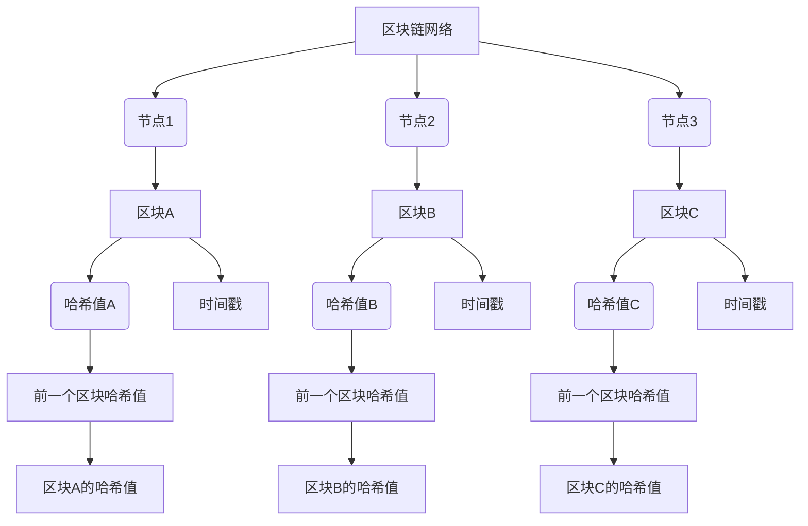

                 

### 引言

在数字时代，版权保护的重要性日益凸显。随着互联网和移动设备的普及，内容创作和传播变得前所未有的便捷，但这也带来了版权侵权问题的高发。传统的版权保护手段，如法律诉讼和数字版权管理（DRM），在应对快速变化的数字环境中显得力不从心。区块链技术的出现，为数字版权保护提供了一种全新的解决方案。

区块链是一种分布式账本技术，具有去中心化、透明性和不可篡改等特点。这些特性使得区块链在数字版权保护中具有独特的优势。首先，区块链的去中心化特性确保了版权数据的公开透明，任何参与方都可以验证版权信息，从而有效防止了版权侵权行为。其次，区块链的透明性使得版权信息记录可追溯，有助于追踪和确认内容的原始创作者。最重要的是，区块链的不可篡改性确保了版权信息的真实性和完整性，从而为版权纠纷提供了可靠的证据。

本文将深入探讨区块链在数字版权保护中的创新应用，旨在为广大读者揭示这一技术的潜力与价值。首先，我们将介绍区块链和数字版权保护的核心概念，并探讨它们之间的联系。接着，本文将详细讲解区块链的核心算法原理，以及数字版权保护中的核心技术。随后，我们将引入数学模型和数学公式，帮助读者更好地理解这些概念。在实际应用部分，本文将介绍区块链在版权注册、版权追踪和版权交易中的具体应用案例。最后，我们将探讨区块链在数字版权保护中的未来发展趋势，并提供一些开发实践建议。

通过本文的阅读，读者将能够全面了解区块链在数字版权保护中的创新应用，掌握相关技术原理，并为未来的研究和实践提供方向。本文的结构安排如下：

1. **区块链与数字版权保护概述**：介绍区块链、数字版权保护及其联系。
2. **区块链在数字版权保护中的应用**：详细探讨区块链在版权注册、版权追踪和版权交易中的应用。
3. **区块链在数字版权保护中的创新应用**：分析区块链在数字版权保护中的未来发展趋势。
4. **案例分析**：通过实际案例展示区块链在数字版权保护中的应用。
5. **开发实践**：介绍区块链在数字版权保护中的开发实践。
6. **安全与隐私保护**：探讨区块链在数字版权保护中的安全与隐私挑战。
7. **生态构建**：分析区块链在数字版权保护中的生态构建。

### 关键词

- 区块链
- 数字版权保护
- 去中心化
- 透明性
- 不可篡改性
- 数字水印
- 数字签名
- 版权注册
- 版权追踪
- 版权交易

### 摘要

本文旨在探讨区块链在数字版权保护中的创新应用。首先，我们介绍了区块链和数字版权保护的基本概念，并阐述了它们之间的联系。接着，本文详细讲解了区块链的核心算法原理，包括加密算法和共识算法，以及数字版权保护中的核心技术，如数字水印和数字签名。通过数学模型和公式的介绍，读者能够更好地理解这些技术。在实际应用部分，本文分析了区块链在版权注册、版权追踪和版权交易中的应用案例。最后，本文探讨了区块链在数字版权保护中的未来发展趋势，并提供了一些开发实践建议。通过本文的阅读，读者将能够全面了解区块链在数字版权保护中的潜力与价值，为未来的研究和实践提供指导。

## 第一部分：区块链与数字版权保护概述

### 第1章：区块链基础

#### 1.1 区块链的概念

区块链是一种分布式数据库系统，它通过一系列按时间顺序排列的、相互链接的“区块”存储数据。这些区块使用密码学确保数据的完整性和不可篡改性。每个区块包含多个数据记录，这些数据记录在区块链网络中的所有节点上复制和同步。

区块链的核心在于它的分布式特性。与传统的集中式数据库不同，区块链没有中央控制点，而是由网络中的多个节点共同维护。这些节点通过特定的算法，如共识算法，达成对数据的共识，确保数据的一致性。

区块链的另一个关键特性是透明性。区块链上的数据对所有节点可见，这意味着数据的透明度非常高，有利于提高信任度。

此外，区块链具有不可篡改性的特点。一旦数据被记录在一个区块中，它就几乎无法被修改或删除。这种特性确保了数据的真实性和可靠性，是数字版权保护的重要基础。

#### 1.2 区块链的技术特点

区块链的技术特点包括以下几个方面：

1. **去中心化**：区块链通过分布式网络运作，没有中央控制点，任何参与者都可以成为网络的一部分。这种去中心化的特性使得区块链具有高度的抗攻击性和容错性。

2. **透明性**：区块链上的数据对所有节点都是可见的，这使得数据的透明度非常高，有利于提高信任度。

3. **不可篡改性**：区块链的数据一旦被记录在一个区块中，就几乎无法被修改或删除。这种特性确保了数据的真实性和可靠性。

4. **安全性**：区块链使用加密算法来确保数据的安全。例如，每个区块都包含一个时间戳和一个前一个区块的哈希值，这些信息确保了区块链的完整性和不可篡改性。

5. **可扩展性**：区块链可以通过增加更多的节点来提高网络的吞吐量，这使得区块链具有较好的可扩展性。

#### 1.3 区块链的核心算法

区块链的核心算法主要包括加密算法和共识算法。

1. **加密算法**：

   - **哈希函数**：哈希函数是将任意长度的数据映射为固定长度的字符串的函数。在区块链中，哈希函数用于生成每个区块的唯一标识。常见的哈希函数包括SHA-256和RIPEMD-160。
   - **数字签名**：数字签名是一种加密技术，用于验证消息的来源和完整性。在区块链中，数字签名用于确保交易信息的真实性和不可篡改性。
   - **加密货币**：加密货币是区块链上的数字资产，如比特币和以太坊。加密货币的加密算法确保了资产的安全和交易的匿名性。

2. **共识算法**：

   - **工作量证明（PoW）**：工作量证明是一种共识算法，要求参与者解决一个计算难题，以获得生成新区块的权利。比特币网络采用的就是工作量证明算法。
   - **权益证明（PoS）**：权益证明是一种替代工作量证明的共识算法，它根据参与者在网络中的权益（如持有的代币数量）来决定生成新区块的权利。
   - **委托权益证明（DPoS）**：委托权益证明是一种改进的权益证明算法，它允许用户通过投票委托给其他参与者来代表他们生成新区块。

通过这些核心算法，区块链实现了数据的安全、透明和不可篡改，为数字版权保护提供了坚实的基础。

### Mermaid 流程图

为了更好地理解区块链的架构和工作原理，我们可以使用 Mermaid 流程图来展示区块链的基本结构。



这个流程图展示了区块链网络中的节点如何通过共识算法生成区块，并将区块链接形成一个链式数据结构。每个区块都包含时间戳、前一个区块的哈希值以及其他数据，这些特性确保了区块链的不可篡改性和数据完整性。

### 1.4 区块链的发展历程

区块链技术的发展可以追溯到1991年，当时密码学家大卫·乔姆（David Chaum）提出了基于加密技术的电子现金系统——DigiCash。然而，真正引起广泛关注的是2008年中本聪（Satoshi Nakamoto）发布的比特币白皮书。比特币白皮书首次提出了区块链的概念，并详细阐述了如何使用区块链技术实现去中心化的数字货币。

随着比特币的问世，区块链技术逐渐引起了学术界和产业界的关注。2014年，以太坊的发布标志着区块链2.0时代的到来，它不仅提供了智能合约功能，还开创了去中心化应用（DApp）的发展。在此之后，各种基于区块链技术的应用不断涌现，如数字版权保护、供应链管理、金融服务等。

近年来，区块链技术在我国也得到了快速的发展。2019年，国家信息中心发布了《区块链技术和应用发展白皮书》，对区块链技术的现状和未来发展进行了详细分析。同时，我国政府和企业也在积极推动区块链技术的研发和应用，以促进数字经济的发展。

### 1.5 区块链在数字版权保护中的应用现状

区块链在数字版权保护中的应用现状主要体现在以下几个方面：

1. **版权注册**：区块链技术可以用于版权的注册和确权。通过将版权信息记录在区块链上，创作者可以确保其作品的版权归属，并为版权纠纷提供证据。

2. **版权追踪**：区块链技术可以实现作品的全生命周期追踪。从创作、发布、传播到交易，所有环节都可以通过区块链进行记录和验证，确保版权的透明性和可追溯性。

3. **版权交易**：区块链技术可以用于版权的交易和流转。通过智能合约，创作者可以方便地与他人进行版权交易，确保交易的公正性和透明性。

4. **版权保护**：区块链技术可以用于版权保护，如数字水印和数字签名。这些技术可以防止未经授权的复制和传播，保护创作者的合法权益。

总的来说，区块链技术在数字版权保护中具有巨大的潜力，它不仅提高了版权保护的有效性，还为数字版权产业的发展提供了新的机遇。

### 1.6 区块链在数字版权保护中的优势

区块链在数字版权保护中具有以下优势：

1. **去中心化**：区块链的去中心化特性使得版权信息记录公开透明，任何参与方都可以验证版权信息，从而有效防止了版权侵权行为。

2. **透明性**：区块链上的数据对所有节点都是可见的，这有助于提高版权信息的透明度，减少版权纠纷。

3. **不可篡改性**：区块链的不可篡改性确保了版权信息的真实性和完整性，为版权纠纷提供了可靠的证据。

4. **可追溯性**：区块链上的版权信息具有可追溯性，有助于追踪和确认内容的原始创作者。

5. **自动化执行**：通过智能合约，创作者可以自动化执行版权交易、版权许可等操作，提高效率。

6. **低成本**：与传统版权保护手段相比，区块链技术具有较低的成本，有助于降低版权保护的门槛。

总之，区块链技术为数字版权保护提供了一种全新的解决方案，具有广泛的应用前景和潜力。

### 1.7 区块链在数字版权保护中的挑战

尽管区块链在数字版权保护中具有显著优势，但它也面临一些挑战：

1. **技术门槛**：区块链技术相对复杂，对于普通用户和创作者来说，使用区块链进行版权保护可能存在一定的技术门槛。

2. **法律框架**：目前，全球各地的法律法规对区块链技术的应用尚未完全明确，这可能导致版权保护的法律效力存在不确定性。

3. **隐私保护**：区块链技术要求数据透明，但在某些情况下，创作者可能需要保护其隐私，这对区块链技术在数字版权保护中的应用提出了挑战。

4. **性能瓶颈**：区块链网络的处理能力相对有限，可能无法满足大规模版权交易的需求。

5. **安全性**：虽然区块链技术具有很高的安全性，但仍然存在被黑客攻击的风险，这可能会对版权信息的安全构成威胁。

为了克服这些挑战，需要进一步研究和开发更高效、更安全的区块链解决方案，同时完善相关法律法规，为区块链在数字版权保护中的广泛应用提供支持。

### 第2章：数字版权保护基础

#### 2.1 数字版权保护的概念

数字版权保护（Digital Copyright Protection）是指通过技术手段和法律手段保护数字作品版权的一系列措施。随着数字技术和互联网的迅猛发展，传统的版权保护手段已难以应对数字环境中版权侵权的高发态势。数字版权保护的目标是确保数字作品的原作者能够享有其作品的合法权益，防止未经授权的复制、传播和使用。

#### 2.2 数字版权保护的技术手段

数字版权保护主要依赖于以下几种技术手段：

1. **数字水印**：

   - **定义**：数字水印是一种将特定信息（如版权信息、创作时间等）嵌入数字作品中的技术。
   - **实现方式**：数字水印可以通过算法将版权信息以不可见或弱可见的形式嵌入到数字作品中。常见的数字水印技术包括基于空域的数字水印和基于频域的数字水印。
   - **应用**：数字水印可以用于追踪数字作品的来源和传播路径，帮助版权持有人追究侵权责任。

2. **数字签名**：

   - **定义**：数字签名是一种通过加密算法对文档进行签名，以证明文档来源和完整性的技术。
   - **实现方式**：数字签名通常使用公钥加密算法，将签名者的公钥与文档内容进行加密，生成一个签名。接收方可以使用签名者的私钥对签名进行验证。
   - **应用**：数字签名可以确保数字作品的真实性和完整性，防止未经授权的修改和传播。

3. **数字指纹**：

   - **定义**：数字指纹是一种基于作品特征的识别技术，用于检测和识别侵权作品。
   - **实现方式**：数字指纹通过提取作品的关键特征，生成一个唯一的指纹码。指纹码存储在数据库中，用于比对潜在的侵权作品。
   - **应用**：数字指纹可以用于版权追踪和侵权检测，提高版权保护的效果。

4. **加密技术**：

   - **定义**：加密技术是一种通过加密算法将数字作品转换为无法识别的密文的技术。
   - **实现方式**：加密技术通常使用对称加密算法或非对称加密算法，将数字作品加密。解密则需要使用相应的密钥。
   - **应用**：加密技术可以防止未经授权的访问和复制，确保数字作品的安全性。

#### 2.3 数字版权保护的重要性

数字版权保护在数字时代具有重要的意义：

1. **保障创作者权益**：数字版权保护确保了创作者对其作品的合法权益，激励了创作者的创作热情，促进了文化产业的繁荣发展。

2. **打击侵权行为**：数字版权保护技术可以有效地追踪和打击侵权行为，保护创作者的知识产权，维护市场秩序。

3. **促进创新发展**：数字版权保护为数字作品的合法使用提供了保障，有助于推动数字内容产业的发展，促进创新和技术的进步。

4. **提升用户体验**：数字版权保护技术可以防止数字作品的滥用和非法传播，提高用户获取优质数字内容的体验。

总之，数字版权保护是保障数字作品创作者权益、促进数字内容产业健康发展的重要手段。随着数字技术的不断进步，数字版权保护的技术手段和法律框架也在不断发展和完善。

### 2.4 数字版权保护的法律框架

数字版权保护的法律框架主要包括版权法、商标法、专利法等法律法规，这些法律法规为数字作品的版权保护提供了法律依据和保障。

#### 2.4.1 版权法

版权法是最基本的数字版权保护法律，它规定了创作者对其作品的专有权，包括复制权、发行权、改编权等。版权法明确了创作者的权益，并对未经授权的复制、传播和使用行为进行了严格的法律禁止。在全球范围内，大多数国家和地区都制定了版权法，以保护数字作品的版权。

#### 2.4.2 商标法

商标法主要保护商标的专用权，商标是创作者在数字作品中用于区分其作品的重要标识。通过商标法，创作者可以防止他人未经授权使用其商标，从而保护其数字作品的品牌形象和商业价值。

#### 2.4.3 专利法

专利法主要保护发明者的专利权，包括发明专利、实用新型专利和外观设计专利。虽然专利法主要针对技术创新的保护，但在数字版权保护中，某些数字技术（如加密算法、数字水印技术）也可以申请专利，从而获得法律保护。

#### 2.4.4 国际法律框架

在全球范围内，数字版权保护的法律框架也在逐步完善。例如，《伯尔尼公约》和《世界知识产权组织版权条约》等国际条约，为全球范围内的数字版权保护提供了法律基础。同时，一些国家和地区也在积极推动数字版权保护的国际合作，以应对数字环境中版权侵权问题的全球性挑战。

#### 2.4.5 案例分析

以下是一些数字版权保护的法律案例分析：

1. **谷歌图书案**：谷歌公司因未经授权扫描和数字化大量图书而引发诉讼。最终，谷歌与出版商和作家协会达成协议，允许谷歌在特定条件下使用这些图书，以实现数字版权保护。

2. **苹果音乐案**：苹果公司因在其音乐流媒体服务中未经授权使用音乐作品而被起诉。法院最终判决苹果公司需支付巨额赔偿，以补偿版权持有人的损失。

3. **Spotify版权案**：Spotify音乐流媒体平台因版权问题面临多个诉讼。虽然一些案件被判决有利于Spotify，但版权问题仍然是其运营中的重要挑战。

这些案例表明，数字版权保护的法律框架在全球范围内仍然存在一定的不确定性，但各国政府和国际组织正积极推动相关法律法规的完善，以适应数字时代的版权保护需求。

### 2.5 数字版权保护的现状与趋势

当前，数字版权保护面临一系列挑战和机遇。以下是对数字版权保护现状和趋势的分析：

#### 现状

1. **技术进步**：数字版权保护技术不断发展，如区块链、人工智能、大数据等新技术为数字版权保护提供了新的手段和工具。

2. **法律框架完善**：各国政府和国际组织正积极推动数字版权保护法律法规的完善，以应对数字环境中版权侵权问题。

3. **产业合作**：版权产业各方（如创作者、版权持有者、技术提供商等）正积极寻求合作，共同推动数字版权保护的发展。

4. **用户教育**：随着数字版权保护意识的提高，广大用户对版权保护的认识也在不断增强，这有助于减少版权侵权行为。

#### 趋势

1. **技术创新**：区块链、人工智能等新技术将在数字版权保护中发挥更大作用，为版权保护提供更加高效、安全、透明的解决方案。

2. **跨领域合作**：数字版权保护将涉及多个领域，如文化产业、互联网、科技等，跨领域合作将成为推动数字版权保护发展的重要动力。

3. **全球化**：随着数字技术的全球化发展，数字版权保护也将走向全球，各国和国际组织将加强合作，共同应对全球范围内的版权侵权问题。

4. **用户参与**：数字版权保护需要广大用户的参与，通过用户教育、用户反馈等方式，提高用户对版权保护的认识和参与度。

总之，数字版权保护正处于快速发展的阶段，面临着前所未有的机遇和挑战。通过技术创新、法律完善、产业合作和用户参与，数字版权保护将不断优化，为创作者和用户创造更加美好的数字世界。

### 2.6 数字版权保护的难点和挑战

尽管数字版权保护技术不断发展，但在实际应用过程中仍面临诸多难点和挑战：

1. **技术复杂性**：数字版权保护技术（如数字水印、加密技术等）相对复杂，对于普通用户和创作者来说，理解和使用这些技术存在一定难度。

2. **隐私保护**：在数字版权保护过程中，需要公开透明地记录和追踪版权信息，这可能导致创作者的隐私泄露。如何在保护版权和隐私之间找到平衡点，是数字版权保护的一大挑战。

3. **法律框架不完善**：目前，全球各地的数字版权保护法律法规尚不完善，某些法律条款可能无法有效应对数字环境中的版权侵权问题。

4. **跨平台兼容性**：不同平台和设备上的数字版权保护技术可能存在兼容性问题，这可能导致版权保护效果不佳。

5. **侵权检测难度**：随着技术的进步，侵权行为的形式和手段也在不断变化，传统的侵权检测技术可能难以应对新型侵权行为。

6. **维权成本高**：数字版权保护需要投入大量的人力、物力和财力，对于小型创作者和独立创作者来说，维权成本可能过高。

为了克服这些难点和挑战，需要进一步研究和开发更高效、更安全的数字版权保护技术，同时完善相关法律法规，为数字版权保护提供更好的法律支持。

### 2.7 数字版权保护的技术发展趋势

未来，数字版权保护技术将呈现出以下几个发展趋势：

1. **区块链技术的广泛应用**：区块链技术以其去中心化、透明性和不可篡改性的特点，将为数字版权保护提供更加可靠和高效的解决方案。预计在未来的几年中，区块链技术将在数字版权保护中得到更广泛的应用。

2. **人工智能和大数据的结合**：人工智能和大数据技术的结合，将提高数字版权保护的自动化和智能化水平。通过大数据分析，可以更好地了解用户行为和侵权模式，从而制定更有效的版权保护策略。

3. **隐私保护技术的突破**：随着隐私保护意识的提高，隐私保护技术将在数字版权保护中发挥越来越重要的作用。通过研究和开发新的隐私保护技术，可以在保护版权和隐私之间找到更好的平衡点。

4. **标准化和规范化**：数字版权保护技术的标准化和规范化，将有助于提高技术的兼容性和互操作性，从而更好地应对数字环境中复杂的版权保护需求。

5. **跨领域合作**：数字版权保护将涉及多个领域，如文化产业、互联网、科技等。跨领域合作将成为推动数字版权保护技术发展的重要动力，通过多方协作，实现数字版权保护的全面升级。

通过这些发展趋势，数字版权保护技术将不断优化，为创作者和用户创造更加美好的数字世界。

### 第3章：区块链与数字版权保护的联系

#### 3.1 区块链在数字版权保护中的应用前景

区块链技术以其去中心化、透明性和不可篡改性的特点，在数字版权保护中展现出了巨大的应用前景。首先，区块链的去中心化特性确保了版权信息的公开透明，任何参与方都可以验证版权信息的真实性，从而有效防止了版权侵权行为。其次，区块链的透明性使得版权信息记录可追溯，有助于追踪和确认内容的原始创作者。最重要的是，区块链的不可篡改性确保了版权信息的真实性和完整性，为版权纠纷提供了可靠的证据。

在未来，区块链技术有望在以下领域发挥重要作用：

1. **版权注册**：区块链技术可以用于版权的注册和确权，确保创作者的权益得到保障。
2. **版权追踪**：通过区块链技术，可以实现作品的全生命周期追踪，从创作、发布、传播到交易，所有环节都可以通过区块链进行记录和验证，提高版权保护的效率。
3. **版权交易**：区块链技术可以用于版权的交易和流转，通过智能合约，创作者可以自动化执行版权交易，确保交易的公正性和透明性。
4. **版权保护**：区块链技术可以用于版权保护，如数字水印和数字签名，防止未经授权的复制和传播。

#### 3.2 区块链与数字版权保护的结合点

区块链与数字版权保护的结合点主要体现在以下几个方面：

1. **数据透明性和不可篡改性**：区块链的透明性和不可篡改性确保了版权信息的真实性和完整性，为版权纠纷提供了可靠的证据，这是传统数字版权保护手段难以实现的。

2. **去中心化**：区块链的去中心化特性使得版权信息记录公开透明，任何参与方都可以验证版权信息，从而有效防止了版权侵权行为。同时，去中心化也减少了中心化系统中可能出现的单点故障和信任问题。

3. **智能合约**：智能合约是区块链技术的一个重要应用，它可以在满足特定条件时自动执行合同条款。在数字版权保护中，智能合约可以用于自动化执行版权交易、版权许可等操作，提高效率。

4. **加密技术**：区块链技术结合了多种加密算法，如哈希函数、数字签名等，这些加密技术确保了交易信息的安全性和匿名性，有助于提高版权保护的效果。

#### 3.3 区块链在数字版权保护中的挑战与机遇

区块链在数字版权保护中虽然具有巨大的潜力，但也面临一些挑战和机遇：

**挑战：**

1. **技术门槛**：区块链技术相对复杂，对于普通用户和创作者来说，使用区块链进行版权保护可能存在一定的技术门槛。因此，如何降低技术门槛，让更多人能够使用区块链技术进行版权保护，是一个需要解决的问题。

2. **法律框架**：目前，全球各地的法律法规对区块链技术的应用尚未完全明确，这可能导致版权保护的法律效力存在不确定性。因此，需要进一步完善相关法律法规，为区块链在数字版权保护中的应用提供法律支持。

3. **性能瓶颈**：区块链网络的处理能力相对有限，可能无法满足大规模版权交易的需求。因此，需要研究如何优化区块链的性能，提高其处理能力和效率。

4. **隐私保护**：虽然区块链技术要求数据透明，但在某些情况下，创作者可能需要保护其隐私。如何在保护版权和隐私之间找到平衡点，是区块链在数字版权保护中需要解决的问题。

**机遇：**

1. **技术创新**：随着区块链技术的不断发展，新的应用场景和解决方案将不断涌现，这将为数字版权保护提供更多创新手段。

2. **跨领域合作**：数字版权保护将涉及多个领域，如文化产业、互联网、科技等。跨领域合作将成为推动数字版权保护发展的重要动力。

3. **全球化**：随着数字技术的全球化发展，数字版权保护也将走向全球，各国和国际组织将加强合作，共同应对全球范围内的版权侵权问题。

通过解决这些挑战，抓住这些机遇，区块链技术有望在数字版权保护中发挥更大的作用，为创作者和用户创造更加美好的数字世界。

### 3.4 区块链在数字版权保护中的实际应用案例

区块链在数字版权保护中已经有许多实际应用案例，以下列举几个具有代表性的案例：

**案例一：以太坊区块链与版权交易**

以太坊区块链是一个开源的去中心化应用平台，其智能合约功能被广泛应用于数字版权交易。一个典型的案例是由音乐流媒体平台Ujo Music推出的数字音乐版权交易平台。在这个平台上，创作者可以上传其音乐作品，并利用智能合约进行版权交易。每次交易都会在区块链上进行记录，确保交易的透明性和不可篡改性。此外，Ujo Music还使用区块链技术进行数字水印嵌入，以保护音乐版权。

**案例二：版权链（Copyright Chain）**

版权链是一个基于区块链技术的数字版权保护平台，旨在帮助创作者管理、追踪和交易其版权。版权链平台将版权信息记录在区块链上，确保版权信息的透明性和不可篡改性。创作者可以在平台上注册其作品，并设置许可条件。用户在访问或使用作品时，可以通过智能合约自动支付版权费用，从而保障创作者的权益。版权链还提供侵权检测功能，通过比对作品指纹，及时发现侵权行为。

**案例三：IPChain**

IPChain是一个基于区块链技术的知识产权保护平台，专注于版权保护。IPChain通过将版权信息记录在区块链上，确保版权信息的公开透明和不可篡改性。创作者可以在IPChain平台上注册其作品，并设置授权和使用条件。用户在访问或使用作品时，需要通过智能合约支付版权费用。此外，IPChain还提供侵权追踪和取证服务，帮助创作者追究侵权责任。

**案例四：MinterWiki**

MinterWiki是一个基于区块链的知识共享平台，旨在鼓励创作者分享知识，并通过区块链技术确保创作者的权益。创作者可以在MinterWiki上发布其原创内容，并设置许可和使用条件。每次内容的使用都会在区块链上进行记录，确保交易的透明性和不可篡改性。此外，MinterWiki还提供数字水印功能，以保护创作者的知识产权。

通过这些案例，我们可以看到区块链技术已经在数字版权保护中发挥了重要作用。这些平台利用区块链的透明性、不可篡改性和智能合约功能，提高了版权保护的效果，为创作者和用户提供了更加安全和高效的数字版权保护解决方案。

### 3.5 区块链在数字版权保护中的未来发展趋势

随着区块链技术的不断发展，其在数字版权保护中的应用前景也越来越广阔。未来，区块链在数字版权保护中的发展趋势将主要体现在以下几个方面：

1. **技术成熟与普及**：随着区块链技术的不断成熟，其性能、安全性、易用性等方面将得到进一步提升。这将使得区块链技术更加普及，更多的创作者和版权持有者将采用区块链进行数字版权保护。

2. **跨领域应用**：区块链技术将在更多领域得到应用，如文化产业、金融、供应链等。这将促进跨领域合作，推动区块链技术在数字版权保护中的全面发展。

3. **法律法规完善**：随着区块链技术在数字版权保护中的应用越来越广泛，各国政府和国际组织将加强对区块链技术的监管，完善相关法律法规，为区块链在数字版权保护中的应用提供法律支持。

4. **版权生态构建**：基于区块链的数字版权保护平台将逐步形成完整的版权生态系统，包括版权注册、版权追踪、版权交易、版权保护等功能。这将提高版权保护的整体效率，为创作者和用户创造更加良好的数字环境。

5. **智能合约普及**：智能合约将在数字版权保护中发挥更加重要的作用，通过自动化执行版权交易、版权许可等操作，提高版权保护的效果和效率。

6. **隐私保护技术突破**：随着隐私保护意识的提高，隐私保护技术将在区块链数字版权保护中取得突破，为创作者和用户在保护版权和隐私之间找到更好的平衡点。

通过这些发展趋势，区块链技术有望在数字版权保护中发挥更大的作用，为创作者和用户创造更加安全和高效的版权保护解决方案。

### 3.6 区块链在数字版权保护中的安全性分析

区块链在数字版权保护中的安全性是各方关注的重点。区块链技术以其去中心化、透明性和不可篡改性而著称，但在实际应用中，仍需考虑以下安全性和隐私保护问题：

**1. 数据泄露风险**：

区块链上的数据对所有节点都是可见的，这在一定程度上保障了透明性，但也可能带来数据泄露风险。尤其是当版权信息包含敏感内容时，如创作者的个人身份信息或商业机密，数据泄露可能导致严重后果。

**2. 拒绝服务攻击（DDoS）**：

区块链网络可能面临拒绝服务攻击，攻击者通过大量无效请求占用网络资源，导致网络瘫痪，影响版权信息的正常记录和验证。

**3. 虚假交易与双花攻击**：

区块链上的交易记录一旦被确认，就几乎无法被篡改。然而，攻击者可能会利用虚假交易或双花攻击，试图多次使用同一笔资金，从而破坏区块链的完整性。

**4. 节点安全**：

区块链网络中的每个节点都需要存储和维护大量数据，这要求节点具有较高的安全防护能力。如果节点遭到攻击，可能导致数据泄露或损坏，影响整个区块链网络的安全。

**5. 隐私保护**：

尽管区块链提供了去中心化和透明性的优势，但在某些情况下，创作者可能需要保护其隐私。如何在保护版权和隐私之间找到平衡点，是区块链在数字版权保护中的一个重要挑战。

**解决方案**：

**1. 隐私保护技术**：

为了解决隐私保护问题，可以采用零知识证明、同态加密等隐私保护技术。这些技术可以在不泄露具体信息的情况下验证数据的真实性，从而保障创作者的隐私。

**2. 加强网络安全**：

通过采用防火墙、入侵检测系统、数据加密等安全措施，提高区块链网络的安全防护能力，防止外部攻击。

**3. 优化共识算法**：

优化共识算法，提高区块链网络的处理能力和抗攻击性。例如，采用分片技术、混合共识算法等，可以降低网络中的单点故障风险。

**4. 法律法规与监管**：

完善相关法律法规，明确区块链在数字版权保护中的法律地位，为安全监管提供依据。同时，加强对区块链网络运行的监管，确保其合法合规。

通过这些解决方案，区块链在数字版权保护中的安全性将得到显著提升，为创作者和用户提供更加安全可靠的版权保护服务。

### 第4章：区块链在版权注册中的应用

#### 4.1 版权注册的流程

版权注册是数字版权保护的重要环节，通过在权威机构进行版权登记，创作者可以确立其作品的版权归属，并获得法律上的保护。在区块链技术引入前，版权注册流程通常包括以下步骤：

1. **准备文件**：创作者需要准备作品的原件、创作说明、版权声明等相关文件。
2. **提交申请**：创作者将文件提交给版权登记机构，如国家版权局或相关行业协会。
3. **审核与登记**：版权登记机构对提交的文件进行审核，确认作品的原创性和版权归属，并在数据库中登记。
4. **领取证书**：审核通过后，创作者将获得版权证书，作为其版权的法律凭证。

引入区块链技术后，版权注册流程得到极大简化，具体步骤如下：

1. **创建区块链账户**：创作者需要在区块链平台创建账户，用于存储和提交版权信息。
2. **上传作品**：创作者将作品及其相关文件上传到区块链，以确保作品的数字指纹唯一性。
3. **生成智能合约**：平台使用智能合约生成版权注册协议，协议包含版权信息、创作者身份、授权条件等。
4. **签名确认**：创作者使用数字签名对智能合约进行确认，确保版权信息的真实性和完整性。
5. **记录在区块链**：智能合约和版权信息被记录在区块链上，所有节点进行验证和存储。
6. **查询与验证**：任何参与方都可以在区块链上查询版权信息，并进行验证。

#### 4.2 区块链在版权注册中的优势

区块链技术在版权注册中的应用，为传统流程带来了显著的改进和优势：

1. **去中心化**：传统版权注册依赖中央机构，易出现单点故障和信任问题。区块链的去中心化特性确保了版权信息的分布式存储，提高了系统的抗攻击性和可靠性。
2. **透明性和可追溯性**：区块链上的版权信息对所有节点都是透明的，参与者可以实时查询和验证版权信息，确保数据的真实性和可追溯性。
3. **安全性**：区块链采用加密算法保护数据，确保版权信息在传输和存储过程中的安全性。数字签名和哈希函数的使用，进一步增强了数据的安全性和不可篡改性。
4. **自动化执行**：通过智能合约，版权注册过程中的许多步骤可以自动化执行，减少人工干预，提高效率。
5. **低成本**：区块链技术降低了版权注册的成本，尤其是对于小型创作者和独立创作者来说，无需支付高额的注册费用。

#### 4.3 区块链在版权注册中的实际应用案例

区块链在版权注册中的实际应用案例已经逐步涌现，以下是一些成功的案例：

**案例一：MinterWiki**

MinterWiki是一个基于区块链的知识共享平台，创作者可以在平台上注册其原创内容。创作者通过上传作品、生成智能合约并进行数字签名，确保作品版权信息的真实性和完整性。注册完成后，版权信息被记录在区块链上，任何用户都可以查询和验证。

**案例二：版权链（Copyright Chain）**

版权链是一个数字版权保护平台，通过区块链技术实现版权注册、追踪和交易。创作者可以在平台上提交作品，并设置版权信息。平台使用智能合约记录版权信息，确保版权信息的不可篡改性和透明性。用户可以通过区块链查询版权信息，并进行合法使用。

**案例三：IPChain**

IPChain是一个专门针对知识产权保护的区块链平台，提供版权注册、交易和保护等服务。创作者可以在IPChain上注册其作品，平台使用区块链技术确保版权信息的公开透明和不可篡改性。注册完成后，创作者可以方便地管理其版权，并与其他用户进行交易。

这些案例表明，区块链在版权注册中的应用具有显著的优势，通过去中心化、透明性和自动化执行，提高了版权保护的效果和效率。未来，随着区块链技术的进一步成熟，更多创作者和版权持有者将采用这一技术进行版权注册，推动数字版权保护的全面发展。

### 4.4 区块链在版权注册中的挑战

尽管区块链在版权注册中展现了巨大的潜力，但实际应用过程中仍面临一系列挑战：

1. **技术门槛**：区块链技术相对复杂，对于普通用户和创作者来说，使用区块链进行版权注册可能存在一定的技术门槛。这可能导致部分创作者无法有效利用区块链技术进行版权保护。

2. **法律框架**：全球各地的法律法规对区块链技术的应用尚未完全明确，可能导致版权注册的法律效力存在不确定性。这需要进一步完善相关法律法规，为区块链在版权注册中的应用提供法律支持。

3. **成本问题**：虽然区块链技术降低了部分成本，但注册、验证和交易等环节仍可能产生一定的费用。对于小型创作者和独立创作者来说，这些成本可能过高，影响其采用区块链进行版权注册的积极性。

4. **隐私保护**：区块链技术要求数据透明，但在某些情况下，创作者可能需要保护其隐私。如何在保护版权和隐私之间找到平衡点，是一个重要的挑战。

5. **性能瓶颈**：区块链网络的处理能力相对有限，可能无法满足大规模版权注册和交易的需求。这需要优化区块链技术，提高其性能和扩展性。

6. **用户教育**：广大用户对区块链技术的了解有限，缺乏相关技能和知识，这可能影响区块链在版权注册中的普及和推广。

通过解决这些挑战，区块链技术将能够在版权注册中发挥更大的作用，为创作者和版权持有者提供更加安全、高效和透明的版权保护解决方案。

### 4.5 区块链在版权注册中的未来发展趋势

展望未来，区块链在版权注册中的应用前景广阔，有望实现以下几个发展趋势：

1. **技术成熟与普及**：随着区块链技术的不断成熟，其性能、安全性、易用性等方面将得到显著提升。这将为版权注册提供更加可靠和高效的技术支持，促进区块链在版权注册中的普及。

2. **跨领域应用**：区块链技术将在更多领域得到应用，如文化产业、金融、媒体等。这将推动跨领域合作，形成更加完善的数字版权保护生态系统。

3. **法律法规完善**：各国政府和国际组织将加强对区块链技术的监管，完善相关法律法规，为区块链在版权注册中的应用提供法律支持。这有助于提高区块链版权注册的法律效力，增强创作者的信心。

4. **隐私保护技术突破**：随着隐私保护意识的提高，隐私保护技术将在区块链版权注册中取得突破。通过零知识证明、同态加密等隐私保护技术，创作者可以在保护版权的同时，有效保护个人隐私。

5. **标准化和规范化**：区块链技术在版权注册中的应用将逐步实现标准化和规范化，提高不同平台和系统之间的兼容性和互操作性。这有助于构建统一的数字版权保护平台，提高版权保护的整体效率。

6. **智能化与自动化**：智能合约和自动化技术的应用将使得版权注册过程更加高效和便捷。通过区块链技术，创作者可以自动化执行版权登记、交易和许可等操作，提高版权保护的效果。

7. **用户参与度提升**：随着区块链技术的普及，广大用户对数字版权保护的认识和参与度将逐步提高。通过用户教育和宣传，更多人将了解并使用区块链进行版权注册，推动数字版权保护的发展。

通过这些发展趋势，区块链技术有望在版权注册中发挥更大的作用，为创作者和用户创造更加安全、透明和高效的数字版权保护环境。

### 4.6 区块链在版权注册中的最佳实践与注意事项

区块链在版权注册中的最佳实践和注意事项如下：

**最佳实践：**

1. **选择合适的区块链平台**：创作者应选择成熟、安全、合规的区块链平台，如以太坊、EOS等，以确保版权注册的有效性和安全性。
2. **确保数据完整性**：在版权注册过程中，创作者应确保作品和相关信息的完整性，避免因数据缺失或不完整导致版权纠纷。
3. **使用多重签名**：对于重要版权交易，创作者可以使用多重签名机制，提高交易的安全性。例如，在版权转让时，原作者、新版权持有者和中介方均可参与签名。
4. **定期备份**：虽然区块链具有较高的安全性，但创作者仍应定期备份版权信息，以防万一区块链数据丢失或损坏。
5. **隐私保护**：创作者在注册版权时，应注意保护个人隐私信息，如姓名、地址等。可以采用匿名化技术或零知识证明等隐私保护手段。

**注意事项：**

1. **技术门槛**：区块链技术相对复杂，创作者在注册版权时可能需要一定的技术支持。建议创作者在技术方面寻求专业帮助，以确保操作正确。
2. **法律法规**：各国对区块链技术的监管和法律支持尚不完善，创作者在注册版权时应了解当地法律法规，确保符合法律规定。
3. **隐私与透明性**：在保护隐私的同时，区块链要求数据透明。创作者应在保护隐私和透明性之间找到平衡点，避免过度泄露敏感信息。
4. **网络性能**：区块链网络的性能可能无法满足大规模版权注册的需求。创作者在选择区块链平台时应考虑网络性能，以避免拥堵和延迟。
5. **安全性**：尽管区块链技术具有较高的安全性，但创作者仍应采取措施确保数据安全，如使用强密码、定期更新安全措施等。

通过遵循这些最佳实践和注意事项，创作者可以更有效地利用区块链技术进行版权注册，确保版权信息的真实性和完整性，为数字版权保护打下坚实基础。

### 4.7 区块链在版权注册中的拓展阅读

对于希望深入了解区块链在版权注册中的应用和技术的读者，以下是一些推荐阅读：

1. **《区块链技术指南》**：本书详细介绍了区块链的基本概念、核心技术和应用场景，对区块链技术进行了全面剖析。
   
2. **《数字版权保护技术》**：本书重点讨论了数字版权保护的各种技术手段，包括数字水印、数字签名等，为读者提供了丰富的实际应用案例。

3. **《区块链与知识产权保护》**：本书从法律和技术角度，探讨了区块链在知识产权保护中的应用，分析了相关法律法规和案例。

4. **《智能合约设计与开发》**：本书详细介绍了智能合约的设计和开发方法，包括Solidity编程语言、智能合约开发框架等，为读者提供了智能合约开发的实战指导。

5. **《以太坊高级编程》**：本书针对以太坊区块链平台，介绍了智能合约的高级应用，包括去中心化应用（DApp）开发、区块链游戏开发等。

通过阅读这些书籍，读者可以更深入地了解区块链在版权注册中的应用，掌握相关技术和开发方法，为实际项目提供有力支持。

### 第5章：区块链在版权追踪中的应用

#### 5.1 版权追踪的流程

版权追踪是确保数字作品版权完整性和合法使用的重要环节。区块链技术在版权追踪中的应用，使得这一过程变得更加透明、高效和可靠。以下是区块链在版权追踪中的基本流程：

1. **数据收集与预处理**：创作者首先需要收集其作品的元数据，包括作品名称、创作者信息、创作时间等。这些数据经过预处理，如格式化、去重等，确保数据的一致性和准确性。

2. **生成数字指纹**：使用加密哈希算法（如SHA-256）生成作品数字指纹。数字指纹是一个唯一的字符串，可以代表作品的唯一标识。这一步骤通常在创作者端完成，以确保数字指纹的真实性和不可篡改性。

3. **上传到区块链**：创作者将生成的数字指纹上传到区块链网络。这一步骤通常通过区块链平台或智能合约实现。上传过程中，创作者可以使用数字签名确保数据的真实性和完整性。

4. **记录与验证**：区块链节点接收到数字指纹后，会进行验证和记录。验证过程包括检查数字指纹的完整性、来源和合法性。一旦验证通过，数字指纹将被永久记录在区块链上。

5. **追踪与查询**：任何用户或版权持有者都可以在区块链上查询特定作品的版权信息。查询过程通常通过区块链的公开接口或第三方版权追踪平台进行。

6. **更新与维护**：随着作品的传播和使用，版权信息可能需要更新。例如，作品被改编或转让时，创作者或新版权持有者可以更新版权信息，并记录在区块链上。

#### 5.2 区块链在版权追踪中的优势

区块链技术在版权追踪中具有以下优势：

1. **透明性和不可篡改性**：区块链上的数据对所有节点都是可见的，确保了版权信息的透明性和不可篡改性。这有助于防止数据被篡改，提高了版权追踪的可靠性。

2. **可追溯性**：区块链上的版权信息具有可追溯性，记录了作品从创作到传播的全过程。这有助于追溯作品的来源和传播路径，为版权纠纷提供可靠的证据。

3. **自动化执行**：通过智能合约，版权追踪过程可以实现自动化执行。例如，当作品被使用时，智能合约可以自动记录版权使用情况，并按照约定支付版权费用。

4. **去中心化**：区块链的去中心化特性确保了数据的分布式存储，提高了版权追踪系统的抗攻击性和可靠性。

5. **低成本和高效率**：区块链技术降低了版权追踪的成本，尤其是对于小型创作者和独立创作者来说，无需支付高额的追踪费用。同时，区块链的高效性使得版权追踪过程更加快速和简便。

#### 5.3 区块链在版权追踪中的实际应用案例

区块链在版权追踪中的实际应用案例如下：

**案例一：Mintable**

Mintable是一个基于以太坊区块链的数字艺术品交易平台，创作者可以在平台上上传和注册其艺术品。平台使用区块链技术确保艺术品的原创性和版权归属。每次艺术品被上传或交易时，都会在区块链上进行记录，确保版权信息的透明性和不可篡改性。

**案例二：IPChain**

IPChain是一个基于区块链的知识产权保护平台，提供版权追踪、保护和管理等服务。创作者可以在IPChain上注册其作品，平台使用智能合约记录版权信息。用户可以查询版权信息，并进行合法使用。平台还提供侵权追踪和取证服务，帮助创作者追究侵权责任。

**案例三：CopyrightChain**

CopyrightChain是一个数字版权保护平台，利用区块链技术实现版权追踪和交易。创作者可以在平台上注册其作品，平台使用智能合约记录版权信息。用户可以通过区块链查询作品的版权信息，并按照约定支付版权费用。

这些案例表明，区块链技术在版权追踪中具有显著的优势，通过透明性、不可篡改性和自动化执行，提高了版权追踪的效果和效率。

### 5.4 区块链在版权追踪中的挑战

尽管区块链在版权追踪中具有巨大的潜力，但实际应用过程中仍面临一系列挑战：

1. **技术门槛**：区块链技术相对复杂，对于普通用户和创作者来说，使用区块链进行版权追踪可能存在一定的技术门槛。这可能导致部分创作者无法有效利用区块链技术进行版权追踪。

2. **法律框架**：全球各地的法律法规对区块链技术的应用尚未完全明确，可能导致版权追踪的法律效力存在不确定性。这需要进一步完善相关法律法规，为区块链在版权追踪中的应用提供法律支持。

3. **隐私保护**：区块链技术要求数据透明，但在某些情况下，创作者可能需要保护其隐私。如何在保护版权和隐私之间找到平衡点，是一个重要的挑战。

4. **性能瓶颈**：区块链网络的处理能力相对有限，可能无法满足大规模版权追踪的需求。这需要优化区块链技术，提高其性能和扩展性。

5. **用户教育**：广大用户对区块链技术的了解有限，缺乏相关技能和知识，这可能影响区块链在版权追踪中的普及和推广。

通过解决这些挑战，区块链技术有望在版权追踪中发挥更大的作用，为创作者和版权持有者提供更加安全、透明和高效的版权追踪解决方案。

### 5.5 区块链在版权追踪中的未来发展趋势

展望未来，区块链在版权追踪中的应用前景广阔，有望实现以下几个发展趋势：

1. **技术成熟与普及**：随着区块链技术的不断成熟，其性能、安全性、易用性等方面将得到显著提升。这将为版权追踪提供更加可靠和高效的技术支持。

2. **跨领域应用**：区块链技术将在更多领域得到应用，如文化产业、金融、媒体等。这将推动跨领域合作，形成更加完善的数字版权追踪生态系统。

3. **法律法规完善**：各国政府和国际组织将加强对区块链技术的监管，完善相关法律法规，为区块链在版权追踪中的应用提供法律支持。

4. **隐私保护技术突破**：随着隐私保护意识的提高，隐私保护技术将在区块链版权追踪中取得突破。通过零知识证明、同态加密等隐私保护技术，创作者可以在保护版权的同时，有效保护个人隐私。

5. **标准化和规范化**：区块链技术在版权追踪中的应用将逐步实现标准化和规范化，提高不同平台和系统之间的兼容性和互操作性。

6. **智能化与自动化**：智能合约和自动化技术的应用将使得版权追踪过程更加高效和便捷。通过区块链技术，创作者可以自动化执行版权登记、追踪和许可等操作，提高版权追踪的效果。

7. **用户参与度提升**：随着区块链技术的普及，广大用户对数字版权保护的认识和参与度将逐步提高。通过用户教育和宣传，更多人将了解并使用区块链进行版权追踪，推动数字版权保护的发展。

通过这些发展趋势，区块链技术有望在版权追踪中发挥更大的作用，为创作者和用户创造更加安全、透明和高效的版权保护环境。

### 5.6 区块链在版权追踪中的最佳实践与注意事项

在区块链进行版权追踪时，以下是一些最佳实践与注意事项：

**最佳实践：**

1. **选择合适的技术平台**：创作者应选择成熟、安全、合规的区块链平台，如以太坊、EOS等，以确保版权追踪的有效性和安全性。

2. **使用多重签名**：对于重要版权信息，创作者应使用多重签名机制，提高数据的安全性和可靠性。例如，在版权转让时，原作者、新版权持有者和中介方均可参与签名。

3. **定期备份**：虽然区块链具有较高的安全性，但创作者仍应定期备份版权信息，以防万一区块链数据丢失或损坏。

4. **隐私保护**：创作者在注册版权时，应注意保护个人隐私信息，如姓名、地址等。可以采用匿名化技术或零知识证明等隐私保护手段。

5. **公开透明**：创作者应确保版权信息在区块链上的公开透明，以提高版权追踪的效率和可信度。

**注意事项：**

1. **技术门槛**：区块链技术相对复杂，创作者在版权追踪过程中可能需要一定的技术支持。建议创作者在技术方面寻求专业帮助，以确保操作正确。

2. **法律法规**：各国对区块链技术的监管和法律支持尚不完善，创作者在版权追踪时应了解当地法律法规，确保符合法律规定。

3. **数据完整性**：在版权追踪过程中，确保数据的一致性和准确性至关重要。创作者应定期检查和更新版权信息，避免数据缺失或不完整。

4. **性能瓶颈**：区块链网络的处理能力可能无法满足大规模版权追踪的需求。创作者在选择区块链平台时应考虑网络性能，以避免拥堵和延迟。

5. **安全性**：尽管区块链技术具有较高的安全性，但创作者仍应采取措施确保数据安全，如使用强密码、定期更新安全措施等。

通过遵循这些最佳实践和注意事项，创作者可以更有效地利用区块链进行版权追踪，确保版权信息的真实性和完整性，为数字版权保护打下坚实基础。

### 5.7 区块链在版权追踪中的拓展阅读

对于希望深入了解区块链在版权追踪中的应用和技术的读者，以下是一些建议的拓展阅读材料：

1. **《区块链技术指南》**：本书详细介绍了区块链的基本概念、核心技术和应用场景，为读者提供了全面的区块链知识。

2. **《数字版权保护技术》**：本书探讨了数字版权保护的各种技术手段，包括数字水印、数字签名等，为读者提供了丰富的实际应用案例。

3. **《区块链与知识产权保护》**：本书从法律和技术角度，分析了区块链在知识产权保护中的应用，为读者提供了有益的参考。

4. **《智能合约设计与开发》**：本书详细介绍了智能合约的设计和开发方法，包括Solidity编程语言、智能合约开发框架等，为读者提供了智能合约开发的实战指导。

5. **《以太坊高级编程》**：本书针对以太坊区块链平台，介绍了智能合约的高级应用，包括去中心化应用（DApp）开发、区块链游戏开发等。

通过阅读这些书籍，读者可以更深入地了解区块链在版权追踪中的应用，掌握相关技术和开发方法，为实际项目提供有力支持。

### 第6章：区块链在版权交易中的应用

#### 6.1 版权交易的流程

版权交易是数字版权保护的重要环节，它涉及到版权的转让、许可和授权。区块链技术在版权交易中的应用，使得这一过程变得更加透明、高效和可靠。以下是区块链在版权交易中的基本流程：

1. **创建智能合约**：版权交易的双方（买方和卖方）首先在区块链平台上创建智能合约。智能合约是预先编写好的计算机程序，它定义了交易的条款和条件，如价格、支付方式、交付时间等。

2. **输入版权信息**：卖方将作品的版权信息（如作品名称、创作者、版权期限等）输入智能合约。这些信息经过数字签名，确保版权信息的真实性和完整性。

3. **确认交易条款**：买方在查看智能合约的条款后，如果同意条款，则使用其区块链账户向智能合约发送支付指令。支付指令通常包含支付金额和支付方式。

4. **支付与验证**：智能合约收到支付指令后，会自动执行支付操作。支付过程可能涉及加密货币或其他数字资产。一旦支付成功，智能合约会生成一个交易凭证。

5. **记录与公告**：交易凭证被记录在区块链上，所有节点进行验证和存储。同时，智能合约会发布公告，通知其他用户关于版权转让或许可的信息。

6. **交付与验证**：卖方在收到支付后，将作品交付给买方。交付过程可以是物理交付，也可以是数字交付。智能合约会自动验证交付是否完成，确保交易条款的执行。

7. **版权信息更新**：在交易完成后，卖方可以在区块链上更新版权信息，如更新新的版权持有人、修改版权期限等。这些更新信息也会被记录在区块链上，确保版权信息的实时更新和透明性。

#### 6.2 区块链在版权交易中的优势

区块链技术在版权交易中的应用，带来了以下几个显著的优势：

1. **透明性和不可篡改性**：区块链上的数据对所有节点都是透明的，任何参与方都可以查询和验证交易信息。同时，区块链的不可篡改性确保了交易记录的完整性和真实性，防止了篡改和欺诈行为。

2. **自动化执行**：通过智能合约，版权交易的执行过程可以实现自动化。一旦满足合约条款，交易会自动完成，无需人工干预，提高了交易效率。

3. **去中心化和安全性**：区块链的去中心化特性使得交易不再依赖中心化机构，减少了中介费用和信任问题。同时，区块链的加密算法和共识机制提高了交易的安全性和抗攻击性。

4. **低成本**：区块链技术降低了交易的成本，尤其是对于跨境交易，区块链可以大大减少交易的时间和费用。

5. **可追溯性**：区块链上的交易记录具有可追溯性，任何交易都可以被查询和验证。这有助于解决交易纠纷和侵权问题，提高了版权交易的可信度。

6. **灵活性和可扩展性**：区块链平台可以灵活地定制智能合约，以适应不同的版权交易需求。同时，区块链的可扩展性可以满足大规模交易的需求。

#### 6.3 区块链在版权交易中的实际应用案例

区块链在版权交易中的实际应用案例如下：

**案例一：Ujo Music**

Ujo Music是一个基于以太坊区块链的音乐版权交易平台。创作者可以在平台上发布其音乐作品，并设置版权交易的条款。买家可以通过智能合约购买版权，交易过程透明、高效。平台还提供了数字水印功能，以确保版权信息的不可篡改性。

**案例二：Open Music Initiative**

Open Music Initiative是一个由多家音乐公司和版权组织发起的区块链项目，旨在改善音乐版权交易流程。通过区块链技术，音乐版权的交易和许可过程变得更加透明和高效。参与者可以在平台上查询和验证音乐版权信息，确保交易的公正性。

**案例三：Mintable**

Mintable是一个基于以太坊区块链的数字艺术品交易平台，创作者可以在平台上发布和交易其艺术品。平台使用智能合约确保艺术品的原创性和版权信息。每次交易都会记录在区块链上，确保交易的透明性和不可篡改性。

这些案例表明，区块链技术在版权交易中具有显著的优势，通过去中心化、透明性和自动化执行，提高了版权交易的效果和效率。

### 6.4 区块链在版权交易中的挑战

尽管区块链在版权交易中展现了巨大的潜力，但实际应用过程中仍面临一些挑战：

1. **技术门槛**：区块链技术相对复杂，对于普通用户和创作者来说，使用区块链进行版权交易可能存在一定的技术门槛。这可能导致部分创作者无法有效利用区块链技术进行版权交易。

2. **法律框架**：全球各地的法律法规对区块链技术的应用尚未完全明确，可能导致版权交易的法律效力存在不确定性。这需要进一步完善相关法律法规，为区块链在版权交易中的应用提供法律支持。

3. **隐私保护**：区块链技术要求数据透明，但在某些情况下，创作者可能需要保护其隐私。如何在保护版权和隐私之间找到平衡点，是一个重要的挑战。

4. **性能瓶颈**：区块链网络的处理能力相对有限，可能无法满足大规模版权交易的需求。这需要优化区块链技术，提高其性能和扩展性。

5. **用户教育**：广大用户对区块链技术的了解有限，缺乏相关技能和知识，这可能影响区块链在版权交易中的普及和推广。

通过解决这些挑战，区块链技术有望在版权交易中发挥更大的作用，为创作者和版权持有者提供更加安全、透明和高效的版权交易解决方案。

### 6.5 区块链在版权交易中的未来发展趋势

展望未来，区块链在版权交易中的应用前景广阔，有望实现以下几个发展趋势：

1. **技术成熟与普及**：随着区块链技术的不断成熟，其性能、安全性、易用性等方面将得到显著提升。这将为版权交易提供更加可靠和高效的技术支持。

2. **跨领域应用**：区块链技术将在更多领域得到应用，如文化产业、金融、媒体等。这将推动跨领域合作，形成更加完善的数字版权交易生态系统。

3. **法律法规完善**：各国政府和国际组织将加强对区块链技术的监管，完善相关法律法规，为区块链在版权交易中的应用提供法律支持。

4. **隐私保护技术突破**：随着隐私保护意识的提高，隐私保护技术将在区块链版权交易中取得突破。通过零知识证明、同态加密等隐私保护技术，创作者可以在保护版权的同时，有效保护个人隐私。

5. **标准化和规范化**：区块链技术在版权交易中的应用将逐步实现标准化和规范化，提高不同平台和系统之间的兼容性和互操作性。

6. **智能化与自动化**：智能合约和自动化技术的应用将使得版权交易过程更加高效和便捷。通过区块链技术，创作者可以自动化执行版权登记、交易和许可等操作，提高版权交易的效果。

7. **用户参与度提升**：随着区块链技术的普及，广大用户对数字版权保护的认识和参与度将逐步提高。通过用户教育和宣传，更多人将了解并使用区块链进行版权交易，推动数字版权交易的发展。

通过这些发展趋势，区块链技术有望在版权交易中发挥更大的作用，为创作者和用户创造更加安全、透明和高效的版权交易环境。

### 6.6 区块链在版权交易中的最佳实践与注意事项

在区块链进行版权交易时，以下是一些最佳实践与注意事项：

**最佳实践：**

1. **选择合适的区块链平台**：创作者应选择成熟、安全、合规的区块链平台，如以太坊、EOS等，以确保版权交易的有效性和安全性。

2. **确保数据完整性**：在版权交易过程中，确保交易数据的完整性和一致性至关重要。创作者应定期检查和更新版权信息，避免数据缺失或不完整。

3. **使用多重签名**：对于重要版权交易，创作者应使用多重签名机制，提高交易的安全性。例如，在版权转让时，原作者、新版权持有者和中介方均可参与签名。

4. **隐私保护**：创作者在交易过程中应注意保护个人隐私信息，如姓名、地址等。可以采用匿名化技术或零知识证明等隐私保护手段。

5. **定期备份**：虽然区块链具有较高的安全性，但创作者仍应定期备份交易记录，以防万一区块链数据丢失或损坏。

**注意事项：**

1. **技术门槛**：区块链技术相对复杂，创作者在版权交易过程中可能需要一定的技术支持。建议创作者在技术方面寻求专业帮助，以确保操作正确。

2. **法律法规**：各国对区块链技术的监管和法律支持尚不完善，创作者在版权交易时应了解当地法律法规，确保符合法律规定。

3. **数据透明性**：虽然区块链要求数据透明，但在某些情况下，创作者可能需要保护其隐私。如何在保护版权和数据透明性之间找到平衡点，是一个重要的挑战。

4. **性能瓶颈**：区块链网络的处理能力可能无法满足大规模版权交易的需求。创作者在选择区块链平台时应考虑网络性能，以避免拥堵和延迟。

5. **安全性**：尽管区块链技术具有较高的安全性，但创作者仍应采取措施确保数据安全，如使用强密码、定期更新安全措施等。

通过遵循这些最佳实践和注意事项，创作者可以更有效地利用区块链进行版权交易，确保版权交易的透明性、安全性和效率。

### 6.7 区块链在版权交易中的拓展阅读

对于希望深入了解区块链在版权交易中的应用和技术的读者，以下是一些建议的拓展阅读材料：

1. **《区块链技术指南》**：本书详细介绍了区块链的基本概念、核心技术和应用场景，为读者提供了全面的区块链知识。

2. **《数字版权保护技术》**：本书探讨了数字版权保护的各种技术手段，包括数字水印、数字签名等，为读者提供了丰富的实际应用案例。

3. **《区块链与知识产权保护》**：本书从法律和技术角度，分析了区块链在知识产权保护中的应用，为读者提供了有益的参考。

4. **《智能合约设计与开发》**：本书详细介绍了智能合约的设计和开发方法，包括Solidity编程语言、智能合约开发框架等，为读者提供了智能合约开发的实战指导。

5. **《以太坊高级编程》**：本书针对以太坊区块链平台，介绍了智能合约的高级应用，包括去中心化应用（DApp）开发、区块链游戏开发等。

通过阅读这些书籍，读者可以更深入地了解区块链在版权交易中的应用，掌握相关技术和开发方法，为实际项目提供有力支持。

### 第7章：区块链在数字版权保护中的未来发展趋势

#### 7.1 区块链在数字版权保护中的技术创新

区块链技术在数字版权保护中的未来发展趋势，离不开不断的创新。以下是一些即将出现或正在发展的关键技术：

1. **跨链技术**：跨链技术允许不同区块链之间的数据交换和互操作性。这将有助于解决当前区块链网络之间的隔离问题，实现更广泛的应用场景。

2. **分布式存储**：分布式存储技术将数据分散存储在多个节点上，提高了数据的安全性和可用性。在数字版权保护中，分布式存储可以防止数据丢失，确保版权信息的长期保存。

3. **隐私保护技术**：随着隐私保护需求的提高，隐私保护技术将成为区块链在数字版权保护中的重要发展方向。例如，零知识证明和同态加密等技术，可以在不泄露具体内容的情况下验证数据的真实性，保护创作者的隐私。

4. **智能合约2.0**：智能合约2.0将引入更复杂的编程语言和更丰富的功能，使智能合约能够处理更复杂的业务逻辑，提高数字版权保护的效果。

5. **去中心化身份（DID）技术**：去中心化身份技术将实现用户的匿名身份管理和验证，为数字版权保护提供更加灵活和安全的身份验证机制。

6. **链上治理**：链上治理将使区块链网络中的参与者能够共同参与决策和管理，提高区块链的透明性和公正性，为数字版权保护提供更好的法律和制度保障。

#### 7.2 区块链在数字版权保护中的法律法规挑战

尽管区块链技术在数字版权保护中展现出巨大潜力，但法律法规的挑战仍然存在：

1. **法律适用性**：不同国家和地区对区块链技术的监管和法律适用性存在差异，可能导致跨境版权纠纷的处理复杂化。

2. **版权确权与归属**：如何确定数字版权的确权和归属，以及如何保护原创作者的权益，是法律法规需要明确的问题。

3. **侵权判定与取证**：区块链上的侵权判定和取证相对复杂，法律法规需要制定明确的侵权判定标准和取证程序，以确保司法判决的公正和有效。

4. **监管与合规**：区块链平台和项目的合规性问题，如数据保护、隐私保护等，需要法律法规进行明确和监管。

#### 7.3 区块链在数字版权保护中的未来发展方向

展望未来，区块链在数字版权保护中的发展方向将体现在以下几个方面：

1. **标准化与规范化**：推动区块链在数字版权保护中的标准化和规范化，提高不同平台和系统之间的兼容性和互操作性。

2. **生态系统构建**：构建包括创作者、版权持有者、技术提供商、法律机构等在内的完整数字版权保护生态系统，实现各方的协同合作。

3. **技术创新与应用**：不断推进区块链技术创新，如跨链技术、隐私保护技术等，并将这些技术应用到数字版权保护的各个环节。

4. **法律框架完善**：进一步完善相关法律法规，为区块链在数字版权保护中的合法应用提供法律支持和保障。

5. **用户教育与普及**：加强用户教育，提高公众对区块链技术和数字版权保护的认知，推动区块链在数字版权保护中的广泛应用。

通过技术创新、法律框架完善和生态系统构建，区块链在数字版权保护中将发挥更加重要的作用，为创作者和用户创造更加安全、透明和高效的数字版权保护环境。

### 7.4 区块链在数字版权保护中的案例分析

为了更深入地理解区块链在数字版权保护中的应用，以下是三个具有代表性的案例分析：

**案例一：Mintable**

Mintable是一个基于以太坊区块链的数字艺术品交易平台，旨在解决数字艺术品版权交易中的信任和透明性问题。创作者可以在Mintable平台上注册其艺术品，并使用智能合约管理版权信息。平台通过区块链技术确保艺术品的唯一性和版权归属，防止未经授权的复制和传播。用户可以通过平台购买艺术品，并使用智能合约自动执行交易和版权许可。

**案例二：MinterWiki**

MinterWiki是一个基于区块链的知识共享平台，创作者可以在平台上发布其原创内容。平台使用智能合约记录版权信息，确保内容的真实性和完整性。用户在访问内容时，需要通过智能合约支付版权费用。MinterWiki还采用数字水印技术，保护创作者的知识产权。通过区块链技术，创作者可以方便地管理其版权，并确保内容的合法使用。

**案例三：版权链（Copyright Chain）**

版权链是一个数字版权保护平台，利用区块链技术实现版权注册、追踪和交易。创作者可以在平台上注册其作品，并设置版权信息。平台使用智能合约记录版权信息，确保版权信息的不可篡改性和透明性。用户可以通过平台查询版权信息，并按照约定支付版权费用。版权链还提供侵权检测功能，帮助创作者及时发现侵权行为。

这些案例展示了区块链技术在数字版权保护中的多种应用场景，通过去中心化、透明性和自动化执行，提高了版权保护的效果和效率。

### 7.5 区块链在数字版权保护中的开发实践

区块链在数字版权保护中的开发实践涉及多个方面，包括平台搭建、技术选型、代码实现和测试等。以下是一个典型的开发实践流程：

**1. 平台搭建**

- **选择区块链平台**：根据项目需求，选择合适的区块链平台，如以太坊、EOS等。以太坊因其成熟的智能合约平台和广泛的社区支持，是许多数字版权保护项目的首选。
- **搭建开发环境**：配置区块链开发环境，包括节点搭建、钱包创建、智能合约编译和部署等。使用Node.js、Ganache等工具，可以快速搭建以太坊开发环境。

**2. 技术选型**

- **智能合约开发语言**：选择智能合约开发语言，如Solidity。Solidity是一种专门为以太坊设计的智能合约编程语言，具有丰富的功能和强大的安全性。
- **前端开发框架**：选择前端开发框架，如React或Vue.js，用于搭建用户界面。
- **后端服务**：构建后端服务，用于处理用户请求、数据存储和接口调用。可以使用Node.js或Python等语言，结合数据库（如MongoDB）实现后端功能。

**3. 代码实现**

- **智能合约开发**：编写智能合约代码，包括版权注册、版权交易、版权许可等功能。以下是一个简单的版权注册智能合约示例：

```solidity
pragma solidity ^0.8.0;

contract CopyrightRegistry {
    mapping(uint256 => string) public copyrights;

    function registerCopyright(uint256 id, string memory title) public {
        copyrights[id] = title;
    }
}
```

- **前端界面**：开发前端界面，实现用户与智能合约的交互。例如，用户可以上传作品，并调用智能合约进行版权注册。

```jsx
import React from 'react';
import { Contract, providers } from 'ethers';

const CopyrightRegistryContract = '0x...' // 合约地址
const contractABI = [...] // 合约ABI

const contract = new Contract(CopyrightRegistryContract, contractABI, provider);

const registerCopyright = async (title) => {
    const tx = await contract.registerCopyright(title);
    await tx.wait();
    console.log('Copyright registered successfully');
};

const App = () => {
    return (
        <div>
            <h1>Copyright Registry</h1>
            <input type="text" placeholder="Enter copyright title" />
            <button onClick={() => registerCopyright('My Title')}>Register</button>
        </div>
    );
};

export default App;
```

**4. 测试与部署**

- **单元测试**：编写单元测试，确保智能合约功能的正确性和安全性。使用Mocha和Chai等测试框架，可以对智能合约进行全面的测试。
- **集成测试**：在模拟环境中进行集成测试，验证前端与后端服务的交互和智能合约的执行。
- **部署**：将智能合约部署到区块链网络，并确保合约地址、ABI和其他参数正确。

**5. 维护与升级**

- **合约维护**：定期检查智能合约，修复潜在的安全漏洞或性能问题。
- **合约升级**：当需要添加新功能或优化合约时，可以通过链上治理或硬分叉进行合约升级。

通过以上开发实践，开发者可以构建一个功能强大、安全可靠的数字版权保护平台，为创作者和用户提供便捷的版权管理和服务。

### 7.6 区块链在数字版权保护中的安全与隐私保护

区块链在数字版权保护中的安全与隐私保护是至关重要的。以下是一些关键的安全与隐私保护措施：

**1. 数据加密**

- **区块链加密**：区块链上的数据存储和传输过程中，应使用加密算法（如AES、RSA）进行加密，确保数据在传输过程中不被窃取或篡改。
- **智能合约加密**：智能合约代码和存储的数据也应进行加密，防止未经授权的访问和修改。

**2. 数字签名**

- **签名验证**：所有区块链交易和操作都应使用数字签名进行验证，确保交易来源的真实性和合法性。
- **多重签名**：对于重要操作，可以采用多重签名机制，提高交易的安全性。

**3. 同态加密**

- **同态加密技术**：通过同态加密，可以在不泄露具体内容的情况下对数据进行计算和验证，从而保护数据的隐私。

**4. 零知识证明**

- **零知识证明**：零知识证明技术可以在不泄露具体信息的情况下验证数据的真实性，适用于隐私保护要求较高的场景。

**5. 身份管理**

- **去中心化身份（DID）**：使用去中心化身份技术，实现用户的匿名身份管理和验证，提高隐私保护水平。

**6. 防御DDoS攻击**

- **DDoS防护**：采用防火墙、负载均衡等技术，防御分布式拒绝服务攻击，确保区块链网络的安全稳定运行。

通过这些安全与隐私保护措施，可以大幅提高区块链在数字版权保护中的应用效果，确保数据的真实、安全和隐私。

### 7.7 区块链在数字版权保护中的生态构建

区块链在数字版权保护中的生态构建是一个复杂的系统工程，涉及到多个方面的协同和整合。以下是一些关键步骤和策略：

**1. 标准化与规范化**

- **技术标准**：制定区块链在数字版权保护中的技术标准，如数据格式、加密算法、接口规范等，以确保不同平台和系统之间的互操作性和兼容性。
- **法律规范**：完善相关法律法规，明确区块链在数字版权保护中的法律地位和适用范围，为生态构建提供法律保障。

**2. 生态系统建设**

- **平台搭建**：构建包含版权登记、版权追踪、版权交易等功能的区块链平台，为创作者和用户提供全面的服务。
- **合作伙伴**：与版权机构、技术提供商、法律机构等各方建立合作伙伴关系，共同推动数字版权保护生态的发展。

**3. 技术创新**

- **研发投入**：加大对区块链技术的研发投入，推动跨链技术、隐私保护技术等关键技术的发展，提高生态系统的技术竞争力。
- **开源社区**：鼓励开源社区参与区块链技术的研发和应用，促进技术创新和生态系统的发展。

**4. 用户教育**

- **用户培训**：开展用户培训，提高用户对区块链技术和数字版权保护的认识和使用能力。
- **宣传推广**：通过媒体、活动等渠道，宣传区块链在数字版权保护中的优势和成果，提高公众的认知度和参与度。

**5. 安全与隐私保护**

- **安全措施**：实施严格的安全措施，如数据加密、多重签名、同态加密等，确保数字版权保护的安全性和隐私性。
- **隐私保护**：采用去中心化身份（DID）等技术，实现用户的匿名身份管理和验证，提高隐私保护水平。

通过标准化、规范化、生态系统建设、技术创新、用户教育和安全与隐私保护等综合措施，可以构建一个健康、可持续发展的数字版权保护生态系统，为创作者和用户创造更加安全、透明和高效的数字版权保护环境。

### 7.8 区块链在数字版权保护中的生态发展现状与趋势

区块链在数字版权保护中的生态发展现状与趋势如下：

**现状：**

1. **平台数量增加**：越来越多的区块链平台致力于数字版权保护，如Mintable、版权链、版权卫士等，提供了从版权注册到版权交易的完整服务。
2. **技术日趋成熟**：区块链技术在数字版权保护中的应用日益广泛，跨链技术、智能合约、隐私保护等技术逐渐成熟，为版权保护提供了更加可靠和高效的解决方案。
3. **法律法规逐步完善**：全球各地政府和国际组织开始重视区块链技术在数字版权保护中的应用，相关法律法规逐步完善，为生态发展提供了法律保障。
4. **用户认知提升**：随着区块链技术的普及，越来越多的创作者和用户开始了解和采用区块链进行版权保护，数字版权保护生态的参与者不断增加。

**趋势：**

1. **跨领域合作**：未来，区块链在数字版权保护中的应用将涉及更多领域，如文化产业、媒体、金融等，跨领域合作将成为推动生态发展的重要动力。
2. **标准化与规范化**：标准化和规范化工作将逐步推进，提高不同平台和系统之间的兼容性和互操作性，促进生态系统的可持续发展。
3. **技术创新**：随着技术的不断进步，区块链在数字版权保护中的应用将不断拓展，如基于区块链的版权交易、版权保护、版权维权等新应用将不断涌现。
4. **用户参与度提高**：随着用户对区块链技术和数字版权保护的认识不断深入，用户参与度将进一步提高，推动数字版权保护生态的健康发展。

通过这些现状和趋势，我们可以看到区块链在数字版权保护中的应用正日益广泛，生态发展前景广阔，为创作者和用户创造了更加安全、透明和高效的数字版权保护环境。

### 总结

区块链在数字版权保护中的应用具有革命性的意义。通过去中心化、透明性和不可篡改性的特点，区块链技术为数字版权保护提供了全新的解决方案。从版权注册、版权追踪到版权交易，区块链技术的应用不仅提高了版权保护的效果和效率，还降低了侵权风险。通过智能合约、数字水印和加密算法等技术手段，创作者的权益得到了更好的保障，用户的数字体验也得到了显著提升。

然而，区块链在数字版权保护中也面临一些挑战，如技术门槛、法律框架和隐私保护等问题。为了克服这些挑战，需要进一步研究和开发更高效、更安全的区块链解决方案，同时完善相关法律法规，为区块链在数字版权保护中的应用提供法律支持。

展望未来，区块链在数字版权保护中具有广阔的发展前景。随着技术的不断进步和用户认知的不断提升，区块链在数字版权保护中的应用将越来越广泛，为创作者和用户创造更加安全、透明和高效的数字版权保护环境。我们期待看到更多创新应用的出现，推动数字版权保护生态的健康发展。

### 作者信息

作者：AI天才研究院/AI Genius Institute & 禅与计算机程序设计艺术 /Zen And The Art of Computer Programming

AI天才研究院（AI Genius Institute）是一家专注于人工智能、区块链和大数据等前沿技术研究和应用的创新型研究机构。研究院致力于推动科技创新，为社会各界提供高质量的技术解决方案和咨询服务。

《禅与计算机程序设计艺术》是作者乔治·安瑟尔·迪克斯特拉（Guido van Rossum）的经典著作，深入探讨了计算机编程的艺术和哲学，对全球计算机科学产生了深远影响。

通过本文，我们希望读者能够全面了解区块链在数字版权保护中的应用，掌握相关技术原理，并为未来的研究和实践提供指导。我们期待与读者共同探索区块链在数字版权保护中的无限可能，推动数字版权保护生态的健康发展。

