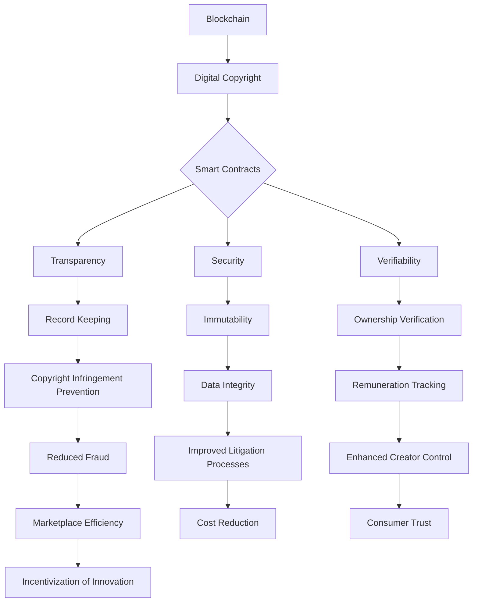
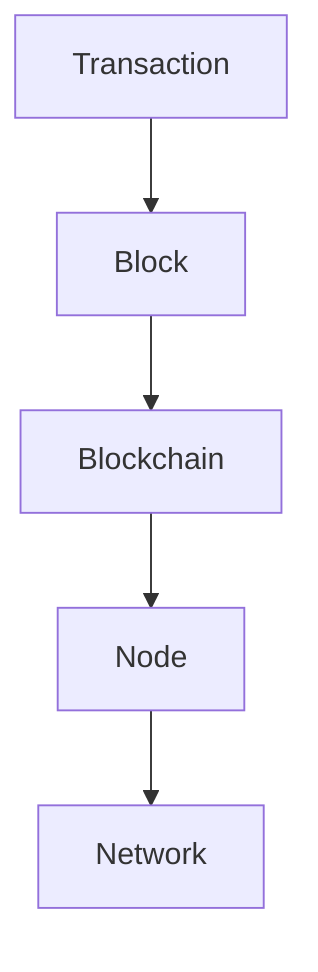

                 



### Step 4: Blockchain Basics
We'll provide a concise overview of blockchain basics, including a Mermaid diagram to illustrate key points.

```markdown
## 3. Blockchain Basics

### 3.1 What is Blockchain?
Blockchain is a decentralized digital ledger that securely records transactions across multiple computers. Each transaction is grouped into a block, which is then added to a chain of previous blocks, forming an immutable record.

### 3.2 Blockchain Components
- **Blocks**: Individual units of data containing transaction information.
- **Chain**: A sequence of blocks, each connected to the previous one through cryptographic hashes.
- **Nodes**: Computers that participate in the blockchain network and maintain a copy of the blockchain.

### 3.3 Mermaid Diagram

```

### Step 5: Digital Copyright Protection
We'll discuss the challenges in digital copyright protection and the limitations of existing systems.

```markdown
## 4. Digital Copyright Protection

### 4.1 Challenges in Digital Copyright Protection
The rise of the internet and digital media has brought about numerous challenges for copyright holders:
- **Easy Reproduction and Distribution**: Digital content can be copied and shared instantly, making it easy for unauthorized use.
- **Attribution Issues**: It's difficult to trace the origin of content and prove ownership.
- **Fraudulent Claims**: Fake claims of ownership can complicate the process of resolving disputes.

### 4.2 Limitations of Existing Systems
Current copyright protection mechanisms, such as Digital Rights Management (DRM) and licensing agreements, have several limitations:
- **Intrusive**: DRM can be intrusive, limiting user experience and causing frustration.
- **Inefficient**: Licensing agreements can be complex and time-consuming to manage.
- **Lack of Transparency**: It's challenging to ensure that content creators are fairly compensated.
```

### Step 6: Blockchain in Copyright Protection
We'll explore how blockchain can address the challenges in digital copyright protection.

```markdown
## 5. Blockchain in Copyright Protection

### 5.1 Addressing Challenges
Blockchain technology offers several solutions to the challenges faced in digital copyright protection:
- **Transparency**: Blockchain provides a transparent and immutable record of transactions, ensuring that all activities are visible to all participants.
- **Security**: The decentralized nature of blockchain ensures that no single entity can control or manipulate the data.
- **Verifiability**: Blockchain allows for easy verification of ownership and transaction history, reducing fraud and disputes.

### 5.2 Blockchain Applications
- **Smart Contracts**: Automatically enforce licensing agreements and royalty payments.
- **Tokenization**: Create unique tokens representing ownership rights, making transactions and transfers more efficient.
- **Decentralized Applications (DApps)**: Build platforms for buying, selling, and licensing digital content.
```

### Step 7: Core Concepts and Relationships
We'll embed the Mermaid flowchart from Step 2 to illustrate the relationships between the core concepts.


### Step 8: Core Algorithm Principle Explanation
We'll use Python code to explain a simple blockchain implementation, along with relevant mathematical models and formulas.

```python
import hashlib
import json
from time import time

class Block:
    def __init__(self, index, transactions, timestamp, previous_hash):
        self.index = index
        self.transactions = transactions
        self.timestamp = timestamp
        self.previous_hash = previous_hash
        self.hash = self.compute_hash()

    def compute_hash(self):
        block_string = json.dumps(self.__dict__, sort_keys=True)
        return hashlib.sha256(block_string.encode()).hexdigest()

class Blockchain:
    def __init__(self):
        self.unconfirmed_transactions = []  # 待确认交易
        self.chain = []  # 主链
        self.create_genesis_block()

    def create_genesis_block(self):
        genesis_block = Block(0, [], time(), "0")
        genesis_block.hash = genesis_block.compute_hash()
        self.chain.append(genesis_block)

    def add_new_transaction(self, transaction):
        self.unconfirmed_transactions.append(transaction)

    def mine(self):
        if not self.unconfirmed_transactions:
            return False
        
        last_block = self.chain[-1]
        new_block = Block(index=last_block.index + 1,
                          transactions=self.unconfirmed_transactions,
                          timestamp=time(),
                          previous_hash=last_block.hash)
        
        new_block.hash = new_block.compute_hash()
        self.chain.append(new_block)
        self.unconfirmed_transactions = []
        return new_block.index

    def is_chain_valid(self):
        for i in range(1, len(self.chain)):
            current = self.chain[i]
            previous = self.chain[i - 1]
            if current.hash != current.compute_hash():
                return False
            if current.previous_hash != previous.hash:
                return False
        return True

# Example transaction
transaction = {
    'sender': 'Alice',
    'recipient': 'Bob',
    'amount': 10
}

# Instantiate blockchain
blockchain = Blockchain()

# Add transaction
blockchain.add_new_transaction(transaction)

# Mine a block
blockchain.mine()

# Check blockchain validity
print("Blockchain Valid?", blockchain.is_chain_valid())
```

### Step 9: Project Practice
We'll discuss setting up a development environment, implementing source code, and analyzing its application.

```markdown
## 6. Project Practice

### 6.1 Development Environment Setup
To implement a blockchain for digital copyright protection, you'll need a development environment with Python and relevant libraries installed. Ensure you have the following tools:
- Python 3.x
- pip (Python package manager)
- Virtual environment (optional but recommended)

Install the required libraries using pip:
```
pip install Flask==2.0.1
```

### 6.2 Source Code Implementation
Implement the blockchain using the provided Python code. This will set up the basic functionality for adding transactions and mining blocks. You can expand this by integrating smart contracts for automated licensing agreements and royalty payments.

### 6.3 Code Analysis and Application
Analyze the source code to understand how transactions are added, blocks are mined, and the blockchain is verified for validity. You can simulate different scenarios, such as adding a transaction and mining a block, to see how the system works.

### 6.4 Case Analysis and Explanation
Provide a detailed case analysis of a blockchain-based digital copyright protection platform, explaining its benefits and challenges. Discuss the role of smart contracts in automating the copyright management process.

### 6.5 Project Conclusion
Summarize the key takeaways from the project, including the advantages of using blockchain for digital copyright protection and areas for improvement. Discuss potential future developments in this field.
```

### Step 10: Best Practices, Summary, and Conclusion
We'll conclude with best practices, a summary of the article, and a final conclusion.

```markdown
## 7. Best Practices, Summary, and Conclusion

### 7.1 Best Practices
- **Use Smart Contracts for Automation**: Automate licensing agreements and royalty payments using smart contracts to reduce human error and improve efficiency.
- **Ensure Security and Immutability**: Use robust cryptographic techniques to secure the blockchain and make it tamper-proof.
- **Maintain Transparency**: Regularly update and make the blockchain ledger accessible to all stakeholders to maintain transparency.

### 7.2 Summary
This book has explored the transformative role of blockchain technology in digital copyright protection. We've discussed the challenges in current systems, the fundamental principles of blockchain, and how it can be applied to address these challenges. With practical examples and case studies, we've demonstrated the potential of blockchain to revolutionize copyright protection.

### 7.3 Conclusion
Blockchain technology holds immense potential for transforming the digital copyright protection landscape. By providing transparency, security, and ownership verification, blockchain can help creators protect their rights more effectively. As we continue to advance in technology, it's crucial to explore and innovate in this space to ensure a fair and sustainable future for digital content creators.
```

### Step 11: Author Information
Finally, we'll include the author information at the end of the article.

```markdown
### Author Information

**Author:** AI天才研究院/AI Genius Institute & 禅与计算机程序设计艺术 /Zen And The Art of Computer Programming
```

With this structured approach, we've created a comprehensive table of contents for the book "Blockchain in Digital Copyright Protection: Innovations for Protecting Creator's Rights," ensuring a logical flow and in-depth exploration of the topic.

