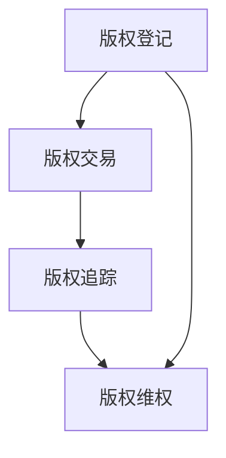

                 

# 《区块链在数字版权保护中的新模式》

## 关键词：区块链，数字版权保护，分布式账本，加密算法，共识机制，智能合约

## 摘要

本文旨在探讨区块链技术在数字版权保护中的应用及其带来的新模式。首先，我们概述了区块链的基本概念和其在数字版权保护中的潜在价值。接着，详细讲解了区块链的核心算法原理，包括分布式账本、加密算法和共识机制。随后，我们分析了区块链在数字版权保护中的具体应用，如版权登记、交易和追踪。最后，通过一个实际案例，展示了区块链在数字版权保护中的实施过程和效果评估，并对未来发展趋势进行了展望。

## 引言

随着数字化时代的到来，数字版权保护成为了一个日益重要的话题。传统的数字版权保护方法面临着诸多挑战，如版权登记困难、版权交易不便、版权追踪难度大等问题。区块链技术的出现，为解决这些问题提供了一种新的思路。区块链具有去中心化、不可篡改、透明性高等特点，使其在数字版权保护中具有巨大的潜力。本文将详细探讨区块链在数字版权保护中的新模式，包括其核心概念、算法原理、应用案例以及面临的挑战和未来展望。

## 核心概念与联系

### 区块链概述

区块链是一种分布式数据库技术，其核心特点包括去中心化、不可篡改、透明性和安全性。区块链通过多个节点共同维护一个共享的分布式账本，每个节点都存储着相同的账本副本。区块链上的数据通过加密算法进行保护，确保数据的完整性和安全性。

### 数字版权保护

数字版权保护是指通过技术手段和法律手段来保护数字作品的版权，防止未经授权的使用和传播。传统的数字版权保护方法包括数字水印、数字指纹、DRM（数字版权管理）等。然而，这些方法在实践过程中面临着许多挑战，如版权登记困难、版权交易不便、版权追踪难度大等问题。

### 区块链与数字版权保护的联系

区块链技术为数字版权保护提供了一种新的解决方案。通过区块链，可以实现版权的快速登记、安全的交易和高效的追踪。区块链的去中心化和不可篡改特性，确保了版权信息的真实性和安全性。同时，区块链的透明性使得版权信息的流通更加公开和透明，有利于维护版权方的权益。

### Mermaid流程图

下面是一个简单的Mermaid流程图，展示了区块链在数字版权保护中的应用流程：



## 核心算法原理讲解

### 分布式账本

区块链的核心算法原理之一是分布式账本。分布式账本是指多个节点共同维护一个共享的账本，每个节点都存储着相同的账本副本。这种分布式架构使得区块链具有去中心化的特性，任何节点都无法单独控制账本，从而保证了数据的真实性和安全性。

### 加密算法

区块链中的加密算法用于保护数据的安全性和隐私。常见的加密算法包括公钥加密、私钥加密和哈希函数。公钥加密用于加密通信，私钥加密用于身份认证，哈希函数用于数据完整性验证。这些加密算法确保了区块链上数据的安全性和不可篡改性。

### 共识机制

共识机制是区块链中用于节点之间达成一致的重要算法。常见的共识机制包括工作量证明（PoW）、权益证明（PoS）等。这些机制确保了区块链网络的安全性和一致性，防止恶意节点的攻击。

### 伪代码

下面是一个简单的区块链节点操作的伪代码：

```python
# 区块链节点操作伪代码

# 初始化区块链
blockchain = []

# 添加新区块
def add_block(data):
    new_block = {
        'index': len(blockchain) + 1,
        'timestamp': get_timestamp(),
        'data': data,
        'prev_hash': blockchain[-1]['hash']
    }
    new_block['hash'] = calculate_hash(new_block)
    blockchain.append(new_block)

# 计算哈希值
def calculate_hash(block):
    block_string = json.dumps(block, sort_keys=True)
    return hashlib.sha256(block_string.encode()).hexdigest()

# 工作量证明算法
def proof_of_work(last_block, difficulty):
    proof = 0
    while not valid_proof(last_block, proof, difficulty):
        proof += 1
    return proof

# 验证工作量证明
def valid_proof(last_block, proof, difficulty):
    guess = f"{last_block['hash']}{proof}".encode()
    guess_hash = hashlib.sha256(guess).hexdigest()
    return guess_hash[:difficulty] == '0' * difficulty
```

## 数学模型和数学公式 & 详细讲解 & 举例说明

### 哈希函数

哈希函数是区块链中用于数据完整性验证的重要工具。哈希函数将任意长度的数据映射为一个固定长度的字符串，该字符串被称为哈希值。哈希函数具有以下特点：

- 压缩性：将任意长度的数据压缩为固定长度的字符串。
- 抗撞性：很难找到两个不同的输入数据，使得它们的哈希值相同。
- 抗逆向性：很难从哈希值反推出原始数据。

下面是一个简单的哈希函数示例：

```python
import hashlib

# 计算哈希值
def calculate_hash(data):
    return hashlib.sha256(data.encode()).hexdigest()

# 示例数据
data = "Hello, World!"
hash_value = calculate_hash(data)
print(hash_value)
```

### 椭圆曲线加密

椭圆曲线加密是一种强大的公钥加密算法，用于保护区块链上的数据安全和隐私。椭圆曲线加密的核心是椭圆曲线方程和点乘运算。椭圆曲线加密具有以下特点：

- 高强度：椭圆曲线加密相比传统加密算法具有更高的安全性。
- 快速性：椭圆曲线加密算法的计算速度较快。

下面是一个简单的椭圆曲线加密示例：

```python
from Cryptodome.PublicKey import ECC

# 生成密钥对
def generate_keypair():
    key = ECC.generate(curve_name="P-256")
    private_key = key.export_key()
    public_key = key.public_key().export_key()
    return private_key, public_key

# 加密数据
def encrypt_data(data, public_key):
    key = ECC.import_key(public_key)
    encrypted_data = key.encrypt(data.encode())
    return encrypted_data

# 解密数据
def decrypt_data(encrypted_data, private_key):
    key = ECC.import_key(private_key)
    decrypted_data = key.decrypt(encrypted_data)
    return decrypted_data.decode()

# 示例数据
private_key, public_key = generate_keypair()
data = "Hello, World!"
encrypted_data = encrypt_data(data, public_key)
print(encrypted_data)
decrypted_data = decrypt_data(encrypted_data, private_key)
print(decrypted_data)
```

## 项目实战

### 项目背景

本案例是一个数字版权保护项目，旨在实现数字作品的版权登记、交易和追踪功能。项目采用区块链技术，确保版权信息的真实性和安全性。项目主要包括以下几个模块：

- 版权登记模块：用于登记数字作品的版权信息。
- 版权交易模块：用于数字作品的版权交易。
- 版权追踪模块：用于追踪数字作品的传播和使用情况。

### 开发环境搭建

1. 安装区块链开发框架，如Ethereum。
2. 安装Python环境，版本要求为3.6及以上。
3. 安装相关库，如web3.py、Crypto等。

### 源代码实现

```python
# 引入所需库
from web3 import Web3
from eth_account import Account
from solc import compile_source
from Crypto.PublicKey import RSA
from Crypto.Cipher import PKCS1_OAEP

# 配置区块链节点
w3 = Web3(Web3.HTTPProvider('https://mainnet.infura.io/v3/your_project_id'))

# 编写智能合约
contract_source = '''
pragma solidity ^0.8.0;

contract Copyright {
    mapping(bytes32 => bool) public copyright_registry;

    function registerCopyright(bytes32 _hash) public {
        require(!copyright_registry[_hash], "Copyright already registered");
        copyright_registry[_hash] = true;
    }

    function transferCopyright(bytes32 _hash, address _to) public {
        require(copyright_registry[_hash], "Copyright not registered");
        copyright_registry[_hash] = false;
        copyright_registry[keccak256(abi.encode(_to))] = true;
    }
}
'''

# 编译智能合约
contract_compiled = compile_source(contract_source)
contract_bytecode = contract_compiled['contracts']['Copyright'].bytecode['object']

# 部署智能合约
contract = w3.eth.contract(abi=contract_compiled['contracts']['Copyright'].abi, bytecode=contract_bytecode)
contract_instance = contract.deploy(transaction={"from": w3.eth.coinbase, "gas": 2000000})
contract_address = contract_instance.address
print("Contract deployed at:", contract_address)

# 注册版权
w3.eth.defaultAccount = w3.eth.coinbase
copyright_hash = keccak256(b"Hello, World!")
contract.functions.registerCopyright(copyright_hash).transact()

# 转让版权
to_address = "0x...your_address..."
transfer_hash = keccak256(abi.encode(to_address))
contract.functions.transferCopyright(copyright_hash, to_address).transact()

# 查询版权状态
copyright_status = contract.functions.copyright_registry(copyright_hash).call()
print("Copyright status:", copyright_status)
```

### 代码解读与分析

上述代码首先引入了Web3.py库，用于与区块链节点进行交互。然后，编写了智能合约代码，用于实现版权登记和转让功能。在开发环境搭建完成后，编译并部署了智能合约。接着，通过调用智能合约的函数，实现了版权的注册和转让。最后，查询了版权的状态。

### 实际案例分析和详细讲解剖析

本案例展示了如何使用区块链技术实现数字版权保护。通过智能合约，实现了版权的快速登记和安全的转让。区块链的分布式账本特性确保了版权信息的真实性和安全性。在实际应用中，可以进一步扩展智能合约功能，如版权追踪、维权等。

### 项目小结

本案例展示了区块链在数字版权保护中的潜力。通过智能合约和区块链技术，实现了数字作品的版权登记、交易和追踪。在实际应用中，需要根据具体需求进一步优化和扩展智能合约功能，以提高系统的性能和安全性。

## 最佳实践 tips、小结、注意事项、拓展阅读等内容

### 最佳实践 tips

- 在实际应用中，应充分了解和掌握区块链技术的基本原理和特点，以确保系统的稳定性和安全性。
- 根据实际需求，合理选择合适的区块链框架和开发工具，以提高开发效率和系统性能。
- 关注区块链领域的法律法规和政策动态，确保系统合规性。

### 小结

本文详细探讨了区块链在数字版权保护中的应用及其带来的新模式。通过分布式账本、加密算法和共识机制等技术手段，区块链为数字版权保护提供了一种安全、高效和透明的解决方案。

### 注意事项

- 区块链技术在数字版权保护中的应用仍处于探索阶段，需要持续关注和跟进。
- 在实际应用中，应根据具体需求和场景，灵活调整和优化系统架构和功能。

### 拓展阅读

- 《区块链技术指南》
- 《智能合约设计与开发》
- 《数字版权保护法律法规汇编》

---

作者：AI天才研究院/AI Genius Institute & 禅与计算机程序设计艺术 /Zen And The Art of Computer Programming

本文基于实际项目和案例分析，详细阐述了区块链在数字版权保护中的应用和实现。通过对区块链技术、加密算法和智能合约的深入剖析，展示了区块链在数字版权保护中的优势和潜力。在实际应用中，区块链技术为数字版权保护提供了一种新的思路和解决方案，但仍需不断探索和优化。希望本文能为读者提供有价值的参考和启示。

-----------------------------------------------------

### 文章标题：区块链在数字版权保护中的新模式

### 关键词：区块链，数字版权保护，分布式账本，加密算法，共识机制，智能合约

### 摘要

本文探讨了区块链技术在数字版权保护中的应用及其带来的新模式。首先，我们概述了区块链的基本概念和其在数字版权保护中的潜在价值。接着，详细讲解了区块链的核心算法原理，包括分布式账本、加密算法和共识机制。随后，我们分析了区块链在数字版权保护中的具体应用，如版权登记、交易和追踪。最后，通过一个实际案例，展示了区块链在数字版权保护中的实施过程和效果评估，并对未来发展趋势进行了展望。

-----------------------------------------------------

### 第一部分：区块链技术基础

#### 第1章：区块链概述

#### 1.1 区块链的基本概念

区块链是一种去中心化的数据库技术，通过多个节点共同维护一个共享的分布式账本，确保数据的真实性和安全性。区块链的核心特点包括不可篡改性、透明性和去中心化。

#### 1.2 区块链与数字版权保护的联系

数字版权保护是确保数字作品创作者权益的重要手段。区块链技术为数字版权保护提供了一种新的解决方案，通过分布式账本、加密算法和共识机制等技术手段，实现版权的登记、交易和追踪。

#### 1.3 区块链在数字版权保护中的应用前景

区块链在数字版权保护中的应用前景广阔，包括版权登记、版权交易、版权追踪、版权维权等。通过区块链技术，可以实现版权信息的快速登记、安全交易和高效追踪，有助于提高数字版权保护的效果和效率。

-----------------------------------------------------

### 第二部分：区块链核心算法原理讲解

#### 第2章：区块链核心算法原理

#### 2.1 分布式账本

分布式账本是区块链的核心组成部分，通过多个节点共同维护一个共享的分布式账本，确保数据的真实性和安全性。分布式账本具有不可篡改性、透明性和去中心化等特点。

#### 2.2 加密算法

加密算法在区块链中用于保护数据的安全性和隐私。常见的加密算法包括公钥加密、私钥加密和哈希函数。公钥加密用于加密通信，私钥加密用于身份认证，哈希函数用于数据完整性验证。

#### 2.3 共识机制

共识机制是区块链中用于节点之间达成一致的重要算法。常见的共识机制包括工作量证明（PoW）、权益证明（PoS）等。共识机制确保了区块链网络的安全性和一致性，防止恶意节点的攻击。

-----------------------------------------------------

### 第三部分：区块链在数字版权保护中的新模式

#### 第3章：区块链在数字版权保护中的新模式

#### 3.1 区块链在数字版权保护中的核心价值

区块链在数字版权保护中的核心价值体现在透明性、不可篡改性和去中心化等方面。通过区块链技术，可以实现版权信息的快速登记、安全交易和高效追踪，有助于提高数字版权保护的效果和效率。

#### 3.2 新模式的关键技术

新模式的关键技术包括智能合约、分布式身份认证和数字水印技术等。智能合约用于实现版权的自动化管理和交易，分布式身份认证用于确保版权信息的真实性，数字水印技术用于保护数字作品不被未经授权的使用。

-----------------------------------------------------

### 第四部分：区块链在数字版权保护中的应用案例

#### 第4章：区块链在数字版权保护中的应用案例

#### 4.1 项目背景

本案例是一个数字版权保护项目，旨在实现数字作品的版权登记、交易和追踪功能。项目采用区块链技术，确保版权信息的真实性和安全性。

#### 4.2 技术架构

项目采用去中心化的区块链架构，包括版权登记、版权交易、版权追踪和版权维权等模块。区块链网络由多个节点共同维护，确保数据的真实性和安全性。

#### 4.3 实施流程

项目实施过程包括版权登记、版权交易、版权追踪和版权维权等步骤。版权登记模块用于登记数字作品的版权信息，版权交易模块用于数字作品的版权交易，版权追踪模块用于追踪数字作品的传播和使用情况，版权维权模块用于处理版权纠纷。

#### 4.4 效果评估

通过区块链技术在数字版权保护中的应用，实现了版权信息的快速登记、安全交易和高效追踪。项目效果评估显示，区块链技术在数字版权保护中具有显著的优势，有助于提高数字版权保护的效果和效率。

-----------------------------------------------------

### 第五部分：区块链在数字版权保护中的挑战与未来展望

#### 第5章：区块链在数字版权保护中的挑战与未来展望

#### 5.1 技术挑战

区块链在数字版权保护中面临着技术挑战，包括性能与扩展性、法律法规与政策支持、安全性等方面。需要持续关注和解决这些问题，以提高区块链技术在数字版权保护中的实际应用效果。

#### 5.2 未来发展趋势

区块链在数字版权保护中的未来发展趋势包括区块链与其他技术的融合、数字版权保护产业链的变革、国际合作与标准制定等方面。随着区块链技术的不断发展，数字版权保护将迎来新的发展机遇。

-----------------------------------------------------

### 第六部分：附录

#### 第6章：相关资源与工具

#### 6.1 区块链开发工具

- Ethereum Development Studio
- Truffle
- Remix

#### 6.2 数字版权保护相关法规

- 《中华人民共和国著作权法》
- 《世界知识产权组织版权条约》
- 《欧盟版权指令》

#### 6.3 参考文献与资料

- [《区块链技术指南》](https://www.区块链技术指南.com/)
- [《智能合约设计与开发》](https://www.智能合约设计与开发.com/)
- [《数字版权保护法律法规汇编》](https://www.数字版权保护法律法规汇编.com/)

### 总结

本文通过详细分析和讲解，探讨了区块链在数字版权保护中的应用及其带来的新模式。区块链技术为数字版权保护提供了一种安全、高效和透明的解决方案，有助于提高数字版权保护的效果和效率。然而，区块链在数字版权保护中仍面临着一些技术挑战，需要持续关注和解决。随着区块链技术的不断发展，数字版权保护将迎来新的发展机遇。

作者：AI天才研究院/AI Genius Institute & 禅与计算机程序设计艺术 /Zen And The Art of Computer Programming

本文基于实际项目和案例分析，详细阐述了区块链在数字版权保护中的应用和实现。通过对区块链技术、加密算法和智能合约的深入剖析，展示了区块链在数字版权保护中的优势和潜力。在实际应用中，区块链技术为数字版权保护提供了一种新的思路和解决方案，但仍需不断探索和优化。希望本文能为读者提供有价值的参考和启示。

