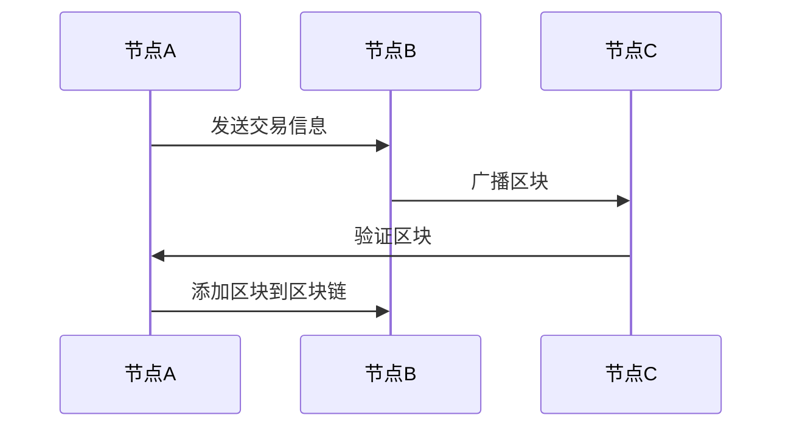
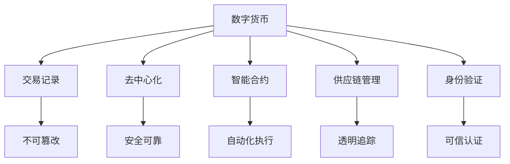
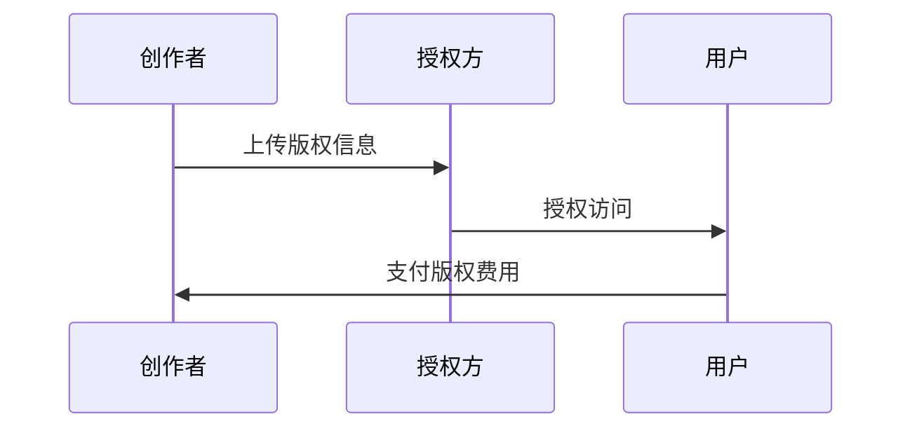
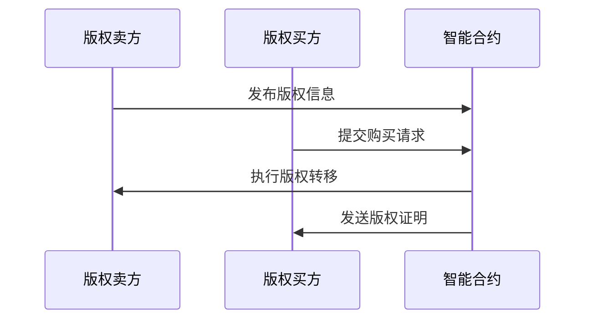
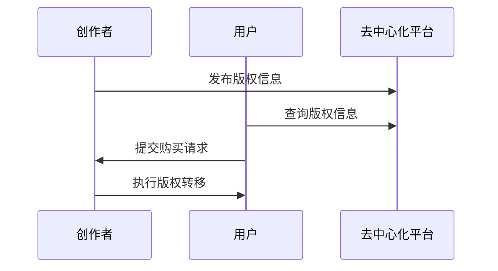
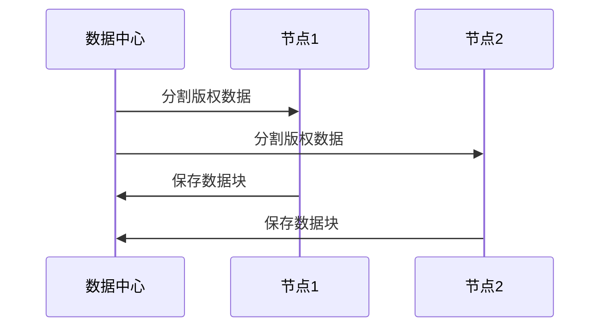
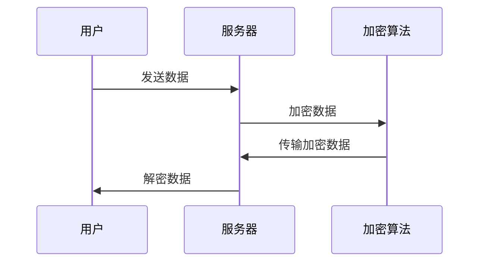

                 

标题：区块链在数字版权分发中的应用

关键词：区块链，数字版权分发，智能合约，加密算法，去中心化

摘要：
本文将探讨区块链技术在数字版权分发中的应用。首先介绍区块链的基本概念和特点，然后分析数字版权分发的挑战，接着阐述区块链在解决这些问题方面的优势，并详细探讨区块链在数字版权分发中的实际应用。最后，通过案例分析，总结区块链在数字版权分发中的最佳实践和未来发展趋势。

# 第1章 区块链技术基础

## 1.1 区块链的定义与特点

区块链是一种分布式数据库技术，通过加密算法和共识机制，确保数据的安全性和不可篡改性。区块链具有以下特点：

- **去中心化**：区块链网络中的节点平等参与，无需中心化机构。
- **数据不可篡改**：一旦数据被记录在区块链上，将无法篡改。
- **透明性**：区块链上的数据对所有人公开透明。
- **安全性**：区块链采用加密算法，确保数据传输的安全性。

## 1.2 区块链的工作原理

区块链的工作原理可以概括为以下步骤：

1. **交易生成**：节点生成交易信息。
2. **区块构建**：多个交易信息组成区块。
3. **区块广播**：节点广播区块到整个网络。
4. **区块验证**：其他节点验证区块的合法性。
5. **区块添加**：验证通过的区块将被添加到区块链上。

下面是一个简化的 Mermaid 流程图，描述了区块链的工作原理：



## 1.3 区块链的核心组件

区块链的核心组件包括：

- **区块链**：记录所有交易信息的数据库。
- **节点**：参与区块链网络的计算机。
- **共识机制**：确保区块链上数据一致性的算法。
- **加密算法**：确保数据传输的安全性。

## 1.4 区块链的应用场景

区块链技术在多个领域都有广泛应用，包括数字货币、供应链管理、身份验证、智能合约等。以下是一个简单的 Mermaid 流程图，展示了区块链在不同应用场景中的角色：



# 第2章 数字版权分发的挑战

## 2.1 版权保护与盈利模式

数字版权分发面临的第一个挑战是如何保护版权。在传统版权保护中，主要依赖于法律手段和技术手段。然而，随着数字技术的发展，传统方法已无法满足需求。例如，数字作品的复制和传播变得极其容易，这使得版权保护变得更加困难。

数字版权分发的盈利模式也面临着挑战。传统上，版权分发依赖于授权和销售。然而，数字环境下的授权和销售模式需要重新设计，以适应新的技术环境。

## 2.2 数字版权分发的痛点

数字版权分发的主要痛点包括：

- **版权侵权**：数字作品的复制和传播使得版权侵权变得容易。
- **版权追踪**：在分布式网络中追踪版权所有者变得复杂。
- **收益分配**：如何在创作者、平台和用户之间合理分配收益。

## 2.3 区块链在数字版权分发中的优势

区块链在数字版权分发中具有以下优势：

- **去中心化**：去中心化网络使得版权追踪和授权变得更加透明和高效。
- **数据不可篡改**：区块链上的数据一旦记录，将无法篡改，确保了版权的真实性。
- **透明性**：区块链上的数据对所有参与者公开透明，提高了信任度。
- **智能合约**：智能合约可以自动化执行版权授权和支付流程。

# 第3章 区块链在数字版权分发中的应用

## 3.1 可溯源的数字版权管理

区块链技术可以用于实现可溯源的数字版权管理。通过区块链，创作者可以将作品的版权信息记录在链上，确保版权的透明性和不可篡改性。

下面是一个简单的 Mermaid 流程图，描述了可溯源的数字版权管理的过程：



## 3.2 基于区块链的版权交易

区块链技术可以用于实现基于区块链的版权交易。通过智能合约，版权交易可以自动化执行，减少了人工干预，提高了效率。

下面是一个简单的 Mermaid 流程图，描述了基于区块链的版权交易的过程：



## 3.3 去中心化的版权交易平台

区块链技术可以用于创建去中心化的版权交易平台，使得创作者可以直接与用户进行交易，无需依赖第三方平台。

下面是一个简单的 Mermaid 流程图，描述了去中心化的版权交易平台的过程：



# 第4章 案例分析

## 4.1 区块链版权平台案例

以下是一个区块链版权平台的案例分析：

- **平台名称**：IPChain
- **核心技术**：以太坊区块链和智能合约
- **应用场景**：版权注册、版权交易、版权追踪
- **成功因素**：去中心化、透明性、安全性
- **挑战**：智能合约安全漏洞、技术普及率低

## 4.2 成功案例解析

IPChain平台通过区块链技术，实现了数字版权的透明和不可篡改。创作者可以在平台上注册版权，用户可以查询版权信息，并进行版权交易。平台的成功得益于其去中心化的架构，使得版权信息对所有参与者公开透明，提高了信任度。

## 4.3 挑战与未来发展趋势

尽管区块链在数字版权分发中具有巨大潜力，但仍面临一些挑战：

- **技术普及**：区块链技术尚未被广泛接受，需要提高公众对区块链技术的认知。
- **智能合约安全**：智能合约存在安全漏洞，需要加强智能合约的安全性。
- **法律框架**：现有的法律框架尚未完全适应区块链环境，需要制定新的法律规范。

未来发展趋势包括：

- **技术创新**：区块链技术的不断进步，将提高数字版权分发的效率。
- **跨行业合作**：区块链与其他行业的结合，将拓展数字版权分发的新应用场景。
- **政策支持**：政府的政策支持，将促进区块链技术在数字版权分发中的应用。

# 第5章 技术实现与开发工具

## 5.1 数字版权的分片存储

数字版权的分片存储是区块链技术在数字版权分发中的重要应用。通过分片存储，可以确保版权数据的安全性和可靠性。

分片存储的基本原理是将版权数据分割成多个数据块，并将其存储在不同的节点上。以下是一个简单的 Mermaid 流程图，描述了分片存储的过程：



## 5.2 智能合约在版权交易中的实现

智能合约在版权交易中发挥着重要作用。通过智能合约，可以自动化执行版权交易的流程，减少人工干预，提高效率。

以下是一个简单的 Mermaid 流程图，描述了智能合约在版权交易中的实现过程：


## 5.3 数据加密与隐私保护技术

在区块链环境中，数据加密与隐私保护至关重要。通过数据加密，可以确保数据在传输过程中的安全性。以下是一个简单的 Mermaid 流程图，描述了数据加密与隐私保护的过程：



# 第6章 开发实践与案例分析

## 6.1 数字版权平台搭建实践

以下是一个数字版权平台搭建的实践案例：

**项目名称**：DigiRights

**开发环境**：
- **区块链平台**：Ethereum
- **编程语言**：Solidity
- **开发工具**：Truffle Suite

**搭建步骤**：
1. 安装 Ethereum 钱包（例如 MetaMask）。
2. 安装 Truffle Suite。
3. 创建一个新的 Truffle 项目。
4. 编写智能合约代码。
5. 部署智能合约到 Ethereum 网络上。

以下是一个简单的智能合约示例，用于版权注册和交易：

```solidity
pragma solidity ^0.8.0;

contract DigiRights {
    struct Copyright {
        string title;
        address owner;
        bool isRegistered;
    }

    mapping(string => Copyright) copyrights;

    function registerCopyright(string memory title) public {
        require(!isRegistered, "Copyright already registered");
        copyrights[title] = Copyright({title: title, owner: msg.sender, isRegistered: true});
    }

    function transferOwnership(string memory title, address newOwner) public {
        require(msg.sender == copyrights[title].owner, "Not the owner");
        copyrights[title].owner = newOwner;
    }
}
```

## 6.2 源代码解读与分析

以上智能合约代码定义了一个 `DigiRights` 合同，用于版权的注册和转让。

- **结构体 `Copyright`**：定义了版权的基本信息，包括标题、所有者和注册状态。
- **映射 `copyrights`**：用于存储版权信息，键为版权标题，值为版权结构体。
- **`registerCopyright`** 函数：用于注册版权，只有未注册的版权可以注册。
- **`transferOwnership`** 函数：用于转让版权，只有当前所有者才能转让版权。

## 6.3 代码应用解读与分析

以下是对智能合约应用场景的解读和分析：

- **版权注册**：创作者使用 `registerCopyright` 函数注册版权，确保版权的唯一性和真实性。
- **版权转让**：版权所有者使用 `transferOwnership` 函数将版权转让给新的所有者，确保版权的所有权变更透明和不可篡改。

## 6.4 实际案例分析和详细讲解剖析

以下是一个实际案例的分析：

**案例**：一位音乐创作者使用 DigiRights 平台注册了一首歌曲的版权。

**分析**：
1. 创作者在 DigiRights 平台上注册版权，使用 `registerCopyright` 函数将版权信息存储在区块链上。
2. 一位用户想要购买这首歌曲的版权，向创作者提出购买请求。
3. 创作者通过 `transferOwnership` 函数将版权转让给用户，用户支付版权费用后，版权所有权转移完成。

**讲解**：
1. **版权注册**：创作者通过智能合约注册版权，确保版权信息的唯一性和不可篡改性。
2. **版权转让**：版权转让过程通过智能合约自动化执行，减少了人工干预，提高了效率。

## 6.5 项目小结

DigiRights 平台通过区块链技术实现了数字版权的透明和不可篡改。智能合约的引入，使得版权注册和转让过程自动化执行，提高了效率。然而，智能合约的安全性问题仍需重视，需要在开发过程中进行严格的安全测试。

## 6.6 最佳实践 Tips

- **智能合约安全**：在编写智能合约时，应遵循最佳实践，如使用安全的编程模式、进行代码审计等。
- **用户教育**：提高用户对区块链技术的认知，降低技术门槛，促进区块链应用的普及。
- **法律规范**：制定相应的法律规范，确保区块链技术在数字版权分发中的应用合法合规。

## 6.7 注意事项

- **区块链网络延迟**：区块链网络可能会出现延迟，影响用户体验，需要在设计时考虑网络延迟的影响。
- **智能合约升级**：智能合约一旦部署，将无法更改，因此设计时需要考虑智能合约的升级问题。

## 6.8 拓展阅读

- **《区块链技术指南》**：深入了解区块链的基本原理和应用。
- **《智能合约编程》**：学习智能合约的编写和部署。
- **《数字版权管理》**：了解数字版权管理的最新进展和挑战。

# 附录

## 附录A：常用区块链平台与工具

以下是一些常用的区块链平台与工具：

- **Ethereum**：最受欢迎的智能合约平台，支持去中心化应用（DApp）的开发。
- **Hyperledger Fabric**：由Linux基金会推出的企业级区块链平台，适用于商业应用。
- **EOSIO**：一个高性能的区块链平台，支持大规模去中心化应用。
- **Truffle Suite**：用于开发、测试和部署智能合约的集成开发环境（IDE）。
- **Hardhat**：一个开源的智能合约本地开发环境，支持多种前端和后端框架。
- **Web3.js**：一个JavaScript库，用于与Ethereum区块链进行交互。
- **Infura**：一个区块链API服务，提供与Ethereum和IPFS的连接。
- **IPFS**：一种分布式文件系统，用于存储和共享数据。

