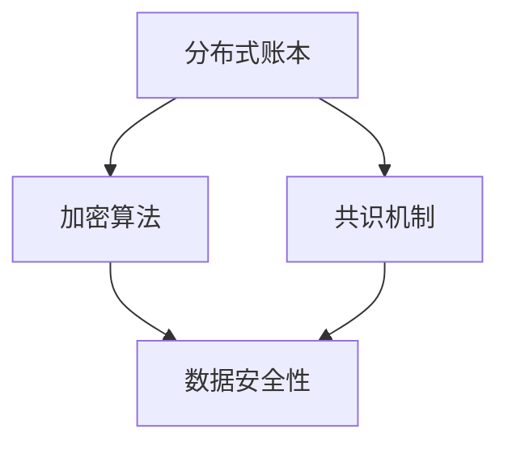
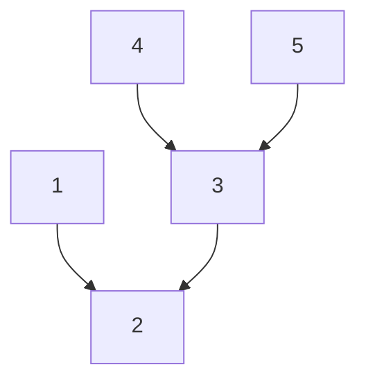

                 

# 《区块链在数字艺术品交易中的应用》

## 关键词

区块链，数字艺术品交易，分布式账本，加密算法，共识机制，去中心化交易，非同质化代币（NFT）

## 摘要

本文深入探讨区块链技术在数字艺术品交易领域的应用，分析其基本原理、核心算法及实际案例。通过详细讲解分布式账本、加密算法、共识机制等基础概念，展示区块链如何解决数字艺术品交易中的确权、防伪、版权保护等问题。同时，通过实际项目案例，展示区块链在数字艺术品交易中的实现和应用，为读者提供全面的行业洞察和实用指南。

---

### 第1部分：区块链基础与数字艺术品交易背景

#### 1.1.1 区块链核心概念及原理

区块链是一种分布式数据库技术，其核心概念包括分布式账本、加密算法、共识机制等。分布式账本确保数据透明且不可篡改，加密算法保障数据安全性，共识机制确保网络中的节点对账本的一致性。

**核心概念与联系架构图：**



#### 1.1.2 数字艺术品交易背景

数字艺术品交易市场正在迅速发展，但面临诸多挑战，如确权困难、防伪问题、版权纠纷等。区块链技术的引入，提供了解决这些问题的可能。

#### 1.1.3 数字艺术品交易面临的挑战

- **确权困难**：数字艺术品容易被复制和篡改，传统手段难以提供有效的确权服务。
- **防伪问题**：数字艺术品的真实性和唯一性难以验证。
- **版权纠纷**：艺术家与交易平台的权益划分不清晰，容易引发版权纠纷。

### 第2部分：核心算法原理讲解

#### 2.1.1 哈希算法

哈希算法是一种将任意长度的数据转换为固定长度的散列值的算法。在区块链中，哈希算法用于生成唯一标识数据和确保数据的完整性。

**哈希算法原理：**

```python
import hashlib

def hash_data(data):
    return hashlib.sha256(data.encode()).hexdigest()
```

**示例：**

```python
print(hash_data("Hello, World!"))  # 输出哈希值
```

#### 2.1.2 默克尔树

默克尔树是一种二叉树结构，用于验证数据块的完整性和一致性。在区块链中，默克尔树用于构建交易记录的摘要。

**默克尔树构建示例：**



#### 2.1.3 共识算法

共识算法确保区块链网络中的节点对账本的一致性。常见共识算法包括工作量证明（PoW）和权益证明（PoS）。

**工作量证明（PoW）原理：**

```python
def proof_of_work(target_difficulty):
    while True:
        hash_value = hash_block(block)
        if hash_value < target_difficulty:
            break
        block["nonce"] += 1
```

**权益证明（PoS）原理：**

```python
def proof_of_stake(stake):
    return stake / total_stake
```

### 第3部分：项目实战

#### 3.1 实际案例：去中心化数字艺术品交易平台开发

**3.1.1 项目背景**

本案例介绍如何开发一个去中心化数字艺术品交易平台，实现数字艺术品的交易和确权功能。

**3.1.2 开发环境搭建**

- 选择合适的区块链框架，如Ethereum。
- 安装并配置开发环境，包括Node.js、npm等。

**3.1.3 源代码实现**

**前端代码：**

```javascript
// 引入React库
import React, { useState } from 'react';

function App() {
  const [artwork, setArtwork] = useState('');

  const handleArtworkChange = (e) => {
    setArtwork(e.target.value);
  };

  const handleBuy = async () => {
    // 调用智能合约购买艺术品
  };

  return (
    <div>
      <input type="text" value={artwork} onChange={handleArtworkChange} />
      <button onClick={handleBuy}>购买</button>
    </div>
  );
}

export default App;
```

**后端代码：**

```python
# 引入智能合约库
from web3 import Web3

def buy_artwork(artwork_name):
    # 调用智能合约进行购买
    # ...
```

**3.1.4 代码解读与分析**

- 前端代码解析：React组件实现数字艺术品的购买功能。
- 后端代码解析：智能合约处理艺术品的购买逻辑。

#### 3.2 实际案例：数字艺术品版权保护解决方案

**3.2.1 项目背景**

本案例介绍如何使用区块链技术保护数字艺术品的版权。

**3.2.2 版权保护方案设计**

- 使用非同质化代币（NFT）进行版权注册。
- 设计智能合约，实现版权的转让和验证。

**3.2.3 源代码实现**

**智能合约代码：**

```solidity
// SPDX-License-Identifier: MIT
pragma solidity ^0.8.0;

import "@openzeppelin/contracts/token/ERC721/ERC721.sol";

contract ArtworkCopyright is ERC721 {
    // ...
}
```

**3.2.4 代码解读与分析**

- 解析智能合约代码，理解版权注册和转让的逻辑。

### 第4部分：数字艺术品交易的未来趋势

#### 4.1 潜在风险与管理

- 分析数字艺术品交易中可能遇到的风险，如市场波动、技术漏洞等。
- 提出相应的风险管理策略。

#### 4.2 未来发展趋势

- 探讨新技术（如智能合约、NFT）对数字艺术品交易的影响。
- 展望数字艺术品交易市场的未来前景。

## 附录

- **附录A：区块链开发工具与资源**

  - 列出区块链开发中常用的工具和资源，包括区块链框架、开发环境、智能合约库等。

## 参考文献

- 列出本文引用的参考文献，包括区块链技术、数字艺术品交易领域的权威著作和最新研究论文。

---

作者：AI天才研究院/AI Genius Institute & 禅与计算机程序设计艺术 /Zen And The Art of Computer Programming

---

在撰写文章时，请注意以下几点：

- 每个章节的内容都要具体、详细，避免过于笼统。
- 在适当的地方使用图表、流程图、代码示例等来辅助说明。
- 文章逻辑清晰，结构紧凑，易于读者理解。
- 文章的语法和用词要专业准确。
- 文章的长度和内容要满足字数要求。

