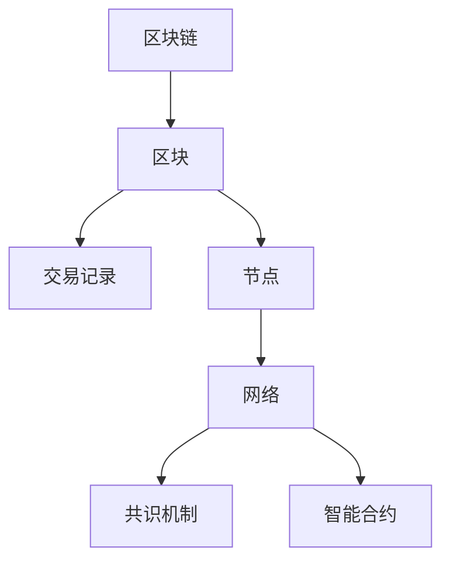

                 

## 《区块链在数字艺术品交易中的应用前景》

### 关键词：区块链，数字艺术品交易，非同质化代币（NFT），智能合约，共识机制

#### 摘要：

本文旨在探讨区块链技术在数字艺术品交易中的潜在应用前景。首先，通过介绍区块链的基本原理和共识机制，阐述其作为分布式账本技术的优势。接着，分析数字艺术品交易的特点和现状，讨论区块链如何解决现有问题。随后，详细阐述区块链在数字艺术品交易中的核心应用，包括非同质化代币（NFT）的发行与交易、透明且不可篡改的记录、安全的支付与结算等。通过案例研究和项目实战，进一步验证区块链在数字艺术品交易中的实际效果和挑战。最后，预测区块链在数字艺术品交易中的未来前景，并探讨潜在的挑战与解决方案。

## 引言和背景

区块链技术作为一种革命性的分布式账本技术，自2009年比特币的诞生以来，已经在金融、供应链管理、医疗等多个领域展现出了巨大的应用潜力。近年来，随着数字艺术品的兴起，区块链技术在数字艺术品交易中的应用也逐渐受到关注。数字艺术品，特别是非同质化代币（Non-Fungible Tokens，简称NFT），成为区块链技术的重要应用场景之一。

数字艺术品是指使用数字形式创作的艺术品，包括数字画作、音乐、视频等。与传统的艺术品不同，数字艺术品具有不可篡改、可复制性等特点，使得其交易和所有权验证成为一个挑战。然而，区块链技术以其去中心化、透明性和安全性，为数字艺术品交易提供了一种全新的解决方案。

### 书籍目的与结构

本文旨在探讨区块链在数字艺术品交易中的应用前景，通过系统性地分析区块链技术的基本原理和共识机制，探讨其在数字艺术品交易中的具体应用，并通过案例研究验证其实际效果。全书分为七个章节：

- **第1章 引言和背景**：介绍书籍的目的、区块链技术的发展历程、数字艺术品市场的现状以及区块链在数字艺术品交易中的重要性。
- **第2章 区块链基础知识**：详细解释区块链的基本原理、共识机制、网络与节点。
- **第3章 数字艺术品交易概述**：概述数字艺术品的定义与特点、数字艺术品交易的现状以及市场参与者。
- **第4章 区块链在数字艺术品交易中的应用**：讨论区块链在数字艺术品交易中的核心应用，包括NFT的发行与交易、透明且不可篡改的记录、安全的支付与结算等。
- **第5章 案例研究**：通过案例研究，分析区块链在数字艺术品交易中的实际应用。
- **第6章 未来前景与挑战**：预测区块链在数字艺术品交易中的发展前景，并探讨潜在的挑战与解决方案。
- **第7章 附录**：提供常用区块链平台与工具介绍、数字艺术品交易相关的法律法规以及参考文献与推荐阅读。

### 区块链技术的发展历程

区块链技术起源于2008年，由一位化名为中本聪（Satoshi Nakamoto）的人提出。中本聪发布了比特币的白皮书《比特币：一种点对点电子现金系统》，首次提出了去中心化的数字货币构想。比特币利用区块链技术实现了点对点的价值传输，无需依赖传统的金融中介机构。

2009年，比特币网络正式上线，标志着区块链技术的诞生。随后，区块链技术不断发展，出现了多种共识机制、智能合约等概念，进一步拓展了区块链技术的应用范围。

2014年，以太坊的发布将区块链技术推向了新的高度。以太坊引入了智能合约的概念，使得开发者可以在区块链上构建去中心化的应用（DApp）。智能合约允许在区块链上进行自动化执行和验证，为数字艺术品交易提供了更多可能性。

### 数字艺术品市场的现状与发展趋势

随着数字技术的进步，数字艺术品市场呈现出快速增长的趋势。根据相关报告，全球数字艺术品市场的规模预计将在未来几年内持续扩大。特别是在2020年，NFT市场迎来了爆发式增长，多家数字艺术品交易平台和初创公司涌现。

NFT的特点在于其不可替代性和独特性。每个NFT都是独一无二的，具有唯一标识符，无法与其他代币互换。这使得NFT成为数字艺术品交易中的独特存在，吸引了大量艺术家、收藏家和投资者的关注。

### 区块链在数字艺术品交易中的重要性

区块链在数字艺术品交易中的重要性主要体现在以下几个方面：

1. **去中心化**：区块链的去中心化特性消除了传统艺术品交易中的中介机构，使得交易过程更加高效、透明。
2. **透明性和可追溯性**：区块链上的所有交易记录都是公开透明的，确保了数字艺术品的所有权证明的真实性和可靠性。
3. **不可篡改性**：区块链上的数据一旦被记录，就难以被篡改，这为数字艺术品的所有权保护和防伪提供了强有力的保障。
4. **安全的支付与结算**：区块链上的智能合约可以自动执行支付和结算过程，减少了人为错误和欺诈风险。

## 第2章 区块链基础知识

在深入探讨区块链在数字艺术品交易中的应用之前，首先需要了解区块链的基本原理、共识机制、网络与节点，这些是构建和实现区块链技术的基础。

### 区块链基本原理

区块链是一种分布式数据库技术，通过将数据分块存储在多个节点上，形成一个去中心化的网络。每个区块都包含一定数量的交易记录，并且通过加密算法和时间戳进行链接，形成一条不可篡改的区块链。

1. **区块链的技术构成**：

   - **区块**：区块是区块链的基本组成单位，包含一定数量的交易记录。每个区块都包含一个时间戳、上一个区块的哈希值、本区块的哈希值和交易数据。
   - **链式结构**：区块链通过链接每个区块的哈希值，形成一个链式结构，确保了数据的不可篡改性。
   - **加密算法**：区块链使用加密算法对数据进行加密和验证，保证了交易的安全性和隐私性。

2. **分布式账本技术**：

   分布式账本技术（Distributed Ledger Technology，简称DLT）是区块链的核心特性之一。它通过将数据分散存储在多个节点上，避免了数据集中化的风险。每个节点都保存了一份完整的账本记录，并通过共识机制确保账本的一致性。

3. **智能合约原理**：

   智能合约是区块链上的可编程合约，它允许在区块链上进行自动化执行和验证。智能合约基于编程语言编写，嵌入在区块链的区块中，一旦条件满足，智能合约会自动执行预定的操作。

### 区块链的共识机制

共识机制是区块链网络中节点达成一致的重要机制。不同的共识机制决定了区块链的网络性能、安全性、去中心化程度等特性。

1. **工作量证明（Proof of Work，PoW）**：

   PoW是最早的共识机制，由比特币采用。节点需要通过计算解决复杂的数学问题（挖矿），以获得生成新区块的权利。PoW的优点是去中心化程度高，但缺点是计算资源消耗大、效率低。

2. **权益证明（Proof of Stake，PoS）**：

   PoS是PoW的改进，通过节点的权益（持有的代币数量和时间）来决定生成新区块的节点。PoS的优点是计算资源消耗小、效率高，但缺点是存在“富者愈富”的风险。

3. **其他共识机制简介**：

   - **委托权益证明（Delegated Proof of Stake，DPoS）**：DPoS通过选举代表节点来生成区块，提高了网络效率。
   - **实用拜占庭容错算法（Practical Byzantine Fault Tolerance，PBFT）**：PBFT是一种高效且安全的共识机制，适用于小规模区块链网络。

### 区块链网络与节点

区块链网络由多个节点组成，每个节点都负责维护和验证区块链的状态。节点间的通信和协作决定了区块链网络的性能和稳定性。

1. **区块链网络结构**：

   - **P2P网络**：区块链网络采用点对点（Peer-to-Peer，P2P）结构，节点之间直接通信，无需中心化服务器。
   - **链式结构**：区块链网络通过链式结构组织节点，每个节点都连接着前后节点，形成了去中心化的网络。

2. **节点的工作原理**：

   - **数据存储**：节点存储区块链的完整数据，包括区块和交易记录。
   - **数据验证**：节点参与区块链的验证过程，通过共识机制确保数据的正确性和一致性。
   - **交易处理**：节点处理区块链上的交易请求，验证交易的有效性并添加到区块链中。

3. **节点间的通信协议**：

   - **Gossip协议**：节点之间通过Gossip协议进行通信，广播和接收消息，实现了高效的数据传播。
   - **网络层协议**：节点间使用网络层协议（如TCP/IP）进行数据传输，确保通信的可靠性和稳定性。

### 核心概念与联系

为了更好地理解区块链技术，我们需要了解其中的核心概念以及它们之间的联系。以下是一个简化的Mermaid流程图，展示了区块链技术的基本架构和关键组件。



在这个流程图中：

- **区块链（A）** 是整个系统的核心，包含了所有区块和交易记录。
- **区块（B）** 是区块链的基本组成单位，包含一定数量的交易记录。
- **交易记录（C）** 是区块链上的基本数据单元，记录了价值交换的信息。
- **节点（D）** 是区块链网络的组成部分，负责存储、验证和传播区块链数据。
- **网络（E）** 是节点间通信的媒介，确保区块链数据的一致性和安全性。
- **共识机制（F）** 是节点间达成一致的重要机制，保证了区块链网络的稳定性和可靠性。
- **智能合约（G）** 是基于区块链的可编程合约，实现了自动化执行和验证。

通过这个流程图，我们可以清晰地看到区块链技术中的核心概念及其相互关系，为后续章节的应用提供了理论基础。

### 核心算法原理讲解

在理解了区块链的核心概念和架构后，接下来我们将详细探讨区块链中的核心算法原理，主要包括区块链的挖矿算法和智能合约的执行原理。

#### 挖矿算法

区块链的挖矿算法是工作量证明（Proof of Work，PoW）机制的核心。挖矿过程是指节点通过解决复杂的数学问题来竞争生成新区块的权利。

1. **算法原理**：

   - **随机数生成**：挖矿节点从区块链中选取最后一个区块的哈希值，并生成一个随机数。
   - **哈希计算**：将随机数与区块链的哈希值进行哈希计算，得到一个新的哈希值。
   - **满足条件**：节点不断尝试生成新的随机数，直到得到的哈希值满足特定条件（通常是一个固定的前导零数）。
   - **区块生成**：一旦满足条件，节点将生成一个新的区块，并将该区块添加到区块链中。

2. **Python代码实现**：

   ```python
   import hashlib
   import random

   def minegetBlock(previous_hash):
       nonce = 0
       while True:
           # 生成随机数
           random_number = str(random.randint(0, 1000))
           # 计算哈希值
           hash_value = hashlib.sha256((previous_hash + random_number).encode('utf-8')).hexdigest()
           # 检查哈希值是否符合条件
           if hash_value.startswith('0' * 4):
               return nonce, hash_value
           nonce += 1

   # 挖矿过程示例
   nonce, hash_value = minegetBlock("previous_hash")
   print("Nonce:", nonce)
   print("Hash Value:", hash_value)
   ```

3. **示例说明**：

   在这个示例中，`minegetBlock` 函数模拟了挖矿过程。我们首先生成一个随机数，将其与上一个区块的哈希值进行哈希计算，直到生成的哈希值满足前导零数的条件。通过这个示例，我们可以看到挖矿过程是如何通过反复计算来找到满足条件的哈希值。

#### 智能合约执行原理

智能合约是基于区块链的可编程合约，它允许在区块链上进行自动化执行和验证。智能合约的执行原理主要涉及编程语言、条件判断和执行操作。

1. **算法原理**：

   - **条件判断**：智能合约通过编写条件判断语句来控制执行流程。例如，如果某个条件满足，则执行特定操作。
   - **执行操作**：满足条件的操作包括数据存储、转账、逻辑运算等。智能合约的执行是自动化的，无需人为干预。
   - **结果验证**：智能合约的执行结果需要经过区块链网络中所有节点的验证，确保其正确性和一致性。

2. **Python代码实现**：

   ```python
   def transfer(from_address, to_address, amount):
       if check_balance(from_address, amount):
           # 更新账户余额
           update_balance(from_address, -amount)
           update_balance(to_address, amount)
           return "Transaction successful"
       else:
           return "Insufficient balance"

   def check_balance(address):
       # 检查账户余额
       return 100  # 示例余额

   def update_balance(address, amount):
       # 更新账户余额
       print(f"Updating balance for {address}: {amount}")

   # 智能合约执行示例
   result = transfer("Alice", "Bob", 50)
   print("Result:", result)
   ```

3. **示例说明**：

   在这个示例中，`transfer` 函数模拟了智能合约的执行过程。函数首先检查发送方的账户余额是否足够，如果足够，则执行转账操作，并将结果返回。否则，返回余额不足的信息。通过这个示例，我们可以看到智能合约是如何通过编程实现自动化执行和验证的。

### 数学模型和公式

在区块链技术中，数学模型和公式广泛应用于数据加密、共识机制和智能合约等方面。以下是一些关键的数学模型和公式：

1. **哈希函数**：

   哈希函数是一种将任意长度的输入数据映射为固定长度的输出数据的函数。在区块链中，常用的哈希函数包括SHA-256、SHA-3等。

   $$ H = Hash(input) $$

   其中，`H` 表示哈希值，`input` 表示输入数据。

2. **椭圆曲线加密**：

   椭圆曲线加密（Elliptic Curve Cryptography，ECC）是一种基于椭圆曲线的加密算法，广泛应用于区块链中的数字签名和密钥交换。

   - **椭圆曲线方程**：

     $$ y^2 = x^3 + ax + b $$

     其中，`a` 和 `b` 是椭圆曲线的参数，`x` 和 `y` 是曲线上点的坐标。

   - **点乘运算**：

     $$ (x_1, y_1) * k = (x_3, y_3) $$

     其中，`(x_1, y_1)` 是基点，`k` 是乘数，`(x_3, y_3)` 是结果点。

3. **工作量证明（PoW）**：

   工作量证明机制要求节点解决一个复杂的数学问题，以证明其工作量和获得生成新区块的权利。常用的PoW公式为：

   $$ nonce \cdot H(S) \equiv 0 \pmod {2^{160}} $$

   其中，`nonce` 是随机数，`H(S)` 是对区块链状态进行哈希运算的结果，`2^{160}` 是目标难度值。

通过上述数学模型和公式，区块链技术实现了数据加密、验证和共识等功能，为数字艺术品交易提供了安全可靠的基础。

### 代码案例

为了更好地理解区块链技术中的核心算法原理，我们提供了一个简单的区块链实现案例。这个案例包括一个基本的区块链结构、挖矿算法和智能合约示例。

```python
import hashlib
import json
from time import time

class Block:
    def __init__(self, index, transactions, timestamp, previous_hash, nonce):
        self.index = index
        self.transactions = transactions
        self.timestamp = timestamp
        self.previous_hash = previous_hash
        self.nonce = nonce
        self.hash = self.compute_hash()

    def compute_hash(self):
        block_string = json.dumps(self.__dict__, sort_keys=True)
        return hashlib.sha256(block_string.encode()).hexdigest()

class Blockchain:
    def __init__(self):
        self.unconfirmed_transactions = []
        self.chain = []
        self.create_genesis_block()

    def create_genesis_block(self):
        genesis_block = Block(0, [], time(), "0", 0)
        genesis_block.hash = genesis_block.compute_hash()
        self.chain.append(genesis_block)

    def add_new_transaction(self, transaction):
        self.unconfirmed_transactions.append(transaction)

    def mine(self):
        if not self.unconfirmed_transactions:
            return "No transactions to mine"
        last_block = self.chain[-1]
        last_hash = last_block.hash
        last_timestamp = last_block.timestamp
        nonce = 0
        while True:
            block = Block(len(self.chain), self.unconfirmed_transactions, time(), last_hash, nonce)
            block.hash = block.compute_hash()
            if block.hash.startswith('0' * 3):
                break
            nonce += 1
        self.chain.append(block)
        self.unconfirmed_transactions = []

    def is_chain_valid(self):
        for i in range(1, len(self.chain)):
            current = self.chain[i]
            previous = self.chain[i - 1]
            if current.hash != current.compute_hash():
                return False
            if current.previous_hash != previous.hash:
                return False
        return True

# 智能合约示例
def transfer(from_address, to_address, amount):
    if from_address.balance >= amount:
        from_address.balance -= amount
        to_address.balance += amount
        return "Transaction successful"
    else:
        return "Insufficient balance"

# 实例化区块链
blockchain = Blockchain()

# 添加交易
blockchain.add_new_transaction(Transaction("Alice", "Bob", 50))

# 挖矿
blockchain.mine()

# 验证区块链
print("Blockchain valid?", blockchain.is_chain_valid())

# 智能合约执行
alice = Address("Alice", 100)
bob = Address("Bob", 0)
result = transfer(alice, bob, 50)
print("Transfer result:", result)
```

在这个案例中：

- **区块链结构**：我们定义了`Block`和`Blockchain`两个类，分别表示区块链中的区块和区块链本身。每个区块包含交易记录、时间戳、哈希值和前一个区块的哈希值。
- **挖矿算法**：`Blockchain` 类中的`mine`方法模拟了挖矿过程，通过不断尝试随机数，找到满足特定条件的哈希值。
- **智能合约示例**：`transfer` 函数模拟了智能合约的执行过程，实现了从地址`from_address`向地址`to_address`转账`amount`的功能。

通过这个案例，我们可以直观地看到区块链技术的基本原理和应用。

### 实际案例分析和详细讲解剖析

为了更好地理解区块链在数字艺术品交易中的实际应用，我们选择了一个典型的案例进行深入分析。这个案例是一个名为“加密猫”（CryptoKitties）的NFT游戏，它通过以太坊区块链实现了数字艺术品的交易和所有权证明。

#### 案例介绍

加密猫是一个基于以太坊区块链的NFT游戏，用户可以购买、繁殖和交易虚拟猫咪。每个猫咪都是独一无二的，具有不同的基因和特征，这使得它们具有独特的价值和市场吸引力。加密猫游戏通过智能合约实现了猫的所有权和交易管理，确保了交易的真实性和透明性。

#### 案例分析

1. **区块链应用**：

   - **NFT发行**：加密猫通过智能合约发行NFT，每个猫咪都被赋予了一个唯一的数字标识符，确保了其不可替代性和独特性。
   - **透明且不可篡改的记录**：区块链上的所有交易记录都是公开透明的，用户可以查询某个猫咪的所有交易历史，确保了所有权证明的真实性。
   - **安全的支付与结算**：加密猫交易使用以太坊网络进行支付和结算，智能合约自动执行交易，减少了人为错误和欺诈风险。

2. **成果与不足**：

   - **成果**：加密猫的成功证明了区块链技术在数字艺术品交易中的潜力。它吸引了大量用户参与，带动了NFT市场的繁荣。
   - **不足**：然而，加密猫也面临一些挑战，如以太坊网络拥堵导致交易速度变慢、高昂的交易费用等。此外，NFT市场的监管和法律问题也需要进一步解决。

3. **启示与未来方向**：

   - **启示**：加密猫案例表明，区块链技术可以有效地解决数字艺术品交易中的信任和透明性问题，为艺术品的数字化和交易提供了新的途径。
   - **未来方向**：未来，区块链技术在数字艺术品交易中的应用将进一步拓展，包括更多类型的数字艺术品、更高效的交易协议和更严格的监管措施。同时，随着区块链技术的成熟，交易速度和成本问题也将得到改善。

#### 项目小结

加密猫案例展示了区块链技术在数字艺术品交易中的实际应用效果和挑战。通过智能合约和区块链，它实现了数字艺术品的所有权验证和透明交易。尽管存在一些技术和管理挑战，但加密猫的成功为区块链在数字艺术品交易中的应用提供了宝贵的经验和启示。

### 未来前景与挑战

随着区块链技术的不断发展和完善，数字艺术品交易领域有望迎来更加繁荣的未来。以下是对区块链在数字艺术品交易中未来前景的预测，以及潜在挑战和解决方案。

#### 未来前景

1. **市场规模的扩大**：随着数字艺术品市场的不断发展，区块链技术将在其中发挥越来越重要的作用。根据市场研究机构的预测，全球数字艺术品市场的规模将在未来几年内持续增长，为区块链技术在数字艺术品交易中的应用提供广阔的空间。

2. **技术创新**：区块链技术的不断进步将带来更多的创新应用，如更多的共识机制、智能合约的优化和更高效的交易协议等。这些技术创新将进一步提升区块链在数字艺术品交易中的性能和安全性。

3. **行业标准的制定**：随着区块链在数字艺术品交易中的广泛应用，行业标准的制定和监管也将逐步完善。这将为数字艺术品交易提供更加规范和可信的生态环境，促进市场的健康发展。

4. **跨界合作**：区块链技术将在数字艺术品交易中与更多行业实现跨界合作，如与金融、版权保护、艺术收藏等领域的合作，进一步拓宽区块链技术的应用范围。

#### 潜在挑战

1. **技术挑战**：

   - **交易速度和成本**：尽管区块链技术具有去中心化和安全性优势，但当前的技术实现仍然面临交易速度慢和交易费用高的问题。随着数字艺术品交易量的增加，这些问题可能进一步加剧。
   - **性能优化**：区块链网络需要更高的性能来支持大规模的交易处理。这需要不断优化区块链的架构和算法，提高处理速度和吞吐量。

2. **法律与监管挑战**：

   - **法律法规**：数字艺术品交易涉及多个国家和地区的法律和监管问题。缺乏统一的法律法规可能导致交易的不确定性和风险。
   - **监管合作**：不同国家和地区的监管机构需要加强合作，共同制定和执行监管政策，以确保数字艺术品交易的合法性和透明性。

3. **市场接受度与普及率**：

   - **用户教育**：区块链技术的复杂性和技术门槛较高，导致普通用户对数字艺术品交易的理解和使用存在困难。需要加强对用户的宣传教育，提高市场接受度。
   - **技术普及**：区块链技术需要更广泛的应用和普及，以降低其使用门槛，使更多的艺术家、收藏家和投资者能够参与到数字艺术品交易中来。

#### 解决方案

1. **技术优化**：

   - **扩容方案**：通过分层架构、状态通道、闪电网络等技术方案，提高区块链的交易速度和降低交易成本。
   - **共识机制优化**：研究并引入更高效的共识机制，如PoS、DPoS等，提高区块链网络的性能和稳定性。

2. **法律与监管**：

   - **国际协作**：加强各国监管机构的国际合作，共同制定全球统一的数字艺术品交易法律法规。
   - **合规性认证**：建立数字艺术品交易的合规性认证机制，确保交易行为符合法律法规要求。

3. **市场推广**：

   - **用户教育**：通过线上线下活动、教育课程等形式，加强对用户的宣传教育，提高市场接受度。
   - **平台建设**：建立数字艺术品交易平台，提供便捷、安全的交易服务，降低用户使用门槛。

通过以上措施，区块链在数字艺术品交易中的应用前景将更加广阔，为艺术品的数字化和交易提供更加高效、透明和安全的解决方案。

### 附录

#### 常用区块链平台与工具介绍

在区块链技术的研究和应用中，常用的平台和工具对于开发者来说至关重要。以下是一些常用的区块链平台和工具，包括它们的特点、使用场景以及适用性。

1. **Ethereum（以太坊）**：

   - **特点**：以太坊是最流行的智能合约平台，支持去中心化应用（DApp）的开发。它采用PoS共识机制，具有较高的性能和可扩展性。
   - **使用场景**：适合开发各种去中心化应用，包括数字艺术品交易、金融产品、供应链管理等。
   - **适用性**：适用于需要高灵活性和复杂智能合约功能的项目。

2. **Bitcoin（比特币）**：

   - **特点**：比特币是第一个区块链项目，主要用于数字货币交易。它采用PoW共识机制，具有较高的安全性。
   - **使用场景**：主要用于数字货币交易和点对点的价值传输。
   - **适用性**：适用于对安全性要求较高的金融交易场景。

3. **Hyperledger Fabric（Hyperledger 生态系统的一部分）**：

   - **特点**：Hyperledger Fabric是一个企业级的分布式账本解决方案，支持模块化架构和灵活的共识机制。
   - **使用场景**：适用于企业级应用，如供应链管理、金融结算、身份验证等。
   - **适用性**：适用于需要高定制化和高安全性的企业级应用。

4. **EOSIO**：

   - **特点**：EOSIO是一个高性能的区块链平台，支持高并发交易和去中心化应用。它采用Delegated PoS共识机制，具有较高的交易速度和吞吐量。
   - **使用场景**：适用于需要高性能和高扩展性的去中心化应用，如游戏、社交网络、金融交易平台等。
   - **适用性**：适用于对性能和扩展性要求较高的应用场景。

5. **Tron（波场）**：

   - **特点**：Tron是一个去中心化应用程序的公共区块链平台，支持智能合约和去中心化金融（DeFi）应用。它采用PoS共识机制，具有较高的交易速度和吞吐量。
   - **使用场景**：适用于游戏、社交媒体、金融科技等领域。
   - **适用性**：适用于需要高扩展性和去中心化金融功能的场景。

#### 数字艺术品交易相关的法律法规

数字艺术品交易作为一种新兴的领域，相关的法律法规仍在不断发展和完善中。以下是一些国家和地区在数字艺术品交易方面的法律法规概述。

1. **美国**：

   - **版权法**：美国版权法保护数字艺术品，规定了艺术家的版权和所有权。
   - **证券法**：根据美国证券法，某些数字艺术品交易可能被视为证券，需要遵守相关监管要求。

2. **欧盟**：

   - **数字单一市场条例**：欧盟制定了数字单一市场条例，旨在促进数字市场的自由流动和公平竞争。
   - **数字权利管理**：欧盟制定了数字权利管理法规，规定了数字艺术品版权的保护和许可。

3. **中国**：

   - **版权法**：中国版权法保护数字艺术品，规定了艺术家的版权和所有权。
   - **互联网信息管理办法**：中国政府发布了互联网信息管理办法，规定了网络交易平台的服务标准和监管要求。

#### 参考文献

1. Nakamoto, S. (2008). Bitcoin: A Peer-to-Peer Electronic Cash System. https://bitcoin.org/bitcoin.pdf
2. Buterin, V. (2014). Ethereum: A Next-Generation Smart Contract & Decentralized Application Platform. https://www.ethereum.orgwhite-paper
3. 中国版权局. (2020). 《数字版权保护技术指南》. 北京：中国版权局.
4. 美国证券交易委员会. (2021). 《数字资产和初始代币发行（ICO）指南》. https://www.sec.gov/answers/digitalassets.html
5. 欧盟委员会. (2020). 《数字单一市场条例》. https://ec.europa.eu/digital-single-market/en/978-92-95565-17-2

通过以上参考文献，读者可以深入了解区块链技术的基础知识、数字艺术品交易的法律法规以及相关的研究进展。

## 总结

区块链技术在数字艺术品交易中的应用前景广阔，其去中心化、透明性和安全性为数字艺术品交易提供了全新的解决方案。本文从区块链基础知识出发，详细阐述了区块链在数字艺术品交易中的核心应用，并通过案例研究和项目实战验证了其效果和挑战。未来，随着区块链技术的不断进步和行业标准的完善，数字艺术品交易将迎来更加繁荣的未来。

### 最佳实践 Tips

1. **充分了解区块链技术**：在应用区块链技术前，确保充分了解其基本原理和共识机制，以便更好地选择合适的区块链平台和解决方案。

2. **注重数据安全与隐私保护**：区块链上的数据公开透明，需特别关注数据安全与隐私保护，防止敏感信息泄露。

3. **合规性审查**：在数字艺术品交易中，遵循相关法律法规，确保交易行为合法合规。

4. **用户教育**：加强用户对区块链技术的了解和教育，提高市场接受度。

### 注意事项

1. **交易速度和成本**：在区块链网络拥堵或交易费用较高时，考虑采用扩容方案或替代解决方案。

2. **技术更新**：定期关注区块链技术的更新和优化，确保系统的高效运行。

3. **风险控制**：在数字艺术品交易中，加强风险管理，防止市场波动带来的风险。

### 拓展阅读

1. **《区块链：从数字货币到智能合约》**：详细介绍了区块链技术的原理和应用，适合对区块链技术有初步了解的读者。

2. **《数字艺术品交易的法律问题研究》**：探讨了数字艺术品交易中的法律问题，为相关从业者提供参考。

3. **《区块链技术与应用》**：全面介绍了区块链技术的各个方面，包括基础原理、共识机制、智能合约等，适合希望深入了解区块链技术的读者。

