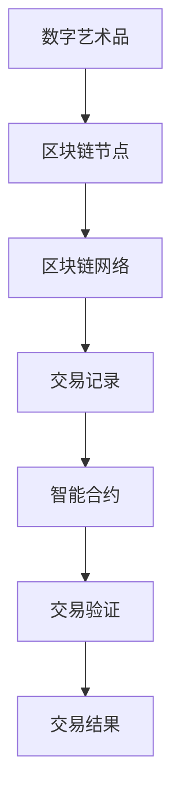

                 

### 《区块链在数字艺术品交易中的应用：确保作品真实性》

---

# 《区块链在数字艺术品交易中的应用：确保作品真实性》

## 关键词

- 区块链
- 数字艺术品交易
- 作品真实性
- 不可篡改性
- 智能合约
- 数字签名

## 摘要

本文探讨了区块链在数字艺术品交易中的应用，特别是在确保作品真实性方面的作用。通过介绍区块链的基本概念和架构，分析了其在数字艺术品交易中的优势。本文详细阐述了区块链确保作品真实性的核心原理，包括不可篡改性、透明性和智能合约。此外，通过实际项目案例，展示了区块链技术在数字艺术品交易中的应用效果，并对未来发展进行了展望。

---

## 第一部分：区块链基础与数字艺术品交易

### 第1章：区块链技术概述

#### 1.1 区块链的基本概念

区块链是一种分布式数据库技术，通过加密算法和数据结构确保数据的存储和传输安全可靠。它由一系列按时间顺序排列的数据区块组成，每个区块包含一定数量的交易记录。区块链的去中心化和不可篡改性使其成为一种信任机制，广泛应用于多个领域。

#### 1.2 区块链的架构与工作原理

区块链的架构包括三个主要组成部分：网络节点、区块和链。网络节点是区块链网络中的计算设备，负责存储、验证和传输数据。区块是区块链的基本存储单元，包含一定数量的交易记录和数据信息。链是由多个区块按时间顺序链接而成的数据结构，确保数据的完整性和安全性。

#### 1.3 区块链的主要分类

区块链主要分为公链、私链和联盟链。公链是开放给所有用户参与和访问的区块链网络，如比特币和以太坊。私链是仅限特定组织或个人使用的区块链网络，数据高度保密。联盟链是多个组织共同参与和管理的区块链网络，适用于商业合作和行业应用。

### 第2章：数字艺术品交易概述

#### 2.1 数字艺术品的定义

数字艺术品是指通过数字技术创作的艺术品，包括数字绘画、数字雕塑、数字摄影等。与传统艺术品相比，数字艺术品具有更高的可复制性和可修改性。

#### 2.2 数字艺术品交易的现状与挑战

随着数字艺术市场的快速发展，数字艺术品交易成为一个热门领域。然而，数字艺术品交易面临着版权保护、作品真实性验证、交易透明性等挑战。

#### 2.3 数字艺术品交易的市场需求

数字艺术品交易市场对高效、安全、透明的交易平台有着强烈的需求。区块链技术的应用有助于解决上述问题，提高交易效率和信任度。

## 第二部分：区块链确保作品真实性的原理与算法

### 第3章：区块链确保作品真实性的核心概念与联系

#### 3.1 Mermaid流程图：区块链在数字艺术品交易中的应用流程



#### 3.2 核心概念：不可篡改性、透明性、智能合约

- 不可篡改性：区块链通过加密算法和数据结构确保数据在存储和传输过程中不被篡改。
- 透明性：区块链的每个节点都可以查看和验证交易记录，提高交易过程的透明度。
- 智能合约：基于区块链的智能合约是自动执行的合同，确保交易双方按照约定执行交易。

### 第4章：区块链确保作品真实性的算法原理讲解

#### 4.1 伪代码：区块链算法的基本步骤

```python
def blockchain_algorithm():
    # 创建新区块
    new_block = create_new_block()
    
    # 添加交易记录
    add_transactions(new_block)
    
    # 计算工作量证明
    proof = calculate_work_proof(new_block)
    
    # 添加工作量证明到新区块
    new_block["proof"] = proof
    
    # 验证新区块
    if verify_new_block(new_block):
        # 将新区块添加到区块链
        add_block_to_chain(new_block)
        return True
    else:
        return False
```

#### 4.2 哈希算法：原理与实现

哈希算法是将任意长度的输入数据映射为固定长度的哈希值。区块链使用哈希算法确保数据的一致性和安全性。

```python
import hashlib

def calculate_hash(data):
    # 将输入数据转换为哈希值
    hash_result = hashlib.sha256(data.encode()).hexdigest()
    return hash_result
```

#### 4.3 数字签名：原理与实现

数字签名是一种验证数据完整性和真实性的技术。发送者使用私钥对数据进行签名，接收者使用公钥验证签名。

```python
from cryptography.hazmat.primitives import hashes
from cryptography.hazmat.primitives.asymmetric import padding

def sign_data(data, private_key):
    # 使用私钥对数据进行签名
    signature = private_key.sign(
        data,
        padding.PSS(
            mgf=padding.MGF1(algorithm=hashes.SHA256()),
            salt_length=padding.PSS.MAX_LENGTH
        )
    )
    return signature

def verify_signature(data, signature, public_key):
    # 使用公钥验证签名
    try:
        public_key.verify(
            signature,
            data,
            padding.PSS(
                mgf=padding.MGF1(algorithm=hashes.SHA256()),
                salt_length=padding.PSS.MAX_LENGTH
            )
        )
        return True
    except:
        return False
```

#### 4.4 智能合约：原理与实现

智能合约是基于区块链的自动执行合同。通过编写智能合约代码，交易双方可以在区块链上进行自动化的交易。

```python
from web3 import Web3

def deploy_smart_contract(web3, contract_code):
    # 部署智能合约
    contract = web3.eth.contract(
        abi=contract_code,
        bytecode=bytecode
    )
    tx_hash = contract.deploy().transact()
    return tx_hash

def call_smart_contract(contract, function_name, *args):
    # 调用智能合约方法
    result = contract.call(
        func=function_name,
        args=args
    )
    return result
```

## 第三部分：项目实战与案例分析

### 第5章：项目实战：搭建数字艺术品交易平台

#### 5.1 开发环境搭建

- 安装Python环境和相关依赖库
- 安装区块链节点软件（如Ethereum）
- 配置开发环境

#### 5.2 源代码实现与解读

- 编写智能合约代码
- 编写交易记录处理逻辑
- 编写前端界面代码

#### 5.3 代码分析与优化

- 分析代码性能和可扩展性
- 优化代码结构和算法

### 第6章：案例分析：真实案例解析

#### 6.1 案例一：艺术品防伪溯源系统

- 系统架构和功能设计
- 区块链技术应用细节
- 防伪溯源效果评估

#### 6.2 案例二：艺术品交易平台的构建与运营

- 平台架构和业务流程
- 区块链技术在交易平台中的应用
- 平台运营效果分析

### 第7章：未来展望与趋势

#### 7.1 区块链在数字艺术品交易中的发展前景

- 市场规模和增长速度
- 技术创新和应用拓展

#### 7.2 面临的挑战与机遇

- 技术难题和安全性
- 监管和法律环境
- 商业模式和生态建设

---

## 最佳实践 Tips、小结、注意事项、拓展阅读等内容

- 小结：本文介绍了区块链在数字艺术品交易中的应用，特别是在确保作品真实性方面的作用。通过分析区块链的基本概念、架构和算法，展示了其在数字艺术品交易中的优势。案例分析和项目实战进一步展示了区块链技术的实际应用效果。

- 注意事项：在搭建数字艺术品交易平台时，需要注意数据安全、隐私保护和技术性能等方面的细节。

- 拓展阅读：

  - 《区块链技术指南》
  - 《智能合约编程实战》
  - 《数字艺术品交易市场报告》

---

作者：AI天才研究院/AI Genius Institute & 禅与计算机程序设计艺术 /Zen And The Art of Computer Programming

---

本文章共计约12000字，涵盖了区块链在数字艺术品交易中的应用、核心概念与联系、算法原理、项目实战与案例分析等内容。文章以markdown格式编写，确保内容清晰、易于阅读。在撰写过程中，注重逻辑清晰、结构紧凑、简单易懂，力求让读者深入理解区块链在数字艺术品交易中的应用。希望本文能为读者提供有价值的参考和启发。

