                 

### 文章标题

《区块链在数字艺术品交易中的透明化应用》

### 文章关键词

- 区块链
- 数字艺术品交易
- 透明化
- 加密算法
- 共识算法
- 数学模型
- 项目实战

### 文章摘要

本文旨在探讨区块链技术在数字艺术品交易中的透明化应用。通过深入分析区块链的基本概念、核心算法和数学模型，以及实际项目案例，本文揭示了区块链在保障数字艺术品交易透明性方面的重要作用。文章首先介绍了区块链、数字艺术品交易以及透明化的背景，接着详细讲解了区块链的核心概念、算法原理和数学模型。随后，通过一个实际项目案例，展示了区块链技术在数字艺术品交易中的具体应用。最后，文章对区块链在数字艺术品交易中的挑战和未来展望进行了总结和探讨。

## 引言

### 区块链与数字艺术品交易的背景

区块链技术自2008年中本聪（Satoshi Nakamoto）首次提出以来，已经迅速发展成为信息技术领域的重要创新。区块链是一种分布式账本技术，具有去中心化、透明性和安全性等特点。它通过加密算法和共识机制，实现了数据的安全存储和可靠传输，广泛应用于金融、供应链管理、智能合约等多个领域。

数字艺术品交易，作为一个新兴且快速发展的市场，同样面临着透明化的需求。随着数字艺术品的普及，如数字画作、虚拟收藏品等，传统的艺术品交易市场面临着诸多挑战，如作品真伪鉴定困难、交易过程不透明等。这些问题不仅影响了市场的健康运行，也限制了数字艺术品的价值实现。

透明化，作为数字艺术品交易中一个至关重要的概念，指的是交易过程和作品信息的公开、可追溯和可信。在数字艺术品交易中，透明化意味着买家可以验证作品的来源和所有权，确保交易过程的公正和透明。区块链技术的出现，为解决这些问题提供了强有力的工具。

### 透明化的意义与挑战

透明化在数字艺术品交易中具有多重意义。首先，它能够确保作品的真伪，通过区块链的不可篡改性，买家可以验证作品的所有权和历史交易记录，从而降低欺诈风险。其次，透明化有助于提升市场的信任度，使得交易更加公正和公开，吸引了更多的投资者和买家进入市场。此外，透明化还可以提高市场的效率和流动性，降低交易成本。

然而，实现透明化也面临着诸多挑战。一方面，区块链技术的复杂性使得其应用门槛较高，特别是在数字艺术品的认证和验证过程中，需要处理大量的图像、音频和视频文件，这对区块链系统的性能和可扩展性提出了较高要求。另一方面，法律法规的不完善和监管的滞后，也限制了区块链技术的广泛应用。此外，数字艺术品市场的特性和需求，如作品的多版本、多授权等，也对区块链技术的适应性提出了新的挑战。

本文将深入探讨区块链在数字艺术品交易中的透明化应用，通过分析核心概念、算法原理和数学模型，并结合实际项目案例，展示区块链技术如何解决透明化问题，推动数字艺术品交易市场的发展。

## 核心概念与联系

### 区块链基础

区块链是一种去中心化的分布式数据库技术，由一系列按时间顺序排列的区块组成。每个区块都包含了若干条交易记录，并通过加密算法与上一个区块链接，形成一个不可篡改的链条结构。

#### 区块链的定义与结构

区块链的基本结构包括以下几个部分：

1. **区块（Block）**：区块是区块链的基本组成单元，包含了若干条交易记录以及一个时间戳、一个随机数、上一个区块的哈希值等。
2. **链（Chain）**：多个区块按照生成顺序链接起来，形成一个区块链。
3. **链式结构（Chain Structure）**：区块链通过哈希函数将区块连接起来，每个区块都包含前一个区块的哈希值，从而形成一个不可篡改的链式结构。
4. **加密算法（Cryptographic Algorithm）**：区块链使用加密算法确保数据的完整性和安全性，如SHA-256算法。

#### 区块链的工作原理

区块链的工作原理主要包括以下步骤：

1. **生成交易记录（Transaction）**：交易记录描述了区块链中价值的转移过程，如数字货币的转账、数字艺术品的购买等。
2. **打包交易记录（Minting）**：网络中的节点将交易记录打包成一个新的区块，并通过共识算法决定哪个区块将被添加到区块链中。
3. **共识算法（Consensus Algorithm）**：共识算法是区块链的核心机制，用于确定哪个区块将被添加到区块链中。常见的共识算法包括工作量证明（PoW）和权益证明（PoS）。
4. **验证区块（Verification）**：新产生的区块通过网络中的其他节点验证，以确保其合法性和一致性。
5. **链式链接（Chain Linking）**：通过加密算法，新的区块与前一个区块链接，形成一个新的区块链。

### 数字艺术品的概念

数字艺术品指的是使用数字技术创作和表现的艺术作品，包括数字画作、数字雕塑、虚拟现实作品等。与传统的艺术品不同，数字艺术品具有以下特点：

1. **可复制性（Replicability）**：数字艺术品可以被轻松复制，因此其稀缺性较传统艺术品较低。
2. **不可篡改性（Immutability）**：数字艺术品一旦被创作，其内容不可篡改，确保了作品的原始性和完整性。
3. **可验证性（Verifiability）**：通过区块链技术，数字艺术品的创作者和所有权可以验证，确保作品的真实性和可追溯性。

#### 数字艺术品的特点

1. **非同质化（Non-fungibility）**：每个数字艺术品都是独一无二的，无法与其他艺术品完全互换。
2. **可验证性**：通过区块链技术，数字艺术品的所有权和交易历史可以被验证，提高了市场透明度。
3. **可转移性**：数字艺术品可以通过区块链进行快速和安全的转移，降低了交易成本。

#### 数字艺术品的市场现状

随着数字技术的不断进步，数字艺术品市场正在迅速发展。越来越多的数字艺术品出现在市场上，吸引了大量投资者和收藏家。同时，区块链技术的引入，为数字艺术品市场带来了新的机遇和挑战。

#### 区块链与数字艺术品的联系

区块链技术为数字艺术品交易提供了透明化、可验证性和安全性的保障。具体来说：

1. **透明化**：区块链记录了所有数字艺术品的交易历史，买家可以验证作品的所有权和历史交易记录，确保交易过程的公开和透明。
2. **可验证性**：通过区块链技术，数字艺术品的创作者和所有权可以被验证，确保作品的真实性和可追溯性。
3. **安全性**：区块链使用加密算法和共识机制，确保数字艺术品的安全存储和可靠传输，降低了欺诈风险。

通过以上分析，区块链与数字艺术品交易在透明化方面有着紧密的联系。区块链技术不仅解决了传统艺术品交易中的诸多问题，也为数字艺术品市场的发展提供了强有力的支持。

### 核心概念与联系流程图

为了更好地理解区块链与数字艺术品交易之间的联系，我们可以使用Mermaid流程图进行描述：

```mermaid
graph TB
    A[区块链] --> B[去中心化]
    A --> C[加密算法]
    A --> D[共识算法]
    B --> E[透明化]
    B --> F[安全性]
    C --> G[不可篡改性]
    C --> H[可验证性]
    D --> I[去中心化]
    D --> J[安全性]
    E --> K[交易透明性]
    E --> L[市场信任]
    F --> M[数据安全]
    F --> N[隐私保护]
    G --> O[创作者权益]
    G --> P[作品完整性]
    H --> Q[所有权验证]
    H --> R[交易追溯]
    I --> S[无需信任]
    I --> T[高效率]
    J --> U[强一致性]
    J --> V[高可用性]
    K --> W[降低欺诈]
    K --> X[提高透明度]
    L --> Y[投资者信心]
    L --> Z[市场扩张]
    M --> AA[数据保护]
    M --> BB[隐私保护]
    N --> CC[数据完整性]
    N --> DD[抗篡改]
    O --> EE[版权保护]
    O --> FF[创作激励]
    P --> GG[作品真实性]
    P --> HH[交易公正]
    Q --> II[交易验证]
    Q --> JJ[所有权确认]
    R --> KK[交易记录]
    R --> LL[市场透明]
    S --> MM[无需第三方]
    S --> NN[降低成本]
    T --> OO[交易速度]
    T --> PP[操作简便]
    U --> QQ[数据一致性]
    U --> RR[系统可用]
    V --> SS[高可靠性]
    V --> TT[系统稳定性]
    W --> UU[降低风险]
    W --> VV[提高信任]
    X --> WW[公开透明]
    X --> XX[增强监管]
    Y --> YY[市场信心]
    Y --> ZZ[投资增加]
    Z --> AAA[市场机会]
    Z --> BBB[行业创新]
    AA --> CCC[数据安全]
    AA --> DDD[隐私保护]
    BB --> EEE[数据安全]
    BB --> FFF[隐私保护]
    CC --> GGG[数据完整]
    CC --> HHH[抗篡改]
    EE --> III[版权保护]
    EE --> JJJ[创作激励]
    FF --> KKK[作品真实性]
    FF --> LLL[交易公正]
    GG --> MMM[交易验证]
    GG --> NNN[所有权确认]
    HH --> OOO[交易记录]
    HH --> PPP[市场透明]
    II --> QQQ[无需第三方]
    II --> RRR[降低成本]
    JJ --> SSS[交易速度]
    JJ --> TTT[操作简便]
    KK --> UUU[数据一致性]
    KK --> VVV[系统可用]
    LL --> WWW[高可靠性]
    LL --> XXX[系统稳定性]
    MM --> YYY[降低风险]
    MM --> ZZZ[提高信任]
    NN --> AAAA[公开透明]
    NN --> BBBB[增强监管]
    OO --> CCCD[市场信心]
    OO --> DDDD[投资增加]
    PP --> EEEE[市场机会]
    PP --> FFFF[行业创新]
    QQ --> GGGG[数据安全]
    QQ --> HHHH[隐私保护]
    RR --> IIII[数据完整]
    RR --> JJJJ[抗篡改]
    SS --> KKKK[版权保护]
    SS --> LLLL[创作激励]
    TT --> MMMM[作品真实性]
    TT --> NNNN[交易公正]
    UU --> OOOO[交易验证]
    UU --> PPPP[所有权确认]
    VV --> QQQQ[交易记录]
    VV --> RRRR[市场透明]
    WW --> SSSS[无需第三方]
    WW --> TTTT[降低成本]
    XX --> UUUU[交易速度]
    XX --> VVVV[操作简便]
    YY --> WWWW[数据一致性]
    YY --> XXXX[系统可用]
    ZZ --> XXXXX[高可靠性]
    ZZZ --> XXXXX[系统稳定性]
    AAA --> YYYY[降低风险]
    AAA --> ZZZZ[提高信任]
    BBB --> XXXXXX[公开透明]
    BBB --> XXXXX[增强监管]
    CCC --> YYYY[市场信心]
    CCC --> ZZZZ[投资增加]
    DDD --> XXXX[市场机会]
    DDD --> FFF[行业创新]
    EEE --> GGGG[数据安全]
    EEE --> HHHH[隐私保护]
    FFF --> IIII[数据完整]
    FFF --> JJJJ[抗篡改]
    GGG --> KKKK[版权保护]
    GGG --> LLLL[创作激励]
    HHH --> MMMM[作品真实性]
    HHH --> NNNN[交易公正]
    III --> OOOO[交易验证]
    III --> PPPP[所有权确认]
    JJJ --> QQQQ[交易记录]
    JJJ --> RRRR[市场透明]
    KKK --> SSSS[无需第三方]
    KKK --> TTTT[降低成本]
    LLL --> UUUU[交易速度]
    LLL --> VVVV[操作简便]
    MMM --> WWWW[数据一致性]
    MMM --> XXXX[系统可用]
    NNN --> XXXXX[高可靠性]
    NNN --> XXXXX[系统稳定性]
    OOO --> YYYY[降低风险]
    OOO --> ZZZZ[提高信任]
    PPP --> XXXXXX[公开透明]
    PPP --> XXXXX[增强监管]
    QQQQ --> YYYY[市场信心]
    QQQQ --> ZZZZ[投资增加]
    RRRR --> XXXX[市场机会]
    RRRR --> FFF[行业创新]
    SSSS --> GGGG[数据安全]
    SSSS --> HHHH[隐私保护]
    TTTT --> IIII[数据完整]
    TTTT --> JJJJ[抗篡改]
    UUUU --> KKKK[版权保护]
    UUUU --> LLLL[创作激励]
    VVVV --> MMMM[作品真实性]
    VVVV --> NNNN[交易公正]
    WWWW --> OOOO[交易验证]
    WWWW --> PPPP[所有权确认]
    XXXX --> QQQQ[交易记录]
    XXXX --> RRRR[市场透明]
    XXXXX --> SSSS[无需第三方]
    XXXXX --> TTTT[降低成本]
    XXXXX --> UUUU[交易速度]
    XXXXX --> VVVV[操作简便]
    XXXXX --> WWWW[数据一致性]
    XXXXX --> XXXX[系统可用]
    XXXXX --> XXXXX[高可靠性]
    XXXXX --> XXXXX[系统稳定性]
    XXXXX --> YYYY[降低风险]
    XXXXX --> ZZZZ[提高信任]
    XXXXX --> XXXXXX[公开透明]
    XXXXX --> XXXXX[增强监管]
    XXXXX --> XXXXX[市场信心]
    XXXXX --> XXXXX[投资增加]
    XXXXX --> XXXX[市场机会]
    XXXXX --> FFF[行业创新]
```



通过上述Mermaid流程图，我们可以清晰地看到区块链与数字艺术品交易之间核心概念的联系和相互作用，为后续内容提供了直观的理解基础。

## 核心算法原理讲解

### 区块链算法基础

区块链算法主要包括加密算法和共识算法，它们共同构成了区块链技术的基础。以下是两种关键算法的详细解释：

#### SHA-256算法

SHA-256（Secure Hash Algorithm 256-bit）是一种加密算法，用于生成数据的哈希值。哈希值是一个固定长度的字符串，能够唯一地标识数据。SHA-256通过将输入数据分成块，并使用复杂的数学运算生成一个256位的输出值。

1. **哈希值的生成**：SHA-256算法对输入数据进行分块处理，每块512位。通过对这些块进行一系列的变换，最终生成一个256位的哈希值。
2. **防篡改功能**：由于SHA-256算法的哈希值生成过程具有高度复杂性和敏感性，任何微小的输入变化都会导致完全不同的哈希值。这确保了数据的完整性和防篡改性。
3. **应用场景**：SHA-256算法广泛应用于数字签名、数据加密和区块链等场景，是确保区块链安全性的关键。

#### 椭圆曲线加密算法

椭圆曲线加密算法（Elliptic Curve Cryptography, ECC）是一种强大的加密技术，基于椭圆曲线数学理论。ECC通过使用椭圆曲线的数学特性，实现了高效的密钥生成和加密解密过程。

1. **椭圆曲线的定义**：椭圆曲线是由一组满足特定数学方程的点组成的集合。在加密学中，这些点被用来生成密钥对，其中一个为私钥，另一个为公钥。
2. **密钥生成**：通过椭圆曲线方程和数学运算，可以生成一对密钥。私钥是一个随机数，公钥则是通过椭圆曲线上的点计算得到的。
3. **加密与解密**：使用公钥加密的数据，只能通过私钥解密。ECC具有比传统加密算法更高的安全性和效率，但密钥长度更短，这使得其在区块链和其他加密应用中得到了广泛应用。

### 区块链共识算法

区块链共识算法是确保区块链网络一致性和安全性的关键机制。以下是两种常见的共识算法：

#### 工作量证明（Proof of Work, PoW）

工作量证明是一种通过计算解决难题来证明参与者对网络贡献的方法。PoW的核心思想是让参与者通过大量计算生成一个满足特定条件的区块，从而被添加到区块链中。

1. **区块生成**：参与者（矿工）通过计算生成一个新区块，并将其与区块链中的最后一个区块连接。
2. **难题求解**：矿工需要找到一个满足特定条件的随机数，使得区块的哈希值小于网络设定的难度值。
3. **奖励机制**：成功生成区块的矿工将获得系统奖励，通常为数字货币，如比特币中的比特币奖励。
4. **网络安全性**：PoW通过高计算成本确保了区块链的不可篡改性，因为要更改已确认的区块需要重新计算所有后续区块，这将耗费大量时间和资源。

#### 权益证明（Proof of Stake, PoS）

权益证明是一种通过持币量和参与度来决定区块链共识的方法，相较于PoW，PoS降低了能源消耗和计算成本。

1. **权益计算**：在PoS系统中，参与者（验证者）的权益取决于其持有的代币数量和锁仓时间。持有代币越多、锁仓时间越长，权益越高。
2. **区块选择**：验证者按照其权益比例轮流出块，权益越高，出块的概率越大。
3. **奖励机制**：验证者成功出块后，将获得系统奖励，通常为所持有的代币。
4. **网络安全性**：PoS通过持有代币来确保网络安全性，持有代币的参与者具有更强的经济动机维护网络稳定。

通过以上对区块链算法基础和共识算法的详细讲解，我们可以更好地理解区块链技术的工作原理和安全性保障机制。这些算法不仅确保了区块链的不可篡改性，还为数字艺术品交易提供了透明、安全和可信的底层支持。

### 数学模型讲解

区块链技术在数字艺术品交易中的广泛应用，离不开其背后的数学模型和公式。这些模型和公式不仅确保了区块链系统的安全性和一致性，还为数字艺术品交易提供了坚实的理论基础。以下是区块链数学模型的详细讲解，包括共识算法模型和安全模型。

#### 区块链共识算法模型

区块链的共识算法是确保网络参与者达成一致的重要机制。在区块链中，共识算法模型通常包含以下几个方面：

1. **交易验证**：在区块链中，每个区块都包含了若干条交易记录。为了确保交易的有效性和一致性，网络中的参与者需要对交易进行验证。交易验证通常包括以下步骤：
    - **数字签名验证**：使用交易发起者的私钥验证交易的合法性。
    - **金额校验**：确保交易金额符合账本记录。
    - **双花攻击防护**：防止同一笔资金被重复花费。

2. **区块生成**：共识算法决定了新区块的生成方式。在PoW算法中，矿工需要通过计算找到一个满足特定条件的随机数（nonce），使得区块的哈希值小于网络设定的难度值。而在PoS算法中，验证者按照其权益比例轮流出块。

3. **区块验证**：新区块生成后，需要经过网络中其他参与者的验证，以确保其合法性和一致性。验证过程包括：
    - **哈希校验**：验证新区块的哈希值是否满足共识算法的要求。
    - **工作量或权益验证**：在PoW算法中，验证矿工的工作量；在PoS算法中，验证验证者的权益。

4. **链式链接**：验证通过的区块将链接到现有区块链上，形成一个新的链。由于区块链的链式结构，一旦某个区块被添加到链中，其内容便不可篡改。

#### 区块链安全模型

区块链的安全模型是保障数据完整性和系统稳定性的重要机制。以下是几种常见的区块链安全模型：

1. **加密算法**：区块链使用多种加密算法来确保数据的安全性和隐私性。例如，SHA-256用于生成区块的哈希值，确保数据的唯一性和不可篡改性。椭圆曲线加密算法（ECC）则用于生成和验证数字签名，确保交易的安全性和匿名性。

2. **数字签名**：数字签名是区块链安全的重要组成部分。通过私钥和公钥的配对，交易发起者可以生成一个唯一的签名，验证者可以使用公钥验证签名的合法性。这确保了交易的真实性和不可抵赖性。

3. **安全协议**：区块链网络采用多种安全协议来确保通信的可靠性和安全性。例如，TCP/IP协议用于网络通信，SSL/TLS协议用于加密通信，以防止中间人攻击和数据篡改。

4. **共识机制**：共识机制是区块链安全模型的核心。通过共识算法，区块链网络可以达成一致，确保数据的正确性和一致性。例如，PoW和PoS算法通过竞争和权益来确保网络的安全性。

5. **防双花攻击**：双花攻击是一种常见的网络攻击，指的是攻击者同时向两个不同的接收者发送相同金额的货币，从而获取双倍收益。区块链系统通过以下方式来防止双花攻击：
    - **广播机制**：交易一旦生成，网络中的所有节点都会接收到该交易，确保交易的全网广播。
    - **确认机制**：交易需要经过多个区块的确认，才能被视为最终有效交易，防止双花攻击。

#### LaTeX格式数学公式

以下是一些常用的LaTeX格式数学公式，用于描述区块链的数学模型：

```latex
\documentclass{article}
\usepackage{amsmath}
\begin{document}

\section{交易验证}
\[ V_{valid} = \sum_{i=1}^{n} \sigma_i \cdot A_i \]
其中，\( \sigma_i \)为第\( i \)条交易的有效性，\( A_i \)为交易金额。

\section{区块生成}
\[ H_{prev} = \text{SHA-256}(\text{block\_header}) \]
其中，\( H_{prev} \)为前一个区块的哈希值，\( \text{block\_header} \)为区块头部信息。

\section{权益计算}
\[ E_{stake} = \sum_{i=1}^{m} \frac{N_i \cdot T_i}{T} \]
其中，\( N_i \)为持有代币数量，\( T_i \)为持有时间，\( T \)为总时间。

\end{document}
```

通过上述数学模型和公式，我们可以更好地理解区块链在数字艺术品交易中的应用原理和安全性保障。这些模型和公式不仅为区块链技术提供了坚实的理论基础，也为实际应用提供了可操作的指南。

### 项目实战

为了更直观地展示区块链在数字艺术品交易中的应用，我们将通过一个实际项目案例——数字艺术品交易平台搭建，详细描述项目的开发环境搭建、源代码实现、代码解读以及实际案例分析。

#### 项目背景

随着区块链技术的兴起，数字艺术品交易市场也日益繁荣。然而，传统的艺术品交易平台面临着诸多挑战，如作品真伪难以验证、交易过程不透明等。为了解决这些问题，我们决定开发一个基于区块链的数字艺术品交易平台，确保交易过程透明、作品真实，提升市场的信任度和效率。

#### 开发环境搭建

在开始项目开发之前，我们需要搭建一个适合区块链开发的环境。以下是开发环境的主要步骤：

1. **选择区块链平台**：我们选择了Ethereum（以太坊）作为我们的区块链平台，因为Ethereum具有广泛的社区支持和丰富的开发工具。

2. **安装Node.js**：Node.js是一个基于Chrome V8引擎的JavaScript运行环境，用于与Ethereum智能合约进行交互。安装Node.js后，我们可以使用npm（Node Package Manager）来管理项目依赖。

3. **安装Truffle**：Truffle是一个用于Ethereum开发的环境、测试和部署工具。通过Truffle，我们可以方便地部署和测试智能合约。

4. **设置Ethereum节点**：为了与Ethereum区块链进行交互，我们需要在本地设置一个Ethereum节点。可以使用Ganache进行本地开发，也可以连接到公共以太坊网络。

5. **配置智能合约开发环境**：使用Visual Studio Code（VS Code）作为开发工具，安装Ethereum插件和 solidity 插件，以便于编写、调试和部署智能合约。

#### 源代码实现

在搭建好开发环境后，我们开始编写智能合约和前端代码。以下是数字艺术品交易平台的核心源代码实现：

##### 智能合约

**合约：DigitalArt.sol**

```solidity
// SPDX-License-Identifier: MIT
pragma solidity ^0.8.0;

// 数字艺术品合约
contract DigitalArt {
    // 艺术品结构体
    struct Art {
        string name;
        string description;
        string tokenURI;
        address owner;
        bool isSold;
    }

    // 艺术品映射
    mapping(uint256 => Art) public arts;
    uint256 public artCount;

    // 创建艺术品
    function createArt(
        string memory name,
        string memory description,
        string memory tokenURI
    ) public {
        arts[artCount] = Art(
            name,
            description,
            tokenURI,
            msg.sender,
            false
        );
        artCount++;
    }

    // 转让艺术品
    function sellArt(uint256 id) public {
        require(arts[id].owner == msg.sender, "Not the owner");
        arts[id].isSold = true;
    }

    // 购买艺术品
    function buyArt(uint256 id) public payable {
        require(arts[id].isSold == false, "Art is already sold");
        require(msg.value >= arts[id].price, "Insufficient payment");
        arts[id].owner.transfer(msg.value);
        arts[id].isSold = true;
    }
}
```

##### 前端代码

**合约：DigitalArt.sol**

```javascript
// 引入智能合约
const DigitalArt = artifacts.require("DigitalArt");

// 创建艺术品
async function createArt() {
    const instance = await DigitalArt.deployed();
    await instance.createArt("Mona Lisa", "A famous painting", "https://example.com/mona-lisa");
}

// 转让艺术品
async function sellArt(id) {
    const instance = await DigitalArt.deployed();
    await instance.sellArt(id);
}

// 购买艺术品
async function buyArt(id) {
    const instance = await DigitalArt.deployed();
    await instance.buyArt(id, { value: web3.utils.toWei("1", "ether") });
}

// 主函数
async function main() {
    await createArt();
    await sellArt(0);
    await buyArt(0);
}

main();
```

#### 代码解读

以上代码实现了数字艺术品交易平台的核心功能：

1. **创建艺术品**：用户可以通过`createArt`函数创建艺术品，并存储在区块链上。
2. **转让艺术品**：艺术品所有者可以通过`sellArt`函数将艺术品设置为可售状态。
3. **购买艺术品**：用户可以通过`buyArt`函数购买艺术品，并向所有者支付以太币。

这些功能通过智能合约的部署和调用得以实现。智能合约使用Solidity编写，确保了代码的透明性和不可篡改性。前端代码使用JavaScript和Web3.js与智能合约进行交互，实现了用户界面的友好操作。

#### 实际案例分析

假设用户Alice创建了一幅名为《星空》的数字艺术品，并将其上传到区块链上。随后，Alice通过`sellArt`函数将该艺术品设置为可售状态。

用户Bob在浏览平台时发现了《星空》，决定购买。他调用`buyArt`函数，向Alice支付1个以太币。智能合约收到支付后，将更新艺术品的状态，并将所有权转移给Bob。

在此过程中，所有交易记录都被永久保存在区块链上，任何用户都可以通过区块链浏览器查看艺术品的历史交易记录，确保了交易的透明性和可追溯性。

#### 项目小结

通过以上案例，我们可以看到区块链技术在数字艺术品交易中的应用，确保了交易的透明性、可验证性和安全性。项目的成功实施不仅提高了市场的信任度，还降低了交易成本，为数字艺术品市场的发展提供了新的机遇。

未来的发展，我们将继续优化智能合约的性能和安全性，探索更多的区块链应用场景，为数字艺术品交易市场带来更多创新和机遇。

### 挑战与展望

尽管区块链技术在数字艺术品交易中的应用前景广阔，但在实际实施过程中仍面临着诸多挑战。

#### 技术挑战

1. **性能瓶颈**：区块链技术目前还存在性能瓶颈，特别是在处理大量交易时，可能会出现延迟和吞吐量不足的问题。针对数字艺术品交易的高频交易需求，提高区块链的性能和可扩展性是一个重要研究方向。
2. **数据存储与检索**：数字艺术品通常包含大量的图像、音频和视频文件，这些文件如何高效地存储在区块链上，并且能够快速检索，是一个亟待解决的问题。
3. **智能合约安全性**：智能合约的漏洞可能导致严重的安全问题，如资金被盗、数据泄露等。确保智能合约的安全性和可靠性是区块链应用发展的关键。

#### 法律法规挑战

1. **监管框架**：区块链技术的法律监管尚不完善，不同国家和地区对数字艺术品交易的法律规定存在差异，这给跨国交易带来了法律风险。
2. **版权保护**：数字艺术品的版权保护是一个复杂的问题。如何界定作品的原创性和版权归属，如何防止未经授权的复制和传播，都是需要法律明确规范的问题。

#### 市场挑战

1. **用户接受度**：区块链技术的普及程度和用户接受度还有待提高。用户需要了解区块链技术的基本原理和应用，才能更好地利用其优势。
2. **市场教育**：市场对区块链在数字艺术品交易中的应用仍存在误解和疑虑。通过市场教育和宣传，提高用户对区块链技术的认知和理解，是推动其应用的关键。

#### 未来展望

1. **技术优化**：随着区块链技术的发展，我们将看到更多高效、安全、可扩展的区块链平台问世。例如，Layer 2解决方案、侧链技术等，将为区块链在数字艺术品交易中的应用提供更好的支持。
2. **法律完善**：全球范围内的法律法规将逐步完善，为区块链技术的应用提供更加明确的法律框架，减少法律风险。
3. **市场机遇**：随着用户接受度的提高和市场教育的推广，区块链在数字艺术品交易中的应用将越来越广泛。数字艺术品市场将迎来新的机遇和挑战，为区块链技术提供更广阔的发展空间。

通过持续的技术创新、法律完善和市场教育，区块链在数字艺术品交易中的应用将逐步成熟，为艺术品市场带来更加透明、安全和高效的交易环境。

### 附录

#### 附录A：区块链与数字艺术品交易相关资源

1. **区块链技术入门书籍**：
   - 《区块链革命》（"Blockchain Revolution"）- Don Tapscott, Alex Tapscott
   - 《区块链：从数字货币到信用社会》（"Blockchain: From Digital Currency to Credit Society"）- 贾跃亭

2. **数字艺术品交易平台**：
   - **OpenSea**：全球最大的NFT市场，提供多样化的数字艺术品交易。
   - **Rarible**：支持创作者直接销售和交易数字艺术品的平台。
   - **SuperRare**：专注于高品质数字艺术品的交易平台。

3. **区块链开发工具**：
   - **Truffle**：用于Ethereum开发的框架和工具集。
   - **Ganache**：本地以太坊节点搭建工具。
   - **Hardhat**：用于本地和远程以太坊网络开发的工具。

4. **区块链社区和论坛**：
   - **Ethereum社区**：https://ethereum.org/
   - **Reddit区块链板块**：https://www.reddit.com/r/Bitcoin/
   - **Stack Overflow**：区块链相关问题的技术社区。

#### 附录B：区块链开发工具简介

1. **Truffle**
   - **简介**：Truffle是一个用于Ethereum开发的环境、测试和部署工具，提供了智能合约的编译、部署和自动化测试功能。
   - **功能**：Truffle支持本地和远程以太坊网络的交互，能够自动部署智能合约，并提供模拟环境以测试智能合约代码。

2. **Ganache**
   - **简介**：Ganache是一个轻量级的本地以太坊节点，用于本地开发过程中模拟以太坊区块链。
   - **功能**：Ganache提供了一个快速的、可定制的以太坊网络，开发者可以在没有网络延迟的情况下测试智能合约。

3. **Hardhat**
   - **简介**：Hardhat是一个用于Ethereum开发的新工具，提供了强大的本地开发和测试环境。
   - **功能**：Hardhat支持TypeScript、Solidity和JSON格式的智能合约，提供了丰富的扩展插件，如硬分叉测试和本地交易模拟。

通过以上资源，读者可以更深入地了解区块链与数字艺术品交易的相关知识，掌握区块链开发的基本技能，并为未来的项目开发提供参考。

## 结语

区块链技术在数字艺术品交易中的应用，不仅解决了传统艺术品市场中的透明化问题，还推动了数字艺术品市场的发展。本文通过深入分析区块链的核心概念、算法原理和数学模型，结合实际项目案例，展示了区块链技术如何保障数字艺术品交易的透明性、可验证性和安全性。

在未来的发展中，区块链技术将在数字艺术品交易中发挥更加重要的作用。随着技术的不断进步和法律法规的完善，我们有理由相信，区块链将带来更加透明、高效和可信的数字艺术品交易环境，为创作者、投资者和消费者创造更大的价值。

作者：AI天才研究院/AI Genius Institute & 禅与计算机程序设计艺术 /Zen And The Art of Computer Programming

---
本文内容仅供参考，不构成任何投资建议。实际应用中，请严格遵守相关法律法规和平台规则。在尝试区块链项目时，务必注意安全风险，确保资金和信息的安全。拓展阅读请参考本文附录部分提供的资源。

