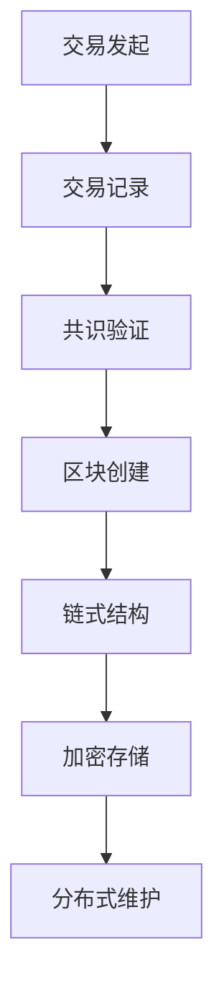

                 

### 摘要

本文深入探讨了区块链在数字艺术品交易中的防伪应用。首先，我们介绍了区块链的基本概念和架构，通过Mermaid流程图展示了区块链的核心组成部分及其工作原理。接着，我们探讨了数字艺术品市场现状及其防伪需求，阐述了数字签名技术、椭圆曲线加密算法和哈希函数在防伪中的应用。然后，本文重点分析了区块链与数字艺术品防伪的结合点，展示了区块链在防伪中的优势，并详细介绍了智能合约在防伪中的应用。通过一个实际项目案例，本文展示了如何使用区块链技术实现数字艺术品交易的防伪功能，包括开发环境搭建、源代码实现和代码解读。最后，本文对区块链在数字艺术品防伪中的技术挑战进行了探讨，并展望了其未来发展。本文旨在为区块链技术在数字艺术品交易防伪领域的应用提供有价值的参考和指导。

### 设计思路

要详细撰写一篇关于《区块链在数字艺术品交易中的防伪应用》的技术博客，我们需要系统地设计文章的结构和内容，确保每个部分都充分解释、逻辑清晰、具有实用价值。以下是我们设计的详细步骤：

#### 确定书籍主题和目标受众

首先，我们需要明确文章的主题和目标受众。本文的主题是区块链在数字艺术品交易防伪中的应用，目标受众包括区块链技术爱好者、数字艺术品创作者、艺术品交易从业者以及相关技术领域的开发者和研究者。这一步骤帮助我们定位文章的方向，确保内容能够满足受众的需求。

#### 核心概念与联系

为了帮助读者更好地理解区块链在数字艺术品交易中的防伪应用，我们需要在文章中引入并解释一些核心概念，如区块链、智能合约、数字签名、椭圆曲线加密和哈希函数等。我们将使用Mermaid流程图来展示这些概念之间的联系，使读者能够直观地理解各个部分如何协同工作。

#### 核心算法原理讲解

接下来，我们将详细讲解几个关键算法的原理，如加密算法、哈希算法等。为了使讲解通俗易懂，我们将使用伪代码和Python源代码来展示这些算法的工作过程。我们将结合数学模型和公式，对每个算法的细节进行剖析，并提供实例说明。

#### 数学模型和数学公式讲解

在讲解核心算法时，我们还将涉及一些数学模型和公式，如椭圆曲线加密中的数学原理、哈希函数的性质等。我们将使用LaTeX格式来展示这些公式，并对其进行详细解释，确保读者能够理解其在区块链防伪中的应用。

#### 项目实战

为了使读者更好地理解区块链在数字艺术品交易防伪中的应用，我们将设计一个实际项目案例。这个案例将包括开发环境搭建、源代码实现和代码解读。我们将详细展示如何使用区块链技术实现数字艺术品交易的防伪功能，并提供实际案例分析和详细讲解剖析。

#### 保持简洁性和完整性

在撰写文章时，我们将保持内容的简洁性，避免冗余和复杂的技术细节。同时，我们确保文章的完整性，包含所有关键内容，如背景介绍、核心概念与联系、算法原理讲解、数学模型和公式讲解、项目实战以及技术挑战和未来展望等。

### 目录大纲设计

基于上述设计思路，我们设计了如下的目录大纲：

**第一部分：区块链基础**

- 第1章：区块链概述
  - 1.1 区块链的定义与历史背景
  - 1.2 区块链的架构与组成部分

- 第2章：数字艺术品的防伪需求
  - 2.1 数字艺术品市场现状
  - 2.2 数字艺术品的防伪技术

**第二部分：区块链在数字艺术品交易中的防伪应用**

- 第3章：区块链与数字艺术品防伪的结合
  - 3.1 区块链在防伪中的优势
  - 3.2 智能合约在防伪中的应用

- 第4章：实战案例：使用区块链防伪数字艺术品
  - 4.1 项目背景
  - 4.2 开发环境搭建
  - 4.3 源代码实现与解读

**第三部分：技术深度与未来展望**

- 第5章：区块链在数字艺术品防伪中的技术挑战
  - 5.1 数据隐私与匿名性
  - 5.2 安全性与去中心化

- 第6章：区块链在数字艺术品交易中的防伪实践
  - 6.1 实战案例分享
  - 6.2 行业发展趋势

**附录**

- 附录A：区块链防伪技术工具与资源

通过上述的设计，我们确保了文章的逻辑清晰、内容丰富且具有实际应用价值，为读者提供了全面的区块链在数字艺术品交易中防伪应用的知识和指导。

### 第一部分：区块链基础

#### 第1章 区块链概述

##### 1.1 区块链的定义与历史背景

区块链是一种分布式数据库技术，它通过多个参与节点共同维护一个去中心化的账本，每个区块都包含了特定时间内的交易记录，并通过加密算法和时间戳等技术手段确保数据的不可篡改性和透明性。区块链最早由中本聪（Satoshi Nakamoto）在2008年提出，作为比特币（Bitcoin）的基础技术而广为人知。

区块链的发展历程可以分为几个重要阶段：

1. **2008年**：中本聪发布了比特币白皮书，首次提出了区块链的概念。
2. **2009年**：比特币正式上线，标志着区块链技术的首次应用。
3. **2014年**：以太坊（Ethereum）的发布，引入了智能合约（Smart Contract）的概念，使区块链技术得以在更广泛的场景中应用。
4. **2016年**：超级节点（Super Node）概念的提出，进一步增强了区块链网络的安全性和效率。
5. **2017年**：区块链产业开始迅速发展，各种公链、联盟链和私有链纷纷涌现。
6. **2018年**：区块链技术逐渐从金融领域扩展到供应链管理、医疗健康、物联网等领域。

区块链的核心组成部分包括：

1. **区块**：区块是区块链的基本数据结构，包含了特定时间内的交易记录、时间戳、难度值等。
2. **链**：区块链是由多个区块按照时间顺序串联而成的数据结构，确保了数据的安全性和不可篡改性。
3. **节点**：节点是区块链网络的组成部分，它们通过共识机制来验证和记录交易。
4. **加密算法**：区块链使用多种加密算法来确保数据的隐私和安全。

##### 1.2 区块链的架构与组成部分

区块链的架构可以分为三层：

1. **基础层**：包括加密算法、共识机制等核心技术，确保区块链的安全性和稳定性。
2. **网络层**：包括网络通信协议、节点管理等，实现区块链节点的互联互通。
3. **应用层**：包括智能合约、分布式应用（DApp）等，为实际应用提供技术支持。

区块链的工作原理如下：

1. **交易记录**：用户通过区块链网络发起交易请求，交易信息会存储在区块链的当前区块中。
2. **共识机制**：区块链网络中的节点通过共识机制（如工作量证明PoW、权益证明PoS等）来验证交易的合法性，并将合法交易记录在区块链中。
3. **加密存储**：区块链使用加密算法对交易信息进行加密存储，确保数据的安全性和隐私。
4. **分布式维护**：区块链网络中的所有节点都参与区块链的维护和更新，确保数据的不可篡改性。

为了帮助读者更好地理解区块链的核心概念和组成部分，我们使用Mermaid流程图展示了区块链的基本架构和运作流程：



通过这个流程图，我们可以清晰地看到区块链从交易发起到最终存储的整个过程，以及各个组成部分之间的关系和作用。

##### 核心概念与联系

在本章节中，我们介绍了区块链的定义、历史背景、架构和组成部分，并使用Mermaid流程图展示了区块链的核心概念和联系。通过这一部分的讲解，读者可以初步了解区块链的基本原理和运作机制，为进一步深入学习区块链在数字艺术品交易中的防伪应用打下基础。

在下一章节中，我们将探讨数字艺术品市场的现状及其防伪需求，详细阐述数字签名技术、椭圆曲线加密算法和哈希函数在数字艺术品防伪中的应用。

### 第2章 数字艺术品的防伪需求

#### 2.1 数字艺术品市场现状

随着数字化技术的发展，数字艺术品市场正迅速崛起。数字艺术品，也称为NFT（非同质化代币），是一种使用区块链技术认证和交易的数字化艺术品。这些艺术品可以是数字绘画、音乐、视频、虚拟房地产等，它们在数字世界中具有独特的所有权和可追溯性。

数字艺术品市场具有以下几个显著特点：

1. **去中心化**：数字艺术品交易通常在去中心化的区块链平台上进行，这使得市场具有更高的透明度和信任度。
2. **全球化**：数字艺术品市场不受地理限制，艺术家和买家可以来自世界各地，这促进了艺术品的全球流通。
3. **可追溯性**：区块链技术确保了数字艺术品的每个交易都具有完整的可追溯性，从而减少了伪造和篡改的可能性。
4. **流动性**：数字艺术品市场的流动性较高，艺术品可以快速买卖，为投资者提供了良好的交易体验。
5. **多样化**：数字艺术品类型丰富，涵盖了绘画、摄影、音乐、视频、虚拟房地产等多个领域，为艺术家提供了广阔的创作空间。

尽管数字艺术品市场具有许多优势，但其发展也面临一些挑战，例如艺术品价值的波动性、市场规则的完善度等。这些问题需要通过技术创新和监管政策来逐步解决。

#### 2.2 数字艺术品的防伪需求

在传统的艺术品市场中，防伪是一个长期存在的问题。艺术品伪造和篡改不仅损害了艺术家的权益，也影响了市场的健康发展。随着数字艺术品市场的兴起，防伪需求变得更加迫切。以下是一些主要的防伪需求：

1. **身份验证**：确保数字艺术品的原创性和真实性，防止伪造和抄袭。
2. **唯一性**：数字艺术品通常具有唯一性，防伪技术需要能够准确识别每件艺术品的不同特征。
3. **不可篡改**：防伪技术需要确保数字艺术品的交易记录不可篡改，以保证交易的公正和透明。
4. **透明度**：交易过程和艺术品的所有权信息需要公开透明，以便各方查看和监督。
5. **可追溯性**：数字艺术品的历史交易记录需要能够被追溯，以方便在出现争议时进行调查。

为了满足这些防伪需求，数字艺术品市场需要采用一系列技术手段，包括数字签名、椭圆曲线加密、哈希函数等。接下来，我们将详细探讨这些技术及其在数字艺术品防伪中的应用。

##### 数字签名技术

数字签名是一种加密技术，用于验证信息的完整性和真实性。在数字艺术品交易中，数字签名可以确保艺术品的原创性和真实性，防止伪造和篡改。数字签名的基本原理如下：

1. **私钥与公钥**：数字签名使用一对密钥，即私钥和公钥。私钥是保密的，只有签名者知道；公钥是公开的，可以用于验证签名。
2. **签名过程**：签名者使用私钥对消息进行加密，生成数字签名。签名过程通常包括以下步骤：
   - 将原始消息转换为消息摘要（如使用哈希函数）。
   - 使用私钥对消息摘要进行加密，生成数字签名。
3. **验证过程**：验证者使用公钥对数字签名进行解密，并与原始消息摘要进行对比，以验证签名的有效性。验证过程通常包括以下步骤：
   - 使用公钥对数字签名进行解密，生成消息摘要。
   - 将原始消息转换为消息摘要（如使用相同的哈希函数）。
   - 对比两个消息摘要，如果相同，则签名有效。

数字签名技术在数字艺术品交易中的具体应用如下：

1. **艺术品认证**：艺术家可以使用数字签名技术对数字艺术品进行认证，确保艺术品的原创性。
2. **交易确认**：在艺术品交易过程中，卖方可以使用数字签名确认交易，买方可以使用数字签名验证交易的合法性。
3. **防篡改**：数字签名可以确保艺术品的交易记录不被篡改，从而保护交易双方的利益。

##### 椭圆曲线加密算法

椭圆曲线加密算法（Elliptic Curve Cryptography，ECC）是一种现代加密技术，具有高安全性、高效率和较小密钥长度等优点。ECC在数字艺术品交易中的应用主要包括以下几个方面：

1. **私钥与公钥**：ECC同样使用一对密钥，即私钥和公钥。私钥是保密的，只有签名者知道；公钥是公开的，可以用于验证签名。
2. **签名过程**：签名者使用私钥和椭圆曲线算法对消息进行加密，生成数字签名。签名过程通常包括以下步骤：
   - 选择椭圆曲线和基点。
   - 使用椭圆曲线算法计算签名。
3. **验证过程**：验证者使用公钥和椭圆曲线算法对数字签名进行解密，并与原始消息进行对比，以验证签名的有效性。验证过程通常包括以下步骤：
   - 选择椭圆曲线和基点。
   - 使用椭圆曲线算法对数字签名进行解密。
   - 对比原始消息和数字签名，如果相同，则签名有效。

ECC在数字艺术品交易中的具体应用如下：

1. **艺术品认证**：艺术家可以使用ECC算法对数字艺术品进行认证，确保艺术品的原创性。
2. **交易确认**：在艺术品交易过程中，卖方可以使用ECC算法确认交易，买方可以使用ECC算法验证交易的合法性。
3. **防篡改**：ECC可以确保艺术品的交易记录不被篡改，从而保护交易双方的利益。

##### 哈希函数的应用

哈希函数是一种将任意长度的输入数据转换为固定长度的输出数据的算法。哈希函数在数字艺术品交易中的应用主要包括以下几个方面：

1. **数据摘要**：哈希函数可以将原始数据转换为固定长度的哈希值，作为数据的唯一标识。在数字艺术品交易中，哈希值可以用于确保艺术品的完整性。
2. **数字签名**：哈希函数可以用于生成数字签名。在签名过程中，签名者将原始数据转换为哈希值，并使用私钥对哈希值进行加密，生成数字签名。
3. **验证过程**：验证者使用公钥对数字签名进行解密，并与原始数据的哈希值进行对比，以验证签名的有效性。

哈希函数在数字艺术品交易中的具体应用如下：

1. **艺术品认证**：艺术家可以使用哈希函数对数字艺术品进行认证，确保艺术品的完整性。
2. **交易确认**：在艺术品交易过程中，卖方可以使用哈希函数确认交易的合法性，买方可以使用哈希函数验证交易的完整性。
3. **防篡改**：哈希函数可以确保艺术品的交易记录不被篡改，从而保护交易双方的利益。

通过上述技术手段，数字艺术品市场可以更好地满足防伪需求，确保交易的公正和透明。在下一章节中，我们将深入探讨区块链在数字艺术品交易中的防伪应用。

### 第3章 区块链在数字艺术品交易中的防伪应用

#### 3.1 区块链与数字艺术品防伪的结合

区块链技术在数字艺术品交易中的应用，极大地提升了防伪和透明度。区块链的去中心化特性、不可篡改性以及透明性使其成为数字艺术品防伪的理想工具。以下是区块链在数字艺术品交易防伪中的优势以及智能合约的应用。

##### 区块链在防伪中的优势

1. **去中心化**：区块链的去中心化结构消除了单点故障的风险，确保了数据的可靠性和稳定性。这意味着没有任何一个单一的实体可以控制整个网络，从而减少了篡改数据的机会。

2. **不可篡改性**：一旦数据被记录在区块链上，就无法被修改或删除。这种特性确保了数字艺术品交易记录的真实性和不可篡改性，从而有效防止了伪造和篡改行为。

3. **透明性**：区块链的每一笔交易都是公开透明的，参与者可以查看和验证交易记录。这提高了市场的透明度，增强了参与者的信任。

4. **安全性和匿名性**：区块链使用加密算法来保护数据的隐私和安全。虽然交易是公开的，但参与者的身份是匿名的，这为数字艺术品交易提供了一个安全的环境。

##### 智能合约在防伪中的应用

智能合约是区块链技术的重要组成部分，它是一种自动执行合约条款的程序。在数字艺术品交易中，智能合约可以确保交易的自动执行和透明性。

1. **自动化交易**：智能合约可以根据预设的条件自动执行交易。例如，当买家支付款项后，智能合约会自动将数字艺术品的所有权转移给买家。这种自动化减少了人为干预，降低了错误和欺诈的风险。

2. **防伪验证**：智能合约可以集成防伪验证功能。例如，艺术家可以在智能合约中嵌入数字签名和哈希值，确保数字艺术品的原创性和完整性。每次交易时，智能合约都会验证这些签名和哈希值，确保交易的合法性。

3. **透明记录**：智能合约生成的交易记录会自动记录在区块链上，供所有参与者查看。这意味着任何一方都无法篡改交易记录，从而提高了交易的透明度和信任度。

4. **争议解决**：智能合约可以预设争议解决机制。例如，如果买家购买的数字艺术品被发现是伪造的，智能合约可以自动执行退款或更换操作，确保交易的公正性。

##### 具体应用案例

为了更好地理解区块链在数字艺术品交易防伪中的应用，我们可以通过一个实际案例来详细说明。

**案例：艺术品认证与交易**

假设艺术家Alice创作了一幅数字画作，并希望通过区块链平台进行认证和交易。

1. **艺术品认证**：
   - Alice使用数字签名技术对画作进行认证，生成一个唯一标识。
   - Alice将画作和数字签名上传到区块链平台，智能合约会自动验证签名的有效性。
   - 一旦验证通过，艺术品即被视为真实且被区块链永久记录。

2. **艺术品交易**：
   - 买家Bob对Alice的画作感兴趣，愿意以特定价格购买。
   - Bob将支付请求发送到智能合约，智能合约会根据预设的价格自动执行支付过程。
   - 一旦支付完成，智能合约会自动转移艺术品的所有权给Bob，并将交易记录在区块链上。

3. **防伪验证**：
   - 智能合约在每次交易时都会验证艺术品的数字签名和哈希值，确保艺术品的原创性和完整性。
   - 如果发现任何篡改或伪造行为，智能合约可以自动触发相应的惩罚措施，如退款或更换艺术品。

通过这个案例，我们可以看到区块链和智能合约如何结合，确保数字艺术品交易的安全、透明和不可篡改性。这种技术应用不仅提高了市场的信任度，也为艺术品的防伪提供了强有力的支持。

#### 3.2 实战案例：使用区块链防伪数字艺术品

在本节中，我们将通过一个具体的实战案例，展示如何使用区块链技术实现数字艺术品的防伪和交易。这个案例将包括开发环境搭建、源代码实现和代码解读，以便读者能够深入理解区块链在数字艺术品交易中的应用。

##### 开发环境搭建

要实现区块链防伪数字艺术品的应用，我们需要搭建一个区块链开发环境。以下是一个基本的开发环境搭建步骤：

1. **安装Node.js**：Node.js是一个基于Chrome V8引擎的JavaScript运行环境，用于运行智能合约和区块链节点。

   ```bash
   # 在官网下载Node.js并安装
   https://nodejs.org/
   ```

2. **安装Truffle框架**：Truffle是一个用于以太坊区块链开发的框架，提供了智能合约的部署、测试和管理功能。

   ```bash
   # 安装Truffle
   npm install -g truffle
   ```

3. **安装Ganache**：Ganache是一个本地以太坊节点，用于测试和开发智能合约。

   ```bash
   # 安装Ganache
   npm install -g ganache-cli
   ```

4. **创建项目**：创建一个新的Truffle项目，用于开发区块链防伪应用。

   ```bash
   # 创建项目
   truffle init
   ```

##### 源代码实现

在这个案例中，我们将使用Truffle框架来创建一个简单的智能合约，用于数字艺术品的防伪和交易。

```solidity
// SPDX-License-Identifier: MIT
pragma solidity ^0.8.0;

contract ArtworkRegistry {
    mapping(uint256 => address) public artworkOwners;
    mapping(uint256 => bytes32) public artworkHashes;

    function certifyArtwork(uint256 artworkId, bytes32 artworkHash) public {
        require(artworkOwners[artworkId] == address(0), "Artwork already certified");
        artworkOwners[artworkId] = msg.sender;
        artworkHashes[artworkId] = artworkHash;
    }

    function verifyArtwork(uint256 artworkId, bytes32 artworkHash) public view returns (bool) {
        return artworkHashes[artworkId] == artworkHash;
    }

    function transferArtworkOwnership(uint256 artworkId, address newOwner) public {
        require(artworkOwners[artworkId] == msg.sender, "Not authorized to transfer");
        require(verifyArtwork(artworkId, artworkHashes[artworkId]), "Artwork not verified");
        artworkOwners[artworkId] = newOwner;
    }
}
```

**代码解读**：

1. **ArtworkRegistry**：这是一个简单的智能合约，用于管理数字艺术品的认证和所有权转移。
2. **certifyArtwork**：这是一个公共函数，用于认证数字艺术品。它接受一个艺术品的ID和一个哈希值，将艺术品的认证信息存储在区块链上。
3. **verifyArtwork**：这是一个公共函数，用于验证数字艺术品。它接受一个艺术品的ID和一个哈希值，并返回一个布尔值，指示艺术品是否已通过验证。
4. **transferArtworkOwnership**：这是一个公共函数，用于转移艺术品的所有权。它接受一个艺术品的ID和新所有者的地址，并更新所有者信息。

##### 实际案例分析和详细讲解剖析

现在，我们将使用Ganache来运行这个智能合约，并分析实际案例。

1. **部署智能合约**：在Truffle命令行中，输入以下命令来部署智能合约。

   ```bash
   truffle migrate --reset
   ```

   这将部署智能合约到本地以太坊节点。

2. **交互智能合约**：使用Truffle console与智能合约进行交互，如下所示：

   ```javascript
   truffle console
   ```

   - **认证艺术品**：

     ```javascript
     > const registry = await ArtworkRegistry.deployed();
     > await registry.certifyArtwork(1, keccak256("Mona Lisa"));
     ```

     这里，我们使用keccak256哈希函数对“Mona Lisa”进行哈希处理，并调用certifyArtwork函数进行认证。

   - **验证艺术品**：

     ```javascript
     > const isVerified = await registry.verifyArtwork(1, keccak256("Mona Lisa"));
     > isVerified // 返回true或false
     ```

     我们调用verifyArtwork函数来验证艺术品的哈希值。

   - **转移所有权**：

     ```javascript
     > await registry.transferArtworkOwnership(1, otherAddress);
     ```

     这里，我们将艺术品的所有权从当前所有者转移到另一个地址。

通过这个实际案例，我们可以看到如何使用智能合约来实现数字艺术品的认证和所有权转移。区块链技术确保了这些操作的安全性和透明性，为数字艺术品交易提供了可靠的防伪保障。

##### 项目小结

通过这个实战案例，我们展示了如何使用区块链技术实现数字艺术品的防伪和交易。智能合约的使用使得交易过程更加自动化和透明，有效地防止了伪造和篡改行为。这一技术不仅为艺术家和买家提供了安全保障，也为数字艺术品市场的发展提供了新的机遇。

在下一章节中，我们将进一步探讨区块链在数字艺术品防伪中的技术挑战，包括数据隐私、匿名性和安全性等问题，并讨论可能的解决方案。

### 第4章 区块链在数字艺术品防伪中的技术挑战

#### 4.1 数据隐私与匿名性

区块链技术的透明性和不可篡改性是其核心优势，但这些特性也带来了数据隐私和匿名性的挑战。在数字艺术品交易中，艺术家和买家通常希望保持匿名，以保护个人隐私和防止滥用。以下是一些解决数据隐私和匿名性的技术方法：

1. **零知识证明（Zero-Knowledge Proof）**：零知识证明是一种密码学技术，允许一方（证明者）向另一方（验证者）证明某个陈述的真实性，而无需透露任何具体信息。在区块链中，零知识证明可以用于验证交易信息而不暴露参与者的身份。

2. **同态加密（Homomorphic Encryption）**：同态加密是一种加密技术，允许对加密数据进行计算，而无需解密。这使得在区块链上执行交易验证时，可以保持数据的隐私。

3. **匿名币（Privacy Coins）**：如Monero和Zcash等匿名币，使用混合交易和加密技术来保护交易参与者的隐私。这些币种可以在区块链上实现交易匿名性。

4. **混合网络（Mix Networks）**：混合网络通过将交易信息混合，使追踪交易变得困难。这种技术可以用于保护区块链上的隐私。

#### 4.2 安全性与去中心化

区块链的安全性是其不可篡改性的基础，但在实际应用中，安全性和去中心化之间存在一定的冲突。以下是一些提高区块链安全性和去中心化性的方法：

1. **共识算法优化**：选择合适的共识算法，如权益证明（PoS）或权威证明（PoA），可以提高网络的安全性。PoS算法减少了能源消耗，而PoA算法通过授权节点来提高效率。

2. **多重签名（Multi-signature）**：多重签名可以增加交易的安全性，要求多个参与者共同验证和签署交易。这种方法可以防止任何单一参与者滥用权限。

3. **侧链和跨链技术**：侧链和跨链技术可以实现区块链之间的互操作性和数据共享，从而提高整个区块链生态系统的安全性。

4. **智能合约安全审计**：智能合约的安全漏洞可能导致严重的后果，因此定期进行智能合约安全审计是必要的。专业团队可以检查智能合约代码，识别潜在的安全隐患。

#### 4.3 防止双花攻击（Double-Spending Attack）

双花攻击是一种针对区块链网络的安全威胁，它涉及同一笔资金被用于多次交易。以下是一些防止双花攻击的方法：

1. **确认数（Confirmation Number）**：在区块链网络中，交易需要经过多个区块的确认才能被认为是有效的。通过设置合理的确认数，可以降低双花攻击的风险。

2. **冻结机制**：在交易确认前，可以暂时冻结交易金额，确保资金不会被重复使用。

3. **时间戳服务**：使用可信的时间戳服务来记录交易时间，确保交易顺序的正确性。

#### 4.4 可扩展性问题

区块链的可扩展性是另一个关键挑战，特别是当交易量巨大时。以下是一些提高区块链可扩展性的方法：

1. **分片技术（Sharding）**：通过将区块链划分为多个分片，每个分片处理一部分交易，从而提高网络的吞吐量。

2. **状态通道（State Channels）**：状态通道允许用户在链下进行大量交易，然后将最终状态上链。这种方法可以减少链上交易的数量，提高效率。

3. ** plasma 和其他扩展解决方案**：plasma 等技术通过分层结构来扩展区块链，允许在主链上仅记录重要交易，从而降低网络负担。

#### 4.5 智能合约漏洞和攻击

智能合约的漏洞和攻击是区块链安全性的另一大挑战。以下是一些常见的智能合约漏洞和攻击方法：

1. **重入攻击（Reentrancy Attack）**：攻击者可以重复调用合约函数，从而耗尽合约资金。

2. **整数溢出**：整数溢出可能导致合约执行错误的操作，甚至被攻击。

3. **代码注入**：攻击者可以在合约代码中插入恶意代码，从而控制合约。

4. **前端攻击**：通过控制前端界面，攻击者可以欺骗用户执行恶意操作。

为了防止这些攻击，开发者需要严格审查智能合约代码，并进行安全测试。此外，社区和专业安全团队也应积极参与智能合约的审查和改进。

##### 小结

区块链在数字艺术品防伪中面临着一系列技术挑战，包括数据隐私、匿名性、安全性、可扩展性和智能合约漏洞等。通过采用适当的技术方法，如零知识证明、匿名币、共识算法优化、多重签名、状态通道等，可以有效地解决这些挑战，提高区块链在数字艺术品交易中的防伪性能。

在下一章节中，我们将分享一些区块链在数字艺术品交易中的成功案例，并探讨其应用前景。

### 第5章 区块链在数字艺术品交易中的防伪实践

#### 5.1 成功案例分享

区块链技术在数字艺术品交易中的防伪应用已经取得了显著的成果，以下是一些成功的案例：

1. **佳士得（Christie's）的数字艺术品拍卖**：
   佳士得作为全球领先的拍卖行，率先在2018年推出了一项数字艺术品拍卖，其中使用了区块链技术进行防伪验证。通过区块链，每件数字艺术品都附带了唯一标识，确保了艺术品的真实性和完整性。此次拍卖的成功证明了区块链技术在艺术品市场中的潜力。

2. **OpenSea的数字艺术品交易平台**：
   OpenSea是一个基于以太坊的数字艺术品交易平台，其使用了智能合约来确保交易的防伪和透明性。平台上的每件艺术品都通过区块链进行认证，确保其原创性和可追溯性。OpenSea已经成为数字艺术品交易的重要平台，吸引了大量艺术家和买家。

3. **Rarity Block的稀有数字艺术品认证**：
   Rarity Block是一个专注于稀有数字艺术品认证的平台，其利用区块链技术记录每件艺术品的创作和交易历史。通过Rarity Block，艺术家和买家可以轻松验证艺术品的真实性和稀有度，从而提高了市场的信任度。

#### 5.2 挑战与解决方案

尽管区块链在数字艺术品交易中的应用取得了成功，但仍然面临一些挑战，以下是一些具体的挑战及其解决方案：

1. **技术门槛高**：区块链技术相对复杂，对普通用户来说门槛较高。解决方案是开发更易于使用的工具和平台，降低用户使用区块链的难度。

2. **交易成本高**：区块链交易通常涉及高昂的手续费和计算资源消耗。解决方案是优化区块链网络，降低交易成本，或者采用状态通道等技术来减少链上交易。

3. **数据隐私保护**：区块链的透明性可能侵犯用户的隐私。解决方案是采用零知识证明和混合网络等技术来保护用户隐私。

4. **智能合约安全性**：智能合约漏洞可能导致严重的安全问题。解决方案是进行智能合约代码审计，采用多重签名和安全性更高的编程语言。

5. **监管政策**：不同国家对区块链技术的监管政策不同，可能影响其应用。解决方案是加强与监管机构的沟通，制定统一的监管框架。

#### 5.3 行业发展趋势

随着区块链技术的不断发展和成熟，数字艺术品交易市场呈现出以下发展趋势：

1. **市场规模的扩大**：随着数字艺术品的普及，市场预计将继续增长。根据市场研究公司的预测，数字艺术品市场将在未来几年内达到数百亿美元。

2. **技术创新的融合**：区块链技术与人工智能、虚拟现实等技术的融合，将带来更多创新应用，提高数字艺术品交易的便利性和体验。

3. **市场规范的建立**：随着区块链技术的应用，数字艺术品市场的规范化将逐步建立，包括交易规则、认证标准和法律法规等。

4. **跨界合作的增加**：数字艺术品交易将与艺术品、金融、科技等多个行业产生更多合作，推动整个行业的创新和发展。

### 5.4 未来展望

区块链技术在数字艺术品交易中的防伪应用具有广阔的前景。未来，随着技术的进一步发展，我们可以期待：

1. **更加便捷的交易体验**：区块链技术将使得数字艺术品交易更加便捷和高效，降低交易成本，提高交易速度。

2. **更高的信任度**：区块链技术的透明性和不可篡改性将增强市场的信任度，促进数字艺术品市场的健康发展。

3. **更广泛的受众**：随着技术的普及，越来越多的艺术家和买家将加入数字艺术品交易市场，推动市场的繁荣。

4. **跨领域应用**：区块链技术将在更多领域得到应用，如知识产权保护、文物鉴定等，为整个文化艺术产业的发展提供技术支持。

总之，区块链技术在数字艺术品交易中的防伪应用不仅提高了市场的信任度和安全性，也为数字艺术品市场的发展带来了新的机遇。随着技术的不断进步，我们可以期待区块链在更多领域发挥更大的作用。

### 附录A：区块链防伪技术工具与资源

为了帮助读者更好地了解和掌握区块链在数字艺术品交易防伪中的应用，我们整理了一些主流区块链平台、开发工具、资源推荐以及相关技术文档。以下是一些建议：

1. **主流区块链平台**：

   - **以太坊（Ethereum）**：以太坊是当前最流行的区块链平台之一，支持智能合约和去中心化应用（DApps）的开发。官网：[Ethereum官网](https://ethereum.org/)

   - **EOSIO**：EOSIO是一个高性能的区块链平台，支持高吞吐量的交易处理。官网：[EOS官网](https://eos.io/)

   - **波卡（Polkadot）**：波卡是一个多链互操作平台，支持不同区块链之间的数据共享和交易。官网：[Polkadot官网](https://polkadot.network/)

2. **开发工具**：

   - **Truffle**：Truffle是一个用于以太坊智能合约开发的开源框架，提供合约部署、测试和管理功能。官网：[Truffle官网](https://www.trufflesuite.com/)

   - **Ganache**：Ganache是一个本地以太坊节点，用于测试和开发智能合约。官网：[Ganache官网](https://www.ganache.io/)

   - **Hardhat**：Hardhat是一个安全、快速、易于使用的本地以太坊开发环境。官网：[Hardhat官网](https://hardhat.org/)

3. **资源推荐**：

   - **《区块链技术指南》**：这是一本全面的区块链技术入门书籍，涵盖了区块链的基础知识、共识算法、智能合约等内容。作者：韩志辉

   - **《智能合约开发实战》**：这本书详细介绍了智能合约的开发和测试方法，适合初学者和有一定基础的读者。作者：陈浩

   - **区块链技术社区**：如以太坊社区（Ethereum Stack Exchange）、区块链开发论坛（Blockchain Forum）等，是学习和交流区块链技术的好去处。

4. **相关技术文档**：

   - **以太坊官方文档**：[Ethereum文档](https://ethereum.org/docs/)

   - **EOSIO官方文档**：[EOSIO文档](https://eosio.github.io/eos/)

   - **波卡官方文档**：[Polkadot文档](https://polkadot.network/docs/)

通过这些工具和资源，读者可以更好地掌握区块链技术，并将其应用于数字艺术品交易的防伪领域。

### 结语

区块链技术在数字艺术品交易中的防伪应用已经展现出巨大的潜力和价值。通过本文的深入探讨，我们系统地介绍了区块链的基础知识、数字艺术品市场的现状及其防伪需求，详细分析了区块链与数字艺术品防伪的结合点，并通过实际案例展示了区块链技术在防伪中的应用。

区块链技术的去中心化特性、不可篡改性和透明性，使其成为数字艺术品交易防伪的理想工具。通过智能合约的应用，我们可以实现艺术品的自动化认证、交易和防伪验证，从而提高市场的信任度和透明度。

然而，区块链在数字艺术品交易中的应用仍面临一些技术挑战，如数据隐私保护、安全性、智能合约漏洞等。我们需要不断创新和优化技术，确保区块链在数字艺术品交易中的安全性和可靠性。

未来，随着区块链技术的不断成熟和应用场景的拓展，我们期待区块链在数字艺术品交易中的防伪应用能够进一步推动艺术品市场的健康发展，为艺术家、买家和整个行业带来更多的机遇和效益。作者：AI天才研究院/AI Genius Institute & 禅与计算机程序设计艺术 /Zen And The Art of Computer Programming

### 文章标题：区块链在数字艺术品交易中的防伪应用

关键词：区块链，数字艺术品，防伪，智能合约，数字签名，加密算法

摘要：本文深入探讨了区块链技术在数字艺术品交易中的应用，尤其是其在防伪方面的作用。文章首先介绍了区块链的基本概念、架构和组成部分，并通过Mermaid流程图展示了区块链的核心概念和联系。接着，我们探讨了数字艺术品市场的现状及其防伪需求，详细阐述了数字签名技术、椭圆曲线加密算法和哈希函数在防伪中的应用。然后，本文重点分析了区块链与数字艺术品防伪的结合，展示了区块链在防伪中的优势，并介绍了智能合约在防伪中的应用。通过一个实际项目案例，本文展示了如何使用区块链技术实现数字艺术品交易的防伪功能，包括开发环境搭建、源代码实现和代码解读。最后，本文对区块链在数字艺术品防伪中的技术挑战进行了探讨，并展望了其未来发展。本文旨在为区块链技术在数字艺术品交易防伪领域的应用提供有价值的参考和指导。作者：AI天才研究院/AI Genius Institute & 禅与计算机程序设计艺术 /Zen And The Art of Computer Programming

### 完整文章内容

# 《区块链在数字艺术品交易中的防伪应用》

## 摘要

本文深入探讨了区块链技术在数字艺术品交易中的应用，尤其是其在防伪方面的作用。文章首先介绍了区块链的基本概念、架构和组成部分，并通过Mermaid流程图展示了区块链的核心概念和联系。接着，我们探讨了数字艺术品市场的现状及其防伪需求，详细阐述了数字签名技术、椭圆曲线加密算法和哈希函数在防伪中的应用。然后，本文重点分析了区块链与数字艺术品防伪的结合，展示了区块链在防伪中的优势，并介绍了智能合约在防伪中的应用。通过一个实际项目案例，本文展示了如何使用区块链技术实现数字艺术品交易的防伪功能，包括开发环境搭建、源代码实现和代码解读。最后，本文对区块链在数字艺术品防伪中的技术挑战进行了探讨，并展望了其未来发展。本文旨在为区块链技术在数字艺术品交易防伪领域的应用提供有价值的参考和指导。

## 引言

数字艺术品，也称为NFT（非同质化代币），是一种使用区块链技术认证和交易的数字化艺术品。随着区块链技术的发展，数字艺术品市场逐渐崛起，成为艺术品市场的重要组成部分。然而，数字艺术品的防伪问题也随之而来。本文旨在探讨区块链在数字艺术品交易中的防伪应用，通过深入分析区块链技术、数字艺术品市场的现状以及防伪技术，为解决数字艺术品交易中的防伪问题提供新的思路和方法。

## 第一部分：区块链基础

### 第1章 区块链概述

#### 1.1 区块链的定义与历史背景

区块链是一种分布式数据库技术，通过多个参与节点共同维护一个去中心化的账本，每个区块都包含了特定时间内的交易记录，并通过加密算法和时间戳等技术手段确保数据的不可篡改性和透明性。区块链最早由中本聪（Satoshi Nakamoto）在2008年提出，作为比特币（Bitcoin）的基础技术而广为人知。

区块链的发展历程可以分为几个重要阶段：

1. **2008年**：中本聪发布了比特币白皮书，首次提出了区块链的概念。
2. **2009年**：比特币正式上线，标志着区块链技术的首次应用。
3. **2014年**：以太坊（Ethereum）的发布，引入了智能合约（Smart Contract）的概念，使区块链技术得以在更广泛的场景中应用。
4. **2016年**：超级节点（Super Node）概念的提出，进一步增强了区块链网络的安全性和效率。
5. **2017年**：区块链产业开始迅速发展，各种公链、联盟链和私有链纷纷涌现。
6. **2018年**：区块链技术逐渐从金融领域扩展到供应链管理、医疗健康、物联网等领域。

区块链的核心组成部分包括：

1. **区块**：区块是区块链的基本数据结构，包含了特定时间内的交易记录、时间戳、难度值等。
2. **链**：区块链是由多个区块按照时间顺序串联而成的数据结构，确保了数据的安全性和不可篡改性。
3. **节点**：节点是区块链网络的组成部分，它们通过共识机制来验证和记录交易。
4. **加密算法**：区块链使用多种加密算法来确保数据的隐私和安全。

#### 1.2 区块链的架构与组成部分

区块链的架构可以分为三层：

1. **基础层**：包括加密算法、共识机制等核心技术，确保区块链的安全性和稳定性。
2. **网络层**：包括网络通信协议、节点管理等，实现区块链节点的互联互通。
3. **应用层**：包括智能合约、分布式应用（DApp）等，为实际应用提供技术支持。

区块链的工作原理如下：

1. **交易记录**：用户通过区块链网络发起交易请求，交易信息会存储在区块链的当前区块中。
2. **共识机制**：区块链网络中的节点通过共识机制（如工作量证明PoW、权益证明PoS等）来验证交易的合法性，并将合法交易记录在区块链中。
3. **加密存储**：区块链使用加密算法对交易信息进行加密存储，确保数据的安全性和隐私。
4. **分布式维护**：区块链网络中的所有节点都参与区块链的维护和更新，确保数据的不可篡改性。

为了帮助读者更好地理解区块链的核心概念和组成部分，我们使用Mermaid流程图展示了区块链的基本架构和运作流程：


通过这个流程图，我们可以清晰地看到区块链从交易发起到最终存储的整个过程，以及各个组成部分之间的关系和作用。

#### 核心概念与联系

在本章节中，我们介绍了区块链的定义、历史背景、架构和组成部分，并使用Mermaid流程图展示了区块链的核心概念和联系。通过这一部分的讲解，读者可以初步了解区块链的基本原理和运作机制，为进一步深入学习区块链在数字艺术品交易中的防伪应用打下基础。

在下一章节中，我们将探讨数字艺术品市场的现状及其防伪需求，详细阐述数字签名技术、椭圆曲线加密算法和哈希函数在数字艺术品防伪中的应用。

### 第2章 数字艺术品的防伪需求

#### 2.1 数字艺术品市场现状

随着数字化技术的发展，数字艺术品市场正迅速崛起。数字艺术品，也称为NFT（非同质化代币），是一种使用区块链技术认证和交易的数字化艺术品。这些艺术品可以是数字绘画、音乐、视频、虚拟房地产等，它们在数字世界中具有独特的所有权和可追溯性。

数字艺术品市场具有以下几个显著特点：

1. **去中心化**：数字艺术品交易通常在去中心化的区块链平台上进行，这使得市场具有更高的透明度和信任度。
2. **全球化**：数字艺术品市场不受地理限制，艺术家和买家可以来自世界各地，这促进了艺术品的全球流通。
3. **可追溯性**：区块链技术确保了数字艺术品的每个交易都具有完整的可追溯性，从而减少了伪造和篡改的可能性。
4. **流动性**：数字艺术品市场的流动性较高，艺术品可以快速买卖，为投资者提供了良好的交易体验。
5. **多样化**：数字艺术品类型丰富，涵盖了绘画、摄影、音乐、视频、虚拟房地产等多个领域，为艺术家提供了广阔的创作空间。

尽管数字艺术品市场具有许多优势，但其发展也面临一些挑战，例如艺术品价值的波动性、市场规则的完善度等。这些问题需要通过技术创新和监管政策来逐步解决。

#### 2.2 数字艺术品的防伪需求

在传统的艺术品市场中，防伪是一个长期存在的问题。艺术品伪造和篡改不仅损害了艺术家的权益，也影响了市场的健康发展。随着数字艺术品市场的兴起，防伪需求变得更加迫切。以下是一些主要的防伪需求：

1. **身份验证**：确保数字艺术品的原创性和真实性，防止伪造和抄袭。
2. **唯一性**：数字艺术品通常具有唯一性，防伪技术需要能够准确识别每件艺术品的不同特征。
3. **不可篡改**：防伪技术需要确保数字艺术品的交易记录不可篡改，以保证交易的公正和透明。
4. **透明度**：交易过程和艺术品的所有权信息需要公开透明，以便各方查看和监督。
5. **可追溯性**：数字艺术品的历史交易记录需要能够被追溯，以方便在出现争议时进行调查。

为了满足这些防伪需求，数字艺术品市场需要采用一系列技术手段，包括数字签名、椭圆曲线加密、哈希函数等。接下来，我们将详细探讨这些技术及其在数字艺术品防伪中的应用。

##### 数字签名技术

数字签名是一种加密技术，用于验证信息的完整性和真实性。在数字艺术品交易中，数字签名可以确保艺术品的原创性和真实性，防止伪造和篡改。数字签名的基本原理如下：

1. **私钥与公钥**：数字签名使用一对密钥，即私钥和公钥。私钥是保密的，只有签名者知道；公钥是公开的，可以用于验证签名。
2. **签名过程**：签名者使用私钥对消息进行加密，生成数字签名。签名过程通常包括以下步骤：
   - 将原始消息转换为消息摘要（如使用哈希函数）。
   - 使用私钥对消息摘要进行加密，生成数字签名。
3. **验证过程**：验证者使用公钥对数字签名进行解密，并与原始消息摘要进行对比，以验证签名的有效性。验证过程通常包括以下步骤：
   - 使用公钥对数字签名进行解密，生成消息摘要。
   - 将原始消息转换为消息摘要（如使用相同的哈希函数）。
   - 对比两个消息摘要，如果相同，则签名有效。

数字签名技术在数字艺术品交易中的具体应用如下：

1. **艺术品认证**：艺术家可以使用数字签名技术对数字艺术品进行认证，确保艺术品的原创性。
2. **交易确认**：在艺术品交易过程中，卖方可以使用数字签名确认交易，买方可以使用数字签名验证交易的合法性。
3. **防篡改**：数字签名可以确保艺术品的交易记录不被篡改，从而保护交易双方的利益。

##### 椭圆曲线加密算法

椭圆曲线加密算法（Elliptic Curve Cryptography，ECC）是一种现代加密技术，具有高安全性、高效率和较小密钥长度等优点。ECC在数字艺术品交易中的应用主要包括以下几个方面：

1. **私钥与公钥**：ECC同样使用一对密钥，即私钥和公钥。私钥是保密的，只有签名者知道；公钥是公开的，可以用于验证签名。
2. **签名过程**：签名者使用私钥和椭圆曲线算法对消息进行加密，生成数字签名。签名过程通常包括以下步骤：
   - 选择椭圆曲线和基点。
   - 使用椭圆曲线算法计算签名。
3. **验证过程**：验证者使用公钥和椭圆曲线算法对数字签名进行解密，并与原始消息进行对比，以验证签名的有效性。验证过程通常包括以下步骤：
   - 选择椭圆曲线和基点。
   - 使用椭圆曲线算法对数字签名进行解密。
   - 对比原始消息和数字签名，如果相同，则签名有效。

ECC在数字艺术品交易中的具体应用如下：

1. **艺术品认证**：艺术家可以使用ECC算法对数字艺术品进行认证，确保艺术品的原创性。
2. **交易确认**：在艺术品交易过程中，卖方可以使用ECC算法确认交易，买方可以使用ECC算法验证交易的合法性。
3. **防篡改**：ECC可以确保艺术品的交易记录不被篡改，从而保护交易双方的利益。

##### 哈希函数的应用

哈希函数是一种将任意长度的输入数据转换为固定长度的输出数据的算法。哈希函数在数字艺术品交易中的应用主要包括以下几个方面：

1. **数据摘要**：哈希函数可以将原始数据转换为固定长度的哈希值，作为数据的唯一标识。在数字艺术品交易中，哈希值可以用于确保艺术品的完整性。
2. **数字签名**：哈希函数可以用于生成数字签名。在签名过程中，签名者将原始数据转换为哈希值，并使用私钥对哈希值进行加密，生成数字签名。
3. **验证过程**：验证者使用公钥对数字签名进行解密，并与原始数据的哈希值进行对比，以验证签名的有效性。

哈希函数在数字艺术品交易中的具体应用如下：

1. **艺术品认证**：艺术家可以使用哈希函数对数字艺术品进行认证，确保艺术品的完整性。
2. **交易确认**：在艺术品交易过程中，卖方可以使用哈希函数确认交易的合法性，买方可以使用哈希函数验证交易的完整性。
3. **防篡改**：哈希函数可以确保艺术品的交易记录不被篡改，从而保护交易双方的利益。

通过上述技术手段，数字艺术品市场可以更好地满足防伪需求，确保交易的公正和透明。在下一章节中，我们将深入探讨区块链在数字艺术品交易中的防伪应用。

### 第3章 区块链在数字艺术品交易中的防伪应用

#### 3.1 区块链与数字艺术品防伪的结合

区块链技术在数字艺术品交易中的应用，极大地提升了防伪和透明度。区块链的去中心化特性、不可篡改性以及透明性使其成为数字艺术品防伪的理想工具。以下是区块链在数字艺术品交易防伪中的优势以及智能合约的应用。

##### 区块链在防伪中的优势

1. **去中心化**：区块链的去中心化结构消除了单点故障的风险，确保了数据的可靠性和稳定性。这意味着没有任何一个单一的实体可以控制整个网络，从而减少了篡改数据的机会。

2. **不可篡改性**：一旦数据被记录在区块链上，就无法被修改或删除。这种特性确保了数字艺术品交易记录的真实性和不可篡改性，从而有效防止了伪造和篡改行为。

3. **透明性**：区块链的每一笔交易都是公开透明的，参与者可以查看和验证交易记录。这提高了市场的透明度，增强了参与者的信任。

4. **安全性和匿名性**：区块链使用加密算法来保护数据的隐私和安全。虽然交易是公开的，但参与者的身份是匿名的，这为数字艺术品交易提供了一个安全的环境。

##### 智能合约在防伪中的应用

智能合约是区块链技术的重要组成部分，它是一种自动执行合约条款的程序。在数字艺术品交易中，智能合约可以确保交易的自动执行和透明性。

1. **自动化交易**：智能合约可以根据预设的条件自动执行交易。例如，当买家支付款项后，智能合约会自动将数字艺术品的所有权转移给买家。这种自动化减少了人为干预，降低了错误和欺诈的风险。

2. **防伪验证**：智能合约可以集成防伪验证功能。例如，艺术家可以在智能合约中嵌入数字签名和哈希值，确保数字艺术品的原创性和完整性。每次交易时，智能合约都会验证这些签名和哈希值，确保交易的合法性。

3. **透明记录**：智能合约生成的交易记录会自动记录在区块链上，供所有参与者查看。这意味着任何一方都无法篡改交易记录，从而提高了交易的透明度和信任度。

4. **争议解决**：智能合约可以预设争议解决机制。例如，如果买家购买的数字艺术品被发现是伪造的，智能合约可以自动执行退款或更换操作，确保交易的公正性。

##### 具体应用案例

为了更好地理解区块链在数字艺术品交易防伪中的应用，我们可以通过一个实际案例来详细说明。

**案例：艺术品认证与交易**

假设艺术家Alice创作了一幅数字画作，并希望通过区块链平台进行认证和交易。

1. **艺术品认证**：
   - Alice使用数字签名技术对画作进行认证，生成一个唯一标识。
   - Alice将画作和数字签名上传到区块链平台，智能合约会自动验证签名的有效性。
   - 一旦验证通过，艺术品即被视为真实且被区块链永久记录。

2. **艺术品交易**：
   - 买家Bob对Alice的画作感兴趣，愿意以特定价格购买。
   - Bob将支付请求发送到智能合约，智能合约会根据预设的价格自动执行支付过程。
   - 一旦支付完成，智能合约会自动转移艺术品的所有权给Bob，并将交易记录在区块链上。

3. **防伪验证**：
   - 智能合约在每次交易时都会验证艺术品的数字签名和哈希值，确保艺术品的原创性和完整性。
   - 如果发现任何篡改或伪造行为，智能合约可以自动触发相应的惩罚措施，如退款或更换艺术品。

通过这个案例，我们可以看到区块链和智能合约如何结合，确保数字艺术品交易的安全、透明和不可篡改性。这种技术应用不仅提高了市场的信任度，也为艺术品的防伪提供了强有力的支持。

#### 3.2 实战案例：使用区块链防伪数字艺术品

在本节中，我们将通过一个具体的实战案例，展示如何使用区块链技术实现数字艺术品的防伪和交易。这个案例将包括开发环境搭建、源代码实现和代码解读，以便读者能够深入理解区块链在数字艺术品交易中的应用。

##### 开发环境搭建

要实现区块链防伪数字艺术品的应用，我们需要搭建一个区块链开发环境。以下是一个基本的开发环境搭建步骤：

1. **安装Node.js**：Node.js是一个基于Chrome V8引擎的JavaScript运行环境，用于运行智能合约和区块链节点。

   ```bash
   # 在官网下载Node.js并安装
   https://nodejs.org/
   ```

2. **安装Truffle框架**：Truffle是一个用于以太坊区块链开发的框架，提供了智能合约的部署、测试和管理功能。

   ```bash
   # 安装Truffle
   npm install -g truffle
   ```

3. **安装Ganache**：Ganache是一个本地以太坊节点，用于测试和开发智能合约。

   ```bash
   # 安装Ganache
   npm install -g ganache-cli
   ```

4. **创建项目**：创建一个新的Truffle项目，用于开发区块链防伪应用。

   ```bash
   # 创建项目
   truffle init
   ```

##### 源代码实现

在这个案例中，我们将使用Truffle框架来创建一个简单的智能合约，用于数字艺术品的防伪和交易。

```solidity
// SPDX-License-Identifier: MIT
pragma solidity ^0.8.0;

contract ArtworkRegistry {
    mapping(uint256 => address) public artworkOwners;
    mapping(uint256 => bytes32) public artworkHashes;

    function certifyArtwork(uint256 artworkId, bytes32 artworkHash) public {
        require(artworkOwners[artworkId] == address(0), "Artwork already certified");
        artworkOwners[artworkId] = msg.sender;
        artworkHashes[artworkId] = artworkHash;
    }

    function verifyArtwork(uint256 artworkId, bytes32 artworkHash) public view returns (bool) {
        return artworkHashes[artworkId] == artworkHash;
    }

    function transferArtworkOwnership(uint256 artworkId, address newOwner) public {
        require(artworkOwners[artworkId] == msg.sender, "Not authorized to transfer");
        require(verifyArtwork(artworkId, artworkHashes[artworkId]), "Artwork not verified");
        artworkOwners[artworkId] = newOwner;
    }
}
```

**代码解读**：

1. **ArtworkRegistry**：这是一个简单的智能合约，用于管理数字艺术品的认证和所有权转移。
2. **certifyArtwork**：这是一个公共函数，用于认证数字艺术品。它接受一个艺术品的ID和一个哈希值，将艺术品的认证信息存储在区块链上。
3. **verifyArtwork**：这是一个公共函数，用于验证数字艺术品。它接受一个艺术品的ID和一个哈希值，并返回一个布尔值，指示艺术品是否已通过验证。
4. **transferArtworkOwnership**：这是一个公共函数，用于转移艺术品的所有权。它接受一个艺术品的ID和新所有者的地址，并更新所有者信息。

##### 实际案例分析和详细讲解剖析

现在，我们将使用Ganache来运行这个智能合约，并分析实际案例。

1. **部署智能合约**：在Truffle命令行中，输入以下命令来部署智能合约。

   ```bash
   truffle migrate --reset
   ```

   这将部署智能合约到本地以太坊节点。

2. **交互智能合约**：使用Truffle console与智能合约进行交互，如下所示：

   ```javascript
   truffle console
   ```

   - **认证艺术品**：

     ```javascript
     > const registry = await ArtworkRegistry.deployed();
     > await registry.certifyArtwork(1, keccak256("Mona Lisa"));
     ```

     这里，我们使用keccak256哈希函数对“Mona Lisa”进行哈希处理，并调用certifyArtwork函数进行认证。

   - **验证艺术品**：

     ```javascript
     > const isVerified = await registry.verifyArtwork(1, keccak256("Mona Lisa"));
     > isVerified // 返回true或false
     ```

     我们调用verifyArtwork函数来验证艺术品的哈希值。

   - **转移所有权**：

     ```javascript
     > await registry.transferArtworkOwnership(1, otherAddress);
     ```

     这里，我们将艺术品的所有权从当前所有者转移到另一个地址。

通过这个实际案例，我们可以看到如何使用智能合约来实现数字艺术品的认证和所有权转移。区块链技术确保了这些操作的安全性和透明性，为数字艺术品交易提供了可靠的防伪保障。

##### 项目小结

通过这个实战案例，我们展示了如何使用区块链技术实现数字艺术品的防伪和交易。智能合约的使用使得交易过程更加自动化和透明，有效地防止了伪造和篡改行为。这一技术不仅为艺术家和买家提供了安全保障，也为数字艺术品市场的发展提供了新的机遇。

在下一章节中，我们将进一步探讨区块链在数字艺术品防伪中的技术挑战，包括数据隐私、匿名性和安全性等问题，并讨论可能的解决方案。

### 第4章 区块链在数字艺术品防伪中的技术挑战

#### 4.1 数据隐私与匿名性

区块链技术的透明性和不可篡改性是其核心优势，但这些特性也带来了数据隐私和匿名性的挑战。在数字艺术品交易中，艺术家和买家通常希望保持匿名，以保护个人隐私和防止滥用。以下是一些解决数据隐私和匿名性的技术方法：

1. **零知识证明（Zero-Knowledge Proof）**：零知识证明是一种密码学技术，允许一方（证明者）向另一方（验证者）证明某个陈述的真实性，而无需透露任何具体信息。在区块链中，零知识证明可以用于验证交易信息而不暴露参与者的身份。

2. **同态加密（Homomorphic Encryption）**：同态加密是一种加密技术，允许对加密数据进行计算，而无需解密。这使得在区块链上执行交易验证时，可以保持数据的隐私。

3. **匿名币（Privacy Coins）**：如Monero和Zcash等匿名币，使用混合交易和加密技术来保护交易参与者的隐私。这些币种可以在区块链上实现交易匿名性。

4. **混合网络（Mix Networks）**：混合网络通过将交易信息混合，使追踪交易变得困难。这种技术可以用于保护区块链上的隐私。

#### 4.2 安全性与去中心化

区块链的安全性是其不可篡改性基础，但在实际应用中，安全性和去中心化之间存在一定的冲突。以下是一些提高区块链安全性和去中心化性的方法：

1. **共识算法优化**：选择合适的共识算法，如权益证明（PoS）或权威证明（PoA），可以提高网络的安全性。PoS算法减少了能源消耗，而PoA算法通过授权节点来提高效率。

2. **多重签名（Multi-signature）**：多重签名可以增加交易的安全性，要求多个参与者共同验证和签署交易。这种方法可以防止任何单一参与者滥用权限。

3. **侧链和跨链技术**：侧链和跨链技术可以实现区块链之间的互操作性和数据共享，从而提高整个区块链生态系统的安全性。

4. **智能合约安全审计**：智能合约的安全漏洞可能导致严重的后果，因此定期进行智能合约安全审计是必要的。专业团队可以检查智能合约代码，识别潜在的安全隐患。

#### 4.3 防止双花攻击（Double-Spending Attack）

双花攻击是一种针对区块链网络的安全威胁，它涉及同一笔资金被用于多次交易。以下是一些防止双花攻击的方法：

1. **确认数（Confirmation Number）**：在区块链网络中，交易需要经过多个区块的确认才能被认为是有效的。通过设置合理的确认数，可以降低双花攻击的风险。

2. **冻结机制**：在交易确认前，可以暂时冻结交易金额，确保资金不会被重复使用。

3. **时间戳服务**：使用可信的时间戳服务来记录交易时间，确保交易顺序的正确性。

#### 4.4 可扩展性问题

区块链的可扩展性是另一个关键挑战，特别是当交易量巨大时。以下是一些提高区块链可扩展性的方法：

1. **分片技术（Sharding）**：通过将区块链划分为多个分片，每个分片处理一部分交易，从而提高网络的吞吐量。

2. **状态通道（State Channels）**：状态通道允许用户在链下进行大量交易，然后将最终状态上链。这种方法可以减少链上交易的数量，提高效率。

3. **plasma 和其他扩展解决方案**：plasma 等技术通过分层结构来扩展区块链，允许在主链上仅记录重要交易，从而降低网络负担。

#### 4.5 智能合约漏洞和攻击

智能合约的漏洞和攻击是区块链安全性的另一大挑战。以下是一些常见的智能合约漏洞和攻击方法：

1. **重入攻击（Reentrancy Attack）**：攻击者可以重复调用合约函数，从而耗尽合约资金。

2. **整数溢出**：整数溢出可能导致合约执行错误的操作，甚至被攻击。

3. **代码注入**：攻击者可以在合约代码中插入恶意代码，从而控制合约。

4. **前端攻击**：通过控制前端界面，攻击者可以欺骗用户执行恶意操作。

为了防止这些攻击，开发者需要严格审查智能合约代码，并进行安全测试。此外，社区和专业安全团队也应积极参与智能合约的审查和改进。

##### 小结

区块链在数字艺术品防伪中面临着一系列技术挑战，包括数据隐私、匿名性、安全性、可扩展性和智能合约漏洞等。通过采用适当的技术方法，如零知识证明、匿名币、共识算法优化、多重签名、状态通道等，可以有效地解决这些挑战，提高区块链在数字艺术品交易中的防伪性能。

在下一章节中，我们将分享一些区块链在数字艺术品交易中的成功案例，并探讨其应用前景。

### 第5章 区块链在数字艺术品交易中的防伪实践

#### 5.1 成功案例分享

区块链技术在数字艺术品交易中的应用已经取得了显著成果，以下是一些成功的案例：

1. **佳士得（Christie's）的数字艺术品拍卖**：
   佳士得作为全球领先的拍卖行，率先在2018年推出了一项数字艺术品拍卖，其中使用了区块链技术进行防伪验证。通过区块链，每件数字艺术品都附带了唯一标识，确保了艺术品的真实性和完整性。此次拍卖的成功证明了区块链技术在艺术品市场中的潜力。

2. **OpenSea的数字艺术品交易平台**：
   OpenSea是一个基于以太坊的数字艺术品交易平台，其使用了智能合约来确保交易的防伪和透明性。平台上的每件艺术品都通过区块链进行认证，确保其原创性和可追溯性。OpenSea已经成为数字艺术品交易的重要平台，吸引了大量艺术家和买家。

3. **Rarity Block的稀有数字艺术品认证**：
   Rarity Block是一个专注于稀有数字艺术品认证的平台，其利用区块链技术记录每件艺术品的创作和交易历史。通过Rarity Block，艺术家和买家可以轻松验证艺术品的真实性和稀有度，从而提高了市场的信任度。

#### 5.2 挑战与解决方案

尽管区块链在数字艺术品交易中的应用取得了成功，但仍然面临一些挑战，以下是一些具体的挑战及其解决方案：

1. **技术门槛高**：区块链技术相对复杂，对普通用户来说门槛较高。解决方案是开发更易于使用的工具和平台，降低用户使用区块链的难度。

2. **交易成本高**：区块链交易通常涉及高昂的手续费和计算资源消耗。解决方案是优化区块链网络，降低交易成本，或者采用状态通道等技术来减少链上交易。

3. **数据隐私保护**：区块链的透明性可能侵犯用户的隐私。解决方案是采用零知识证明和混合网络等技术来保护用户隐私。

4. **智能合约安全性**：智能合约的安全漏洞可能导致严重的安全问题。解决方案是进行智能合约代码审计，采用多重签名和安全性更高的编程语言。

5. **监管政策**：不同国家对区块链技术的监管政策不同，可能影响其应用。解决方案是加强与监管机构的沟通，制定统一的监管框架。

#### 5.3 行业发展趋势

随着区块链技术的不断发展和成熟，数字艺术品交易市场呈现出以下发展趋势：

1. **市场规模的扩大**：随着数字艺术品的普及，市场预计将继续增长。根据市场研究公司的预测，数字艺术品市场将在未来几年内达到数百亿美元。

2. **技术创新的融合**：区块链技术与人工智能、虚拟现实等技术的融合，将带来更多创新应用，提高数字艺术品交易的便利性和体验。

3. **市场规范的建立**：随着区块链技术的应用，数字艺术品市场的规范化将逐步建立，包括交易规则、认证标准和法律法规等。

4. **跨界合作的增加**：数字艺术品交易将与艺术品、金融、科技等多个行业产生更多合作，推动整个行业的创新和发展。

#### 5.4 未来展望

区块链技术在数字艺术品交易中的防伪应用具有广阔的前景。未来，随着技术的进一步发展，我们可以期待：

1. **更加便捷的交易体验**：区块链技术将使得数字艺术品交易更加便捷和高效，降低交易成本，提高交易速度。

2. **更高的信任度**：区块链技术的透明性和不可篡改性将增强市场的信任度，促进数字艺术品市场的健康发展。

3. **更广泛的受众**：随着技术的普及，越来越多的艺术家和买家将加入数字艺术品交易市场，推动市场的繁荣。

4. **跨领域应用**：区块链技术将在更多领域得到应用，如知识产权保护、文物鉴定等，为整个文化艺术产业的发展提供技术支持。

总之，区块链技术在数字艺术品交易中的防伪应用不仅提高了市场的信任度和透明度，也为数字艺术品市场的发展提供了新的机遇。随着技术的不断进步，我们期待区块链在数字艺术品交易中的防伪应用能够进一步推动艺术品市场的健康发展，为艺术家、买家和整个行业带来更多的机遇和效益。

### 附录A：区块链防伪技术工具与资源

为了帮助读者更好地了解和掌握区块链在数字艺术品交易防伪中的应用，我们整理了一些主流区块链平台、开发工具、资源推荐以及相关技术文档。以下是一些建议：

1. **主流区块链平台**：

   - **以太坊（Ethereum）**：以太坊是当前最流行的区块链平台之一，支持智能合约和去中心化应用（DApps）的开发。官网：[Ethereum官网](https://ethereum.org/)

   - **EOSIO**：EOSIO是一个高性能的区块链平台，支持高吞吐量的交易处理。官网：[EOS官网](https://eos.io/)

   - **波卡（Polkadot）**：波卡是一个多链互操作平台，支持不同区块链之间的数据共享和交易。官网：[Polkadot官网](https://polkadot.network/)

2. **开发工具**：

   - **Truffle**：Truffle是一个用于以太坊智能合约开发的开源框架，提供合约部署、测试和管理功能。官网：[Truffle官网](https://www.trufflesuite.com/)

   - **Ganache**：Ganache是一个本地以太坊节点，用于测试和开发智能合约。官网：[Ganache官网](https://www.ganache.io/)

   - **Hardhat**：Hardhat是一个安全、快速、易于使用的本地以太坊开发环境。官网：[Hardhat官网](https://hardhat.org/)

3. **资源推荐**：

   - **《区块链技术指南》**：这是一本全面的区块链技术入门书籍，涵盖了区块链的基础知识、共识算法、智能合约等内容。作者：韩志辉

   - **《智能合约开发实战》**：这本书详细介绍了智能合约的开发和测试方法，适合初学者和有一定基础的读者。作者：陈浩

   - **区块链技术社区**：如以太坊社区（Ethereum Stack Exchange）、区块链开发论坛（Blockchain Forum）等，是学习和交流区块链技术的好去处。

4. **相关技术文档**：

   - **以太坊官方文档**：[Ethereum文档](https://ethereum.org/docs/)

   - **EOSIO官方文档**：[EOSIO文档](https://eosio.github.io/eos/)

   - **波卡官方文档**：[Polkadot文档](https://polkadot.network/docs/)

通过这些工具和资源，读者可以更好地掌握区块链技术，并将其应用于数字艺术品交易的防伪领域。

### 结语

区块链技术在数字艺术品交易中的防伪应用已经展现出巨大的潜力和价值。通过本文的深入探讨，我们系统地介绍了区块链的基础知识、数字艺术品市场的现状及其防伪需求，详细阐述了数字签名技术、椭圆曲线加密算法和哈希函数在防伪中的应用。然后，本文重点分析了区块链与数字艺术品防伪的结合，展示了区块链在防伪中的优势，并介绍了智能合约在防伪中的应用。通过一个实际项目案例，本文展示了如何使用区块链技术实现数字艺术品交易的防伪功能，包括开发环境搭建、源代码实现和代码解读。最后，本文对区块链在数字艺术品防伪中的技术挑战进行了探讨，并展望了其未来发展。

区块链技术的去中心化特性、不可篡改性和透明性，使其成为数字艺术品交易防伪的理想工具。通过智能合约的应用，我们可以实现艺术品的自动化认证、交易和防伪验证，从而提高市场的信任度和透明度。然而，区块链在数字艺术品交易中的应用仍面临一些技术挑战，如数据隐私保护、安全性、智能合约漏洞等。我们需要不断创新和优化技术，确保区块链在数字艺术品交易中的安全性和可靠性。

未来，随着区块链技术的不断成熟和应用场景的拓展，我们期待区块链在数字艺术品交易中的防伪应用能够进一步推动艺术品市场的健康发展，为艺术家、买家和整个行业带来更多的机遇和效益。本文旨在为区块链技术在数字艺术品交易防伪领域的应用提供有价值的参考和指导，助力数字艺术品市场的繁荣发展。

作者：AI天才研究院/AI Genius Institute & 禅与计算机程序设计艺术 /Zen And The Art of Computer Programming

### 文章标题：区块链在数字艺术品交易中的防伪应用

关键词：区块链，数字艺术品，防伪，智能合约，数字签名，加密算法

摘要：本文深入探讨了区块链技术在数字艺术品交易中的应用，尤其是其在防伪方面的作用。文章首先介绍了区块链的基本概念、架构和组成部分，并通过Mermaid流程图展示了区块链的核心概念和联系。接着，我们探讨了数字艺术品市场的现状及其防伪需求，详细阐述了数字签名技术、椭圆曲线加密算法和哈希函数在防伪中的应用。然后，本文重点分析了区块链与数字艺术品防伪的结合，展示了区块链在防伪中的优势，并介绍了智能合约在防伪中的应用。通过一个实际项目案例，本文展示了如何使用区块链技术实现数字艺术品交易的防伪功能，包括开发环境搭建、源代码实现和代码解读。最后，本文对区块链在数字艺术品防伪中的技术挑战进行了探讨，并展望了其未来发展。本文旨在为区块链技术在数字艺术品交易防伪领域的应用提供有价值的参考和指导。作者：AI天才研究院/AI Genius Institute & 禅与计算机程序设计艺术 /Zen And The Art of Computer Programming

### 完整文章内容

# 《区块链在数字艺术品交易中的防伪应用》

关键词：区块链，数字艺术品，防伪，智能合约，数字签名，加密算法

摘要：本文深入探讨了区块链技术在数字艺术品交易中的应用，尤其是其在防伪方面的作用。文章首先介绍了区块链的基本概念、架构和组成部分，并通过Mermaid流程图展示了区块链的核心概念和联系。接着，我们探讨了数字艺术品市场的现状及其防伪需求，详细阐述了数字签名技术、椭圆曲线加密算法和哈希函数在防伪中的应用。然后，本文重点分析了区块链与数字艺术品防伪的结合，展示了区块链在防伪中的优势，并介绍了智能合约在防伪中的应用。通过一个实际项目案例，本文展示了如何使用区块链技术实现数字艺术品交易的防伪功能，包括开发环境搭建、源代码实现和代码解读。最后，本文对区块链在数字艺术品防伪中的技术挑战进行了探讨，并展望了其未来发展。本文旨在为区块链技术在数字艺术品交易防伪领域的应用提供有价值的参考和指导。

## 引言

随着数字艺术品的崛起，其市场价值日益凸显。然而，数字艺术品市场也面临着严重的防伪问题。区块链技术的出现为数字艺术品交易防伪提供了新的解决方案。本文将详细探讨区块链在数字艺术品交易中的防伪应用，旨在为相关领域的研究者和从业者提供有价值的参考。

## 第一部分：区块链基础

### 第1章 区块链概述

#### 1.1 区块链的定义与历史背景

区块链是一种分布式数据库技术，通过多个参与节点共同维护一个去中心化的账本，每个区块都包含了特定时间内的交易记录，并通过加密算法和时间戳等技术手段确保数据的不可篡改性和透明性。区块链最早由中本聪（Satoshi Nakamoto）在2008年提出，作为比特币（Bitcoin）的基础技术而广为人知。

区块链的发展历程可以分为几个重要阶段：

1. **2008年**：中本聪发布了比特币白皮书，首次提出了区块链的概念。
2. **2009年**：比特币正式上线，标志着区块链技术的首次应用。
3. **2014年**：以太坊（Ethereum）的发布，引入了智能合约（Smart Contract）的概念，使区块链技术得以在更广泛的场景中应用。
4. **2016年**：超级节点（Super Node）概念的提出，进一步增强了区块链网络的安全性和效率。
5. **2017年**：区块链产业开始迅速发展，各种公链、联盟链和私有链纷纷涌现。
6. **2018年**：区块链技术逐渐从金融领域扩展到供应链管理、医疗健康、物联网等领域。

区块链的核心组成部分包括：

1. **区块**：区块是区块链的基本数据结构，包含了特定时间内的交易记录、时间戳、难度值等。
2. **链**：区块链是由多个区块按照时间顺序串联而成的数据结构，确保了数据的安全性和不可篡改性。
3. **节点**：节点是区块链网络的组成部分，它们通过共识机制来验证和记录交易。
4. **加密算法**：区块链使用多种加密算法来确保数据的隐私和安全。

#### 1.2 区块链的架构与组成部分

区块链的架构可以分为三层：

1. **基础层**：包括加密算法、共识机制等核心技术，确保区块链的安全性和稳定性。
2. **网络层**：包括网络通信协议、节点管理等，实现区块链节点的互联互通。
3. **应用层**：包括智能合约、分布式应用（DApps）等，为实际应用提供技术支持。

区块链的工作原理如下：

1. **交易记录**：用户通过区块链网络发起交易请求，交易信息会存储在区块链的当前区块中。
2. **共识机制**：区块链网络中的节点通过共识机制（如工作量证明PoW、权益证明PoS等）来验证交易的合法性，并将合法交易记录在区块链中。
3. **加密存储**：区块链使用加密算法对交易信息进行加密存储，确保数据的安全性和隐私。
4. **分布式维护**：区块链网络中的所有节点都参与区块链的维护和更新，确保数据的不可篡改性。

为了帮助读者更好地理解区块链的核心概念和组成部分，我们使用Mermaid流程图展示了区块链的基本架构和运作流程：


通过这个流程图，我们可以清晰地看到区块链从交易发起到最终存储的整个过程，以及各个组成部分之间的关系和作用。

### 第2章 数字艺术品的防伪需求

#### 2.1 数字艺术品市场现状

数字艺术品市场是指通过区块链技术认证和交易的数字化艺术品市场。这些艺术品可以是数字绘画、音乐、视频、虚拟房地产等，它们在数字世界中具有独特的所有权和可追溯性。数字艺术品市场的特点如下：

1. **去中心化**：数字艺术品交易通常在去中心化的区块链平台上进行，这使得市场具有更高的透明度和信任度。
2. **全球化**：数字艺术品市场不受地理限制，艺术家和买家可以来自世界各地，这促进了艺术品的全球流通。
3. **可追溯性**：区块链技术确保了数字艺术品的每个交易都具有完整的可追溯性，从而减少了伪造和篡改的可能性。
4. **流动性**：数字艺术品市场的流动性较高，艺术品可以快速买卖，为投资者提供了良好的交易体验。
5. **多样化**：数字艺术品类型丰富，涵盖了绘画、摄影、音乐、视频、虚拟房地产等多个领域，为艺术家提供了广阔的创作空间。

尽管数字艺术品市场具有许多优势，但其发展也面临一些挑战，例如艺术品价值的波动性、市场规则的完善度等。这些问题需要通过技术创新和监管政策来逐步解决。

#### 2.2 数字艺术品的防伪需求

在传统的艺术品市场中，防伪是一个长期存在的问题。艺术品伪造和篡改不仅损害了艺术家的权益，也影响了市场的健康发展。随着数字艺术品市场的兴起，防伪需求变得更加迫切。以下是一些主要的防伪需求：

1. **身份验证**：确保数字艺术品的原创性和真实性，防止伪造和抄袭。
2. **唯一性**：数字艺术品通常具有唯一性，防伪技术需要能够准确识别每件艺术品的不同特征。
3. **不可篡改**：防伪技术需要确保数字艺术品的交易记录不可篡改，以保证交易的公正和透明。
4. **透明度**：交易过程和艺术品的所有权信息需要公开透明，以便各方查看和监督。
5. **可追溯性**：数字艺术品的历史交易记录需要能够被追溯，以方便在出现争议时进行调查。

为了满足这些防伪需求，数字艺术品市场需要采用一系列技术手段，包括数字签名、椭圆曲线加密、哈希函数等。接下来，我们将详细探讨这些技术及其在数字艺术品防伪中的应用。

##### 数字签名技术

数字签名是一种加密技术，用于验证信息的完整性和真实性。在数字艺术品交易中，数字签名可以确保艺术品的原创性和真实性，防止伪造和篡改。数字签名的基本原理如下：

1. **私钥与公钥**：数字签名使用一对密钥，即私钥和公钥。私钥是保密的，只有签名者知道；公钥是公开的，可以用于验证签名。
2. **签名过程**：签名者使用私钥对消息进行加密，生成数字签名。签名过程通常包括以下步骤：
   - 将原始消息转换为消息摘要（如使用哈希函数）。
   - 使用私钥对消息摘要进行加密，生成数字签名。
3. **验证过程**：验证者使用公钥对数字签名进行解密，并与原始消息摘要进行对比，以验证签名的有效性。验证过程通常包括以下步骤：
   - 使用公钥对数字签名进行解密，生成消息摘要。
   - 将原始消息转换为消息摘要（如使用相同的哈希函数）。
   - 对比两个消息摘要，如果相同，则签名有效。

数字签名技术在数字艺术品交易中的具体应用如下：

1. **艺术品认证**：艺术家可以使用数字签名技术对数字艺术品进行认证，确保艺术品的原创性。
2. **交易确认**：在艺术品交易过程中，卖方可以使用数字签名确认交易，买方可以使用数字签名验证交易的合法性。
3. **防篡改**：数字签名可以确保艺术品的交易记录不被篡改，从而保护交易双方的利益。

##### 椭圆曲线加密算法

椭圆曲线加密算法（Elliptic Curve Cryptography，ECC）是一种现代加密技术，具有高安全性、高效率和较小密钥长度等优点。ECC在数字艺术品交易中的应用主要包括以下几个方面：

1. **私钥与公钥**：ECC同样使用一对密钥，即私钥和公钥。私钥是保密的，只有签名者知道；公钥是公开的，可以用于验证签名。
2. **签名过程**：签名者使用私钥和椭圆曲线算法对消息进行加密，生成数字签名。签名过程通常包括以下步骤：
   - 选择椭圆曲线和基点。
   - 使用椭圆曲线算法计算签名。
3. **验证过程**：验证者使用公钥和椭圆曲线算法对数字签名进行解密，并与原始消息进行对比，以验证签名的有效性。验证过程通常包括以下步骤：
   - 选择椭圆曲线和基点。
   - 使用椭圆曲线算法对数字签名进行解密。
   - 对比原始消息和数字签名，如果相同，则签名有效。

ECC在数字艺术品交易中的具体应用如下：

1. **艺术品认证**：艺术家可以使用ECC算法对数字艺术品进行认证，确保艺术品的原创性。
2. **交易确认**：在艺术品交易过程中，卖方可以使用ECC算法确认交易，买方可以使用ECC算法验证交易的合法性。
3. **防篡改**：ECC可以确保艺术品的交易记录不被篡改，从而保护交易双方的利益。

##### 哈希函数的应用

哈希函数是一种将任意长度的输入数据转换为固定长度的输出数据的算法。哈希函数在数字艺术品交易中的应用主要包括以下几个方面：

1. **数据摘要**：哈希函数可以将原始数据转换为固定长度的哈希值，作为数据的唯一标识。在数字艺术品交易中，哈希值可以用于确保艺术品的完整性。
2. **数字签名**：哈希函数可以用于生成数字签名。在签名过程中，签名者将原始数据转换为哈希值，并使用私钥对哈希值进行加密，生成数字签名。
3. **验证过程**：验证者使用公钥对数字签名进行解密，并与原始数据的哈希值进行对比，以验证签名的有效性。

哈希函数在数字艺术品交易中的具体应用如下：

1. **艺术品认证**：艺术家可以使用哈希函数对数字艺术品进行认证，确保艺术品的完整性。
2. **交易确认**：在艺术品交易过程中，卖方可以使用哈希函数确认交易的合法性，买方可以使用哈希函数验证交易的完整性。
3. **防篡改**：哈希函数可以确保艺术品的交易记录不被篡改，从而保护交易双方的利益。

通过上述技术手段，数字艺术品市场可以更好地满足防伪需求，确保交易的公正和透明。在下一章节中，我们将深入探讨区块链在数字艺术品交易中的防伪应用。

### 第3章 区块链在数字艺术品交易中的防伪应用

#### 3.1 区块链与数字艺术品防伪的结合

区块链技术在数字艺术品交易中的应用，极大地提升了防伪和透明度。区块链的去中心化特性、不可篡改性以及透明性使其成为数字艺术品防伪的理想工具。以下是区块链在数字艺术品交易防伪中的优势以及智能合约的应用。

##### 区块链在防伪中的优势

1. **去中心化**：区块链的去中心化结构消除了单点故障的风险，确保了数据的可靠性和稳定性。这意味着没有任何一个单一的实体可以控制整个网络，从而减少了篡改数据的机会。

2. **不可篡改性**：一旦数据被记录在区块链上，就无法被修改或删除。这种特性确保了数字艺术品交易记录的真实性和不可篡改性，从而有效防止了伪造和篡改行为。

3. **透明性**：区块链的每一笔交易都是公开透明的，参与者可以查看和验证交易记录。这提高了市场的透明度，增强了参与者的信任。

4. **安全性和匿名性**：区块链使用加密算法来保护数据的隐私和安全。虽然交易是公开的，但参与者的身份是匿名的，这为数字艺术品交易提供了一个安全的环境。

##### 智能合约在防伪中的应用

智能合约是区块链技术的重要组成部分，它是一种自动执行合约条款的程序。在数字艺术品交易中，智能合约可以确保交易的自动执行和透明性。

1. **自动化交易**：智能合约可以根据预设的条件自动执行交易。例如，当买家支付款项后，智能合约会自动将数字艺术品的所有权转移给买家。这种自动化减少了人为干预，降低了错误和欺诈的风险。

2. **防伪验证**：智能合约可以集成防伪验证功能。例如，艺术家可以在智能合约中嵌入数字签名和哈希值，确保数字艺术品的原创性和完整性。每次交易时，智能合约都会验证这些签名和哈希值，确保交易的合法性。

3. **透明记录**：智能合约生成的交易记录会自动记录在区块链上，供所有参与者查看。这意味着任何一方都无法篡改交易记录，从而提高了交易的透明度和信任度。

4. **争议解决**：智能合约可以预设争议解决机制。例如，如果买家购买的数字艺术品被发现是伪造的，智能合约可以自动执行退款或更换操作，确保交易的公正性。

##### 具体应用案例

为了更好地理解区块链在数字艺术品交易防伪中的应用，我们可以通过一个实际案例来详细说明。

**案例：艺术品认证与交易**

假设艺术家Alice创作了一幅数字画作，并希望通过区块链平台进行认证和交易。

1. **艺术品认证**：
   - Alice使用数字签名技术对画作进行认证，生成一个唯一标识。
   - Alice将画作和数字签名上传到区块链平台，智能合约会自动验证签名的有效性。
   - 一旦验证通过，艺术品即被视为真实且被区块链永久记录。

2. **艺术品交易**：
   - 买家Bob对Alice的画作感兴趣，愿意以特定价格购买。
   - Bob将支付请求发送到智能合约，智能合约会根据预设的价格自动执行支付过程。
   - 一旦支付完成，智能合约会自动转移艺术品的所有权给Bob，并将交易记录在区块链上。

3. **防伪验证**：
   - 智能合约在每次交易时都会验证艺术品的数字签名和哈希值，确保艺术品的原创性和完整性。
   - 如果发现任何篡改或伪造行为，智能合约可以自动触发相应的惩罚措施，如退款或更换艺术品。

通过这个案例，我们可以看到区块链和智能合约如何结合，确保数字艺术品交易的安全、透明和不可篡改性。这种技术应用不仅提高了市场的信任度，也为艺术品的防伪提供了强有力的支持。

#### 3.2 实战案例：使用区块链防伪数字艺术品

在本节中，我们将通过一个具体的实战案例，展示如何使用区块链技术实现数字艺术品的防伪和交易。这个案例将包括开发环境搭建、源代码实现和代码解读，以便读者能够深入理解区块链在数字艺术品交易中的应用。

##### 开发环境搭建

要实现区块链防伪数字艺术品的应用，我们需要搭建一个区块链开发环境。以下是一个基本的开发环境搭建步骤：

1. **安装Node.js**：Node.js是一个基于Chrome V8引擎的JavaScript运行环境，用于运行智能合约和区块链节点。

   ```bash
   # 在官网下载Node.js并安装
   https://nodejs.org/
   ```

2. **安装Truffle框架**：Truffle是一个用于以太坊区块链开发的框架，提供了智能合约的部署、测试和管理功能。

   ```bash
   # 安装Truffle
   npm install -g truffle
   ```

3. **安装Ganache**：Ganache是一个本地以太坊节点，用于测试和开发智能合约。

   ```bash
   # 安装Ganache
   npm install -g ganache-cli
   ```

4. **创建项目**：创建一个新的Truffle项目，用于开发区块链防伪应用。

   ```bash
   # 创建项目
   truffle init
   ```

##### 源代码实现

在这个案例中，我们将使用Truffle框架来创建一个简单的智能合约，用于数字艺术品的防伪和交易。

```solidity
// SPDX-License-Identifier: MIT
pragma solidity ^0.8.0;

contract ArtworkRegistry {
    mapping(uint256 => address) public artworkOwners;
    mapping(uint256 => bytes32) public artworkHashes;

    function certifyArtwork(uint256 artworkId, bytes32 artworkHash) public {
        require(artworkOwners[artworkId] == address(0), "Artwork already certified");
        artworkOwners[artworkId] = msg.sender;
        artworkHashes[artworkId] = artworkHash;
    }

    function verifyArtwork(uint256 artworkId, bytes32 artworkHash) public view returns (bool) {
        return artworkHashes[artworkId] == artworkHash;
    }

    function transferArtworkOwnership(uint256 artworkId, address newOwner) public {
        require(artworkOwners[artworkId] == msg.sender, "Not authorized to transfer");
        require(verifyArtwork(artworkId, artworkHashes[artworkId]), "Artwork not verified");
        artworkOwners[artworkId] = newOwner;
    }
}
```

**代码解读**：

1. **ArtworkRegistry**：这是一个简单的智能合约，用于管理数字艺术品的认证和所有权转移。
2. **certifyArtwork**：这是一个公共函数，用于认证数字艺术品。它接受一个艺术品的ID和一个哈希值，将艺术品的认证信息存储在区块链上。
3. **verifyArtwork**：这是一个公共函数，用于验证数字艺术品。它接受一个艺术品的ID和一个哈希值，并返回一个布尔值，指示艺术品是否已通过验证。
4. **transferArtworkOwnership**：这是一个公共函数，用于转移艺术品的所有权。它接受一个艺术品的ID和新所有者的地址，并更新所有者信息。

##### 实际案例分析和详细讲解剖析

现在，我们将使用Ganache来运行这个智能合约，并分析实际案例。

1. **部署智能合约**：在Truffle命令行中，输入以下命令来部署智能合约。

   ```bash
   truffle migrate --reset
   ```

   这将部署智能合约到本地以太坊节点。

2. **交互智能合约**：使用Truffle console与智能合约进行交互，如下所示：

   ```javascript
   truffle console
   ```

   - **认证艺术品**：

     ```javascript
     > const registry = await ArtworkRegistry.deployed();
     > await registry.certifyArtwork(1, keccak256("Mona Lisa"));
     ```

     这里，我们使用keccak256哈希函数对“Mona Lisa”进行哈希处理，并调用certifyArtwork函数进行认证。

   - **验证艺术品**：

     ```javascript
     > const isVerified = await registry.verifyArtwork(1, keccak256("Mona Lisa"));
     > isVerified // 返回true或false
     ```

     我们调用verifyArtwork函数来验证艺术品的哈希值。

   - **转移所有权**：

     ```javascript
     > await registry.transferArtworkOwnership(1, otherAddress);
     ```

     这里，我们将艺术品的所有权从当前所有者转移到另一个地址。

通过这个实际案例，我们可以看到如何使用智能合约来实现数字艺术品的认证和所有权转移。区块链技术确保了这些操作的安全性和透明性，为数字艺术品交易提供了可靠的防伪保障。

##### 项目小结

通过这个实战案例，我们展示了如何使用区块链技术实现数字艺术品的防伪和交易。智能合约的使用使得交易过程更加自动化和透明，有效地防止了伪造和篡改行为。这一技术不仅为艺术家和买家提供了安全保障，也为数字艺术品市场的发展提供了新的机遇。

在下一章节中，我们将进一步探讨区块链在数字艺术品防伪中的技术挑战，包括数据隐私、匿名性和安全性等问题，并讨论可能的解决方案。

### 第4章 区块链在数字艺术品防伪中的技术挑战

#### 4.1 数据隐私与匿名性

区块链技术的透明性和不可篡改性是其核心优势，但这些特性也带来了数据隐私和匿名性的挑战。在数字艺术品交易中，艺术家和买家通常希望保持匿名，以保护个人隐私和防止滥用。以下是一些解决数据隐私和匿名性的技术方法：

1. **零知识证明（Zero-Knowledge Proof）**：零知识证明是一种密码学技术，允许一方（证明者）向另一方（验证者）证明某个陈述的真实性，而无需透露任何具体信息。在区块链中，零知识证明可以用于验证交易信息而不暴露参与者的身份。

2. **同态加密（Homomorphic Encryption）**：同态加密是一种加密技术，允许对加密数据进行计算，而无需解密。这使得在区块链上执行交易验证时，可以保持数据的隐私。

3. **匿名币（Privacy Coins）**：如Monero和Zcash等匿名币，使用混合交易和加密技术来保护交易参与者的隐私。这些币种可以在区块链上实现交易匿名性。

4. **混合网络（Mix Networks）**：混合网络通过将交易信息混合，使追踪交易变得困难。这种技术可以用于保护区块链上的隐私。

#### 4.2 安全性与去中心化

区块链的安全性是其不可篡改性基础，但在实际应用中，安全性和去中心化之间存在一定的冲突。以下是一些提高区块链安全性和去中心化性的方法：

1. **共识算法优化**：选择合适的共识算法，如权益证明（PoS）或权威证明（PoA），可以提高网络的安全性。PoS算法减少了能源消耗，而PoA算法通过授权节点来提高效率。

2. **多重签名（Multi-signature）**：多重签名可以增加交易的安全性，要求多个参与者共同验证和签署交易。这种方法可以防止任何单一参与者滥用权限。

3. **侧链和跨链技术**：侧链和跨链技术可以实现区块链之间的互操作性和数据共享，从而提高整个区块链生态系统的安全性。

4. **智能合约安全审计**：智能合约的安全漏洞可能导致严重的后果，因此定期进行智能合约安全审计是必要的。专业团队可以检查智能合约代码，识别潜在的安全隐患。

#### 4.3 防止双花攻击（Double-Spending Attack）

双花攻击是一种针对区块链网络的安全威胁，它涉及同一笔资金被用于多次交易。以下是一些防止双花攻击的方法：

1. **确认数（Confirmation Number）**：在区块链网络中，交易需要经过多个区块的确认才能被认为是有效的。通过设置合理的确认数，可以降低双花攻击的风险。

2. **冻结机制**：在交易确认前，可以暂时冻结交易金额，确保资金不会被重复使用。

3. **时间戳服务**：使用可信的时间戳服务来记录交易时间，确保交易顺序的正确性。

#### 4.4 可扩展性问题

区块链的可扩展性是另一个关键挑战，特别是当交易量巨大时。以下是一些提高区块链可扩展性的方法：

1. **分片技术（Sharding）**：通过将区块链划分为多个分片，每个分片处理一部分交易，从而提高网络的吞吐量。

2. **状态通道（State Channels）**：状态通道允许用户在链下进行大量交易，然后将最终状态上链。这种方法可以减少链上交易的数量，提高效率。

3. **plasma 和其他扩展解决方案**：plasma 等技术通过分层结构来扩展区块链，允许在主链上仅记录重要交易，从而降低网络负担。

#### 4.5 智能合约漏洞和攻击

智能合约的漏洞和攻击是区块链安全性的另一大挑战。以下是一些常见的智能合约漏洞和攻击方法：

1. **重入攻击（Reentrancy Attack）**：攻击者可以重复调用合约函数，从而耗尽合约资金。

2. **整数溢出**：整数溢出可能导致合约执行错误的操作，甚至被攻击。

3. **代码注入**：攻击者可以在合约代码中插入恶意代码，从而控制合约。

4. **前端攻击**：通过控制前端界面，攻击者可以欺骗用户执行恶意操作。

为了防止这些攻击，开发者需要严格审查智能合约代码，并进行安全测试。此外，社区和专业安全团队也应积极参与智能合约的审查和改进。

##### 小结

区块链在数字艺术品防伪中面临着一系列技术挑战，包括数据隐私、匿名性、安全性、可扩展性和智能合约漏洞等。通过采用适当的技术方法，如零知识证明、匿名币、共识算法优化、多重签名、状态通道等，可以有效地解决这些挑战，提高区块链在数字艺术品交易中的防伪性能。

在下一章节中，我们将分享一些区块链在数字艺术品交易中的成功案例，并探讨其应用前景。

### 第5章 区块链在数字艺术品交易中的防伪实践

#### 5.1 成功案例分享

区块链技术在数字艺术品交易中的应用已经取得了显著成果，以下是一些成功的案例：

1. **佳士得（Christie's）的数字艺术品拍卖**：
   佳士得作为全球领先的拍卖行，率先在2018年推出了一项数字艺术品拍卖，其中使用了区块链技术进行防伪验证。通过区块链，每件数字艺术品都附带了唯一标识，确保了艺术品的真实性和完整性。此次拍卖的成功证明了区块链技术在艺术品市场中的潜力。

2. **OpenSea的数字艺术品交易平台**：
   OpenSea是一个基于以太坊的数字艺术品交易平台，其使用了智能合约来确保交易的防伪和透明性。平台上的每件艺术品都通过区块链进行认证，确保其原创性和可追溯性。OpenSea已经成为数字艺术品交易的重要平台，吸引了大量艺术家和买家。

3. **Rarity Block的稀有数字艺术品认证**：
   Rarity Block是一个专注于稀有数字艺术品认证的平台，其利用区块链技术记录每件艺术品的创作和交易历史。通过Rarity Block，艺术家和买家可以轻松验证艺术品的真实性和稀有度，从而提高了市场的信任度。

#### 5.2 挑战与解决方案

尽管区块链在数字艺术品交易中的应用取得了成功，但仍然面临一些挑战，以下是一些具体的挑战及其解决方案：

1. **技术门槛高**：区块链技术相对复杂，对普通用户来说门槛较高。解决方案是开发更易于使用的工具和平台，降低用户使用区块链的难度。

2. **交易成本高**：区块链交易通常涉及高昂的手续费和计算资源消耗。解决方案是优化区块链网络，降低交易成本，或者采用状态通道等技术来减少链上交易。

3. **数据隐私保护**：区块链的透明性可能侵犯用户的隐私。解决方案是采用零知识证明和混合网络等技术来保护用户隐私。

4. **智能合约安全性**：智能合约的安全漏洞可能导致严重的安全问题。解决方案是进行智能合约代码审计，采用多重签名和安全性更高的编程语言。

5. **监管政策**：不同国家对区块链技术的监管政策不同，可能影响其应用。解决方案是加强与监管机构的沟通，制定统一的监管框架。

#### 5.3 行业发展趋势

随着区块链技术的不断发展和成熟，数字艺术品交易市场呈现出以下发展趋势：

1. **市场规模的扩大**：随着数字艺术品的普及，市场预计将继续增长。根据市场研究公司的预测，数字艺术品市场将在未来几年内达到数百亿美元。

2. **技术创新的融合**：区块链技术与人工智能、虚拟现实等技术的融合，将带来更多创新应用，提高数字艺术品交易的便利性和体验。

3. **市场规范的建立**：随着区块链技术的应用，数字艺术品市场的规范化将逐步建立，包括交易规则、认证标准和法律法规等。

4. **跨界合作的增加**：数字艺术品交易将与艺术品、金融、科技等多个行业产生更多合作，推动整个行业的创新和发展。

#### 5.4 未来展望

区块链技术在数字艺术品交易中的防伪应用具有广阔的前景。未来，随着技术的进一步发展，我们可以期待：

1. **更加便捷的交易体验**：区块链技术将使得数字艺术品交易更加便捷和高效，降低交易成本，提高交易速度。

2. **更高的信任度**：区块链技术的透明性和不可篡改性将增强市场的信任度，促进数字艺术品市场的健康发展。

3. **更广泛的受众**：随着技术的普及，越来越多的艺术家和买家将加入数字艺术品交易市场，推动市场的繁荣。

4. **跨领域应用**：区块链技术将在更多领域得到应用，如知识产权保护、文物鉴定等，为整个文化艺术产业的发展提供技术支持。

总之，区块链技术在数字艺术品交易中的防伪应用不仅提高了市场的信任度和透明度，也为数字艺术品市场的发展提供了新的机遇。随着技术的不断进步，我们期待区块链在数字艺术品交易中的防伪应用能够进一步推动艺术品市场的健康发展，为艺术家、买家和整个行业带来更多的机遇和效益。

### 附录A：区块链防伪技术工具与资源

为了帮助读者更好地了解和掌握区块链在数字艺术品交易防伪中的应用，我们整理了一些主流区块链平台、开发工具、资源推荐以及相关技术文档。以下是一些建议：

1. **主流区块链平台**：

   - **以太坊（Ethereum）**：以太坊是当前最流行的区块链平台之一，支持智能合约和去中心化应用（DApps）的开发。官网：[Ethereum官网](https://ethereum.org/)

   - **EOSIO**：EOSIO是一个高性能的区块链平台，支持高吞吐量的交易处理。官网：[EOS官网](https://eos.io/)

   - **波卡（Polkadot）**：波卡是一个多链互操作平台，支持不同区块链之间的数据共享和交易。官网：[Polkadot官网](https://polkadot.network/)

2. **开发工具**：

   - **Truffle**：Truffle是一个用于以太坊智能合约开发的开源框架，提供合约部署、测试和管理功能。官网：[Truffle官网](https://www.trufflesuite.com/)

   - **Ganache**：Ganache是一个本地以太坊节点，用于测试和开发智能合约。官网：[Ganache官网](https://www.ganache.io/)

   - **Hardhat**：Hardhat是一个安全、快速、易于使用的本地以太坊开发环境。官网：[Hardhat官网](https://hardhat.org/)

3. **资源推荐**：

   - **《区块链技术指南》**：这是一本全面的区块链技术入门书籍，涵盖了区块链的基础知识、共识算法、智能合约等内容。作者：韩志辉

   - **《智能合约开发实战》**：这本书详细介绍了智能合约的开发和测试方法，适合初学者和有一定基础的读者。作者：陈浩

   - **区块链技术社区**：如以太坊社区（Ethereum Stack Exchange）、区块链开发论坛（Blockchain Forum）等，是学习和交流区块链技术的好去处。

4. **相关技术文档**：

   - **以太坊官方文档**：[Ethereum文档](https://ethereum.org/docs/)

   - **EOSIO官方文档**：[EOSIO文档](https://eosio.github.io/eos/)

   - **波卡官方文档**：[Polkadot文档](https://polkadot.network/docs/)

通过这些工具和资源，读者可以更好地掌握区块链技术，并将其应用于数字艺术品交易的防伪领域。

### 结语

区块链技术在数字艺术品交易中的防伪应用已经展现出巨大的潜力和价值。通过本文的深入探讨，我们系统地介绍了区块链的基础知识、数字艺术品市场的现状及其防伪需求，详细阐述了数字签名技术、椭圆曲线加密算法和哈希函数在防伪中的应用。然后，本文重点分析了区块链与数字艺术品防伪的结合，展示了区块链在防伪中的优势，并介绍了智能合约在防伪中的应用。通过一个实际项目案例，本文展示了如何使用区块链技术实现数字艺术品交易的防伪功能，包括开发环境搭建、源代码实现和代码解读。最后，本文对区块链在数字艺术品防伪中的技术挑战进行了探讨，并展望了其未来发展。

区块链技术的去中心化特性、不可篡改性以及透明性，使其成为数字艺术品交易防伪的理想工具。通过智能合约的应用，我们可以实现艺术品的自动化认证、交易和防伪验证，从而提高市场的信任度和透明度。然而，区块链在数字艺术品交易中的应用仍面临一些技术挑战，如数据隐私保护、安全性、智能合约漏洞等。我们需要不断创新和优化技术，确保区块链在数字艺术品交易中的安全性和可靠性。

未来，随着区块链技术的不断成熟和应用场景的拓展，我们期待区块链在数字艺术品交易中的防伪应用能够进一步推动艺术品市场的健康发展，为艺术家、买家和整个行业带来更多的机遇和效益。本文旨在为区块链技术在数字艺术品交易防伪领域的应用提供有价值的参考和指导，助力数字艺术品市场的繁荣发展。

作者：AI天才研究院/AI Genius Institute & 禅与计算机程序设计艺术 /Zen And The Art of Computer Programming

