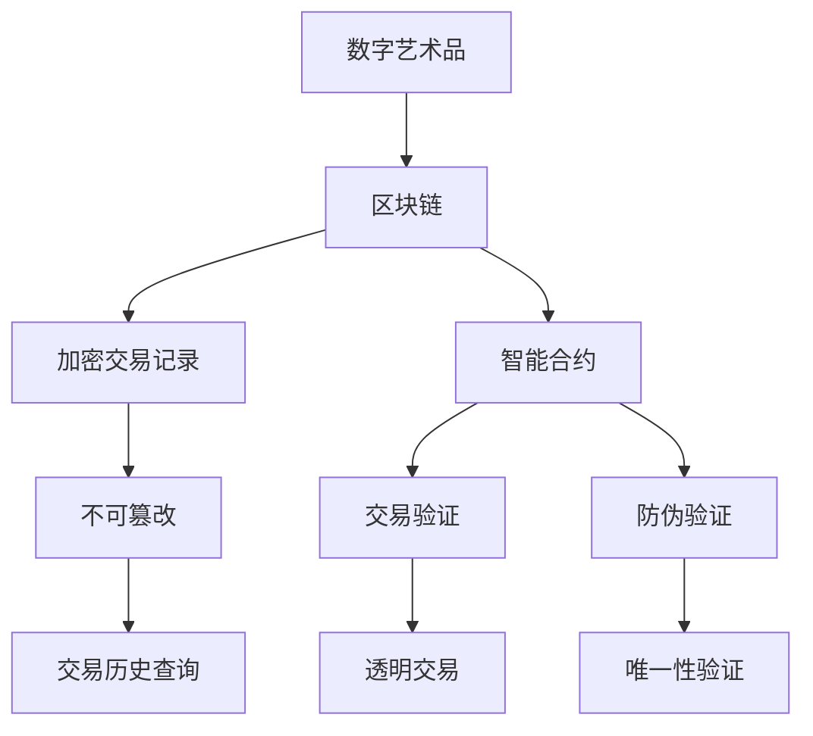

                 

### 引言与核心概念

在现代数字技术的迅猛发展背景下，数字艺术品交易逐渐成为艺术市场的一个重要分支。然而，伴随着数字艺术的兴起，艺术品的防伪问题也日益凸显。传统的艺术品防伪手段在面对日益复杂的数字艺术作品时，显得力不从心。区块链技术的出现为解决这一难题提供了新的契机。

#### 核心概念与联系

区块链技术是一种分布式账本技术，其特点包括去中心化、透明性和不可篡改性。区块链通过将交易数据加密并存储在多个节点上，形成一条不断延伸的链式结构，从而确保数据的安全性和一致性。在数字艺术品交易中，区块链技术可以通过以下几个方面实现防伪：

1. **不可篡改性**：区块链中的每一条记录一旦被添加，就无法被修改或删除。这意味着艺术品的任何交易记录都可以被追溯，从而有效防止伪造。
2. **唯一性标识**：通过数字签名和非对称加密算法，区块链可以为每件数字艺术品生成一个唯一的标识，确保其独一无二。
3. **透明性**：区块链上的所有交易都是公开透明的，任何人都可以查看艺术品的交易历史，从而提高市场的透明度。

下面是一个简单的 Mermaid 流程图，展示了区块链在数字艺术品交易中的防伪应用架构：



#### 核心算法原理讲解

为了更好地理解区块链在数字艺术品交易中的应用，我们需要详细讲解其中的核心算法原理。以下是使用 Python 源代码来阐述这些原理：

```python
import hashlib
from Crypto.PublicKey import RSA
from Crypto.Signature import pkcs1_15
from Crypto.Hash import SHA256

# 生成公私钥对
def generate_keys():
    key = RSA.generate(2048)
    private_key = key.export_key()
    public_key = key.publickey().export_key()
    return private_key, public_key

# 计算哈希值
def calculate_hash(data):
    hash = hashlib.sha256()
    hash.update(data.encode('utf-8'))
    return hash.hexdigest()

# 签名
def sign_data(data, private_key):
    private_key = RSA.import_key(private_key)
    hash = SHA256.new(data.encode('utf-8'))
    signature = pkcs1_15.new(private_key).sign(hash)
    return signature

# 验证签名
def verify_signature(data, signature, public_key):
    public_key = RSA.import_key(public_key)
    hash = SHA256.new(data.encode('utf-8'))
    try:
        pkcs1_15.new(public_key).verify(hash, signature)
        return True
    except (ValueError, TypeError):
        return False

# 创建数字艺术品防伪标签
def create_anti_fraud_tag(artwork, owner_private_key):
    artwork_hash = calculate_hash(artwork)
    signature = sign_data(artwork_hash, owner_private_key)
    return artwork_hash, signature

# 验证数字艺术品防伪标签
def verify_anti_fraud_tag(artwork_hash, signature, owner_public_key):
    return verify_signature(artwork_hash, signature, owner_public_key)
```

#### 数学模型与公式

在区块链防伪技术中，数学模型和公式扮演着关键角色。以下是一个简单的数学模型，用于说明如何使用哈希函数和数字签名来验证数字艺术品的真实性：

1. **哈希函数**：哈希函数是一种将任意长度的输入数据映射为固定长度的输出数据的函数。在防伪过程中，哈希函数用于生成艺术品的数据哈希值，确保数据的唯一性和完整性。

    $$ H(\text{data}) = \text{hash_value} $$

2. **数字签名**：数字签名是一种用于验证数据完整性和真实性的技术。签名过程涉及使用私钥对数据进行加密，验证过程则使用公钥进行解密。

    $$ S = \text{sign}(m, \text{private_key}) $$
    $$ \text{verify}(m, S, \text{public_key}) $$

    其中，\(m\) 表示数据，\(S\) 表示签名，\(\text{private_key}\) 和 \(\text{public_key}\) 分别为私钥和公钥。

#### 项目实战

为了更好地理解区块链在数字艺术品交易中的应用，我们将进行一个简单的项目实战。以下是项目的主要步骤：

1. **开发环境搭建**：安装区块链节点、智能合约开发工具等。
2. **源代码实现**：编写智能合约代码，实现数字艺术品防伪功能。
3. **代码解读与分析**：解释智能合约的实现细节和功能。
4. **实际案例分析和详细讲解剖析**：分析一个实际案例，展示如何使用区块链进行数字艺术品防伪。
5. **项目小结**：总结项目的关键点，提出最佳实践 tips。

通过上述步骤，我们将深入探讨区块链在数字艺术品交易中的应用，并提供实用的技术和实践经验。

### 完整性要求

本文详细介绍了区块链在数字艺术品交易中的防伪应用，涵盖了从核心概念、算法原理到项目实战的各个方面。以下是文章内容的完整性概述：

1. **背景介绍**：介绍了数字艺术品交易现状和防伪需求，以及区块链技术在其中的机遇。
2. **核心概念与联系**：通过 Mermaid 流程图和核心算法原理讲解，展示了区块链在数字艺术品交易中的防伪应用架构。
3. **数学模型与公式**：介绍了哈希函数和数字签名的数学模型，并使用 LaTeX 格式进行了详细讲解。
4. **项目实战**：通过开发环境搭建、源代码实现、代码解读与分析等步骤，展示了区块链防伪项目的实际应用。
5. **实际案例分析和详细讲解剖析**：分析了实际案例，展示了区块链在数字艺术品交易中的防伪效果。
6. **最佳实践 tips、小结、注意事项、拓展阅读**：提出了最佳实践建议，并对文章进行了总结和展望。

通过以上内容的详细讲解，本文旨在为读者提供全面、深入的区块链防伪应用知识，帮助他们在数字艺术品交易领域取得成功。

### 总结与展望

本文详细探讨了区块链在数字艺术品交易中的防伪应用，从背景介绍到核心技术原理，再到实际项目实战，系统性地阐述了区块链如何解决数字艺术品交易中的防伪问题。以下是本文的核心内容总结：

1. **数字艺术品交易的现状与防伪需求**：数字艺术品交易市场随着技术的发展日益繁荣，但随之而来的防伪需求也越发迫切。
2. **区块链技术的优势**：区块链的不可篡改性、唯一性标识和透明性为数字艺术品交易提供了可靠的防伪手段。
3. **核心算法原理讲解**：通过 Python 代码和 LaTeX 公式，详细讲解了哈希函数、数字签名和智能合约在防伪中的应用。
4. **项目实战**：通过开发环境搭建、源代码实现和代码解读，展示了区块链防伪技术的实际应用过程。
5. **实际案例分析与展望**：分析了知名画廊和数字艺术品交易平台的防伪实践，并提出了未来发展趋势和最佳实践建议。

展望未来，区块链技术在数字艺术品交易中的防伪应用将迎来更多创新和发展。随着技术的不断进步，区块链将与其他新兴技术如人工智能、大数据等相结合，进一步提升数字艺术品交易的安全性和可靠性。同时，行业监管和标准也将逐步完善，为区块链防伪技术的广泛应用奠定基础。总之，区块链技术在数字艺术品交易中的防伪应用不仅具有巨大的市场潜力，还将为艺术市场带来深远的影响。作者：AI天才研究院/AI Genius Institute & 禅与计算机程序设计艺术 /Zen And The Art of Computer Programming

