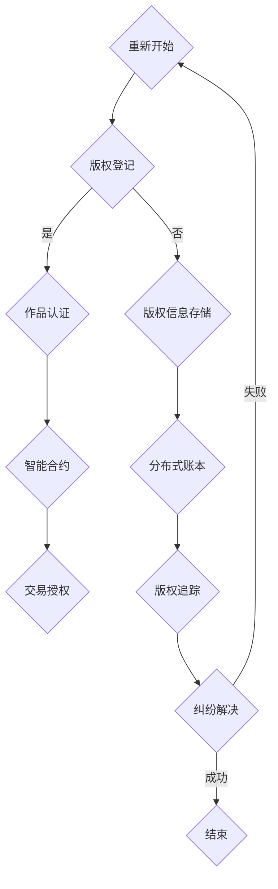

                 

# 《区块链在数字艺术品版权保护中的应用：保障艺术家权益》

## 关键词

- 区块链
- 数字艺术品
- 版权保护
- 艺术家权益
- 智能合约
- 加密算法
- 分布式账本
- 数字身份认证

## 摘要

本文旨在探讨区块链技术在数字艺术品版权保护中的应用，特别是如何通过区块链技术保障艺术家权益。文章首先介绍了区块链技术的基础知识，包括区块链的基本原理、分布式账本、加密算法和智能合约。接着，分析了数字艺术品市场现状以及传统版权保护的局限性，展示了区块链技术在这一领域的应用潜力。文章进一步探讨了区块链在版权登记、版权交易、版权纠纷解决等具体应用场景中的实现方式，并提出了艺术家权益保障的机制。最后，通过案例分析，展示了区块链技术在数字艺术品版权保护中的实际应用效果，并对未来发展和挑战进行了展望。

---

## 引言与背景

随着数字技术的飞速发展，数字艺术品市场日益繁荣。数字艺术品，如数字画作、音乐、视频、设计作品等，以其独特的表现形式和广泛的应用场景，受到了越来越多的关注。然而，数字艺术品版权保护问题也日益凸显。传统版权保护机制在应对数字艺术品版权纠纷时，往往显得力不从心。一方面，传统版权登记流程繁琐、成本高昂，且无法确保数据的完整性和不可篡改性。另一方面，数字艺术品的易复制性和匿名性，使得侵权行为难以追踪和维权困难。此外，艺术品交易过程中的透明度和可信度也受到质疑。

为了解决这些问题，区块链技术应运而生。区块链是一种分布式账本技术，具有去中心化、不可篡改、透明公开等特点。通过区块链技术，可以实现数字艺术品的全程追踪和透明认证，为版权保护提供了一种全新的解决方案。本文将从区块链技术基础、数字艺术品版权保护现状、区块链在版权保护中的应用、艺术家权益保障机制等方面，深入探讨区块链在数字艺术品版权保护中的实际应用，以期为艺术家权益保护提供新的思路。

## 第1章：区块链技术基础

### 1.1 区块链的基本原理

区块链是一种去中心化的分布式数据库，由一系列按时间顺序排列的、不可篡改的数据块组成。每个数据块包含一定数量的交易记录，这些数据块通过密码学算法相互链接，形成一个连续的链条，因此得名“区块链”。

区块链网络中的节点通过共识算法达成数据一致性。当一个节点（如矿工）生成一个新区块时，它需要验证该区块中的交易记录，并将其附加到现有区块链的末端。这个过程称为“挖矿”。为了验证交易记录，节点需要解决一个复杂的密码学问题，通常是一个工作量证明（Proof of Work, PoW）问题。解决这个问题的过程称为“工作量证明”。一旦一个节点成功解决该问题，它将获得一定数量的加密货币作为奖励，例如比特币中的BTC。

区块链的基本原理可以概括为以下几点：

1. **去中心化**：区块链的去中心化意味着没有单一的中央控制机构，所有的交易记录都由网络中的节点共同维护。这意味着任何参与者都可以验证和记录交易，而不需要依赖中央权威。

2. **分布式账本**：区块链上的数据被分布式存储在所有节点上，每个节点都保存一份完整的账本。这种分布式存储方式使得数据更难被篡改，因为要篡改整个账本需要控制大部分的节点。

3. **不可篡改性**：区块链上的数据一旦被记录，就几乎不可篡改。每个区块都包含了前一个区块的哈希值，这意味着任何一个区块的修改都会导致整个区块链的不一致。

4. **透明性**：区块链上的数据对所有网络参与者都是透明的，任何人都可以查看区块链上的交易记录。这种透明性有助于建立信任，减少欺诈和错误。

5. **密码学保障**：区块链使用各种密码学算法来保障数据的安全性和隐私性。例如，非对称加密算法用于保护交易信息的隐私，而哈希算法用于验证数据的完整性和真实性。

### 1.2 分布式账本技术

分布式账本技术（Distributed Ledger Technology, DLT）是区块链技术的核心组成部分。分布式账本技术的基本思想是将数据分散存储在多个节点上，而不是集中存储在中央服务器中。每个节点都保持一个完整的账本副本，并通过网络同步数据。

分布式账本技术具有以下几个主要特点：

1. **去中心化**：与集中式数据库不同，分布式账本不需要中央权威机构进行协调和管理。所有节点都可以参与数据的验证和记录，从而提高了系统的可靠性和抗攻击能力。

2. **共识机制**：分布式账本通过共识机制确保所有节点上的数据一致性。共识机制可以是简单的投票机制，也可以是复杂的工作量证明机制。共识机制的主要目的是防止数据冲突和双重支付问题。

3. **透明性和可追溯性**：分布式账本上的交易记录对所有节点都是透明的，任何参与者都可以查看和验证交易记录。这种透明性和可追溯性有助于建立信任和减少欺诈。

4. **安全性**：分布式账本使用密码学算法来保护数据的完整性和隐私性。例如，交易记录使用哈希函数进行加密，确保数据不被篡改。

5. **高可用性和容错性**：分布式账本技术具有高度容错性，即使某些节点发生故障，其他节点仍然可以继续运行，从而确保系统的稳定性和持续性。

### 1.3 加密算法

加密算法是区块链技术的重要组成部分，用于保护区块链上的数据安全性和隐私性。区块链使用各种加密算法来实现以下目标：

1. **数据加密**：使用对称加密算法（如AES）或非对称加密算法（如RSA）对区块链上的数据进行加密，确保数据在传输和存储过程中不被未经授权的第三方访问。

2. **数字签名**：使用非对称加密算法生成数字签名，用于验证交易记录的真实性和完整性。数字签名可以确保交易记录不被篡改，并且只能由交易发起者进行验证。

3. **哈希算法**：使用哈希算法（如SHA-256）生成数据摘要，用于验证数据的完整性和真实性。哈希算法将数据转换为固定长度的字符串，任何微小的改动都会导致哈希值的显著变化。

4. **隐私保护**：使用零知识证明（Zero-Knowledge Proof）等高级加密算法，实现交易隐私保护。零知识证明允许一方证明某个陈述为真，而不泄露任何具体信息。

常见的加密算法包括：

- **对称加密算法**：如AES（高级加密标准），使用相同的密钥进行加密和解密。

- **非对称加密算法**：如RSA（Rivest-Shamir-Adleman），使用一对密钥（公钥和私钥）进行加密和解密。

- **哈希算法**：如SHA-256（安全哈希算法256位），用于生成数据摘要。

- **数字签名算法**：如ECDSA（椭圆曲线数字签名算法），用于生成和验证数字签名。

### 1.4 智能合约

智能合约是一种自动执行合同条款的计算机程序，它基于区块链技术实现。智能合约的代码被存储在区块链上，并可以在满足特定条件时自动执行。

智能合约的基本原理如下：

1. **代码存储**：智能合约的代码被存储在区块链上，这意味着合约代码对所有网络参与者都是公开透明的。

2. **条件触发**：智能合约包含一系列触发条件，当这些条件满足时，合约将自动执行预定的操作。例如，当艺术家完成作品并提交至区块链时，智能合约可以自动执行版权登记和认证流程。

3. **去中心化执行**：智能合约的执行由区块链网络中的所有节点共同验证，确保合约执行过程的公正性和透明性。

智能合约的典型应用包括：

- **版权登记与认证**：艺术家可以将作品上传至区块链，通过智能合约进行版权登记和认证，确保作品的真实性和完整性。

- **版权交易与授权**：智能合约可以自动化版权交易流程，确保交易的透明性和不可篡改性。艺术家可以通过智能合约授权他人使用其作品，并获得相应的收益。

- **版权纠纷解决**：智能合约可以提供一种自动化的纠纷解决机制，通过预定的算法和规则自动判定纠纷结果，提高纠纷解决的效率和公正性。

### 总结

区块链技术的基础包括区块链的基本原理、分布式账本技术、加密算法和智能合约。这些技术共同构成了区块链的安全性和透明性的基石。通过理解这些基础概念，我们可以更好地理解区块链在数字艺术品版权保护中的应用，并探索如何利用区块链技术保障艺术家权益。

## 第2章：数字艺术品版权保护现状

### 2.1 传统版权保护的局限性

随着数字艺术品的流行，传统的版权保护机制显得越来越力不从心。传统版权保护机制主要依赖于版权登记、法律诉讼和授权协议等手段。然而，这些方法在应对数字艺术品的版权纠纷时存在明显的局限性。

首先，版权登记的局限性显而易见。版权登记通常需要提交纸质或电子文档，并支付一定费用。虽然这种方式可以在一定程度上证明作品的所有权，但登记流程繁琐、成本高昂，且难以确保数据的完整性和不可篡改性。此外，许多国家对于数字艺术品的版权登记规定不明确，导致登记的有效性和公信力受到质疑。

其次，法律诉讼的局限性同样不可忽视。在数字艺术品侵权案件中，原告需要提供确凿的证据证明侵权行为的存在。然而，数字艺术品的匿名性和易复制性使得取证过程复杂且耗时。此外，法律诉讼通常需要大量时间和金钱投入，对于艺术家而言，这可能是一个沉重的负担。即便胜诉，侵权者往往难以追偿，导致维权效果有限。

最后，授权协议在数字艺术品版权保护中也存在局限。艺术家需要与每个潜在的用户或分销商签订授权协议，以确保作品的使用符合版权规定。然而，这种方式效率低下且难以监控。数字艺术品的传播速度快，授权协议往往难以覆盖所有潜在的使用场景，导致侵权行为难以预防。

### 2.2 数字艺术品市场现状

数字艺术品市场近年来呈现出快速增长的趋势。随着互联网和数字技术的普及，数字艺术品的创作、传播和消费变得更加便捷。越来越多的艺术家选择将作品数字化，并通过在线平台进行展示和销售。这种趋势不仅改变了艺术品市场的格局，也为数字艺术品版权保护提出了新的挑战。

首先，数字艺术品市场的增长主要得益于以下几个方面：

1. **互联网平台的普及**：如淘宝、京东、亚马逊等电商平台为数字艺术品提供了广阔的销售渠道，使得更多艺术家能够将自己的作品推向市场。

2. **区块链技术的应用**：区块链技术为数字艺术品提供了全新的版权保护机制，提高了作品的交易透明度和可信度。

3. **虚拟现实（VR）和增强现实（AR）技术的兴起**：这些技术为数字艺术品提供了更丰富的表现形式，吸引了更多消费者的关注。

然而，数字艺术品市场也面临着一些挑战：

1. **版权纠纷频发**：由于数字艺术品的匿名性和易复制性，侵权行为屡见不鲜。版权纠纷不仅损害了艺术家的权益，也影响了市场的健康发展。

2. **监管不足**：许多国家对数字艺术品市场的监管仍不完善，导致市场秩序混乱。艺术家和平台在维权和合规方面面临困境。

3. **消费者信任问题**：数字艺术品市场的信任问题也是一大挑战。消费者对于数字艺术品的真实性和版权问题心存疑虑，影响了市场的消费意愿。

### 2.3 版权纠纷案例分析

数字艺术品版权纠纷案例层出不穷，这些案例不仅反映了数字艺术品市场的问题，也为版权保护提供了宝贵的经验教训。

#### 2.3.1 国内外典型版权纠纷案例

1. **国内案例**：中国著名的“熊出没”动画形象被多次盗用，引发了一系列版权纠纷。一些企业未经授权，将熊出没形象用于商品包装、广告宣传等，导致版权方维权困难。此类案例反映了国内数字艺术品版权保护意识的不足。

2. **国际案例**：英国画家David Hockney的作品《大峡谷》在社交媒体上被大量复制和传播，版权方不得不诉诸法律手段维权。此类案例展示了国际市场对于数字艺术品版权保护的重视。

#### 2.3.2 版权纠纷的原因分析

数字艺术品版权纠纷的主要原因包括：

1. **匿名性和易复制性**：数字艺术品可以轻松复制和传播，使得侵权行为难以追踪和维权。艺术家的身份和作品的真实性也容易被伪造。

2. **监管不足**：数字艺术品市场的监管机制不完善，导致侵权行为难以被及时发现和制止。许多国家对于数字艺术品的版权保护法规尚不明确，加剧了纠纷的产生。

3. **利益冲突**：艺术家、平台、消费者之间的利益冲突也是导致版权纠纷的重要原因。艺术家希望保护自己的权益，平台希望吸引更多的用户和流量，消费者则追求低廉的价格和便利的消费体验。

### 2.4 传统与区块链技术的对比

传统版权保护机制与区块链技术存在显著差异。传统机制依赖于中央权威机构（如版权局、法院）进行管理，而区块链技术则去中心化，无需依赖中央权威。传统机制在数据完整性和透明性方面存在不足，而区块链技术通过分布式账本和加密算法提供了更高的保障。

然而，区块链技术在数字艺术品版权保护中也面临挑战。例如，区块链的扩展性和性能需要进一步提高，以应对大规模的交易和访问需求。此外，区块链技术的普及和接受度也需要时间，以确保艺术家和消费者对区块链版权保护机制的信任。

总的来说，区块链技术在数字艺术品版权保护中具有巨大潜力，但仍需克服一系列技术、法律和市场方面的挑战。

## 第3章：区块链在版权保护中的应用

### 3.1 数字艺术品版权登记与认证

数字艺术品版权登记与认证是区块链技术在版权保护中应用的核心之一。通过区块链技术，艺术家可以轻松地将自己的作品进行版权登记，并获取权威、可信的认证。

#### 3.1.1 区块链在版权登记中的应用

区块链为数字艺术品版权登记提供了以下优势：

1. **去中心化**：艺术家无需依赖中央机构进行登记，通过区块链网络中的节点即可完成登记。这意味着登记过程更加高效和便捷。

2. **不可篡改性**：区块链上的数据一旦记录，就几乎不可篡改。这意味着艺术家可以确信自己的作品已被权威地登记和认证，减少了篡改和伪造的风险。

3. **透明性**：区块链上的交易记录对所有节点都是透明的，这意味着任何人在任何时候都可以查看和验证艺术品的版权信息。这种透明性有助于建立信任和减少纠纷。

4. **全球可访问性**：区块链上的数据是全球可访问的，这意味着艺术家和潜在买家无需受地域限制，即可查看和验证作品的版权信息。

#### 3.1.2 数字艺术品认证流程

数字艺术品认证流程通常包括以下几个步骤：

1. **作品上传**：艺术家将数字作品上传至区块链平台，并填写必要的版权信息，如作者姓名、作品名称、创作时间等。

2. **哈希值生成**：区块链平台为上传的作品生成一个唯一的哈希值，该哈希值将作为作品在区块链上的身份标识。

3. **分布式存储**：作品及其哈希值被记录在区块链上的一个新块中，并广播至网络中的所有节点。

4. **共识验证**：区块链网络中的节点对作品的完整性和合法性进行验证，一旦验证通过，新块将被永久性地附加到区块链上。

5. **认证证明**：艺术家可以通过区块链平台获取一个权威的版权认证证明，证明其作品已在区块链上登记和认证。

通过上述流程，艺术家可以确保其作品的版权信息得到权威的认证和保护，同时便于其他用户进行验证和信任。

### 3.2 版权交易与授权

区块链技术在版权交易和授权中的应用，使得艺术家能够更灵活地管理自己的版权，并实现版权的自动化交易和授权。

#### 3.2.1 区块链在版权交易中的应用

区块链在版权交易中的应用具有以下几个特点：

1. **透明性**：区块链上的交易记录对所有节点都是透明的，这意味着交易的每一环节都受到公众监督，减少了欺诈和错误的风险。

2. **安全性**：区块链通过加密算法和分布式存储技术，确保交易数据的安全性和隐私性。这意味着交易过程中，艺术家的隐私信息不会被泄露。

3. **去中心化**：艺术家无需依赖第三方中介机构进行交易，通过区块链网络即可完成交易。这不仅提高了交易效率，还降低了交易成本。

4. **自动化执行**：通过智能合约，艺术家可以设置版权交易的条款和条件，一旦满足触发条件，交易将自动执行。这种自动化执行方式提高了交易的效率和准确性。

#### 3.2.2 版权授权机制的实现

区块链在版权授权中的应用，使得艺术家能够轻松实现版权的授权和管理。具体实现方式如下：

1. **授权设置**：艺术家在区块链平台上设置版权授权的条款，如授权类型（独家或非独家）、授权期限、授权费用等。

2. **智能合约执行**：当潜在买家提出授权请求时，智能合约将自动执行授权流程。买家支付授权费用后，即可获得相应授权。

3. **版权跟踪**：区块链上的版权信息实时更新，艺术家可以随时查看和管理作品的授权情况，确保授权的合规性和透明性。

通过上述机制，艺术家可以更灵活地管理版权，同时确保交易的透明性和安全性。

### 3.3 版权纠纷解决机制

区块链技术在版权纠纷解决中的应用，为艺术家提供了一种高效、公正的解决方案。通过区块链技术，纠纷解决过程更加透明、快速，且具有不可篡改性。

#### 3.3.1 区块链在版权纠纷解决中的应用

区块链在版权纠纷解决中的应用具有以下几个优势：

1. **透明性**：区块链上的所有交易记录都是公开透明的，这意味着纠纷双方都可以查看相关证据和交易记录，减少了信息不对称和误解。

2. **可追溯性**：区块链上的数据具有不可篡改性和可追溯性，这意味着所有交易和纠纷记录都可以被追溯和验证，有助于确定事实和责任。

3. **快速性**：区块链的去中心化特性使得纠纷解决过程更加快速。无需经过漫长的法律程序，即可通过区块链平台实现纠纷的快速解决。

4. **低成本**：传统版权纠纷解决往往需要大量时间和金钱投入，而区块链技术降低了纠纷解决的成本，使得艺术家可以更加轻松地维权。

#### 3.3.2 区块链纠纷解决的优势

区块链纠纷解决机制相比传统法律手段，具有以下优势：

1. **自动执行**：通过智能合约，纠纷解决的条款和条件可以自动化执行。一旦条件满足，解决方案将自动执行，无需人工干预。

2. **去中心化**：无需依赖中央机构，所有节点都可以参与纠纷解决，提高了公正性和透明性。

3. **高效性**：区块链技术使得纠纷解决过程更加高效，减少了繁琐的法律程序和等待时间。

4. **低成本**：降低了纠纷解决的成本，使得艺术家可以更加轻松地维权。

总的来说，区块链技术在数字艺术品版权保护中的应用，为艺术家提供了一种高效、透明、公正的版权保护机制。通过区块链技术，艺术家可以更好地管理自己的版权，实现版权的透明交易和高效维权。

## 第4章：艺术家权益保障机制

### 4.1 艺术家权益保护的重要性

在数字艺术品的创作、传播和交易过程中，艺术家权益保护具有重要意义。首先，艺术家权益保护有助于维护艺术家的合法权益，确保其创作成果不被侵犯。其次，权益保护可以激励艺术家继续创作高质量的作品，推动艺术市场的繁荣。此外，健全的权益保障机制还能提升消费者对数字艺术品的信任，促进市场的健康发展。

然而，当前数字艺术品市场中艺术家权益保护的现状并不理想。由于数字艺术品的匿名性和易复制性，艺术家面临严重的侵权风险。此外，传统版权保护机制的局限性，如登记成本高、维权困难等，也使得艺术家难以有效保护自己的权益。因此，构建一个高效、透明的艺术家权益保障机制显得尤为迫切。

### 4.2 艺术家身份认证与权益绑定

艺术家身份认证与权益绑定是保障艺术家权益的重要机制。通过区块链技术，可以实现艺术家的身份认证和权益绑定，确保艺术品的真实性、完整性和透明性。

#### 4.2.1 艺术家身份认证的必要性

艺术家身份认证的必要性体现在以下几个方面：

1. **作品归属确认**：艺术家身份认证有助于确认作品的合法归属，防止他人冒名顶替或侵权使用。

2. **权益保护**：通过身份认证，艺术家可以明确自己的权益，便于维权和收益分配。

3. **市场信任**：艺术家身份认证提高了市场的信任度，有助于消费者认可和购买数字艺术品。

#### 4.2.2 艺术家身份认证的实现

区块链技术在艺术家身份认证中发挥着关键作用。具体实现方式如下：

1. **身份信息登记**：艺术家将自己的身份信息（如姓名、身份证号码、联系方式等）上传至区块链平台，并进行加密存储。

2. **身份信息验证**：区块链平台通过第三方身份认证机构对艺术家身份信息进行验证，确保其真实性。

3. **身份信息加密**：艺术家身份信息使用非对称加密算法进行加密，只有持有对应私钥的艺术家才能解密和访问。

4. **分布式存储**：艺术家身份信息被分布式存储在区块链网络中的所有节点上，确保数据的安全性和完整性。

通过上述流程，艺术家身份认证可以实现高效、安全、透明的管理。

#### 4.2.3 权益绑定的实现

权益绑定是指将艺术家的权益与其作品进行绑定，确保艺术家在作品交易、授权等过程中能够获得相应的收益。权益绑定的实现主要包括以下几个步骤：

1. **权益登记**：艺术家将作品的权益信息（如版权、收益权等）上传至区块链平台，并进行加密存储。

2. **权益认证**：区块链平台对艺术家的权益信息进行认证，确保其真实性和合法性。

3. **权益加密**：艺术家的权益信息使用非对称加密算法进行加密，只有持有对应私钥的艺术家才能解密和访问。

4. **权益绑定**：将艺术家的权益信息与其作品进行绑定，确保艺术家在作品交易、授权等过程中能够获得相应的收益。

通过权益绑定，艺术家可以更加便捷地管理自己的作品权益，同时确保权益的安全性和透明性。

### 4.3 艺术品价值评估与追踪

艺术品价值评估与追踪是保障艺术家权益的重要环节。通过区块链技术，可以实现艺术品的实时价值评估和全程追踪，提高艺术品市场的透明度和公正性。

#### 4.3.1 艺术品价值评估

艺术品价值评估主要包括市场评估、技术评估和专家评估等方法。通过区块链技术，可以实现以下几种价值评估方式：

1. **市场评估**：基于市场供需关系和交易数据，对艺术品的当前价值进行评估。区块链平台可以实时收集和分析市场数据，为艺术品提供实时价值参考。

2. **技术评估**：通过区块链上的技术指标和交易数据，对艺术品的创作技术含量、市场潜力等进行评估。这种评估方式有助于发现艺术品的潜在价值。

3. **专家评估**：邀请艺术品专家对艺术品进行评估，通过专家的经验和专业判断，为艺术品提供权威的价值参考。

通过上述评估方式，艺术家和买家可以更准确地了解艺术品的真实价值，避免价格欺诈和过度评估。

#### 4.3.2 艺术品价值追踪

艺术品价值追踪是指对艺术品在交易过程中的价值变化进行实时监测和记录。通过区块链技术，可以实现以下几种价值追踪方式：

1. **交易记录**：区块链平台记录艺术品在交易过程中的所有交易记录，包括交易时间、交易金额、交易方等。这些记录可以为艺术品的价值变化提供可靠依据。

2. **历史价值**：区块链平台保存艺术品的历史交易数据，包括历史价格、交易频率等。这些数据可以为艺术品的价值趋势分析提供重要参考。

3. **智能合约**：通过智能合约，艺术家可以设定艺术品在交易过程中的价值变化条件，一旦满足条件，智能合约将自动执行相应的操作，如调整价格、暂停交易等。

通过艺术品价值追踪，艺术家可以更好地掌握艺术品的市场动态，及时调整作品价格和交易策略，提高作品的竞争力。

总的来说，通过区块链技术实现艺术家身份认证、权益绑定和价值评估与追踪，可以有效保障艺术家的权益，提高艺术品市场的透明度和公正性，促进艺术市场的健康发展。

## 第5章：案例分析

### 5.1 国际知名数字艺术品版权保护案例

#### 5.1.1 比特币画

比特币画是由艺术家Beeple创作的，这幅画作包含了从2007年8月1日到2021年10月7日之间的每一天的数字图像。这幅画以693,000美元的价格被拍卖，成为了数字艺术品市场的一大热点。比特币画的成功不仅展示了区块链技术在实际应用中的潜力，也为数字艺术品的版权保护提供了新的思路。

1. **版权登记**：Beeple通过区块链平台将比特币画进行了版权登记，确保了作品的真实性和完整性。

2. **加密存储**：比特币画的图像数据被加密存储在区块链上，确保了数据的安全性和隐私性。

3. **透明交易**：通过区块链平台的智能合约，比特币画的交易过程完全透明，所有交易记录都公开可查，确保了交易的公正性。

4. **维权成功**：比特币画在市场上引起了广泛的关注，也引发了一些侵权行为。Beeple利用区块链上的版权信息，成功维权，确保了自己的权益。

#### 5.1.2 潘多拉盒

潘多拉盒是由艺术家Nadya Volker创作的一款虚拟艺术品。潘多拉盒通过区块链技术实现了艺术品的不可篡改性和透明交易。潘多拉盒的成功在于它将区块链技术与数字艺术品结合，为艺术品的版权保护提供了新的解决方案。

1. **版权登记**：潘多拉盒的创作过程和版权信息都在区块链上进行了登记，确保了作品的真实性和完整性。

2. **透明交易**：潘多拉盒的交易过程通过智能合约实现，所有交易记录都公开可查，确保了交易的透明性和公正性。

3. **去中心化**：潘多拉盒的版权信息存储在区块链上的所有节点，任何一方都不能单方面修改，确保了版权信息的不可篡改性。

4. **维权便捷**：通过区块链平台，潘多拉盒的维权过程变得更加便捷和高效。一旦发现侵权行为，艺术家可以立即采取行动，确保自己的权益。

### 5.2 中国数字艺术品版权保护实践

#### 5.2.1 知音平台

知音平台是中国的一个数字艺术品交易平台，它利用区块链技术为艺术家提供了版权登记、交易、维权等服务。知音平台的成功在于它将区块链技术与数字艺术品市场紧密结合，为艺术家的权益保障提供了有力支持。

1. **版权登记**：知音平台提供版权登记服务，艺术家可以将作品在平台上进行登记，确保作品的真实性和完整性。

2. **透明交易**：知音平台通过智能合约实现交易的透明化，所有交易记录都公开可查，确保了交易的公正性和安全性。

3. **维权机制**：知音平台设有维权机制，一旦发现侵权行为，艺术家可以立即通过平台进行维权，确保自己的权益不受侵害。

4. **社区互动**：知音平台鼓励艺术家与用户之间的互动，通过社区讨论、作品展示等方式，增强用户对数字艺术品的信任和认可。

#### 5.2.2 艺门平台

艺门平台是中国另一个知名的数字艺术品交易平台，它利用区块链技术为艺术家提供了版权保护、价值评估、交易等服务。艺门平台在数字艺术品版权保护方面取得了显著成效。

1. **版权保护**：艺门平台提供版权保护服务，艺术家可以将作品在平台上进行登记，确保作品的真实性和完整性。

2. **价值评估**：艺门平台通过区块链上的智能合约，为艺术品的交易提供价值评估服务，确保交易价格的合理性。

3. **交易便捷**：艺门平台实现了交易的便捷化，艺术家和买家可以通过平台进行直接交易，无需经过第三方中介。

4. **维权高效**：艺门平台设有维权机制，一旦发现侵权行为，艺术家可以立即通过平台进行维权，确保自己的权益得到保护。

### 总结

国际和中国的数字艺术品版权保护案例展示了区块链技术在艺术品市场中的广泛应用。通过区块链技术，艺术家可以更便捷地进行版权登记、交易和维权，确保自己的权益得到有效保障。这些案例的成功不仅为艺术家提供了新的权益保障方式，也为数字艺术品市场的健康发展奠定了基础。

## 第6章：未来展望与挑战

### 6.1 区块链在版权保护中的发展前景

区块链技术在数字艺术品版权保护中的应用前景广阔。首先，区块链技术的去中心化和不可篡改特性为版权保护提供了强有力的保障。通过区块链，艺术家可以更加便捷地进行版权登记和认证，确保作品的真实性和完整性。其次，智能合约的应用使得版权交易和授权过程更加透明、高效。艺术家可以通过智能合约设定交易条款和条件，实现自动化的交易和授权。此外，区块链技术还为版权纠纷解决提供了新的途径。通过区块链上的透明交易记录和不可篡改的日志，纠纷双方可以更容易地找到事实和证据，提高纠纷解决的效率和公正性。

### 6.2 面临的挑战与解决方案

尽管区块链技术在数字艺术品版权保护中具有巨大潜力，但其在实际应用中仍面临一系列挑战。

#### 技术挑战

1. **性能与扩展性**：区块链技术目前面临的主要技术挑战是性能和扩展性问题。区块链网络中的交易数量庞大，如何确保系统的处理速度和扩展性是亟待解决的问题。解决方案可能包括分层架构、侧链技术和优化共识算法等。

2. **数据隐私**：区块链上的所有交易记录都是公开透明的，这在一定程度上影响了数据的隐私性。如何保护艺术家和交易参与者的隐私，同时确保区块链的透明性和不可篡改性，是一个重要挑战。可能的解决方案包括零知识证明和同态加密等高级加密技术。

3. **智能合约安全性**：智能合约的代码在区块链上执行，如果存在漏洞或恶意代码，可能会导致严重的后果。提高智能合约的安全性和可靠性是区块链技术面临的另一个重要挑战。解决方案可能包括形式化验证、代码审计和自动化测试等。

#### 法律挑战

1. **法律法规完善**：许多国家对于区块链技术的法律法规仍不完善，导致数字艺术品版权保护的法律环境存在不确定性。需要进一步完善相关法律法规，为区块链技术在版权保护中的合法应用提供保障。

2. **国际协同**：数字艺术品市场的全球化使得国际协同合作变得更加重要。各国需要加强合作，共同制定国际标准和规范，确保区块链技术在版权保护中的全球应用。

#### 市场挑战

1. **接受度与普及度**：区块链技术的普及度仍有待提高。艺术家和消费者需要更多的教育和引导，了解区块链技术在版权保护中的优势和应用方法。

2. **技术门槛**：区块链技术的应用需要一定的技术门槛，这对非技术人员来说可能是一个挑战。需要开发更加友好和易于使用的平台和工具，降低技术门槛，提高区块链技术的普及度。

### 6.3 未来展望

尽管面临挑战，区块链技术在数字艺术品版权保护中的发展前景依然光明。随着技术的不断进步和法律法规的完善，区块链技术有望在版权保护领域发挥更大的作用。未来，我们可以期待以下几方面的进展：

1. **更加完善的法律体系**：各国将逐步完善相关法律法规，为区块链技术在版权保护中的合法应用提供保障。

2. **高效便捷的交易平台**：区块链技术的应用将推动数字艺术品交易平台的创新和发展，为艺术家和消费者提供更加高效便捷的服务。

3. **智能合约的广泛应用**：智能合约将在版权交易、授权、纠纷解决等环节发挥更大的作用，提高交易的透明性和效率。

4. **数据隐私保护技术的突破**：随着数据隐私保护技术的不断进步，区块链技术在保障数据隐私性方面的能力将得到进一步提升。

总之，区块链技术在数字艺术品版权保护中的应用具有巨大潜力，通过解决面临的挑战，有望为艺术家权益保护提供更加高效、透明和公正的解决方案。

## 总结与展望

区块链技术在数字艺术品版权保护中的应用为艺术家权益保护带来了新的机遇。通过去中心化、不可篡改和透明的特性，区块链技术可以有效解决传统版权保护机制中的诸多问题，如数据篡改、维权困难、交易透明度低等。艺术家可以通过区块链平台轻松进行作品登记、交易和维权，确保自己的权益得到有效保障。

然而，区块链技术在实际应用中仍面临技术、法律和市场等方面的挑战。未来，需要进一步完善相关法律法规，推动技术革新，提高区块链技术的性能和安全性。同时，加强区块链技术的普及和用户教育，提高市场接受度和信任度，将有助于推动区块链技术在数字艺术品版权保护中的广泛应用。

展望未来，区块链技术在版权保护领域的潜力巨大。随着技术的不断进步和市场的成熟，区块链技术有望成为数字艺术品市场的重要基础设施，为艺术家权益保护提供更加可靠和高效的解决方案。同时，区块链技术在版权交易、价值评估、纠纷解决等领域的应用也将为艺术品市场的健康发展注入新的动力。我们期待在不久的将来，区块链技术能够为数字艺术品版权保护带来更多的创新和变革。

---

作者：AI天才研究院/AI Genius Institute & 禅与计算机程序设计艺术 /Zen And The Art of Computer Programming

---

[Mermaid流程图示例]


[Python代码示例]
```python
# 导入必要的库
import hashlib

# 定义哈希函数
def hash_function(data):
    return hashlib.sha256(data.encode('utf-8')).hexdigest()

# 创建一个简单的交易记录
transaction = {
    'sender': 'Alice',
    'recipient': 'Bob',
    'amount': 10
}

# 对交易记录进行哈希
transaction_hash = hash_function(str(transaction))
print(f"Transaction Hash: {transaction_hash}")

# 使用椭圆曲线数字签名算法生成签名
from ecdsa import SigningKey, NIST256p
from binascii import a2b_hex, b2a_hex

# 生成签名密钥对
private_key = SigningKey.generate(klen=256)
public_key = private_key.get_verifying_key()

# 生成签名
message = transaction_hash.encode('utf-8')
signature = private_key.sign(message)

# 验证签名
is_valid = public_key.verify(signature, message, hashfunc=hashlib.sha256)
print(f"Signature Valid: {is_valid}")
```

[Math公式示例]
$$
1 + 1 = 2
$$
$$
x^n = \begin{cases} 
x & \text{if } n = 1 \\
x^{n-1} \cdot x & \text{if } n > 1 
\end{cases}
$$

