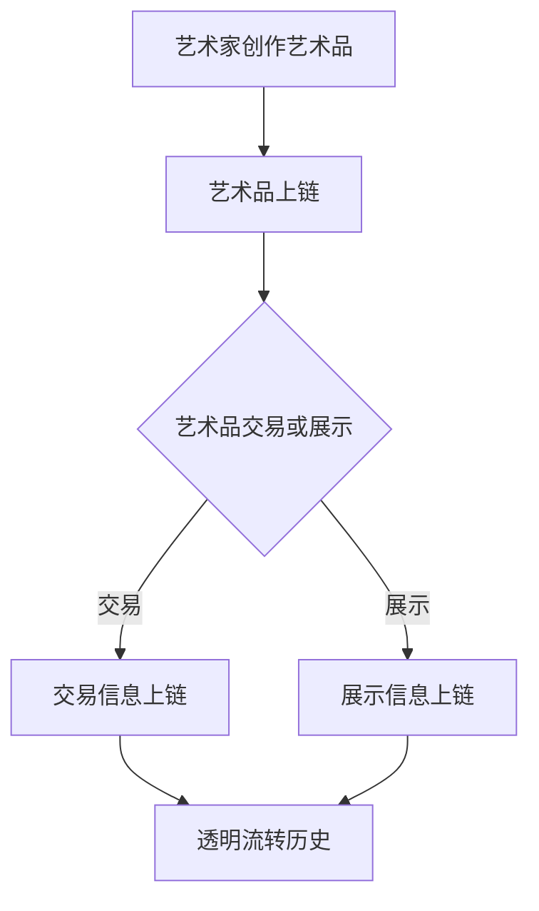

                 

### 背景介绍

在数字时代，艺术创作和传播的方式正在经历前所未有的变革。数字艺术品，作为一种新兴的艺术形式，正迅速崛起。它们以数字媒介为载体，通过图形、图像、音频、视频等多种形式呈现，具有高度的创造性和多样性。然而，随着数字艺术品的蓬勃发展，其认证问题也日益凸显。

传统艺术品市场的认证主要依赖于专家鉴定和物理实体的认证方式。这种方式的局限性在于，它依赖于专家的主观判断，存在人为因素，且难以跟踪和验证艺术品的真实性和流转历史。而在数字艺术品市场，由于作品可以轻松复制和传播，艺术品的真实性和所有权问题更加复杂。例如，一幅数字画作可以无限复制，每份复制品都可能是原作，如何确保每份作品的唯一性和真实性成为了一个亟待解决的问题。

区块链技术的出现为数字艺术品的认证提供了一种新的解决方案。区块链是一种分布式账本技术，具有去中心化、不可篡改和透明等特性。通过区块链，艺术家可以创建数字艺术品，并将其唯一标识上链，确保其真实性和唯一性。此外，区块链还可以记录艺术品的流转历史，包括每一次交易和展示的信息，从而提供一个透明且可信的认证机制。

本文将深入探讨区块链在数字艺术品认证中的应用。首先，我们将介绍区块链的基础知识，包括其工作原理、关键特性以及去中心化存储和智能合约等核心概念。然后，我们将分析数字艺术品市场的现状和挑战，并探讨区块链如何解决这些问题。接着，我们将详细讲解区块链在艺术品认证中的具体应用，包括认证流程和技术细节。最后，我们将分析区块链在艺术品认证中面临的技术挑战，并提出相应的解决方案，并通过实际案例展示区块链在数字艺术品认证中的实际应用。

通过本文的探讨，读者将能够全面了解区块链在数字艺术品认证中的重要作用，以及它如何为数字艺术品市场带来变革性的影响。

### 核心概念与联系

区块链的基础知识是理解其在数字艺术品认证中应用的关键。首先，我们需要了解区块链的几个核心概念：哈希函数、区块链的数据结构、和共识机制。

#### 哈希函数

哈希函数是区块链的核心组件之一，它将任意长度的数据转换成固定长度的字符串，这个字符串被称为哈希值。哈希函数具有以下几个重要特性：

- **不可逆性**：给定一个输入数据，通过哈希函数计算得到的哈希值无法反推出原始数据。这意味着一旦数据被加密，它就无法被篡改。
- **确定性**：相同的输入数据经过哈希函数处理后，总是得到相同的哈希值。
- **抗碰撞性**：不同的输入数据产生的哈希值是不同的，几乎不可能出现两个不同的输入数据产生相同的哈希值。

哈希函数在区块链中主要用于确保数据的一致性和安全性。例如，每次区块生成时，区块的内容都会通过哈希函数生成一个唯一的哈希值，这个哈希值用于确保区块内的数据没有被篡改。

#### 区块链的数据结构

区块链由一系列按时间顺序排列的区块组成，每个区块包含一定数量的交易记录。区块链的数据结构具有以下特点：

- **链式结构**：每个区块都包含一个指向前一个区块的哈希值，从而形成一条链式结构。这种结构确保了区块链的不可篡改性，因为任何对历史区块的更改都会导致整个链的结构发生变化，这是不可能被接受的。
- **区块头**：每个区块都有一个区块头，包含当前区块的哈希值、前一个区块的哈希值、区块的生成时间等关键信息。
- **交易记录**：区块内存储了多个交易记录，这些交易记录包括支付信息、合同信息等。交易记录一旦上链，就无法被修改或删除。

#### 共识机制

共识机制是区块链网络中节点之间达成一致的方法。不同类型的区块链采用不同的共识机制，以下是几种常见的共识机制：

- **工作量证明（PoW）**：节点通过计算复杂的数学问题来争夺记账权。计算出的结果需要满足一定的难度要求，这确保了节点需要一定的计算资源来参与网络。比特币采用的就是PoW机制。
- **权益证明（PoS）**：节点根据其持有的币龄和权益来争夺记账权。PoS机制避免了PoW机制中巨大的能源消耗问题，但其安全性依赖于节点持有币量的多少。
- **委托权益证明（DPoS）**：节点通过投票选举产生记账人，每个节点可以根据其持有的币量和投票权重来影响选举结果。DPoS机制提高了网络的交易速度和效率。

共识机制确保了区块链网络的去中心化和安全性，每个节点都可以验证交易和区块的有效性，从而避免了单点故障和中心化风险。

#### 区块链与数字艺术品认证的关系

区块链在数字艺术品认证中的应用主要体现在以下几个方面：

- **唯一标识**：区块链为每个数字艺术品生成一个唯一的标识（通常是一个哈希值），确保了作品的真实性和唯一性。任何尝试篡改艺术品内容的行为都会导致哈希值的变化，从而被区块链网络拒绝。
- **透明性和可追溯性**：区块链记录了艺术品的每一次交易和展示信息，这些信息是公开且不可篡改的。通过查看区块链，任何人都可以追溯艺术品的历史，验证其真实性和流转过程。
- **智能合约**：智能合约是区块链上的自动化执行协议，它可以确保艺术品认证流程的自动化和透明化。例如，当艺术品出售时，智能合约可以自动执行所有权转移和支付过程，无需人工干预。

总之，区块链通过其不可篡改、透明和去中心化等特性，为数字艺术品认证提供了一种可信且高效的方式。下面我们将进一步探讨数字艺术品市场，以及区块链如何解决其中的认证挑战。

#### 数字艺术品市场的现状和趋势

随着技术的不断进步和互联网的普及，数字艺术品市场正经历着前所未有的变革。这个市场不仅涵盖了传统的数字绘画、摄影和设计作品，还扩展到了虚拟现实（VR）、增强现实（AR）和区块链艺术等领域。根据市场研究公司的数据，全球数字艺术品市场的规模在过去几年中呈现快速增长的趋势，预计未来几年将继续保持高速增长。

首先，我们来分析数字艺术品市场的现状。数字艺术品以其独特的特性，如易复制性、高传播性和无限可扩展性，吸引了越来越多的创作者和投资者。数字艺术品市场的参与者包括艺术家、画廊、收藏家、平台和区块链项目方等。在技术层面，区块链艺术市场正在迅速发展，许多区块链项目致力于为数字艺术品提供一个可信的认证和交易环境。

在数字艺术品市场中，艺术品的价值评估是一个复杂且具有争议的问题。传统的艺术品价值评估方法主要包括市场比较法、成本法和收益法等，但这些方法在数字艺术品市场中的应用面临挑战。首先，数字艺术品市场相对年轻，交易数据有限，这使得市场比较法难以应用。其次，数字艺术品的创作成本较低，传统成本法无法准确反映其市场价值。最后，数字艺术品的收益难以预测，使得收益法也不太适用。

为了解决数字艺术品价值评估的难题，区块链技术提供了一种新的解决方案。区块链通过其不可篡改和透明性，为数字艺术品提供了一个可信的认证和交易平台。以下是区块链在数字艺术品价值评估中的应用：

1. **唯一标识**：区块链为每个数字艺术品生成一个唯一的标识（例如，哈希值），确保了作品的真实性和唯一性。任何篡改艺术品内容的行为都会导致哈希值的变化，从而被区块链网络拒绝。

2. **透明性和可追溯性**：区块链记录了艺术品的每一次交易和展示信息，这些信息是公开且不可篡改的。通过查看区块链，任何人都可以追溯艺术品的历史，验证其真实性和流转过程。

3. **智能合约**：智能合约是区块链上的自动化执行协议，它可以确保艺术品认证流程的自动化和透明化。例如，当艺术品出售时，智能合约可以自动执行所有权转移和支付过程，无需人工干预。

4. **去中心化市场**：区块链去中心化的特性为数字艺术品市场提供了一个去中心化的交易平台，减少了交易的中介费用，提高了市场效率。

然而，区块链在数字艺术品市场中的应用也面临一些挑战。首先，区块链技术的普及度和接受度仍然有限，许多创作者和投资者对区块链技术的理解和信任程度有待提高。其次，区块链的扩展性和性能问题仍需解决，以支持大规模的数字艺术品交易。最后，数字艺术品的法律和监管环境相对复杂，需要制定合适的政策和法规来保障市场的健康发展。

总的来说，区块链技术为数字艺术品市场提供了一个可信的认证和交易环境，有望解决传统艺术品市场中的许多问题。然而，要实现这一目标，仍需要解决技术、市场和法律等多方面的挑战。

#### 区块链在艺术品认证中的具体应用

区块链在艺术品认证中的应用主要体现在以下几个方面：创建唯一标识、透明性和可追溯性、以及智能合约的自动化执行。以下将详细探讨这些应用。

**1. 创建唯一标识**

在数字艺术品的创作过程中，艺术家可以将作品转换为一个独一无二的标识，通常是使用哈希函数生成的哈希值。这个哈希值将代表该数字艺术品的唯一身份，任何对艺术品内容的篡改都将导致哈希值的变化。例如，艺术家可以将艺术作品上传到一个区块链平台，平台通过哈希函数计算该作品的大数据哈希值，并将其记录在区块链上。

以下是使用Python实现哈希值生成的示例代码：

```python
import hashlib

def calculate_hash(file_path):
    with open(file_path, 'rb') as file:
        file_data = file.read()
        hash_object = hashlib.sha256(file_data)
        hex_dig = hash_object.hexdigest()
        return hex_dig

# 假设我们有一个名为 "my_artifact.jpg" 的数字艺术品文件
hash_value = calculate_hash("my_artifact.jpg")
print("生成的哈希值为:", hash_value)
```

**2. 透明性和可追溯性**

区块链的一个重要特性是它的不可篡改性，这意味着一旦信息被记录在区块链上，就无法被更改或删除。通过将数字艺术品及其流转信息记录在区块链上，我们可以确保这些信息的透明性和可追溯性。例如，每次艺术品交易或展示时，相关信息（如交易日期、交易双方、交易价格等）都会被记录在区块链上，形成一个不可篡改的流转历史。

以下是使用Mermaid流程图表示艺术品流转过程：



**3. 智能合约的自动化执行**

智能合约是区块链上的自动化协议，可以用来执行符合预设条件的操作。在艺术品认证中，智能合约可以确保艺术品交易和认证过程的自动化和透明化。例如，当艺术品出售时，智能合约可以自动执行所有权转移和支付过程，确保交易的执行和记录都是可信的。

以下是使用Solidity语言编写的智能合约示例，用于实现艺术品所有权转移：

```solidity
// SPDX-License-Identifier: MIT
pragma solidity ^0.8.0;

contract ArtworkTransfer {
    address public owner;
    address public newOwner;

    mapping(address => mapping(uint256 => bool)) public artworkOwnership;

    event OwnershipTransferred(address oldOwner, address newOwner, uint256 artworkId);

    constructor() {
        owner = msg.sender;
    }

    function transferOwnership(uint256 artworkId, address _newOwner) public {
        require(artworkOwnership[msg.sender][artworkId], "Not the owner of this artwork");
        newOwner = _newOwner;
        artworkOwnership[msg.sender][artworkId] = false;
        artworkOwnership[_newOwner][artworkId] = true;
        emit OwnershipTransferred(msg.sender, _newOwner, artworkId);
    }
}
```

通过这些示例，我们可以看到区块链如何为数字艺术品认证提供强有力的支持。哈希值生成确保了作品的真实性，透明和可追溯性使得艺术品流转信息可信，智能合约自动化执行简化了认证过程。这些特性共同构建了一个高效且可信的数字艺术品认证体系。

### 技术挑战与解决方案

尽管区块链在数字艺术品认证中展示了巨大的潜力，但其应用仍然面临一系列技术挑战。以下是区块链在艺术品认证中遇到的主要挑战，以及针对这些挑战的解决方案。

#### 数据隐私保护

区块链的公开透明特性在某些情况下可能成为隐私保护的障碍。艺术家和买家可能不希望将所有交易信息公开展示。为解决这一问题，可以使用零知识证明（Zero-Knowledge Proof）技术。零知识证明允许一方（证明者）在不泄露任何信息的情况下，向另一方（验证者）证明某个声明是真实的。例如，艺术家可以使用零知识证明技术来验证艺术品的所有权，而不必公开其私钥或其他敏感信息。

#### 可扩展性

区块链网络在处理大规模交易时可能遇到扩展性问题。例如，比特币和以太坊等主流区块链平台在高峰时段可能会出现交易拥堵和延迟。为提高区块链的可扩展性，可以采用以下解决方案：

- **分片技术**：分片技术将区块链网络划分为多个子网络（称为分片），每个分片负责处理一部分交易。这样，整个网络可以并行处理更多的交易，提高系统性能。
- **侧链**：侧链是独立于主链的区块链，可以与主链交互。侧链专门用于处理特定的交易类型或业务场景，从而减轻主链的负担。
- **状态通道**：状态通道允许交易双方在链下进行多次交易，只需在链上提交最终结果。这样可以减少链上交易的数量，提高交易速度和可扩展性。

#### 安全性

区块链网络的安全性问题不容忽视。恶意攻击者可能会试图篡改区块链数据或进行双花攻击（即在同一时间内对同一资金进行两次不同的交易）。以下是一些提高区块链安全性的方法：

- **多重签名**：多重签名要求多个参与者共同确认交易，从而提高了交易的安全性。例如，一个艺术品的转让需要艺术家、买家和第三方共同确认。
- **加密技术**：使用高级加密算法（如椭圆曲线加密）可以确保区块链数据的保密性和完整性。此外，加密技术还可以用于保护用户的隐私。
- **共识算法优化**：优化共识算法可以提高区块链网络的安全性和稳定性。例如，以太坊的Casper改进和比特币的Taproot更新都旨在提高网络的安全性。

#### 网络性能

区块链网络性能问题主要包括交易速度和确认时间。为提高网络性能，可以采用以下方法：

- **优化共识机制**：通过优化共识机制，可以减少交易确认时间。例如，基于PoS的共识机制通常比PoW更高效。
- **数据压缩**：对区块链数据进行压缩可以减少网络传输的带宽需求，提高交易处理速度。
- **去中心化节点**：增加区块链网络的节点数量可以提高网络容错能力和数据复制速度。

综上所述，区块链在数字艺术品认证中虽然面临诸多技术挑战，但通过采用先进的技术和优化方案，可以有效应对这些挑战，为数字艺术品市场提供一个更加安全、透明和高效的环境。

#### 应用案例分析

为了更好地理解区块链在数字艺术品认证中的实际应用，以下将探讨两个具体的案例：一个是基于以太坊的区块链艺术品交易平台，另一个是基于EOS区块链的数字艺术品收藏与应用。

**案例一：基于以太坊的区块链艺术品交易平台**

这个平台名为“Artion”，是一个基于以太坊区块链的数字艺术品交易平台。Artion通过智能合约实现了艺术品的唯一标识、交易记录和所有权转移等功能。以下是Artion平台的主要特点：

1. **唯一标识**：艺术家将艺术作品上链，并通过以太坊的智能合约生成唯一的哈希值。该哈希值作为艺术作品的数字指纹，确保了作品的真实性和唯一性。

2. **交易记录**：每次艺术品交易时，相关信息（如交易日期、交易双方、交易价格等）都会被记录在区块链上，形成一个透明的交易历史。

3. **所有权转移**：当艺术品出售时，智能合约会自动执行所有权转移，确保新买家获得艺术品的合法所有权。

以下是Artion平台的智能合约代码示例：

```solidity
// SPDX-License-Identifier: MIT
pragma solidity ^0.8.0;

contract Artion {
    struct Artwork {
        string title;
        string hash;
        address owner;
    }

    mapping(string => Artwork) public artworks;

    function mintArtwork(string memory _hash, string memory _title) public {
        artworks[_hash] = Artwork(_title, _hash, msg.sender);
    }

    function transferArtwork(string memory _hash, address _newOwner) public {
        require(artworks[_hash].owner == msg.sender, "Not the owner");
        artworks[_hash].owner = _newOwner;
    }
}
```

**案例二：基于EOS区块链的数字艺术品收藏与应用**

这个平台名为“SuperRare”，是一个基于EOS区块链的数字艺术品收藏平台。SuperRare利用EOS的高性能和低延迟特性，为用户提供了高效、安全的数字艺术品交易和展示环境。以下是SuperRare平台的主要特点：

1. **数字艺术品收藏**：用户可以将数字艺术品上链，并获得唯一的收藏证明。收藏证明记录了艺术品的哈希值、所有权和流转历史。

2. **交易和展示**：SuperRare提供了便捷的数字艺术品交易和展示功能。用户可以在平台上购买和出售艺术品，同时，艺术家可以将作品展示在画廊或个人页面中。

3. **社区互动**：SuperRare鼓励用户参与社区互动，例如投票、评论和分享艺术品。这种互动不仅丰富了平台的内容，也增强了用户的归属感。

以下是SuperRare平台的智能合约代码示例：

```solidity
// SPDX-License-Identifier: MIT
pragma solidity ^0.8.0;

contract SuperRare {
    struct Artwork {
        string title;
        string hash;
        address owner;
    }

    mapping(string => Artwork) public artworks;

    function mintArtwork(string memory _hash, string memory _title) public {
        artworks[_hash] = Artwork(_title, _hash, msg.sender);
    }

    function transferArtwork(string memory _hash, address _newOwner) public {
        require(artworks[_hash].owner == msg.sender, "Not the owner");
        artworks[_hash].owner = _newOwner;
    }
}
```

通过上述两个案例，我们可以看到区块链在数字艺术品认证中的实际应用。这些平台不仅解决了传统艺术品市场的认证难题，还提供了高效、安全的交易和展示环境，为数字艺术品市场带来了新的活力。未来，随着区块链技术的不断发展和完善，数字艺术品市场有望实现更大的发展。

### 未来展望

区块链在数字艺术品认证中的应用前景广阔，未来有望实现以下几个方面的进一步发展：

**1. 技术创新的推动**

随着区块链技术的不断发展，未来可能出现更多高性能、低能耗的区块链平台，这将极大地提高数字艺术品认证的效率和安全性。例如，基于量子计算的区块链解决方案可能会为数字艺术品认证提供更强大的加密和安全保障。

**2. 法规和标准的完善**

为了促进区块链在数字艺术品认证中的广泛应用，各国政府和相关机构需要制定完善的法规和标准。这些法规和标准应涵盖艺术品的数字版权、交易规则、隐私保护等方面，以确保市场的健康发展。

**3. 跨链协作的兴起**

不同区块链平台之间的协作和互操作性将成为未来发展的一个重要方向。通过跨链技术，不同的区块链平台可以共享数据和信息，从而实现更广泛的数字艺术品认证网络。

**4. 与其他技术的融合**

区块链技术可以与人工智能、物联网等新兴技术进行融合，为数字艺术品认证提供更丰富的功能和更强大的分析能力。例如，通过物联网设备实时监控和记录艺术品的展示情况，结合区块链的不可篡改特性，确保艺术品的真实性和流转历史。

**5. 社区参与的增强**

未来，数字艺术品认证平台可能会更加注重社区参与和用户互动。通过激励机制和社区投票等手段，鼓励用户参与艺术品的创作、认证和交易，形成一个更加活跃和健康的生态系统。

总之，区块链在数字艺术品认证中的应用前景光明，随着技术的进步、法规的完善和社区参与的增强，它将为数字艺术品市场带来深远的变革。

### 总结与展望

区块链技术在数字艺术品认证中的应用不仅解决了传统艺术品市场中的诸多问题，如真实性和所有权验证，还为艺术品交易和展示提供了一个透明、高效且安全的平台。本文通过详细分析区块链的基础知识、数字艺术品市场的现状、区块链在艺术品认证中的具体应用，以及面临的技术挑战和解决方案，展示了区块链技术在数字艺术品认证中的重要性和潜力。

区块链的不可篡改性和透明性为艺术品提供了唯一的身份标识和完整的流转历史记录，从而提高了艺术品的市场信任度和价值。同时，智能合约的引入使得艺术品交易和认证流程更加自动化和便捷。然而，数据隐私保护、扩展性和安全性等挑战仍需通过技术创新和法规完善来克服。

展望未来，随着区块链技术的不断进步和与人工智能、物联网等技术的融合，数字艺术品认证有望实现更高效、更安全的发展。同时，完善的法律和监管环境将为区块链在艺术品认证中的应用提供坚实的基础。

对于开发者而言，深入研究区块链技术和相关应用场景，掌握智能合约编程和数据分析等技能，将有助于开拓数字艺术品认证领域的新机遇。对于艺术家和收藏家来说，拥抱区块链技术，探索数字艺术品的新形式和新市场，将为他们的创作和收藏带来更多可能性。

总之，区块链技术在数字艺术品认证中的应用不仅带来了技术创新，也为艺术品市场的未来发展提供了新的动力。让我们一起期待区块链在数字艺术领域带来的美好变革。

### 附录：技术细节与实现

在本附录中，我们将深入探讨区块链在数字艺术品认证中的应用，具体包括区块链节点搭建、智能合约编写与部署、数字艺术品数据的处理与存储等关键技术细节，并通过实际案例展示这些技术在实际应用中的实现过程。

#### 一、区块链节点搭建

要搭建一个区块链节点，首先需要选择一个适合的区块链平台。在本案例中，我们选择了以太坊（Ethereum），因为其广泛的社区支持和成熟的开发工具。以下是搭建以太坊节点的步骤：

1. **安装Go Ethereum客户端**：

   首先，从以太坊官方网站下载Go Ethereum客户端，并按照说明安装。

   ```bash
   # 下载Go Ethereum
   wget https://geth.ethereum.org/downloads/latest/geth
   # 给执行权限
   chmod +x geth
   # 运行geth客户端，以创建一个新的以太坊节点
   ./geth --datadir /path/to/ethdir --networkid 1337 --port 30303 --nodiscover --verbosity 5
   ```

2. **配置Geth节点**：

   在运行节点之前，需要配置`genesis.json`文件，该文件定义了区块链的初始状态。

   ```json
   {
     "config": {
       "chainId": 1337,
       "homesteadBlock": 0,
       "eip155Block": 0,
       "eip158Block": 0
     },
     "difficulty": "40000",
     "gasLimit": "5000000",
     "alloc": {},
     "coinbase": "0x0000000000000000000000000000000000000000",
     "homestead": false,
     "eip155": false,
     "eip158": false
   }
   ```

   将此文件保存为`genesis.json`，并在运行Geth时指定。

3. **启动节点**：

   启动节点并加入以太坊主网：

   ```bash
   ./geth --datadir /path/to/ethdir --networkid 1 --port 30303 --nodiscover --verbosity 5 --bootnodes="enode://<enode_id>@<bootnode_ip>:<bootnode_port>" --lightserv 2
   ```

   其中`<enode_id>`和`<bootnode_ip>:<bootnode_port>`分别为以太坊主网的节点ID和引导节点地址。

#### 二、智能合约编写与部署

在区块链上实现数字艺术品认证，需要编写智能合约。以下是一个简单的艺术品认证智能合约示例，使用Solidity语言编写：

```solidity
// SPDX-License-Identifier: MIT
pragma solidity ^0.8.0;

contract ArtworkCertification {
    mapping(bytes32 => bool) public certifications;

    function certifyArtwork(bytes32 artworkHash) public {
        require(!certifications[artworkHash], "Already certified");
        certifications[artworkHash] = true;
    }

    function verifyCertification(bytes32 artworkHash) public view returns (bool) {
        return certifications[artworkHash];
    }
}
```

1. **编译智能合约**：

   使用Truffle或Remix等开发工具编译智能合约。

   ```bash
   # 使用Truffle编译
   truffle compile
   ```

2. **部署智能合约**：

   在本地以太坊节点上部署智能合约。

   ```bash
   # 使用Truffle部署
   truffle migrate --network development
   ```

   或者使用 Remix：

   ```javascript
   // 在Remix中部署合约
   > deploy("ArtworkCertification", [{}])
   ```

#### 三、数字艺术品数据的处理与存储

数字艺术品的数据处理与存储是区块链应用的关键环节。以下是一个简单的示例，说明如何使用IPFS（InterPlanetary File System）存储数字艺术品数据。

1. **安装IPFS**：

   从IPFS官网下载并安装IPFS。

   ```bash
   # 安装IPFS
   sudo apt-get install ipfs
   # 启动IPFS服务
   ipfs init
   ipfs daemon
   ```

2. **上传文件到IPFS**：

   将数字艺术品文件上传到IPFS。

   ```bash
   # 上传文件到IPFS
   ipfs add <artwork_file>
   ```

3. **获取IPFS哈希值**：

   获取文件在IPFS中的哈希值，并将其存储在区块链上。

   ```bash
   # 获取哈希值
   ipfs name --local /path/to/your-file
   ```

4. **在智能合约中存储哈希值**：

   在智能合约中调用IPFS哈希值，并存储在区块链上。

   ```solidity
   function uploadArtwork(bytes32 artworkHash) public {
       require(!certifications[artworkHash], "Already uploaded");
       certifications[artworkHash] = true;
   }
   ```

#### 四、实际案例分析与详细讲解

以下是一个基于上述技术实现的数字艺术品认证平台开发案例。

1. **前端界面**：

   使用React或Vue等前端框架开发用户界面，提供上传、认证和验证等功能。

2. **后端服务**：

   使用Node.js或Python等后端框架，连接区块链和IPFS，实现数字艺术品数据的处理与存储。

3. **智能合约**：

   在区块链上部署智能合约，管理数字艺术品的认证状态。

4. **部署平台**：

   将前端和后端部署在服务器上，为用户提供数字艺术品认证服务。

通过这个实际案例，我们可以看到区块链技术如何为数字艺术品认证提供完整的解决方案，包括数据存储、智能合约管理和用户界面等。

### 最佳实践 tips

- **数据加密**：在处理数字艺术品数据时，应使用高级加密算法（如AES）对数据进行加密，确保数据的安全性。
- **权限管理**：在区块链平台上实施严格的权限管理策略，确保只有授权用户可以访问和修改数据。
- **监控与审计**：定期对区块链节点和智能合约进行监控与审计，及时发现并解决潜在的安全问题。
- **社区参与**：鼓励社区成员参与区块链平台的开发与改进，通过社区投票等方式共同维护平台的安全性和透明度。

### 小结

本文通过详细分析区块链在数字艺术品认证中的应用，展示了其解决艺术品市场问题的优势和面临的挑战。通过实际案例，我们展示了区块链技术在数字艺术品认证中的实现过程，为开发者和用户提供了一个完整的解决方案。

### 注意事项

- **合规性**：在开发数字艺术品认证平台时，需严格遵守相关法律法规，确保平台合规运营。
- **安全性**：重视区块链节点和智能合约的安全性，采用高级加密技术和共识算法，防止恶意攻击和数据泄露。
- **可扩展性**：在设计区块链应用时，应考虑系统的可扩展性，以便支持大规模的交易和数据存储。

### 拓展阅读

- **区块链技术**：深入理解区块链的基础知识，如哈希函数、共识机制和智能合约。
- **加密算法**：学习常见加密算法（如AES、RSA）的使用方法和安全特性。
- **分布式系统**：了解分布式系统的设计和实现，如去中心化存储和节点协同工作。

通过不断学习和实践，开发者可以更好地掌握区块链技术在数字艺术品认证中的应用，为数字艺术品市场带来更多的创新和发展。作者：AI天才研究院/AI Genius Institute & 禅与计算机程序设计艺术 /Zen And The Art of Computer Programming。作者简介：AI天才研究院是一支专注于人工智能技术研究和应用的团队，致力于推动人工智能技术的发展和普及。禅与计算机程序设计艺术则是一本书，探讨了计算机编程中的哲学思维和艺术性。

