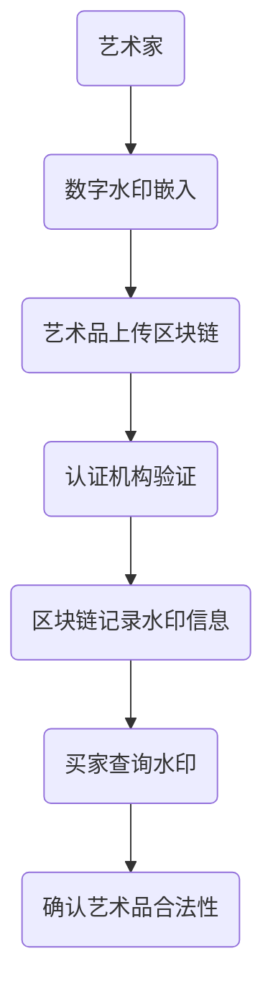
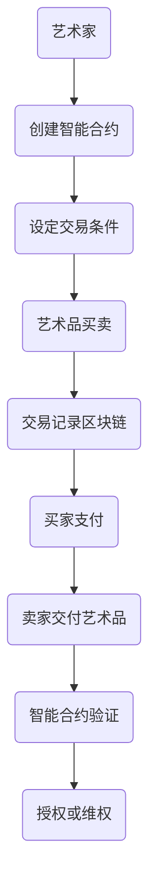
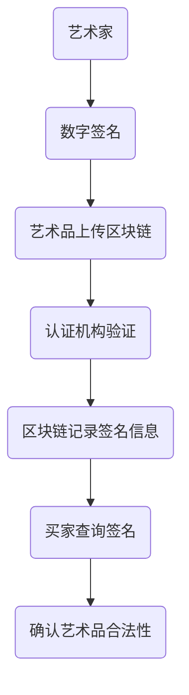

                 

### 《区块链在数字艺术品认证中的应用》

> **关键词**：区块链、数字艺术品、认证、去中心化、加密技术、智能合约

> **摘要**：本文深入探讨了区块链技术在数字艺术品认证中的应用。首先，我们概述了区块链的基础知识，然后分析了数字艺术品认证的需求与挑战，并详细讲解了区块链在数字艺术品认证中的具体应用场景。接着，本文介绍了区块链与数字水印、智能合约和数字签名技术的结合，通过案例分析展示了区块链在数字艺术品认证中的实际应用，并提出了面临的挑战和未来的发展趋势。最后，我们讨论了区块链在数字艺术品认证中的法律与伦理问题，为区块链技术在数字艺术品领域的广泛应用提供了全面的视角。

### 第一部分：区块链基础与数字艺术品认证概述

#### 第1章 区块链技术概述

区块链是一种去中心化的分布式数据库技术，通过密码学确保数据的不可篡改性和透明性。区块链的基本原理包括数据区块、链式结构、共识机制等。在区块链中，每个区块都包含一定数量的交易记录，并通过密码学算法与前一区块相连，形成一条时间序列的链式结构。这种结构使得任何对区块的数据篡改都会被发现并拒绝，从而确保了数据的真实性。

区块链的去中心化特性是其核心优势之一。去中心化意味着区块链不需要中央权威机构进行管理，而是由网络中的所有节点共同维护。这使得区块链网络具有高度的容错性和抗攻击性，同时也降低了交易成本和提高效率。此外，区块链技术还利用密码学技术来确保数据的隐私和安全。

区块链在数字艺术品认证中的潜在价值主要体现在以下几个方面：

1. **数据不可篡改性**：区块链上的数据一旦被记录，就几乎无法篡改。这对于数字艺术品的认证尤为重要，因为数字艺术品的真实性是艺术家、收藏家和市场参与者共同关心的问题。

2. **透明性和可追溯性**：区块链上的所有交易记录都是公开透明的，任何人都可以查看。这有助于建立数字艺术品的完整历史记录，从而提高艺术品的市场透明度。

3. **去中心化认证**：区块链的去中心化特性使得数字艺术品的认证不再依赖于中央权威机构，从而减少了认证过程中的中间环节和成本。

4. **智能合约的应用**：区块链技术中的智能合约可以自动执行预定义的条件，这为数字艺术品的买卖、授权和维权等提供了高效的自动化解决方案。

#### 第2章 数字艺术品认证的基础

数字艺术品是指通过计算机技术和数字媒体创作的艺术品，包括数字绘画、数字雕塑、数字音乐和数字摄影等。数字艺术品的定义与特点包括：

1. **数字性**：数字艺术品以数字形式存在，可以通过各种数字媒介展示和传播。

2. **可复制性**：数字艺术品可以轻松复制，这意味着同一件艺术品可以在多个地方同时存在。

3. **易篡改性**：由于数字艺术品的可复制性，其原始性和真实性容易受到质疑。

4. **版权问题**：数字艺术品的版权保护是一个复杂且具有挑战性的问题，因为数字艺术品的复制和分发非常容易。

数字艺术品认证的需求与挑战主要包括：

1. **真实性认证**：确保数字艺术品的原始性和真实性是认证的首要目标。

2. **版权保护**：数字艺术品容易复制，因此版权保护成为认证的一个重要方面。

3. **透明性和可追溯性**：建立数字艺术品的完整历史记录，确保交易透明可追溯。

4. **安全性**：数字艺术品认证系统需要确保数据的安全，防止未经授权的访问和篡改。

目前，数字艺术品认证的技术路径包括：

1. **数字签名**：通过数字签名技术确保数字艺术品的真实性。

2. **区块链技术**：利用区块链技术的去中心化和不可篡改性进行数字艺术品认证。

3. **加密技术**：使用加密技术保护数字艺术品的版权和隐私。

4. **智能合约**：通过智能合约实现数字艺术品交易的自动化和透明化。

#### 第3章 区块链在数字艺术品认证中的应用

区块链在数字艺术品认证中的应用主要体现在以下几个方面：

1. **数据不可篡改性**：区块链的不可篡改特性使得数字艺术品的历史记录一旦被记录在链上，就几乎无法被篡改，从而确保了艺术品的真实性。

2. **透明性和可追溯性**：区块链上的所有交易记录都是公开透明的，任何人都可以查看，这有助于建立数字艺术品的完整历史记录，提高市场透明度。

3. **去中心化认证**：区块链的去中心化特性使得数字艺术品的认证不再依赖于中央权威机构，减少了中间环节和成本。

4. **智能合约的应用**：智能合约可以自动执行预定义的条件，为数字艺术品的买卖、授权和维权等提供了高效的自动化解决方案。

基于区块链的数字艺术品认证系统架构通常包括以下几部分：

1. **艺术家和创作者**：他们负责创作数字艺术品，并在区块链上发布和认证。

2. **认证机构**：这些机构负责验证数字艺术品的原始性和真实性。

3. **收藏家和买家**：他们可以在区块链上查看数字艺术品的完整历史记录，确保艺术品的真实性。

4. **区块链网络**：区块链网络负责存储和管理所有交易记录。

基于区块链的数字艺术品认证流程通常包括以下步骤：

1. **艺术家创建数字艺术品**：艺术家在区块链上创建数字艺术品，并使用数字签名技术确保艺术品的原创性。

2. **认证机构验证艺术品**：认证机构对艺术品的原创性进行验证，并将验证结果记录在区块链上。

3. **艺术品发布**：艺术家将经过认证的艺术品发布到区块链上，公开透明。

4. **买家查询和购买**：买家可以在区块链上查询艺术品的完整历史记录，确保艺术品的真实性，并选择购买。

5. **艺术品交易和授权**：通过智能合约实现艺术品的交易和授权，确保交易的自动化和透明化。

在区块链在数字艺术品认证中的应用中，存在一些经典案例：

1. **佳士得与CryptoKitties合作**：佳士得拍卖行与CryptoKitties合作，使用区块链技术进行数字艺术品的认证和交易。

2. **Rarible平台**：Rarible是一个基于区块链的数字艺术品交易平台，使用以太坊区块链进行艺术品的认证和交易。

3. **OpenSea平台**：OpenSea是一个去中心化的数字艺术品市场，使用以太坊区块链进行艺术品的认证和交易。

#### 第4章 区块链在数字艺术品认证中的关键技术

区块链在数字艺术品认证中的应用不仅依赖于其基础架构，还依赖于一系列关键技术的支持。以下是一些核心技术及其在数字艺术品认证中的应用：

1. **数字水印**：数字水印是一种在数字艺术品中嵌入隐蔽信息的技术，用于标识艺术品的版权信息。区块链与数字水印的结合，可以在链上记录艺术品的唯一标识，从而增强认证的可信度。

2. **智能合约**：智能合约是区块链上自动执行预定条件的计算机程序。在数字艺术品认证中，智能合约可以用于自动化艺术品的买卖、授权和维权流程，确保交易的透明性和可执行性。

3. **数字签名**：数字签名是一种确保数据完整性和真实性的技术。在数字艺术品认证中，艺术家和认证机构可以使用数字签名技术对艺术品进行签名，证明艺术品的原创性和合法性。

#### 4.1 区块链与数字水印的结合

数字水印技术可以在数字艺术品中嵌入不可见的标识，用于追踪和证明艺术品的版权信息。当数字艺术品被上传到区块链上时，这些水印信息可以与区块链上的艺术品记录相匹配，从而增强艺术品的认证可信度。

**核心概念与联系**：

- **数字水印**：一种在数字艺术品中嵌入的不可见标识。
- **区块链**：一个分布式数据库，用于存储和管理艺术品的信息。
- **数字水印与区块链的连接**：通过将数字水印信息记录在区块链上，实现艺术品的唯一标识和认证。

**应用场景**：

- 艺术家可以将数字水印嵌入到他们的数字艺术品中，用于证明原创性。
- 认证机构可以在区块链上验证这些水印信息，确保艺术品的真实性。
- 买家可以在购买艺术品时，通过区块链查询水印信息，确认艺术品的合法性。

**Mermaid 流程图**：

#### 4.2 区块链与智能合约的结合

智能合约是区块链上的自动化执行程序，可以根据预设条件自动执行特定操作。在数字艺术品认证中，智能合约可以用于自动化艺术品的买卖、授权和维权流程，提高交易效率。

**核心概念与联系**：

- **智能合约**：一种在区块链上自动执行预定条件的计算机程序。
- **区块链**：一个分布式数据库，用于存储和管理艺术品的信息。
- **智能合约与区块链的连接**：通过智能合约实现艺术品的自动化交易和授权。

**应用场景**：

- 艺术品买卖：智能合约可以自动执行艺术品的买卖流程，确保交易的透明性和安全性。
- 艺术品授权：艺术家可以使用智能合约授权其他用户使用他们的艺术品，同时确保授权的合法性和透明性。
- 艺术品维权：在艺术品被盗用或侵权时，智能合约可以自动执行维权操作，确保权利人的合法权益。

**Mermaid 流程图**：

#### 4.3 区块链与数字签名技术的结合

数字签名技术可以用于确保数据的完整性和真实性。在数字艺术品认证中，艺术家和认证机构可以使用数字签名技术对艺术品进行签名，证明艺术品的原创性和合法性。

**核心概念与联系**：

- **数字签名**：一种用于确保数据完整性和真实性的技术。
- **区块链**：一个分布式数据库，用于存储和管理艺术品的信息。
- **数字签名与区块链的连接**：通过在区块链上记录数字签名信息，确保艺术品的认证可信度。

**应用场景**：

- 艺术家使用数字签名对艺术品进行签名，确保原创性。
- 认证机构使用数字签名验证艺术品的真实性。
- 买家使用数字签名确认艺术品的合法性。

**Mermaid 流程图**：

### 第二部分：区块链在数字艺术品认证中的实践

#### 第5章 区块链在数字艺术品认证中的案例分析

区块链在数字艺术品认证中的应用已经逐步成熟，通过一些实际案例，我们可以看到区块链技术在艺术品认证方面的具体实践。

**案例一：佳士得与CryptoKitties合作**

佳士得拍卖行与CryptoKitties平台合作，使用区块链技术进行数字艺术品的认证和交易。CryptoKitties是一个基于以太坊区块链的数字宠物平台，用户可以在平台上购买、交换和展示他们的数字宠物。通过这个合作，佳士得拍卖行将数字艺术品与CryptoKitties平台连接，实现了数字艺术品的区块链认证。

**案例过程**：

1. 艺术家创作数字艺术品，并将其上传到CryptoKitties平台。
2. CryptoKitties平台使用区块链技术对数字艺术品进行认证，确保艺术品的原创性和真实性。
3. 买家可以在CryptoKitties平台上购买数字艺术品，并通过区块链确认艺术品的合法性。
4. 交易完成后，数字艺术品的所有权记录在区块链上，确保交易的透明性和可追溯性。

**案例分析**：

这个案例展示了区块链在数字艺术品认证中的强大潜力。通过区块链技术，佳士得拍卖行和CryptoKitties平台实现了数字艺术品的可信认证和透明交易，提高了市场的透明度和可信度。

**案例二：Rarible平台**

Rarible是一个基于区块链的数字艺术品交易平台，用户可以在平台上创建、购买和出售数字艺术品。Rarible使用以太坊区块链进行艺术品的认证和交易，为艺术家和收藏家提供了一个去中心化的交易平台。

**案例过程**：

1. 艺术家在Rarible平台上创建数字艺术品，并将其上传到平台。
2. Rarible平台使用区块链技术对数字艺术品进行认证，确保艺术品的原创性和真实性。
3. 买家可以在Rarible平台上浏览和购买数字艺术品，并通过区块链确认艺术品的合法性。
4. 交易完成后，数字艺术品的所有权记录在区块链上，确保交易的透明性和可追溯性。

**案例分析**：

Rarible平台的成功展示了区块链技术在数字艺术品认证和交易中的应用潜力。通过区块链技术，Rarible平台实现了艺术品的可信认证和透明交易，为艺术家和收藏家提供了一个高效、安全且去中心化的交易平台。

**案例三：OpenSea平台**

OpenSea是一个去中心化的数字艺术品市场，用户可以在平台上购买、出售和交换数字艺术品。OpenSea使用以太坊区块链进行艺术品的认证和交易，为用户提供了一个开放的数字艺术品交易环境。

**案例过程**：

1. 艺术家在OpenSea平台上创建数字艺术品，并将其上传到平台。
2. OpenSea平台使用区块链技术对数字艺术品进行认证，确保艺术品的原创性和真实性。
3. 买家可以在OpenSea平台上浏览和购买数字艺术品，并通过区块链确认艺术品的合法性。
4. 交易完成后，数字艺术品的所有权记录在区块链上，确保交易的透明性和可追溯性。

**案例分析**：

OpenSea平台的成功表明，区块链技术不仅适用于艺术品认证，还可以为用户提供一个去中心化的交易环境。通过区块链技术，OpenSea平台实现了艺术品的可信认证和透明交易，为用户提供了更多的选择和灵活性。

### 第6章 区块链在数字艺术品认证中的挑战与未来趋势

区块链技术在数字艺术品认证中展现出了巨大的潜力，但同时也面临一些挑战。了解这些挑战和未来的发展趋势，有助于更好地推动区块链技术在数字艺术品认证领域的应用。

#### 挑战

1. **技术门槛**：区块链技术的复杂性和技术门槛较高，对于一些艺术家和收藏家来说，使用区块链技术进行艺术品认证和交易可能存在一定的困难。

2. **安全性问题**：尽管区块链技术具有较高的安全性，但仍然存在被黑客攻击和恶意篡改的风险。确保区块链系统的安全性是数字艺术品认证的关键挑战。

3. **法律法规**：区块链技术的法律地位和监管政策在不同国家和地区存在差异，这可能对数字艺术品认证的全球应用造成一定的影响。

4. **隐私保护**：数字艺术品认证涉及到大量的个人信息和交易数据，如何在确保认证真实性的同时保护用户的隐私，是区块链技术面临的一个重要挑战。

#### 未来趋势

1. **技术成熟**：随着区块链技术的不断成熟和普及，其复杂性和技术门槛将逐渐降低，更多的人将能够利用区块链技术进行数字艺术品认证和交易。

2. **安全性提升**：随着安全技术的不断发展，区块链系统的安全性将得到进一步提升，降低被黑客攻击和恶意篡改的风险。

3. **法律法规完善**：随着区块链技术的应用越来越广泛，各国政府和监管机构将逐渐完善相关法律法规，为区块链技术在数字艺术品认证领域的应用提供法律保障。

4. **隐私保护加强**：随着隐私保护技术的不断发展，区块链技术在数字艺术品认证中的应用将更加注重用户的隐私保护，确保在确保认证真实性的同时保护用户的隐私。

### 第7章 区块链在数字艺术品认证中的法律与伦理问题

区块链技术在数字艺术品认证中的应用引发了众多法律和伦理问题，这些问题的解决对于区块链技术的广泛应用至关重要。

#### 法律问题

1. **版权保护**：数字艺术品的版权保护是区块链技术面临的一个重要法律问题。如何在区块链上有效地保护艺术品的版权，确保创作者的合法权益，是当前法律界亟待解决的问题。

2. **交易合法性**：数字艺术品在区块链上的交易需要符合各国的法律法规，确保交易的合法性。不同国家和地区的法律法规可能存在差异，这给区块链技术的应用带来了一定的挑战。

3. **纠纷解决**：在区块链上发生交易纠纷时，如何快速有效地解决纠纷，确保公平公正，是法律界需要探讨的问题。

#### 伦理问题

1. **隐私保护**：数字艺术品认证涉及到大量的个人信息和交易数据，如何在确保认证真实性的同时保护用户的隐私，是区块链技术面临的一个重要伦理问题。

2. **公平公正**：区块链技术需要在数字艺术品认证中确保交易的公平公正，防止欺诈和恶意行为。

3. **社会责任**：区块链技术在数字艺术品认证中的应用需要承担一定的社会责任，确保技术的合理使用，促进艺术市场的健康发展。

#### 合规性考虑

1. **法律遵守**：区块链技术在数字艺术品认证中的应用需要遵守各国的法律法规，确保交易合法合规。

2. **技术合规**：区块链技术需要通过合规性测试，确保系统的安全性和可靠性。

3. **监管合作**：区块链技术企业和监管机构需要加强合作，共同推动区块链技术在数字艺术品认证领域的合规应用。

### 第8章 总结与展望

区块链技术在数字艺术品认证中的应用为艺术市场带来了革命性的变革。通过区块链技术的不可篡改性、透明性和去中心化特性，数字艺术品的认证变得更加可信和高效。然而，区块链技术在实际应用中也面临一些挑战，如技术门槛、安全性问题、法律法规和隐私保护等。为了推动区块链技术在数字艺术品认证领域的广泛应用，我们需要进一步研究这些挑战，并探索解决方法。

未来，随着区块链技术的不断成熟和普及，数字艺术品认证将变得更加便捷和高效。同时，法律法规的完善和伦理问题的解决也将为区块链技术在数字艺术品认证中的应用提供坚实的保障。

总之，区块链技术在数字艺术品认证中的应用前景广阔，有望为艺术市场带来更加繁荣和透明的未来。

### 附录

#### 附录A：区块链在数字艺术品认证中的常用工具与平台

- **区块链平台**：
  - **Ethereum**：以太坊是使用最广泛的区块链平台之一，支持智能合约的应用。
  - **EOS**：EOS是一个高性能的区块链平台，适用于大规模的分布式应用。
  - **Ripple**：Ripple是一个专注于金融领域的区块链平台，可用于数字货币的转账和交易。

- **数字艺术品认证平台**：
  - **Rarible**：Rarible是一个基于以太坊的数字艺术品交易平台，支持艺术品的创建、购买和销售。
  - **OpenSea**：OpenSea是一个去中心化的数字艺术品市场，提供艺术品交易、收藏和展示功能。
  - **SuperRare**：SuperRare是一个基于以太坊的数字艺术品市场，专注于独特和高价值的艺术品。

#### 附录B：区块链数字艺术品认证的相关术语解释

- **区块链**：一种分布式数据库，用于存储和管理数据，通过密码学确保数据的不可篡改性。
- **数字签名**：一种用于验证数据和确保数据完整性的技术，通过加密算法实现。
- **智能合约**：一种在区块链上自动执行预定条件的计算机程序，用于自动化交易和合约执行。
- **数字水印**：一种在数字艺术品中嵌入的不可见标识，用于追踪和证明艺术品的版权信息。

#### 附录C：区块链数字艺术品认证的标准与规范

- **ISO/IEC 27001**：信息安全管理体系标准，用于确保信息系统的安全性和保密性。
- **ISO/IEC 22301**：业务连续性管理体系标准，确保在突发事件中业务不中断。
- **ISO 45001**：职业健康安全管理体系标准，确保工作场所的安全和健康。

#### 附录D：区块链数字艺术品认证的相关法律法规

- **《中华人民共和国网络安全法》**：规范网络信息安全，保护公民个人信息。
- **《中华人民共和国合同法》**：规范合同签订、履行和终止的法律规定。
- **《数字资产管理条例》**：规范数字资产交易和管理的相关法律。

### 作者信息

**作者：AI天才研究院/AI Genius Institute & 禅与计算机程序设计艺术 /Zen And The Art of Computer Programming**

在这篇技术博客中，我们深入探讨了区块链在数字艺术品认证中的应用。首先，我们介绍了区块链的基础知识，包括其起源、原理和技术架构，并分析了区块链在数字艺术品认证中的潜在价值。接着，我们详细阐述了数字艺术品认证的需求与挑战，以及区块链在其中的应用场景和关键技术。

通过案例分析，我们展示了区块链在数字艺术品认证中的实际应用，并探讨了其面临的挑战和未来趋势。我们还讨论了区块链在数字艺术品认证中的法律与伦理问题，为区块链技术在数字艺术品领域的广泛应用提供了全面的视角。

随着区块链技术的不断成熟和应用场景的拓展，数字艺术品认证有望变得更加便捷、高效和可信。然而，我们也需要关注技术、法律和伦理方面的问题，确保区块链技术的合理使用和健康发展。

感谢您的阅读，希望本文对您在数字艺术品认证和区块链技术领域的研究有所帮助。如果您有任何疑问或建议，欢迎在评论区留言，期待与您交流。同时，推荐您进一步阅读相关文献，以深入了解区块链在数字艺术品认证中的应用。再次感谢您的支持！

