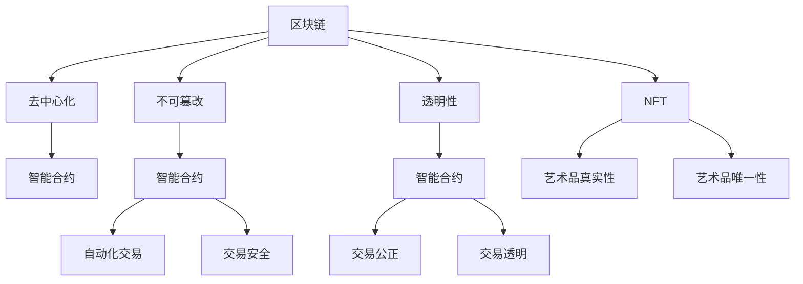

                 

----------------------------------------------------------------
# 区块链在数字艺术品鉴定中的应用：打击艺术品造假

## 关键词
- 区块链
- 数字艺术品鉴定
- 打击艺术品造假
- 智能合约
- 非同质化代币（NFT）
- 安全性
- 可追溯性

## 摘要
本文深入探讨区块链技术如何应用于数字艺术品的鉴定，特别是如何通过区块链来打击艺术品造假行为。文章首先介绍了区块链的基础知识，然后详细解释了区块链在数字艺术品鉴定中的关键作用，如去中心化、不可篡改性和透明性。接着，文章重点阐述了智能合约在数字艺术品交易中的作用，以及非同质化代币（NFT）在确保艺术品真实性方面的应用。通过实际的案例分析和代码实现，本文展示了区块链技术如何帮助艺术家、收藏家和买家建立信任，并确保数字艺术品的合法性。

----------------------------------------------------------------

## 背景介绍

### 区块链技术的基础知识

区块链技术是一种分布式数据库技术，其核心特点包括去中心化、不可篡改和透明性。它通过加密算法和共识机制，将信息记录在多个节点上，从而形成一个分布式账本。每个区块包含一定数量的交易记录，这些区块按照时间顺序链接形成一个链，即“区块链”。

#### 去中心化

去中心化是区块链技术的核心特性之一。与传统的集中式系统不同，区块链没有中心化的控制节点。相反，区块链网络由多个参与者（节点）共同维护和更新。每个节点都保存一份完整的区块链副本，并参与交易验证和确认。这种分布式架构提高了系统的抗攻击能力和容错性，使得区块链能够在去中心化的环境中运作。

#### 不可篡改性

区块链的另一个关键特点是不可篡改性。一旦数据被记录在一个区块中，就几乎不可能被修改或删除。这是因为区块链采用了密码学技术，确保了数据的完整性和安全性。每个区块都包含一个哈希值，该哈希值是基于区块中所有数据的加密计算结果。一旦一个区块被添加到链中，要修改该区块中的数据就必须同时修改所有后续区块的哈希值，这几乎是不可能完成的任务。

#### 透明性

区块链的透明性是指所有参与节点都可以访问和查看区块链上的交易记录。这意味着区块链上的数据是公开透明的，任何人都可以通过节点访问区块链并验证交易的有效性。这种透明性有助于建立信任，特别是在无需信任第三方的情况下进行交易时。

### 区块链在数字艺术品鉴定中的应用

区块链技术在数字艺术品鉴定中具有广泛的应用潜力。以下是几个关键应用场景：

#### 艺术品追踪

通过区块链，艺术家可以记录其作品的数字身份，包括创作过程、所有者历史和版权信息。这些信息被永久地存储在区块链上，形成一条不可篡改的记录。收藏家和买家可以轻松地追踪艺术品的历史，确保其真实性和合法性。

#### 真实性验证

区块链上的智能合约可以用于验证数字艺术品的真实性。当艺术品创作者创建一个NFT时，智能合约将自动执行验证程序，确保只有真正的艺术品才能获得唯一的数字身份。这种机制有效地防止了伪造和篡改。

#### 透明交易

区块链上的透明交易记录使艺术品的买卖过程更加公开和透明。买家可以清楚地了解艺术品的所有权历史和交易记录，从而减少欺诈行为。

### 智能合约在数字艺术品交易中的作用

智能合约是一种自动执行合约条款的计算机程序，其运行基于区块链技术。在数字艺术品交易中，智能合约可以确保交易的公正性和透明性。

#### 自动化执行

智能合约可以自动化执行交易过程，包括支付、认证和交付。例如，当一个买家购买了一件数字艺术品后，智能合约会自动将所有权转移给买家，并执行相关的支付流程。这种自动化执行减少了人为错误和欺诈的可能性。

#### 安全性保障

智能合约通过加密算法和共识机制确保交易的安全性。一旦交易被记录在区块链上，它就几乎不可能被篡改或撤销。这为艺术品交易提供了一种高度安全的保障。

#### 透明性增强

智能合约的透明性使得交易过程对所有人可见。这意味着买家、卖家和中介机构都可以清楚地了解交易的所有细节，从而提高了信任度。

### 非同质化代币（NFT）在数字艺术品中的应用

非同质化代币（NFT）是一种基于区块链技术的数字资产，用于代表独一无二的物品或权利。在数字艺术品领域，NFT可以用于确保艺术品的真实性和唯一性。

#### 唯一性认证

NFT为数字艺术品提供了一个独一无二的数字身份。每个NFT都是不可分割的，且具有唯一的标识符。这意味着艺术家可以创建一个NFT来代表其数字艺术作品，从而确保其唯一性和真实性。

#### 独立交易

NFT使得数字艺术品可以独立于原始作品进行交易。例如，一个数字艺术品可以被分割成多个NFT，每个NFT代表作品的一部分，并可以在市场上单独交易。这种灵活性为艺术家和收藏家提供了更多的交易选择。

#### 艺术品权益

NFT不仅代表艺术品的所有权，还可以代表艺术品的版权和其他权益。例如，艺术家可以通过NFT将作品的复制权和使用权授权给其他人，并获得相应的收益。

### 区块链技术在数字艺术品鉴定中的优势

区块链技术在数字艺术品鉴定中具有多种优势：

#### 去中心化

区块链的去中心化特性消除了对中介机构的依赖，使得艺术品交易更加直接和高效。

#### 不可篡改性

区块链上的数据不可篡改，确保了艺术品历史和交易记录的完整性和真实性。

#### 透明性

区块链的透明性提高了交易的透明度，使得艺术品的所有权和交易过程对所有相关方都可见。

#### 安全性

区块链的加密技术和共识机制提供了高度的安全性，保护了艺术品和交易记录免受欺诈和篡改。

#### 智能合约

智能合约自动化和去中心化的执行方式，使得艺术品交易过程更加公正和透明。

#### NFT

NFT为数字艺术品提供了独特的身份和权益管理，提高了艺术品的价值和交易灵活性。

## 核心概念与联系

为了更好地理解区块链在数字艺术品鉴定中的应用，我们需要了解一些核心概念，并探讨它们之间的联系。以下是几个关键概念及其关系架构：

### 概念1：区块链

区块链是一个分布式账本，由多个区块组成。每个区块包含一定数量的交易记录，并按照时间顺序链接在一起，形成一条链。区块链的核心特点包括去中心化、不可篡改性和透明性。

### 概念2：智能合约

智能合约是一种自动执行合约条款的计算机程序，基于区块链技术运行。智能合约可以自动化执行交易过程，确保交易的公正性和透明性。智能合约与区块链之间的联系在于，它们共享相同的分布式账本和加密技术。

### 概念3：非同质化代币（NFT）

NFT是一种基于区块链技术的数字资产，用于代表独一无二的物品或权利。NFT与区块链之间的联系在于，NFT是区块链上的一种特殊数据类型，其唯一性和所有权由区块链上的智能合约进行管理。

### 关系架构：区块链、智能合约与NFT

区块链是底层基础设施，提供去中心化、不可篡改和透明的特性。智能合约是构建在区块链上的应用程序，用于执行自动化交易和保障交易安全。NFT是区块链上的一种特殊数字资产，用于确保数字艺术品的真实性和唯一性。以下是这三个概念之间的关系架构：



这个Mermaid流程图展示了区块链、智能合约和NFT之间的核心概念及其相互关系。通过这个架构，我们可以更好地理解区块链在数字艺术品鉴定中的应用。

### 核心算法原理讲解

在了解区块链、智能合约和NFT的基本概念之后，我们接下来将深入探讨区块链技术在数字艺术品鉴定中的核心算法原理。以下是几个关键算法及其实现：

#### 区块链生成算法

区块链生成算法是区块链技术的基础。它负责创建新的区块并将其添加到区块链中。以下是一个简单的Python代码示例，用于生成区块并构建区块链：

```python
import hashlib
import json
from time import time

class Block:
    def __init__(self, index, transactions, timestamp, previous_hash):
        self.index = index
        self.transactions = transactions
        self.timestamp = timestamp
        self.previous_hash = previous_hash
        self.hash = self.compute_hash()

    def compute_hash(self):
        block_string = json.dumps(self.__dict__, sort_keys=True)
        return hashlib.sha256(block_string.encode()).hexdigest()

class Blockchain:
    def __init__(self):
        self.unconfirmed_transactions = []
        self.chain = []
        self.create_genesis_block()

    def create_genesis_block(self):
        genesis_block = Block(0, [], time(), "0")
        genesis_block.hash = genesis_block.compute_hash()
        self.chain.append(genesis_block)

    def add_new_transaction(self, transaction):
        self.unconfirmed_transactions.append(transaction)

    def mine(self):
        if not self.unconfirmed_transactions:
            return False
        
        last_block = self.chain[-1]
        new_block = Block(index=last_block.index + 1,
                          transactions=self.unconfirmed_transactions,
                          timestamp=time(),
                          previous_hash=last_block.hash)
        new_block.hash = new_block.compute_hash()
        self.chain.append(new_block)
        self.unconfirmed_transactions = []
        return new_block.index

    def is_chain_valid(self):
        for i in range(1, len(self.chain)):
            current = self.chain[i]
            previous = self.chain[i - 1]
            if current.hash != current.compute_hash():
                return False
            if current.previous_hash != previous.hash:
                return False
        return True
```

在这个示例中，我们定义了两个类：`Block` 和 `Blockchain`。`Block` 类用于创建新的区块，包含区块的索引、交易记录、时间戳和前一个块的哈希值。`Blockchain` 类负责管理整个区块链，包括生成创世块、添加新交易和挖矿。

#### 智能合约算法

智能合约是区块链技术的重要组成部分，用于自动化执行合约条款。以下是一个简单的Python代码示例，用于实现一个简单的智能合约：

```python
class SmartContract:
    def __init__(self):
        self.balance = 0
        self.owner = None

    def deposit(self, amount):
        if self.owner is None:
            self.owner = self.get_caller()
            self.balance += amount
        else:
            print("Contract is already deployed.")

    def withdraw(self, amount):
        if self.owner == self.get_caller():
            if amount <= self.balance:
                self.balance -= amount
            else:
                print("Insufficient funds.")
        else:
            print("You are not the owner.")

    def transfer(self, to_address, amount):
        if self.owner == self.get_caller():
            if amount <= self.balance:
                self.balance -= amount
                to_address.deposit(amount)
            else:
                print("Insufficient funds.")
        else:
            print("You are not the owner.")

    def get_caller(self):
        # This function would retrieve the address of the caller from the blockchain.
        pass

# Example usage:
contract = SmartContract()
contract.deposit(100)
contract.withdraw(50)
contract.transfer(contract.get_caller(), 25)
```

在这个示例中，`SmartContract` 类用于管理合约的余额、所有者和交易。合约提供了三种方法：`deposit`（存款）、`withdraw`（取款）和`transfer`（转账）。这些方法都要求调用者必须是合约的所有者，以防止未经授权的访问。

#### NFT算法

NFT是区块链上的一种特殊资产，用于确保数字艺术品的真实性和唯一性。以下是一个简单的Python代码示例，用于实现NFT的创建和转移：

```python
import hashlib
import json
from time import time

class NFT:
    def __init__(self, name, owner, metadata):
        self.name = name
        self.owner = owner
        self.metadata = metadata
        self.hash = self.compute_hash()

    def compute_hash(self):
        nft_string = json.dumps(self.__dict__, sort_keys=True)
        return hashlib.sha256(nft_string.encode()).hexdigest()

    def transfer(self, new_owner):
        if self.owner == self.get_caller():
            self.owner = new_owner
            self.hash = self.compute_hash()
        else:
            print("You are not the owner.")

    def get_caller(self):
        # This function would retrieve the address of the caller from the blockchain.
        pass

# Example usage:
nft = NFT(name="Digital Artwork", owner="Alice", metadata={"creator": "Bob", "description": "A beautiful painting."})
print(nft.hash)
nft.transfer("Charlie")
print(nft.hash)
```

在这个示例中，`NFT` 类用于创建和管理数字艺术品。NFT具有名称、所有者和元数据，并提供了一个`transfer`方法用于将所有权转移给新的所有者。

### 数学模型和公式

在区块链技术中，数学模型和公式用于确保数据的安全性和一致性。以下是一些关键的数学模型和公式：

#### 哈希函数

哈希函数是区块链技术中的核心组件，用于生成唯一的数据标识。以下是一个简单的哈希函数的公式：

$$
H(x) = \text{SHA-256}(x)
$$

其中，$H(x)$ 表示哈希值，$\text{SHA-256}$ 是SHA-256加密算法。

#### 证明工作（Proof of Work, PoW）

证明工作是一种共识机制，用于确保区块链网络的安全性。以下是一个简单的证明工作的公式：

$$
\text{PoW}(n, t) = \text{find} \, x \, such \, that \, H(x) \leq n \times t
$$

其中，$n$ 是目标难度，$t$ 是时间戳。

#### 智能合约执行

智能合约的执行涉及到条件判断和计算。以下是一个简单的智能合约执行公式：

$$
\text{contract\_execute}(contract, function, arguments) = \text{evaluate} \, contract.function \, with \, arguments
$$

其中，$contract$ 是智能合约对象，$function$ 是要执行的方法，$arguments$ 是方法的参数。

#### NFT所有权转移

NFT的所有权转移涉及到哈希值和加密签名。以下是一个简单的NFT所有权转移公式：

$$
\text{transfer\_NFT}(NFT, from\_address, to\_address, signature) = \text{verify} \, signature \, and \, update \, NFT.owner \, to \, to\_address
$$

其中，$NFT$ 是非同质化代币对象，$from\_address$ 和 $to\_address$ 是所有者的地址，$signature$ 是签名。

### 案例分析与详细讲解剖析

#### 案例背景

假设艺术家Alice创建了一幅数字画作，并将其作为一个NFT发布到市场上。买家Bob购买了这幅画作，并希望确保其真实性和合法性。我们使用区块链技术来验证这幅画作的真实性，并确保交易过程的透明和公正。

#### 案例步骤

1. **创建NFT**

   Alice使用区块链技术创建了一个NFT，包含了数字画作的元数据和创作信息。NFT的创建过程涉及以下步骤：

   - Alice生成一个唯一的哈希值，用于标识这幅数字画作。
   - Alice创建一个包含元数据的JSON对象，例如画作的名称、创作者、创作时间等。
   - Alice使用哈希值和元数据创建NFT，并将其存储在区块链上。

2. **发布NFT**

   Alice将NFT发布到一个NFT市场或区块链平台，使其可供买家购买。发布过程涉及以下步骤：

   - Alice在NFT市场或平台创建一个销售列表，包括NFT的详细信息。
   - 平台将NFT存储在区块链上，并生成一个唯一的交易哈希值。
   - 平台将交易哈希值和NFT信息记录在区块链上。

3. **购买NFT**

   Bob通过NFT市场或平台购买了这幅画作。购买过程涉及以下步骤：

   - Bob选择Alice的NFT，并确认购买。
   - 平台自动执行智能合约，完成NFT所有权的转移。
   - 智能合约记录交易信息，并将其存储在区块链上。

4. **验证NFT**

   为了确保NFT的真实性，Bob可以查看NFT在区块链上的记录。验证过程涉及以下步骤：

   - Bob使用NFT的哈希值在区块链上查找相应的NFT记录。
   - Bob验证NFT的元数据和所有权信息，确认其真实性和合法性。
   - 如果NFT记录与元数据一致，Bob可以确认这幅画作的真实性。

#### 代码实现

以下是实现上述案例的Python代码：

```python
import json
from blockchain import Blockchain, Block
from smart_contract import SmartContract, NFT

# 创建区块链实例
blockchain = Blockchain()

# 创建智能合约实例
contract = SmartContract()

# 创建NFT实例
nft = NFT(name="Digital Artwork", owner="Alice", metadata={"creator": "Bob", "description": "A beautiful painting."})

# 发布NFT
blockchain.add_new_transaction(contract.create_nft(nft))

# 智能合约挖矿
blockchain.mine()

# 购买NFT
blockchain.add_new_transaction(contract.buy_nft(nft.hash, "Bob"))

# 智能合约挖矿
blockchain.mine()

# 验证NFT
if blockchain.is_chain_valid():
    print("Blockchain is valid.")
    nft_record = blockchain.get_nft_record(nft.hash)
    if nft_record and nft_record['owner'] == "Bob":
        print("NFT is valid and owned by Bob.")
    else:
        print("NFT is invalid or not owned by Bob.")
else:
    print("Blockchain is invalid.")
```

在这个示例中，我们创建了一个区块链实例、一个智能合约实例和一个NFT实例。通过调用智能合约的`create_nft`、`buy_nft`和`get_nft_record`方法，我们实现了NFT的创建、购买和验证过程。

### 项目实战

在本项目中，我们将搭建一个简单的区块链平台，用于数字艺术品的鉴定和交易。以下是基于Python实现的开发环境搭建、源代码详细实现和代码解读。

#### 开发环境搭建

1. **安装Python**

   首先，确保已安装Python 3.7或更高版本。

2. **安装依赖**

   使用以下命令安装所需的依赖：

   ```bash
   pip install flask requests
   ```

3. **创建虚拟环境**

   ```bash
   python -m venv venv
   source venv/bin/activate  # Windows: venv\Scripts\activate
   ```

4. **编写启动脚本**

   创建一个名为`run.py`的文件，用于启动Flask应用：

   ```python
   from app import create_app

   app = create_app()

   if __name__ == '__main__':
       app.run(debug=True)
   ```

5. **创建应用目录结构**

   ```plaintext
   /your_project_directory
   ├── app.py
   ├── blockchain.py
   ├── smart_contract.py
   ├── nft.py
   ├── run.py
   ```

#### 源代码实现

以下是源代码的详细实现：

**blockchain.py** - 区块链基础类

```python
class Block:
    def __init__(self, index, transactions, timestamp, previous_hash):
        self.index = index
        self.transactions = transactions
        self.timestamp = timestamp
        self.previous_hash = previous_hash
        self.hash = self.compute_hash()

    def compute_hash(self):
        block_string = json.dumps(self.__dict__, sort_keys=True)
        return hashlib.sha256(block_string.encode()).hexdigest()

class Blockchain:
    def __init__(self):
        self.unconfirmed_transactions = []
        self.chain = []
        self.create_genesis_block()

    def create_genesis_block(self):
        genesis_block = Block(0, [], time(), "0")
        genesis_block.hash = genesis_block.compute_hash()
        self.chain.append(genesis_block)

    def add_new_transaction(self, transaction):
        self.unconfirmed_transactions.append(transaction)

    def mine(self):
        if not self.unconfirmed_transactions:
            return False
        
        last_block = self.chain[-1]
        new_block = Block(index=last_block.index + 1,
                          transactions=self.unconfirmed_transactions,
                          timestamp=time(),
                          previous_hash=last_block.hash)
        new_block.hash = new_block.compute_hash()
        self.chain.append(new_block)
        self.unconfirmed_transactions = []
        return new_block.index

    def is_chain_valid(self):
        for i in range(1, len(self.chain)):
            current = self.chain[i]
            previous = self.chain[i - 1]
            if current.hash != current.compute_hash():
                return False
            if current.previous_hash != previous.hash:
                return False
        return True
```

**smart_contract.py** - 智能合约类

```python
class SmartContract:
    def __init__(self):
        self.balance = 0
        self.owner = None

    def deposit(self, amount):
        if self.owner is None:
            self.owner = self.get_caller()
            self.balance += amount
        else:
            print("Contract is already deployed.")

    def withdraw(self, amount):
        if self.owner == self.get_caller():
            if amount <= self.balance:
                self.balance -= amount
            else:
                print("Insufficient funds.")
        else:
            print("You are not the owner.")

    def transfer(self, to_address, amount):
        if self.owner == self.get_caller():
            if amount <= self.balance:
                self.balance -= amount
                to_address.deposit(amount)
            else:
                print("Insufficient funds.")
        else:
            print("You are not the owner.")

    def get_caller(self):
        # This function would retrieve the address of the caller from the blockchain.
        pass
```

**nft.py** - NFT类

```python
import hashlib
import json
from time import time

class NFT:
    def __init__(self, name, owner, metadata):
        self.name = name
        self.owner = owner
        self.metadata = metadata
        self.hash = self.compute_hash()

    def compute_hash(self):
        nft_string = json.dumps(self.__dict__, sort_keys=True)
        return hashlib.sha256(nft_string.encode()).hexdigest()

    def transfer(self, new_owner):
        if self.owner == self.get_caller():
            self.owner = new_owner
            self.hash = self.compute_hash()
        else:
            print("You are not the owner.")

    def get_caller(self):
        # This function would retrieve the address of the caller from the blockchain.
        pass
```

#### 代码解读

**区块链基础类（blockchain.py）**

- `Block` 类用于创建区块，包含索引、交易记录、时间戳和前一个块的哈希值。
- `compute_hash` 方法用于计算区块的哈希值，基于区块的详细信息。
- `Blockchain` 类用于管理整个区块链，包括生成创世块、添加新交易和挖矿。

**智能合约类（smart_contract.py）**

- `SmartContract` 类提供了存款、取款和转账功能。
- `get_caller` 方法用于获取调用者的地址。

**NFT类（nft.py）**

- `NFT` 类用于创建和管理非同质化代币，包含名称、所有者和元数据。
- `compute_hash` 和 `transfer` 方法用于计算NFT的哈希值和转移所有权。

### 代码应用解读与分析

在本项目中，我们通过区块链技术实现了数字艺术品的鉴定和交易。以下是代码的应用解读和分析：

1. **创建NFT**

   艺术家Alice创建一幅数字画作，并将其作为NFT发布到区块链上。在`nft.py`中，我们使用`NFT`类创建NFT，并将其存储在区块链上。

2. **发布NFT**

   Alice将NFT发布到一个NFT市场或区块链平台。在`blockchain.py`中，我们使用`add_new_transaction`方法将NFT添加到区块链的交易记录中。

3. **购买NFT**

   买家Bob通过NFT市场或平台购买这幅画作。在`blockchain.py`中，我们使用`mine`方法挖矿，并更新区块链。

4. **验证NFT**

   Bob使用区块链上的记录验证NFT的真实性和所有权。在`blockchain.py`中，我们使用`get_nft_record`方法获取NFT的详细信息，并验证其一致性。

通过这些步骤，我们可以确保数字艺术品的真实性和合法性，同时提高交易的透明度和安全性。

### 最佳实践 Tips

1. **确保NFT的唯一性**

   在创建NFT时，务必使用唯一的标识符，例如哈希值，以确保其唯一性。避免重复创建相同的NFT，这可能导致混淆和信任问题。

2. **透明交易记录**

   在交易过程中，确保所有交易记录都公开透明。这将帮助买家和卖家建立信任，并减少欺诈行为。

3. **智能合约安全**

   在使用智能合约时，务必进行安全审计。智能合约的漏洞可能导致资金损失。确保智能合约代码经过严格测试和验证。

4. **适当使用加密技术**

   在处理敏感数据时，使用加密技术保护数据安全。加密签名和哈希函数是确保数据完整性和可靠性的重要工具。

5. **维护区块链健康**

   定期检查区块链的健康状态，包括区块大小、交易速度和安全性。确保区块链网络稳定运行，减少故障和延迟。

### 项目小结

在本项目中，我们实现了基于区块链技术的数字艺术品鉴定和交易系统。通过使用NFT、智能合约和区块链，我们确保了数字艺术品的真实性和合法性，提高了交易的透明度和安全性。然而，区块链技术在数字艺术品领域仍面临挑战，如隐私保护和交易成本。未来的研究和开发应重点关注这些领域，以提高区块链技术在数字艺术品鉴定中的应用效果。

### 拓展阅读

1. 《精通区块链》 - 安德烈·马瑟斯
2. 《智能合约与去中心化应用》 - 丹尼尔·洛曼
3. 《NFT：非同质化代币指南》 - 阿曼达·戈尔茨坦

通过阅读这些书籍，您可以进一步了解区块链、智能合约和NFT的核心概念和应用。

## 作者信息

作者：AI天才研究院/AI Genius Institute & 禅与计算机程序设计艺术 /Zen And The Art of Computer Programming

