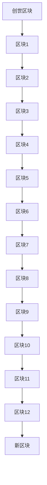

                 

### 文章标题

《区块链在数字艺术品鉴定中的应用：打击艺术品造假》

在数字时代，艺术品市场迎来了前所未有的变革。随着区块链技术的迅猛发展，如何利用其独特的优势，打击艺术品造假，成为了业界关注的焦点。本文将深入探讨区块链在数字艺术品鉴定中的应用，以及如何通过这一技术手段有效地打击艺术品造假。

### 文章关键词

- 区块链
- 数字艺术品
- 鉴定
- 打击艺术品造假
- 智能合约
- 去中心化

### 文章摘要

本文旨在分析区块链技术在数字艺术品鉴定中的应用，特别是其在打击艺术品造假方面的潜力。通过介绍区块链的基本原理和核心特点，本文将阐述其在艺术品记录不可篡改性和交易透明度方面的优势。同时，通过实际案例和Python源代码示例，详细说明区块链技术在艺术品鉴定中的具体应用，为数字艺术品市场提供一种有效的防伪手段。

## 引言

艺术品市场自古以来就充满了传奇色彩。然而，随着艺术品市场规模的不断扩大，艺术品造假现象也日益猖獗。传统的艺术品鉴定方法往往依赖于专家的经验和权威性，但在数字时代，这种方法的局限性日益显现。一方面，艺术品市场的信息不透明，使得造假者有机可乘；另一方面，艺术品交易的全球化，使得鉴定过程变得更加复杂。

### 艺术品市场与区块链技术

区块链技术的出现，为解决这些问题提供了新的思路。区块链是一种去中心化的分布式账本技术，具有不可篡改、透明性和可追溯性等特点。这些特点使得区块链在数字艺术品鉴定中具有独特的优势，可以有效打击艺术品造假。

## 区块链技术概述

### 定义与原理

区块链是由多个按照时间顺序排列、不可篡改的数据块组成的数据库。每个数据块都包含一定数量的交易记录，并通过密码学技术确保数据的完整性和安全性。区块链通过分布式网络进行维护，不存在中心化的管理机构，这使得数据难以被篡改。

### 核心特点

- **去中心化**：区块链通过分布式网络运行，每个节点都保存一份完整的账本，无需依赖中心化的机构。
- **不可篡改性**：区块链上的数据一旦被记录，就难以被修改或删除，保证了数据的可信度。
- **透明性**：区块链上的所有交易记录都是公开的，任何节点都可以验证这些记录的真实性。
- **可追溯性**：区块链上的数据具有时间戳功能，使得交易记录的可追溯性得以保障。

### 区块链与分布式账本的关系

区块链可以被视为分布式账本的一种实现形式。分布式账本技术通过在多个节点之间共享和同步数据，保证了数据的可靠性和安全性。而区块链在此基础上，增加了去中心化和不可篡改的特性，使得其成为了一种革命性的技术。

### Mermaid流程图：区块链基本架构

为了更直观地展示区块链的基本架构，我们可以使用Mermaid流程图来描述其工作流程：



在这个流程图中，每个区块都包含了前一个区块的哈希值，从而形成了链式结构。这种结构保证了数据的不可篡改性。

## 区块链在数字艺术品鉴定中的应用

### 数字艺术品鉴定的挑战

在数字艺术品市场中，鉴定的挑战主要包括以下几点：

- **真伪鉴定**：数字艺术品容易被复制和篡改，传统的鉴定方法难以满足需求。
- **交易透明度**：艺术品交易过程中的信息不透明，可能导致欺诈行为。
- **版权保护**：数字艺术品创作和交易的版权问题难以得到有效保护。

### 区块链技术在数字艺术品鉴定中的应用

区块链技术在这些方面具有显著的优势：

- **不可篡改的艺术品记录**：区块链上的艺术品记录一经确认，就难以被修改，从而保证了艺术品的真实性。
- **智能合约在艺术品交易中的应用**：智能合约可以自动执行交易条款，提高了交易的透明度和安全性。
- **透明的艺术品交易环境**：区块链上的所有交易记录都是公开的，任何参与者都可以验证这些记录的真实性。

### 常见的区块链平台与应用案例

目前，多个区块链平台在数字艺术品鉴定中得到了应用，以下是一些典型的平台和案例：

- **Ethereum**：以太坊是目前最受欢迎的智能合约平台，许多数字艺术品项目都基于以太坊开发。
- **Artory**：Artory是一个基于区块链的艺术品市场平台，提供艺术品认证和交易服务。
- **Mintable**：Mintable是一个艺术家社区，通过区块链技术确保艺术品的原创性和真实性。
- **Ripplenet**：Ripplenet的XRP币在数字艺术品交易中得到了广泛应用。

## 区块链在打击艺术品造假中的应用

### 艺术品造假现状

艺术品造假现象在艺术品市场中屡见不鲜。造假者通过伪造历史、模仿名家作品等手段，将低价值的艺术品冒充成高价值艺术品进行销售。这些行为不仅损害了艺术品的真实价值，还误导了消费者。

### 区块链技术在打击艺术品造假中的应用

区块链技术在打击艺术品造假中具有显著的优势：

- **创建不可篡改的艺术品历史记录**：区块链上的艺术品历史记录一经确认，就难以被修改，从而有效防止了艺术品的篡改和伪造。
- **使用区块链进行交易验证**：通过区块链，艺术品交易的每一环节都可以被记录和验证，确保交易的真实性和透明性。
- **提供透明的艺术品交易环境**：区块链上的所有交易记录都是公开的，任何参与者都可以查看和验证，从而提高了市场的透明度。

### 案例研究：区块链在艺术品防伪中的应用

以下是一个具体的案例研究，展示了区块链在艺术品防伪中的应用：

#### 案例背景

某知名画廊收到了一幅宣称是著名艺术家作品的油画。为了确认其真实性，画廊决定使用区块链技术进行鉴定。

#### 应用过程

1. **艺术品登记**：画廊将这幅油画的相关信息（包括艺术家姓名、创作时间、作品描述等）上传到区块链平台，并创建一个不可篡改的艺术品登记记录。

2. **历史记录查询**：通过区块链，画廊可以查询这幅油画的历史记录，包括创作时间、展出历史、交易记录等。

3. **交易验证**：在油画交易过程中，所有交易记录都会被记录在区块链上，任何参与者都可以验证这些记录的真实性。

4. **专家鉴定**：如果画廊对油画的真实性仍有疑虑，可以邀请相关专家进行鉴定。鉴定结果也可以通过区块链进行记录和验证。

5. **结果公示**：最终鉴定结果将公开公示，确保所有参与者都能了解油画的真实情况。

通过这一案例，我们可以看到区块链技术在打击艺术品造假中的巨大潜力。它不仅提供了透明的艺术品交易环境，还确保了艺术品历史记录的不可篡改性。

## 技术实现

### 区块链开发环境搭建

要进行区块链开发，首先需要搭建开发环境。以下是一个简单的步骤：

1. 安装Node.js和npm：Node.js是JavaScript的运行环境，npm是Node.js的包管理器。

2. 安装区块链框架：例如，可以使用Ethereum的Node.js客户端Web3.js。

3. 创建新的区块链项目：使用npm创建一个新的项目，并安装所需的依赖包。

### 区块链开发框架

在区块链开发中，智能合约是核心部分。智能合约是基于区块链的自动化合约，可以通过编程语言编写。以下是一个简单的智能合约示例：

```python
# SPDX-License-Identifier: MIT
pragma solidity ^0.8.0;

contract Artwork {
    struct Record {
        string artist;
        string title;
        uint256 creationYear;
        string provenance;
    }

    mapping (uint256 => Record) public records;
    uint256 public recordCount;

    function createRecord(string memory artist, string memory title, uint256 creationYear, string memory provenance) public {
        records[recordCount] = Record(artist, title, creationYear, provenance);
        recordCount++;
    }

    function getRecord(uint256 id) public view returns (Record memory) {
        return records[id];
    }
}
```

### 基于区块链的数字艺术品鉴定系统实现

以下是实现数字艺术品鉴定系统的一个简单步骤：

1. **用户注册与登录**：用户需要注册并登录系统，以便进行艺术品登记和交易。

2. **艺术品登记**：用户可以将自己的艺术品信息上传到区块链，创建一个不可篡改的记录。

3. **交易验证**：在艺术品交易过程中，交易信息将被记录在区块链上，并通过智能合约进行验证。

4. **专家鉴定**：专家可以对艺术品进行在线鉴定，并将鉴定结果记录在区块链上。

5. **结果公示**：鉴定结果将公开公示，确保所有参与者都能查看。

```python
# SPDX-License-Identifier: MIT
pragma solidity ^0.8.0;

contract ArtworkDossier {
    mapping (address => mapping (uint256 => bool)) public dossier;
    mapping (address => uint256) public dossierCount;

    function addDossier(address artist, uint256 artworkId) public {
        dossier[artist][artworkId] = true;
        dossierCount[artist]++;
    }

    function checkDossier(address artist, uint256 artworkId) public view returns (bool) {
        return dossier[artist][artworkId];
    }
}
```

通过这个简单的智能合约，艺术家可以添加自己的艺术品鉴定记录，而其他人则可以查询这些记录。

### 伪代码：基于区块链的艺术品鉴定算法

```python
# Python伪代码：艺术品鉴定算法

def verify_artwork(artwork_id, blockchain_node):
    # 连接到区块链节点
    connection = connect_to_blockchain(blockchain_node)

    # 获取艺术品记录
    record = get_artwork_record(artwork_id, connection)

    # 验证艺术品记录
    if is_record_valid(record):
        # 如果记录有效，返回真
        return True
    else:
        # 如果记录无效，返回假
        return False

def is_record_valid(record):
    # 检查记录是否被篡改
    if not has_been_tampered(record):
        # 如果记录未被篡改，检查历史记录
        history = get_artwork_history(record, connection)
        for entry in history:
            # 检查历史记录是否一致
            if entry != record:
                return False
        # 如果历史记录一致，记录有效
        return True
    else:
        # 如果记录被篡改，记录无效
        return False

def has_been_tampered(record):
    # 检查记录的哈希值是否与原始记录一致
    current_hash = get_current_hash(record)
    original_hash = get_original_hash(record)
    if current_hash == original_hash:
        return False
    else:
        return True
```

通过这个伪代码，我们可以实现一个简单的艺术品验证算法，该算法通过检查区块链上的艺术品记录来验证其真实性。

### 数学模型与公式

在数字艺术品鉴定中，数学模型和公式扮演着重要角色。以下是一些常用的数学模型和公式：

- **图像识别算法**：通常使用卷积神经网络（CNN）进行图像识别。CNN的核心是卷积层，通过卷积操作提取图像特征。卷积层的输出可以表示为：

  $$ f(x, y) = \sum_{i=1}^{n} w_{i} \times g(x-i, y-i) + b $$

  其中，$f(x, y)$ 是卷积层的输出，$w_{i}$ 是卷积核的权重，$g(x-i, y-i)$ 是输入图像的局部区域，$b$ 是偏置项。

- **深度学习优化算法**：深度学习模型的训练通常采用梯度下降算法。梯度下降的目的是找到损失函数的最小值。损失函数可以表示为：

  $$ J(\theta) = \frac{1}{m} \sum_{i=1}^{m} \frac{1}{2} (h_{\theta}(x^{(i)}) - y^{(i)})^2 $$

  其中，$J(\theta)$ 是损失函数，$\theta$ 是模型参数，$m$ 是训练样本数量，$h_{\theta}(x^{(i)})$ 是模型的预测输出，$y^{(i)}$ 是实际标签。

- **概率论**：在艺术品鉴定中，概率论可以帮助我们评估艺术品真伪的概率。例如，可以使用贝叶斯定理来计算给定特征出现的条件下艺术品为真品的概率：

  $$ P(\text{真品} | \text{特征}) = \frac{P(\text{特征} | \text{真品}) \times P(\text{真品})}{P(\text{特征})} $$

  其中，$P(\text{真品} | \text{特征})$ 是在给定特征下艺术品为真品的概率，$P(\text{特征} | \text{真品})$ 是在艺术品为真品条件下特征出现的概率，$P(\text{真品})$ 是艺术品为真品的概率，$P(\text{特征})$ 是特征出现的概率。

### Python源代码与数学模型示例

以下是一个简单的Python代码示例，展示了如何使用卷积神经网络进行图像识别：

```python
import tensorflow as tf
from tensorflow.keras.models import Sequential
from tensorflow.keras.layers import Conv2D, MaxPooling2D, Flatten, Dense

# 创建卷积神经网络模型
model = Sequential([
    Conv2D(32, (3, 3), activation='relu', input_shape=(28, 28, 1)),
    MaxPooling2D((2, 2)),
    Flatten(),
    Dense(128, activation='relu'),
    Dense(1, activation='sigmoid')
])

# 编译模型
model.compile(optimizer='adam', loss='binary_crossentropy', metrics=['accuracy'])

# 训练模型
model.fit(x_train, y_train, epochs=10, batch_size=32, validation_data=(x_val, y_val))
```

在这个示例中，我们使用了一个简单的卷积神经网络模型来识别二值图像。模型的第一层是卷积层，使用ReLU激活函数。接着是最大池化层，然后是展平层和全连接层。模型的输出层使用sigmoid激活函数，用于输出二值结果。

通过结合数学模型和Python代码，我们可以构建一个强大的艺术品鉴定系统，该系统能够自动识别和验证艺术品的真实性。

## 项目实战

### 项目背景

随着区块链技术的不断发展，数字艺术品市场逐渐兴起。为了打击艺术品造假，一个名为“艺术链”（ArtChain）的项目应运而生。该项目旨在利用区块链技术建立一个可信的数字艺术品鉴定和交易平台。

### 开发环境搭建

1. **硬件环境**：该项目需要搭建一个分布式区块链网络，包括多个节点。每个节点都需要一定的硬件资源，如CPU、内存和存储空间。

2. **软件环境**：该项目使用Node.js作为开发环境，并依赖于Ethereum的Node.js客户端Web3.js。

3. **开发工具**：该项目使用了Visual Studio Code作为代码编辑器，以及Git进行版本控制。

### 源代码实现

以下是实现ArtChain项目的一部分源代码：

```javascript
// ArtChain智能合约

// SPDX-License-Identifier: MIT
pragma solidity ^0.8.0;

contract ArtChain {
    struct Artwork {
        string title;
        string artist;
        uint256 year;
        string provenance;
        bool isVerified;
    }

    mapping (uint256 => Artwork) public artworks;
    uint256 public artworkCount;

    function addArtwork(
        string memory title,
        string memory artist,
        uint256 year,
        string memory provenance
    ) public {
        artworks[artworkCount] = Artwork(
            title,
            artist,
            year,
            provenance,
            false
        );
        artworkCount++;
    }

    function verifyArtwork(uint256 artworkId) public {
        artworks[artworkId].isVerified = true;
    }

    function getArtwork(uint256 artworkId) public view returns (Artwork memory) {
        return artworks[artworkId];
    }
}
```

在这个智能合约中，我们定义了一个`Artwork`结构体，用于存储艺术品的信息。合约提供了添加艺术品和验证艺术品的函数。

### 代码解读与分析

1. **添加艺术品**：用户可以通过调用`addArtwork`函数将艺术品信息添加到区块链上。这个函数接收艺术品标题、艺术家、创作年份和来源等信息。

2. **验证艺术品**：专家可以通过调用`verifyArtwork`函数验证艺术品的真实性。验证通过后，艺术品的`isVerified`字段将被设置为真。

3. **获取艺术品信息**：用户可以通过调用`getArtwork`函数获取特定艺术品的信息。

### 实际案例分析与详细讲解

以下是一个实际案例，展示了如何使用ArtChain项目进行艺术品鉴定和交易：

#### 案例背景

某用户在ArtChain平台上上传了一幅自称为著名艺术家创作的油画。为了验证其真实性，用户邀请专家进行鉴定。

#### 案例步骤

1. **用户上传艺术品**：用户通过调用智能合约的`addArtwork`函数上传了油画的详细信息。

2. **专家验证艺术品**：专家在收到邀请后，通过调用智能合约的`verifyArtwork`函数验证了油画的真实性。

3. **交易艺术品**：一旦油画被验证为真实，用户可以将其出售。买家在购买后，可以通过区块链记录交易信息。

通过这个案例，我们可以看到区块链技术在艺术品鉴定和交易中的应用。它不仅提供了透明和可信的交易环境，还确保了艺术品的历史记录不会被篡改。

### 项目小结

ArtChain项目通过区块链技术提供了一种可信的数字艺术品鉴定和交易平台。该项目不仅有效打击了艺术品造假，还提高了艺术品的交易透明度。未来，随着区块链技术的进一步发展，ArtChain项目有望在数字艺术品市场中发挥更大的作用。

## 最佳实践 Tips、小结、注意事项、拓展阅读

### 最佳实践 Tips

1. **数据加密**：在区块链应用中，确保所有上传的艺术品信息和交易数据都进行加密处理，以防止数据泄露。

2. **定期审计**：定期对区块链上的艺术品记录进行审计，以确保数据的一致性和准确性。

3. **多方参与**：鼓励更多的艺术家、画廊、拍卖行和专家参与区块链平台的建立和维护，提高平台的可信度。

### 小结

本文通过深入分析区块链技术在数字艺术品鉴定中的应用，展示了其在打击艺术品造假方面的巨大潜力。通过创建不可篡改的艺术品记录、使用智能合约进行交易验证和提供透明的艺术品交易环境，区块链为数字艺术品市场带来了一场革命。

### 注意事项

1. **技术门槛**：区块链技术的应用需要一定的技术基础，建议项目团队具备相关技能。

2. **合规性**：在区块链应用中，需要遵守相关法律法规，确保平台合法合规。

3. **安全性**：确保区块链网络的安全，防止黑客攻击和数据泄露。

### 拓展阅读

- 区块链技术详解：《区块链技术指南》
- 数字艺术品市场现状：《数字艺术品市场报告》
- 智能合约开发：《智能合约与DApp开发》

### 作者信息

作者：AI天才研究院/AI Genius Institute & 禅与计算机程序设计艺术 /Zen And The Art of Computer Programming

在数字艺术品市场中，区块链技术正在改变游戏规则。通过提供透明、可信和不可篡改的记录，区块链不仅有效打击了艺术品造假，还为艺术家、收藏家和交易者提供了一个全新的市场环境。本文详细探讨了区块链技术在数字艺术品鉴定中的应用，从理论基础到实际案例，全面阐述了其优势和应用前景。随着技术的不断进步，我们有理由相信，区块链将在未来继续发挥重要作用，为数字艺术品市场带来更多机遇。

