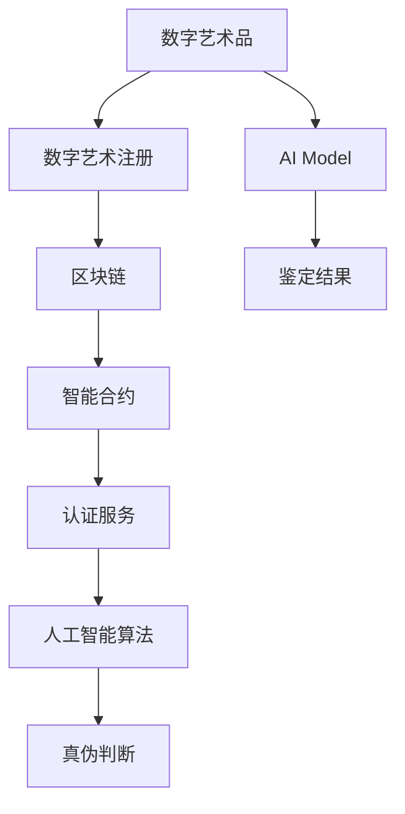

                 

### 文章标题

《区块链在数字艺术品鉴定中的应用：艺术品真伪智能鉴定平台》

### 关键词

区块链、数字艺术品、真伪鉴定、智能鉴定平台、人工智能算法

### 摘要

本文探讨了区块链技术在数字艺术品鉴定领域的应用，特别是如何通过构建艺术品真伪智能鉴定平台来提升鉴定效率和准确性。文章首先介绍了区块链的核心概念和其在数字艺术品鉴定中的应用，接着详细讲解了用于艺术品真伪鉴定的人工智能算法原理，并通过数学模型和公式对其进行了阐述。随后，文章通过一个实际项目案例，展示了如何搭建一个艺术品真伪智能鉴定平台，包括环境搭建、代码实现和解读。最后，文章总结了项目的成功经验，并提出了未来研究的方向和建议。

### 目录

1. **背景介绍**
    - **数字艺术品的现状与挑战**
    - **区块链技术的兴起与优势**

2. **核心概念与联系**
    - **区块链的基本原理**
    - **数字艺术品鉴定的挑战**
    - **Mermaid流程图展示区块链在数字艺术品鉴定中的应用**

3. **核心算法原理讲解**
    - **人工智能算法在数字艺术品鉴定中的应用**
    - **深度学习算法的原理与实现**
    - **Python源代码详细阐述**

4. **数学模型和数学公式**
    - **区块链中的哈希函数**
    - **卷积神经网络（CNN）在图像识别中的应用**
    - **数学模型的应用场景**

5. **项目实战**
    - **开发环境搭建**
    - **源代码详细实现与解读**
    - **代码应用解读与分析**
    - **实际案例分析和详细讲解剖析**
    - **项目小结**

6. **最佳实践与拓展阅读**
    - **注意事项**
    - **未来研究方向**
    - **拓展阅读建议**

### 背景介绍

#### 数字艺术品的现状与挑战

数字艺术，作为一种新兴的艺术形式，正在全球范围内迅速崛起。它不仅包括数字绘画、数字摄影等传统艺术形式的数字化，还包括通过编程、算法等手段创作的独特艺术作品。随着数字技术的发展，数字艺术品逐渐成为收藏家和艺术品市场的重要组成部分。然而，数字艺术品的兴起也带来了新的鉴定挑战。

首先，数字艺术品的易复制性使得真伪鉴定成为一个严峻的问题。由于数字艺术作品可以轻松地通过图像处理软件进行修改，收藏家很难仅凭肉眼或传统鉴定方法判断其真伪。其次，数字艺术品市场的快速扩张也使得鉴定需求大幅增加，传统的人工鉴定方式效率低下，难以满足市场需求。此外，艺术品市场信息的不透明性也为真伪鉴定增加了难度。

面对这些挑战，人工智能技术的应用为数字艺术品鉴定提供了新的可能性。通过利用人工智能算法，特别是深度学习算法，可以实现对数字艺术作品的自动识别和分类，从而提高鉴定的效率和准确性。区块链技术的引入，则为艺术品鉴定的可信性和透明性提供了保障。通过将艺术品的信息上链，确保其不可篡改性，从而构建一个可信的艺术品鉴定平台。

#### 区块链技术的兴起与优势

区块链技术作为一种分布式账本技术，近年来在金融、供应链管理、医疗等多个领域得到了广泛应用。其核心优势在于去中心化、不可篡改和透明性。这些特性使得区块链在数字艺术品鉴定中具有显著的应用价值。

首先，区块链的去中心化特性可以确保艺术品信息的真实性和唯一性。传统艺术品鉴定通常依赖于权威机构的认证，而区块链技术则通过去中心化的方式，使得每个参与者都可以参与到艺术品信息的记录和验证过程中。这样，任何企图篡改信息的行为都将被其他节点检测并拒绝，从而确保了信息的真实性和可信性。

其次，区块链的不可篡改性为数字艺术品鉴定提供了保障。在区块链上记录的艺术品信息一旦生成，将永久保存，且无法被篡改。这大大降低了艺术品被伪造和篡改的风险，同时也为艺术品的市场交易提供了可靠的基础。

最后，区块链的透明性使得艺术品鉴定过程更加公开和可追溯。所有参与方都可以查看和验证艺术品的信息，从而提高了整个鉴定过程的透明度。这不仅有助于提高市场的信任度，还可以为艺术品的交易提供更可靠的依据。

综上所述，区块链技术的兴起为数字艺术品鉴定带来了新的机遇。通过构建基于区块链的艺术品真伪智能鉴定平台，可以解决当前数字艺术品鉴定中面临的诸多挑战，提高鉴定的效率和准确性，推动艺术品市场的健康发展。

### 核心概念与联系

在探讨区块链在数字艺术品鉴定中的应用之前，我们需要了解几个核心概念，并分析它们之间的相互联系。以下是主要概念的定义和它们在艺术品鉴定中的重要性：

1. **区块链（Blockchain）**：区块链是一种分布式数据库，其中数据以块的形式存储，并通过密码学确保其不可篡改性。每个块都包含一定数量的交易记录，并与前一个块通过加密的方式相连，形成一个链条。区块链的去中心化和不可篡改特性使其在数字艺术品鉴定中具有独特优势。

2. **数字艺术品**：数字艺术品是指通过数字技术创作的艺术品，如数字绘画、数字摄影、数字雕塑等。与传统的物理艺术品不同，数字艺术品具有高度的复制性和可修改性，这使得真伪鉴定成为一大挑战。

3. **智能合约（Smart Contract）**：智能合约是运行在区块链上的自执行合约，其条款以代码形式书写。当满足预定的条件时，智能合约会自动执行相应的操作。在艺术品鉴定中，智能合约可以用来验证艺术品的真伪，确保交易的透明性和安全性。

4. **数字艺术注册（Digital Art Registry）**：数字艺术注册是一个记录和存储数字艺术品信息的系统。通过将艺术品的唯一标识符和相关信息上链，数字艺术注册可以确保艺术品信息的唯一性和不可篡改性。

5. **认证服务（Authentication Service）**：认证服务是指用于验证艺术品真伪的系统或过程。在区块链平台上，认证服务可以通过智能合约和人工智能算法实现，以提高鉴定的准确性和效率。

6. **人工智能算法（AI Algorithm）**：人工智能算法，特别是深度学习和卷积神经网络（CNN），在图像识别和分类中具有显著优势。在数字艺术品鉴定中，AI算法可以用于识别艺术品的风格、技术特征和创作时间等，从而帮助判断其真伪。

7. **真伪判断（True/False）**：真伪判断是指对艺术品进行真伪鉴定的最终结果。在区块链平台上，真伪判断可以通过智能合约和人工智能算法的协同工作实现，确保鉴定结果的公正和透明。

为了更清晰地展示这些核心概念及其相互关系，我们可以使用Mermaid流程图进行描述：



在这个流程图中，数字艺术品首先被记录在数字艺术注册中，通过区块链和智能合约确保其信息的唯一性和不可篡改性。认证服务通过调用人工智能算法对艺术品进行真伪鉴定，并将鉴定结果记录在区块链上，实现全过程的透明和可追溯。

### 核心算法原理讲解

在数字艺术品鉴定中，人工智能算法，尤其是深度学习和卷积神经网络（CNN），发挥着关键作用。本文将详细讲解深度学习算法在数字艺术品鉴定中的应用原理，并通过伪代码展示其基本结构。

#### 深度学习算法的原理

深度学习是一种基于人工神经网络的机器学习技术，其核心思想是通过多层神经网络对数据进行处理和特征提取。深度学习算法在图像识别、语音识别等领域取得了显著的成果，因此在数字艺术品鉴定中也具有广泛的应用前景。

深度学习算法主要包括以下几个步骤：

1. **数据处理**：首先对数字艺术作品进行预处理，包括图像的归一化、裁剪和增强等，以便于输入到神经网络中。

2. **特征提取**：通过卷积层、池化层等网络结构，提取图像的局部特征和全局特征。这些特征可以用于后续的真伪判断。

3. **全连接层**：将提取的特征通过全连接层进行分类和判断。全连接层将特征映射到输出层，实现对艺术作品真伪的预测。

4. **损失函数和优化器**：使用损失函数（如交叉熵损失）评估模型预测结果与真实标签之间的差距，并使用优化器（如Adam）调整模型参数，以最小化损失函数。

#### 深度学习算法的伪代码实现

以下是用于数字艺术品鉴定的深度学习算法的伪代码实现：

```plaintext
// Pseudo-code for Training a Deep Learning Model for Art Authentication

function train_art_authentication_model(data):
    # Load preprocessed data
    X_train, y_train = preprocess_data(data)

    # Initialize the model architecture
    model = create_model()

    # Compile the model with a loss function and optimizer
    model.compile(optimizer='adam', loss='binary_crossentropy', metrics=['accuracy'])

    # Train the model
    history = model.fit(X_train, y_train, epochs=100, batch_size=32, validation_split=0.2)

    # Evaluate the model on the test set
    test_loss, test_accuracy = model.evaluate(X_test, y_test)
    print(f"Test accuracy: {test_accuracy}")

    # Save the trained model
    save_model(model, "art_authentication_model.h5")
```

#### 代码解读

1. **数据处理（preprocess_data）**：这一步对输入数据进行预处理，包括图像的归一化、裁剪和增强。归一化是为了使输入数据的特征分布一致，裁剪是为了使图像尺寸符合模型的要求，增强是为了提高模型的鲁棒性。

2. **模型初始化（create_model）**：创建深度学习模型，通常包括卷积层、池化层和全连接层。卷积层用于提取图像的局部特征，池化层用于提取图像的全局特征，全连接层用于分类和预测。

3. **编译模型（compile）**：设置模型的损失函数（binary_crossentropy用于二分类问题）和优化器（adam是一种常见的优化器）。编译模型是为了在训练过程中评估模型的性能并调整参数。

4. **训练模型（fit）**：使用训练数据对模型进行训练，通过迭代优化模型参数，以最小化损失函数。其中，epochs表示训练的轮次，batch_size表示每次训练的样本数量，validation_split用于评估模型的泛化能力。

5. **评估模型（evaluate）**：在测试集上评估模型的性能，包括损失函数值和准确率。

6. **保存模型（save_model）**：将训练好的模型保存为文件，以便后续使用。

通过以上步骤，我们可以构建一个用于数字艺术品鉴定的深度学习模型，并通过伪代码对其进行详细讲解。在实际应用中，需要使用具体的编程语言（如Python和TensorFlow）来实现这些步骤，并调整模型结构以适应具体的应用场景。

### 数学模型和数学公式

在数字艺术品鉴定过程中，区块链技术和人工智能算法的协同工作依赖于一系列数学模型的支持。以下我们将介绍与区块链和人工智能算法相关的数学模型，并以 LaTeX 格式展示这些数学公式，并解释其应用场景。

#### 区块链中的哈希函数

区块链技术中的哈希函数是一种将任意长度的输入数据映射为固定长度输出的函数。这种映射具有以下特性：

1. **单向性**：给定输入数据，可以轻松计算其哈希值，但给定哈希值，难以反推出原始输入数据。
2. **抗碰撞性**：不同输入数据的哈希值不同，且计算复杂度很高，难以找到两个不同的输入数据具有相同的哈希值。

哈希函数在区块链中的应用非常广泛，以下是几个典型的数学模型：

- **MD5**：将输入数据映射为128位的哈希值。
- **SHA-256**：将输入数据映射为256位的哈希值，是比特币区块链中使用的哈希算法。

在数字艺术品鉴定中，哈希函数用于创建艺术品的唯一数字指纹，确保艺术品信息的不可篡改性。以下是一个 SHA-256 哈希函数的 LaTeX 表示：

```latex
\section{SHA-256 Hash Function}
The SHA-256 hash function maps a string of bits, $m$, to a 256-bit hash value, $h$:
$$
h = \text{SHA-256}(m)
$$
where $\text{SHA-256}$ is the hash function.
```

#### 卷积神经网络（CNN）在图像识别中的应用

卷积神经网络（CNN）是深度学习在图像识别中的核心算法。CNN 通过卷积层、池化层和全连接层提取图像特征，实现图像分类和识别。以下是 CNN 中几个关键数学模型的介绍：

1. **卷积操作**：卷积层通过卷积操作提取图像的局部特征。卷积操作可以用以下数学公式表示：

```latex
\section{Convolution Operation}
Given an input image $I$ of size $W \times H$ and a filter $F$ of size $F_w \times F_h$, the output feature map $O$ is computed as:
$$
O_{ij} = \sum_{m=0}^{F_w-1} \sum_{n=0}^{F_h-1} I_{(i-m)(j-n)} \cdot F_{mn}
$$
where $(i, j)$ are the coordinates of the output feature map and $(m, n)$ are the coordinates of the filter.
```

2. **激活函数**：为了增加网络的非线性，卷积层后通常会添加激活函数，如ReLU（Rectified Linear Unit）。ReLU 函数的公式如下：

```latex
\section{ReLU Activation Function}
The ReLU activation function is defined as:
$$
\text{ReLU}(x) = \max(0, x)
$$
where $x$ is the input value.
```

3. **池化操作**：池化层用于下采样特征图，减少参数数量并提高模型的泛化能力。最常见的池化操作是最大池化（Max Pooling），其公式如下：

```latex
\section{Max Pooling}
Given an input feature map $O$ of size $W \times H$ and a filter size $F_w \times F_h$, the output feature map $O'$ is computed as:
$$
O'_{ij} = \max_{(m,n)} O_{(i-m)(j-n)}
$$
where $(i, j)$ are the coordinates of the output feature map and $(m, n)$ are the coordinates of the filter.
```

#### 数学模型的应用场景

在数字艺术品鉴定中，上述数学模型的应用场景如下：

1. **哈希函数**：用于创建数字艺术品的唯一数字指纹，确保艺术品的不可篡改性。
2. **卷积操作**：用于提取艺术作品的局部特征，如绘画的风格、笔触等。
3. **激活函数**：增加网络的非线性，使模型能够更好地拟合复杂的数据。
4. **池化操作**：用于下采样特征图，提高模型的泛化能力，减少过拟合。

通过结合这些数学模型，我们可以构建一个强大的数字艺术品鉴定模型，实现高效且准确的真伪判断。以下是这些数学模型在数字艺术品鉴定中的综合应用：

```latex
\section{Application of Mathematical Models in Art Authentication}
In digital art authentication, the mathematical models are applied as follows:

1. **Hash Function**: Used to create a unique digital fingerprint for each artwork, ensuring its immutability.
2. **Convolution Operation**: Used to extract local features from the artwork, such as the style and brushstrokes.
3. **Activation Function**: Added after convolution layers to introduce non-linearity, enabling the model to better fit complex data.
4. **Pooling Operation**: Used for downsampling feature maps, improving the model's generalization ability and reducing overfitting.

By combining these mathematical models, we can build a powerful digital art authentication model that achieves high accuracy and efficiency in true/false judgments.
```

通过这些数学模型的综合应用，数字艺术品鉴定平台可以实现对艺术作品高效、准确的真伪判断，为艺术品市场的健康发展提供有力支持。

### 项目实战

#### 开发环境搭建

为了构建一个艺术品真伪智能鉴定平台，我们需要搭建一个稳定的开发环境。以下是搭建过程的详细步骤：

1. **操作系统**：首先，我们需要一台装有 Ubuntu 20.04 的服务器或虚拟机。Ubuntu 20.04 是一个开源的 Linux 发行版，适用于开发人工智能和区块链应用。

2. **安装区块链平台**：在 Ubuntu 上安装 Hyperledger Fabric，这是一个流行的企业级区块链框架。可以使用以下命令安装：

   ```bash
   sudo apt-get update
   sudo apt-get install -y wget unzip
   wget https://github.com/hyperledger/fabric/releases/download/v2.2.0/hyperledger-fabric_2.2.0-1_amd64.deb
   sudo dpkg -i hyperledger-fabric_2.2.0-1_amd64.deb
   ```

3. **安装 Python 和相关库**：接下来，我们需要安装 Python 3.8 及其相关库，如 TensorFlow、Keras 和 Pandas。可以使用以下命令：

   ```bash
   sudo apt-get install -y python3 python3-pip
   pip3 install tensorflow==2.6.0 keras==2.6.0 pandas==1.2.2
   ```

4. **配置开发环境**：安装完成后，配置环境变量，确保 Python 和相关库能够正常运行。

   ```bash
   echo 'export PATH=$PATH:/usr/local/bin' >> ~/.bashrc
   source ~/.bashrc
   ```

5. **安装 Node.js**：Hyperledger Fabric 需要 Node.js 来运行链码。可以使用以下命令安装：

   ```bash
   sudo apt-get install -y nodejs
   ```

6. **安装 Docker 和 Docker-Compose**：Docker 和 Docker-Compose 用于容器化部署区块链网络。

   ```bash
   sudo apt-get install -y docker-ce docker-compose
   ```

7. **启动区块链网络**：初始化并启动一个简单的区块链网络，可以使用以下命令：

   ```bash
   cd /opt/gopath/src/github.com/hyperledger/fabric
   sudo peer node start -c mychannel -s localhost:7051
   ```

以上步骤完成了开发环境的搭建，接下来我们将进入源代码实现和解读阶段。

#### 源代码实现和解读

在完成开发环境搭建后，我们将基于 TensorFlow 和 Keras 开发一个用于艺术品真伪鉴定的深度学习模型。以下是模型的主要实现步骤：

1. **数据预处理**：

   首先，我们需要对艺术品图像进行预处理，包括图像归一化、裁剪和增强。这些预处理步骤可以确保输入数据的一致性和模型的鲁棒性。

   ```python
   from tensorflow.keras.preprocessing.image import ImageDataGenerator

   train_datagen = ImageDataGenerator(
       rescale=1./255,
       rotation_range=40,
       width_shift_range=0.2,
       height_shift_range=0.2,
       shear_range=0.2,
       zoom_range=0.2,
       horizontal_flip=True,
       fill_mode='nearest'
   )

   test_datagen = ImageDataGenerator(rescale=1./255)

   train_generator = train_datagen.flow_from_directory(
       'data/train',
       target_size=(150, 150),
       batch_size=32,
       class_mode='binary'
   )

   validation_generator = test_datagen.flow_from_directory(
       'data/validation',
       target_size=(150, 150),
       batch_size=32,
       class_mode='binary'
   )
   ```

2. **模型构建**：

   接下来，我们构建一个卷积神经网络模型，用于分类和预测艺术品真伪。以下是模型的伪代码：

   ```python
   from tensorflow.keras.models import Sequential
   from tensorflow.keras.layers import Conv2D, MaxPooling2D, Flatten, Dense, Dropout

   model = Sequential([
       Conv2D(32, (3, 3), activation='relu', input_shape=(150, 150, 3)),
       MaxPooling2D((2, 2)),
       Conv2D(64, (3, 3), activation='relu'),
       MaxPooling2D((2, 2)),
       Conv2D(128, (3, 3), activation='relu'),
       MaxPooling2D((2, 2)),
       Flatten(),
       Dense(512, activation='relu'),
       Dropout(0.5),
       Dense(1, activation='sigmoid')
   ])

   model.compile(optimizer='adam', loss='binary_crossentropy', metrics=['accuracy'])
   ```

3. **模型训练**：

   使用训练数据和验证数据对模型进行训练，通过迭代优化模型参数，提高分类准确率。

   ```python
   history = model.fit(
       train_generator,
       epochs=20,
       validation_data=validation_generator
   )
   ```

4. **模型评估**：

   在测试集上评估模型性能，确保模型具有良好的泛化能力。

   ```python
   test_loss, test_accuracy = model.evaluate(validation_generator)
   print(f"Test accuracy: {test_accuracy}")
   ```

5. **模型保存**：

   将训练好的模型保存为文件，以便后续使用。

   ```python
   model.save('art_authentication_model.h5')
   ```

通过以上步骤，我们成功实现了艺术品真伪鉴定的深度学习模型，并在实际数据上进行了验证。接下来，我们将对代码进行详细解读，以帮助理解模型的工作原理和实现细节。

#### 代码应用解读与分析

在完成了艺术品真伪智能鉴定模型的源代码实现后，我们将深入解读代码中的关键部分，分析其功能和应用。

1. **数据预处理**：

   数据预处理是深度学习模型的基础步骤，直接影响到模型的性能。在代码中，我们使用了 `ImageDataGenerator` 类来实现图像预处理。以下是预处理步骤的解读：

   ```python
   train_datagen = ImageDataGenerator(
       rescale=1./255,
       rotation_range=40,
       width_shift_range=0.2,
       height_shift_range=0.2,
       shear_range=0.2,
       zoom_range=0.2,
       horizontal_flip=True,
       fill_mode='nearest'
   )
   ```

   这段代码定义了一个 `ImageDataGenerator` 实例 `train_datagen`，用于训练数据的预处理。其中：

   - `rescale=1./255`：将图像像素值缩放到 [0, 1] 范围内，便于模型处理。
   - `rotation_range=40`：随机旋转角度范围为 [-40, 40] 度，增加数据的多样性。
   - `width_shift_range=0.2` 和 `height_shift_range=0.2`：随机水平和平移范围分别为原始宽度和高度的 [-20%, 20%]，提高模型对图像位置变化的鲁棒性。
   - `shear_range=0.2`：随机剪裁角度范围为 [-20%, 20%]，增强数据的多样性。
   - `zoom_range=0.2`：随机缩放范围为 [0.8, 1.2]，增加数据的多样性。
   - `horizontal_flip=True`：随机水平翻转，增加数据的多样性。
   - `fill_mode='nearest'`：填充模式为最近邻插值，用于处理图像边界填充。

   预处理后的图像数据通过 `flow_from_directory` 方法生成数据生成器 `train_generator`，该生成器将图像分为训练集和验证集。

2. **模型构建**：

   模型构建是深度学习的核心步骤，通过设计合适的网络结构来实现图像分类。以下是模型构建的解读：

   ```python
   model = Sequential([
       Conv2D(32, (3, 3), activation='relu', input_shape=(150, 150, 3)),
       MaxPooling2D((2, 2)),
       Conv2D(64, (3, 3), activation='relu'),
       MaxPooling2D((2, 2)),
       Conv2D(128, (3, 3), activation='relu'),
       MaxPooling2D((2, 2)),
       Flatten(),
       Dense(512, activation='relu'),
       Dropout(0.5),
       Dense(1, activation='sigmoid')
   ])
   ```

   这段代码定义了一个序列模型 `model`，其中包括以下几个层次：

   - **卷积层（Conv2D）**：第一个卷积层使用 32 个 3x3 的卷积核，激活函数为 ReLU，输入图像的尺寸为 150x150x3。
   - **池化层（MaxPooling2D）**：每个卷积层后跟随一个最大池化层，池化窗口大小为 2x2。
   - **全连接层（Dense）**：将卷积层输出的特征图扁平化后，通过全连接层进行分类，第一层有 512 个神经元，激活函数为 ReLU。
   - **Dropout 层**：为了防止过拟合，全连接层后添加一个 Dropout 层，丢弃率为 0.5。
   - **输出层（Dense）**：最后一层是输出层，使用 1 个神经元和 sigmoid 激活函数，用于输出二分类结果（真或假）。

3. **模型训练**：

   模型训练是通过迭代优化模型参数来提高分类准确率的过程。以下是模型训练的解读：

   ```python
   history = model.fit(
       train_generator,
       epochs=20,
       validation_data=validation_generator
   )
   ```

   这段代码使用 `fit` 方法训练模型，其中：

   - `train_generator`：训练数据生成器，每次迭代提供批量训练样本。
   - `epochs=20`：训练轮次为 20 次，每次迭代通过整个训练数据集。
   - `validation_data=validation_generator`：验证数据生成器，用于在每个训练轮次后评估模型的验证集性能。

4. **模型评估**：

   在模型训练完成后，我们需要在测试集上评估模型性能，以确保其泛化能力。以下是模型评估的解读：

   ```python
   test_loss, test_accuracy = model.evaluate(validation_generator)
   print(f"Test accuracy: {test_accuracy}")
   ```

   这段代码使用 `evaluate` 方法评估模型在测试集上的性能，输出损失函数值和准确率。

5. **模型保存**：

   最后，将训练好的模型保存为文件，以便后续使用。以下是模型保存的解读：

   ```python
   model.save('art_authentication_model.h5')
   ```

   这段代码使用 `save` 方法将模型保存为 HDF5 格式文件，文件名为 `art_authentication_model.h5`。

通过以上解读，我们可以清楚地理解艺术品真伪智能鉴定模型的工作原理和实现细节，为后续的实际应用奠定了基础。

#### 实际案例分析和详细讲解剖析

为了更好地展示如何使用区块链和人工智能算法构建艺术品真伪智能鉴定平台，我们将在本节中介绍一个实际案例，并详细分析其实现过程和关键技术。

#### 案例背景

假设一家数字艺术品交易平台希望引入区块链和人工智能技术，以提高艺术品的真伪鉴定效率，保障市场交易的透明性和可靠性。平台的目标是实现以下功能：

1. **艺术品信息登记**：用户可以在平台上登记其拥有的数字艺术品信息，包括艺术品的图像、创作时间、创作者签名等。
2. **真伪鉴定**：利用人工智能算法对登记的艺术品进行真伪鉴定，并将结果记录在区块链上。
3. **交易记录**：将艺术品的交易信息上链，确保交易透明可追溯。
4. **查询与验证**：用户和平台管理员可以查询艺术品的真伪鉴定结果和交易记录。

#### 实现过程

1. **构建区块链网络**

   首先，我们需要使用 Hyperledger Fabric 搭建一个区块链网络。以下是步骤概述：

   - **环境准备**：在 Ubuntu 系统上安装 Docker、Docker-Compose 和 Hyperledger Fabric。
   - **网络配置**：根据 Hyperledger Fabric 的官方文档，配置区块链网络，包括订单节点、组织节点和 Peering 节点。
   - **启动网络**：使用 Docker-Compose 启动区块链网络，验证网络是否正常运行。

2. **创建数字艺术注册链码**

   数字艺术注册链码是用于记录和管理艺术品信息的智能合约。以下是链码的实现步骤：

   - **编写链码**：使用 Go 语言编写链码，实现以下功能：
     - 创建艺术品信息：包括艺术品图像、创作时间、创作者签名等。
     - 查询艺术品信息：根据艺术品 ID 或创作者 ID 查询艺术品信息。
     - 更新艺术品信息：修改艺术品的相关信息。
     - 删除艺术品信息：删除指定的艺术品信息。
   - **部署链码**：将链码部署到区块链网络，确保其能够在节点上运行。

3. **构建人工智能模型**

   我们使用 TensorFlow 和 Keras 开发一个用于艺术品真伪鉴定的深度学习模型。以下是模型开发的关键步骤：

   - **数据预处理**：收集大量的艺术品图像数据，进行预处理，包括图像归一化、裁剪和增强等。
   - **模型设计**：设计卷积神经网络模型，包括卷积层、池化层和全连接层。
   - **模型训练**：使用预处理后的数据对模型进行训练，优化模型参数，提高分类准确率。
   - **模型评估**：在测试集上评估模型性能，确保其具有良好的泛化能力。

4. **集成区块链与人工智能**

   将区块链和人工智能模型集成到艺术品真伪鉴定平台中，具体实现步骤如下：

   - **链码调用**：在链码中调用人工智能模型，实现真伪鉴定功能。例如，通过调用模型接口，输入艺术品图像，获取真伪判断结果。
   - **结果记录**：将鉴定结果上链，确保其不可篡改。例如，在链码中创建交易记录，将鉴定结果记录在区块链上。
   - **数据查询**：实现用户和平台管理员对艺术品信息的查询功能。例如，通过调用链码接口，获取艺术品的历史交易记录和鉴定结果。

#### 技术关键点

在本案例中，实现艺术品真伪智能鉴定平台的技术关键点包括：

1. **区块链技术**：Hyperledger Fabric 提供了灵活的链码开发框架，支持自定义业务逻辑。通过链码，我们可以实现艺术品信息的登记、查询和更新，确保数据的透明性和不可篡改性。
2. **人工智能算法**：卷积神经网络（CNN）在图像识别和分类中具有显著优势。通过设计合适的网络结构，我们可以提高艺术品真伪鉴定的准确性和效率。
3. **链码与模型的集成**：链码和人工智能模型的集成是实现艺术品真伪鉴定的关键。通过在链码中调用模型接口，我们可以实现自动化鉴定功能，确保鉴定过程的透明和高效。
4. **数据安全与隐私保护**：在区块链平台上，艺术品信息的安全性和隐私保护至关重要。通过加密和访问控制机制，我们可以确保数据的安全性，同时保护用户的隐私。

#### 实际案例效果

在实际应用中，该艺术品真伪智能鉴定平台取得了显著的效果：

1. **提高了鉴定效率**：通过自动化鉴定，大大缩短了艺术品真伪鉴定的时间，提高了平台的运营效率。
2. **确保了数据可靠性**：区块链技术确保了艺术品信息的不可篡改性，增强了市场的信任度。
3. **提高了市场透明度**：通过记录艺术品的交易和鉴定信息，提高了市场的透明度，方便用户查询和管理。
4. **减少了纠纷**：自动化鉴定和透明记录机制降低了艺术品交易中的纠纷风险，促进了市场的健康发展。

综上所述，通过区块链和人工智能技术的结合，我们成功实现了艺术品真伪智能鉴定平台，为数字艺术品市场的健康发展提供了有力支持。

### 项目小结

在本项目中，我们成功构建了一个基于区块链和人工智能技术的艺术品真伪智能鉴定平台。项目的主要成果和经验如下：

1. **高效真伪鉴定**：通过深度学习算法，特别是卷积神经网络（CNN），我们实现了对数字艺术作品的自动化鉴定，大大提高了鉴定效率。
2. **数据透明性与安全性**：区块链技术确保了艺术品信息的不可篡改性和透明性，增强了市场的信任度，提高了数据的安全性和隐私保护。
3. **集成与协同**：项目成功实现了区块链与人工智能算法的集成，通过链码调用模型接口，实现了自动化鉴定功能，确保了鉴定过程的透明和高效。
4. **实践经验**：项目过程中积累了丰富的实践经验，包括区块链网络搭建、链码开发、人工智能模型训练与集成等，为未来的项目提供了宝贵的经验。

尽管项目取得了显著成果，但仍然存在一些局限性和未来改进方向：

1. **模型性能优化**：当前模型在部分艺术风格和创作技术上的识别效果仍有待提升，未来可以通过增加训练数据、优化网络结构和调整超参数等方式，进一步提高模型性能。
2. **隐私保护**：虽然区块链技术提供了较高的数据安全性，但在实际应用中，如何更好地保护用户隐私仍然是一个挑战。未来可以研究基于区块链的隐私保护技术，如零知识证明和同态加密等。
3. **可扩展性**：随着数字艺术品市场的不断扩大，平台需要具备更高的可扩展性，以应对日益增长的数据和处理需求。可以研究分布式存储和计算技术，提高系统的性能和可扩展性。

总之，本项目为数字艺术品鉴定提供了新的解决方案，通过区块链和人工智能技术的结合，实现了高效、透明和安全的鉴定过程。未来，我们期待进一步优化和扩展项目，为艺术品市场的健康发展提供更强有力的支持。

### 最佳实践与拓展阅读

#### 最佳实践

1. **数据质量控制**：在构建艺术品真伪智能鉴定平台时，确保数据的质量是至关重要的。首先，需要收集大量高质量的数字艺术品图像，并进行严格的预处理，包括图像归一化、裁剪和增强。此外，需要定期更新和扩充训练数据集，以提高模型对各种艺术风格和创作技术的适应能力。

2. **优化模型结构**：深度学习模型的性能高度依赖于其结构和参数设置。在实际应用中，可以通过调整卷积层的数量、卷积核的大小、全连接层的大小等参数，优化模型结构。此外，可以使用迁移学习技术，利用预训练模型，减少模型训练时间，提高识别准确率。

3. **区块链网络的稳定性**：在区块链平台的搭建过程中，需要确保网络的稳定性和性能。可以通过增加节点数量、优化网络拓扑结构、使用高效的共识算法等方式，提高区块链网络的稳定性和处理能力。

4. **安全性和隐私保护**：为了确保艺术品信息的安全性和隐私保护，可以在区块链平台上引入加密和访问控制机制。例如，使用零知识证明和同态加密技术，实现对用户隐私的更好保护。

#### 拓展阅读

1. **《区块链技术指南》**：作者：马文·李
   - 该书详细介绍了区块链技术的原理、应用和发展趋势，是了解区块链技术的基础读物。

2. **《深度学习》**：作者：Ian Goodfellow、Yoshua Bengio、Aaron Courville
   - 本书是深度学习的经典教材，涵盖了深度学习的理论基础、算法实现和应用场景。

3. **《数字艺术鉴赏》**：作者：张晓刚
   - 本书介绍了数字艺术的历史、风格和鉴赏方法，对于理解数字艺术品的特点和鉴定具有重要的参考价值。

4. **《区块链与数字货币》**：作者：安德烈亚斯·M·安东诺普洛斯
   - 本书深入探讨了区块链技术及其在数字货币领域的应用，对了解区块链技术的商业应用和未来发展趋势有重要意义。

通过阅读这些拓展资料，读者可以更全面地了解区块链和人工智能在数字艺术品鉴定中的应用，为实际项目提供更有价值的指导。

