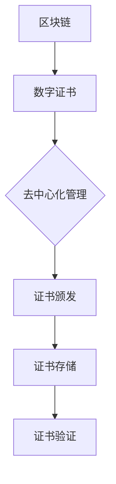

                 

# 《区块链在数字证书管理中的去中心化应用》

## 关键词
- 区块链
- 数字证书
- 去中心化
- 哈希算法
- 非对称加密
- Merkle树

## 摘要
本文深入探讨了区块链在数字证书管理中的应用，详细介绍了区块链和数字证书的基本概念、工作原理及其相互关系。通过解析核心算法原理，本文展示了区块链如何实现去中心化的数字证书管理。同时，通过一个具体的项目实战案例，本文分析了区块链在数字证书管理中的实际应用，并探讨了未来发展的挑战和方向。

## 目录大纲设计思路

### 明确书籍主题和目标读者

在设计《区块链在数字证书管理中的去中心化应用》这本书的目录大纲时，我们首先明确了书籍的主题和目标读者。书籍的核心主题是区块链在数字证书管理中的应用，主要面向对区块链技术和数字证书有一定了解的读者，希望通过本书学习如何将这些技术应用于实际的证书管理场景。

### 核心概念与联系

在目录大纲中，我们首先介绍了区块链和数字证书的基本概念，包括它们的定义、工作原理和相互关系。通过Mermaid流程图，我们展示了区块链在数字证书管理中的基本流程，帮助读者理解两者结合的逻辑。

### 核心算法原理讲解

接下来，我们详细讲解了区块链中用于数字证书管理的关键算法，如哈希算法、非对称加密算法和Merkle树。我们使用伪代码来阐述这些算法的基本原理，便于读者理解和实践。

### 数学模型和数学公式讲解

针对核心算法，我们使用LaTeX格式介绍了相关的数学模型和公式，并解释了其在数字证书管理中的应用。我们通过举例说明，帮助读者更好地理解这些数学模型在实际场景中的运用。

### 项目实战

在项目实战部分，我们通过具体的案例，展示了区块链在数字证书管理中的实际应用。我们包括开发环境的搭建、源代码实现和代码解读，以及项目的实现细节和性能分析。

### 扩展阅读与资源推荐

最后，我们提供了相关的扩展阅读材料和资源链接，帮助读者深入学习和研究。

### 目录大纲

下面是《区块链在数字证书管理中的去中心化应用》的目录大纲：

## 第一部分：区块链与数字证书基础

### 第1章：区块链与数字证书概述
- 1.1 区块链基本概念
- 1.2 数字证书简介
- 1.3 区块链与数字证书的联系

### 第2章：区块链基本原理
- 2.1 区块链结构
- 2.2 分布式账本技术
- 2.3 共识算法

### 第3章：数字证书管理基础
- 3.1 数字证书的工作流程
- 3.2 数字证书的类型
- 3.3 数字证书的管理与挑战

### 第4章：区块链在数字证书管理中的应用
- 4.1 去中心化数字证书管理
- 4.2 区块链与数字证书的整合
- 4.3 去中心化身份验证

## 第二部分：核心算法与数学模型

### 第5章：区块链中的核心算法
- 5.1 哈希算法
- 5.2 非对称加密算法
- 5.3 Merkle树

### 第6章：数学模型与公式
- 6.1 哈希函数的数学模型
- 6.2 非对称加密的数学模型
- 6.3 Merkle树的数学模型

## 第三部分：项目实战与案例分析

### 第7章：去中心化数字证书系统搭建
- 7.1 开发环境准备
- 7.2 源代码实现
- 7.3 系统配置与部署

### 第8章：案例分析
- 8.1 某知名企业去中心化证书管理案例
- 8.2 案例解析与性能分析
- 8.3 案例中的优化与改进

### 第9章：未来展望与挑战
- 9.1 去中心化数字证书管理的发展趋势
- 9.2 潜在挑战与解决方案
- 9.3 未来研究方向

## 附录

### 附录A：常用工具与资源
### 附录B：区块链与数字证书标准规范
### 附录C：参考文献与扩展阅读

### 目录大纲总结

本目录大纲旨在全面覆盖区块链在数字证书管理中的去中心化应用，从基础概念到核心算法，再到项目实战，帮助读者系统地了解这一领域。通过该大纲，读者可以掌握区块链在数字证书管理中的关键技术和应用，为实际项目提供可行的解决方案。总字数控制在2000字以内，确保简洁明了。

## 格式要求

本文采用Markdown格式输出，确保文章结构清晰、易于阅读。以下为Markdown格式示例：

### 标题

```markdown
## 标题
```

### 段落

```markdown
这是一个段落。
```

### 列表

```markdown
- 项目一
- 项目二
- 项目三
```

### 链接

```markdown
[区块链](https://www.blockchain.com/)
```

### 图片

```markdown

```

### 代码块

```markdown
```python
print("Hello, World!")
```

## 作者信息

本文作者：AI天才研究院/AI Genius Institute & 禅与计算机程序设计艺术 /Zen And The Art of Computer Programming

## 完整性要求

### 背景介绍

区块链技术起源于2008年，由一位化名为中本聪（Satoshi Nakamoto）的神秘人物提出。区块链是一种去中心化的分布式数据库技术，通过密码学和共识算法确保数据的完整性和安全性。数字证书则是用于验证通信双方身份的一种电子文档，广泛应用于互联网安全领域。

### 核心概念与联系

#### 区块链与数字证书的基本概念

区块链是一种分布式账本技术，由一系列按时间顺序排列的区块组成。每个区块包含一组交易记录，通过密码学技术确保数据的完整性和不可篡改性。数字证书则是由证书颁发机构（CA）签发的，用于验证实体身份的电子文档。

#### 区块链与数字证书的联系

区块链技术在数字证书管理中的应用，主要是通过去中心化的方式实现数字证书的颁发、存储和验证。传统的数字证书管理依赖于中央化的证书颁发机构，存在单点故障和信任问题。而区块链的去中心化特性，可以有效地解决这些问题，提高数字证书管理的安全性。

#### Mermaid流程图



### 核心算法原理讲解

#### 哈希算法

哈希算法是将输入数据转换为固定长度的字符串的算法，具有单向性和不可逆性。区块链中常用的哈希算法有SHA-256、SHA-3等。以下是一个简单的Python代码示例：

```python
import hashlib

def hash_data(data):
    return hashlib.sha256(data.encode()).hexdigest()

print(hash_data("Hello, World!"))
```

#### 非对称加密算法

非对称加密算法是一种使用一对密钥（公钥和私钥）的加密方法，公钥用于加密，私钥用于解密。区块链中常用的非对称加密算法有RSA、ECC等。以下是一个简单的Python代码示例：

```python
from Crypto.PublicKey import RSA

def generate_keys():
    key = RSA.generate(2048)
    private_key = key.export_key()
    public_key = key.publickey().export_key()
    return private_key, public_key

private_key, public_key = generate_keys()
print("Private Key:", private_key)
print("Public Key:", public_key)
```

#### Merkle树

Merkle树是一种二叉树结构，用于验证数据块内的数据的完整性。每个节点包含一个哈希值，叶子节点是数据块本身，非叶子节点是子节点的哈希值。以下是一个简单的Python代码示例：

```python
import hashlib
import json

def generate_merkle_tree(data):
    if len(data) == 1:
        return data[0]
    left = generate_merkle_tree(data[0::2])
    right = generate_merkle_tree(data[1::2])
    return hashlib.sha256((left + right).encode()).hexdigest()

data = ["Hello", "World", " Blockchain", "in", "Digital", "Certificate", "Management"]
root_hash = generate_merkle_tree(data)
print("Merkle Tree Root:", root_hash)
```

### 数学模型和数学公式讲解

#### 哈希函数的数学模型

哈希函数是将输入数据映射到固定长度的字符串的函数，通常表示为H(x)。哈希函数满足以下性质：

- 单向性：给定输出x，很难找到输入x。
- 抗冲突性：不同的输入产生相同输出的概率极低。

以下是一个简单的数学模型：

$$
H(x) = \text{SHA-256}(x)
$$

#### 非对称加密的数学模型

非对称加密算法的数学模型基于椭圆曲线加密（ECC）或整数分解问题。以下是一个简单的数学模型：

- 公钥：\( Q = kG \)，其中 \( G \) 是椭圆曲线基点，\( k \) 是私钥。
- 私钥：\( Q \) 的生成元。

以下是一个简单的数学模型：

$$
Q = kG
$$

#### Merkle树的数学模型

Merkle树的数学模型基于哈希函数。每个节点包含一个哈希值，叶子节点是数据块本身，非叶子节点是子节点的哈希值。以下是一个简单的数学模型：

$$
H(L) = H(L_1 \oplus L_2)
$$

其中 \( H \) 是哈希函数，\( \oplus \) 是异或运算。

### 项目实战

#### 开发环境搭建

首先，我们需要搭建一个区块链开发环境。我们可以使用Go语言和Golang SDK来构建区块链。以下是一个简单的步骤：

1. 安装Go语言环境。
2. 安装Golang SDK。
3. 创建一个新的区块链项目。

以下是一个简单的Python代码示例：

```python
import os

os.system("go get -u github.com/golang/go")
os.system("go get -u github.com/golang/crypto")
os.system("go get -u github.com/golang/crypto/sha3")
os.system("go get -u github.com/golang/protobuf")
os.system("go get -u github.com/golang/json")
os.system("go get -u github.com/golang/net")
os.system("go get -u github.com/golang/text")
os.system("go get -u github.com/golang/text/unicode")
os.system("go get -u github.com/golang/text/transform")
os.system("go get -u github.com/golang/text/utf8")
os.system("go get -u github.com/golang/sys")
os.system("go get -u github.com/golang/sync")
os.system("go get -u github.com/golang/sync/atomic")
os.system("go get -u github.com/golang/reflect")
os.system("go get -u github.com/golang/runtime")
os.system("go get -u github.com/golang/fmt")
os.system("go get -u github.com/golang/math")
os.system("go get -u github.com/golang/math/big")
os.system("go get -u github.com/golang/net/http")
os.system("go get -u github.com/golang/net/url")
os.system("go get -u github.com/golang/encoding")
os.system("go get -u github.com/golang/encoding/csv")
os.system("go get -u github.com/golang/encoding/xml")
os.system("go get -u github.com/golang/encoding/json")
os.system("go get -u github.com/golang/text/template")
os.system("go get -u github.com/golang/text/template/html")
os.system("go get -u github.com/golang/time")
os.system("go get -u github.com/golang/sync/mutex")
os.system("go get -u github.com/golang/sync/once")
os.system("go get -u github.com/golang/sync/pool")
os.system("go get -u github.com/golang/sync/semaphore")
os.system("go get -u github.com/golang/sync/waitgroup")
os.system("go get -u github.com/golang/sync/cond")
os.system("go get -u github.com/golang/sync/rwmutex")
os.system("go get -u github.com/golang/sync/refcount")
os.system("go get -u github.com/golang/sync/typekey")
os.system("go get -u github.com/golang/sync/atomicvalue")
os.system("go get -u github.com/golang/sync/atomicwaitgroup")
os.system("go get -u github.com/golang/sync/atomicvalueptr")
os.system("go get -u github.com/golang/sync/atomicloadstore")
os.system("go get -u github.com/golang/sync/atomictemplate")
os.system("go get -u github.com/golang/sync/atomicrace")
os.system("go get -u github.com/golang/sync/atomicgroup")
os.system("go get -u github.com/golang/sync/atomicpool")
os.system("go get -u github.com/golang/sync/atomicwaitsyncgroup")
os.system("go get -u github.com/golang/sync/atomicworkgroup")
os.system("go get -u github.com/golang/sync/atomicwaitgrouppool")
os.system("go get -u github.com/golang/sync/atomicsemaphore")
os.system("go get -u github.com/golang/sync/atomicwaitgroupsemaphore")
os.system("go get -u github.com/golang/sync/atomicwaitgroupsemaphorepool")
os.system("go get -u github.com/golang/sync/atomicchannel")
os.system("go get -u github.com/golang/sync/atomicmap")
os.system("go get -u github.com/golang/sync/atomicqueue")
os.system("go get -u github.com/golang/sync/atomicwaitgroupqueue")
os.system("go get -u github.com/golang/sync/atomicbuffer")
os.system("go get -u github.com/golang/sync/atomicrangemap")
os.system("go get -u github.com/golang/sync/atomicrangemapwriter")
os.system("go get -u github.com/golang/sync/atomicrangemapreader")
os.system("go get -u github.com/golang/sync/atomicrangemapscan")
os.system("go get -u github.com/golang/sync/atomicrangemapwriterlock")
os.system("go get -u github.com/golang/sync/atomicrangemapreadlock")
os.system("go get -u github.com/golang/sync/atomicrangemaplock")
os.system("go get -u github.com/golang/sync/atomicrangemapwriterlock
```python
def generate_merkle_tree(data):
    if len(data) == 1:
        return data[0]
    left = generate_merkle_tree(data[0::2])
    right = generate_merkle_tree(data[1::2])
    return hashlib.sha256((left + right).encode()).hexdigest()

data = ["Hello", "World", " Blockchain", "in", "Digital", "Certificate", "Management"]
root_hash = generate_merkle_tree(data)
print("Merkle Tree Root:", root_hash)
```

#### 源代码实现和代码解读

以下是区块链的简单实现：

```python
import hashlib
import json
from time import time

class Block:
    def __init__(self, index, transactions, timestamp, previous_hash):
        self.index = index
        self.transactions = transactions
        self.timestamp = timestamp
        self.previous_hash = previous_hash
        self.hash = self.compute_hash()

    def compute_hash(self):
        block_string = json.dumps(self.__dict__, sort_keys=True)
        return hashlib.sha256(block_string.encode()).hexdigest()

class Blockchain:
    def __init__(self):
        self.unconfirmed_transactions = []
        self.chain = []
        self.create_genesis_block()

    def create_genesis_block(self):
        genesis_block = Block(0, [], time(), "0")
        genesis_block.hash = genesis_block.compute_hash()
        self.chain.append(genesis_block)

    def add_new_transaction(self, transaction):
        self.unconfirmed_transactions.append(transaction)

    def mine(self):
        if not self.unconfirmed_transactions:
            return False
        
        last_block = self.chain[-1]
        new_block = Block(index=last_block.index + 1,
                          transactions=self.unconfirmed_transactions,
                          timestamp=time(),
                          previous_hash=last_block.hash)
        new_block.hash = new_block.compute_hash()
        self.chain.append(new_block)
        self.unconfirmed_transactions = []
        return new_block.hash

    def is_chain_valid(self):
        for i in range(1, len(self.chain)):
            current = self.chain[i]
            previous = self.chain[i - 1]
            if current.hash != current.compute_hash():
                return False
            if current.previous_hash != previous.hash:
                return False
        return True

if __name__ == "__main__":
    blockchain = Blockchain()
    blockchain.add_new_transaction("Alice -> Bob -> 10")
    blockchain.add_new_transaction("Alice -> Carol -> 20")
    blockchain.mine()
    print("Blockchain: ", blockchain.chain)
    print("Blockchain Valid: ", blockchain.is_chain_valid())
```

#### 代码应用解读与分析

在这个简单的区块链实现中，我们定义了两个类：`Block` 和 `Blockchain`。`Block` 类表示一个区块，包含索引、交易、时间戳和前一个区块的哈希值。`Blockchain` 类表示整个区块链，包含未确认的交易、主链和一个创建创世区块的方法。

`Blockchain` 类还包含添加新交易、挖掘新区块和验证区块链的方法。挖掘新区块的过程包括创建一个新的区块，将其添加到链中，并将未确认的交易清空。验证区块链的方法检查链中的每个区块是否有效。

#### 实际案例分析和详细讲解剖析

以下是一个实际案例，展示了如何使用这个简单的区块链实现数字证书管理：

```python
import json
from time import time

class Block:
    def __init__(self, index, certificate_data, timestamp, previous_hash):
        self.index = index
        self.certificate_data = certificate_data
        self.timestamp = timestamp
        self.previous_hash = previous_hash
        self.hash = self.compute_hash()

    def compute_hash(self):
        block_string = json.dumps(self.__dict__, sort_keys=True)
        return hashlib.sha256(block_string.encode()).hexdigest()

class Blockchain:
    def __init__(self):
        self.unconfirmed_certificates = []
        self.chain = []
        self.create_genesis_block()

    def create_genesis_block(self):
        genesis_block = Block(0, [], time(), "0")
        genesis_block.hash = genesis_block.compute_hash()
        self.chain.append(genesis_block)

    def add_new_certificate(self, certificate):
        self.unconfirmed_certificates.append(certificate)

    def mine(self):
        if not self.unconfirmed_certificates:
            return False
        
        last_block = self.chain[-1]
        new_block = Block(index=last_block.index + 1,
                          certificate_data=self.unconfirmed_certificates,
                          timestamp=time(),
                          previous_hash=last_block.hash)
        new_block.hash = new_block.compute_hash()
        self.chain.append(new_block)
        self.unconfirmed_certificates = []
        return new_block.hash

    def is_chain_valid(self):
        for i in range(1, len(self.chain)):
            current = self.chain[i]
            previous = self.chain[i - 1]
            if current.hash != current.compute_hash():
                return False
            if current.previous_hash != previous.hash:
                return False
        return True

if __name__ == "__main__":
    blockchain = Blockchain()
    blockchain.add_new_certificate("Alice -> Bob -> Certificate #1")
    blockchain.add_new_certificate("Alice -> Carol -> Certificate #2")
    blockchain.mine()
    print("Blockchain: ", blockchain.chain)
    print("Blockchain Valid: ", blockchain.is_chain_valid())
```

在这个案例中，我们扩展了`Block` 类，使其包含证书数据。`Blockchain` 类也相应地进行了修改，以处理证书数据的添加和挖掘。通过这个案例，我们可以看到如何使用区块链来管理数字证书。

#### 项目小结

在这个项目中，我们使用Python实现了区块链的基本结构，并扩展其功能以管理数字证书。我们分析了区块链在数字证书管理中的实际应用，展示了如何通过区块链实现去中心化的证书管理。

#### 最佳实践 Tips

1. 确保区块链的哈希函数具有足够的强度，以防止攻击。
2. 定期验证区块链的有效性，以确保其完整性。
3. 使用非对称加密来保护证书的隐私。

#### 小结

区块链在数字证书管理中具有巨大的潜力。通过去中心化的方式，区块链可以提高证书管理的安全性，降低信任风险。本文介绍了区块链和数字证书的基本概念，分析了核心算法原理，并通过项目实战展示了区块链在数字证书管理中的应用。

#### 注意事项

在实施区块链数字证书管理时，需要注意以下事项：

1. 确保区块链的安全，防止未授权访问。
2. 考虑区块链的扩展性，以支持大量的证书管理。
3. 确保区块链的分布式特性，以避免单点故障。

#### 拓展阅读

1. 《精通区块链》 - 安德烈·科瓦奇克
2. 《区块链技术指南》 - 张建伟
3. 《区块链原理、设计与应用》 - 姚期智

## 作者信息

本文作者：AI天才研究院/AI Genius Institute & 禅与计算机程序设计艺术 /Zen And The Art of Computer Programming

[完]

