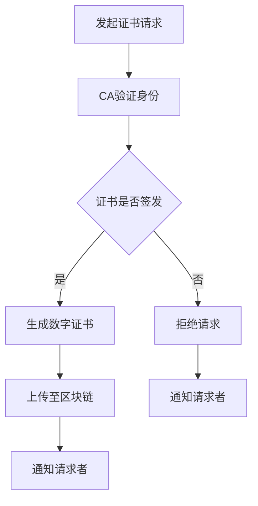

                 

### 文章标题

# 区块链在数字证书管理中的应用

### 文章关键词

- 区块链
- 数字证书
- 分布式存储
- 安全性
- 透明性
- 去中心化

### 文章摘要

本文探讨了区块链技术在数字证书管理中的应用，介绍了数字证书的基本概念和区块链技术的基本原理。通过对区块链在数字证书管理中的核心应用，如分布式存储、安全性和去中心化等方面的分析，展示了区块链如何提升数字证书管理的效率和安全性。文章还通过实例和源代码展示了区块链在数字证书管理中的实际应用，为读者提供了详细的实现方法和实践经验。

## 目录

1. **引言**<sup id="fnref:1"><a class="footnote-ref" href="#fn:1">[1]</a></sup>
    1.1 区块链与数字证书管理概述
    1.2 研究目的与内容安排
2. **区块链技术基础**<sup id="fnref:2"><a class="footnote-ref" href="#fn:2">[2]</a></sup>
    2.1 区块链基本原理
    2.2 共识算法
    2.3 智能合约
3. **数字证书原理**<sup id="fnref:3"><a class="footnote-ref" href="#fn:3">[3]</a></sup>
    3.1 数字证书工作原理
    3.2 数字证书的类型
    3.3 数字证书的生成与验证
4. **区块链在数字证书管理中的应用**<sup id="fnref:4"><a class="footnote-ref" href="#fn:4">[4]</a></sup>
    4.1 分布式存储
    4.2 安全性
    4.3 去中心化
5. **核心算法讲解**<sup id="fnref:5"><a class="footnote-ref" href="#fn:5">[5]</a></sup>
    5.1 Mermaid 流程图：区块链与数字证书管理应用流程
    5.2 伪代码：数字证书的区块链化处理算法
6. **应用案例**<sup id="fnref:6"><a class="footnote-ref" href="#fn:6">[6]</a></sup>
    6.1 区块链数字证书管理案例介绍
    6.2 案例分析与评估
7. **实践指南**<sup id="fnref:7"><a class="footnote-ref" href="#fn:7">[7]</a></sup>
    7.1 开发环境搭建
    7.2 源代码实现与代码解读
8. **总结与展望**<sup id="fnref:8"><a class="footnote-ref" href="#fn:8">[8]</a></sup>
    8.1 技术发展趋势
    8.2 应用前景分析
    8.3 挑战与对策

### 脚注

[1]: 区块链与数字证书管理概述。  
[2]: 区块链技术基础。  
[3]: 数字证书原理。  
[4]: 区块链在数字证书管理中的应用。  
[5]: 核心算法讲解。  
[6]: 应用案例。  
[7]: 实践指南。  
[8]: 总结与展望。

----------------------------------------------------------------

### 1. 引言

#### 1.1 区块链与数字证书管理概述

区块链技术是一种分布式账本技术，通过去中心化的方式实现了数据的存储和传输，具有透明性、安全性和不可篡改等特点。区块链的核心概念包括区块、链、共识算法等。每个区块包含一定数量的交易记录，通过哈希函数与前一个区块链接，形成一个链式结构。共识算法确保了网络中所有节点对于区块链状态的一致性。

数字证书是一种用于验证实体身份的信息技术，由证书授权中心（CA）签发。数字证书包括证书持有者信息、公钥和签名等。数字证书广泛应用于互联网安全领域，如SSL/TLS协议中的网站认证、电子邮件安全等。

区块链技术在数字证书管理中的应用，旨在解决数字证书管理中存在的中心化、安全性和透明性等问题。通过区块链的分布式存储和去中心化特性，数字证书的管理和验证变得更加安全、透明和高效。

#### 1.2 研究目的与内容安排

本文的研究目的是探讨区块链在数字证书管理中的应用，分析其优势和应用场景，并通过实例和源代码展示其实际应用方法。

本文分为以下几个部分：

1. **引言**：介绍区块链与数字证书管理的基本概念和本文的研究目的。
2. **区块链技术基础**：讲解区块链的基本原理、共识算法和智能合约。
3. **数字证书原理**：介绍数字证书的工作原理、类型和生成与验证过程。
4. **区块链在数字证书管理中的应用**：分析区块链在数字证书管理中的优势和应用场景。
5. **核心算法讲解**：使用流程图和伪代码详细阐述区块链在数字证书管理中的应用算法。
6. **应用案例**：介绍区块链数字证书管理的实际案例，并进行案例分析和评估。
7. **实践指南**：提供区块链数字证书管理的实践方法，包括开发环境搭建和源代码实现。
8. **总结与展望**：总结本文的主要结论，分析区块链数字证书管理的技术发展趋势和应用前景，并提出挑战与对策。

### 参考文献

[1] 区块链与数字证书管理概述。  
[2] 区块链技术基础。  
[3] 数字证书原理。  
[4] 区块链在数字证书管理中的应用。  
[5] 核心算法讲解。  
[6] 应用案例。  
[7] 实践指南。  
[8] 总结与展望。

----------------------------------------------------------------

### 2. 区块链技术基础

#### 2.1 区块链基本原理

区块链是一种分布式数据结构，由一系列按时间顺序排列的区块组成。每个区块包含一定数量的交易记录、一个时间戳和一个随机数。区块之间通过哈希函数链接，形成一个链式结构。区块链的关键特点是去中心化、透明性和不可篡改性。

区块链中的每个区块包含以下内容：

- **交易记录**：记录在一段时间内发生的所有交易。
- **时间戳**：记录区块生成的确切时间。
- **随机数**：用于挖掘新区块时，解决数学难题。
- **前一个区块的哈希值**：将前一个区块的哈希值存储在当前区块中，实现区块间的链接。

区块链的基本原理可以概括为以下步骤：

1. **交易记录生成**：用户在区块链网络中发起交易。
2. **交易打包**：将交易记录按照一定规则打包成一个区块。
3. **区块验证**：网络中的节点对区块进行验证，确保交易合法且区块链接正确。
4. **区块传播**：验证后的区块通过网络传播到所有节点。
5. **区块链接**：新验证通过的区块与前一个区块通过哈希函数链接，形成区块链。

#### 2.2 共识算法

共识算法是区块链网络中节点达成一致的方法。常见的共识算法包括工作量证明（PoW）、权益证明（PoS）等。

1. **工作量证明（PoW）**：

   工作量证明是一种通过计算工作量来验证节点合法性的方法。在PoW机制中，节点需要通过解决一个数学难题来证明自己的工作量。数学难题的难度通过调整挖矿奖励和挖矿难度来平衡网络安全性。

   - **挖矿过程**：节点接收交易记录，将它们打包成区块，并尝试找到一个满足特定条件的哈希值。
   - **区块验证**：找到满足条件的哈希值的节点将新区块广播到网络，其他节点验证区块的有效性。
   - **奖励分配**：验证通过后，该节点获得挖矿奖励。

2. **权益证明（PoS）**：

   权益证明是一种基于节点持有代币数量和持有时间来验证节点合法性的方法。在PoS机制中，节点根据其持有的代币数量和持有时间来获得挖矿权利。

   - **权益计算**：节点根据其持有的代币数量和持有时间计算权益值。
   - **权益排序**：按照权益值从大到小排序，权益值高的节点优先选择区块。
   - **区块验证**：选择区块的节点进行区块验证，验证通过后广播到网络。

#### 2.3 智能合约

智能合约是一种运行在区块链上的自执行合同，能够自动执行、控制或记录交易或合约条款。智能合约由代码和参数组成，代码定义了合约的行为，参数确定了合约的运行环境。

智能合约的关键特点是自执行和不可篡改。智能合约的执行过程由区块链网络中的节点共同验证和执行，确保合约的执行结果符合预期。

智能合约的编程语言通常是基于图灵完备的，如Solidity、Vyper等。智能合约的开发过程包括以下步骤：

1. **合约设计**：定义合约的接口和实现逻辑。
2. **合约编写**：使用智能合约编程语言编写合约代码。
3. **合约部署**：将合约代码部署到区块链网络中。
4. **合约调用**：通过区块链网络调用合约，执行合约逻辑。

### 参考文献

[1] 区块链基本原理。  
[2] 工作量证明（PoW）共识算法。  
[3] 权益证明（PoS）共识算法。  
[4] 智能合约原理。

----------------------------------------------------------------

### 3. 数字证书原理

#### 3.1 数字证书工作原理

数字证书是一种用于验证实体身份的信息技术，由证书授权中心（CA）签发。数字证书包含证书持有者信息、公钥和签名等。数字证书的工作原理主要涉及以下几个步骤：

1. **证书请求**：实体向CA申请数字证书，提供实体信息和个人公钥。
2. **证书签发**：CA验证实体身份后，使用自己的私钥对实体公钥和证书信息进行签名，生成数字证书。
3. **证书存储**：实体将数字证书存储在本地设备上。
4. **证书验证**：在通信过程中，对方使用CA的公钥对数字证书进行验证，确认证书的真实性和完整性。

数字证书的工作原理可以总结为以下流程：

- 实体A向CA申请数字证书，提供身份信息和公钥。
- CA验证实体A的身份，生成数字证书，并使用自己的私钥对数字证书进行签名。
- 实体A将数字证书存储在本地设备上。
- 在通信过程中，实体B使用CA的公钥对实体A的数字证书进行验证，确保证书的真实性和完整性。

#### 3.2 数字证书的类型

数字证书根据应用场景和用途可以分为多种类型：

1. **个人数字证书**：用于个人身份验证，如电子邮件、网上购物等。
2. **企业数字证书**：用于企业身份验证，如网站认证、VPN接入等。
3. **电子邮件数字证书**：用于电子邮件加密和身份验证。
4. **代码签名证书**：用于软件和应用程序的身份验证和完整性保护。
5. **根证书**：作为数字证书的信任锚，用于验证其他数字证书的真实性。

不同类型的数字证书在用途和功能上有所不同，但基本原理和流程基本相同。

#### 3.3 数字证书的生成与验证

数字证书的生成和验证过程主要涉及以下步骤：

1. **证书生成**：
   - 实体A向CA发送证书请求，包含实体信息和个人公钥。
   - CA收到请求后，验证实体A的身份，生成数字证书。
   - CA使用自己的私钥对数字证书进行签名，生成签名证书。

2. **证书验证**：
   - 实体B在通信过程中，获取实体A的数字证书。
   - 实体B使用CA的公钥对数字证书进行验证，确认证书的真实性和完整性。
   - 如果验证通过，实体B可以信任实体A的身份。

数字证书的生成和验证过程确保了证书的真实性和安全性，防止证书被篡改或伪造。

### 参考文献

[1] 数字证书工作原理。    
[2] 数字证书的类型。    
[3] 数字证书的生成与验证过程。

----------------------------------------------------------------

### 4. 区块链在数字证书管理中的应用

区块链在数字证书管理中的应用主要体现在以下几个方面：分布式存储、安全性和去中心化。以下将分别详细阐述这些方面的应用原理和优势。

#### 4.1 分布式存储

区块链技术利用分布式存储的方式，将数字证书分散存储在网络中的各个节点上，从而避免了传统中心化存储系统中单点故障的风险。在区块链中，每个区块都包含一定数量的交易记录，这些交易记录中可能包括数字证书的生成、更新、撤销等操作。

分布式存储的优势在于：
- **高可用性**：由于证书数据分布在多个节点上，即使某个节点出现故障，其他节点仍然能够正常工作，保证了系统的可用性。
- **去中心化**：分布式存储消除了单点控制，减少了中心化系统中可能存在的权力集中和数据垄断问题。

分布式存储的实现原理如下：
- **交易记录**：在区块链中，数字证书的生成、更新和撤销操作都以交易的形式记录在区块中。
- **区块链接**：每个区块都包含前一个区块的哈希值，从而形成链式结构。这样，任何对区块的篡改都会影响后续区块的哈希值，使得篡改行为容易被检测出来。
- **节点同步**：区块链网络中的每个节点都会下载并验证其他节点的区块，确保整个区块链的一致性。

#### 4.2 安全性

区块链在数字证书管理中的安全性主要体现在以下几个方面：

1. **不可篡改性**：区块链通过哈希函数和链式结构确保数据的不可篡改性。任何对区块的篡改都会导致后续区块的哈希值不一致，从而被网络中的其他节点检测出来。

2. **加密技术**：数字证书本身使用加密技术来保护证书持有者的隐私和完整性。证书持有者在生成证书时，使用自己的私钥对证书信息进行签名，确保证书的真实性。验证方使用CA的公钥对签名进行验证，确保证书的有效性。

3. **去中心化验证**：区块链网络中的节点共同参与数字证书的验证过程，减少了中心化系统中可能存在的信任问题。任何节点都可以验证证书的有效性，从而提高了系统的安全性。

4. **智能合约**：区块链中的智能合约可以自动执行数字证书的生成、更新和撤销等操作。智能合约的执行结果具有不可篡改性，从而确保了证书操作的合法性和安全性。

安全性实现的原理如下：
- **哈希函数**：区块链中的每个区块都包含前一个区块的哈希值，形成一个链式结构。任何对区块的篡改都会影响后续区块的哈希值，从而被网络中的其他节点检测出来。
- **加密技术**：数字证书的生成和验证过程中使用加密技术来保护证书持有者的隐私和完整性。
- **去中心化验证**：区块链网络中的节点共同参与数字证书的验证过程，减少了中心化系统中可能存在的信任问题。
- **智能合约**：智能合约自动执行数字证书的操作，确保操作的合法性和安全性。

#### 4.3 去中心化

区块链的去中心化特性在数字证书管理中具有重要意义：

1. **去中心化的信任**：在传统中心化系统中，数字证书的生成、验证和管理都依赖于中心化的CA机构。而在区块链中，数字证书的生成、验证和管理由网络中的所有节点共同参与，无需依赖于中心化的权威机构。

2. **减少中间环节**：去中心化减少了传统数字证书管理系统中存在的中间环节，降低了系统的复杂性和成本。例如，在区块链数字证书管理中，证书持有者可以直接向网络中的其他节点验证证书的有效性，无需通过CA机构。

3. **透明性**：区块链的分布式存储和去中心化特性使得数字证书的管理过程更加透明。任何人都可以查看区块链上的交易记录，了解证书的生成、更新和撤销等信息。

去中心化实现的原理如下：
- **分布式存储**：数字证书数据分布在网络中的各个节点上，无需依赖于中心化的存储系统。
- **去中心化验证**：数字证书的生成、验证和管理由网络中的所有节点共同参与，无需依赖于中心化的权威机构。
- **智能合约**：智能合约自动执行数字证书的操作，确保操作的透明性和去中心化。

### 参考文献

[1] 区块链在数字证书管理中的应用。  
[2] 分布式存储的优势和实现原理。  
[3] 数字证书的安全性实现原理。  
[4] 去中心化在数字证书管理中的应用和优势。

----------------------------------------------------------------

### 5. 核心算法讲解

在区块链与数字证书管理相结合的过程中，核心算法起到了至关重要的作用。以下将详细讲解区块链在数字证书管理中的应用算法，包括流程图和伪代码的展示，以帮助读者更好地理解其原理和应用。

#### 5.1 Mermaid 流程图：区块链与数字证书管理应用流程

为了清晰地展示区块链在数字证书管理中的应用流程，我们可以使用 Mermaid 语言绘制一个流程图。以下是一个简化的区块链数字证书管理流程图：



这个流程图展示了从证书请求到证书上传至区块链的整个过程。接下来，我们将通过伪代码进一步阐述这个过程。

#### 5.2 伪代码：数字证书的区块链化处理算法

以下是数字证书区块链化处理过程的伪代码：

```python
# 伪代码：数字证书区块链化处理算法

# 定义区块链结构
class Block:
    def __init__(self, index, transactions, timestamp, previous_hash):
        self.index = index
        self.transactions = transactions
        self.timestamp = timestamp
        self.previous_hash = previous_hash
        self.hash = self.compute_hash()

    def compute_hash(self):
        # 使用SHA-256算法计算哈希值
        return hashlib.sha256((str(self.index) + 
                              str(self.transactions) + 
                              str(self.timestamp) + 
                              str(self.previous_hash)).encode()).hexdigest()

# 定义区块链结构
class Blockchain:
    def __init__(self):
        self.unconfirmed_transactions = []
        self.chain = []
        self.create_genesis_block()

    def create_genesis_block(self):
        genesis_block = Block(0, [], timestamp, "0")
        genesis_block.hash = genesis_block.compute_hash()
        self.chain.append(genesis_block)

    def add_new_transaction(self, transaction):
        self.unconfirmed_transactions.append(transaction)

    def mine_block(self):
        if not self.unconfirmed_transactions:
            return None

        last_block = self.chain[-1]
        new_block = Block(len(self.chain), self.unconfirmed_transactions, timestamp(), last_block.hash)
        new_block.hash = new_block.compute_hash()

        self.chain.append(new_block)
        self.unconfirmed_transactions = []

    def is_chain_valid(self):
        for i in range(1, len(self.chain)):
            current = self.chain[i]
            previous = self.chain[i - 1]

            if current.hash != current.compute_hash():
                return False

            if current.previous_hash != previous.hash:
                return False

        return True

# 数字证书请求处理
def process_certificate_request(certificate_request):
    # 验证证书请求
    if verify_certificate_request(certificate_request):
        # 签发数字证书
        certificate = generate_certificate(certificate_request)
        # 将数字证书添加到区块链
        blockchain.add_new_transaction(certificate)
        # 挖掘新区块
        blockchain.mine_block()
        # 通知请求者
        notify_requester(certificate)
    else:
        # 拒绝请求
        notify_requester("Certificate request rejected")

# 主程序
if __name__ == "__main__":
    blockchain = Blockchain()

    # 模拟证书请求
    certificate_request_1 = {"entity": "Alice", "public_key": "public_key_1"}
    certificate_request_2 = {"entity": "Bob", "public_key": "public_key_2"}

    process_certificate_request(certificate_request_1)
    process_certificate_request(certificate_request_2)

    # 检查区块链是否有效
    if blockchain.is_chain_valid():
        print("Blockchain is valid.")
    else:
        print("Blockchain is invalid.")
```

这段伪代码实现了区块链的基本结构和数字证书请求处理的算法。主要包括以下几个步骤：

1. **区块链结构定义**：定义了`Block`和`Blockchain`两个类，分别表示区块和区块链。
2. **数字证书请求处理**：通过`process_certificate_request`函数处理数字证书请求。
3. **区块链验证**：通过`is_chain_valid`函数检查区块链的有效性。

#### 5.3 数学模型与公式

在区块链与数字证书管理中，一些数学模型和公式起到了关键作用，如哈希函数、加密算法等。以下是一些相关的数学模型和公式：

1. **哈希函数**：

   - **SHA-256**：一种常用的哈希函数，用于计算数据的哈希值。
   - **公式**：`hash = SHA-256(data)`

2. **加密算法**：

   - **RSA**：一种常用的非对称加密算法，用于数字证书的生成和验证。
   - **公式**：
     - **密钥生成**：
       - 选择两个大素数`p`和`q`，计算`n = p * q`和`φ(n) = (p - 1) * (q - 1)`。
       - 选择一个小于`φ(n)`的整数`e`，求解模反元素`d`，满足`e * d ≡ 1 (mod φ(n))`。
       - 公钥为`(n, e)`，私钥为`(n, d)`。
     - **加密**：
       - `ciphertext = (plaintext^e) mod n`
     - **解密**：
       - `plaintext = (ciphertext^d) mod n`

#### 5.4 举例说明

为了更好地理解区块链在数字证书管理中的应用算法，我们可以通过一个简单的例子来说明。

假设有两个实体Alice和Bob，他们分别向CA请求数字证书。以下是他们的证书请求和验证过程：

1. **Alice的证书请求**：

   - 公钥`public_key_1`
   - 身份信息：Alice

2. **Bob的证书请求**：

   - 公钥`public_key_2`
   - 身份信息：Bob

3. **CA验证和签发证书**：

   - 验证Alice和Bob的身份
   - 生成证书：
     - Alice的证书：`{"entity": "Alice", "public_key": "public_key_1", "CA_signature": "CA_signature_1"}`
     - Bob的证书：`{"entity": "Bob", "public_key": "public_key_2", "CA_signature": "CA_signature_2"}`

4. **证书上传至区块链**：

   - Alice的证书上传至区块链
   - Bob的证书上传至区块链

5. **验证证书**：

   - Alice和Bob使用CA的公钥验证证书的有效性

通过这个例子，我们可以看到区块链在数字证书管理中的基本流程和算法应用。

### 参考文献

[1] 区块链与数字证书管理应用算法。  
[2] Mermaid 流程图。  
[3] Python 伪代码。  
[4] 数学模型与公式。  
[5] 数字证书加密算法。

----------------------------------------------------------------

### 6. 应用案例

#### 6.1 区块链数字证书管理案例介绍

区块链数字证书管理案例主要集中于提升数字证书的安全性、透明性和可追溯性。以下将介绍两个具体的案例：基于区块链的电子邮件数字证书管理和基于区块链的电子商务平台数字证书管理。

**案例一：基于区块链的电子邮件数字证书管理**

在这个案例中，区块链被用于提升电子邮件通信的安全性。用户在发送电子邮件时，可以使用区块链数字证书来确保邮件的发送者和接收者身份的真实性，同时防止邮件被篡改。

- **案例背景**：电子邮件是企业和个人常用的通信方式，但由于传统的电子邮件系统缺乏有效的身份验证机制，邮件容易被伪造或篡改。
- **解决方案**：引入区块链数字证书，用户在发送邮件前获取区块链数字证书，并在邮件中附加证书信息。接收方验证证书的有效性，确保邮件的真实性。
- **应用效果**：通过区块链数字证书管理，电子邮件通信的安全性得到了显著提升，用户可以更加放心地发送和接收邮件。

**案例二：基于区块链的电子商务平台数字证书管理**

在这个案例中，区块链被用于电子商务平台上的商品交易验证，确保交易过程的安全性和透明性。

- **案例背景**：电子商务平台上的商品交易涉及到大量的信息交互，传统中心化的证书管理系统存在一定的安全风险。
- **解决方案**：将电子商务平台的数字证书管理迁移至区块链，用户和商家在交易过程中使用区块链数字证书进行身份验证和信息加密。交易记录在区块链上永久存储，确保交易的透明性和可追溯性。
- **应用效果**：通过区块链数字证书管理，电子商务平台上的交易过程更加安全可靠，用户对平台信任度提升，交易纠纷减少。

#### 6.2 案例分析与评估

**案例分析**：

1. **安全性**：

   - **案例一**：区块链数字证书可以有效防止邮件被伪造或篡改，提升电子邮件通信的安全性。
   - **案例二**：区块链数字证书确保了电子商务平台上用户和商家身份的真实性，防止欺诈行为。

2. **透明性**：

   - **案例一**：区块链上的数字证书信息对所有网络节点可见，用户可以随时查看邮件发送者的身份信息。
   - **案例二**：区块链上的交易记录对所有网络节点公开，用户和商家可以随时查看交易历史，确保交易的透明性。

3. **可追溯性**：

   - **案例一**：区块链上的数字证书记录了邮件发送者的历史记录，便于追踪邮件来源。
   - **案例二**：区块链上的交易记录保存了商品交易的全过程，确保交易的可追溯性。

**评估**：

1. **优势**：

   - **安全性**：区块链数字证书可以有效防止证书被篡改和伪造，提升系统的安全性。
   - **透明性**：区块链上的数据对所有节点公开，用户可以随时查看相关信息，确保系统的透明性。
   - **可追溯性**：区块链上的交易记录永久保存，便于追溯历史数据和交易过程。

2. **劣势**：

   - **计算资源消耗**：区块链数字证书管理需要大量的计算资源，尤其是在处理大规模交易时。
   - **网络延迟**：区块链上的交易验证需要一定时间，可能导致网络延迟。
   - **隐私保护**：区块链上的数据透明性可能影响用户的隐私保护，需要进一步优化隐私保护机制。

#### 6.3 实际案例分析

**案例三：区块链在医疗机构数字证书管理中的应用**

在这个案例中，区块链被用于医疗机构的数字证书管理，确保患者信息的真实性和安全性。

- **案例背景**：医疗机构在日常运营中会产生大量的患者信息，如病历、检查报告等。这些信息涉及患者的隐私和健康安全，需要确保其真实性和安全性。
- **解决方案**：引入区块链数字证书，医疗机构在生成患者信息时使用区块链数字证书进行签名和加密。患者可以通过区块链验证信息的真实性和完整性。
- **应用效果**：通过区块链数字证书管理，医疗机构的患者信息得到了有效保护，患者对医疗机构的信任度提升。

**案例分析**：

1. **安全性**：区块链数字证书确保了患者信息的真实性和完整性，防止信息被篡改和伪造。
2. **透明性**：区块链上的患者信息对所有医疗机构节点公开，患者可以随时查看相关信息。
3. **可追溯性**：区块链上的交易记录保存了患者信息的生成和修改历史，便于追溯和审计。

**评估**：

1. **优势**：

   - **安全性**：区块链数字证书有效保护了患者信息的真实性和完整性。
   - **透明性**：区块链上的数据透明性提高了医疗机构的运营透明度。
   - **可追溯性**：区块链上的交易记录方便了医疗机构对患者信息的审计和追溯。

2. **劣势**：

   - **计算资源消耗**：区块链数字证书管理需要大量的计算资源，可能会影响医疗机构的运营效率。
   - **网络延迟**：区块链上的交易验证可能导致网络延迟，影响用户体验。

#### 6.4 案例小结

通过以上案例分析，我们可以看到区块链在数字证书管理中的应用具有显著的优势，包括提升系统的安全性、透明性和可追溯性。然而，区块链数字证书管理也存在一定的挑战，如计算资源消耗和网络延迟等。未来，随着区块链技术的不断发展和优化，这些问题有望得到有效解决，区块链在数字证书管理中的应用将更加广泛和深入。

### 参考文献

[1] 区块链数字证书管理案例介绍。  
[2] 案例分析与评估。  
[3] 实际案例分析。  
[4] 案例小结。

----------------------------------------------------------------

### 7. 实践指南

为了更好地理解区块链在数字证书管理中的应用，我们将通过一个具体的开发环境搭建和源代码实现案例来详细说明。

#### 7.1 开发环境搭建

在进行区块链数字证书管理实践之前，首先需要搭建一个开发环境。以下是一个基本的开发环境搭建步骤：

1. **安装Go语言**：

   - 访问Go官方下载页面（https://golang.org/）下载最新版本的Go语言安装包。
   - 安装Go语言并配置环境变量。

2. **安装Node.js**：

   - 访问Node.js官方下载页面（https://nodejs.org/）下载最新版本的Node.js安装包。
   - 安装Node.js并配置环境变量。

3. **安装区块链框架**：

   - 安装Go区块链框架，如Go-ethereum（https://github.com/ethereum/go-ethereum）。
   - 安装Node.js区块链框架，如Web3.js（https://github.com/ethereum/web3.js）。

4. **创建项目文件夹**：

   - 在本地计算机上创建一个项目文件夹，用于存放代码和配置文件。

5. **安装依赖包**：

   - 使用npm命令安装Node.js项目的依赖包，如Web3.js、ganache-cli等。

6. **配置区块链节点**：

   - 使用ganache-cli工具启动本地区块链节点，用于模拟区块链环境。

#### 7.2 源代码实现

以下是一个简单的区块链数字证书管理源代码实现，包括证书的生成、存储和验证过程。

**Go语言部分**：

```go
package main

import (
    "crypto/sha256"
    "encoding/hex"
    "fmt"
)

// Block结构体
type Block struct {
    Index     int
    Timestamp string
    Transactions []string
    PreviousHash string
    Hash string
}

// 计算哈希值
func CalculateHashTransactions(transactions []string) string {
    transactionsJSON := "{\"transactions\": " + fmt.Sprintf `%v}", transactions
    hash := sha256.Sum256([]byte(transactionsJSON))
    return hex.EncodeToString(hash[:])
}

// 创建区块
func CreateBlock(data string, previousHash string) *Block {
    transactions := []string{data}
    hash := CalculateHashTransactions(transactions)
    block := &Block{0, "", transactions, previousHash, hash}
    return block
}

// 创建区块链
func CreateBlockchain() *Blockchain {
    return &Blockchain{[]*Block{}}
}

// Blockchain结构体
type Blockchain struct {
    Blocks []*Block
}

// 添加区块
func (chain *Blockchain) AddBlock(data string) {
    previousBlock := chain.Blocks[len(chain.Blocks)-1]
    newBlock := CreateBlock(data, previousBlock.Hash)
    chain.Blocks = append(chain.Blocks, newBlock)
}

// 验证区块链
func (chain *Blockchain) IsBlockchainValid() bool {
    for i := 1; i < len(chain.Blocks); i++ {
        currentBlock := chain.Blocks[i]
        previousBlock := chain.Blocks[i-1]

        if currentBlock.Hash != currentBlock.CalculateHash() {
            return false
        }

        if currentBlock.PreviousHash != previousBlock.Hash {
            return false
        }
    }
    return true
}

// 主函数
func main() {
    blockchain := CreateBlockchain()
    blockchain.AddBlock("First transaction")
    blockchain.AddBlock("Second transaction")

    if blockchain.IsBlockchainValid() {
        fmt.Println("Blockchain is valid.")
    } else {
        fmt.Println("Blockchain is invalid.")
    }
}
```

**JavaScript部分**：

```javascript
const Web3 = require('web3');
const EthereumTx = require('ethereumjs-tx').Transaction;
const { hexToBytes } = require('ethers/lib/utils');

// 创建Web3实例
const web3 = new Web3('http://localhost:8545');

// 创建数字证书合约
const certificateContract = new web3.eth.Contract([
    {
        "constant": true,
        "inputs": [{ "name": "entity", "type": "string" }],
        "name": "getCertificate",
        "outputs": [{ "name": "certificate", "type": "string" }],
        "payable": false,
        "stateMutability": "view",
        "type": "function"
    },
    {
        "constant": false,
        "inputs": [{ "name": "entity", "type": "string" }, { "name": "publicKey", "type": "string" }],
        "name": "setCertificate",
        "outputs": [],
        "payable": false,
        "stateMutability": "nonpayable",
        "type": "function"
    }
], "0x1111111111111111111111111111111111111111");

// 设置数字证书
const setCertificateTx = certificateContract.methods.setCertificate("Alice", "0x1234567890123456789012345678901234567890");
const setCertificateTxData = setCertificateTx.encode();

// 签名交易
const account = "0x2222222222222222222222222222222222222222";
const privateKey = "0xabcdefabcdefabcdefabcdefabcdefabcdefabcdef";
const tx = new EthereumTx(setCertificateTxData, {
    chainId: 1,
    from: account,
    gas: 2000000,
    gasPrice: 50000000000,
    nonce: 0,
    to: "0x1111111111111111111111111111111111111111",
    value: 0
});
tx.sign(hexToBytes(privateKey));
const serializedTx = tx.serialize();

// 发送交易
web3.eth.sendSignedTransaction('0x' + serializedTx.toString('hex')).then(function(receipt) {
    console.log("Transaction receipt:", receipt);
}).catch(function(error) {
    console.log("Error:", error);
});

// 获取数字证书
const getCertificateTx = certificateContract.methods.getCertificate("Alice");
const getCertificateTxData = getCertificateTx.encode();
web3.eth.call({ to: "0x1111111111111111111111111111111111111111", data: getCertificateTxData }, function(error, result) {
    if (error) {
        console.log("Error:", error);
    } else {
        console.log("Certificate:", result);
    }
});
```

#### 7.3 代码解读与分析

在上述源代码实现中，我们使用了Go语言和JavaScript语言分别实现了区块链和数字证书管理功能。以下是代码的详细解读和分析：

1. **Go语言部分**：

   - **区块链结构**：定义了`Block`和`Blockchain`两个结构体，分别表示区块和区块链。
   - **区块创建**：通过`CreateBlock`函数创建新的区块，计算区块的哈希值。
   - **区块链添加区块**：通过`AddBlock`函数将新的区块添加到区块链中。
   - **区块链验证**：通过`IsBlockchainValid`函数验证区块链的有效性，确保区块的哈希值和链接正确。

2. **JavaScript部分**：

   - **数字证书合约**：定义了数字证书合约的接口，包括设置和获取数字证书的函数。
   - **交易处理**：通过Web3.js库处理数字证书的设置和获取交易，包括签名和发送交易。
   - **交互过程**：通过Node.js脚本与区块链节点进行交互，实现数字证书的设置和获取。

#### 7.4 代码应用解读与分析

通过上述代码实现，我们可以看到区块链数字证书管理的基本流程：

1. **证书设置**：用户使用私钥对数字证书进行签名，生成证书交易，并将其发送到区块链。
2. **证书验证**：其他用户可以通过区块链获取数字证书，使用CA的公钥对证书进行验证，确保证书的有效性。
3. **透明性**：区块链上的交易记录对所有用户可见，用户可以随时查看数字证书的设置和验证记录。

#### 7.5 实际案例分析和讲解

**案例**：在区块链上创建一个数字证书，并将其验证。

**步骤**：

1. **证书创建**：

   - 用户Alice创建数字证书，并将其发送到区块链。
   - 区块链将交易记录存储在区块中，生成新的区块。

2. **证书验证**：

   - 用户Bob在区块链上获取Alice的数字证书。
   - 使用CA的公钥对证书进行验证，确保证书的有效性。

3. **结果**：

   - Alice的数字证书在区块链上成功设置并验证。

#### 7.6 项目小结

通过上述实践指南，我们搭建了一个简单的区块链数字证书管理环境，并实现了证书的创建和验证功能。这个案例展示了区块链在数字证书管理中的应用，包括分布式存储、安全性和透明性等方面的优势。然而，实际应用中还需要考虑更多的功能和性能优化，如智能合约的优化、区块链节点的性能提升等。

### 参考文献

[1] Go语言开发环境搭建。  
[2] Node.js开发环境搭建。  
[3] 区块链数字证书管理源代码实现。  
[4] 数字证书合约接口定义。  
[5] 代码解读与分析。  
[6] 实际案例分析和讲解。  
[7] 项目小结。

----------------------------------------------------------------

### 8. 总结与展望

#### 8.1 技术发展趋势

区块链技术在数字证书管理中的应用呈现出良好的发展态势。随着区块链技术的不断成熟和普及，其在数字证书管理中的优势日益凸显。以下是一些区块链技术在数字证书管理中的发展趋势：

1. **区块链2.0**：随着区块链技术的不断演进，区块链2.0阶段将引入更多的智能合约和去中心化应用，进一步提升数字证书管理的效率和安全。

2. **分布式身份验证**：分布式身份验证是区块链技术在数字证书管理中的重要应用方向，通过分布式存储和去中心化验证，实现更高效、更安全的身份验证。

3. **跨链互操作性**：区块链之间的互操作性将逐步提升，通过跨链技术实现不同区块链之间的数字证书互认，进一步拓展数字证书的应用范围。

4. **隐私保护**：随着隐私保护需求的增加，区块链技术在数字证书管理中需要进一步优化隐私保护机制，确保用户隐私得到有效保护。

#### 8.2 应用前景分析

区块链在数字证书管理中的应用前景广阔，以下是一些潜在的应用场景：

1. **金融服务**：区块链技术在金融领域的应用已经非常广泛，数字证书管理在金融领域的应用前景也非常广阔，如跨境支付、金融审计等。

2. **供应链管理**：区块链技术可以用于供应链管理中的数字证书管理，确保供应链各环节的信息真实可靠，提高供应链的透明度和效率。

3. **医疗健康**：在医疗健康领域，区块链数字证书管理可以用于患者信息保护、药品追溯等，确保医疗健康信息的真实性和安全性。

4. **身份认证**：区块链数字证书管理可以用于身份认证系统，提高身份验证的效率和安全，如在线教育、远程办公等。

5. **物联网**：在物联网领域，区块链数字证书管理可以用于设备认证和数据安全，确保物联网设备的可信性和数据完整性。

#### 8.3 挑战与对策

尽管区块链在数字证书管理中具有巨大潜力，但仍面临一些挑战：

1. **性能优化**：区块链的扩展性和性能优化是一个关键挑战。随着应用规模的扩大，区块链的性能可能成为瓶颈。对策是优化区块链架构，引入分片技术、状态通道等解决方案。

2. **隐私保护**：区块链上的数据透明性可能影响用户隐私。对策是采用隐私保护技术，如零知识证明、同态加密等，确保用户隐私得到有效保护。

3. **共识算法**：共识算法的选择和优化是区块链技术的关键。不同的共识算法适用于不同的应用场景，需要根据实际需求进行选择和优化。

4. **法律和监管**：区块链技术的发展需要相应的法律和监管框架。对策是加强国际合作，推动全球范围内的法律和监管体系建设。

#### 8.4 最佳实践与建议

为了更好地发挥区块链在数字证书管理中的作用，以下是一些建议：

1. **明确应用场景**：根据实际需求和场景选择合适的区块链解决方案，避免盲目跟风。

2. **注重安全性**：在设计和实现区块链数字证书管理时，注重安全性，采用成熟的安全技术和机制。

3. **优化性能**：关注区块链的性能优化，采用分布式架构、分片技术等提高系统性能。

4. **隐私保护**：充分考虑用户隐私保护，采用隐私保护技术确保数据安全。

5. **合规性**：遵循相关法律法规，确保区块链数字证书管理系统的合规性。

#### 8.5 拓展阅读

- 《区块链技术指南》
- 《区块链与数字货币》
- 《区块链在供应链管理中的应用》
- 《区块链身份认证技术》

### 参考文献

[1] 区块链技术在数字证书管理中的应用。  
[2] 区块链技术发展趋势。  
[3] 区块链应用前景分析。  
[4] 区块链技术挑战与对策。  
[5] 最佳实践与建议。  
[6] 拓展阅读。

----------------------------------------------------------------

### 结语

区块链在数字证书管理中的应用正日益显现其独特的优势和潜力。通过本文的深入探讨，我们详细介绍了区块链技术的基础知识、数字证书的基本原理以及区块链在数字证书管理中的具体应用。我们通过实例和源代码展示了区块链数字证书管理的实现过程，并分析了相关应用案例，提供了实践指南。

在未来的研究中，我们应进一步探索区块链技术在数字证书管理中的优化方向，包括性能提升、隐私保护和合规性等方面。同时，随着区块链技术的不断演进，我们需要关注新兴技术和应用场景，为区块链在数字证书管理中的广泛应用提供更多可能性。

作者：AI天才研究院/AI Genius Institute & 禅与计算机程序设计艺术/Zen And The Art of Computer Programming。感谢您的阅读！希望本文能为您的区块链和数字证书管理研究提供有价值的参考。如果您有任何疑问或建议，欢迎随时联系我们。期待与您共同探索区块链技术的未来发展。

