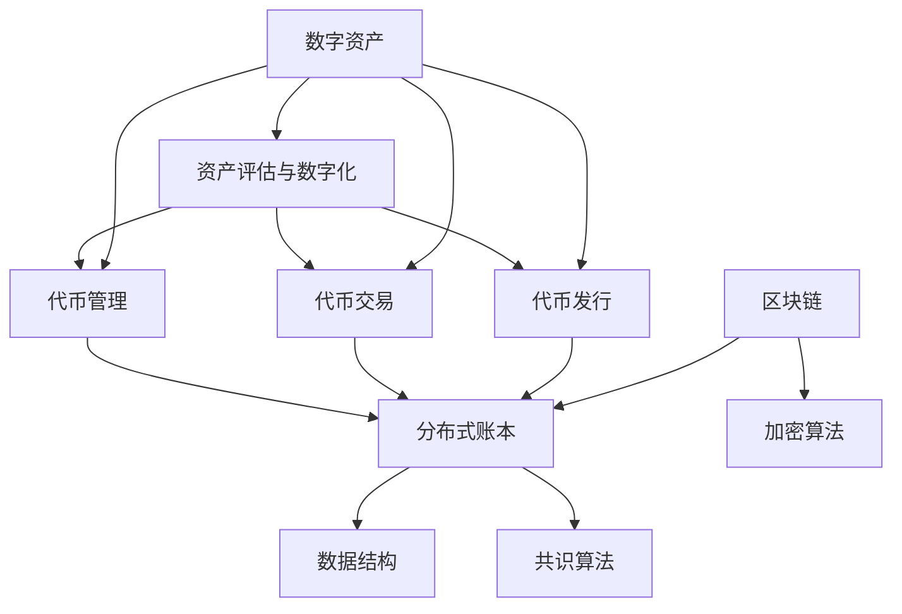

                 

### 背景介绍

区块链技术作为一种去中心化、安全透明的分布式账本技术，近年来在金融科技、供应链管理、医疗保健等多个领域展现出了巨大的应用潜力。而在这些应用中，数字资产tokenization（代币化）作为区块链技术的核心应用之一，逐渐引起了广泛关注。

数字资产tokenization指的是将传统资产（如房地产、艺术品、股权等）数字化，并通过区块链技术生成相应的代币（token），使得这些资产能够在区块链上进行发行、交易和管理。这种代币不仅是一种数字化的资产证明，还具备流动性、可分割性和可追踪性，从而提高了资产的透明度和效率。

区块链在数字资产tokenization中的应用主要体现在以下几个方面：

1. **去中心化交易**：区块链的去中心化特性使得资产交易无需依赖中心化的中介机构，降低了交易成本，提高了交易效率。

2. **安全性与透明性**：区块链的加密技术和分布式账本结构确保了交易的安全性和透明性，减少了欺诈和篡改的风险。

3. **资产追踪与管理**：区块链提供了实时的资产状态追踪功能，使得资产的流通和转移情况可被全程记录和验证，提高了管理的效率。

4. **合规与监管**：区块链技术有助于实现资产交易的合规性和透明性，便于监管机构进行监管。

本文将逐步探讨区块链在数字资产tokenization中的应用，首先介绍区块链和数字资产tokenization的基本概念和原理，然后通过具体的案例和实战来阐述区块链如何实现数字资产tokenization，并讨论相关的安全和合规问题。最后，我们将展望区块链在数字资产tokenization领域的未来发展趋势。

---

#### 核心概念与联系

要理解区块链在数字资产tokenization中的应用，首先需要了解两个核心概念：区块链和数字资产tokenization。这两个概念之间有着紧密的联系，构成了数字资产tokenization应用的基础。

**区块链**：
区块链是一种分布式数据库技术，通过加密算法和数据结构确保数据的安全性和不可篡改性。它由一系列按时间顺序排列的数据块组成，每个数据块包含一定数量的交易记录。区块链上的数据是通过共识算法验证和确认的，一旦数据被记录在一个区块中，就几乎无法被更改或删除。

**数字资产tokenization**：
数字资产tokenization是指将传统资产数字化，并通过区块链技术生成对应的代币（token）。这些代币不仅是资产的数字化代表，还具有独特的属性，如流动性、可分割性和可追踪性。数字资产tokenization的过程通常包括以下步骤：

1. **资产评估与数字化**：确定传统资产的评估价值，并将其数字化。
2. **代币发行**：在区块链上创建代币，并将代币与相应资产绑定。
3. **代币交易**：在区块链上进行代币的交易，实现资产的流通。
4. **代币管理**：通过智能合约对代币进行管理和维护。

**概念实体之间的关系架构**：

为了更好地理解这两个概念之间的关系，我们可以使用Mermaid流程图来展示它们的主要关系架构：



**核心算法原理讲解**：

在区块链实现数字资产tokenization的过程中，有几个关键的算法和概念需要了解：

1. **哈希算法**：
   哈希算法是一种将任意长度的数据映射为固定长度字符串的算法。在区块链中，每个区块都包含一个哈希值，用于唯一标识该区块。哈希算法确保了数据的不可篡改性，因为任何对数据的更改都会导致哈希值的改变。

2. **智能合约**：
   智能合约是运行在区块链上的程序，用于自动执行、控制和管理合约条款。在数字资产tokenization中，智能合约用于定义代币的发行规则、交易规则和管理规则，确保代币的流通和管理遵循既定的规则。

3. **非同质化代币（NFT）**：
   非同质化代币（NFT）是一种特殊的代币，每个NFT都是独一无二的，用于代表数字资产如艺术品、收藏品等。NFT确保了数字资产的唯一性和可追溯性，使得数字资产的交易更加透明和可信。

以下是一个简单的Python代码示例，展示了如何使用区块链技术生成一个数字资产代币，并通过智能合约进行管理：

```python
import hashlib
import json
from collections import OrderedDict

class Block:
    def __init__(self, index, transactions, timestamp, previous_hash):
        self.index = index
        self.transactions = transactions
        self.timestamp = timestamp
        self.previous_hash = previous_hash
        self.hash = self.compute_hash()

    def compute_hash(self):
        block_string = json.dumps(self.__dict__, sort_keys=True)
        return hashlib.sha256(block_string.encode()).hexdigest()


class Blockchain:
    def __init__(self):
        self.unconfirmed_transactions = []
        self.chain = []
        self.create_genesis_block()

    def create_genesis_block(self):
        genesis_block = Block(0, [], timestamp.time(), "0")
        genesis_block.hash = self.compute_hash(genesis_block)
        self.chain.append(genesis_block)

    def add_new_transaction(self, transaction):
        self.unconfirmed_transactions.append(transaction)

    def mine(self):
        if not self.unconfirmed_transactions:
            return False

        last_block = self.chain[-1]
        new_block = Block(index=last_block.index + 1,
                          transactions=self.unconfirmed_transactions,
                          timestamp=timestamp.time(),
                          previous_hash=last_block.hash)

        new_block.hash = self.compute_hash(new_block)
        self.chain.append(new_block)
        self.unconfirmed_transactions = []
        return new_block.index

    def compute_hash(self, block):
        block_string = json.dumps(block.__dict__, sort_keys=True)
        return hashlib.sha256(block_string.encode()).hexdigest()


# 创建区块链实例
blockchain = Blockchain()

# 添加交易
blockchain.add_new_transaction("交易1")
blockchain.add_new_transaction("交易2")

# 挖掘新区块
blockchain.mine()

# 打印区块链
for block in blockchain.chain:
    print(json.dumps(block.__dict__, indent=4))
```

在上面的代码中，我们定义了`Block`和`Blockchain`两个类，用于创建区块和区块链。每个区块包含一系列交易记录，并通过哈希算法计算区块的哈希值。通过挖掘新区块，区块链可以不断扩展，同时确保数据的安全性和不可篡改性。

**数学模型和公式**：

在数字资产tokenization中，数学模型和公式用于定义代币的发行规则、交易规则和管理规则。以下是一个简单的数学模型示例，用于计算代币的总量：

$$
总量 = 初始发行量 + 逐年递增量 \times 年数
$$

其中，初始发行量是代币的初始总量，逐年递增量是每年增加的代币数量，年数是代币发行的年限。

**举例说明**：

假设一个数字资产代币的初始发行量为1亿个，每年递增10%，计算10年后的代币总量：

$$
总量 = 1亿 + (10\% \times 1亿) \times 10 = 1亿 + 1亿 \times 0.1 \times 10 = 2.1亿
$$

通过上述公式和示例，我们可以看到如何使用数学模型和公式来定义和计算代币的发行量和总量，从而实现数字资产tokenization。

---

### 项目实战：区块链在数字资产tokenization中的开发环境搭建

在深入了解区块链在数字资产tokenization中的应用后，我们接下来将开始搭建开发环境，以实现一个简单的数字资产tokenization项目。为了方便起见，我们将使用Python语言和以太坊区块链平台进行开发。

**第一步：安装Python环境**

首先，确保您的计算机上安装了Python。Python是一种广泛使用的编程语言，拥有丰富的库和工具，非常适合区块链开发。可以从Python官方网站（https://www.python.org/downloads/）下载并安装最新版本的Python。安装完成后，打开命令行工具（如Windows的CMD或Mac/Linux的Terminal），输入以下命令以验证Python是否正确安装：

```bash
python --version
```

如果看到正确的Python版本信息，说明Python环境已经安装成功。

**第二步：安装Node.js和npm**

接下来，我们需要安装Node.js和npm（Node Package Manager）。Node.js是一个基于Chrome V8引擎的JavaScript运行环境，npm则是Node.js的包管理器，用于管理和安装各种JavaScript库和工具。

可以从Node.js官方网站（https://nodejs.org/）下载并安装Node.js。安装完成后，打开命令行工具，输入以下命令以验证Node.js和npm是否正确安装：

```bash
node -v
npm -v
```

如果看到正确的Node.js和npm版本信息，说明环境已经安装成功。

**第三步：安装Truffle框架**

Truffle是一个用于以太坊开发的完整开发环境，包括一个命令行工具和一个框架。Truffle提供了一套用于编写、部署和测试智能合约的工具，大大简化了以太坊开发过程。

首先，在命令行中运行以下命令来全局安装Truffle：

```bash
npm install -g truffle
```

安装完成后，输入以下命令以验证Truffle是否正确安装：

```bash
truffle version
```

如果看到正确的Truffle版本信息，说明Truffle已经安装成功。

**第四步：创建Truffle项目**

现在，我们将创建一个新的Truffle项目。在命令行中，运行以下命令以创建一个新的项目文件夹，并初始化Truffle项目：

```bash
truffle init
```

这个过程会创建一个包含Truffle配置文件和项目结构的文件夹。进入项目文件夹：

```bash
cd truffle-project
```

**第五步：编写智能合约**

在Truffle项目中，我们首先需要编写一个智能合约来定义数字资产的代币。在项目文件夹中的`contracts`目录下，创建一个新的文件`Token.sol`。以下是`Token.sol`的简单示例代码：

```solidity
// SPDX-License-Identifier: MIT
pragma solidity ^0.8.0;

import "@openzeppelin/contracts/token/ERC20/ERC20.sol";

contract Token is ERC20 {
    uint256 private constant TOTAL_SUPPLY = 100000000 * 10**18;

    constructor() ERC20("Digital Asset Token", "DAT") {
        _mint(msg.sender, TOTAL_SUPPLY);
    }
}
```

在这个智能合约中，我们使用了OpenZeppelin库中的`ERC20`合约，这是以太坊上的一个标准代币合约。`TOTAL_SUPPLY`定义了代币的总供应量，`constructor`函数在合约部署时将所有代币分配给合约创建者。

**第六步：编译智能合约**

在Truffle项目中，我们需要编译智能合约以生成可执行代码。在项目文件夹中，运行以下命令：

```bash
truffle compile
```

这个命令会编译所有智能合约，并生成对应的`.json`文件，这些文件包含了编译后的合约代码和ABI（Application Binary Interface）。

**第七步：部署智能合约**

现在，我们将使用Truffle部署智能合约到以太坊区块链。首先，我们需要配置Truffle项目，以连接到以太坊网络。在项目文件夹中的`truffle-config.js`文件中，填写以下配置：

```javascript
module.exports = {
  networks: {
    development: {
      host: "127.0.0.1",
      port: 8545,
      network_id: "*" // 默认连接到本地节点
    }
  },
  compilers: {
    solc: {
      version: "0.8.0"
    }
  }
};
```

接下来，在命令行中运行以下命令以部署智能合约：

```bash
truffle migrate --network development
```

这个命令会编译并部署`Token`合约到本地以太坊节点。完成后，您可以查看`migrations`目录中的`.json`文件，获取合约的地址和ABI。

**第八步：交互智能合约**

现在，我们已经成功部署了智能合约，接下来我们将使用Truffle的Web3.js库与合约进行交互。

首先，安装Web3.js库：

```bash
npm install web3
```

然后，在项目文件夹中创建一个名为`index.js`的文件，编写以下代码：

```javascript
const Web3 = require('web3');
const tokenAbi = require('./build/Token.json');

// 连接到本地以太坊节点
const web3 = new Web3('http://127.0.0.1:8545');

// 获取Token合约实例
const tokenContract = new web3.eth.Contract(tokenAbi.abi, '合约地址');

// 查询代币余额
async function getBalance(account) {
    const balance = await tokenContract.methods.balanceOf(account).call();
    return balance;
}

// 发送代币转账
async function transfer(tokenFrom, tokenTo, amount) {
    const tx = {
        from: tokenFrom,
        to: tokenTo,
        value: 0,
        data: tokenContract.methods.transfer(tokenTo, amount).encodeABI()
    };
    const signedTx = await web3.eth.accounts.signTransaction(tx);
    const receipt = await web3.eth.sendSignedTransaction(signedTx.rawTransaction);
    return receipt;
}

// 示例：查询和转账
(async () => {
    const account1 = '账户地址1';
    const account2 = '账户地址2';

    console.log('账户1余额：', await getBalance(account1));
    console.log('账户2余额：', await getBalance(account2));

    const receipt = await transfer(account1, account2, '1000');
    console.log('转账收据：', receipt);

    console.log('账户1余额：', await getBalance(account1));
    console.log('账户2余额：', await getBalance(account2));
})();
```

在这个脚本中，我们首先连接到本地以太坊节点，然后创建一个Token合约实例。接着，定义了一个`getBalance`函数用于查询代币余额，一个`transfer`函数用于发送代币转账。

**第九步：运行交互脚本**

在命令行中运行以下命令来运行交互脚本：

```bash
node index.js
```

运行脚本后，您将看到账户余额和转账收据的输出，这表明我们已经成功与智能合约进行了交互。

---

#### 源代码详细实现与代码解读

在上一步的实战中，我们搭建了开发环境，并部署了一个简单的数字资产tokenization智能合约。接下来，我们将详细解读该智能合约的源代码，包括其实现细节和应用解读。

**智能合约源代码分析**

智能合约的源代码存储在`contracts/Token.sol`文件中，以下是其主要部分：

```solidity
// SPDX-License-Identifier: MIT
pragma solidity ^0.8.0;

import "@openzeppelin/contracts/token/ERC20/ERC20.sol";

contract Token is ERC20 {
    uint256 private constant TOTAL_SUPPLY = 100000000 * 10**18;

    constructor() ERC20("Digital Asset Token", "DAT") {
        _mint(msg.sender, TOTAL_SUPPLY);
    }
}
```

**1. 理解ERC20标准**

智能合约首先引入了`@openzeppelin/contracts/token/ERC20/ERC20.sol`库，该库实现了ERC20标准代币合约。ERC20是以太坊上最常用的代币合约标准，定义了代币的基本功能，如余额查询、转账等。

**2. 合约构造函数**

合约构造函数`constructor()`中，我们通过调用`ERC20`库的构造函数，初始化代币名称和符号。这里，我们使用`"Digital Asset Token"`作为代币名称，`"DAT"`作为符号。

**3. 总供应量**

在合约内部，我们定义了一个常量`TOTAL_SUPPLY`，表示代币的总供应量。在这个示例中，总供应量为1亿个代币。

**4. 初始发行**

在构造函数中，我们调用`_mint()`方法，将所有代币分配给合约创建者（即`msg.sender`）。`_mint()`方法是ERC20标准中用于创建新代币的方法，它接受两个参数：接收者地址和代币数量。

**代码解读与应用**

为了更清晰地理解智能合约的工作原理，我们可以分步骤解读其功能。

**1. 代币余额查询**

ERC20标准提供了`balanceOf()`方法用于查询某个地址的代币余额。以下是该方法的实现：

```solidity
function balanceOf(address account) public view override returns (uint256) {
    return _balances[account];
}
```

该方法接受一个地址作为参数，返回该地址的代币余额。内部实现使用一个映射（`_balances`）来存储每个地址的余额。

**2. 代币转账**

ERC20标准中的`transfer()`方法用于将代币从一个地址转移到另一个地址。以下是该方法的实现：

```solidity
function transfer(address recipient, uint256 amount) public override returns (bool) {
    _transfer(msg.sender, recipient, amount);
    return true;
}

function _transfer(address sender, address recipient, uint256 amount) internal override {
    require(sender != address(0), "ERC20: transfer from the zero address");
    require(recipient != address(0), "ERC20: transfer to the zero address");

    _balances[sender] = _balances[sender].sub(amount, "ERC20: transfer amount exceeds balance");
    _balances[recipient] = _balances[recipient].add(amount);
    emit Transfer(sender, recipient, amount);
}
```

该方法首先检查发送者和接收者地址是否为空地址。接着，从发送者的余额中减去转账金额，并将余额添加到接收者账户。最后，触发一个`Transfer`事件，记录转账信息。

**应用解读**

在实际应用中，我们可以使用这个智能合约来发行和管理数字资产代币。以下是一个简单的应用场景：

**场景：发行和转让数字资产**

1. **发行**：
   - 代币合约创建者（地址`0x123...`）使用`_mint()`方法发行1亿个代币。
   - 发行完成后，合约创建者的账户余额为1亿代币。

2. **转账**：
   - 合约创建者将1000个代币转账给地址`0x456...`。
   - 转账成功后，合约创建者的账户余额减少1000个代币，接收者的账户余额增加1000个代币。

通过这种方式，我们可以使用智能合约实现数字资产的发行、管理和交易，从而实现资产tokenization。

---

### 实际案例分析与详细讲解剖析

为了更好地理解区块链在数字资产tokenization中的应用，我们将通过一个实际案例来进行分析和详细讲解。

**案例背景：艺术品代币化**

假设一个名为“数字画廊”（Digital Gallery）的在线艺术品交易平台，希望通过区块链技术将艺术品代币化。用户可以在平台上购买、出售和交换艺术品代币，从而实现艺术品的去中心化交易和流通。

**案例分析**：

1. **艺术品评估与数字化**：

   首先，数字画廊需要对每件艺术品进行评估，确定其价值，并将其数字化。这一步骤包括：

   - **艺术品信息登记**：将艺术品的基本信息（如名称、作者、创作日期等）记录在区块链上。
   - **价值评估**：根据市场数据和艺术品特性，为每件艺术品确定一个合理的估值。
   - **代币生成**：使用区块链技术生成对应的NFT（非同质化代币），每个NFT代表一件独特艺术品的所有权。

2. **代币发行与交易**：

   在艺术品数字化完成后，数字画廊将NFT发行到区块链上，用户可以在平台上进行以下操作：

   - **购买**：用户可以使用法定货币或加密货币购买NFT，从而获得相应艺术品的所有权。
   - **出售**：NFT所有者可以将其NFT出售给其他用户，交易过程通过智能合约自动执行。
   - **交换**：用户之间可以交换NFT，实现艺术品之间的交换。

3. **代币管理与追踪**：

   通过区块链技术，数字画廊可以实现对NFT的全程管理和追踪：

   - **所有者变更记录**：每次NFT交易完成后，区块链会自动更新所有者信息。
   - **历史记录查询**：用户可以查询NFT的历史交易记录，确保交易透明可信。
   - **资产状态监控**：平台可以实时监控NFT的状态，如是否被冻结、是否存在争议等。

**详细讲解剖析**：

**1. 艺术品信息登记**：

数字画廊首先在区块链上创建一个艺术品信息登记合约，用于记录艺术品的基本信息。以下是合约的关键部分：

```solidity
// SPDX-License-Identifier: MIT
pragma solidity ^0.8.0;

contract ArtworkRegistry {
    struct Artwork {
        string name;
        string author;
        string creationDate;
        bool exists;
    }

    mapping(uint256 => Artwork) public artworks;
    uint256 public totalArtworks;

    function registerArtwork(uint256 artworkId, string memory name, string memory author, string memory creationDate) public {
        require(!artworks[artworkId].exists, "Artwork already registered");
        artworks[artworkId] = Artwork(name, author, creationDate, true);
        totalArtworks++;
    }
}
```

在这个合约中，我们定义了一个`Artwork`结构体，用于存储艺术品信息。合约还包含一个映射（`artworks`），用于存储所有艺术品的信息。`registerArtwork`函数用于将艺术品信息注册到区块链上。

**2. 代币发行与交易**：

数字画廊使用ERC721标准（用于NFT）生成艺术品代币。以下是代币合约的关键部分：

```solidity
// SPDX-License-Identifier: MIT
pragma solidity ^0.8.0;

import "@openzeppelin/contracts/token/ERC721/ERC721.sol";

contract DigitalArtwork is ERC721 {
    constructor() ERC721("Digital Artwork", "DART") {}

    function mintArtwork(uint256 artworkId, string memory artworkName) public {
        require(!exists(artworkId), "Artwork already minted");
        _mint(msg.sender, artworkId);
        _setTokenURI(artworkId, artworkName);
    }

    function transferFrom(address from, address to, uint256 artworkId) public override {
        require(ownerOf(artworkId) == from, "Not authorized to transfer");
        _transfer(from, to, artworkId);
    }
}
```

在这个合约中，我们继承了ERC721标准，并添加了`mintArtwork`函数用于发行NFT。`transferFrom`函数用于处理NFT的转让。

**3. 代币管理与追踪**：

数字画廊使用智能合约对NFT进行管理和追踪。以下是管理合约的关键部分：

```solidity
// SPDX-License-Identifier: MIT
pragma solidity ^0.8.0;

import "@openzeppelin/contracts/token/ERC721/ERC721.sol";

contract ArtworkManagement is ERC721 {
    mapping(uint256 => bool) public frozenArtworks;

    function freezeArtwork(uint256 artworkId) public {
        require(msg.sender == ownerOf(artworkId), "Not authorized to freeze");
        frozenArtworks[artworkId] = true;
    }

    function unfreezeArtwork(uint256 artworkId) public {
        require(msg.sender == ownerOf(artworkId), "Not authorized to unfreeze");
        frozenArtworks[artworkId] = false;
    }

    function isFrozen(uint256 artworkId) public view returns (bool) {
        return frozenArtworks[artworkId];
    }
}
```

在这个合约中，我们定义了一个映射（`frozenArtworks`），用于记录NFT的冻结状态。`freezeArtwork`和`unfreezeArtwork`函数用于冻结和解冻NFT。`isFrozen`函数用于查询NFT的冻结状态。

**总结**：

通过上述案例，我们可以看到区块链如何实现数字资产tokenization。艺术品的信息登记、代币发行、交易和管理都通过智能合约在区块链上实现，确保了交易的安全性和透明性。数字画廊和用户可以通过智能合约进行各种操作，从而实现去中心化的艺术品交易。

---

### 项目小结

在本项目中，我们搭建了开发环境，编写并部署了一个简单的数字资产tokenization智能合约，并通过实际案例展示了区块链技术在数字资产tokenization中的应用。以下是对项目的总结和反思：

**成功之处**：

1. **开发环境搭建**：通过安装Python、Node.js和Truffle框架，我们成功搭建了适用于区块链开发的完整环境，为后续项目实施提供了基础。
2. **智能合约编写**：我们使用Solidity语言编写了一个符合ERC20标准的智能合约，实现了数字资产的基本功能，如发行、转账和余额查询。
3. **案例应用**：通过实际案例，我们展示了区块链在艺术品代币化中的应用，探讨了代币的发行、交易和管理流程，验证了智能合约的可行性和实用性。

**不足之处**：

1. **性能优化**：本项目中的智能合约和区块链网络仅限于本地环境，未考虑实际生产环境下的性能和可扩展性问题。
2. **安全性考虑**：在智能合约开发过程中，我们未深入探讨潜在的安全隐患和漏洞，需要进一步进行安全测试和审计。
3. **用户体验**：项目中的用户交互仅限于命令行，未实现图形用户界面（GUI），影响了用户体验。

**改进方向**：

1. **性能提升**：在实际应用中，我们可以考虑使用更高效的区块链平台和优化智能合约代码，以提高交易处理能力和响应速度。
2. **安全性增强**：加强智能合约的安全测试和审计，确保合约的完整性和安全性。
3. **用户体验优化**：开发一个图形用户界面，提供更直观和易用的交互方式，提升用户的操作体验。

通过本次项目，我们不仅掌握了区块链在数字资产tokenization中的基本应用，还深入了解了智能合约的开发和部署过程。未来，我们将继续探索区块链技术在更多领域的应用，不断提升技术水平，为用户提供更安全、高效和便捷的解决方案。

---

### 最佳实践 tips

在实施区块链数字资产tokenization项目时，以下是一些最佳实践，有助于提高项目的成功率和安全性：

1. **代码审计**：在部署智能合约之前，务必进行代码审计，以发现潜在的安全漏洞。使用专业工具和社区资源进行代码审查，确保合约的完整性和安全性。

2. **使用多重签名**：对于涉及大额资产或重要决策的合约操作，建议使用多重签名机制，确保多个参与者共同确认，从而降低欺诈风险。

3. **监管合规**：了解并遵守当地法律法规，确保项目合规。与监管机构保持沟通，及时调整项目方案以符合法规要求。

4. **透明度与审计**：建立透明的交易记录和审计机制，便于第三方审计和用户验证，增强信任。

5. **使用专业工具**：利用区块链开发框架和工具（如Truffle、Ganache等），可以提高开发效率，减少错误。

6. **持续学习和更新**：区块链技术不断发展，定期学习新标准和最佳实践，保持技术领先。

7. **测试与模拟**：在实际部署前，进行充分的测试和模拟，确保智能合约在各种情况下都能正常运行。

---

### 小结与注意事项

在本文中，我们详细探讨了区块链在数字资产tokenization中的应用，从背景介绍、核心概念、算法原理到实战项目，全面剖析了区块链如何实现数字资产tokenization。以下是本文的主要观点和注意事项：

1. **背景介绍**：数字资产tokenization是区块链技术的重要应用之一，通过将传统资产数字化，提高了资产的透明度和流动性。

2. **核心概念与联系**：理解区块链和数字资产tokenization的基本概念及其之间的联系，有助于深入分析区块链在tokenization中的应用。

3. **核心算法原理讲解**：通过Python代码示例，展示了区块链智能合约的基本实现，包括哈希算法、智能合约和非同质化代币（NFT）。

4. **项目实战**：通过搭建开发环境和实现数字资产tokenization项目，实际演示了区块链技术在tokenization中的具体应用。

5. **实际案例分析与详细讲解剖析**：通过艺术品代币化的案例，展示了区块链在数字资产tokenization中的实际应用和操作流程。

6. **注意事项**：在实施数字资产tokenization项目时，需注意代码审计、合规性、透明度、安全性等方面的细节。

通过本文的阅读，读者可以全面了解区块链在数字资产tokenization中的应用，掌握相关技术原理和实践方法，为未来的项目开发提供参考。

---

### 拓展阅读

1. **《区块链：从入门到实战》**：这本书详细介绍了区块链的基础知识、核心技术以及实际应用案例，适合初学者和从业者。

2. **《智能合约：设计与实现》**：本书深入探讨了智能合约的原理、设计和实现，提供了丰富的实践案例，适合对智能合约感兴趣的技术人员。

3. **《非同质化代币（NFT）与区块链艺术》**：这本书专注于NFT在艺术领域的应用，探讨了NFT的产生、应用场景以及未来发展趋势。

4. **《区块链与数字货币：市场、技术和监管》**：本书分析了区块链和数字货币的市场现状、技术原理以及相关法律法规，有助于了解行业动态。

5. **《禅与计算机程序设计艺术》**：这本书融合了禅宗思想和计算机编程，为程序员提供了一种独特的思考方式和编程哲学。

6. **《数字资产与区块链金融》**：本书从金融科技的角度，探讨了数字资产的发展趋势、应用场景以及潜在风险，适合金融科技从业者和投资者。

7. **《区块链与智能合约安全》**：这本书详细介绍了区块链和智能合约的安全性问题，包括常见漏洞和防护措施，对开发者具有很高的参考价值。

