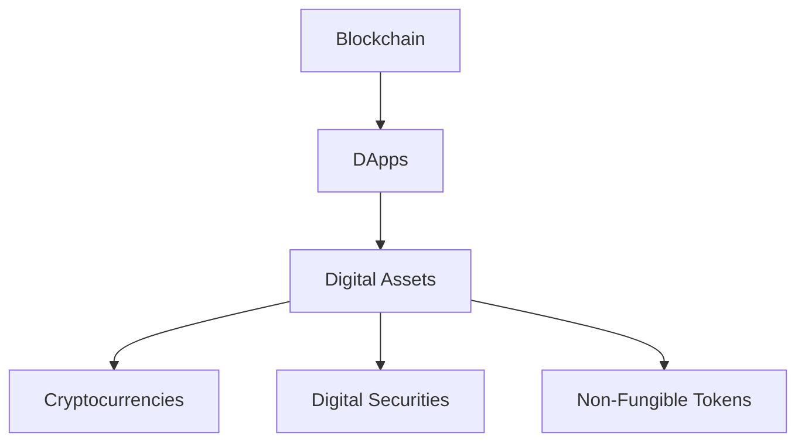

                 

Sure, let's think through the structure and content of our technical blog post on "Decentralized Applications of Blockchain in Digital Asset Management" step by step.

### Step 1: Introduction
Before diving into the technical details, it's important to provide an introduction to set the stage for the reader. This section should:
- **Context**: Introduce the concept of digital asset management and the rise of blockchain technology.
- **Importance**: Explain why decentralized applications (DApps) are significant in this context.
- **Reader's Goals**: State what the reader can expect to learn from the post.

**Introduction Content**:
> "In the digital age, the management of assets in various forms has become increasingly complex. Digital asset management, encompassing cryptocurrencies, digital securities, and non-fungible tokens (NFTs), has emerged as a critical area. Blockchain technology, with its inherent characteristics of decentralization and immutability, offers a promising solution to the challenges faced by traditional asset management systems. This blog post will explore the decentralized applications of blockchain in digital asset management, focusing on the principles, algorithms, and practical applications that make it a transformative technology."

### Step 2: Core Concepts and Relationships
To make the content easily digestible, we need to introduce the core concepts and their relationships. A Mermaid flowchart can visually represent these connections.

**Core Concepts and Mermaid Diagram**:
> **Core Concepts:**
> - **Blockchain**: A distributed ledger technology.
> - **Digital Asset**: Anything representing value in a digital form.
> - **Decentralized Application (DApp)**: An application built on a blockchain that operates independently of any central authority.

**Mermaid Diagram**:


### Step 3: Algorithm and Mathematical Models
In this section, we'll delve into the core algorithms and mathematical models that underpin blockchain technology and its applications in digital asset management.

**Algorithm and Mathematical Models**:
- **Consensus Algorithm**: Explaining how nodes in a blockchain network agree on the state of the blockchain.
  - **Proof of Work (PoW)**: A mechanism where nodes solve complex mathematical puzzles to validate transactions.
  - **Proof of Stake (PoS)**: A system where validators are chosen based on the number of coins they hold and are willing to 'stake'.
  
- **Hash Function**: A key component in blockchain security, which takes an input and produces a fixed-size string of characters, ensuring data integrity and protecting against tampering.

**Mathematical Model**:
$$
H(S) = \text{Hash}(S)
$$
where \(H\) is the hash function and \(S\) is the input string.

**Python Code Example** (using SHA-256):
```python
import hashlib

def calculate_hash(value):
    """Calculate the SHA-256 hash of a given value."""
    hash_object = hashlib.sha256(value.encode())
    hex_dig = hash_object.hexdigest()
    return hex_dig

hash_result = calculate_hash('Hello, World!')
print(hash_result)
```

### Step 4: Implementation and Case Study
This section will provide practical examples of blockchain implementation in digital asset management and analyze real-world case studies.

**Implementation**:
- Setting up a development environment for blockchain development.
- Creating a simple blockchain with Python.

**Case Study**:
- Analysis of a successful implementation of blockchain in digital asset management.

**Python Code Example** (Creating a Simple Blockchain):
```python
import hashlib
import json
from time import time

class Block:
    def __init__(self, index, transactions, timestamp, previous_hash):
        self.index = index
        self.transactions = transactions
        self.timestamp = timestamp
        self.previous_hash = previous_hash
        self.hash = self.calculate_hash()

    def calculate_hash(self):
        block_string = json.dumps(self.__dict__, sort_keys=True)
        return hashlib.sha256(block_string.encode()).hexdigest()

class Blockchain:
    def __init__(self):
        self.unconfirmed_transactions = []  # Transactions waiting to be added to a block
        self.chain = []
        self.create_genesis_block()

    def create_genesis_block(self):
        genesis_block = Block(0, [], time(), "0")
        genesis_block.hash = self.calculate_hash_of_block(genesis_block)
        self.chain.append(genesis_block)

    def calculate_hash_of_block(self, block):
        block_string = json.dumps(block.__dict__, sort_keys=True)
        return hashlib.sha256(block_string.encode()).hexdigest()

    def add_new_transaction(self, transaction):
        self.unconfirmed_transactions.append(transaction)

    def mine_block(self):
        if not self.unconfirmed_transactions:
            return False
        last_block = self.chain[-1]
        new_block = Block(index=last_block.index + 1,
                          transactions=self.unconfirmed_transactions,
                          timestamp=time(),
                          previous_hash=last_block.hash)
        new_block.hash = self.calculate_hash_of_block(new_block)
        self.chain.append(new_block)
        self.unconfirmed_transactions = []
        return new_block.index

# Example usage:
blockchain = Blockchain()
blockchain.add_new_transaction({'sender': 'Alice', 'recipient': 'Bob', 'amount': 10})
blockchain.mine_block()

for block in blockchain.chain:
    print(block.__dict__)
```

**Case Study Analysis** (e.g., Ethereum's implementation in digital asset management):

> "Ethereum, one of the most prominent blockchain platforms, has revolutionized digital asset management through its smart contract functionality. By allowing developers to create and deploy decentralized applications (DApps) on its blockchain, Ethereum has opened up new possibilities for managing digital assets. A notable example is the creation and trading of ERC-20 tokens, which represent a wide range of digital assets, from cryptocurrencies to digital securities."

### Step 5: Best Practices, Summary, and Future Outlook
The final section should include:
- **Best Practices**: Tips for developers and users.
- **Summary**: Recap of the key points.
- **Future Outlook**: Predictions and opportunities for the future.

**Best Practices**:
> - Ensure data privacy and security by using advanced encryption techniques.
> - Regularly update and audit smart contracts to prevent vulnerabilities.
> - Stay informed about regulatory changes and adapt accordingly.

**Summary**:
> "This post has explored the decentralized applications of blockchain in digital asset management, highlighting the core concepts, algorithms, and practical implementations. With the rapid growth of digital assets, blockchain technology offers a promising solution to traditional management challenges, providing transparency, security, and decentralization."

**Future Outlook**:
> "As blockchain technology continues to evolve, we can expect to see more innovative applications in digital asset management. The integration of blockchain with other technologies, such as artificial intelligence and the Internet of Things (IoT), will further enhance the efficiency and security of digital asset management systems."

### Final Step: Author Information
Finally, include the author information as specified.

**Author Information**:
> "作者：AI天才研究院/AI Genius Institute & 禅与计算机程序设计艺术 /Zen And The Art of Computer Programming"

Now that we have a structured plan, we can start to flesh out each section with detailed content, ensuring the final article meets the specified requirements. The next steps involve expanding on each section with more detailed information, examples, and explanations. With this structured approach, we can create a comprehensive and insightful technical blog post on the topic of blockchain in digital asset management.

