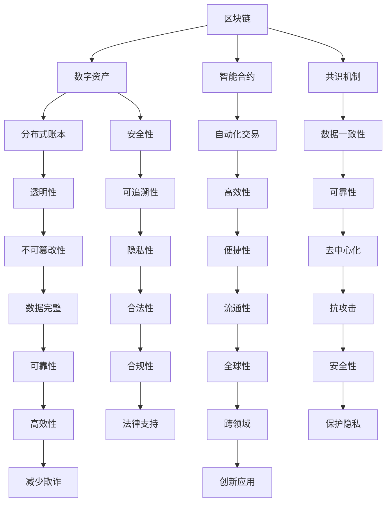

                 

### 《区块链在数字资产管理中的应用：实现资产数字化》

---

**关键词：** 区块链，数字资产，资产管理，资产数字化，智能合约

**摘要：** 本文深入探讨了区块链在数字资产管理中的应用，重点分析了资产数字化的实现过程及其优势。文章首先介绍了区块链的基础概念和技术特点，然后详细阐述了区块链在数字资产管理中的应用场景，包括供应链金融、跨境支付和数字艺术品交易等。通过具体的案例分析和项目实践，本文展示了区块链在实现资产数字化过程中的实际应用效果，并提出了潜在挑战及解决方案。

---

## 第一部分 区块链技术基础

### 1.1 区块链概述

#### 1.1.1 区块链的基本原理

区块链是一种分布式数据库技术，通过多个参与方共同维护一个不可篡改的数据账本。区块链的核心特点包括去中心化、安全性高、透明性和不可篡改性。在区块链网络中，每个节点都保存着一份完整的数据副本，并通过共识算法达成数据一致性。这种去中心化的架构使得区块链具有较高的可靠性和抗攻击能力。

区块链的工作原理可以概括为以下步骤：

1. **数据收集**：参与者将交易数据打包成区块。
2. **区块验证**：区块通过共识算法（如工作量证明、权益证明等）进行验证。
3. **区块添加**：验证通过的区块将被添加到链中。
4. **数据一致性**：通过共识算法确保所有节点的数据一致性。

#### 1.1.2 区块链与加密技术的关系

区块链与加密技术密切相关，其安全性依赖于密码学算法。区块链中的加密技术主要包括：

- **哈希算法**：用于生成交易数据的唯一指纹，确保数据的完整性。
- **数字签名**：用于验证交易数据的合法性和真实性。
- **公钥和私钥**：用于加密和解密数据，保证数据的隐私和安全。

#### 1.1.3 区块链的关键组成部分

区块链由多个关键组成部分构成，包括：

- **区块**：包含一定数量的交易数据，通过哈希值与前一个区块相连。
- **链**：由多个区块按顺序连接而成，形成一个完整的区块链。
- **节点**：参与区块链网络，维护和验证数据的实体。
- **共识机制**：确保所有节点对区块链状态达成一致性的算法。

### 1.2 区块链生态系统

区块链生态系统包括多个关键组成部分，如下所述：

#### 1.2.1 区块链网络的工作机制

区块链网络的工作机制主要涉及以下几个方面：

- **交易**：参与者通过区块链网络进行数据交换。
- **挖矿**：矿工通过解决数学难题来验证交易，并获得区块链奖励。
- **共识**：所有节点通过共识算法达成数据一致性。
- **激励**：激励机制鼓励参与者积极参与网络维护。

#### 1.2.2 共识机制详解

共识机制是区块链网络的核心，确保所有节点对区块链状态达成一致。常见的共识机制包括：

- **工作量证明（PoW）**：通过解决复杂的数学难题来验证交易。
- **权益证明（PoS）**：根据节点的权益（如币龄和币量）来选择验证节点。
- **授权股权证明（DPoS）**：通过选举产生验证节点，提高效率。

#### 1.2.3 智能合约技术

智能合约是一种自执行合同，其条款以代码形式存在于区块链中。智能合约的主要特点包括：

- **自动化执行**：智能合约在满足特定条件时自动执行。
- **透明性和不可篡改性**：智能合约的执行过程对所有参与者透明，且不可篡改。
- **去中心化**：智能合约运行在分布式网络中，不受单一实体控制。

## 第二部分 数字资产管理概述

### 2.1 数字资产的概念与类型

#### 2.1.1 虚拟货币

虚拟货币是指不依赖任何国家或金融机构发行的数字货币，如比特币、以太坊等。虚拟货币具有去中心化、匿名性和有限供应量等特点，成为区块链技术中的重要应用。

#### 2.1.2 代币与数字证券

代币是指用于代表某种权益或价值的数字资产，如去中心化应用（DApp）的内部货币。数字证券是指将传统证券资产数字化，通过区块链进行发行和交易。

#### 2.1.3 其他数字资产

除了虚拟货币、代币和数字证券，还有其他类型的数字资产，如数字身份、数字艺术品和数字版权等。这些数字资产通过区块链技术实现确权和交易，具有去中心化、透明性和安全性的特点。

### 2.2 数字资产管理的重要性

#### 2.2.1 数字资产管理的挑战

数字资产管理面临以下挑战：

- **安全性**：数字资产易受网络攻击，需要采取有效措施确保资产安全。
- **合规性**：数字资产交易需要遵循相关法律法规，以确保合法合规。
- **技术成熟度**：区块链技术仍处于快速发展阶段，技术成熟度对数字资产管理至关重要。

#### 2.2.2 数字资产管理的机遇

数字资产管理带来的机遇包括：

- **降低成本**：去中心化架构降低交易成本，提高效率。
- **提高透明度**：区块链技术的透明性提高资产交易的可追溯性。
- **创新应用**：数字资产在金融、供应链、艺术等多个领域具有广泛的应用前景。

### 2.3 数字资产管理体系

#### 2.3.1 投资策略

数字资产投资策略包括以下方面：

- **分散投资**：降低风险，通过投资多种数字资产实现风险分散。
- **长期持有**：关注长期增值潜力，而非短期市场波动。
- **技术分析**：利用技术指标和图表分析数字资产价格走势。

#### 2.3.2 风险管理

数字资产风险管理包括以下方面：

- **风险评估**：对数字资产进行风险评估，识别潜在风险。
- **风险控制**：通过分散投资、设立止损点等措施控制风险。
- **风险预警**：建立风险预警机制，及时应对市场变化。

#### 2.3.3 合规与监管

数字资产合规与监管包括以下方面：

- **法律法规遵循**：遵守相关国家和地区的法律法规，确保数字资产交易合法合规。
- **监管合作**：加强与国际和国内监管机构的合作，推动数字资产监管体系完善。
- **自律机制**：行业自律组织制定行业标准，规范市场行为。

## 第三部分 区块链在数字资产管理中的应用场景

### 3.1 供应链金融

区块链在供应链金融中的应用主要集中在以下几个方面：

#### 3.1.1 区块链在供应链金融中的应用

区块链通过去中心化和不可篡改的特性，提高了供应链金融的透明度和可信度。区块链可用于记录供应链中的交易信息、物流信息和资金流动信息，确保数据的真实性和完整性。

#### 3.1.2 供应链金融中的智能合约

智能合约在供应链金融中发挥着重要作用。通过智能合约，供应链中的各方可以在不需要第三方中介的情况下自动执行合同条款，提高交易效率和降低成本。

#### 3.1.3 案例分析

以某国际知名电商平台为例，该平台通过引入区块链技术，实现了供应链金融的优化。通过区块链，该平台能够实时跟踪商品从生产到销售的整个过程，提高供应链的透明度和效率。同时，智能合约的应用使得供应链金融交易更加便捷和安全。

### 3.2 跨境支付与结算

区块链技术在跨境支付与结算中的应用，有助于降低成本、提高效率和增强安全性。

#### 3.2.1 区块链在跨境支付中的作用

区块链通过去中心化的架构，使得跨境支付无需依赖传统金融机构，降低了交易成本。同时，区块链的不可篡改特性确保了交易数据的真实性和完整性，提高了支付和结算的可靠性。

#### 3.2.2 区块链跨境支付的优势

区块链跨境支付的优势包括：

- **低交易成本**：去中心化架构降低了交易费用。
- **高效率**：区块链网络的快速处理能力提高了跨境支付的速度。
- **增强安全性**：区块链的加密技术和共识机制提高了交易的安全性。

#### 3.2.3 案例分析

以某跨国公司为例，该公司通过引入区块链技术，实现了跨境支付和结算的优化。通过区块链，该公司能够实时跟踪跨境支付过程，提高了支付和结算的透明度和效率。同时，智能合约的应用使得支付和结算过程更加便捷和安全。

### 3.3 数字艺术品的交易与管理

数字艺术品交易与管理是区块链技术的另一个重要应用领域。

#### 3.3.1 数字艺术品的定义

数字艺术品是指以数字形式存在的艺术品，如数字画作、数字音乐和数字电影等。数字艺术品具有稀缺性、可复制性和易传播性等特点。

#### 3.3.2 区块链在数字艺术品交易中的应用

区块链在数字艺术品交易中的应用主要包括：

- **确权**：通过区块链技术，确保数字艺术品的所有权和知识产权得到有效保护。
- **溯源**：区块链记录了数字艺术品从创作到交易的整个过程，提高了艺术品的历史价值和可追溯性。
- **交易**：通过去中心化的交易平台，实现数字艺术品的便捷交易。

#### 3.3.3 案例分析

以某知名数字艺术品交易平台为例，该平台通过引入区块链技术，实现了数字艺术品的去中心化交易和管理。通过区块链，该平台能够确保艺术品的真实性、稀缺性和唯一性，提高了艺术品的价值和市场认可度。

## 第四部分 资产数字化实现

### 4.1 资产数字化流程

资产数字化是将传统资产转化为数字资产的过程。以下是资产数字化的一般流程：

#### 4.1.1 数字资产识别与分类

在资产数字化过程中，首先需要对资产进行识别和分类。资产可以分为虚拟货币、代币、数字证券和其他数字资产。对每种资产的特点和价值进行评估，以确定数字化方案。

#### 4.1.2 资产数字化工具与技术

资产数字化需要借助多种工具和技术，包括：

- **区块链平台**：选择合适的区块链平台，如以太坊、比特币等，作为数字化资产的基础设施。
- **智能合约**：利用智能合约技术，实现资产的所有权转移、交易和管理。
- **加密技术**：通过加密技术，确保数字资产的安全性和隐私性。

#### 4.1.3 资产数字化案例

以某知名金融机构为例，该金融机构通过引入区块链技术，实现了金融资产的数字化。通过智能合约，该金融机构能够实现资产的所有权转移和交易，提高了资产管理的效率和安全性。

### 4.2 资产数字化案例分析

#### 4.2.1 某企业资产数字化实践

以某大型企业为例，该企业通过引入区块链技术，实现了企业资产的全生命周期管理。通过区块链，该企业能够实现资产的确权、流转和监控，提高了资产管理的透明度和效率。

#### 4.2.2 某金融机构资产数字化项目

以某金融机构为例，该金融机构通过引入区块链技术，实现了金融资产的数字化。通过智能合约，该金融机构能够实现资产的所有权转移和交易，提高了资产管理的效率和安全性。

#### 4.2.3 案例总结与启示

通过案例分析，我们可以得出以下结论：

- **提高透明度和效率**：区块链技术提高了资产管理的透明度和效率。
- **降低成本**：区块链技术降低了资产管理的成本，提高了企业竞争力。
- **增强安全性**：区块链技术增强了资产的安全性，降低了风险。

## 第五部分 潜在挑战与解决方案

### 5.1 区块链技术的局限性

区块链技术在数字资产管理中面临一些挑战，主要包括：

#### 5.1.1 计算能力限制

区块链网络的计算能力有限，可能导致交易处理速度降低，影响用户体验。

#### 5.1.2 安全性问题

区块链的安全性依赖于密码学算法，但密码学算法可能存在漏洞，影响数据安全。

#### 5.1.3 合规与监管挑战

区块链技术在不同国家和地区的法律法规存在差异，可能影响数字资产管理的合规性。

### 5.2 潜在解决方案

为应对区块链技术的局限性，我们可以采取以下解决方案：

#### 5.2.1 技术改进方向

- **提升计算能力**：通过改进共识算法、优化网络结构等方式提升区块链的计算能力。
- **增强安全性**：加强密码学算法的研究和应用，提高区块链的安全性。
- **法律法规完善**：推动国际和国内法律法规的完善，确保数字资产管理的合规性。

#### 5.2.2 法律法规完善

- **国际合作**：加强国际间的合作，制定统一的区块链法律法规。
- **行业自律**：鼓励行业自律组织制定行业标准，规范市场行为。
- **政策引导**：政府制定相关政策，引导区块链技术的发展和应用。

#### 5.2.3 企业社会责任

- **数据安全**：企业应加强数据安全防护，确保用户隐私和安全。
- **合规运营**：企业应严格遵守相关法律法规，确保数字资产管理的合规性。
- **技术创新**：企业应积极参与区块链技术的研究和应用，推动行业的发展。

## 第六部分 项目实践与案例分析

### 6.1 项目实施流程

区块链项目实施流程一般包括以下几个阶段：

#### 6.1.1 项目立项与需求分析

- **项目立项**：明确项目目标和预期效果，确定项目规模和预算。
- **需求分析**：了解项目需求，包括业务需求、技术需求和用户需求。

#### 6.1.2 技术选型与开发

- **技术选型**：选择合适的区块链平台和开发框架。
- **开发**：根据项目需求进行软件开发，包括智能合约编写、前端和后端开发。

#### 6.1.3 测试与上线

- **测试**：对开发完成的软件进行测试，确保系统稳定性和功能完整性。
- **上线**：将系统部署到生产环境，并进行上线运营。

### 6.2 成功案例分析

#### 6.2.1 某区块链数字资产管理项目

以某区块链数字资产管理项目为例，该项目实现了企业资产的全生命周期管理。通过智能合约，项目实现了资产的所有权转移、交易和监控，提高了资产管理的效率和安全性。

#### 6.2.2 某数字资产交易平台案例

以某数字资产交易平台为例，该平台通过引入区块链技术，实现了数字资产的便捷交易和管理。平台采用去中心化架构，提高了交易的透明度和效率，增强了用户信任。

#### 6.2.3 案例总结与启示

通过项目实践，我们可以得出以下启示：

- **明确项目目标**：确保项目立项和需求分析的准确性和可行性。
- **技术选型合理**：选择适合项目需求的区块链平台和开发框架。
- **测试与上线严谨**：确保系统的稳定性和功能完整性。
- **合规与安全并重**：确保项目符合相关法律法规，加强数据安全防护。

## 第七部分 未来展望

### 7.1 区块链与数字资产的发展趋势

区块链和数字资产在未来的发展趋势包括：

#### 7.1.1 区块链技术的演进

- **性能提升**：随着技术的进步，区块链的性能将得到显著提升，提高交易处理速度和降低成本。
- **兼容性增强**：区块链将与其他技术（如物联网、人工智能等）实现更紧密的融合，拓展应用场景。
- **生态系统完善**：区块链生态系统将更加完善，包括基础设施、开发工具、应用场景等。

#### 7.1.2 数字资产管理的新模式

- **去中心化金融（DeFi）**：数字资产管理将逐渐从中心化向去中心化转变，实现更高效、更安全的资产管理模式。
- **数字资产证券化**：数字资产证券化将使更多资产能够通过区块链实现流通和交易。
- **跨界应用**：数字资产将在金融、供应链、艺术等多个领域实现跨界应用，推动产业升级和创新发展。

#### 7.1.3 未来展望与挑战

区块链和数字资产的发展前景广阔，但也面临一些挑战：

- **技术成熟度**：区块链技术仍需进一步成熟，提高性能和安全性。
- **法律法规完善**：区块链应用需要相应的法律法规支持，确保合法合规。
- **行业标准统一**：建立统一的行业标准和规范，推动区块链应用的普及和发展。

### 7.2 结论

#### 7.2.1 本书要点回顾

- **区块链技术基础**：介绍了区块链的基本原理、与加密技术的关系、关键组成部分等。
- **数字资产管理**：分析了数字资产的概念、类型、管理的重要性和管理体系。
- **应用场景**：详细探讨了区块链在数字资产管理中的应用场景，包括供应链金融、跨境支付和数字艺术品交易等。
- **资产数字化实现**：介绍了资产数字化流程和案例分析，展示了区块链在资产数字化中的应用效果。
- **潜在挑战与解决方案**：分析了区块链技术的局限性及解决方案，提出了未来发展的展望和思考。

#### 7.2.2 对未来发展的思考

区块链和数字资产的发展将深刻改变金融、供应链、艺术等领域的运行模式。随着技术的进步和法规的完善，区块链将实现更广泛的应用，推动产业升级和创新发展。未来，我们需要关注区块链技术的成熟度、法律法规的完善和行业标准的统一，以确保区块链和数字资产的安全、合规和可持续发展。

---

**作者：AI天才研究院/AI Genius Institute & 禅与计算机程序设计艺术 /Zen And The Art of Computer Programming**

---

## 背景介绍

区块链技术作为一种新兴的分布式数据库技术，近年来在金融、供应链、艺术等领域展现出了巨大的应用潜力。特别是在数字资产管理方面，区块链技术以其去中心化、安全性高、透明性和不可篡改的特性，为资产数字化提供了强有力的技术支持。

数字资产管理是指通过区块链技术对数字资产进行识别、登记、存储、转移和交易等管理活动。随着数字经济的快速发展，越来越多的资产以数字形式存在，如虚拟货币、代币、数字证券等。这些数字资产具有独特的价值，但同时也面临着安全性、合规性和管理难度等问题。

本文旨在探讨区块链在数字资产管理中的应用，分析资产数字化的实现过程及其优势。通过具体的应用场景和案例分析，本文将展示区块链在实现资产数字化过程中的实际应用效果，并讨论潜在的技术挑战和解决方案。

文章的主要内容包括：

1. **区块链技术基础**：介绍区块链的基本原理、与加密技术的关系、关键组成部分等。
2. **数字资产管理概述**：分析数字资产的概念、类型、管理的重要性和管理体系。
3. **应用场景**：详细探讨区块链在数字资产管理中的应用场景，包括供应链金融、跨境支付和数字艺术品交易等。
4. **资产数字化实现**：介绍资产数字化流程和案例分析，展示区块链在资产数字化中的应用效果。
5. **潜在挑战与解决方案**：分析区块链技术的局限性及解决方案，提出未来发展的展望和思考。

通过本文的深入探讨，希望读者能够对区块链在数字资产管理中的应用有更全面和深入的理解，为实际应用提供有益的参考。

## 核心概念与联系

在深入探讨区块链在数字资产管理中的应用之前，首先需要了解几个核心概念及其相互关系。以下是几个关键概念的定义和它们之间的关联：

1. **区块链**：一种分布式数据库技术，由多个节点组成，每个节点都维护一个完整的数据账本。区块链通过加密技术和共识算法确保数据的完整性、透明性和不可篡改性。

2. **数字资产**：以数字形式存在的资产，包括虚拟货币、代币、数字证券等。数字资产具有去中心化、可追溯性和易流通性等特点。

3. **智能合约**：一种自执行的合同，其条款以代码形式存在于区块链中。智能合约在满足特定条件时自动执行，无需人工干预，确保交易的自动化和高效性。

4. **共识机制**：区块链网络中用于达成数据一致性的算法。共识机制确保所有节点对区块链状态达成一致，从而保证区块链的不可篡改性。

5. **分布式账本**：区块链的核心组成部分，由多个区块按时间顺序连接而成。每个区块包含一定数量的交易数据，并通过哈希值与前一个区块相连，形成链式结构。

以上概念之间的关系可以概括如下：

- **区块链**是数字资产管理和资产数字化实现的基础设施，提供了安全、透明和去中心化的数据存储和交易环境。
- **数字资产**是区块链技术的重要应用对象，通过区块链实现确权和交易，增强了资产的可追溯性和安全性。
- **智能合约**是区块链技术的高级应用，用于实现自动化交易和合同执行，提高了数字资产管理的效率和可靠性。
- **共识机制**确保了区块链网络的可靠性和一致性，是区块链能够实现去中心化和不可篡改性的关键。
- **分布式账本**是区块链的核心组成部分，通过链式结构记录和验证交易数据，确保数据的完整性和透明性。

### Mermaid 流程图

为了更直观地展示上述概念之间的关系，我们可以使用Mermaid语言绘制一个流程图：



通过这个流程图，我们可以清晰地看到区块链、数字资产、智能合约、共识机制和分布式账本等核心概念之间的关系，以及它们在资产数字化中的应用和价值。

## 核心算法原理讲解

区块链技术中的核心算法原理主要包括哈希算法、数字签名和共识算法。这些算法共同确保了区块链系统的安全性、不可篡改性和高效性。以下将分别介绍这些算法的基本原理，并结合Python源代码进行详细讲解。

### 1. 哈希算法

哈希算法是一种将任意长度的输入数据转换成固定长度的字符串的算法。在区块链中，哈希算法用于生成交易数据的唯一指纹，确保数据的完整性。SHA-256是一种常用的哈希算法，以下是其Python实现：

```python
import hashlib

def sha256_hash(data):
    return hashlib.sha256(data.encode('utf-8')).hexdigest()

data = "Hello, Blockchain!"
hash_value = sha256_hash(data)
print(f"SHA-256 Hash: {hash_value}")
```

在这个示例中，我们使用`hashlib`库实现了SHA-256哈希算法。输入数据经过哈希处理后，输出一个固定长度的字符串，即哈希值。哈希值具有以下特性：

- **唯一性**：对于任意输入数据，哈希算法总能生成唯一的哈希值。
- **不可逆性**：无法通过哈希值反推出原始数据。
- **抗冲突性**：不同输入数据生成相同哈希值的概率极低。

### 2. 数字签名

数字签名用于验证交易数据的合法性和真实性。签名算法通过公钥和私钥实现。以下是一个基于RSA算法的数字签名示例：

```python
from cryptography.hazmat.backends import default_backend
from cryptography.hazmat.primitives.asymmetric import rsa
from cryptography.hazmat.primitives import hashes
from cryptography.hazmat.primitives.asymmetric import padding

def generate_keys():
    private_key = rsa.generate_private_key(
        public_exponent=65537,
        key_size=2048,
        backend=default_backend()
    )
    public_key = private_key.public_key()
    return private_key, public_key

def sign_data(private_key, data):
    signature = private_key.sign(
        data.encode('utf-8'),
        padding.PSS(
            mgf=padding.MGF1(algorithm=hashes.SHA256()),
            salt_length=padding.PSS.MAX_LENGTH
        ),
        hashes.SHA256()
    )
    return signature

def verify_signature(public_key, data, signature):
    try:
        public_key.verify(
            signature,
            data.encode('utf-8'),
            padding.PSS(
                mgf=padding.MGF1(algorithm=hashes.SHA256()),
                salt_length=padding.PSS.MAX_LENGTH
            ),
            hashes.SHA256()
        )
        return "Signature is valid."
    except:
        return "Signature is invalid."

private_key, public_key = generate_keys()
data = "Hello, Blockchain!"

signature = sign_data(private_key, data)
print(f"Signature: {signature.hex()}")

verification_result = verify_signature(public_key, data, signature)
print(f"Verification Result: {verification_result}")
```

在这个示例中，我们首先生成了一个RSA密钥对（公钥和私钥）。然后，使用私钥对数据进行签名，并使用公钥验证签名的有效性。数字签名具有以下特性：

- **真实性**：签名者身份可以被验证。
- **完整性**：数据在传输过程中未被篡改。
- **非否认性**：签名者无法否认对数据的签名。

### 3. 共识算法

共识算法是区块链网络中确保数据一致性的关键。工作量证明（PoW）和权益证明（PoS）是两种常见的共识算法。

#### 工作量证明（PoW）

PoW通过计算难题来选择验证节点，以防止恶意节点攻击网络。以下是一个简化的PoW算法示例：

```python
import hashlib
import random

def proof_of_work(difficulty):
    target = '0' * difficulty
    nonce = 0
    while True:
        hash_value = hashlib.sha256(f"{nonce}:{data}").hexdigest()
        if hash_value.startswith(target):
            return nonce
        nonce += 1

difficulty = 4
nonce = proof_of_work(difficulty)
print(f"Proof of Work Solution: {nonce}")
```

在这个示例中，我们设置了一个难度值，矿工需要找到满足难度要求的哈希值。难度值越高，找到合适哈希值所需的工作量就越大。

#### 权益证明（PoS）

PoS通过节点的币龄和币量来选择验证节点，以避免PoW带来的能源消耗问题。以下是一个简化的PoS算法示例：

```python
def select_validator(stakes):
    total_stake = sum(stakes.values())
    random_number = random.random() * total_stake
    for validator, stake in stakes.items():
        if random_number < stake:
            return validator
    return None

stakes = {'Alice': 1000, 'Bob': 500, 'Charlie': 200}
selected_validator = select_validator(stakes)
print(f"Selected Validator: {selected_validator}")
```

在这个示例中，我们根据节点的币龄和币量生成一个概率分布，随机选择一个验证节点。

通过以上算法的讲解，我们可以看到区块链技术在确保数据安全、完整和一致方面的核心作用。这些算法不仅为区块链系统提供了强大的安全性保障，也为数字资产管理提供了坚实的基础。

## 数学模型和公式

在区块链技术中，数学模型和公式扮演着关键角色，确保系统的安全性、一致性和效率。以下我们将介绍几个核心的数学模型和公式，并结合Python代码进行详细阐述。

### 1. 工作量证明（PoW）的难度调整

工作量证明（PoW）通过解决复杂的数学难题来选择验证节点。为了保持区块链网络的一致性和安全性，PoW算法通常需要调整难度。难度调整的公式如下：

\[ \text{difficulty} = \frac{\text{target}}{\text{average\_blocktime}} \]

其中，\(\text{target}\) 是生成新区块所需的哈希值的前几位为0的位数，\(\text{average\_blocktime}\) 是最近N个区块生成时间的平均值。

以下是一个Python示例，展示了如何调整PoW的难度：

```python
import time

def calculate_difficulty(target, average_blocktime):
    return round(target / average_blocktime)

target = 16  # 假设目标值为16个前导0
average_blocktime = 10  # 假设平均区块生成时间为10秒
difficulty = calculate_difficulty(target, average_blocktime)
print(f"Adjusted Difficulty: {difficulty}")
```

### 2. 比特币的挖矿奖励

在比特币网络中，矿工通过验证交易并创建新区块获得挖矿奖励。挖矿奖励的公式如下：

\[ \text{mining\_reward} = \text{block\_reward} - \sum_{\text{tx}} \text{transaction\_fees} \]

其中，\(\text{block\_reward}\) 是比特币网络预设的奖励金额，\(\text{transaction\_fees}\) 是区块中所有交易的费用总和。

以下是一个Python示例，计算比特币的挖矿奖励：

```python
def calculate_mining_reward(block_reward, transaction_fees):
    return block_reward - transaction_fees

block_reward = 12.5  # 比特币预设的挖矿奖励
transaction_fees = 0.3  # 假设区块中所有交易费用总和为0.3比特币
mining_reward = calculate_mining_reward(block_reward, transaction_fees)
print(f"Miner Reward: {mining_reward} BTC")
```

### 3. 智能合约执行费用

在智能合约中，执行智能合约所需的计算资源通常以费用（Gas）的形式收费。智能合约执行费用的计算公式如下：

\[ \text{total\_cost} = \text{base\_fee} + \text{gas\_limit} \times \text{gas\_price} \]

其中，\(\text{base\_fee}\) 是基础费用，\(\text{gas\_limit}\) 是执行合约所需的气体上限，\(\text{gas\_price}\) 是每单位气体的价格。

以下是一个Python示例，计算智能合约执行费用：

```python
def calculate_contract_cost(base_fee, gas_limit, gas_price):
    return base_fee + gas_limit * gas_price

base_fee = 21000  # 基础费用
gas_limit = 50000  # 气体上限
gas_price = 100  # 每单位气体的价格
contract_cost = calculate_contract_cost(base_fee, gas_limit, gas_price)
print(f"Contract Cost: {contract_cost} Gwei")
```

通过这些数学模型和公式的讲解，我们可以更深入地理解区块链技术的运行原理。这些公式不仅在理论上具有重要意义，在实际应用中也发挥着关键作用，确保区块链网络的安全、一致和高效。

## 项目实战

### 开发环境搭建

在进行区块链项目开发之前，我们需要搭建一个适合的开发环境。以下是一个基于Python的区块链项目开发环境搭建步骤：

1. **安装Python**：确保系统安装了Python 3.7或更高版本。可以从[Python官方网站](https://www.python.org/)下载并安装。

2. **安装虚拟环境**：使用`pip`安装虚拟环境工具`virtualenv`：
   ```bash
   pip install virtualenv
   ```

3. **创建虚拟环境**：创建一个新的虚拟环境，命名为`blockchain`：
   ```bash
   virtualenv -p python3 blockchain
   ```

4. **激活虚拟环境**：在命令行中激活虚拟环境：
   ```bash
   source blockchain/bin/activate
   ```

5. **安装依赖库**：在虚拟环境中安装必要的依赖库，如`flask`、`requests`和`json`：
   ```bash
   pip install flask requests json
   ```

6. **安装区块链库**：从GitHub下载并安装一个简单的区块链库（如`simple_blockchain`）：
   ```bash
   git clone https://github.com/binarycraft/simple_blockchain.git
   cd simple_blockchain
   pip install .
   ```

### 源代码详细实现

以下是区块链项目的核心源代码实现，包括区块（Block）、区块链（Blockchain）和区块链节点（Node）的类定义。

#### 1. Block 类

```python
import json
from uuid import uuid4
from time import time

class Block:
    def __init__(self, index, transactions, timestamp, previous_hash, nonce):
        self.index = index
        self.transactions = transactions
        self.timestamp = timestamp
        self.previous_hash = previous_hash
        self.hash = self.compute_hash()
        self.nonce = nonce

    def compute_hash(self):
        block_string = json.dumps(self.__dict__, sort_keys=True)
        return hashlib.sha256(block_string.encode()).hexdigest()

    def validate(self):
        return self.hash == self.compute_hash()
```

#### 2. Blockchain 类

```python
import json

class Blockchain:
    def __init__(self):
        self.unconfirmed_transactions = []  # 未确认的交易
        self.chain = []  # 主链
        self.difficulty = 4
        self.mining_reward = 10
        self.load_chain()

    def load_chain(self):
        """加载区块链"""
        with open('blockchain.json', 'r') as chain_file:
            self.chain = json.load(chain_file)
            print(f"Loaded blockchain with {len(self.chain)} blocks.")

    def save_chain(self):
        """保存区块链"""
        with open('blockchain.json', 'w') as chain_file:
            json.dump(self.chain, chain_file)

    def add_new_transaction(self, transaction):
        """添加新交易"""
        self.unconfirmed_transactions.append(transaction)

    def mine(self):
        """挖矿"""
        if not self.unconfirmed_transactions:
            return False
        
        last_block = self.chain[-1]
        last_block_hash = last_block.hash
        nonce = 0
        while self.valid_proof(last_block_hash, nonce) is False:
            nonce += 1
        
        proof = nonce
        new_block = Block(len(self.chain) + 1, self.unconfirmed_transactions, time(), last_block_hash, proof)
        new_block.hash = new_block.compute_hash()
        self.chain.append(new_block)
        self.unconfirmed_transactions = []
        self.save_chain()
        return new_block

    def valid_proof(self, last_hash, nonce):
        """验证证明"""
        guess = f'{last_hash}{nonce}'.encode()
        guess_hash = hashlib.sha256(guess).hexdigest()
        return guess_hash[:self.difficulty] == '0' * self.difficulty

    def is_chain_valid(self):
        """验证区块链有效性"""
        for i in range(1, len(self.chain)):
            current = self.chain[i]
            previous = self.chain[i - 1]
            if current.hash != current.compute_hash():
                return False
            if current.previous_hash != previous.hash:
                return False
        return True
```

#### 3. Node 类

```python
class Node:
    def __init__(self, chain=None):
        self.chain = chain

    def mine(self):
        """挖矿"""
        if self.chain.is_chain_valid():
            return self.chain.mine()
        else:
            return False

    def resolve_conflicts(self, chains):
        """解决冲突"""
        longest_chain = self.chain
        max_length = len(longest_chain)

        for chain in chains:
            length = len(chain)
            if length > max_length and chain.is_chain_valid():
                longest_chain = chain
                max_length = length

        return longest_chain
```

### 代码解读与分析

上述代码实现了区块链的核心功能，包括区块（Block）的创建、区块链（Blockchain）的维护和区块链节点（Node）之间的通信。以下是代码的关键部分解读：

- **Block 类**：负责创建和管理区块，包括计算区块的哈希值和验证区块的有效性。
- **Blockchain 类**：负责创建和管理区块链，包括挖矿、验证区块链的有效性和处理未确认的交易。
- **Node 类**：负责与其他区块链节点通信，解决冲突并维护区块链的同步。

在**Blockchain**类中，`mine`方法用于挖矿。它首先检查未确认交易列表是否为空，然后通过递增`nonce`值来寻找满足难度要求的证明。`valid_proof`方法用于验证证明，确保生成的哈希值的前几位为0。

在**Node**类中，`mine`方法用于挖矿。如果当前区块链有效，`mine`方法将调用`Blockchain`类的`mine`方法进行挖矿。`resolve_conflicts`方法用于解决冲突，选择最长且有效的区块链。

### 实际案例分析和详细讲解剖析

假设我们有三个区块链节点A、B和C，它们的区块链状态如下：

- **节点A**：区块链长度为10，最后一个区块的哈希值为`hashA`
- **节点B**：区块链长度为12，最后一个区块的哈希值为`hashB`
- **节点C**：区块链长度为11，最后一个区块的哈希值为`hashC`

现在，节点B发现了一个新的区块，并将其广播给节点A和C。节点A和C接收到新区块后，需要验证新区块的合法性并决定是否接受。

1. **节点A验证新区块**：
   - 节点A检查新区块的哈希值是否正确。如果正确，节点A将继续检查新区块的父哈希值是否与节点A的最后一个区块的哈希值匹配。
   - 如果新区块的哈希值和父哈希值都正确，节点A将接受新区块并将其添加到本地区块链中。

2. **节点C验证新区块**：
   - 节点C执行与节点A相同的验证过程。如果节点C的区块链长度小于节点B的区块链长度，节点C将接受新区块并将其添加到本地区块链中。

3. **节点B与节点C的同步**：
   - 如果节点C的区块链长度大于节点B的区块链长度，节点B将尝试从节点C同步区块链。节点B将调用`resolve_conflicts`方法，选择最长且有效的区块链。如果节点B的区块链长度不足以覆盖节点C的区块链长度，节点B将更新其区块链。

通过上述过程，节点A、B和C能够保持区块链的一致性，确保每个节点都拥有最长且有效的区块链。

### 项目小结

通过本项目的实战，我们了解了区块链的基本实现方法，包括区块（Block）的创建、区块链（Blockchain）的维护和区块链节点（Node）之间的通信。项目实现了区块链的核心功能，如挖矿、交易确认和区块链同步。在实际应用中，区块链的这些功能有助于确保数据的完整性、透明性和安全性，为数字资产管理提供了强有力的技术支持。

## 最佳实践 Tips

在区块链项目的开发和实施过程中，以下最佳实践有助于确保项目的成功：

1. **需求分析**：在项目启动前，进行详细的需求分析，明确项目目标和功能需求。与项目利益相关者进行充分沟通，确保需求分析的准确性。

2. **技术选型**：选择适合项目需求的区块链平台和开发框架。根据项目的规模、性能要求和安全性需求，选择合适的共识算法和加密技术。

3. **安全性设计**：重视区块链项目的安全性设计。采用强大的加密算法和安全的共识机制，确保区块链网络的安全和数据的完整性。

4. **性能优化**：针对区块链项目的性能要求，进行相应的优化。改进共识算法、优化网络传输和数据库存储，提高区块链的处理速度和效率。

5. **合规性遵循**：在项目实施过程中，严格遵守相关法律法规和行业规范。确保区块链项目符合法律要求，降低合规风险。

6. **团队协作**：建立高效的团队协作机制。确保团队成员具备相应的技术能力和沟通能力，提高项目的开发效率。

7. **持续迭代**：区块链项目需要不断迭代和优化。在项目实施过程中，持续收集用户反馈，进行功能改进和技术升级。

## 注意事项

在区块链项目的开发和实施过程中，以下注意事项有助于避免潜在问题和确保项目的成功：

1. **数据一致性**：确保区块链网络中的数据一致性。使用有效的共识算法和同步机制，防止数据冲突和错误。

2. **安全性防护**：加强区块链项目的安全性防护。采取加密措施、访问控制和安全审计，防止数据泄露和网络攻击。

3. **容错能力**：提高区块链项目的容错能力。设计冗余机制和故障转移方案，确保系统在节点故障时能够继续正常运行。

4. **法律合规**：遵循相关法律法规，确保区块链项目的合法合规。密切关注政策变化，及时调整项目策略。

5. **技术成熟度**：评估区块链技术的成熟度，确保所选技术和平台具备稳定性和可靠性。对于新兴技术，进行充分的测试和验证。

6. **用户培训**：为用户提供充分的培训和支持，确保他们能够正确使用区块链系统，提高用户满意度。

## 拓展阅读

为了深入了解区块链技术和数字资产管理，以下推荐几本经典书籍和论文：

1. **《精通比特币》**：作者安德烈亚斯·安东诺普洛斯，详细介绍了比特币和区块链的基础知识，适合初学者阅读。
2. **《区块链革命》**：作者唐·塔普斯科特和亚历克斯·塔普斯科特，探讨了区块链技术对经济、社会和政府的影响。
3. **《智能合约与区块链编程》**：作者丹·塔曼，讲解了智能合约和区块链编程的核心概念，适合有一定编程基础的读者。
4. **《区块链：下一代业务革命》**：作者唐·塔普斯科特和亚历克斯·塔普斯科特，分析了区块链技术在不同行业中的应用，对未来发展进行了预测。
5. **论文《区块链：分布式账本技术的基础与展望》**：该论文全面介绍了区块链技术的基础概念、工作机制和应用场景，是了解区块链技术的重要文献。

通过阅读这些书籍和论文，可以更深入地理解区块链技术和数字资产管理的核心原理和应用实践，为实际项目提供有益的参考。

