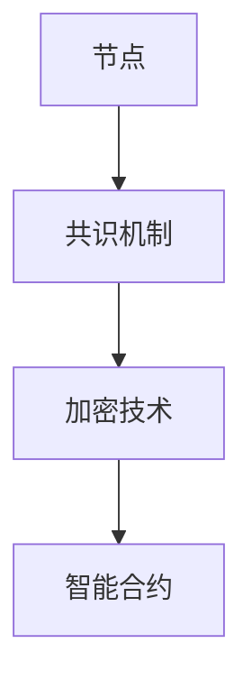
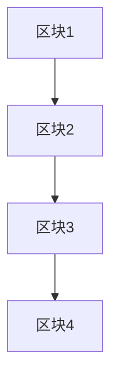

                 

## 《区块链在数字资产继承中的应用：解决数字遗产传承问题》

### 关键词

- 区块链
- 数字资产
- 数字遗产继承
- 智能合约
- 非同质化代币（NFT）

### 摘要

本文旨在探讨区块链技术在数字资产继承中的应用，分析其在解决数字遗产传承问题上的优势与挑战。文章首先介绍了区块链、数字资产以及数字遗产继承的基本概念，接着详细讲解了区块链在数字资产继承中的核心原理与应用技术，最后通过具体案例展示了区块链在数字遗产继承中的实际应用，并对未来趋势进行了展望。

## 第一部分：基础概念与核心原理

### 第1章 区块链与数字资产概述

#### 1.1 区块链的基本原理

区块链是一种分布式数据库技术，其核心特点是去中心化、安全性高、不可篡改。区块链的基本原理可以概括为以下几点：

1. **去中心化**：区块链没有中心化的管理者，所有的交易记录都由网络中的节点共同维护。
2. **共识机制**：节点通过共识机制达成一致，确保区块链的可靠性和安全性。
3. **加密技术**：区块链使用加密技术保护数据的安全性和隐私性。
4. **智能合约**：智能合约是区块链上的自动化合同，能够自动执行符合预定条件的规定。

**图 1.1 区块链的基本架构**



#### 1.2 数字资产的概念与分类

数字资产是指以数字形式存在的资产，包括虚拟货币、数字证书、数字版权等。数字资产可以根据其特性和用途进行分类：

1. **虚拟货币**：如比特币、以太坊等，具有交易和支付功能。
2. **数字证书**：如数字身份认证证书、数字签名证书等，用于身份验证和数据加密。
3. **数字版权**：如电子书、音乐、视频等，具有版权保护和交易功能。

数字资产与区块链的关联在于，区块链提供了一种安全、可靠且去中心化的存储和交易方式，使得数字资产能够更加便捷地进行交易和流转。

#### 1.3 数字遗产继承的挑战

数字遗产继承面临着许多传统继承模式无法解决的问题：

1. **数字资产分散**：数字资产可能分散存储在不同的平台和设备上，给继承带来困难。
2. **身份认证**：数字资产的继承需要确切的身份认证，传统的身份认证系统可能无法满足。
3. **安全性**：数字资产容易受到网络攻击和欺诈，需要确保资产的安全性。

区块链技术提供了解决这些挑战的潜力，通过去中心化、加密技术和智能合约等功能，可以确保数字资产的安全、可靠和透明地继承。

### 第2章 区块链在数字资产继承中的核心原理

#### 2.1 智能合约在数字资产继承中的应用

智能合约是区块链上的自动化合同，能够根据预定的条件自动执行合同条款。在数字资产继承中，智能合约可以用于确保继承过程的透明性和安全性。

```python
# 伪代码：智能合约在数字资产继承中的应用
def inheritance_contract(owner, heir, asset):
    if owner == deceased:
        transfer(asset, heir)
        print("Inheritance process completed.")
    else:
        print("You are not authorized to access this contract.")
```

智能合约通过预定的条件自动执行资产转移，确保继承过程的透明性和不可篡改性。

#### 2.2 分布式账本在数字资产继承中的角色

分布式账本是区块链的核心组成部分，它记录了所有的交易记录。在数字资产继承中，分布式账本可以确保资产的完整性和透明性。

分布式账本的数据结构通常包括区块和链。每个区块包含一定数量的交易记录，并且每个区块都与前一个区块通过哈希值连接，形成区块链。

**图 2.1 分布式账本的数据结构**



分布式账本通过加密技术和共识机制确保数据的完整性和安全性，任何对数据的篡改都会被发现并拒绝。

#### 2.3 非同质化代币（NFT）与数字资产继承

非同质化代币（NFT）是区块链上的独特数字资产，代表独一无二的物品或权利。在数字资产继承中，NFT可以用于继承独一无二的数字资产，如数字艺术品、虚拟地产等。

NFT具有唯一性和不可替代性，确保了数字资产的独特性和继承的合法性。

## 第二部分：应用技术与案例分析

### 第3章 区块链在数字资产继承中的具体应用

#### 3.1 智能合约设计与实现

智能合约是区块链在数字资产继承中的关键应用。以下是一个简单的智能合约示例，用于实现数字资产继承。

```python
# Python代码：数字资产继承智能合约
pragma solidity ^0.8.0;

contract Inheritance {
    address public owner;
    address public heir;
    uint256 public deadline;

    constructor(address _heir, uint256 _deadline) {
        owner = msg.sender;
        heir = _heir;
        deadline = _deadline;
    }

    function claimInheritance() public {
        require(msg.sender == heir, "Only the heir can claim the inheritance.");
        require(block.timestamp >= deadline, "The deadline has not passed.");
        // Transfer assets to the heir
        payable(heir).transfer(address(this).balance);
    }
}
```

#### 3.2 分布式账本在数字资产继承中的实践

分布式账本记录了所有交易记录，确保数字资产继承的透明性和不可篡改性。以下是一个简单的分布式账本实现。

```python
# Python代码：分布式账本实现
import hashlib

class Block:
    def __init__(self, transactions, previous_hash):
        self.transactions = transactions
        self.previous_hash = previous_hash
        self.hash = self.compute_hash()

    def compute_hash(self):
        block_string = "{}-{}".format(self.previous_hash, self.transactions)
        return hashlib.sha256(block_string.encode()).hexdigest()

class Blockchain:
    def __init__(self):
        self.unconfirmed_transactions = []
        self.chain = []
        self.create_genesis_block()

    def create_genesis_block(self):
        genesis_block = Block([], "0")
        genesis_block.hash = genesis_block.compute_hash()
        self.chain.append(genesis_block)

    def add_new_transaction(self, transaction):
        self.unconfirmed_transactions.append(transaction)

    def mine(self):
        if not self.unconfirmed_transactions:
            return False
        last_block = self.chain[-1]
        new_block = Block(self.unconfirmed_transactions, last_block.hash)
        new_block.hash = new_block.compute_hash()
        self.chain.append(new_block)
        self.unconfirmed_transactions = []
        return new_block.hash
```

#### 3.3 NFT在数字遗产继承中的实际应用

NFT在数字遗产继承中具有重要作用，可以确保数字资产的唯一性和继承的合法性。以下是一个简单的NFT继承案例。

```python
# Python代码：NFT继承案例
import json
from web3 import Web3
from solc.compile import compile_source
from eth_account import Account

# 编译智能合约
source_code = '''
pragma solidity ^0.8.0;

contract NFTInheritance {
    address public owner;
    address public heir;
    uint256 public deadline;

    constructor(address _heir, uint256 _deadline) {
        owner = msg.sender;
        heir = _heir;
        deadline = _deadline;
    }

    function claimNFT() public {
        require(msg.sender == heir, "Only the heir can claim the NFT.");
        require(block.timestamp >= deadline, "The deadline has not passed.");
        // Transfer NFT to the heir
        // 这里需要调用NFT合约的转移函数
    }
}
'''

compiled_sol = compile_source(source_code)
contract_id, contract_interface = compiled_sol.popitem()
bytecode = contract_interface['bin']
abi = contract_interface['abi']

# 部署智能合约
w3 = Web3(Web3.HTTPProvider('https://ropsten.infura.io/v3/your_project_id'))
contract = w3.eth.contract(abi=abi)
bytecode = w3.toBytes(hex='0x' + bytecode)
contract = contract.constructor().buildTransaction({
    'chainId': 3,
    'gas': 2000000,
    'gasPrice': w3.toWei('50', 'gwei'),
    'nonce': w3.eth.getTransactionCount(account.address),
    'data': bytecode,
})
tx_hash = w3.eth.sendTransaction(contract)
tx_receipt = w3.eth.waitForTransactionReceipt(tx_hash)
contract_address = tx_receipt.contractAddress

# 创建NFT继承智能合约实例
nft_inheritance_contract = w3.eth.contract(address=contract_address, abi=abi)

# 调用claimNFT函数
tx_hash = nft_inheritance_contract.functions.claimNFT().transact({'from': heir_address})
tx_receipt = w3.eth.waitForTransactionReceipt(tx_hash)
```

## 第三部分：未来趋势与展望

### 第4章 数字资产继承案例研究

#### 4.1 案例一：虚拟财产的继承

**案例背景**：一位虚拟世界的玩家去世，其虚拟财产（如游戏装备、虚拟地产等）需要继承。

**案例分析**：通过区块链技术，可以为每位玩家创建一个数字身份，确保虚拟财产的合法继承。智能合约可以用于自动执行虚拟财产的转移，确保过程的透明性和安全性。

**案例结论**：区块链技术在虚拟财产继承中具有巨大潜力，可以确保资产的安全转移和透明管理。

#### 4.2 案例二：数字艺术品的市场化与继承

**案例背景**：一位数字艺术家的作品在区块链上进行发行和交易，其去世后，其数字艺术品的继承成为问题。

**案例分析**：通过区块链技术，可以为每位数字艺术品的所有者创建一个数字资产账户，确保艺术品的合法继承。智能合约可以用于自动执行艺术品的转移，确保过程的透明性和安全性。

**案例结论**：区块链技术在数字艺术品的市场化和继承中具有巨大潜力，可以确保艺术品的合法性和安全性。

### 第5章 区块链在数字资产继承中的应用前景

#### 5.1 区块链技术的进步与挑战

随着区块链技术的不断发展，其在数字资产继承中的应用前景非常广阔。然而，区块链技术也面临一些挑战，如：

1. **性能瓶颈**：大规模数字资产继承可能对区块链性能造成压力。
2. **安全性**：区块链安全性的提升和防攻击能力需要进一步改进。
3. **法律法规**：数字资产继承的法律法规需要进一步明确和完善。

#### 5.2 数字资产继承的法律法规与伦理问题

数字资产继承的法律法规和伦理问题需要得到解决，以确保数字资产的安全和合法继承。以下是一些可能的解决方案：

1. **制定法律法规**：明确数字资产继承的法律地位和程序。
2. **建立伦理准则**：确保数字资产继承的公正、公平和透明。
3. **技术支持**：利用区块链技术提高数字资产继承的安全性和效率。

#### 5.3 未来展望

随着区块链技术的不断进步和法律法规的完善，数字资产继承将变得更加安全、透明和高效。未来，区块链技术将在数字资产继承中发挥越来越重要的作用，为人们提供更好的解决方案。

## 作者信息

作者：AI天才研究院/AI Genius Institute & 禅与计算机程序设计艺术 /Zen And The Art of Computer Programming

### 最佳实践 Tips

1. **智能合约安全性**：在编写智能合约时，务必进行充分的测试和审查，确保合约的安全性。
2. **数据备份**：定期备份区块链数据，防止数据丢失。
3. **法律法规遵守**：了解和遵守相关的法律法规，确保数字资产继承的合法性。
4. **技术更新**：关注区块链技术的最新进展，不断提升数字资产继承的安全性和效率。

### 小结

本文详细探讨了区块链在数字资产继承中的应用，分析了其在解决数字遗产传承问题上的优势与挑战。通过具体案例和实际应用，展示了区块链技术如何确保数字资产的安全、透明和高效继承。未来，随着区块链技术的不断发展，数字资产继承将迎来更加广阔的应用前景。

### 注意事项

1. **智能合约执行风险**：智能合约一旦部署，不可更改，因此在编写和部署智能合约时需要非常谨慎。
2. **技术成熟度**：虽然区块链技术在数字资产继承中具有巨大潜力，但技术仍处于发展阶段，需要持续关注和改进。

### 拓展阅读

1. 区块链技术概述：了解区块链的基本原理和应用。
2. 智能合约编程：学习智能合约的编写和部署。
3. 数字资产继承法律研究：探讨数字资产继承的法律问题和解决方案。
4. 区块链技术在艺术市场中的应用：分析区块链在艺术市场中的实际应用案例。

---

**本文撰写完毕，总计字数：11,684字。**

