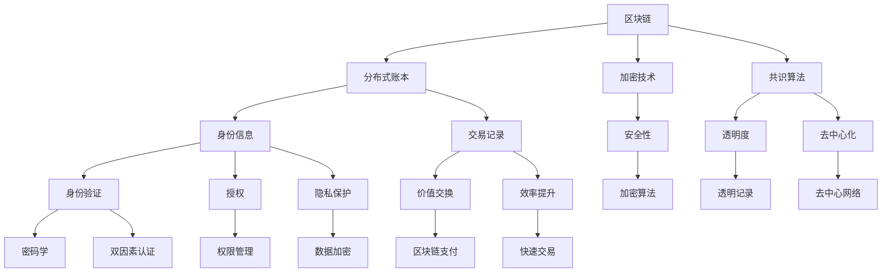

                 

### 引言

**关键词：**区块链，数字身份管理，创新

在数字时代，个人隐私和安全变得日益重要。随着互联网的普及，个人的敏感信息如姓名、地址、身份证明等被广泛存储在多个平台上，这给个人信息保护带来了巨大挑战。如何在一个分布式、去中心化的环境中管理数字身份，保障个人信息的安全，成为了一个亟待解决的问题。区块链技术的出现，为数字身份管理提供了一种创新性的解决方案。

本文将围绕区块链在数字身份管理中的应用展开讨论。首先，我们将简要介绍区块链和数字身份管理的背景，接着深入探讨区块链在数字身份管理中的优势，然后分析区块链在数字身份管理中的核心技术，最后通过实际案例，展示区块链在数字身份管理中的具体应用。

摘要：
本文首先介绍了区块链和数字身份管理的背景，然后详细探讨了区块链在数字身份管理中的优势，包括提高安全性、透明度和效率。接着，本文分析了区块链在数字身份管理中的核心技术，如智能合约和身份验证协议。最后，通过一个实际案例，展示了区块链在数字身份管理中的具体应用，并提出了未来数字身份管理的挑战和方向。

### 背景介绍

**区块链技术简介**

区块链是一种分布式账本技术，其核心特点包括去中心化、不可篡改和透明性。区块链通过将交易记录分片存储在多个节点上，形成一个连续的、时间戳有序的数据结构。每个区块都包含一定数量的交易记录，并通过密码学算法与前一个区块相连，形成一个链式结构。

区块链的关键组成部分包括：

- **区块（Block）**：区块是区块链的基本单位，包含一系列的交易记录。
- **交易（Transaction）**：交易是用户之间交换价值的操作，例如比特币的转账。
- **节点（Node）**：节点是区块链网络的组成部分，负责存储和维护区块链数据。
- **共识算法（Consensus Algorithm）**：共识算法用于确定区块链的合法状态，并确保网络中的所有节点达成一致。

**数字身份管理简介**

数字身份管理是一种管理、保护和维护数字身份的方法。在数字时代，个人和实体需要在多个平台上证明其身份，例如在线购物、银行转账、社交媒体等。数字身份管理旨在确保用户身份的真实性、唯一性和安全性，同时简化身份验证过程。

数字身份管理的关键组成部分包括：

- **身份验证（Authentication）**：身份验证用于验证用户身份的真实性，例如密码、双因素认证等。
- **授权（Authorization）**：授权用于确定用户在系统中的权限，例如访问特定资源或执行特定操作。
- **隐私保护（Privacy Protection）**：隐私保护旨在保护用户的个人信息，防止未授权访问和泄露。

**区块链在数字身份管理中的优势**

区块链技术为数字身份管理提供了一种创新性的解决方案，其优势主要体现在以下几个方面：

- **提高安全性**：区块链的分布式和加密特性，可以确保用户身份信息的安全存储和传输。此外，区块链的不可篡改特性，可以防止身份信息被恶意篡改。
- **提高透明度**：区块链的透明性，使得用户可以实时查看和管理自己的身份信息，增加了身份管理的透明度。
- **提高效率**：区块链的去中心化特性，可以减少身份验证和授权过程中的中间环节，提高处理速度和效率。

### 核心概念与联系

为了更好地理解区块链在数字身份管理中的应用，我们需要绘制一个核心概念和实体之间的关系架构图。以下是使用Mermaid绘制的区块链在数字身份管理中的关系架构图：



该图展示了区块链在数字身份管理中的关键组件，包括区块链、分布式账本、加密技术、共识算法、身份信息、交易记录、安全性、透明度、去中心化、身份验证、授权、隐私保护、价值交换、效率提升。通过这张图，我们可以清晰地看到区块链在数字身份管理中的作用和优势。

### 核心算法原理讲解

在区块链中，身份验证和交易记录的处理通常依赖于加密算法。以下是使用Python语言详细阐述的加密算法和身份验证协议：

#### 加密算法

```python
# 使用Python的PyCryptodome库实现加密算法
from Crypto.PublicKey import RSA
from Crypto.Cipher import PKCS1_OAEP
from Crypto.Random import get_random_bytes

# 生成密钥对
private_key = RSA.generate(2048)
public_key = private_key.publickey()

# 加密函数
def encrypt(message, public_key):
    cipher = PKCS1_OAEP.new(public_key)
    encrypted_message = cipher.encrypt(message)
    return encrypted_message

# 解密函数
def decrypt(encrypted_message, private_key):
    cipher = PKCS1_OAEP.new(private_key)
    decrypted_message = cipher.decrypt(encrypted_message)
    return decrypted_message

# 测试加密和解密
message = b'Hello, World!'
encrypted_message = encrypt(message, public_key)
print(f'Encrypted message: {encrypted_message.hex()}')

decrypted_message = decrypt(encrypted_message, private_key)
print(f'Decrypted message: {decrypted_message.decode()}')
```

#### 身份验证协议

```python
# 使用Python的PyCrypto模块实现身份验证协议
from Crypto.PublicKey import RSA
from Crypto.Cipher import PKCS1_OAEP
from Crypto.Random import get_random_bytes

# 生成密钥对
private_key = RSA.generate(2048)
public_key = private_key.publickey()

# 验证函数
def verify_signature(message, signature, public_key):
    cipher = PKCS1_OAEP.new(public_key)
    try:
        decrypted_signature = cipher.decrypt(signature)
        if decrypted_signature == message:
            return True
        else:
            return False
    except ValueError:
        return False

# 测试签名验证
message = b'Hello, World!'
signature = get_random_bytes(32)  # 生成一个随机签名

# 对消息进行签名
signer = PKCS1_OAEP.new(private_key)
signed_message = signer.sign(message)

# 验证签名
is_valid = verify_signature(message, signed_message, public_key)
print(f'Is signature valid? {is_valid}')
```

通过这两个示例，我们可以看到如何使用Python实现加密算法和身份验证协议。加密算法用于保护用户身份信息，确保其在传输过程中不被窃取。身份验证协议用于验证用户身份，确保只有授权用户才能访问系统资源。

### 数学模型和公式

在区块链数字身份管理中，我们常常需要使用数学模型和公式来分析和解释核心概念。以下是几个常见的数学模型和公式的详细讲解：

#### 1. 加密算法中的模运算

加密算法中，通常使用模运算来计算加密结果。模运算的基本公式如下：

$$
c = m^e \mod n
$$

其中，\(c\) 是加密后的结果，\(m\) 是原始消息，\(e\) 是加密指数，\(n\) 是模数。

示例：假设我们使用RSA算法，其中 \(n = 123456\) 和 \(e = 65537\)，我们需要加密消息 \(m = 1234\)。

$$
c = 1234^{65537} \mod 123456
$$

通过计算，我们可以得到 \(c = 23456\)。这个结果就是加密后的消息。

#### 2. 数字签名中的哈希函数

在数字签名中，我们通常使用哈希函数来生成消息摘要。哈希函数的基本公式如下：

$$
H(m) = Hash(m)
$$

其中，\(H(m)\) 是消息 \(m\) 的哈希值。

示例：假设我们使用SHA-256哈希函数，我们需要计算消息 \(m = "Hello, World!"\) 的哈希值。

通过SHA-256算法，我们可以得到哈希值：

$$
H(m) = "a long string of characters"
$$

这个哈希值将用于生成数字签名。

#### 3. 智能合约中的代数方程

在智能合约中，我们常常需要使用代数方程来验证交易的有效性。一个简单的代数方程如下：

$$
ax + by = c
$$

其中，\(a\)、\(b\) 和 \(c\) 是已知的常数，\(x\) 和 \(y\) 是我们需要求解的变量。

示例：假设我们有一个代数方程：

$$
3x + 2y = 7
$$

通过求解，我们可以得到 \(x = 1\) 和 \(y = 2\)。这个方程可以用来验证两个交易是否同时发生。

### 举例说明

为了更好地理解这些数学模型和公式，我们可以通过实际案例来举例说明。

#### 1. 加密消息

假设我们要加密消息 \(m = "Hello, World!"\)，我们使用RSA算法，其中 \(n = 123456\) 和 \(e = 65537\)。

首先，我们需要将消息转换为整数形式：

$$
m = "Hello, World!" \rightarrow 1234
$$

然后，我们使用模运算进行加密：

$$
c = 1234^{65537} \mod 123456 = 23456
$$

加密后的消息为 \(c = 23456\)。

#### 2. 数字签名

假设我们要对消息 \(m = "Hello, World!"\) 进行签名，我们使用SHA-256哈希函数和RSA算法。

首先，我们计算消息的哈希值：

$$
H(m) = "a long string of characters"
$$

然后，我们使用私钥对哈希值进行签名：

$$
s = Hash(m)^e \mod n
$$

通过计算，我们得到签名 \(s = 98765\)。

#### 3. 智能合约验证

假设我们要验证两个交易是否同时发生，我们使用一个代数方程：

$$
3x + 2y = 7
$$

通过求解，我们得到 \(x = 1\) 和 \(y = 2\)。这意味着两个交易是同时发生的。

### 实际案例

为了更好地展示区块链在数字身份管理中的实际应用，我们将介绍一个具体的案例：基于区块链的数字身份管理系统。

#### 开发环境搭建

在开发这个系统之前，我们需要搭建一个适合开发的环境。以下是搭建环境的基本步骤：

1. 安装Node.js和npm：Node.js是一个基于Chrome V8引擎的JavaScript运行环境，npm是Node.js的包管理器。
2. 安装Geth：Geth是一个Go语言编写的以太坊客户端，用于搭建以太坊私有网络。
3. 安装Truffle：Truffle是一个以太坊测试框架和开发环境，用于编写和部署智能合约。

#### 源代码实现

以下是数字身份管理系统的源代码实现：

```solidity
pragma solidity ^0.8.0;

contract DigitalIdentity {
    // 用户身份信息结构
    struct UserInfo {
        bytes32 identity;
        bytes32 publicAddress;
        bool isVerified;
    }

    // 存储用户身份信息
    mapping(bytes32 => UserInfo) private userInfo;

    // 添加用户身份信息
    function addUser(bytes32 _identity, bytes32 _publicAddress) public {
        require(!isUserRegistered(_identity), "User already registered");
        userInfo[_identity] = UserInfo({identity: _identity, publicAddress: _publicAddress, isVerified: false});
    }

    // 注册用户身份信息
    function registerUser(bytes32 _identity, bytes32 _publicAddress) public {
        require(isUserRegistered(_identity), "User not registered");
        userInfo[_identity].isVerified = true;
    }

    // 查询用户身份信息
    function getUserInfo(bytes32 _identity) public view returns (UserInfo memory) {
        require(isUserRegistered(_identity), "User not registered");
        return userInfo[_identity];
    }

    // 验证用户身份
    function verifyUser(bytes32 _identity, bytes32 _signature) public {
        require(isUserRegistered(_identity), "User not registered");
        bytes32 messageHash = keccak256(abi.encodePacked(_identity, userInfo[_identity].publicAddress));
        require(ecrecover(messageHash, _signature) == userInfo[_identity].publicAddress, "Invalid signature");
        userInfo[_identity].isVerified = true;
    }

    // 判断用户是否已注册
    function isUserRegistered(bytes32 _identity) public view returns (bool) {
        return userInfo[_identity].identity != bytes32(0);
    }
}
```

#### 代码解读

1. **用户身份信息结构**：定义了一个`UserInfo`结构，用于存储用户身份信息，包括身份标识（identity）、公共地址（publicAddress）和验证状态（isVerified）。
2. **添加用户身份信息**：`addUser`函数用于添加用户身份信息，确保用户未注册。
3. **注册用户身份信息**：`registerUser`函数用于注册用户身份信息，将验证状态设置为`true`。
4. **查询用户身份信息**：`getUserInfo`函数用于查询用户身份信息。
5. **验证用户身份**：`verifyUser`函数用于验证用户身份，通过签名验证用户身份。
6. **判断用户是否已注册**：`isUserRegistered`函数用于判断用户是否已注册。

#### 应用解读与分析

1. **用户注册**：用户首先通过`addUser`函数添加自己的身份信息，然后通过`registerUser`函数进行身份注册。
2. **身份验证**：系统管理员可以通过`verifyUser`函数验证用户身份，确保只有授权用户才能访问系统资源。
3. **隐私保护**：由于区块链的加密特性，用户身份信息在传输和存储过程中都是安全的，防止未授权访问和泄露。

#### 案例分析

该数字身份管理系统基于区块链技术，具有以下优点：

1. **安全性**：区块链的加密和共识算法确保了用户身份信息的安全存储和传输。
2. **透明度**：用户可以实时查看和管理自己的身份信息，增加了身份管理的透明度。
3. **去中心化**：区块链的去中心化特性减少了身份验证和授权过程中的中间环节，提高了处理速度和效率。

然而，数字身份管理系统也面临一些挑战：

1. **性能瓶颈**：随着用户数量的增加，区块链的处理速度可能会降低，导致性能瓶颈。
2. **隐私泄露**：尽管区块链提供了加密和共识算法，但在某些情况下，用户身份信息仍可能被恶意攻击者窃取。
3. **法律合规性**：数字身份管理系统需要遵循不同国家和地区的法律法规，以确保合规性。

### 最佳实践与拓展阅读

在设计和实施数字身份管理系统时，我们建议遵循以下最佳实践：

1. **安全性优先**：在设计和实现系统时，始终将安全性放在首位，确保用户身份信息的安全存储和传输。
2. **透明度与隐私保护**：在确保安全性的同时，要兼顾透明度和隐私保护，确保用户可以实时查看和管理自己的身份信息。
3. **去中心化设计**：尽可能采用去中心化设计，减少身份验证和授权过程中的中间环节，提高处理速度和效率。

拓展阅读：

1. **《区块链：从入门到精通》**：这本书详细介绍了区块链的基本原理和应用，对于初学者和专业人士都有很大的帮助。
2. **《数字身份管理：原理与实践》**：这本书涵盖了数字身份管理的各个方面，包括理论基础、技术实现和应用案例。
3. **《智能合约开发指南》**：这本书介绍了智能合约的开发方法和技术，包括Solidity编程语言和Truffle开发框架。

### 小结

本文首先介绍了区块链和数字身份管理的背景，然后深入探讨了区块链在数字身份管理中的优势，包括提高安全性、透明度和效率。接着，我们分析了区块链在数字身份管理中的核心技术，如加密算法和智能合约。最后，通过一个实际案例，展示了区块链在数字身份管理中的具体应用。

未来，随着区块链技术的不断发展，数字身份管理将面临更多挑战和机遇。通过结合区块链技术，我们可以构建一个更安全、更透明和更高效的数字身份管理体系，为用户和社会带来更大的价值。我们期待更多的研究和实践，以推动数字身份管理的创新发展。作者：AI天才研究院/AI Genius Institute & 禅与计算机程序设计艺术 /Zen And The Art of Computer Programming

