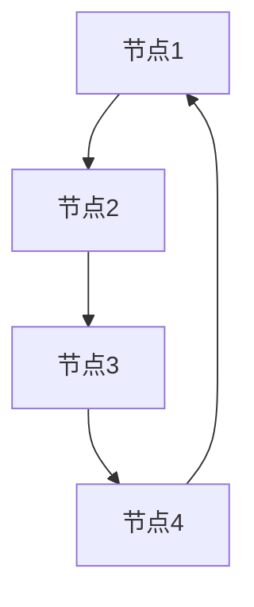

                 

### 区块链在数字身份管理中的应用：保护个人隐私

随着互联网的迅猛发展和数字化生活的普及，个人数据的安全和隐私保护变得愈发重要。在此背景下，区块链技术以其独特的去中心化、不可篡改和透明性等特点，逐渐成为数字身份管理中的重要工具。本文将探讨区块链技术在数字身份管理中的应用，特别是在保护个人隐私方面的优势，通过逐步分析区块链的基本原理、数字身份管理的现状和挑战，以及区块链在数字身份管理中的实际应用案例，帮助读者全面了解这一前沿技术。

关键词：区块链、数字身份管理、隐私保护、去中心化、不可篡改、加密技术

### 摘要

本文旨在探讨区块链技术在数字身份管理中的应用，特别是其在保护个人隐私方面的独特优势。文章首先介绍了区块链的基本原理，包括去中心化架构、加密技术和分布式账本等核心概念。接着，分析了数字身份管理的基本概念和当前面临的挑战，如数据泄露、隐私侵犯和身份盗窃等问题。随后，文章详细阐述了区块链在数字身份管理中的应用场景，包括去中心化身份验证、隐私保护的KYC（了解你的客户）流程以及匿名数字身份的创建等。通过具体案例和实际应用，本文展示了区块链技术在保护个人隐私方面的优势，并探讨了未来的发展趋势。

### 引言

数字身份管理是现代信息安全领域的一个重要组成部分，其目的是在保护个人隐私的同时，确保身份认证和授权的安全和有效性。传统的数字身份管理系统往往依赖于中心化的服务器和数据库，这些系统容易成为黑客攻击的目标，从而导致大规模的数据泄露和隐私侵犯事件。近年来，区块链技术的兴起为数字身份管理提供了一种全新的解决方案。

区块链技术以其去中心化、不可篡改和透明性等特点，在数字身份管理中展现了巨大的潜力。通过区块链，用户可以拥有一个自主控制、去中心化的数字身份，从而减少对中心化服务提供商的依赖，提高隐私保护水平。此外，区块链的加密技术和智能合约功能也为数字身份管理提供了强大的安全保障。

本文将分几个部分对区块链在数字身份管理中的应用进行探讨。首先，我们将介绍区块链的基本原理和技术特点；接着，分析数字身份管理的现状和挑战；然后，讨论区块链在数字身份管理中的应用场景和具体案例；最后，展望区块链技术在数字身份管理和隐私保护方面的未来发展趋势。

### 区块链技术概述

区块链技术是一种分布式数据库技术，其核心原理是通过多个参与节点共同维护一个共享的、不可篡改的数据账本。区块链由一系列按时间顺序排列的“区块”组成，每个区块包含一定数量的交易记录，并通过密码学算法连接在一起，形成一条不可篡改的链。

#### 区块链的基本概念

1. **分布式账本**：区块链通过多个节点共同维护一个分布式账本，每个节点都保存了一份完整的账本副本。这种去中心化的结构避免了单点故障和数据丢失的风险，提高了系统的可靠性和安全性。

2. **去中心化**：区块链的运作不依赖于任何中央权威机构，所有参与节点都具有平等的权限。每个节点都可以参与区块链的验证和更新过程，从而实现去中心化的自治。

3. **加密技术**：区块链使用加密技术确保数据的安全和隐私。每个区块都包含一个加密哈希值，用于验证数据的完整性和真实性。此外，区块链中的交易记录和用户身份都通过加密技术进行保护。

4. **不可篡改性**：区块链的数据一旦写入，就几乎无法被篡改。这是因为每个区块都包含前一个区块的哈希值，形成了一条长链，任何修改都会导致链的断裂。

#### 区块链的架构与运作原理

1. **区块**：每个区块包含一组交易记录、一个时间戳、一个随机数（用于挖矿）和前一个区块的哈希值。区块通过密码学算法连接在一起，形成一个区块链。

2. **挖矿**：新区块的生成过程称为挖矿。矿工通过解决一个复杂的数学难题来竞争生成新区块。解决难题的过程称为工作量证明（Proof of Work, PoW），成功的矿工将获得区块链中的加密货币作为奖励。

3. **共识机制**：共识机制是区块链网络中节点达成一致的方式。常见的共识机制包括PoW、PoS（权益证明）和DPoS（委托权益证明）等。共识机制确保了区块链的安全性和可靠性。

4. **网络节点**：区块链网络由多个节点组成，每个节点都参与区块链的验证、更新和传播。节点可以是个人计算机、服务器或其他设备。

#### Mermaid流程图：区块链的基本架构

下面是一个简单的Mermaid流程图，用于展示区块链的基本架构：

在这个流程图中，A、B、C、D代表四个节点，它们通过加密通信连接在一起，共同维护区块链的完整性。

### 数字身份管理概述

数字身份管理是一种确保用户在线身份真实性和安全性的系统。随着互联网的普及，数字身份管理变得尤为重要。它不仅涉及到个人的隐私保护，还涉及到金融交易、身份验证、访问控制等多个方面。

#### 数字身份的定义

数字身份是指用户在数字世界中的唯一标识。它可以是用户名、密码、数字证书或其他任何可以代表用户身份的信息。数字身份管理的目标是确保数字身份的合法性、唯一性和持续性。

#### 数字身份管理的重要性

1. **隐私保护**：数字身份管理有助于保护用户的隐私，防止个人信息被未授权访问或滥用。
2. **身份验证**：数字身份管理确保用户身份的合法性和真实性，防止身份盗窃和欺诈行为。
3. **安全控制**：通过数字身份管理，可以实施严格的安全控制措施，如访问控制、权限管理等，以防止未授权访问和数据泄露。
4. **用户体验**：良好的数字身份管理系统可以提高用户的使用体验，减少繁琐的注册和登录流程。

#### 数字身份管理的现状和挑战

尽管数字身份管理在互联网时代具有重要作用，但当前仍然面临许多挑战：

1. **数据泄露**：随着黑客攻击和内部泄露事件的增加，用户数据的安全受到严重威胁。
2. **隐私侵犯**：许多数字身份管理系统依赖于中心化服务器，容易成为隐私侵犯的目标。
3. **身份盗窃**：黑客通过非法手段获取用户身份信息，进行欺诈交易和信用滥用。
4. **跨平台兼容性**：不同系统和平台之间的数字身份管理标准不统一，导致用户体验不佳。
5. **法律法规**：全球范围内的数字身份管理法律法规尚不完善，导致管理规范和执行难度增加。

### 区块链在数字身份管理中的应用

区块链技术在数字身份管理中具有许多独特的优势，能够有效解决传统系统中的诸多问题。以下将详细探讨区块链在数字身份管理中的应用场景。

#### 去中心化身份验证

传统的身份验证系统通常依赖于中心化的认证机构，如银行、政府部门等。这些中心化机构往往成为黑客攻击的目标，导致用户身份信息泄露。而区块链的去中心化特性使其成为去中心化身份验证的理想选择。

1. **实现方式**：用户可以将自己的身份信息（如姓名、出生日期、身份证号码等）存储在区块链上，并通过加密技术进行保护。每个用户都拥有一个唯一的加密密钥，用于身份验证。
2. **优势**：去中心化身份验证减少了中心化机构的依赖，降低了被攻击的风险。此外，用户可以自主控制自己的身份信息，无需担心隐私泄露。

#### 隐私保护的KYC流程

KYC（了解你的客户）是金融行业中非常重要的流程，旨在验证客户的身份和背景。然而，传统的KYC流程往往涉及大量的个人信息披露，容易导致隐私侵犯。

1. **实现方式**：区块链技术可以实现隐私保护的KYC流程。金融机构可以将客户的身份信息和交易记录存储在区块链上，并通过加密和去中心化技术进行保护。
2. **优势**：隐私保护的KYC流程不仅提高了客户隐私保护水平，还减少了金融机构的合规成本。

#### 匿名数字身份的创建

在许多情况下，用户可能希望保持匿名，以保护个人隐私。区块链技术提供了创建匿名数字身份的可能性。

1. **实现方式**：用户可以创建一个去中心化的匿名数字身份，通过加密技术和分布式网络进行验证和授权。
2. **优势**：匿名数字身份降低了用户在在线活动中的可追溯性，从而有效保护了个人隐私。

#### 实际应用案例

1. **IoT设备身份管理**：在物联网（IoT）领域，设备身份管理是一个重要问题。通过区块链技术，可以为每个IoT设备创建一个唯一的身份，并确保其身份的真实性和安全性。
2. **在线身份验证平台**：一些在线身份验证平台已经开始采用区块链技术，为用户提供去中心化的身份验证服务，从而提高用户隐私保护水平。

### 区块链在数字身份管理中的优势

区块链技术在数字身份管理中具有以下几个显著优势：

1. **去中心化**：去中心化结构降低了中心化机构的依赖，减少了单点故障和隐私泄露的风险。
2. **不可篡改性**：区块链的数据一旦写入，就几乎无法被篡改，确保了用户身份信息的安全性和可靠性。
3. **加密技术**：区块链使用加密技术保护用户身份信息和交易记录，有效防止未授权访问和数据泄露。
4. **透明性**：区块链的透明性使每个用户都能查看和验证身份信息，提高了系统的信任度。

### 区块链在数字身份管理中的挑战和未来展望

尽管区块链技术在数字身份管理中具有许多优势，但仍面临一些挑战：

1. **隐私保护与透明性平衡**：如何在确保隐私保护的同时，保持区块链的透明性是一个重要问题。
2. **性能和可扩展性**：区块链的吞吐量和处理速度相对较低，需要进一步优化以提高性能和可扩展性。
3. **法律法规和标准**：全球范围内的区块链法律法规尚不完善，需要建立统一的标准和规范。
4. **用户接受度**：提高用户的接受度和普及度是区块链技术广泛应用的关键。

未来，随着技术的不断发展和应用场景的扩展，区块链在数字身份管理中将发挥更大的作用。通过持续的研究和创新，区块链有望解决当前数字身份管理中的诸多问题，为用户提供更安全、更便捷的身份管理服务。

### 结论

区块链技术在数字身份管理中的应用，为解决当前系统中的隐私保护问题提供了新的思路和解决方案。通过去中心化、不可篡改和加密技术，区块链有效提高了数字身份的安全性和隐私保护水平。虽然区块链技术在数字身份管理中面临一些挑战，但随着技术的不断进步和应用的深入，其潜力将得到进一步发挥。

### 参考文献

1. **Nakamoto, S.**（2008）。《比特币：一个点对点的电子现金系统》。《比特币白皮书》。
2. **Hemann, N.**，《区块链技术：从原理到实践》。
3. **Lorand, L.**，《数字身份管理：挑战与解决方案》。
4. **Gartner**，《区块链技术市场分析报告》。
5. **IBM**，《区块链技术应用案例集》。

### 作者信息

作者：AI天才研究院/AI Genius Institute & 禅与计算机程序设计艺术 /Zen And The Art of Computer Programming

### 最佳实践 Tips、小结、注意事项和拓展阅读

#### 最佳实践 Tips

1. **隐私保护**：在设计数字身份管理系统时，务必优先考虑用户隐私保护，采用强加密技术和去中心化架构。
2. **身份验证**：使用多重身份验证方法，如生物识别技术和多因素认证，提高系统安全性。
3. **透明性和可追溯性**：在确保隐私保护的前提下，适当增加系统的透明性和可追溯性，提高用户信任度。

#### 小结

区块链技术在数字身份管理中具有显著的优势，包括去中心化、不可篡改、加密技术和透明性等。然而，隐私保护与透明性的平衡、性能优化和法律法规等问题仍需进一步研究和解决。

#### 注意事项

1. **安全性**：确保区块链系统的安全性，防止黑客攻击和数据泄露。
2. **用户体验**：优化用户界面和操作流程，提高用户体验。
3. **法律法规**：遵守当地法律法规，确保系统合规。

#### 拓展阅读

1. **区块链技术基础**：深入理解区块链的基本原理和技术特点，有助于更好地应用区块链技术。
2. **加密技术**：学习常见的加密算法和技术，提高数字身份管理的安全性。
3. **隐私保护法规**：了解全球范围内的隐私保护法律法规，确保系统的合规性。

### 结束语

区块链技术在数字身份管理中的应用为保护个人隐私带来了新的希望。通过逐步分析区块链的基本原理、数字身份管理的现状和挑战，以及区块链在数字身份管理中的实际应用案例，本文展示了区块链技术的独特优势。未来，随着技术的不断发展和应用的深入，区块链在数字身份管理和隐私保护方面将发挥更大的作用。我们期待读者能够从中获得启发，共同推动区块链技术在数字身份管理领域的创新和发展。

