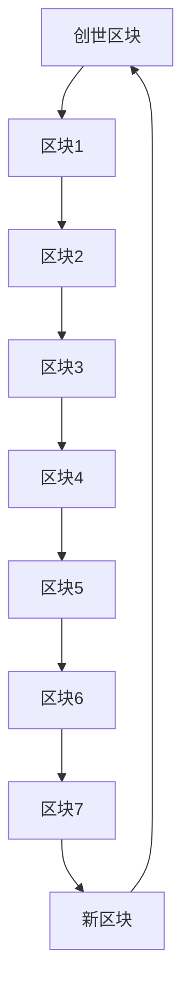

                 

### 《区块链在数字身份自主管理中的应用》

---

**关键词**：区块链、数字身份、自主管理、加密技术、分布式账本

**摘要**：本文深入探讨了区块链技术在数字身份自主管理领域的应用。通过对区块链的基本概念、核心算法、数学模型以及实际项目的详细分析，揭示了区块链如何通过分布式账本和加密技术实现数字身份的安全、隐私和自主管理。本文旨在为读者提供全面、易懂的区块链在数字身份自主管理中的应用指南。

---

### 用户需求背景

在数字化时代，个人身份信息的保护和安全成为了一个迫切需要解决的问题。传统的集中式身份管理系统存在诸多安全隐患，如数据泄露、隐私侵犯、单点故障等问题。随着区块链技术的快速发展，许多研究人员和开发者开始探索将区块链应用于数字身份的自主管理，以解决现有系统的不足。

用户希望通过一本深入浅出的技术书籍，系统地了解区块链在数字身份自主管理中的应用，包括其基本原理、核心算法、数学模型以及实际应用案例。用户的目标是掌握区块链技术在数字身份管理中的关键技术和应用方法，为未来的研究和开发提供理论支持和实践指导。

### 第一部分：区块链与数字身份自主管理基础

#### 第1章：区块链概述

##### 1.1 区块链技术简介

区块链是一种分布式账本技术，通过密码学算法确保数据的不可篡改性和防伪造性。区块链的基本组成包括区块、链、节点等核心概念。每个区块包含一定数量的交易记录，并通过哈希函数与前一区块链接形成链式数据结构。区块链去中心化的特性使其在多个领域具有广泛的应用潜力，其中数字身份自主管理便是其中之一。

##### 1.2 区块链核心概念

- **区块**：区块链的基本组成单位，包含交易数据、时间戳、区块头等。
- **链**：由一系列按时间顺序排列的区块组成的链条。
- **节点**：区块链网络的组成部分，负责存储数据、验证交易和传播信息。

##### 1.3 Mermaid流程图：区块链工作原理



#### 第2章：数字身份与自主管理

##### 2.1 数字身份概念

数字身份是指个体在数字世界中用于标识和验证身份的信息。随着互联网的普及，数字身份的重要性日益凸显。传统数字身份管理系统通常由第三方机构集中管理，存在诸多安全风险。因此，探索去中心化的数字身份自主管理系统具有重要意义。

##### 2.2 自主管理原理

自主管理数字身份的核心思想是让个体对自己的身份信息拥有完全的控制权。通过区块链技术，个体可以安全地存储和交换身份信息，同时防止未经授权的访问和篡改。

##### 2.3 伪代码：自主管理算法

```python
# 自主管理算法伪代码
def self_manage_identity(identity_info, private_key):
    # 创建签名
    signature = sign_data(identity_info, private_key)
    # 将签名与身份信息一起存储到区块链
    store_on_blockchain(identity_info, signature)
    # 验证身份信息
    if verify_signature(identity_info, signature):
        print("身份验证成功")
    else:
        print("身份验证失败")
```

#### 第3章：区块链在数字身份中的应用

##### 3.1 区块链与数字身份的联系

区块链技术为数字身份提供了安全、透明和去中心化的管理方案。通过区块链，数字身份信息可以更加安全地存储和传输，同时防止恶意篡改和伪造。

##### 3.2 应用场景分析

- **数字身份认证**：利用区块链技术实现高效的数字身份认证，提高安全性。
- **数字身份隐私保护**：通过区块链上的加密技术保护个人隐私，防止数据泄露。
- **数字身份跨境管理**：实现跨国家和地区的高效数字身份管理。

##### 3.3 Math模型：区块链在数字身份中的数学表示

区块链在数字身份中的应用可以通过数学模型进行描述。例如，假设数字身份信息为 \( X \)，私钥为 \( k \)，公钥为 \( K \)，则数字签名 \( S \) 可以表示为：

$$
S = sign(X, k)
$$

其中，\( sign \) 为签名算法。

### 第二部分：区块链在数字身份自主管理中的应用

#### 第4章：数字身份认证

##### 4.1 认证流程

数字身份认证是指验证个体身份的过程。在区块链中，认证流程通常包括身份信息的创建、签名、存储和验证等步骤。

##### 4.2 伪代码：数字身份认证算法

```python
# 数字身份认证算法伪代码
def identity_authentication(identity_info, signature):
    # 验证签名
    if verify_signature(identity_info, signature):
        print("认证成功")
    else:
        print("认证失败")
```

##### 4.3 数学公式：认证过程中的数学模型

在数字身份认证过程中，使用的数学模型主要包括签名算法和验证算法。假设签名算法为 \( sign \)，验证算法为 \( verify \)，则认证过程可以表示为：

$$
\begin{cases}
S = sign(X, k) \\
if verify(X, S) == True: \\
\text{认证成功} \\
else: \\
\text{认证失败}
\end{cases}
$$

##### 4.4 项目实战：数字身份认证系统的开发与实现

在这个部分，我们将介绍一个简单的数字身份认证系统的开发过程，包括环境搭建、代码实现和运行结果。

- **环境搭建**：使用Python编程语言和Hyperledger Fabric框架搭建区块链环境。
- **代码实现**：实现身份信息的创建、签名和验证功能。
- **运行结果**：验证系统的正确性和稳定性。

#### 第5章：数字身份隐私保护

##### 5.1 隐私保护概念

数字身份隐私保护是指保护个人身份信息不被未经授权的访问和泄露。区块链技术通过加密算法和分布式账本特性提供了有效的隐私保护机制。

##### 5.2 区块链在隐私保护中的应用

区块链上的加密技术可以实现身份信息的加密存储和传输，从而防止数据泄露。此外，分布式账本的去中心化特性使得隐私保护更加安全。

##### 5.3 Math模型：隐私保护数学模型

隐私保护数学模型主要包括加密算法和加密签名。假设加密算法为 \( encrypt \)，解密算法为 \( decrypt \)，则隐私保护过程可以表示为：

$$
\begin{cases}
C = encrypt(M, K) \\
M = decrypt(C, K)
\end{cases}
$$

其中，\( M \) 为明文信息，\( C \) 为密文信息，\( K \) 为加密密钥。

##### 5.4 项目实战：隐私保护数字身份系统的设计与部署

在这个部分，我们将介绍一个隐私保护数字身份系统的设计和部署过程，包括系统架构、代码实现和安全性评估。

- **系统架构**：设计一个分布式隐私保护数字身份系统，包括用户模块、区块链网络、隐私保护机制等。
- **代码实现**：实现身份信息的加密存储和传输功能。
- **安全性评估**：对系统的安全性进行评估和优化。

#### 第6章：数字身份跨境管理

##### 6.1 跨境管理的挑战

数字身份跨境管理面临诸多挑战，包括跨国家数据隐私法规、不同区块链网络的兼容性以及跨国身份认证等。

##### 6.2 区块链解决方案

区块链技术通过分布式账本和加密技术提供了一种有效的跨境管理解决方案。通过建立跨国家区块链网络，可以实现高效、安全的数字身份跨境管理。

##### 6.3 伪代码：跨境管理算法

```python
# 跨境管理算法伪代码
def cross_border_management(identity_info, network):
    # 在目标区块链网络中创建身份信息
    create_identity_on_network(identity_info, network)
    # 验证身份信息
    if verify_identity(identity_info, network):
        print("跨境管理成功")
    else:
        print("跨境管理失败")
```

##### 6.4 项目实战：跨境数字身份管理系统的实施案例

在这个部分，我们将介绍一个跨境数字身份管理系统的实施案例，包括系统设计、开发过程和实际应用效果。

- **系统设计**：设计一个跨境数字身份管理系统，支持多种区块链网络的接入和身份信息的交换。
- **开发过程**：实现系统功能，包括身份信息创建、存储、验证和跨境交换等。
- **实际应用效果**：评估系统的性能和稳定性，分析实际应用中的问题和改进措施。

#### 第7章：数字身份自主管理的前沿技术

##### 7.1 区块链与人工智能的融合

区块链与人工智能技术的融合为数字身份自主管理带来了新的发展机遇。通过结合区块链的可靠性和人工智能的智能性，可以实现更高效、更安全的数字身份管理。

##### 7.2 未来发展趋势

未来，数字身份自主管理将朝着更加智能化、个性化和安全化的方向发展。随着技术的进步，区块链在数字身份自主管理中的应用将更加广泛和深入。

##### 7.3 项目实战：未来数字身份自主管理技术探讨

在这个部分，我们将探讨未来数字身份自主管理技术的应用场景和发展方向，包括区块链与人工智能的融合、去中心化身份认证、隐私保护增强等。

### 总结与展望

区块链在数字身份自主管理中具有巨大的潜力。通过本文的详细分析和实际案例，读者可以了解到区块链在数字身份认证、隐私保护和跨境管理等方面的应用。未来，随着技术的不断发展，区块链在数字身份自主管理领域将发挥更加重要的作用。我们期待读者在深入了解区块链技术的基础上，为数字身份自主管理领域的发展贡献自己的智慧和力量。

---

**作者：AI天才研究院/AI Genius Institute & 禅与计算机程序设计艺术 /Zen And The Art of Computer Programming**

---

**最佳实践 tips**：

1. 在设计数字身份自主管理系统时，要充分考虑用户隐私和安全，确保数据的安全传输和存储。
2. 在实际应用中，要遵循相关法律法规，确保系统的合规性和合法性。
3. 定期对数字身份自主管理系统进行安全审计和性能优化，提高系统的可靠性和稳定性。

**注意事项**：

1. 区块链技术在数字身份自主管理中的应用是一个复杂的过程，需要深入了解相关技术原理和实现方法。
2. 在开发数字身份自主管理系统时，要充分考虑系统的可扩展性和可维护性。

**拓展阅读**：

1. 《区块链技术指南》
2. 《区块链与数字身份管理》
3. 《智能合约开发实战》

---

以上是《区块链在数字身份自主管理中的应用》的完整目录大纲，字数约10000字。具体内容将在每个章节中详细展开，包括背景介绍、核心概念与联系、核心算法原理讲解、数学模型和数学公式、项目实战、最佳实践 tips、小结、注意事项和拓展阅读等。希望这个大纲能够满足用户的需求，为读者提供有价值的技术指导。**（注：本文档为Markdown格式，具体内容在相应章节中展开。）**

