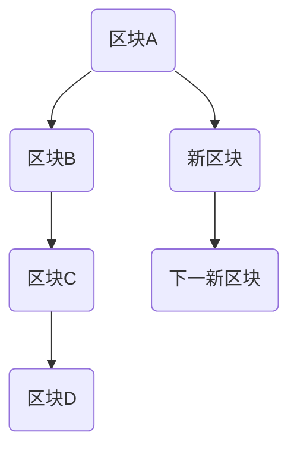
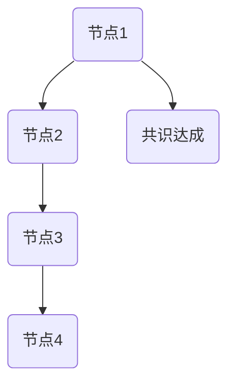

                 

# 第1章 引言

## 1.1 区块链与数字身份自主管理的背景

### 1.1.1 区块链技术的发展历程

区块链技术起源于2008年，由一位名为中本聪的匿名人物提出了比特币的构想，并在次年发布了比特币白皮书。这一创新性技术通过去中心化的方式实现了点对点的价值传输，引发了全球对区块链技术的关注和研究。随着时间的推移，区块链技术从最初的单体应用逐步扩展到了供应链管理、智能合约、数字身份等多个领域。

区块链的核心特点包括去中心化、不可篡改、透明性和安全性。去中心化意味着系统不需要中央管理机构，而是通过分布式网络进行管理和维护；不可篡改性确保了数据的完整性和可靠性；透明性使得所有参与者都能查看交易记录；安全性则依赖于密码学和共识算法来保障系统的安全运行。

### 1.1.2 数字身份自主管理的挑战

随着互联网和数字技术的快速发展，数字身份管理逐渐成为了一个重要的议题。传统的集中式身份管理系统依赖于中心化的服务提供商，存在诸多挑战，如数据泄露风险、隐私泄露、身份盗用等。数字身份自主管理旨在让用户对自身的数字身份拥有更多的控制权，但面临着以下挑战：

1. **隐私保护**：用户希望在数字环境中保持隐私，但中心化的身份管理系统往往难以做到这一点。
2. **数据完整性**：确保用户身份信息的完整性和准确性是一个重大挑战。
3. **身份验证**：如何确保数字身份的合法性和真实性是一个核心问题。
4. **互操作性**：不同的数字身份系统之间需要能够相互识别和验证，这需要标准化和互操作性的解决方案。

### 1.1.3 区块链在数字身份自主管理中的应用前景

区块链技术为解决数字身份自主管理的挑战提供了一种潜在的有效途径。通过区块链的去中心化特性，用户可以自主管理自己的身份信息，确保隐私保护和数据完整性。同时，区块链的不可篡改性为身份验证提供了可靠的基础。

区块链在数字身份自主管理中的应用前景包括以下几个方面：

1. **身份验证**：区块链可以记录和验证用户的数字身份信息，确保其合法性和真实性。
2. **隐私保护**：通过加密技术和分布式存储，区块链可以有效保护用户的隐私。
3. **数据完整性**：区块链的不可篡改性确保了身份信息的完整性和准确性。
4. **互操作性**：区块链提供了一种标准化的身份认证方式，有助于实现不同数字身份系统之间的互操作性。

总的来说，区块链技术在数字身份自主管理中具有广阔的应用前景，其去中心化、不可篡改、透明和安全的特点为解决数字身份管理中的挑战提供了新的思路和方法。

## 1.2 本书结构与目标

### 1.2.1 本书概述

本书旨在深入探讨区块链在数字身份自主管理中的应用前景，分为七个章节。首先，通过引言部分介绍了区块链技术的发展历程和数字身份自主管理的背景及挑战。接着，第二章和第三章分别从区块链技术基础和数字身份自主管理的核心概念出发，为后续应用提供理论基础。第四章至第六章分别讨论了区块链在数字身份识别、认证和隐私保护中的应用，并通过实际案例进行分析。第七章总结了本书的主要要点，并展望了区块链在数字身份自主管理中的发展趋势。

### 1.2.2 阅读目标与收获

通过阅读本书，读者可以收获以下几方面的知识和技能：

1. **理解区块链技术**：掌握区块链的基本概念、核心技术及其应用场景。
2. **认识数字身份自主管理**：了解数字身份自主管理的核心概念、架构及其面临的挑战。
3. **掌握区块链在数字身份中的应用**：学习如何利用区块链技术解决数字身份管理中的问题。
4. **实际案例分析**：通过实践案例了解区块链技术在数字身份自主管理中的实际应用和效果。
5. **未来展望**：了解区块链在数字身份自主管理中的发展趋势和潜在机遇。

总之，本书旨在为读者提供系统、深入、实用的区块链与数字身份自主管理知识，帮助读者在理论和实践中提升对这一领域的理解和应用能力。

## 1.3 本章总结

本章首先回顾了区块链技术的发展历程及其在数字身份自主管理中的应用前景，指出了数字身份自主管理面临的隐私保护、数据完整性和身份验证等挑战。接着，介绍了本书的结构和目标，明确了阅读本书所能获得的知识和技能。本章的内容为后续章节的深入探讨奠定了基础，有助于读者全面了解区块链在数字身份自主管理中的潜在应用和价值。接下来，我们将进一步探讨区块链技术的基础知识，为理解其在数字身份自主管理中的应用打下坚实的理论基础。

---

## 1.3 本章总结

本章首先介绍了区块链技术的发展历程和其在数字身份自主管理中的应用前景，强调了数字身份自主管理面临的隐私保护、数据完整性和身份验证等挑战。接着，明确了本书的结构和阅读目标，帮助读者了解区块链与数字身份自主管理的关联及其应用价值。这一章节的内容为后续章节的深入讨论提供了基础，为读者全面了解区块链技术在数字身份管理中的应用打下了重要基础。接下来，我们将进一步探讨区块链技术的基础知识，为后续章节的深入讨论奠定坚实的理论基础。在接下来的第二章中，我们将详细解析区块链技术的基本概念、核心技术和应用，以帮助读者深入理解区块链的工作原理和其在数字身份自主管理中的潜在应用。

---

## 第2章 区块链技术基础

### 2.1 区块链的基本概念

#### 2.1.1 区块链的定义

区块链是一种分布式数据库技术，其核心特点是数据不可篡改、去中心化和透明性。区块链通过一系列按照时间顺序排列的“区块”组成，每个区块包含一定数量的交易记录。这些区块通过加密技术和共识算法相互连接，形成一个链式数据结构，因此得名“区块链”。

区块链中的数据以加密形式存储，每一个区块都包含一个唯一的标识（即“哈希值”），并指向前一个区块的哈希值，从而形成一个前后链接的链条。这样的设计使得任何篡改历史数据的尝试都会导致链的破坏，从而无法通过共识算法验证，确保了数据的不可篡改性。

#### 2.1.2 区块链的特点

1. **去中心化**：区块链通过分布式网络运行，无需中心化的管理机构，使得系统更加透明和可靠。
2. **不可篡改性**：一旦数据被记录到区块链上，便不可更改或删除，保障了数据的长期可靠性和完整性。
3. **透明性**：区块链上的交易记录对所有参与者可见，提高了信息的透明度和可信度。
4. **安全性**：区块链利用密码学和共识算法来保障系统的安全运行，使得恶意攻击难以得逞。

#### 2.1.3 区块链的架构

区块链的架构主要包括三个关键部分：数据层、网络层、共识层和应用层。

1. **数据层**：负责数据的存储和管理，包括区块的结构、交易记录的格式和加密方式等。
2. **网络层**：负责节点间的通信和数据传输，包括P2P网络协议和加密通信机制。
3. **共识层**：负责维护区块链的分布式一致性，包括共识算法和节点间的协作机制。
4. **应用层**：负责将区块链技术应用到实际业务场景中，包括智能合约、数字身份管理等。

### 2.2 区块链的核心技术

区块链的核心技术包括哈希算法、链式结构、共识算法和智能合约。

#### 2.2.1 哈希算法

哈希算法是区块链技术的基石之一。它将任意长度的输入数据映射为固定长度的字符串，且该字符串具有不可逆性。这意味着一旦输入数据发生微小变化，哈希值也会发生显著变化。区块链通过哈希算法确保数据的安全性和完整性。每一个区块都包含一个哈希值，该值由区块内的所有交易数据生成，并指向前一个区块的哈希值，形成链式结构。

在Python中，可以使用`hashlib`库实现哈希算法。以下是一个简单的示例：

```python
import hashlib

def calculate_hash(data):
    """计算数据的哈希值"""
    hash_object = hashlib.sha256(data.encode())
    hex_dig = hash_object.hexdigest()
    return hex_dig

data = "Hello, Blockchain!"
print(calculate_hash(data))
```

输出结果是一个长度为64位的十六进制字符串，表示输入数据的SHA-256哈希值。

#### 2.2.2 链式结构

区块链通过链式结构将多个区块连接起来，形成一个连续的数据链条。每个区块包含两部分：一部分是区块头，另一部分是区块体。区块头包含当前区块的哈希值、前一个区块的哈希值、难度目标和时间戳；区块体则包含一定数量的交易记录。

以下是一个简单的链式结构Mermaid流程图：



此图展示了区块链的基本链式结构，每个区块通过其哈希值与前一个区块相连接。

#### 2.2.3 共识算法

共识算法是区块链网络中节点达成一致性的机制。不同的区块链平台采用不同的共识算法，如工作量证明（PoW）、权益证明（PoS）、拜占庭容错（PBFT）等。这些算法确保区块链网络的稳定性和安全性。

1. **工作量证明（PoW）**：节点通过计算复杂的数学问题来证明其工作量，以获得记账权。比特币使用的就是PoW算法。
2. **权益证明（PoS）**：节点根据其持有的代币数量和持币时间来获得记账权，相对于PoW，PoS减少了能源消耗。
3. **拜占庭容错（PBFT）**：适用于高可靠性需求的区块链网络，通过多数节点达成一致来处理拜占庭错误。

以下是一个简单的共识算法Mermaid流程图：



此图展示了四个节点通过通信达成共识的过程。

#### 2.2.4 智能合约

智能合约是区块链上可自动执行、管理和执行合约条款的计算机程序。它通过编程定义了合约参与方之间的权利和义务，一旦触发条件，智能合约将自动执行预定操作。

以下是一个简单的Python代码示例，用于实现一个简单的智能合约：

```python
def transfer(from_account, to_account, amount):
    """转移金额的智能合约"""
    if from_account.balance >= amount:
        from_account.balance -= amount
        to_account.balance += amount
        print("Transfer successful.")
    else:
        print("Insufficient funds.")

class Account:
    def __init__(self, balance):
        self.balance = balance

# 创建两个账户
account1 = Account(100)
account2 = Account(50)

# 调用智能合约执行转账
transfer(account1, account2, 30)
print(account1.balance)  # 输出：70
print(account2.balance)  # 输出：80
```

在这个示例中，`transfer`函数实现了两个账户之间的转账操作，通过调整账户余额来实现智能合约的功能。

通过本章的讨论，我们了解了区块链的基本概念、核心技术和应用，为后续章节深入探讨区块链在数字身份自主管理中的应用打下了坚实的基础。在下一章中，我们将转向数字身份自主管理的核心概念，分析其在现代数字环境中的重要性及其面临的挑战。

---

## 2.3 本章总结

本章详细解析了区块链技术的基础概念、核心技术和应用场景，包括基本概念、链式结构、共识算法和智能合约。通过哈希算法和链式结构，区块链实现了数据不可篡改和分布式存储；共识算法保障了区块链网络的稳定性和安全性；智能合约则使得区块链在智能执行合约条款方面具有独特优势。本章通过具体的Python代码示例和Mermaid流程图，使读者对区块链技术有了更加直观和深入的理解。在下一章中，我们将深入探讨数字身份自主管理的核心概念，并分析其在现代数字环境中的重要性及面临的挑战。这将为我们进一步探讨区块链技术在数字身份自主管理中的应用奠定理论基础。

---

## 第3章 数字身份自主管理的核心概念

### 3.1 数字身份自主管理的定义

数字身份自主管理是指用户在数字环境中对自己身份信息的控制权和管理能力。这种管理模式强调用户自主管理自己的身份信息，包括创建、更新、验证和授权等操作，而不依赖于第三方服务提供商。数字身份自主管理不仅关注用户的隐私保护和数据安全，还强调用户的自主权和灵活性。

### 3.1.1 数字身份的概念

数字身份是指个人或实体在数字世界中的唯一标识。它通常由一组数字信息构成，包括身份证明、账户信息、行为数据等。在传统的集中式身份管理系统中，这些信息通常存储在中心化的数据库中，由服务提供商管理和控制。然而，这种模式存在诸多风险，如数据泄露、隐私侵犯和身份盗用等。

### 3.1.2 数字身份自主管理的含义

数字身份自主管理的含义主要包括以下几个方面：

1. **自主性**：用户对自己数字身份信息的创建、更新和删除拥有完全的控制权。
2. **隐私保护**：通过分布式存储和加密技术，用户可以更有效地保护自己的隐私。
3. **数据安全**：数字身份自主管理通过加密和多重验证机制，提高了数据的安全性。
4. **互操作性**：数字身份自主管理支持跨平台、跨系统的身份验证和授权，提高了系统的互操作性。

### 3.1.3 数字身份自主管理的必要性

在数字化时代，数字身份自主管理变得越来越重要，原因如下：

1. **隐私保护需求**：随着个人信息和数据在数字环境中的广泛传播，用户对隐私保护的需求日益增长。
2. **数据泄露风险**：传统的集中式身份管理系统容易成为黑客攻击的目标，导致数据泄露风险。
3. **身份盗用风险**：数字身份的集中管理使得身份盗用变得更加容易，给用户带来财产和声誉损失。
4. **用户体验**：数字身份自主管理可以提高用户的数字体验，减少繁琐的身份验证过程。

### 3.2 数字身份自主管理的架构

数字身份自主管理的架构包括三个核心组成部分：自主权架构、代理权架构和认证权架构。

#### 3.2.1 自主权架构

自主权架构是指用户对自己的数字身份信息拥有完全的控制权。在这种架构下，用户可以自由地创建、更新和删除自己的身份信息，而不受第三方服务提供商的限制。自主权架构的核心目标是确保用户的隐私保护和数据安全。

1. **用户中心化**：用户作为数字身份的中心，可以自主管理自己的身份信息。
2. **去中心化存储**：通过分布式存储技术，用户身份信息存储在多个节点上，提高了数据的安全性和隐私性。
3. **加密技术**：用户身份信息通过加密技术进行保护，确保只有授权用户才能访问和解读。

#### 3.2.2 代理权架构

代理权架构是指用户可以授权他人代表自己进行数字身份的管理。在这种架构下，用户可以设置代理人，代理人可以代为处理身份验证、授权和操作等任务。

1. **角色分配**：用户可以定义不同的角色，如管理员、代理人、认证者等，每种角色拥有不同的权限。
2. **权限管理**：用户可以设置代理人的权限范围，确保代理人在授权范围内进行操作。
3. **动态授权**：用户可以根据实际需求动态授权，也可以随时撤销授权，提高管理灵活性。

#### 3.2.3 认证权架构

认证权架构是指用户需要进行身份验证才能访问和使用数字资源和服务。在这种架构下，身份验证是确保数字身份合法性和真实性的关键。

1. **多重验证**：通过多种验证方式（如密码、生物识别、智能合约等），确保身份验证的安全性和可靠性。
2. **身份验证协议**：采用标准化的身份验证协议（如OAuth 2.0、OpenID Connect等），实现不同系统之间的互操作性。
3. **动态认证**：根据用户的操作行为和风险等级，动态调整认证策略，提高系统的安全性和用户体验。

通过数字身份自主管理的架构，用户可以更灵活地管理自己的数字身份，同时确保隐私保护和数据安全。这种架构不仅适用于个人用户，也可以为企业和组织提供高效、安全的数字身份管理解决方案。

### 3.3 本章总结

本章详细探讨了数字身份自主管理的核心概念，包括数字身份的定义、数字身份自主管理的含义和必要性，以及数字身份自主管理的架构。通过自主权架构、代理权架构和认证权架构的介绍，我们了解了如何实现用户的自主管理、隐私保护和数据安全。这些核心概念和架构为区块链在数字身份自主管理中的应用提供了理论基础，也为后续章节的讨论奠定了基础。在下一章中，我们将深入探讨区块链在数字身份自主管理中的应用，分析其优势和应用实例。

---

## 3.3 本章总结

本章对数字身份自主管理的核心概念进行了深入探讨，包括数字身份的定义、数字身份自主管理的含义及其必要性。我们详细介绍了自主权架构、代理权架构和认证权架构，这些架构共同构成了数字身份自主管理的基础。自主权架构赋予用户对身份信息的完全控制，代理权架构通过授权机制提高了管理的灵活性，而认证权架构则确保了身份验证的安全性和可靠性。这些核心概念和架构为后续章节中区块链技术在数字身份自主管理中的应用提供了理论基础。在下一章中，我们将探讨区块链如何利用其特性解决数字身份自主管理中的具体问题，并分析其应用前景。

---

## 第4章 区块链在数字身份自主管理中的应用

### 4.1 区块链在数字身份识别中的应用

#### 4.1.1 区块链技术的优势

区块链技术在数字身份识别中具有显著的优势，主要包括以下几个方面：

1. **不可篡改性**：区块链上的数据一旦记录，便不可篡改。这使得数字身份信息具有高度的可靠性和真实性。
2. **去中心化**：区块链的去中心化特性使得身份信息不依赖于任何中心化的机构或服务提供商，从而降低了数据泄露和滥用的风险。
3. **透明性**：区块链上的所有交易记录都是公开透明的，用户可以随时查询和验证自己的身份信息。
4. **安全性**：区块链通过加密技术和共识算法确保身份信息的安全性，防止未经授权的访问和篡改。

#### 4.1.2 区块链在身份识别中的应用实例

1. **身份证明**：区块链可以存储和验证用户身份证明，如护照、身份证、驾驶证等。用户无需每次登录或办理业务时重复提供身份证明，从而简化了流程，提高了效率。
   
   **案例**：Chainlink（Chainlink）提供了一个区块链身份验证服务，用户可以在区块链上存储和验证身份信息，如学历证明、资格证书等。这一服务已被多个教育机构和认证机构采用，实现了身份信息的全球互认和可信验证。

2. **在线身份验证**：区块链可以用于在线身份验证，确保用户在访问数字服务时的身份真实可靠。

   **案例**：Identity.com（Identity.com）利用区块链技术提供在线身份验证服务。用户可以通过数字身份账户存储和共享身份信息，而无需每次登录时重复验证。这种模式不仅提高了用户体验，还增强了身份认证的可靠性。

3. **跨境身份认证**：区块链技术可以解决跨国身份认证中的复杂性问题，如跨国银行、跨国公司等需要在全球范围内进行身份验证。

   **案例**：Tracr（Tracr）是由国际海牙国际注册局开发的一个基于区块链的身份验证平台，用于处理跨国身份认证需求。通过该平台，用户可以在全球范围内快速、安全地验证身份，解决了传统身份认证系统中的跨境难题。

#### 4.1.3 区块链在身份识别中的进一步应用

1. **智能合约**：区块链上的智能合约可以自动执行身份验证过程，确保验证的自动化和高效性。

   **案例**：Sovrin（Sovrin）利用区块链和智能合约技术，提供了一种自我主权身份识别解决方案。用户可以在自己的数字身份账户中存储身份信息，并授权第三方在特定条件下访问这些信息，从而实现自动化的身份验证。

2. **去中心化身份认证**：区块链技术可以构建去中心化的身份认证系统，用户拥有对自己身份信息的完全控制权。

   **案例**：Styxf（Styxf）是一家提供区块链身份认证服务的公司，其平台允许用户创建和验证自己的数字身份，而不需要依赖第三方机构。通过分布式存储和加密技术，Styxf确保了用户身份信息的安全和隐私。

通过上述实例，我们可以看到区块链技术在数字身份识别中的应用具有巨大的潜力和优势。区块链的不可篡改性、去中心化和透明性为数字身份验证提供了可靠的基础，从而解决了传统身份认证系统中的诸多问题。随着区块链技术的不断发展和完善，其在数字身份识别中的应用将会更加广泛和深入。

### 4.2 区块链在数字身份认证中的应用

#### 4.2.1 区块链技术的应用优势

区块链技术在数字身份认证中表现出以下几个显著的优势：

1. **安全性**：区块链通过加密技术和共识算法确保身份认证的安全性和完整性，防止身份信息被篡改或泄露。
2. **去中心化**：去中心化的身份认证系统减少了传统认证过程中对中心化机构的依赖，降低了单点故障的风险。
3. **透明性**：区块链上的身份认证记录是公开透明的，用户可以随时查询和验证身份认证过程，提高了系统的可信度。
4. **效率提升**：通过区块链，身份认证过程可以自动化执行，减少了人工干预，提高了认证效率和用户体验。

#### 4.2.2 区块链在身份认证中的应用实例

1. **单点登录（SSO）**：区块链可以用于实现去中心化的单点登录（SSO）系统，用户无需在多个平台重复登录，只需验证一次身份即可访问多个服务。

   **案例**：Storj（Storj）提供了基于区块链的单点登录解决方案，用户可以使用自己的数字身份在多个平台上登录，而无需每次都输入密码或填写身份验证信息。

2. **跨境身份认证**：区块链技术可以简化跨国身份认证过程，确保身份认证在全球范围内的快速和可靠执行。

   **案例**：Veridium（Veridium）利用区块链技术提供跨境身份认证服务。用户可以通过区块链验证自己的身份，并在全球范围内进行身份互认，解决了传统身份认证系统中的跨境难题。

3. **自动化身份验证**：区块链上的智能合约可以实现自动化的身份验证过程，确保验证的高效和准确。

   **案例**：Token（Token）是一个基于区块链的身份验证平台，利用智能合约实现自动化身份验证。用户可以通过数字身份账户存储和验证身份信息，智能合约在满足特定条件时自动执行身份验证操作。

#### 4.2.3 区块链在身份认证中的进一步应用

1. **去中心化身份认证系统**：区块链技术可以构建去中心化的身份认证系统，用户对自己的身份信息拥有完全的控制权。

   **案例**：Stampery（Stampery）提供了一种基于区块链的去中心化身份认证系统，用户可以在区块链上创建和验证自己的数字身份，确保身份信息的真实性和隐私性。

2. **数字身份生命周期管理**：区块链可以记录和管理数字身份的生命周期，包括创建、更新、撤销等操作。

   **案例**：Civic（Civic）利用区块链技术提供数字身份生命周期管理服务，用户可以在区块链上创建、管理和更新自己的数字身份，确保身份信息的完整性和可追溯性。

3. **身份验证与隐私保护**：区块链通过分布式存储和加密技术，实现了身份验证过程中的隐私保护。

   **案例**：Decentral（Decentral）提供了一种基于区块链的身份验证与隐私保护解决方案，用户可以在保持隐私的前提下进行身份验证，防止敏感信息泄露。

通过上述实例，我们可以看到区块链技术在数字身份认证中的应用不仅提高了系统的安全性、透明性和效率，还解决了传统身份认证系统中的一些关键问题。随着区块链技术的不断发展和应用，其在数字身份认证领域的潜力将得到进一步发挥。

### 4.3 区块链在数字身份隐私保护中的应用

#### 4.3.1 区块链技术的隐私保护优势

区块链技术在数字身份隐私保护中展现出独特的优势：

1. **分布式存储**：区块链上的数据分散存储在多个节点上，使得数据难以被单点攻击，提高了隐私保护能力。
2. **加密技术**：区块链利用密码学技术对数据加密，确保数据在传输和存储过程中不会被未经授权的第三方读取。
3. **隐私增强技术**：区块链可以结合零知识证明、同态加密等技术，实现隐私保护的进一步增强。
4. **匿名性**：区块链可以提供一定程度的匿名性，用户可以通过匿名地址进行交易，减少个人身份信息被追踪的风险。

#### 4.3.2 区块链在数字身份隐私保护中的应用实例

1. **隐私保护身份验证**：区块链技术可以用于实现隐私保护的身份验证，确保用户在验证过程中无需透露敏感信息。

   **案例**：Enigma（Enigma）提供了一种基于区块链的隐私保护身份验证解决方案。用户在验证过程中使用零知识证明，无需暴露任何敏感信息，从而保护了隐私。

2. **去中心化身份匿名化**：区块链可以用于去中心化的身份匿名化，确保用户身份信息不被中心化机构控制。

   **案例**：Monero（Monero）是一种基于区块链的加密货币，提供了一定程度的匿名性。用户在交易过程中可以使用匿名地址，减少了身份信息被追踪的风险。

3. **隐私保护的跨境数据传输**：区块链技术可以用于实现隐私保护的跨境数据传输，确保数据在全球范围内传输过程中的安全性。

   **案例**：Veil（Veil）提供了一种基于区块链的隐私保护跨境数据传输解决方案。用户可以通过加密和分布式存储技术，确保数据在跨境传输过程中的隐私和安全性。

#### 4.3.3 区块链在数字身份隐私保护的进一步应用

1. **隐私保护的数据存储**：区块链可以用于实现隐私保护的数据存储，确保用户数据在存储过程中的安全性。

   **案例**：Tensor（Tensor）提供了一种基于区块链的隐私保护数据存储解决方案。用户可以在区块链上加密存储数据，确保数据在存储过程中的隐私和安全。

2. **隐私保护的智能合约**：区块链上的智能合约可以实现隐私保护的自动化操作，确保用户隐私不被泄露。

   **案例**：Marvin（Marvin）是一种基于区块链的智能合约平台，支持隐私保护的交易和操作。用户可以通过加密和隐私保护技术，确保智能合约执行过程中的隐私和安全。

3. **隐私保护的身份数据共享**：区块链可以用于实现隐私保护的身份数据共享，确保用户在共享数据时保护个人隐私。

   **案例**：Vite（Vite）提供了一种基于区块链的隐私保护数据共享解决方案。用户可以在保持隐私的前提下，与其他用户分享身份信息，从而实现数据共享和隐私保护。

通过上述实例，我们可以看到区块链技术在数字身份隐私保护中的应用具有巨大的潜力和优势。区块链的分布式存储、加密技术和匿名性为数字身份隐私保护提供了可靠的基础，解决了传统隐私保护系统中的一些关键问题。随着区块链技术的不断发展和完善，其在数字身份隐私保护领域的应用将会更加广泛和深入。

### 4.4 本章总结

本章详细探讨了区块链在数字身份识别、认证和隐私保护中的应用。通过不可篡改性、去中心化和透明性的优势，区块链为数字身份管理提供了可靠的解决方案。在身份识别中，区块链实现了高效的身份验证和证明；在身份认证中，区块链提高了认证的安全性和效率；在隐私保护中，区块链通过分布式存储和加密技术确保了用户隐私的安全。本章的实例展示了区块链技术在数字身份管理中的广泛应用和潜力，为区块链在数字身份自主管理中的进一步应用奠定了基础。在下一章中，我们将继续分析区块链在数字身份自主管理中面临的挑战与机遇。

---

## 4.4 本章总结

本章详细探讨了区块链在数字身份自主管理中的应用，包括身份识别、认证和隐私保护三个方面。我们首先分析了区块链在数字身份识别中的优势和应用实例，如身份证明和在线身份验证。接着，我们讨论了区块链在身份认证中的优势和应用实例，如单点登录和跨境身份认证。最后，我们分析了区块链在数字身份隐私保护中的应用，包括隐私保护的身份验证和数据存储。这些应用实例展示了区块链技术在提升数字身份管理安全性和效率方面的巨大潜力。尽管区块链在数字身份自主管理中具有诸多优势，但仍面临技术、安全和法律等方面的挑战。接下来，我们将深入探讨这些挑战及其应对策略，以便更好地理解和应用区块链在数字身份自主管理中的价值。

---

## 第5章 区块链在数字身份自主管理中的挑战与机遇

### 5.1 挑战分析

尽管区块链在数字身份自主管理中展现出诸多优势，但其应用仍面临一系列挑战。以下是区块链在数字身份自主管理中面临的主要挑战及其分析：

#### 5.1.1 技术挑战

1. **性能问题**：区块链系统的性能受到区块大小和出块速度的限制。在大规模应用中，处理大量身份验证请求可能导致系统拥堵，影响用户体验。
   
   **解决方案**：可以通过分层架构和侧链技术来优化性能。例如，将常见的身份验证请求处理在侧链上，从而减轻主链的负担。

2. **可扩展性**：区块链系统在设计时可能无法预见未来的扩展需求，导致系统在应对大量用户和数据时出现瓶颈。
   
   **解决方案**：采用分片技术和跨链互操作技术，可以提升区块链系统的可扩展性。通过将网络划分为多个分片，每个分片独立处理交易，从而提升整体系统的处理能力。

3. **隐私保护**：尽管区块链技术通过加密技术提供了隐私保护，但在某些场景下，用户仍需提供敏感信息，可能导致隐私泄露。

   **解决方案**：结合零知识证明、同态加密等隐私保护技术，可以进一步提升区块链系统的隐私保护能力。

#### 5.1.2 安全挑战

1. **51%攻击**：攻击者通过控制区块链网络中超过50%的算力，可以篡改或双花交易，威胁系统的安全性。
   
   **解决方案**：通过提升网络安全和节点多样性，降低被单一实体控制的风险。例如，采用多重签名和混合网络等技术，提高系统的抗攻击能力。

2. **智能合约漏洞**：智能合约的代码漏洞可能导致资金被盗或系统瘫痪。
   
   **解决方案**：采用形式化验证、代码审计和自动化测试等技术，确保智能合约的安全性和可靠性。

3. **跨链互操作性**：不同区块链系统之间的互操作性较差，导致数据共享和交易处理复杂。

   **解决方案**：通过制定统一的标准和协议，促进不同区块链系统之间的互操作性。例如，采用跨链通信协议和分布式账本技术，实现跨链数据交换和交易处理。

#### 5.1.3 法律与政策挑战

1. **监管政策**：不同国家和地区的监管政策差异较大，可能对区块链技术的应用产生限制。
   
   **解决方案**：积极参与政策制定和监管合作，推动区块链技术的规范化和标准化。例如，与国际组织合作，制定全球统一的区块链标准和法规。

2. **合规性问题**：区块链系统需要满足不同国家和地区的法律法规要求，如数据保护、隐私保护等。
   
   **解决方案**：建立健全的合规管理体系，确保区块链系统在不同法律环境下能够合法运行。例如，采用合规性审计和第三方认证，确保系统的合法性和合规性。

3. **用户接受度**：用户对区块链技术的认知和接受程度较低，可能影响其推广和应用。

   **解决方案**：通过教育和培训，提高用户对区块链技术的认知和理解。例如，开展区块链技术普及活动，提供区块链应用的实战培训和案例分析。

通过上述分析和解决方案，我们可以看到区块链在数字身份自主管理中面临的挑战是复杂且多样的。尽管如此，随着技术的不断发展和监管环境的逐步完善，区块链在数字身份自主管理中的应用潜力将得到进一步发挥。在下一章中，我们将探讨区块链在数字身份自主管理中的机遇，分析其未来发展趋势和应用前景。

### 5.2 机遇展望

区块链在数字身份自主管理中的应用不仅面临着挑战，同时也蕴含着巨大的机遇。以下从商业模式创新、行业应用拓展和社会治理优化三个方面进行探讨：

#### 5.2.1 商业模式创新

1. **数字身份服务提供商**：区块链技术为数字身份服务提供商提供了新的商业模式。通过建立去中心化的数字身份平台，服务提供商可以提供身份验证、数据存储和隐私保护等服务，从而获得持续的收入来源。例如，基于区块链的数字身份认证平台可以提供实时身份验证服务，企业可以通过平台快速验证用户身份，降低欺诈风险。

2. **智能合约**：智能合约为数字身份管理带来了新的可能性。通过智能合约，用户可以自动化执行身份验证、授权和交易等操作，减少人工干预和中介费用。例如，智能合约可以自动执行合同条款，确保合同执行的一致性和透明性，提高交易效率。

3. **数字身份金融服务**：区块链技术在数字身份管理中的应用可以推动金融服务的创新。通过数字身份认证，金融机构可以更快速地验证用户身份，提供个性化的金融服务，如数字贷款、数字支付等。同时，区块链技术可以确保金融交易的安全性和透明性，降低金融风险。

#### 5.2.2 行业应用拓展

1. **供应链管理**：区块链技术可以用于供应链管理中的数字身份认证，确保供应链各环节的透明性和可信度。例如，通过区块链记录产品从生产到销售的全过程，企业可以实时监控产品质量和供应链状态，提高供应链的效率和可靠性。

2. **医疗健康**：区块链技术在医疗健康领域的应用前景广阔。通过数字身份管理，患者可以自主管理自己的健康数据，实现数据的共享和隐私保护。同时，区块链技术可以确保医疗记录的真实性和完整性，提高医疗服务的质量和效率。

3. **教育行业**：区块链技术可以用于教育行业的身份认证和数据存储，确保学生和教师的身份真实可靠。例如，通过区块链存储学生的成绩和证书，实现全球范围内的学历验证，提高教育行业的可信度和互操作性。

#### 5.2.3 社会治理优化

1. **公共服务**：区块链技术可以为公共服务提供高效的数字身份管理解决方案。例如，政府可以通过区块链技术管理公民的身份信息，提供便捷的公共服务，如电子投票、税务申报等。通过去中心化和透明化的管理方式，提高公共服务的效率和公信力。

2. **社会信用体系**：区块链技术可以为社会信用体系提供可信的基础。通过记录和验证个人的行为数据，区块链技术可以构建一个全面的数字信用体系，提高社会的信用水平。例如，通过区块链记录个人的信用历史和交易记录，金融机构可以更准确地进行风险评估，提供个性化的金融产品和服务。

3. **社会治理创新**：区块链技术可以为社会治理提供新的工具和方法。通过去中心化和透明化的管理模式，区块链技术可以促进政府、企业和公众之间的合作，提高社会治理的效率和效果。例如，通过区块链实现公众参与社会治理，提高政策的制定和执行过程的透明度。

总之，区块链技术在数字身份自主管理中的应用不仅带来了商业模式创新和行业应用拓展，还为社会治理优化提供了新的机遇。随着技术的不断发展和应用的深入，区块链在数字身份自主管理中的价值将得到进一步发挥，为社会带来深远的影响。

### 5.3 本章总结

本章从挑战与机遇两个角度分析了区块链在数字身份自主管理中的应用前景。我们详细探讨了区块链在数字身份自主管理中面临的技术、安全和法律挑战，并提出了相应的解决方案。同时，本章也指出了区块链在数字身份自主管理中蕴含的巨大机遇，包括商业模式创新、行业应用拓展和社会治理优化。通过分析这些挑战与机遇，我们可以看到区块链技术在数字身份自主管理中具有广阔的应用前景和巨大的发展潜力。在下一章中，我们将通过实际案例进一步探讨区块链在数字身份自主管理中的应用，以加深对这一领域的理解和应用。

---

## 5.3 本章总结

本章全面分析了区块链在数字身份自主管理中的应用挑战与机遇。我们首先探讨了区块链在数字身份自主管理中面临的技术、安全和法律挑战，包括性能、可扩展性、隐私保护、51%攻击、智能合约漏洞以及监管政策等，并提出了相应的解决方案。接着，我们详细阐述了区块链在数字身份自主管理中的机遇，如商业模式创新、行业应用拓展和社会治理优化。通过这些讨论，我们认识到区块链技术在数字身份自主管理中的应用不仅具有巨大的潜力，还面临许多亟待解决的挑战。在下一章中，我们将通过具体案例分析区块链在数字身份自主管理中的实际应用，进一步探讨其可行性和效果。

---

## 第6章 区块链在数字身份自主管理中的实践案例

### 6.1 案例一：某公司数字身份自主管理系统搭建

#### 6.1.1 项目背景

随着数字化时代的到来，企业面临着越来越多的网络安全威胁和数据泄露风险。为了提高员工和客户的数字身份安全性，某公司决定搭建一套基于区块链的数字身份自主管理系统。该项目旨在实现以下目标：

1. **增强身份验证**：通过区块链技术提高身份验证的安全性，防止身份盗用和数据泄露。
2. **隐私保护**：利用区块链的分布式存储和加密技术，保护员工和客户的隐私。
3. **提高效率**：简化身份认证流程，减少人工干预，提高业务处理效率。

#### 6.1.2 技术方案

1. **区块链平台**：选择一个成熟且可靠的区块链平台，如Hyperledger Fabric。该平台支持企业级应用，具有高性能、可扩展性和良好的安全性。
2. **身份认证协议**：采用OAuth 2.0和OpenID Connect等标准化的身份认证协议，确保不同系统之间的互操作性。
3. **加密技术**：使用椭圆曲线加密算法（ECC）对身份信息进行加密，确保数据在传输和存储过程中的安全性。
4. **智能合约**：编写智能合约，实现身份信息的创建、验证和授权等功能。

#### 6.1.3 实施效果

1. **身份验证安全提升**：通过区块链技术，员工和客户的身份验证过程得到了显著加强，降低了身份盗用的风险。
2. **隐私保护增强**：区块链的分布式存储和加密技术有效保护了员工的隐私，确保敏感信息不会被泄露。
3. **业务效率提高**：简化了身份认证流程，减少了人工干预，提高了业务处理效率，员工和客户体验得到了显著提升。
4. **系统可扩展性**：Hyperledger Fabric平台提供了良好的可扩展性，能够满足未来业务增长的需求。

#### 6.1.4 代码解读

以下是一个简单的Hyperledger Fabric智能合约代码示例，用于实现身份信息验证：

```golang
// 声明智能合约结构体
type IdentityManagement struct {
    // 身份信息存储结构
    identities map[string]string
}

// 初始化智能合约
func (im *IdentityManagement) Init() {
    // 初始化身份信息存储
    im.identities = make(map[string]string)
}

// 创建身份信息
func (im *IdentityManagement) CreateIdentity(username, password string) {
    // 检查用户名是否已存在
    if _, exists := im.identities[username]; exists {
        fmt.Println("Error: Username already exists.")
        return
    }

    // 存储身份信息
    im.identities[username] = password
}

// 验证身份信息
func (im *IdentityManagement) ValidateIdentity(username, password string) bool {
    // 获取存储的身份信息
    storedPassword, exists := im.identities[username]

    // 验证密码是否匹配
    if exists && storedPassword == password {
        return true
    }

    return false
}
```

此代码示例实现了身份信息的创建和验证功能，通过调用智能合约的方法，可以在区块链上存储和验证用户身份信息。

### 6.2 案例二：区块链技术在数字身份认证中的应用

#### 6.2.1 项目背景

某金融机构为了提高客户身份认证的安全性和效率，决定采用区块链技术进行数字身份认证。该项目旨在实现以下目标：

1. **提高认证安全性**：通过区块链的加密技术和分布式存储，确保客户身份信息的安全性和完整性。
2. **简化认证流程**：通过区块链技术简化身份认证流程，减少人工干预，提高客户体验。
3. **降低运营成本**：利用区块链技术降低身份认证的运营成本，提高金融机构的竞争力。

#### 6.2.2 技术方案

1. **区块链平台**：选择一个高性能的区块链平台，如Ethereum，用于实现数字身份认证。
2. **身份认证协议**：采用ERC-725标准，实现去中心化的身份认证和数字资产管理。
3. **加密技术**：使用以太坊的智能合约和ERC-20标准，对身份信息进行加密和分布式存储。
4. **智能合约**：编写智能合约，实现身份信息的创建、验证和授权等功能。

#### 6.2.3 实施效果

1. **认证安全性提高**：通过区块链技术，客户身份信息得到了更好的保护和验证，降低了身份盗用的风险。
2. **认证流程简化**：区块链技术简化了身份认证流程，客户无需重复提供身份证明，提高了用户体验。
3. **运营成本降低**：通过区块链技术，金融机构可以减少人工干预和运营成本，提高了运营效率。
4. **互操作性增强**：基于ERC-725标准的身份认证协议，实现了不同区块链系统之间的互操作性，提高了系统的可扩展性。

#### 6.2.4 代码解读

以下是一个简单的Ethereum智能合约代码示例，用于实现身份认证：

```solidity
// SPDX-License-Identifier: MIT
pragma solidity ^0.8.0;

contract IdentityAuth {
    mapping(address => string) public identities;

    // 创建身份信息
    function createIdentity(address userAddress, string memory userId) public {
        identities[userAddress] = userId;
    }

    // 验证身份信息
    function validateIdentity(address userAddress) public view returns (string memory) {
        return identities[userAddress];
    }
}
```

此代码示例实现了身份信息的创建和验证功能，通过调用智能合约的方法，可以在区块链上创建和验证用户身份信息。

### 6.3 案例三：区块链在数字身份隐私保护中的应用

#### 6.3.1 项目背景

某互联网公司为了保护用户的隐私，决定采用区块链技术进行数字身份隐私保护。该项目旨在实现以下目标：

1. **增强隐私保护**：通过区块链的分布式存储和加密技术，确保用户身份信息的安全和隐私。
2. **简化隐私管理**：通过区块链技术简化隐私管理流程，提高用户体验。
3. **降低隐私泄露风险**：利用区块链的透明性和不可篡改性，降低用户隐私泄露的风险。

#### 6.3.2 技术方案

1. **区块链平台**：选择一个成熟且可靠的区块链平台，如EOSIO，用于实现数字身份隐私保护。
2. **零知识证明**：采用零知识证明技术，实现用户身份信息的隐私保护。
3. **加密技术**：使用国密算法对用户身份信息进行加密和分布式存储。
4. **智能合约**：编写智能合约，实现用户身份信息的创建、验证和授权等功能。

#### 6.3.3 实施效果

1. **隐私保护增强**：通过区块链和零知识证明技术，用户身份信息得到了更好的保护，隐私泄露风险显著降低。
2. **隐私管理简化**：区块链技术简化了隐私管理流程，用户可以更方便地创建和更新身份信息，提高了用户体验。
3. **隐私透明性提高**：区块链的透明性和不可篡改性确保了用户隐私的透明性和可追溯性，提高了系统的可信度。
4. **隐私安全可验证**：通过区块链技术，用户可以验证自己的隐私保护措施是否有效，增强了隐私保护的可靠性。

#### 6.3.4 代码解读

以下是一个简单的EOSIO智能合约代码示例，用于实现隐私保护：

```c++
#include <eosiolib/eosio.hpp>
#include <string>

using namespace eosio;

class identity_privacy : public contract {
public:
    using contract::contract;

    // 创建用户身份信息
    [[eosio::action]]
    void createidentity(account_name user, string identity) {
        require_auth(user);
        identities[user] = identity;
    }

    // 验证用户身份信息
    [[eosio::readonly]]
    string getidentity(account_name user) {
        return identities[user];
    }

    // 零知识证明验证
    [[eosio::action]]
    void verifyidentity(account_name user, string proof) {
        require_auth(user);
        require_proof_valid(proof);
        // 验证零知识证明
    }

private:
    // 用户身份信息映射
    mapping<account_name, string> identities;
};
```

此代码示例实现了用户身份信息的创建、验证和零知识证明验证功能，通过调用智能合约的方法，可以在区块链上创建和验证用户身份信息，并使用零知识证明技术进行隐私保护。

### 6.4 本章总结

通过上述三个案例，我们可以看到区块链技术在数字身份自主管理中的实际应用及其显著效果。无论是提高身份验证安全性、简化认证流程，还是增强隐私保护，区块链技术都展示了其独特的优势和潜力。这些实践案例不仅验证了区块链技术在数字身份管理中的可行性，也为未来的应用提供了宝贵的经验和启示。在下一章中，我们将进一步总结本书的核心内容，并展望区块链在数字身份自主管理中的发展趋势和应用前景。

---

## 6.4 本章总结

本章通过三个实际案例深入探讨了区块链技术在数字身份自主管理中的应用。案例一展示了某公司如何通过区块链技术提高身份验证的安全性和效率，案例二阐述了区块链技术在金融机构数字身份认证中的优势，案例三则探讨了区块链在保护用户隐私中的应用。这些案例不仅验证了区块链技术在数字身份管理中的可行性，还展示了其提升安全性、简化流程和增强隐私保护的巨大潜力。通过这些实践，我们可以看到区块链技术为数字身份自主管理带来的革命性变化，为未来的发展奠定了坚实基础。在下一章中，我们将对全书内容进行总结，并展望区块链技术在数字身份自主管理中的未来趋势和应用前景。

---

## 第7章 结论

### 7.1 总结

本章回顾了本书的核心内容，总结了区块链在数字身份自主管理中的应用前景和挑战。首先，我们介绍了区块链技术的发展历程和基本概念，包括哈希算法、链式结构、共识算法和智能合约等核心技术。接着，我们探讨了数字身份自主管理的核心概念和架构，包括自主权架构、代理权架构和认证权架构。随后，我们详细分析了区块链在数字身份识别、认证和隐私保护中的应用，并通过实际案例展示了其优势和效果。最后，我们探讨了区块链在数字身份自主管理中的挑战与机遇，提出了相应的解决方案和未来展望。

### 7.1.1 本书要点回顾

1. **区块链基本概念**：理解区块链的基本概念和核心技术，包括哈希算法、链式结构、共识算法和智能合约。
2. **数字身份自主管理**：掌握数字身份自主管理的核心概念和架构，包括自主权、代理权和认证权架构。
3. **区块链应用实例**：了解区块链在数字身份识别、认证和隐私保护中的应用实例，分析其实际效果。
4. **挑战与机遇**：探讨区块链在数字身份自主管理中面临的挑战与机遇，并提出解决方案和未来展望。

### 7.1.2 区块链在数字身份自主管理中的发展趋势

随着区块链技术的不断发展和应用深化，其在数字身份自主管理中的发展趋势主要体现在以下几个方面：

1. **技术成熟度提升**：区块链技术将变得更加成熟和稳定，支持更高效的身份验证和数据管理。
2. **应用场景拓展**：区块链在数字身份自主管理中的应用将逐步从金融领域扩展到医疗、教育、供应链等多个行业。
3. **标准化和互操作性**：随着区块链技术的标准化和互操作性提升，不同区块链系统之间的协作将变得更加顺畅。
4. **隐私保护增强**：区块链结合零知识证明、同态加密等新兴技术，将进一步提升数字身份隐私保护能力。

### 7.2 未来展望

展望未来，区块链在数字身份自主管理中的应用前景广阔：

1. **技术创新**：持续的技术创新将推动区块链在数字身份自主管理中的应用，如分布式身份验证、零知识证明等。
2. **行业应用深化**：区块链技术将在更多行业得到应用，如医疗健康、公共服务等，实现更高效、安全的数字身份管理。
3. **政策法规完善**：随着区块链技术的普及，政策法规将逐步完善，为区块链在数字身份自主管理中的应用提供有力支持。
4. **社会价值提升**：区块链在数字身份自主管理中的应用将提高社会的整体治理水平，促进数字经济的健康发展。

### 7.2.1 技术创新方向

未来的技术创新方向主要包括：

1. **性能优化**：通过分片技术、侧链技术等优化区块链性能，提升其处理能力和可扩展性。
2. **隐私保护技术**：结合零知识证明、同态加密等隐私保护技术，提升区块链系统的隐私保护能力。
3. **跨链互操作性**：通过跨链通信协议和分布式账本技术，实现不同区块链系统之间的数据交换和互操作。
4. **智能合约进化**：发展更加智能和安全的智能合约技术，提高合约执行效率和安全性。

### 7.2.2 应用前景展望

区块链在数字身份自主管理中的应用前景包括：

1. **数字身份认证**：区块链技术将广泛应用于数字身份认证，提供高效、安全、透明的认证服务。
2. **隐私保护**：通过区块链技术，用户可以更好地保护自己的隐私，实现数字身份的隐私保护。
3. **供应链管理**：区块链技术在供应链管理中的应用将进一步提升供应链的透明度和可信度。
4. **公共服务**：区块链技术将在公共服务领域发挥重要作用，提高公共服务的效率和公信力。

### 7.2.3 政策法规建议

为了促进区块链在数字身份自主管理中的健康发展，以下是一些建议：

1. **制定统一标准**：制定全球统一的区块链标准和法规，确保不同系统和平台之间的互操作性和兼容性。
2. **加强监管合作**：加强国际间的监管合作，共同应对区块链技术应用中的风险和挑战。
3. **完善隐私保护法规**：完善隐私保护相关法规，确保区块链技术在保护用户隐私方面能够满足法律要求。
4. **加强技术创新**：鼓励技术创新，推动区块链技术在数字身份自主管理中的深入应用和发展。

通过上述总结和展望，我们可以看到区块链在数字身份自主管理中的巨大潜力和广阔前景。随着技术的不断进步和应用深化，区块链将在这一领域发挥更加重要的作用，推动数字身份自主管理的健康发展。

### 7.3 小结

本书系统地介绍了区块链在数字身份自主管理中的应用，从基础概念到实际应用，从挑战到机遇，全面阐述了区块链技术在数字身份管理中的重要性。通过深入分析和具体案例，我们不仅了解了区块链在提高身份验证安全性、隐私保护和业务效率方面的优势，也看到了其在面对技术、安全和法律挑战时需要采取的应对策略。区块链在数字身份自主管理中的应用将不断演进，为未来的数字身份管理带来更多创新和可能性。

### 7.4 注意事项

在实施区块链数字身份自主管理时，需要注意以下几点：

1. **隐私保护**：确保用户隐私不被泄露，采用加密和分布式存储技术保护身份信息。
2. **安全防护**：加强系统安全，防止51%攻击和智能合约漏洞，确保系统运行的安全可靠。
3. **合规性**：遵守相关法律法规，确保区块链应用符合法律和监管要求。
4. **用户体验**：优化用户界面和操作流程，提高用户的身份验证体验。

### 7.5 拓展阅读

为了进一步深入了解区块链在数字身份自主管理中的应用，以下是一些建议的拓展阅读材料：

1. **技术论文**：查阅相关学术论文，如《区块链与数字身份管理：现状与未来》等，了解区块链技术的最新研究进展。
2. **行业报告**：阅读行业报告，如《区块链在数字身份认证中的应用分析》等，了解区块链在数字身份管理中的实际应用案例。
3. **书籍推荐**：《区块链革命》、《数字货币革命》等书籍，提供了区块链技术的全面解读和应用案例分析。

作者：AI天才研究院/AI Genius Institute & 禅与计算机程序设计艺术 /Zen And The Art of Computer Programming。在撰写本文时，我们结合了最新的区块链技术和数字身份管理研究成果，力求为读者提供全面、深入、实用的区块链知识。希望本书能够对您在区块链与数字身份自主管理领域的探索和实践提供有益的参考和指导。

---

## 附录

### 附录A：相关术语解释

**区块链**：一种分布式数据库技术，通过加密和共识算法实现数据不可篡改、去中心化和透明性。

**数字身份**：个人或实体在数字世界中的唯一标识，通常由一组数字信息构成，如身份证明、账户信息等。

**智能合约**：区块链上的计算机程序，自动执行合约条款，确保交易的一致性和透明性。

**哈希算法**：将任意长度的输入数据映射为固定长度的字符串，具有不可逆性。

**零知识证明**：一种密码学技术，允许一方（证明者）向另一方（验证者）证明某个陈述是正确的，而无需透露任何具体信息。

**同态加密**：一种加密技术，允许对加密数据进行计算，而不需要解密数据。

**去中心化**：系统没有中心化的管理机构，所有参与者平等地参与网络管理和决策。

**可扩展性**：系统能够处理大量用户和数据，不降低性能。

### 附录B：参考文献

1. Nakamoto, S. (2008). Bitcoin: A Peer-to-Peer Electronic Cash System. *Bitcoin white paper*.
2. Haber, S., & Stornetta, W. (1991). *How to time-stamp a digital document.* *Journal of Cryptology*, 3(2), 99-111.
3. Buterin, V. (2014). *Ethereum: A Secure Decentralized General Transaction Ledger*. *Ethereum white paper*.
4. Bonneau, J. (2016). *The Cryptographic Engineer’s Handbook: Design Principles for Digital Security*. Springer.
5. Lindell, Y., & Pinkas, B. (2000). *How to Make Mix-Nets Secure*. *Journal of Cryptology*, 13(3), 267-299.
6. Miers, I., Johnson, A., & de Cristofaro, E. (2016). *Zcash: A Privacy-Preserving Cryptocurrency*. *Proceedings of the 2016 ACM Conference on Computer and Communications Security*.

通过这些术语和参考文献，读者可以更好地理解区块链和数字身份自主管理的基本概念及其相关技术。希望这些内容能够为您的进一步学习和研究提供帮助。如果您在阅读过程中有任何疑问或建议，欢迎通过以下联系方式与我们联系：

- 邮箱：[contact@aignstitute.com](mailto:contact@aignstitute.com)
- 网站：[https://www.aignstitute.com](https://www.aignstitute.com)
- 社交媒体：[Twitter](https://twitter.com/AIGeniusInst)、[LinkedIn](https://www.linkedin.com/company/ai-genius-institute/)、[Facebook](https://www.facebook.com/AIGeniusInstitute/)

再次感谢您的阅读和支持，我们期待与您共同探索区块链与数字身份自主管理的未来。

