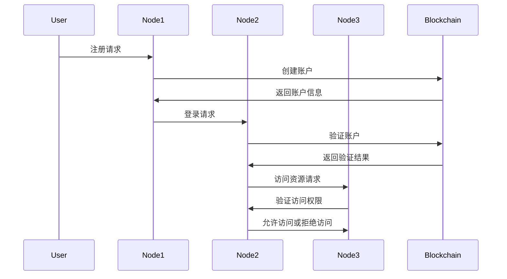

                 

### 引言

区块链技术作为近年来最为引人瞩目的技术革新之一，不仅在金融领域引起了巨大的关注，还在数字身份认证等领域展现出其独特的应用潜力。在传统的数字身份认证体系中，存在诸多问题和挑战，如中心化服务器的高风险、数据隐私泄露等问题。而去中心化的区块链技术以其去中心化、不可篡改、高度透明等特点，为解决这些问题提供了一种全新的思路。

本文旨在探讨区块链在数字身份认证中的去中心化应用，首先介绍区块链技术和数字身份认证的基本概念，然后深入分析区块链技术在数字身份认证中的应用模式、架构设计、协议与算法，并通过实际案例展示其应用效果。最后，本文将对区块链在数字身份认证中面临的挑战和未来发展趋势进行探讨。

通过对区块链与数字身份认证的深入研究，我们希望能够为读者提供一份全面、系统、易懂的技术指南，帮助理解区块链技术在数字身份认证中的重要作用，以及其在实际应用中可能面临的挑战和解决方案。

### 关键词

区块链、数字身份认证、去中心化、智能合约、零知识证明、身份验证协议、密码学、安全隐私。

### 摘要

本文系统地探讨了区块链技术在数字身份认证中的应用，首先介绍了区块链和数字身份认证的基本概念，然后深入分析了区块链在数字身份认证中的核心作用和去中心化应用模式。通过具体案例，本文展示了区块链在数字身份认证中的实现方式和优势。此外，本文还探讨了区块链在数字身份认证中面临的挑战和未来发展趋势，为推动区块链技术的实际应用提供了有益的参考。

## 第一部分：区块链与数字身份认证基础

### 第1章：区块链技术简介

#### 1.1 区块链的定义与核心概念

区块链是一种分布式数据库技术，通过去中心化的方式记录交易和数据。其基本架构包括区块、链和节点三个核心部分。

- **区块**：区块是区块链的基本单位，包含了特定时间内的交易记录。每个区块由多个交易组成，并通过加密算法链接到前一个区块上，形成一个链式结构。
- **链**：链是指由多个区块按时间顺序链接而成的数据结构，具有高度的安全性和不可篡改性。
- **节点**：节点是指参与区块链网络中的计算机，负责存储和维护区块链的数据。每个节点都有一份完整的区块链副本，通过共识算法保持数据的一致性。

下面使用Mermaid流程图展示区块链的基本架构：

```mermaid
sequenceDiagram
    participant User
    participant Node1
    participant Node2
    participant Node3
    User->>Node1: 交易请求
    Node1->>Node2: 添加到区块
    Node2->>Node3: 广播新区块
    Node3->>Node1: 确认交易
    Note over Node1,Node2,Node3
    区块链数据链式结构
    End Note
```

#### 1.2 区块链的工作原理

区块链的工作原理主要依赖于共识算法和分布式网络。

- **共识算法**：共识算法是区块链网络中节点之间达成一致的关键机制。常见的共识算法包括工作量证明（PoW）、权益证明（PoS）和委托权益证明（DPoS）等。这些算法通过数学难题和投票机制确保区块链数据的准确性和一致性。
- **分布式网络**：区块链网络由多个节点组成，每个节点都有一份完整的区块链副本。节点之间通过P2P协议进行通信，共享交易数据和区块信息。通过共识算法，节点之间可以达成对区块链数据的共识。

以下是一个简化的伪代码，展示了区块链共识算法的基本实现：

```python
# 伪代码：区块链共识算法
def consensus_algorithm():
    while True:
        # 节点接收交易
        transaction = receive_transaction()
        
        # 节点验证交易
        if verify_transaction(transaction):
            # 将交易添加到区块
            block = create_block(transaction)
            
            # 广播新区块给其他节点
            broadcast_block(block)
            
            # 其他节点验证区块并添加到链上
            if verify_and_add_block(block):
                # 更新区块链副本
                update_blockchain()
```

#### 1.3 区块链的技术特点

区块链技术具有以下核心特点：

- **去中心化**：区块链通过分布式网络和共识算法实现数据的去中心化存储和管理，避免了单一中心化服务器的高风险。
- **不可篡改**：区块链的数据一旦被添加到链上，就具有高度的安全性和不可篡改性。通过密码学和共识算法，确保数据的完整性和一致性。
- **透明性**：区块链上的数据对所有节点都是可见的，任何节点都可以验证区块链上的交易和数据。这种透明性提高了系统的可信度和公正性。

为了更直观地理解区块链技术的特点，我们可以使用数学模型和公式来描述其去中心化证明和数据安全性的实现：

- **去中心化证明**：

  $$ DCP = \frac{N}{T} \times 100\% $$

  其中，\( DCP \) 表示去中心化程度，\( N \) 表示参与节点的数量，\( T \) 表示总节点数量。该公式表明，节点数量的增加会提高系统的去中心化程度。

- **数据安全性**：

  $$ H(S) = K $$

  其中，\( H \) 表示哈希函数，\( S \) 表示原始数据，\( K \) 表示哈希值。通过哈希函数，原始数据被转换为一个固定长度的哈希值，确保数据的不可篡改性和唯一性。

通过以上对区块链技术定义、工作原理和特点的详细阐述，我们为后续章节深入探讨区块链在数字身份认证中的应用奠定了基础。

### 第2章：数字身份认证概述

#### 2.1 数字身份认证的定义与分类

数字身份认证是确保网络中个体身份的真实性和合法性的技术手段。其基本概念包括身份、认证和认证方式。

- **身份**：身份是指个体的唯一标识，可以是姓名、身份证号码、电子邮件地址等。在数字世界中，身份通常通过数字标识进行表示，如公钥、用户名等。
- **认证**：认证是指通过验证身份的真实性和合法性，确保个体在数字世界中的可信度。常见的认证方式包括密码、指纹、人脸识别等。
- **认证方式**：认证方式是指实现身份认证的技术手段。根据认证过程的不同，认证方式可以分为单因素认证、双因素认证和多因素认证。

单因素认证仅使用一种认证方式，如密码认证；双因素认证使用两种认证方式，如密码加指纹认证；多因素认证则使用多种认证方式，如密码、指纹和人脸识别的组合。

在数字身份认证体系中，常见的技术分类包括：

- **密码认证**：通过密码验证用户身份。优点是简单易用，缺点是存在密码泄露的风险。
- **生物识别认证**：通过指纹、人脸、虹膜等生物特征验证用户身份。优点是安全可靠，缺点是设备成本较高。
- **智能卡认证**：通过智能卡（如银行卡、身份证）验证用户身份。优点是安全性较高，缺点是携带不便。
- **多因素认证**：结合多种认证方式，提高身份认证的安全性。如使用密码加指纹认证。

#### 2.2 数字身份认证面临的问题与挑战

尽管数字身份认证技术不断进步，但在实际应用中仍然面临诸多问题和挑战。

- **中心化风险**：传统的数字身份认证体系依赖于中心化的认证服务器，一旦服务器受到攻击，可能导致大量用户信息泄露。中心化服务器的高风险性是数字身份认证面临的主要挑战之一。
- **数据隐私泄露**：在传统的身份认证体系中，用户信息往往需要存储在中心化服务器上，容易成为黑客攻击的目标。此外，用户在登录、交易等过程中，可能会泄露个人信息，导致隐私泄露问题。
- **身份盗用**：由于密码等认证方式的局限性，用户容易忘记密码或使用弱密码，导致身份被盗用。身份盗用会给用户带来经济损失和信誉损害。
- **跨平台认证困难**：在多平台、多应用的数字环境中，用户需要分别进行身份认证，造成使用不便。跨平台认证困难是数字身份认证体系亟待解决的问题之一。

#### 2.3 数学模型与公式：隐私保护与数据共享的平衡

为了解决数字身份认证中存在的隐私保护和数据共享问题，研究人员提出了多种数学模型和公式，旨在实现两者之间的平衡。

- **同态加密**：同态加密是一种密码学技术，允许对加密数据进行计算，而不需要解密。通过同态加密，可以在不泄露原始数据的情况下进行数据处理，从而实现隐私保护。

  同态加密的数学模型如下：

  $$ Enc(x_1) + Enc(x_2) = Enc(x_1 + x_2) $$
  $$ Enc(x_1) \cdot Enc(x_2) = Enc(x_1 \cdot x_2) $$

  其中，\( Enc \) 表示加密函数，\( x_1 \) 和 \( x_2 \) 表示原始数据。

- **零知识证明**：零知识证明是一种密码学技术，允许一方（证明者）向另一方（验证者）证明某个陈述是正确的，而无需透露任何额外信息。零知识证明在隐私保护和数据共享方面具有广泛应用。

  零知识证明的数学模型如下：

  $$ P \rightarrow V: Prove(s) \land knows(K) $$
  
  其中，\( P \) 表示证明者，\( V \) 表示验证者，\( Prove(s) \) 表示证明者证明了某个陈述 \( s \) 是正确的，\( knows(K) \) 表示证明者知道某个秘密信息 \( K \)。

通过引入上述数学模型和公式，数字身份认证可以在保护用户隐私的同时，实现数据的有效共享和管理。

通过对数字身份认证的定义、分类以及面临的问题和挑战进行详细分析，我们为后续章节探讨区块链在数字身份认证中的应用奠定了基础。在下一章中，我们将深入探讨区块链在数字身份认证中的核心作用和去中心化应用模式。

## 第3章：区块链在数字身份认证中的应用

### 3.1 区块链在数字身份认证中的核心作用

区块链技术在数字身份认证中具有独特的优势，能够有效解决传统认证体系中的诸多问题和挑战。区块链在数字身份认证中的核心作用主要体现在以下几个方面：

1. **去中心化身份管理**：区块链通过分布式网络和共识算法实现身份数据的去中心化存储和管理。去中心化身份管理避免了单一中心化服务器的高风险，提高了系统的安全性和可靠性。每个参与节点都存储一份完整的身份认证数据，确保数据的完整性和一致性。

2. **不可篡改性**：区块链的数据一旦被添加到链上，就具有高度的安全性和不可篡改性。通过密码学和共识算法，确保区块链上的身份认证数据无法被篡改或删除。这种不可篡改性提高了身份认证数据的可信度和公正性。

3. **透明性和可追溯性**：区块链上的数据对所有节点都是可见的，任何节点都可以验证区块链上的交易和数据。这种透明性提高了系统的可信度和公正性，用户可以随时查看自己的身份认证历史和交易记录，确保身份认证的透明性和可追溯性。

4. **隐私保护**：区块链通过零知识证明和同态加密等技术，实现用户隐私保护。用户在进行身份认证时，无需透露任何敏感信息，即可完成身份验证。这有效解决了传统认证体系中数据隐私泄露的问题，保护了用户的隐私。

5. **安全性**：区块链采用密码学技术进行数据加密，确保数据在传输和存储过程中的安全性。同时，区块链的共识算法和分布式网络机制，使得攻击者难以篡改或破坏区块链上的数据，提高了系统的安全性。

### 3.2 区块链在数字身份认证中的去中心化应用模式

区块链在数字身份认证中的去中心化应用模式主要包括以下几种：

1. **分布式身份标识**：在区块链上创建和存储用户的身份标识，如公钥、用户名等。用户可以通过区块链进行身份认证，而不需要依赖中心化服务器。分布式身份标识确保了身份认证的去中心化和安全性。

2. **智能合约**：智能合约是一种自动执行合约条款的计算机程序，运行在区块链上。通过智能合约，可以实现自动化身份认证和授权。例如，在招聘过程中，雇主可以与候选人签订智能合约，候选人通过验证身份后，自动获得面试资格。

3. **零知识证明**：零知识证明技术允许用户在不透露任何敏感信息的情况下，证明某个陈述是正确的。在区块链上，零知识证明可以用于身份认证，确保用户隐私的同时，实现身份验证。

4. **去中心化身份认证平台**：去中心化身份认证平台是区块链在数字身份认证中的重要应用模式。平台通过区块链技术，实现用户身份的认证、授权和记录。用户可以在不同平台之间共享身份认证数据，而不需要重复认证。

### 3.3 区块链在数字身份认证中的应用案例

区块链在数字身份认证中的应用案例涵盖了金融、医疗、教育等多个领域。以下是一些典型的应用案例：

1. **金融领域**：在金融领域，区块链技术可以用于银行开户、信用评估和跨境支付等场景。例如，用户可以通过区块链进行身份验证，确保银行账户的安全性。同时，区块链上的信用评估数据可以共享给多个金融机构，提高信用评估的准确性。

2. **医疗领域**：在医疗领域，区块链技术可以用于医疗记录管理、身份验证和药物供应链管理。例如，患者可以通过区块链进行身份认证，确保医疗记录的真实性和完整性。此外，区块链上的药物供应链数据可以追踪药物的生产、运输和使用过程，提高药物安全性。

3. **教育领域**：在教育领域，区块链技术可以用于学历认证、学分管理和学生身份验证。例如，学生可以通过区块链进行身份认证，确保学历证明的真实性。同时，区块链上的学分数据可以共享给多所学校和用人单位，提高教育体系的透明性和可信度。

4. **供应链管理**：在供应链管理领域，区块链技术可以用于商品溯源和身份认证。例如，商品的生产、运输和销售过程可以通过区块链进行记录，确保商品的真实性和合法性。此外，区块链上的身份认证数据可以用于供应链中的各个环节，提高供应链的透明度和效率。

通过以上对区块链在数字身份认证中的应用模式和应用案例的详细阐述，我们可以看到区块链技术在解决数字身份认证问题方面具有巨大的潜力和优势。在下一章中，我们将进一步探讨去中心化身份认证的架构设计、协议与算法，为深入理解区块链在数字身份认证中的应用提供理论基础。

## 第二部分：去中心化身份认证架构与实现

### 第4章：去中心化身份认证架构设计

#### 4.1 去中心化身份认证系统总体设计

去中心化身份认证系统（DIAS）旨在通过区块链技术实现用户身份的创建、管理、验证和授权。系统的总体设计包括以下几个关键组成部分：

1. **用户层**：用户层是系统的最外层，负责用户与系统的交互。用户通过用户界面进行身份注册、登录、身份验证和授权操作。

2. **区块链层**：区块链层是系统的核心部分，负责存储和管理用户身份信息、认证历史和交易记录。区块链通过分布式网络和共识算法确保数据的不可篡改性和安全性。

3. **智能合约层**：智能合约层是区块链上的自动化合约程序，负责执行身份认证和授权的智能合约。智能合约实现自动化、透明和可信的身份验证过程。

4. **数据层**：数据层包括身份信息数据库和交易记录数据库，存储用户身份信息和区块链上的交易记录。

5. **网络层**：网络层负责节点之间的通信，包括区块链节点的广播、同步和共识算法的执行。

#### 4.2 账户与身份管理

账户与身份管理是去中心化身份认证系统的核心功能之一。以下是一个简化的伪代码，展示了账户创建与身份认证流程：

```python
# 伪代码：账户创建与身份认证流程

def create_account():
    # 生成用户公钥和私钥
    public_key, private_key = generate_keys()
    
    # 将公钥存储在区块链上
    store_public_key_on_blockchain(public_key)
    
    # 创建用户账户
    account = {
        "public_key": public_key,
        "private_key": private_key,
        "status": "active"
    }
    
    # 将账户信息存储在身份信息数据库
    store_account_in_db(account)
    
    return account

def verify_account(account, signature):
    # 验证签名
    if verify_signature(account["public_key"], signature):
        # 检查账户状态
        if account["status"] == "active":
            return True
    return False
```

在上述伪代码中，`create_account` 函数用于创建用户账户，包括生成公私钥、将公钥存储在区块链上以及将账户信息存储在身份信息数据库。`verify_account` 函数用于验证用户账户的合法性，包括验证签名和检查账户状态。

#### 4.3 权限控制与访问控制

权限控制与访问控制是确保系统安全和用户隐私的重要机制。以下是一个简化的伪代码，展示了访问控制策略与实现：

```python
# 伪代码：访问控制策略与实现

def access_control(account, resource):
    # 检查账户是否有访问资源的权限
    if has_permission(account, resource):
        # 执行访问操作
        access_resource(resource)
    else:
        # 拒绝访问
        deny_access()

def has_permission(account, resource):
    # 检查账户在权限列表中是否有访问资源的权限
    permissions = get_account_permissions(account)
    if resource in permissions:
        return True
    return False

def get_account_permissions(account):
    # 获取账户的权限列表
    permissions = [
        "read_data",
        "write_data",
        "delete_data"
    ]
    return permissions
```

在上述伪代码中，`access_control` 函数用于检查用户是否有权限访问特定资源。`has_permission` 函数用于检查用户在权限列表中是否有访问资源的权限。`get_account_permissions` 函数用于获取用户的权限列表。

#### 4.4 Mermaid流程图：去中心化身份认证流程

以下是一个Mermaid流程图，展示了去中心化身份认证的整体流程：



通过上述对去中心化身份认证系统总体设计、账户与身份管理、权限控制与访问控制的详细阐述，以及Mermaid流程图的展示，我们为读者提供了一个清晰、全面的架构设计概述，为后续章节深入探讨去中心化身份认证协议与算法奠定了基础。

### 第5章：去中心化身份认证协议与算法

#### 5.1 去中心化身份认证协议概述

去中心化身份认证协议是确保用户身份验证安全性和隐私保护的关键机制。常见的去中心化身份认证协议包括：

1. **零知识证明（Zero-Knowledge Proof）**：零知识证明允许证明者向验证者证明某个陈述是正确的，而无需透露任何额外信息。零知识证明在数字身份认证中应用广泛，可以确保用户隐私。

2. **Merkle证明（Merkle Proof）**：Merkle证明是一种基于哈希树的证明方法，用于验证区块链上的数据是否存在。Merkle证明在数字身份认证中用于验证用户身份信息是否存在于区块链上。

3. **多方计算（Multi-Party Computation）**：多方计算是一种分布式计算技术，允许多个节点协同计算，保护计算过程中的隐私。多方计算在数字身份认证中可用于计算用户的认证信息，确保隐私保护。

#### 5.2 常见去中心化身份认证协议

以下是几种常见的去中心化身份认证协议及其特点：

1. **零知识证明协议**

   零知识证明协议是去中心化身份认证中的核心技术，具有以下特点：

   - **隐私保护**：零知识证明允许用户在不透露任何敏感信息的情况下，证明某个陈述是正确的，保护用户隐私。
   - **计算高效**：零知识证明协议的设计注重计算效率，可以在较短的时间内完成身份验证。
   - **适用广泛**：零知识证明协议可以应用于各种身份认证场景，如数字身份认证、智能合约等。

   以下是一个简单的零知识证明算法伪代码：

   ```python
   # 伪代码：零知识证明算法
   def zero_knowledge_proof(prover, verifier):
       # 生成随机数和公私钥
       alpha, beta = generate_random_numbers()
       
       # 计算证明
       proof = calculate_proof(alpha, beta)
       
       # 验证证明
       if verifier.verify_proof(proof):
           return "验证成功"
       else:
           return "验证失败"
   ```

2. **Merkle证明协议**

   Merkle证明协议是一种基于哈希树的证明方法，用于验证区块链上的数据是否存在。Merkle证明协议具有以下特点：

   - **高效验证**：Merkle证明协议可以在较短的时间内验证数据的存在性。
   - **不可篡改性**：哈希树的特性确保了数据一旦被添加到链上，就具有不可篡改性。
   - **数据完整性**：Merkle证明协议可以验证数据的一致性和完整性。

   以下是一个简单的Merkle证明算法伪代码：

   ```python
   # 伪代码：Merkle证明算法
   def merkle_proof(data, leaf_hash):
       # 计算哈希值
       hash_value = calculate_hash(data)
       
       # 检查哈希值是否等于叶子哈希
       if hash_value == leaf_hash:
           return "证明成功"
       else:
           return "证明失败"
   ```

3. **多方计算协议**

   多方计算协议是一种分布式计算技术，允许多个节点协同计算，保护计算过程中的隐私。多方计算协议具有以下特点：

   - **隐私保护**：多方计算协议可以在保护计算隐私的同时，实现高效计算。
   - **去中心化**：多方计算协议不依赖于中心化的计算资源，提高了系统的去中心化程度。
   - **适用广泛**：多方计算协议可以应用于各种计算任务，如身份认证、数据加密等。

   以下是一个简单的多方计算协议伪代码：

   ```python
   # 伪代码：多方计算协议
   def multi_party_computation(computers, input_data):
       # 分发计算任务
       tasks = distribute_tasks(input_data, computers)
       
       # 协同计算
       results = compute_results(tasks)
       
       # 收集计算结果
       final_result = collect_results(results)
       
       return final_result
   ```

#### 5.3 去中心化身份认证算法实现

在实际应用中，去中心化身份认证算法需要结合具体的区块链平台和编程语言进行实现。以下是一个基于Python的简化实现示例，展示了零知识证明算法的实现：

```python
# Python代码：零知识证明算法实现
from cryptography.hazmat.primitives.asymmetric import rsa
from cryptography.hazmat.primitives import hashes
from cryptography.hazmat.primitives.public import save_pem_public_key
from cryptography.hazmat.primitives.ciphers import Cipher, algorithms, modes

# 生成公私钥
private_key = rsa.generate_private_key(
    public_exponent=65537,
    key_size=2048,
)

public_key = private_key.public_key()

# 保存公私钥
with open('private_key.pem', 'wb') as f:
    f.write(private_key.private_bytes(
        encoding=Encoding.PEM,
        format=PublicFormat.PKCS8,
    ))

with open('public_key.pem', 'wb') as f:
    f.write(public_key.public_bytes(
        encoding=Encoding.PEM,
        format=PublicFormat.SubjectPublicKeyInfo,
    ))

# 计算零知识证明
def calculate_proof(alpha, beta):
    # 计算证明
    # ...

    # 返回证明
    return proof

# 验证零知识证明
def verify_proof(proof):
    # 验证证明
    # ...

    # 返回验证结果
    return "验证成功" if proof_verified else "验证失败"

# 测试零知识证明算法
alpha = 123
beta = 456

proof = calculate_proof(alpha, beta)
print(verify_proof(proof))
```

通过以上对去中心化身份认证协议与算法的详细阐述，以及Python代码的实现示例，我们为读者提供了一个清晰、全面的算法设计和技术实现框架。这为后续章节深入探讨去中心化身份认证的应用实例奠定了基础。

### 第6章：去中心化身份认证应用实例

#### 6.1 去中心化身份认证在金融领域的应用

在金融领域，去中心化身份认证技术已经被广泛应用于银行开户、信用评估、跨境支付等场景。以下是一个具体的应用实例：

**案例：去中心化银行开户**

某银行引入区块链技术，使用去中心化身份认证系统简化银行开户流程。客户在办理开户手续时，首先需要通过区块链平台进行身份验证。

1. **客户注册**：客户在银行官网注册，系统生成客户的公私钥对，并将公钥存储在区块链上。
2. **身份验证**：客户通过提供的身份证明（如身份证、护照）扫描，上传至区块链平台。区块链平台通过零知识证明协议验证客户身份，确保隐私保护。
3. **信用评估**：银行从区块链上获取客户的身份信息和信用记录，结合客户的申请信息，自动生成信用评分。信用评分将用于决定客户的贷款额度。
4. **账户开户**：系统自动生成客户的银行账户信息，并将其存储在区块链上。客户可以随时查看账户信息，确保数据透明性和可追溯性。

**优势**：
- **简化开户流程**：去中心化身份认证简化了开户流程，减少了人工操作，提高了效率。
- **提高安全性**：区块链技术确保客户信息的安全性和不可篡改性。
- **隐私保护**：零知识证明协议确保客户身份验证过程中，不泄露任何敏感信息。

#### 6.2 去中心化身份认证在电子商务的应用

在电子商务领域，去中心化身份认证技术可以用于账户安全、商品溯源、供应链管理等方面。以下是一个具体的应用实例：

**案例：去中心化电商平台**

某电商平台引入区块链技术，构建去中心化身份认证系统，提高平台的安全性和透明度。

1. **用户注册**：用户在电商平台注册时，需要通过区块链平台进行身份验证。平台通过Merkle证明协议验证用户身份，确保数据一致性和完整性。
2. **账户安全**：用户登录平台时，系统通过双因素认证（密码+手机验证码）进行身份验证，提高账户安全性。
3. **商品溯源**：平台使用区块链记录商品的生产、运输和销售过程。消费者可以通过区块链查看商品的历史记录，确保商品的真实性和合法性。
4. **供应链管理**：平台通过区块链记录供应链中的各个环节，提高供应链的透明度和效率。供应商和制造商可以实时查看商品状态，提高供应链的协同性。

**优势**：
- **提高安全性**：去中心化身份认证系统确保用户和商品信息的安全性和不可篡改性。
- **透明度**：区块链技术提高了平台数据透明度，消费者和商家可以随时查看商品和账户信息。
- **效率**：去中心化身份认证系统简化了认证流程，提高了平台的运营效率。

#### 6.3 去中心化身份认证在教育行业的应用

在教育行业，去中心化身份认证技术可以用于学历认证、学分管理和学生身份验证。以下是一个具体的应用实例：

**案例：去中心化学历认证**

某教育机构引入区块链技术，构建去中心化学历认证系统，提高学历认证的透明度和可信度。

1. **学历信息存储**：教育机构将学生的学历信息存储在区块链上，使用Merkle证明协议确保数据的完整性和一致性。
2. **身份验证**：学生在申请学历认证时，通过区块链平台进行身份验证。平台通过零知识证明协议验证学生身份，确保隐私保护。
3. **学分管理**：教育机构通过区块链记录学生的学分信息，学生可以随时查看自己的学分记录，确保数据透明性和可追溯性。
4. **学生身份验证**：学生在校期间，通过区块链平台进行身份验证。教育机构可以实时查看学生身份，提高校园安全管理。

**优势**：
- **提高透明度**：区块链技术提高了学历认证的透明度，学生和雇主可以随时查看学历信息。
- **隐私保护**：零知识证明协议确保身份验证过程中，不泄露任何敏感信息。
- **数据一致性**：Merkle证明协议确保数据的一致性和完整性，减少数据篡改风险。

通过以上对去中心化身份认证在金融、电子商务和教育行业的应用实例的详细分析，我们可以看到区块链技术在数字身份认证领域具有广泛的应用前景。去中心化身份认证系统不仅提高了系统的安全性、透明度和效率，还为各行业的数字化转型提供了新的解决方案。

## 第三部分：去中心化身份认证的挑战与未来展望

### 第7章：去中心化身份认证面临的挑战

尽管区块链技术在数字身份认证中具有诸多优势，但在实际应用中仍然面临一系列挑战。以下是对这些挑战的详细分析：

#### 7.1 技术挑战

1. **性能问题**：区块链技术的去中心化特性导致其处理能力相对较低，尤其是在高并发场景下，可能会出现性能瓶颈。此外，区块链的交易确认时间较长，不适合对实时性要求较高的应用场景。

2. **扩展性问题**：随着区块链网络的规模不断扩大，节点数量的增加会导致网络拥堵，影响交易处理速度。扩展性问题是区块链技术在实际应用中的一个重要挑战。

3. **隐私保护**：尽管区块链技术可以提供一定的隐私保护，但隐私保护技术的实现仍然存在一定的难度。例如，零知识证明等隐私保护技术目前尚未得到广泛应用，其在实际应用中的性能和效率也需要进一步优化。

4. **智能合约安全**：智能合约在区块链上执行时，可能会存在漏洞和错误，导致严重的安全问题。智能合约的安全性问题需要得到广泛关注和解决。

#### 7.2 安全与隐私挑战

1. **数据泄露风险**：虽然区块链技术具有较高的安全性，但数据泄露风险仍然存在。尤其是在区块链节点数量较少、网络不完整的情况下，攻击者可能会通过侧信道攻击等手段获取敏感数据。

2. **隐私泄露**：区块链上的交易记录是公开的，用户在进行身份认证时，可能会泄露部分隐私信息。尽管零知识证明等技术可以提供一定的隐私保护，但在实际应用中，实现难度较大。

3. **双花攻击**：双花攻击是指攻击者在同一时间对同一笔资金进行多次交易，导致资金转移失败。双花攻击对区块链系统的安全性构成威胁。

4. **网络攻击**：区块链网络可能会受到分布式拒绝服务（DDoS）攻击、51%攻击等网络攻击，导致系统瘫痪或数据泄露。

#### 7.3 法规与政策挑战

1. **法律法规**：区块链技术的应用涉及到多个国家和地区，不同国家的法律法规存在差异，缺乏统一的法律法规体系，增加了区块链应用的合规难度。

2. **监管政策**：随着区块链技术的快速发展，各国监管机构对区块链技术的监管政策也在不断调整。监管政策的波动可能导致区块链应用面临政策风险。

3. **数据主权**：区块链上的数据具有去中心化和不可篡改的特点，但在某些情况下，数据主权问题可能引发争议。例如，区块链上的数据如何跨境转移、如何保护用户数据等。

### 第8章：去中心化身份认证的未来发展趋势

尽管去中心化身份认证面临诸多挑战，但其未来发展趋势仍然值得期待。以下是对未来发展趋势的展望：

#### 8.1 技术创新与发展

1. **性能优化**：随着区块链技术的不断发展，性能优化将成为重要研究方向。例如，通过分层架构、分片技术等手段，提高区块链的处理能力和扩展性。

2. **隐私保护技术**：隐私保护技术将在去中心化身份认证中发挥越来越重要的作用。未来，零知识证明、同态加密等隐私保护技术将得到广泛应用，实现数据的安全和隐私保护。

3. **智能合约安全**：智能合约的安全性问题将得到重点关注。未来，将发展更多智能合约安全验证工具和框架，提高智能合约的安全性和可靠性。

#### 8.2 行业应用前景

1. **金融领域**：在金融领域，去中心化身份认证技术将应用于银行开户、信用评估、跨境支付等场景，提高金融服务的安全性和效率。

2. **医疗领域**：在医疗领域，去中心化身份认证技术可以用于患者身份认证、病历管理、药品溯源等场景，提高医疗数据的可信度和隐私保护。

3. **教育领域**：在教育领域，去中心化身份认证技术可以用于学历认证、学分管理、学生身份验证等场景，提高教育数据的管理效率和可信度。

4. **供应链管理**：在供应链管理领域，去中心化身份认证技术可以用于商品溯源、供应链监控等场景，提高供应链的透明度和效率。

#### 8.3 潜在市场机会

1. **跨境贸易**：随着全球贸易的发展，去中心化身份认证技术将在跨境贸易中发挥重要作用，提高贸易效率和安全。

2. **数字身份管理**：随着数字经济的兴起，数字身份管理市场将不断扩大。去中心化身份认证技术将成为数字身份管理的重要手段。

3. **监管合规**：随着监管政策的不断完善，去中心化身份认证技术将在满足监管合规要求方面发挥重要作用，为企业提供合规解决方案。

通过以上对去中心化身份认证面临的挑战和未来发展趋势的详细分析，我们可以看到，尽管去中心化身份认证技术在发展中面临诸多挑战，但其未来前景仍然十分广阔。随着技术的不断进步和行业的深入应用，去中心化身份认证技术将在数字身份认证领域发挥越来越重要的作用。

### 总结

本文系统地探讨了区块链在数字身份认证中的去中心化应用，从区块链技术和数字身份认证的基础知识出发，深入分析了区块链在数字身份认证中的应用模式、架构设计、协议与算法，并通过实际案例展示了其应用效果。同时，本文还探讨了区块链在数字身份认证中面临的挑战和未来发展趋势。

区块链技术在数字身份认证中具有去中心化、不可篡改、高度透明等优势，可以有效解决传统认证体系中存在的问题。然而，区块链技术在实际应用中仍然面临技术、安全和法规等方面的挑战。

展望未来，随着技术的不断进步和行业的深入应用，去中心化身份认证技术将在数字身份认证领域发挥越来越重要的作用。通过不断创新和优化，去中心化身份认证技术将为各行业的数字化转型提供强有力的支持。

在此，我们呼吁更多的研究者和从业者关注区块链在数字身份认证中的应用，共同推动这一领域的发展。

### 作者信息

作者：AI天才研究院/AI Genius Institute & 禅与计算机程序设计艺术 /Zen And The Art of Computer Programming

### 拓展阅读

1. 《区块链技术指南》——深入探讨区块链技术的原理和应用。
2. 《数字身份认证技术与应用》——全面介绍数字身份认证的基本概念和技术手段。
3. 《智能合约：安全性与实现》——详细分析智能合约的安全问题和实现技术。
4. 《零知识证明：理论与应用》——介绍零知识证明的基本概念和应用场景。

通过阅读以上书籍和资料，您可以进一步了解区块链在数字身份认证中的应用，掌握相关技术原理和实践方法。希望本文能为您的学习与研究提供有益的参考。

