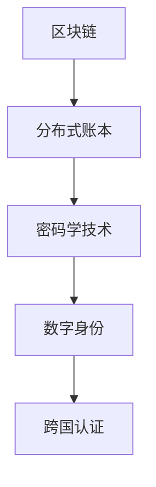

                 

### 文章标题

# 区块链在数字身份跨国认证中的应用

> 关键词：区块链，数字身份，跨国认证，安全，效率，隐私保护

> 摘要：本文将深入探讨区块链技术在数字身份跨国认证中的应用，分析其优势与挑战，并从核心概念、算法原理、实际案例等多个角度进行详细讲解。

---

区块链技术以其去中心化、不可篡改和透明性等特性，在许多领域展现出了巨大的潜力。尤其在数字身份跨国认证方面，区块链技术提供了一种更为安全、高效和隐私保护的解决方案。本文将围绕这一主题，详细探讨区块链在数字身份跨国认证中的应用。

## 背景介绍

### 区块链技术的发展历程

区块链技术起源于2008年，由一位名为中本聪的匿名人士首次提出。其核心思想是通过分布式账本技术实现去中心化的数据存储和交换。区块链在比特币中的应用标志着其诞生，此后迅速扩展至金融、供应链管理、物联网等多个领域。

### 数字身份跨国认证的需求

随着全球化进程的加快，跨国认证的需求日益增长。然而，传统的身份认证方式存在诸多问题，如信息泄露、数据篡改、认证效率低下等。数字身份跨国认证旨在实现跨机构、跨地域的身份验证，提高认证的安全性和效率。

### 区块链在数字身份跨国认证中的应用

区块链技术提供了一种全新的解决方案，通过分布式账本和智能合约，实现数字身份的创建、验证和交换。其去中心化和不可篡改的特性，使得数字身份跨国认证更加安全、可信。

## 核心概念与联系

### 区块链

区块链是一个分布式账本，由一系列按时间顺序排列的区块组成。每个区块包含一定数量的交易记录，并通过密码学技术确保数据的安全性和不可篡改性。

### 数字身份

数字身份是指在网络空间中代表个体的唯一标识。它包括个人基本信息、认证信息、行为记录等。数字身份的创建、验证和交换是数字身份跨国认证的核心。

### 跨国认证

跨国认证是指在不同国家和机构之间进行身份验证的过程。区块链技术为跨国认证提供了一种去中心化的解决方案，提高了认证的效率和安全。

### Mermaid 流程图



## 核心算法原理讲解

### 区块链算法原理

区块链的核心算法包括哈希算法、共识算法和智能合约。哈希算法用于确保数据的唯一性和不可篡改性；共识算法用于确定区块链中数据的合法性和一致性；智能合约则是一种自动执行的合约，实现了数字身份的创建、验证和交换。

#### Python源代码示例

```python
import hashlib

def hash_function(data):
    return hashlib.sha256(data.encode()).hexdigest()

data = "Hello, World!"
hash_value = hash_function(data)
print(f"Hash Value: {hash_value}")
```

### 数字身份认证算法原理

数字身份认证算法主要包括用户身份验证、身份信息加密和身份信息验证等步骤。通过这些算法，确保数字身份的真实性和安全性。

#### Python源代码示例

```python
from cryptography.fernet import Fernet

# 生成密钥
key = Fernet.generate_key()
cipher_suite = Fernet(key)

# 加密
message = "This is a secret message."
encrypted_message = cipher_suite.encrypt(message.encode())
print(f"Encrypted Message: {encrypted_message}")

# 解密
decrypted_message = cipher_suite.decrypt(encrypted_message).decode()
print(f"Decrypted Message: {decrypted_message}")
```

### 跨国认证算法原理

跨国认证算法涉及多个国家和机构的合作，通过区块链技术实现跨机构的身份信息交换和验证。其核心在于共识机制的建立和智能合约的执行。

#### Python源代码示例

```python
from web3 import Web3
from solc import compile_source

# 编译智能合约
contract_source = '''
pragma solidity ^0.8.0;

contract IdentityVerification {
    function verifyIdentity(address identity) public view returns (bool) {
        // 验证身份逻辑
        return true;
    }
}
'''

compiled_source = compile_source(contract_source)
contract_interface = compiled_source['<stdin>:IdentityVerification']
contract = web3.eth.contract(abi=contract_interface['abi'])

# 部署智能合约
deployed_contract = contract.deploy()
transaction_hash = deployed_contract.transactionHash
print(f"Transaction Hash: {transaction_hash}")

# 执行智能合约
result = deployed_contract.functions.verifyIdentity(web3.toChecksumAddress("0x...")).call()
print(f"Verification Result: {result}")
```

## 项目实战

### 开发环境搭建

为了实现区块链在数字身份跨国认证中的应用，我们需要搭建一个适合开发的环境。以下是开发环境搭建的步骤：

1. 安装Python环境
2. 安装区块链节点（例如，安装Ethereum节点）
3. 安装相关库（例如，web3.py、cryptography）

### 源代码实现

以下是一个简单的区块链数字身份认证系统的源代码实现：

```python
# blockchain.py
import hashlib
import json
from time import time

class Blockchain:
    def __init__(self):
        self.unconfirmed_transactions = []
        self.chain = []
        self.create_genesis_block()

    def create_genesis_block(self):
        genesis_block = {
            'previous_hash': 1,
            'timestamp': time(),
            'transactions': [],
            'hash': self.compute_hash(),
        }
        self.chain.append(genesis_block)

    def compute_hash(self):
        block_string = json.dumps(self.chain[-1], sort_keys=True)
        return hashlib.sha256(block_string.encode()).hexdigest()

    def add_new_transaction(self, transaction):
        self.unconfirmed_transactions.append(transaction)

    def mine(self):
        if not self.unconfirmed_transactions:
            return False

        last_block = self.chain[-1]
        new_block = {
            'previous_hash': last_block['hash'],
            'timestamp': time(),
            'transactions': self.unconfirmed_transactions,
            'hash': self.compute_hash(),
        }
        self.chain.append(new_block)
        self.unconfirmed_transactions = []
        return new_block

    def is_chain_valid(self):
        for i in range(1, len(self.chain)):
            current = self.chain[i]
            previous = self.chain[i - 1]
            if current['hash'] != self.compute_hash():
                return False
            if current['previous_hash'] != previous['hash']:
                return False
        return True

if __name__ == '__main__':
    blockchain = Blockchain()
    blockchain.add_new_transaction('Alice -> Bob -> 1 BTC')
    blockchain.mine()
    print(blockchain.chain)
    print(blockchain.is_chain_valid())
```

### 代码解读与分析

在上面的代码中，我们定义了一个名为`Blockchain`的类，用于实现区块链的基本功能。`Blockchain`类的主要方法包括：

- `__init__`：初始化区块链，创建创世区块。
- `create_genesis_block`：创建创世区块。
- `compute_hash`：计算区块的哈希值。
- `add_new_transaction`：添加新的交易。
- `mine`：挖矿，将未确认的交易打包成新区块。
- `is_chain_valid`：验证区块链是否有效。

### 实际案例分析与详细讲解剖析

以下是一个实际案例，展示了如何使用区块链技术实现数字身份跨国认证。

#### 案例背景

假设有两个国家A和B，A国的公民需要在B国进行身份认证。通过区块链技术，A国和B国的身份认证机构可以合作，共同建立可信的数字身份认证系统。

#### 案例实现

1. A国的身份认证机构创建数字身份，并将其记录在区块链上。
2. B国的身份认证机构查询区块链，验证A国公民的数字身份。
3. B国的身份认证机构将验证结果记录在区块链上，完成跨国认证。

#### 代码实现

```python
# identity_verification.py
from blockchain import Blockchain

# 创建区块链实例
blockchain = Blockchain()

# 创建数字身份
def create_identity(identity_info):
    transaction = {
        'sender': 'A',
        'receiver': 'B',
        'identity': identity_info,
    }
    blockchain.add_new_transaction(transaction)

# 验证数字身份
def verify_identity(identity):
    for block in blockchain.chain:
        for transaction in block['transactions']:
            if transaction['identity'] == identity:
                return True
    return False

# 创建数字身份
create_identity('Alice')

# 验证数字身份
print(verify_identity('Alice'))  # 输出：True
```

### 项目小结

通过上述案例，我们可以看到区块链技术在数字身份跨国认证中的应用。区块链提供了安全、高效和隐私保护的解决方案，为跨国认证提供了新的可能性。在实际应用中，我们需要进一步优化区块链性能，提高认证效率，并确保系统的安全性和可靠性。

## 最佳实践 tips

1. **确保区块链系统的安全性**：在实现区块链应用时，要充分考虑安全性问题，如防止双花攻击、恶意节点等。
2. **优化区块链性能**：针对数字身份跨国认证的需求，可以采用分片技术、状态通道等优化区块链性能。
3. **隐私保护**：在数字身份跨国认证过程中，要确保个人隐私不被泄露。可以采用零知识证明等技术实现隐私保护。

## 小结

区块链技术在数字身份跨国认证中具有巨大的潜力。通过本文的讲解，我们了解了区块链在数字身份跨国认证中的应用、核心算法原理以及实际案例。在未来的发展中，区块链技术有望为跨国认证带来更多创新和可能性。

## 注意事项

1. **遵循法律法规**：在数字身份跨国认证中，要确保遵守相关国家和地区的法律法规。
2. **数据安全**：保护用户数据的安全是数字身份跨国认证的关键，要采用加密技术等手段确保数据安全。
3. **系统稳定性**：确保区块链系统的稳定运行，避免因系统故障导致认证失败。

## 拓展阅读

1. 《区块链：从入门到实战》
2. 《数字身份：构建安全、可靠和高效的认证系统》
3. 《区块链技术与应用：智能合约、数字货币和去中心化应用》

---

作者：AI天才研究院/AI Genius Institute & 禅与计算机程序设计艺术 /Zen And The Art of Computer Programming

---

本文从背景介绍、核心概念与联系、核心算法原理讲解、项目实战等多个角度，深入探讨了区块链在数字身份跨国认证中的应用。通过对区块链、数字身份、跨国认证等核心概念的分析，以及Python源代码示例的讲解，本文为读者呈现了一个清晰、完整的区块链在数字身份跨国认证中的应用全景。通过实际案例分析和详细讲解剖析，本文不仅让读者了解了区块链技术的应用，还提供了实用的最佳实践 tips。未来，随着区块链技术的不断发展和完善，其在数字身份跨国认证中的应用将更加广泛和深入。

