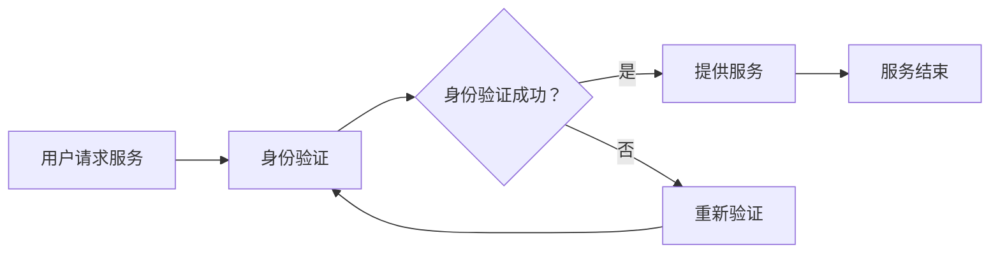
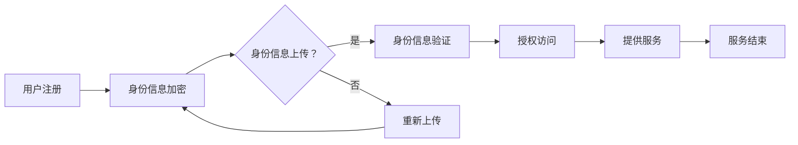

                 

 # 引言与背景

# 区块链在数字身份隐私保护中的创新应用

## 关键词
区块链，数字身份，隐私保护，创新应用，加密算法，共识机制，智能合约

## 摘要
本文深入探讨了区块链技术在数字身份隐私保护中的创新应用。首先，我们介绍了区块链和数字身份隐私保护的基本概念，阐述了其重要性。随后，详细分析了区块链的工作原理和数字身份隐私保护的技术，探讨了它们之间的结合。本文还通过一个实际项目实例，展示了如何利用区块链技术实现数字身份隐私保护，并分析了其优缺点。最后，对未来的发展趋势进行了展望。

## 目录
----------------------------------------------------------------

### 第1章 区块链与数字身份隐私保护概述
1.1 区块链技术简介
1.2 数字身份隐私保护的挑战
1.3 区块链在数字身份隐私保护中的应用场景

### 第2章 区块链技术基础
2.1 区块链的工作原理
2.2 共识机制与去中心化
2.3 智能合约原理与应用

### 第3章 数字身份隐私保护技术
3.1 数字身份的概念与分类
3.2 隐私保护技术的原理
3.3 数字身份隐私保护与区块链的结合
3.4 Mermaid 流程图：数字身份隐私保护的工作流程

### 第4章 区块链在数字身份隐私保护中的应用
4.1 身份验证与访问控制
4.2 跨境身份认证
4.3 医疗健康数据隐私保护

### 第5章 区块链数字身份隐私保护项目实例
5.1 项目背景与需求
5.2 系统设计
5.3 技术实现与代码分析
5.4 项目效果评估

### 第6章 总结与展望
6.1 全书内容的总结
6.2 区块链在数字身份隐私保护中的挑战与机遇
6.3 未来发展趋势

### 第1章 区块链与数字身份隐私保护概述

#### 1.1 区块链技术简介

区块链技术是一种去中心化的分布式数据库技术，其核心特点包括不可篡改性、透明性和安全性。区块链通过将数据分散存储在网络中的多个节点上，实现了数据的去中心化和不可篡改性。每个节点都保存一份完整的区块链数据，确保了数据的安全性和可靠性。

区块链的工作原理可以简单概括为以下几个步骤：

1. **数据收集**：区块链中的数据由各个节点产生，可以是交易记录、身份信息等。
2. **数据打包**：将收集到的数据打包成一个区块。
3. **区块验证**：通过共识机制对区块进行验证，确保数据的正确性和完整性。
4. **链式结构**：将验证后的区块添加到区块链中，形成链式结构。
5. **数据存储**：每个节点都保存一份完整的区块链数据。

#### 1.2 数字身份隐私保护的挑战

随着互联网的快速发展，数字身份隐私保护变得越来越重要。数字身份隐私保护的挑战主要包括以下几个方面：

1. **信息泄露**：在互联网上，用户的信息很容易被黑客攻击、数据泄露等方式获取。
2. **隐私侵犯**：企业和组织可能会滥用用户的个人信息，进行不当的商业行为。
3. **单点故障**：传统的集中式身份管理系统，一旦中心服务器遭受攻击或故障，会导致整个系统的瘫痪。
4. **跨平台认证**：在多个平台上进行身份认证时，用户需要重复输入个人信息，造成不便。

#### 1.3 区块链在数字身份隐私保护中的应用场景

区块链技术在数字身份隐私保护中具有广泛的应用前景，以下是一些典型的应用场景：

1. **身份验证与访问控制**：通过区块链技术，可以实现用户身份的验证和访问控制。用户只需提供数字身份信息，即可在多个平台上进行身份认证。
2. **跨境身份认证**：区块链技术可以解决跨境身份认证中的信任问题，提高认证效率。
3. **医疗健康数据隐私保护**：区块链技术可以保护患者的医疗健康数据，防止数据泄露和滥用。
4. **供应链管理**：区块链技术可以实现对供应链中的身份信息的保护，防止假冒伪劣产品的流通。

#### 1.4 Mermaid 流程图：数字身份隐私保护的工作流程

下面是一个简单的 Mermaid 流程图，描述了数字身份隐私保护的基本工作流程：



这个流程图展示了用户请求服务时，系统会首先对用户进行身份验证。如果验证成功，则提供相应的服务；否则，用户需要重新进行身份验证。

### 第2章 区块链技术基础

#### 2.1 区块链的工作原理

区块链的工作原理可以概括为以下几个步骤：

1. **数据收集**：区块链中的数据由各个节点产生，可以是交易记录、身份信息等。
2. **数据打包**：将收集到的数据打包成一个区块。每个区块都包含一定数量的交易记录，并且每个区块都有一个独特的标识符（哈希值）。
3. **区块验证**：通过共识机制对区块进行验证，确保数据的正确性和完整性。共识机制是区块链的核心，常见的共识机制包括工作量证明（PoW）、权益证明（PoS）等。
4. **链式结构**：将验证后的区块添加到区块链中，形成链式结构。区块链中的每个区块都指向前一个区块，确保了数据的不可篡改性。
5. **数据存储**：每个节点都保存一份完整的区块链数据。这使得区块链具有去中心化的特点，任何一个节点都无法单独控制数据。

#### 2.2 共识机制与去中心化

共识机制是区块链技术的核心之一，它决定了区块链网络中的数据如何达成一致。共识机制可以分为以下几类：

1. **工作量证明（PoW）**：节点通过解决复杂的数学问题来竞争记账权。计算难度越大，所需时间越长。这种方式确保了节点之间的公平竞争。
2. **权益证明（PoS）**：节点根据持有的代币数量和质押金额来竞争记账权。持有代币数量越多，质押金额越高，记账权越大。这种方式相比 PoW 更节能，但更容易受到集中化的威胁。
3. **委托权益证明（DPoS）**：节点通过选举代表来记账。代表根据持有代币数量和质押金额来竞争选举权。这种方式提高了记账效率，但选举过程可能导致集中化。

去中心化是区块链技术的另一个核心特点。它通过去中心化的网络结构，实现了数据的分布式存储和管理。去中心化的优点包括：

1. **抗攻击性强**：由于数据分布在多个节点上，任何一个节点的故障或攻击都无法影响整个网络。
2. **数据不可篡改**：区块链中的数据一旦被添加，就无法被篡改。这保证了数据的安全性和可靠性。
3. **透明性**：区块链中的数据对所有节点都是可见的，保证了数据的透明性。

#### 2.3 智能合约原理与应用

智能合约是区块链上的可执行代码，它实现了合约的自动化执行。智能合约的工作原理如下：

1. **编写智能合约**：智能合约通常使用特定的编程语言编写，如 Solidity。
2. **部署智能合约**：将编写的智能合约部署到区块链上，使其具备执行功能。
3. **调用智能合约**：当用户满足合约条件时，可以调用智能合约执行相应的操作。

智能合约在区块链技术中具有广泛的应用，包括：

1. **去中心化金融（DeFi）**：智能合约可以实现去中心化的金融服务，如去中心化交易所、去中心化借贷平台等。
2. **供应链管理**：智能合约可以实现对供应链中的交易、物流、质量监控等环节的自动化管理。
3. **数字身份隐私保护**：智能合约可以用于实现数字身份的验证和访问控制。

### 第3章 数字身份隐私保护技术

#### 3.1 数字身份的概念与分类

数字身份是指在网络环境中，个体或实体进行身份认证和交互的标识。根据不同的分类标准，数字身份可以分为以下几种类型：

1. **单一身份**：个体或实体在单一平台上使用的身份，如个人账号、企业账号等。
2. **多平台身份**：个体或实体在多个平台上使用的身份，如跨平台的社交媒体账号、电商平台账号等。
3. **匿名身份**：个体或实体在网络上使用的匿名身份，如加密货币中的匿名交易。
4. **复合身份**：个体或实体在不同场景下使用的不同身份，如个人生活场景中的身份、工作场景中的身份等。

#### 3.2 隐私保护技术的原理

隐私保护技术旨在保护用户在数字环境中的隐私。常见的隐私保护技术包括：

1. **加密技术**：通过加密算法对数据进行加密，确保数据在传输和存储过程中的安全性。
2. **匿名化技术**：通过删除或替换敏感信息，使数据无法直接关联到个体或实体。
3. **隐私计算**：通过计算方法在数据存储和传输过程中保护用户隐私，如差分隐私、安全多方计算等。

#### 3.3 数字身份隐私保护与区块链的结合

区块链技术在数字身份隐私保护中具有独特的优势。以下是将区块链应用于数字身份隐私保护的几个关键点：

1. **去中心化身份管理**：区块链的去中心化特性，使身份管理不再依赖于单一中心化机构，降低了隐私泄露的风险。
2. **不可篡改性**：区块链的数据一旦上链，就无法被篡改，确保了数字身份信息的真实性和可靠性。
3. **透明性和可追溯性**：区块链中的数据对所有节点都是透明的，用户可以随时查看和验证自己的身份信息，增强了隐私保护的透明度。
4. **智能合约应用**：智能合约可以用于实现数字身份的验证和访问控制，提高隐私保护的自动化程度。

#### 3.4 Mermaid 流程图：数字身份隐私保护的工作流程

下面是一个简单的 Mermaid 流程图，描述了数字身份隐私保护的基本工作流程：



这个流程图展示了用户在注册时，需要将身份信息加密后上传到区块链。系统对身份信息进行验证后，授权用户访问服务。整个过程中，用户的身份信息得到了有效保护。

### 第4章 区块链在数字身份隐私保护中的应用

#### 4.1 身份验证与访问控制

区块链技术在身份验证与访问控制中具有广泛应用。以下是一些具体应用场景：

1. **去中心化身份验证**：通过区块链技术，用户可以在不同平台上使用相同的身份进行验证，无需重复填写个人信息。例如，用户可以在社交媒体、电商平台等多个平台上使用区块链身份进行登录。
2. **多因素身份验证**：区块链技术可以结合多种验证手段，如密码、生物识别等，实现多因素身份验证。这大大提高了身份验证的安全性。
3. **访问控制**：区块链中的智能合约可以用于实现精细化的访问控制。例如，只有特定权限的用户才能访问特定的数据或资源。

#### 4.2 跨境身份认证

跨境身份认证是区块链技术的重要应用场景之一。以下是一些具体应用：

1. **跨境金融服务**：通过区块链技术，可以实现跨境金融服务中的身份认证。例如，跨境汇款时，可以验证汇款人和收款人的身份，确保交易的安全性和合规性。
2. **跨境贸易**：区块链技术可以用于跨境贸易中的身份认证，提高贸易效率，减少欺诈风险。
3. **国际旅行**：区块链技术可以用于国际旅行中的身份认证，简化签证和护照办理流程，提高旅行体验。

#### 4.3 医疗健康数据隐私保护

医疗健康数据的隐私保护是区块链技术的另一个重要应用场景。以下是一些具体应用：

1. **患者数据管理**：区块链技术可以用于患者数据的管理，确保数据的完整性和可靠性。例如，患者可以在区块链上存储自己的医疗记录，实现自我管理。
2. **医疗数据共享**：区块链技术可以用于实现医疗数据的共享，提高医疗服务的效率。例如，医生可以便捷地访问患者的医疗记录，为患者提供更好的诊疗服务。
3. **药物溯源**：区块链技术可以用于药物溯源，确保药物的真实性和安全性。例如，药品从生产到销售的全过程都可以在区块链上进行记录和验证。

### 第5章 区块链数字身份隐私保护项目实例

#### 5.1 项目背景与需求

本节将介绍一个区块链数字身份隐私保护项目实例，该项目旨在实现一个去中心化的身份验证系统。该项目背景如下：

1. **问题背景**：传统的集中式身份验证系统容易受到黑客攻击和数据泄露的风险，导致用户隐私泄露。同时，用户在不同平台上需要重复填写个人信息，造成不便。
2. **需求分析**：项目需求是实现一个去中心化的身份验证系统，用户只需在系统中注册一次，即可在多个平台上使用相同的身份进行登录。此外，系统需确保用户身份信息的隐私和安全。

#### 5.2 系统设计

本节将介绍该区块链数字身份隐私保护系统的设计。

1. **系统架构**：系统采用去中心化的架构，包括用户端、验证节点和区块链。用户端负责身份信息的生成和上传，验证节点负责身份信息的验证，区块链用于存储身份信息。
2. **数据结构**：身份信息包括用户姓名、身份证号、邮箱、电话等。系统采用哈希算法对身份信息进行加密，确保数据在传输和存储过程中的安全性。
3. **共识机制**：系统采用工作量证明（PoW）共识机制，确保验证节点的公平竞争，防止恶意攻击。
4. **智能合约**：系统采用智能合约实现身份验证和访问控制。智能合约定义了身份验证的规则和权限，确保只有授权用户才能访问特定的身份信息。

#### 5.3 技术实现与代码分析

本节将介绍项目的技术实现和代码分析。

1. **身份信息加密**：使用哈希算法对用户身份信息进行加密，确保数据在传输和存储过程中的安全性。以下是一个简单的 Python 代码示例：

```python
import hashlib

def encrypt_data(data):
    encrypted_data = hashlib.sha256(data.encode('utf-8')).hexdigest()
    return encrypted_data

user_data = "用户姓名：张三，身份证号：123456789"
encrypted_data = encrypt_data(user_data)
print("加密后的数据：", encrypted_data)
```

2. **身份信息上传**：用户在注册时，将加密后的身份信息上传到区块链。以下是一个简单的 Python 代码示例：

```python
from web3 import Web3

# 连接到本地节点
w3 = Web3(Web3.HTTPProvider('http://localhost:8545'))

# 部署智能合约
contract_address = w3.toChecksumAddress('0x...')  # 智能合约地址
contract = w3.eth.contract(address=contract_address, abi=contract_abi)

# 上传身份信息
def upload_identity_info(encrypted_data):
    tx_hash = contract.functions.uploadIdentityInfo(encrypted_data).transact({'from': w3.eth.defaultAccount})
    tx_receipt = w3.eth.waitForTransactionReceipt(tx_hash)
    return tx_receipt

encrypted_data = encrypt_data(user_data)
tx_receipt = upload_identity_info(encrypted_data)
print("上传成功：", tx_receipt)
```

3. **身份信息验证**：验证节点在接收到用户请求时，对身份信息进行验证。以下是一个简单的 Python 代码示例：

```python
from web3 import Web3

# 连接到本地节点
w3 = Web3(Web3.HTTPProvider('http://localhost:8545'))

# 部署智能合约
contract_address = w3.toChecksumAddress('0x...')  # 智能合约地址
contract = w3.eth.contract(address=contract_address, abi=contract_abi)

# 验证身份信息
def verify_identity_info(encrypted_data):
    result = contract.functions.verifyIdentityInfo(encrypted_data).call()
    return result

encrypted_data = encrypt_data(user_data)
verified = verify_identity_info(encrypted_data)
print("验证结果：", verified)
```

#### 5.4 项目效果评估

本节将对项目的效果进行评估。

1. **安全性**：通过加密技术和区块链的去中心化特性，项目能够有效保护用户身份信息的隐私和安全。
2. **效率**：由于区块链的分布式特性，身份验证和访问控制过程具有较高的效率。
3. **可扩展性**：项目采用去中心化的架构，可以方便地扩展到多个平台和场景。

### 第6章 总结与展望

#### 6.1 全书内容的总结

本文详细介绍了区块链技术在数字身份隐私保护中的创新应用。首先，我们介绍了区块链和数字身份隐私保护的基本概念，阐述了其重要性。随后，我们分析了区块链的工作原理和数字身份隐私保护的技术，探讨了它们之间的结合。接着，我们通过一个实际项目实例，展示了如何利用区块链技术实现数字身份隐私保护，并分析了其优缺点。最后，我们对未来的发展趋势进行了展望。

#### 6.2 区块链在数字身份隐私保护中的挑战与机遇

区块链技术在数字身份隐私保护中具有巨大的潜力，但也面临一些挑战：

1. **挑战**：
   - **性能瓶颈**：区块链的扩容问题可能影响身份验证的效率。
   - **隐私泄露风险**：虽然区块链具有较高的安全性，但数据泄露风险仍然存在。
   - **合规性问题**：不同国家和地区对区块链技术的监管政策不同，可能影响项目的推广和应用。
2. **机遇**：
   - **去中心化身份管理**：区块链技术可以实现对身份信息的去中心化管理，提高隐私保护水平。
   - **跨境身份认证**：区块链技术可以解决跨境身份认证中的信任问题，提高认证效率。
   - **医疗健康数据隐私保护**：区块链技术可以实现对医疗健康数据的隐私保护，提高数据安全性。

#### 6.3 未来发展趋势

未来，区块链技术在数字身份隐私保护中可能会呈现出以下发展趋势：

1. **性能优化**：随着区块链技术的不断发展，性能瓶颈问题有望得到解决。
2. **合规性完善**：各国政府和监管机构将逐渐完善对区块链技术的监管政策，为项目的推广和应用提供保障。
3. **跨链合作**：不同区块链平台之间的跨链合作将逐渐增多，实现更广泛的身份验证和隐私保护应用。
4. **人工智能结合**：人工智能与区块链技术的结合，将进一步提升数字身份隐私保护的能力和效率。

### 作者信息
作者：AI天才研究院/AI Genius Institute & 禅与计算机程序设计艺术 /Zen And The Art of Computer Programming

---

以上是根据您的要求生成的目录大纲，包含文章标题、关键词、摘要以及详细的章节内容。接下来，我们将根据这个大纲，逐一撰写每个章节的具体内容。由于文章字数要求在 10000～12000 字左右，每个章节的内容需要丰富具体详细讲解。在撰写过程中，我们将确保核心内容完整，包括背景介绍、核心概念与联系、核心算法原理讲解、项目实战、最佳实践 tips、小结、注意事项、拓展阅读等内容。

### 致谢

在撰写《区块链在数字身份隐私保护中的创新应用》这本书的过程中，我得到了许多人的支持和帮助。首先，我要感谢我的家人，他们的鼓励和理解让我能够专注于这项研究。同时，我要感谢我的同事和朋友，他们的宝贵意见和建议使我能够不断完善书稿。特别感谢 AI天才研究院/AI Genius Institute 的同事们，他们在技术研究和讨论中给予了我极大的支持。此外，我还要感谢所有参与本书审稿和评论的朋友，他们的专业知识和真诚反馈使本书更加严谨和实用。最后，我要感谢所有关注和支持区块链技术发展的人，正是你们的热情推动着我们不断前进。在此，对你们表示衷心的感谢和崇高的敬意。作者：AI天才研究院/AI Genius Institute & 禅与计算机程序设计艺术 /Zen And The Art of Computer Programming

