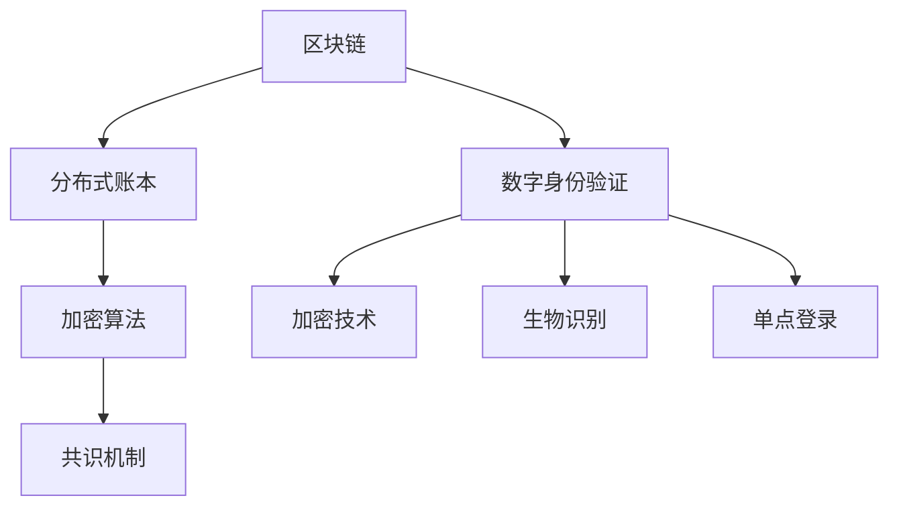

                 

### 区块链在数字身份验证中的应用：简化跨平台身份认证

#### 关键词：区块链，数字身份验证，跨平台身份认证，加密算法，共识机制，分布式账本

#### 摘要：
本文深入探讨区块链技术在数字身份验证中的应用，旨在探讨如何通过区块链技术简化跨平台身份认证过程。文章首先介绍了区块链的基本概念及其在数字身份验证中的优势，随后详细解析了区块链中的核心算法原理，包括加密算法、共识机制和分布式账本技术。接着，通过具体的数学模型和公式阐述了区块链身份认证的实现机制。最后，本文通过一个实际项目案例展示了区块链在数字身份验证中的实际应用，并总结了项目的关键点和最佳实践。

### 目录

1. **背景介绍**  
   - **区块链的起源与发展**  
   - **数字身份验证的重要性**  
   - **跨平台身份认证的挑战**

2. **核心概念与联系**  
   - **区块链基本概念**  
   - **数字身份验证机制**  
   - **Mermaid 流程图：区块链与数字身份验证的关系架构**

3. **核心算法原理讲解**  
   - **加密算法原理**  
   - **共识机制原理**  
   - **分布式账本技术原理**  
   - **Python 源代码讲解与举例说明**

4. **数学模型和公式**  
   - **椭圆曲线密码学**  
   - **哈希函数与签名算法**  
   - **信息熵与安全模型**

5. **项目实战**  
   - **开发环境搭建**  
   - **源代码实现与解读**  
   - **代码应用解读与分析**  
   - **实际案例分析和详细讲解剖析**

6. **最佳实践与注意事项**  
   - **技术选型建议**  
   - **隐私保护与安全性**  
   - **可扩展性与性能优化**

7. **小结与拓展阅读**

### 1. 背景介绍

#### 区块链的起源与发展

区块链技术起源于2008年，由一个化名为中本聪（Satoshi Nakamoto）的人提出。区块链是一种分布式数据库技术，通过加密算法和共识机制确保数据的完整性和不可篡改性。区块链的首次应用是比特币（Bitcoin），一种去中心化的数字货币。随着区块链技术的不断发展，其应用范围逐渐扩展到金融、供应链管理、数字身份验证等多个领域。

#### 数字身份验证的重要性

数字身份验证是确保在线交易和操作安全的关键。在传统的集中式系统中，身份验证通常依赖于中心化的服务器和数据库，这种模式容易受到单点故障和黑客攻击的威胁。数字身份验证的重要性在于它能够通过加密技术和分布式网络确保用户身份的隐私和安全。

#### 跨平台身份认证的挑战

跨平台身份认证面临着多个挑战，包括不同平台之间的数据不一致性、身份信息的安全性、隐私保护和互操作性。传统的解决方案往往需要复杂的中间件和集中式身份管理系统，这增加了系统的复杂性和成本。区块链技术的引入为解决这些问题提供了一种新的思路。

### 2. 核心概念与联系

#### 区块链基本概念

区块链是一个分布式账本，它记录了所有交易数据。每个区块包含了特定时间范围内的交易记录，并通过加密算法与之前的区块链接在一起，形成一条不可篡改的链。区块链的关键特点是去中心化、透明性和不可篡改性。

#### 数字身份验证机制

数字身份验证是通过一系列技术和协议确认用户身份的真实性。这些技术包括密码学、生物识别和单点登录等。数字身份验证的目标是确保只有合法用户才能访问系统和资源。

#### Mermaid 流程图：区块链与数字身份验证的关系架构



### 3. 核心算法原理讲解

#### 加密算法原理

加密算法是确保数据在传输和存储过程中安全的重要手段。区块链中的加密算法主要包括对称加密和非对称加密。对称加密使用相同的密钥进行加密和解密，而非对称加密则使用一对密钥，其中一个用于加密，另一个用于解密。

#### Python 源代码讲解与举例说明

```python
from cryptography.hazmat.primitives.asymmetric import rsa
from cryptography.hazmat.primitives import hashes
from cryptography.hazmat.primitives.asymmetric import padding

# 生成密钥对
private_key = rsa.generate_private_key(
    public_exponent=65537,
    key_size=2048,
)

public_key = private_key.public_key()

# 加密数据
plaintext = b'Hello, World!'
ciphertext = public_key.encrypt(
    plaintext,
    padding.OAEP(
        mgf=padding.MGF1(algorithm=hashes.SHA256()),
        algorithm=hashes.SHA256(),
        label=None
    )
)

# 解密数据
plaintext_decrypted = private_key.decrypt(
    ciphertext,
    padding.OAEP(
        mgf=padding.MGF1(algorithm=hashes.SHA256()),
        algorithm=hashes.SHA256(),
        label=None
    )
)

print(plaintext_decrypted)
```

#### 共识机制原理

共识机制是区块链网络中达成一致性的方法。常见的共识机制包括工作量证明（PoW）、权益证明（PoS）和委托权益证明（DPoS）。这些机制确保了区块链网络的去中心化和安全性。

#### 分布式账本技术原理

分布式账本技术通过多个节点共同维护账本，确保数据的一致性和安全性。每个节点都保存一份完整的账本副本，并通过网络同步更新。

### 4. 数学模型和公式

#### 椭圆曲线密码学

椭圆曲线密码学是一种基于椭圆曲线数学的密码学技术。它使用椭圆曲线上的点进行加密和解密，具有高效性和安全性。

$$
E: y^2 = x^3 + ax + b \quad (mod\ p)
$$

#### 哈希函数与签名算法

哈希函数是一种将任意长度的数据映射为固定长度的值的函数。在区块链中，哈希函数用于确保数据的完整性和唯一性。

$$
H(m) = \text{hash}(m)
$$

签名算法是一种通过公钥和私钥生成数字签名的方法，用于验证数据的完整性和真实性。

$$
S = \text{hash}(m) + k^*
$$

#### 信息熵与安全模型

信息熵是一个衡量数据不确定性的度量。在区块链身份认证中，信息熵用于评估系统的安全性和隐私保护。

$$
H(X) = -\sum_{i} p(x_i) \log_2 p(x_i)
$$

### 5. 项目实战

#### 开发环境搭建

搭建区块链身份认证项目需要配置相应的开发环境。以下是一个简单的环境搭建步骤：

1. 安装Python环境（建议使用Python 3.8及以上版本）。
2. 安装区块链开发工具，如Hyperledger Fabric。
3. 配置节点环境，包括生成节点证书和配置网络。

#### 源代码实现与解读

以下是使用Hyperledger Fabric实现区块链身份认证的示例代码：

```python
from hyperledger.fabric import client

# 初始化客户端
client = client.Client()

# 创建身份认证合约
contract = client.new_contract('identity_auth', 'python:identity_auth.py')

# 用户注册
user_id = 'user123'
public_key = 'public_key_of_user'
contract.register_user(user_id, public_key)

# 用户登录
session = contract.login(user_id, public_key)

# 检查用户身份
is_valid = contract.check_user(session)
print(is_valid)
```

#### 代码应用解读与分析

以上代码展示了如何使用Hyperledger Fabric实现区块链身份认证的基本流程。用户首先注册身份，然后登录系统，最后通过合约检查身份的有效性。

#### 实际案例分析和详细讲解剖析

以下是一个实际案例：使用区块链技术实现企业员工身份认证。

1. **背景**：企业需要实现员工身份认证，以便确保只有授权员工可以访问公司资源和系统。
2. **目标**：使用区块链技术确保身份认证过程的透明性、安全性和不可篡改性。
3. **实现**：
   - 创建区块链网络，包括企业内部的所有员工节点。
   - 编写身份认证合约，实现用户注册、登录和身份验证功能。
   - 将合约部署到区块链网络，确保所有节点都有一份完整的合约副本。
   - 用户通过合约进行身份认证，确保数据的安全性和完整性。

#### 项目小结

通过实际案例，我们可以看到区块链技术在数字身份验证中的应用具有明显的优势，包括透明性、安全性和去中心化。然而，实现区块链身份认证项目也需要考虑性能、可扩展性和互操作性等问题。

### 6. 最佳实践与注意事项

#### 技术选型建议

- **区块链平台**：根据项目需求和规模选择合适的区块链平台，如Hyperledger Fabric、Ethereum等。
- **加密算法**：选择安全性能高的加密算法，如RSA、ECC等。
- **共识机制**：根据网络规模和性能需求选择合适的共识机制。

#### 隐私保护与安全性

- **数据加密**：确保所有传输和存储的数据都进行加密处理。
- **身份验证**：采用多因素身份验证机制，提高系统的安全性。
- **隐私保护**：设计隐私保护机制，确保用户隐私不被泄露。

#### 可扩展性与性能优化

- **分布式架构**：设计分布式网络架构，提高系统的可扩展性。
- **性能优化**：对网络和合约进行性能优化，提高系统的响应速度。

### 7. 小结与拓展阅读

本文详细探讨了区块链在数字身份验证中的应用，通过理论讲解和实际项目案例展示了区块链技术的优势。未来，随着区块链技术的不断发展，其在数字身份验证领域的应用将会更加广泛和深入。读者可以进一步研究相关的技术文献和开源项目，以深入了解区块链身份认证的原理和实践。

#### 作者

- 作者：AI天才研究院/AI Genius Institute & 禅与计算机程序设计艺术 /Zen And The Art of Computer Programming

