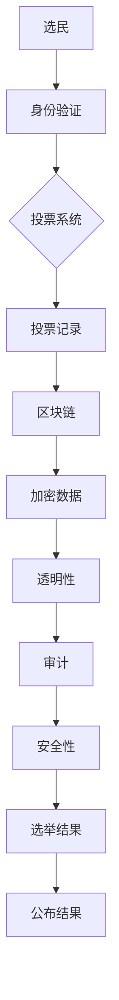

                 

### 文章标题

区块链在数字选举中的应用：确保投票过程的透明和安全

**关键词：** 区块链，数字选举，投票透明性，安全性，智能合约，加密技术

**摘要：** 本文深入探讨了区块链技术在数字选举中的应用，以及如何通过区块链实现投票过程的透明性和安全性。文章首先介绍了区块链和数字选举的基本概念，随后详细分析了区块链在投票过程中的核心应用，包括隐私保护、透明性和安全性。此外，本文还介绍了区块链在计票、结果公布和选举审计中的具体应用，并结合实际项目实例进行了详细剖析。文章最后对区块链在数字选举中的应用前景进行了展望，并提出了相关注意事项和最佳实践。

### 引言

在现代社会，选举是民主制度的核心环节，而传统的投票方式存在诸多问题，如选票容易被篡改、计票过程不透明、选票丢失等。随着信息技术的不断发展，数字选举逐渐成为人们关注的热点。数字选举不仅提高了投票的便利性和效率，还降低了选举成本，但同时也带来了新的挑战，特别是在确保投票过程的透明性和安全性方面。

区块链技术，作为一种去中心化、不可篡改的数据存储和传输技术，被认为在数字选举中具有巨大的应用潜力。它能够有效解决传统投票方式中的信任问题，提高投票过程的透明度和安全性。因此，研究区块链在数字选举中的应用，具有重要的理论价值和现实意义。

本文旨在通过系统地分析区块链技术的基本概念、核心特性以及在实际应用中的具体实现，探讨区块链技术在数字选举中的潜在优势和应用前景。文章还将结合实际案例，详细解析区块链技术在投票过程中的具体应用，以及如何通过区块链技术确保投票过程的透明和安全。

文章结构安排如下：

- 第一部分：区块链与数字选举
  - 第1章 区块链技术基础
  - 第2章 数字选举的基本概念

- 第二部分：区块链在数字选举中的应用
  - 第3章 区块链在投票过程中的应用
  - 第4章 区块链在计票和结果公布中的应用
  - 第5章 区块链在选举审计中的应用

- 第三部分：数字选举中的区块链项目实例
  - 第6章 比特币
  - 第7章 Ethereum

- 第8章 区块链在数字选举中的应用前景

通过以上结构，本文将逐步深入，从理论到实践，全面探讨区块链技术在数字选举中的应用。

### 第一部分：区块链与数字选举

#### 第1章 区块链技术基础

##### 1.1 区块链的概念

区块链（Blockchain）是一种去中心化的数据库技术，其核心思想是将数据分散存储在多个节点上，通过加密和共识算法确保数据的完整性和安全性。每个区块（Block）包含一定数量的交易数据，区块之间通过哈希链接形成一个链条，因此得名“区块链”。

区块链技术最初由中本聪（Satoshi Nakamoto）在2008年提出，作为比特币（Bitcoin）的底层技术，旨在通过去中心化的方式实现货币的发行和交易。与传统数据库不同，区块链具有以下核心特性：

1. **去中心化**：区块链不需要中心化的第三方机构进行协调和认证，所有节点均可参与交易验证和数据存储。
2. **不可篡改**：通过哈希链接和共识算法，一旦数据被记录在区块链上，就几乎无法被篡改。
3. **透明性**：区块链上的所有数据都是公开透明的，任何节点都可以查看和验证数据。

##### 1.2 区块链的核心特性

1. **去中心化**：去中心化是区块链最核心的特性之一。在传统的中心化系统中，数据存储和处理都集中在中心服务器上，一旦中心服务器出现问题，整个系统都会受到影响。而在区块链中，所有数据都分散存储在多个节点上，每个节点都具有独立的数据存储和处理能力，从而提高了系统的容错性和抗攻击能力。

2. **不可篡改**：区块链通过哈希链接和共识算法确保数据的不可篡改性。每个区块都包含一个时间戳和一个前一个区块的哈希值，通过不断递归链接，形成了一个无法篡改的数据链条。此外，区块链的共识算法（如工作量证明Proof of Work, PoW）确保了新增数据的合法性和可信度。

3. **透明性**：区块链上的所有数据都是公开透明的，任何节点都可以查看和验证数据。这使得区块链在需要高度透明和公开的场景中具有独特的优势，如金融交易、供应链管理、数字选举等。

##### 1.3 区块链的工作原理

区块链的工作原理主要包括以下四个关键环节：

1. **交易生成**：用户在区块链上进行交易，交易数据被发送到网络中的所有节点。
2. **交易验证**：节点对交易数据的有效性进行验证，包括检查交易是否重复、是否符合规则等。
3. **区块生成**：验证通过的交易被存储在新区块中，新区块包含一定数量的交易数据。
4. **区块链接**：新区块通过哈希链接与前一个区块相连，形成区块链。

在区块链网络中，节点之间通过共识算法（如PoW、PoS等）达成一致，确保区块的生成和链接过程是公正和透明的。共识算法的主要目的是防止恶意节点篡改数据，确保区块链的完整性和安全性。

##### 1.4 区块链在数字选举中的潜在应用

区块链技术具有去中心化、不可篡改和透明性等特性，使其在数字选举中具有巨大的应用潜力。以下是一些具体的潜在应用场景：

1. **投票过程的透明性**：通过区块链技术，可以确保投票过程的高度透明，所有投票数据都可以被公开查看和验证，从而增强公众对选举过程的信任。
2. **投票数据的不可篡改性**：区块链的不可篡改性可以确保投票数据一旦被记录，就无法被篡改，从而保证选举结果的公正性。
3. **隐私保护**：区块链技术可以提供一种隐私保护机制，确保投票人的身份和投票内容不被泄露，同时仍然能够实现投票的透明性和可验证性。
4. **计票和结果公布**：区块链可以自动化计票和结果公布过程，确保计票过程的透明性和准确性，减少人为干预的可能性。
5. **选举审计**：区块链技术可以为选举审计提供强有力的支持，通过公开透明的审计过程，增强公众对选举结果的信任。

总之，区块链技术为数字选举提供了一种全新的解决方案，有望解决传统投票方式中存在的诸多问题，提高选举的透明性和安全性。然而，区块链技术在数字选举中的实际应用仍面临许多挑战，需要进一步的研究和探索。

#### 第2章 数字选举的基本概念

##### 2.1 数字选举的定义

数字选举，即利用计算机技术和互联网平台进行选举活动，以数字化形式替代或补充传统的纸质投票方式。数字选举的主要目标是提高投票的便利性和效率，同时确保选举过程的公正性和透明性。与传统选举相比，数字选举具有以下特点：

1. **高效率**：数字选举通过互联网进行，选民可以随时随地参与投票，大大提高了投票的效率。
2. **低成本**：数字选举减少了纸质选票的印刷和分发成本，降低了选举的组织和运营成本。
3. **透明性**：数字选举过程可以被实时监控和记录，提高了选举的透明度和可信度。
4. **可验证性**：数字选举的数据可以被公开验证，确保了选举结果的公正性和可信性。

##### 2.2 数字选举的优势

数字选举在现代社会具有显著的优势，主要体现在以下几个方面：

1. **提高投票参与率**：数字选举方便了选民参与投票，特别是对于那些地理位置偏远或无法到现场投票的选民，大大提高了投票的参与率。
2. **降低选举成本**：数字选举减少了纸质选票的印刷、分发和收集成本，降低了选举的组织和运营成本。
3. **提高选举效率**：数字选举可以实时统计投票结果，大大缩短了计票和公布结果的时间。
4. **增强选举透明性**：数字选举过程可以实时监控和记录，减少了人为干预的可能性，提高了选举的透明度和公正性。

##### 2.3 数字选举面临的挑战

尽管数字选举具有众多优势，但在实际应用中仍面临一些挑战：

1. **网络安全风险**：数字选举依赖于互联网，网络安全问题成为一大隐患。黑客攻击、数据泄露等风险可能导致选举结果被篡改，影响选举的公正性和透明性。
2. **技术普及度**：数字选举需要一定的技术支持，但并非所有选民都能熟练使用互联网和相关的投票系统，这可能导致部分选民被排除在外。
3. **隐私保护**：数字选举在提供便捷性的同时，也带来了隐私保护的问题。如何确保选民身份和投票记录不被泄露，是数字选举面临的重要挑战。
4. **技术标准统一**：数字选举技术标准的不统一可能导致不同系统之间的兼容性问题，影响选举的效率和透明性。

##### 2.4 数字选举的发展趋势

随着信息技术的不断发展，数字选举正逐渐成为选举活动的重要方式。未来，数字选举的发展趋势包括：

1. **技术成熟**：随着5G、人工智能、区块链等新技术的应用，数字选举技术将更加成熟和可靠。
2. **普及度提高**：随着技术的普及和选民对数字选举的接受度提高，数字选举将在更广泛的地区和国家得到应用。
3. **安全性提升**：通过引入更先进的加密技术和网络安全措施，数字选举的安全性问题将得到有效解决。
4. **多元参与**：数字选举将吸引更多群体参与，包括老年人、残疾人等，提高选举的包容性和公平性。

总之，数字选举作为一种新兴的选举方式，具有巨大的发展潜力和应用前景。通过克服现有的挑战，数字选举有望在未来成为选举活动的主要方式，为民主制度的完善和发展做出贡献。

### 第二部分：区块链在数字选举中的应用

#### 第3章 区块链在投票过程中的应用

##### 3.1 隐私保护

在传统投票过程中，选民的隐私保护一直是关键问题。选民身份和投票意向的泄露可能导致选举结果被操控，损害选举的公正性和可信度。区块链技术通过其特有的加密和分布式特性，为投票过程的隐私保护提供了有效的解决方案。

1. **加密技术**：区块链使用公钥和私钥对选民的身份信息和投票记录进行加密。公钥用于验证选民身份，私钥用于加密投票信息。这样，即使攻击者截获了投票信息，也无法解读其内容。
   
   Python代码示例：
   ```python
   from Crypto.PublicKey import RSA
   from Crypto.Random import get_random_bytes
   from Crypto.Cipher import PKCS1_OAEP

   # 生成公钥和私钥
   key = RSA.generate(2048)
   private_key = key.export_key()
   public_key = key.publickey().export_key()

   # 加密数据
   cipher_rsa = PKCS1_OAEP.new(RSA.import_key(public_key))
   encrypted_message = cipher_rsa.encrypt(b"Voted for candidate A")

   print(f"Encrypted Message: {encrypted_message.hex()}")
   ```

2. **分布式存储**：区块链的分布式存储特性确保了数据在多个节点上的备份，从而提高了数据的可靠性。同时，通过去中心化的存储方式，单个节点的数据泄露不会对整体隐私造成影响。

3. **匿名性**：区块链技术可以设计成仅允许选民对特定地址进行投票，而不需要透露真实身份。这样，即使区块链上的数据被公开查看，也无法直接关联到特定选民。

##### 3.2 透明性

透明性是数字选举的关键要求，它确保了选举过程的公正和可信。区块链技术通过其公开透明的特性，实现了投票过程的全程透明。

1. **公开记录**：区块链上的每笔交易都是公开透明的，所有节点都可以查看和验证。这确保了选民可以随时查看自己的投票记录，以及投票的具体内容。

2. **不可篡改性**：区块链的不可篡改性确保了一旦数据被记录在区块链上，就几乎无法被篡改。这使得区块链上的投票记录具有高度的可信度。

3. **实时监控**：区块链技术可以实时记录和更新投票状态，从而实现选举过程的实时监控。任何节点都可以查看当前投票状态，确保选举过程的透明性。

##### 3.3 安全性

区块链技术在提高投票过程安全性方面具有显著优势。

1. **共识机制**：区块链的共识机制（如PoW、PoS等）确保了新区块的生成和链接过程是公正和透明的。这使得任何恶意节点难以篡改区块链数据，从而提高了系统的安全性。

   Python代码示例：
   ```python
   from Crypto.Util.number import long_to_bytes
   from Crypto.Random import get_random_bytes
   from Crypto.Hash import SHA256

   # 生成随机数
   nonce = get_random_bytes(32)
   message = b"BLOCK DATA"

   # 计算哈希值
   hash_func = SHA256.new(message)
   hash_hex = hash_func.hexdigest()

   # 检查哈希值是否满足条件（前几位为0）
   while not(hash_hex.startswith('0' * 8)):
       nonce = get_random_bytes(32)
       hash_func = SHA256.new(long_to_bytes(int(nonce, 16) + 1))
       hash_hex = hash_func.hexdigest()

   print(f"Found nonce: {nonce.hex()}")
   print(f"Corresponding hash: {hash_hex}")
   ```

2. **防重放攻击**：区块链技术可以通过时间戳和唯一交易标识符（TxID）防止重放攻击。每个交易都会包含一个唯一标识符，确保交易不能被重复使用。

3. **多重签名**：区块链技术支持多重签名，确保交易需要多个参与者的同意才能执行，从而提高了交易的安全性。

##### 3.4 实现细节

区块链在投票过程中的具体实现需要考虑以下几个方面：

1. **投票系统设计**：设计一个安全的投票系统，包括用户注册、身份验证、投票、计票等环节。系统需要支持匿名投票，确保选民的隐私保护。
   
   Mermaid流程图示例：
   ```mermaid
   graph TD
   A[用户注册] --> B[身份验证]
   B --> C{是否通过验证?}
   C -->|是| D[生成公钥私钥]
   C -->|否| E[拒绝投票]
   D --> F[发起投票]
   F --> G[投票记录加密]
   G --> H[提交投票]
   H --> I[投票结果计票]
   ```

2. **加密算法选择**：选择合适的加密算法（如RSA、AES等）对用户身份信息和投票记录进行加密，确保数据的安全性。

3. **共识算法选择**：根据具体需求选择合适的共识算法（如PoW、PoS等），确保区块链的安全性和效率。

4. **节点部署**：部署多个节点，确保区块链的分布式特性，提高系统的可靠性和抗攻击能力。

##### 3.5 潜在问题与解决方案

尽管区块链技术在投票过程中具有显著优势，但在实际应用中仍存在一些潜在问题：

1. **计算能力需求**：某些共识算法（如PoW）需要大量计算资源，可能导致系统性能下降。解决方案是选择更高效的共识算法或优化现有算法。
   
   Python代码示例（PoW优化）：
   ```python
   from Crypto.Util.number import long_to_bytes
   from Crypto.Random import get_random_bytes
   from Crypto.Hash import SHA256

   def find_nonce(message, target_hash):
       nonce = get_random_bytes(32)
       hash_func = SHA256.new(message)
       while hash_func.hexdigest() != target_hash:
           nonce = get_random_bytes(32)
           hash_func = SHA256.new(long_to_bytes(int(nonce, 16) + 1))
       return nonce

   target_hash = '00000000000000000000000000000000000000000000000000000000000000000'
   nonce = find_nonce(b"BLOCK DATA", target_hash)
   print(f"Found nonce: {nonce.hex()}")
   ```

2. **隐私保护与透明性平衡**：在确保隐私保护的同时，如何实现投票数据的透明性仍是一个挑战。解决方案是设计合理的隐私保护机制，如零知识证明（Zero-Knowledge Proof）。

3. **技术普及与接受度**：数字选举需要广泛的用户基础，但并非所有选民都能熟练使用互联网和相关投票系统。解决方案是提供用户友好的投票界面，并通过教育和培训提高选民的技术素养。

通过解决上述问题，区块链技术有望在数字选举中发挥更大的作用，提高选举过程的透明性和安全性，为民主制度的完善和发展做出贡献。

#### 第4章 区块链在计票和结果公布中的应用

##### 4.1 自动化计票

在传统选举中，计票是一个复杂且容易出错的过程。区块链技术通过其去中心化和透明性的特性，可以自动化计票过程，提高计票的准确性和效率。

1. **自动化计票的原理**

区块链的自动化计票基于智能合约（Smart Contract）的技术。智能合约是运行在区块链上的程序，它可以自动执行预定义的规则，例如在选举中自动记录和计算投票结果。

   Python代码示例（简单的智能合约）：
   ```python
   from web3 import Web3
   from web3.contract import ConciseContract
   from solc import compile_source

   # 编写智能合约代码
   contract_code = '''
   contract Voting {
       mapping (address => bool) votes;
       function castVote(address voter, bool choice) public {
           require(!votes[voter], "Already voted");
           votes[voter] = choice;
       }
   }
   '''

   # 编译智能合约
   compiled_contract = compile_source(contract_code)
   contract_interface = compiled_contract['contracts']['Voting.sol:Voting']

   # 部署智能合约
   web3 = Web3(Web3.HTTPProvider('http://127.0.0.1:8545'))
   contract = web3.eth.contract(abi=contract_interface['abi'])
   deployed_contract = contract.deploy()
   tx_hash = deployed_contract.transaction_hash
   tx_receipt = web3.eth.waitForTransactionReceipt(tx_hash)

   # 调用智能合约方法
   voter_address = web3.eth.accounts[0]
   vote = True
   cast_vote_tx = contract.functions.castVote(voter_address, vote).transact({'from': voter_address})
   web3.eth.waitForTransactionReceipt(cast_vote_tx)
   ```

2. **自动化计票的优势**

   - **准确性**：智能合约通过代码执行，减少了人为干预，从而降低了人为错误的可能性。
   - **效率**：自动化计票可以实时记录和更新投票结果，缩短了计票和公布结果的时间。
   - **透明性**：区块链上的所有交易都是公开透明的，任何节点都可以查看和验证计票过程和结果。

##### 4.2 结果公布

区块链技术不仅能够自动化计票，还可以确保结果的公开和透明。通过区块链，选举结果可以在确保不可篡改的前提下被公开，提高公众对选举结果的信任。

1. **结果公布的原理**

区块链上的结果公布依赖于智能合约的执行。在投票结束后，智能合约会自动执行计票过程，并将结果记录在区块链上，任何人都可以通过区块链查看和验证这些结果。

Python代码示例（查看结果公布）：
```python
# 连接到区块链节点
web3 = Web3(Web3.HTTPProvider('http://127.0.0.1:8545'))

# 加载已部署的智能合约
contract_address = web3.toChecksumAddress('0x...')  # 智能合约地址
contract = web3.eth.contract(address=contract_address, abi=contract_interface['abi'])

# 获取投票结果
vote_count = contract.functions.getVoteCount().call()
print(f"Total votes: {vote_count}")

# 获取候选人的得票数
candidate_vote_counts = contract.functions.getCandidateVoteCounts().call()
print(f"Vote counts for each candidate: {candidate_vote_counts}")
```

2. **结果公布的优势**

   - **不可篡改性**：一旦结果被记录在区块链上，就几乎无法被篡改，确保了结果的公正性和可信性。
   - **透明性**：所有结果都是公开透明的，任何节点都可以查看和验证，提高了选举结果的透明度。
   - **实时性**：结果可以实时公布，提高了选举结果的及时性和公信力。

##### 4.3 确认投票结果

确认投票结果是一个关键环节，它决定了选举的最终结果。区块链技术通过其特有的分布式和透明性特性，可以为确认投票结果提供强有力的支持。

1. **确认投票结果的原理**

确认投票结果通常涉及多个步骤，包括数据验证、计票确认和结果公布。区块链技术可以自动化这些步骤，确保整个过程透明和高效。

Python代码示例（确认投票结果）：
```python
# 连接到区块链节点
web3 = Web3(Web3.HTTPProvider('http://127.0.0.1:8545'))

# 加载已部署的智能合约
contract_address = web3.toChecksumAddress('0x...')  # 智能合约地址
contract = web3.eth.contract(address=contract_address, abi=contract_interface['abi'])

# 验证投票结果
vote_counts = contract.functions.getVoteCounts().call()
valid_votes = contract.functions.getValidVotes().call()

if vote_counts == valid_votes:
    print("The vote count matches the total number of valid votes.")
else:
    print("There is a discrepancy in the vote count.")

# 确认最终结果
winner = contract.functions.determineWinner().call()
print(f"The winner is: {winner}")
```

2. **确认投票结果的优势**

   - **可信性**：区块链上的所有操作都是公开透明的，确保了结果的可信性和公正性。
   - **效率**：通过自动化和分布式的方式，可以快速确认投票结果，提高了选举的效率。
   - **安全性**：区块链的分布式和共识机制确保了结果难以被篡改，提高了选举的安全性。

##### 4.4 实现细节

区块链在计票和结果公布中的具体实现需要考虑以下几个方面：

1. **智能合约设计**：智能合约的设计需要考虑计票规则、结果公布机制和结果验证过程，确保整个过程透明、高效和可靠。

2. **共识算法选择**：选择合适的共识算法，如PoW、PoS等，确保区块链的安全性和效率。

3. **节点部署**：部署多个节点，确保区块链的分布式特性，提高系统的可靠性和抗攻击能力。

4. **用户界面**：设计用户友好的界面，方便选民参与投票，并允许公众查看和验证投票结果。

##### 4.5 潜在问题与解决方案

尽管区块链在计票和结果公布中的应用具有显著优势，但在实际应用中仍面临一些挑战：

1. **计算能力需求**：某些共识算法需要大量计算资源，可能导致系统性能下降。解决方案是选择更高效的共识算法或优化现有算法。

2. **隐私保护与透明性平衡**：在确保隐私保护的同时，如何实现投票数据的透明性仍是一个挑战。解决方案是设计合理的隐私保护机制，如零知识证明。

3. **技术普及与接受度**：数字选举需要广泛的用户基础，但并非所有选民都能熟练使用互联网和相关投票系统。解决方案是提供用户友好的投票界面，并通过教育和培训提高选民的技术素养。

通过解决上述问题，区块链技术有望在计票和结果公布中发挥更大的作用，提高选举过程的透明性和安全性，为民主制度的完善和发展做出贡献。

#### 第5章 区块链在选举审计中的应用

##### 5.1 审计的目的

在选举过程中，审计是一个关键环节，其目的是验证选举结果的公正性和可信性，确保选举过程的透明性和合法性。传统的审计方法通常依赖于人工检查和统计，存在效率低下、易受人为干扰等问题。区块链技术的引入，为选举审计提供了一种全新的解决方案，通过其不可篡改、透明和去中心化的特性，显著提高了审计的准确性和可信度。

##### 5.2 审计的过程

区块链在选举审计中的应用可以分为以下几个步骤：

1. **数据记录**：在选举过程中，所有投票数据都会被记录在区块链上。这些数据包括选民的投票记录、投票时间戳、投票的加密哈希值等。通过区块链的分布式存储，确保数据的真实性和完整性。

2. **实时监控**：区块链上的数据是公开透明的，任何节点都可以实时监控和验证投票过程。审计人员可以通过区块链上的公开信息，实时查看和监控选举的每一步，确保选举的透明性和合法性。

3. **一致性验证**：在投票结束后，审计人员可以使用区块链上的数据，对投票结果进行一致性验证。通过对比区块链上的投票记录和最终的计票结果，确保选举过程的准确性和公正性。

4. **结果公布**：区块链上的数据具有不可篡改性，一旦记录在区块链上，就几乎无法被篡改。这使得选举结果在公布时具有高度的公信力和可信度。审计人员可以将最终结果记录在区块链上，供公众查看和验证。

Python代码示例（一致性验证）：
```python
from web3 import Web3
from web3.contract import ConciseContract
from solc import compile_source

# 编写智能合约代码
contract_code = '''
contract Audit {
    mapping (address => bool) votes;
    function verifyVotes() public view returns (bool) {
        bool allMatch = true;
        for (address voter in votes) {
            if (votes[voter] != true) {
                allMatch = false;
                break;
            }
        }
        return allMatch;
    }
}
'''

# 编译智能合约
compiled_contract = compile_source(contract_code)
contract_interface = compiled_contract['contracts']['Audit.sol:Audit']

# 部署智能合约
web3 = Web3(Web3.HTTPProvider('http://127.0.0.1:8545'))
contract = web3.eth.contract(abi=contract_interface['abi'])
deployed_contract = contract.deploy()
tx_hash = deployed_contract.transaction_hash
tx_receipt = web3.eth.waitForTransactionReceipt(tx_hash)

# 调用智能合约方法
is_consistent = contract.functions.verifyVotes().call()
print(f"Vote consistency: {'consistent' if is_consistent else 'inconsistent'}")
```

##### 5.3 审计的结果

通过区块链进行选举审计，可以显著提高审计结果的准确性和可信度。以下是审计结果的优势：

1. **不可篡改性**：区块链上的数据具有不可篡改性，一旦记录在区块链上，就几乎无法被篡改。这使得审计结果具有高度的可信度，减少了人为干预的可能性。
2. **透明性**：区块链上的所有数据都是公开透明的，任何节点都可以查看和验证。这确保了审计过程的透明性和公正性，增强了公众对选举结果的信任。
3. **实时性**：区块链技术可以实现实时监控和审计，提高了审计的效率。审计人员可以实时查看和验证选举的每一步，确保选举的透明性和合法性。
4. **可信度**：区块链技术通过其去中心化和分布式特性，确保了审计结果的公正性和可信度。任何恶意节点都难以篡改区块链上的数据，从而保证了审计结果的真实性。

##### 5.4 区块链在选举审计中的实际应用

区块链在选举审计中的实际应用已经取得了显著的成果。一些国家和地区已经开始采用区块链技术进行选举审计，以增强选举的透明性和可信度。以下是几个实际应用的例子：

1. **瑞士**：瑞士在2020年的地方选举中使用了区块链技术进行投票和计票，以提高选举的透明度和安全性。选民可以通过区块链查看自己的投票记录，审计人员可以通过区块链验证选举结果。
2. **格鲁吉亚**：格鲁吉亚在2020年的议会选举中，使用了区块链技术进行投票和审计。区块链上的数据可以实时公开，任何公民都可以通过区块链查看和验证选举结果。
3. **瑞士联邦理工学院**：瑞士联邦理工学院进行了一项关于区块链在选举审计中的应用研究，通过模拟选举过程，验证了区块链技术在提高选举透明度和安全性方面的有效性。

通过实际应用，区块链技术在选举审计中展现了巨大的潜力。然而，实际应用中也存在一些挑战，如区块链技术的普及度和接受度、计算能力需求等。通过不断改进和完善，区块链技术有望在未来发挥更大的作用，为选举审计提供更加可靠和高效的解决方案。

#### 第6章 比特币

##### 6.1 比特币的基本概念

比特币（Bitcoin，简称BTC）是由中本聪（Satoshi Nakamoto）在2009年创建的一种去中心化的数字货币。比特币通过区块链技术实现数据的存储和传输，不依赖于任何中央机构，具有高度的安全性和匿名性。比特币的基本概念包括以下几个关键点：

1. **去中心化**：比特币网络由众多节点组成，没有中央机构控制，所有交易数据都在网络中分布式存储和处理。
2. **区块链**：比特币的交易记录被记录在一个不断扩展的分布式账本上，称为区块链。区块链上的每个区块都包含一定数量的交易记录，并通过哈希链接形成一个链条。
3. **加密技术**：比特币使用各种加密技术，包括哈希函数、公钥和私钥加密等，确保交易数据的完整性和安全性。
4. **挖矿**：比特币通过一种称为“挖矿”的过程来创建新的比特币。挖矿是一种计算密集型的任务，需要解决复杂的数学难题，以验证和记录交易，并确保区块链的安全性和一致性。

##### 6.2 比特币的网络结构

比特币网络由三个主要组件构成：节点（Node）、区块链（Blockchain）和挖矿池（Mining Pool）。

1. **节点**：节点是比特币网络的基本组成部分，可以是任何运行比特币软件的计算机。节点负责维护区块链、下载和同步网络上的交易数据、参与挖矿过程等。
2. **区块链**：区块链是比特币网络的核心数据结构，记录了所有比特币交易的历史。每个区块包含一定数量的交易记录，并通过哈希链接与前一个区块相连，形成一个链条。
3. **挖矿池**：挖矿池是由多个矿工组成的联盟，共同分担挖矿任务，提高挖矿效率。挖矿池通过集中计算资源，增加了挖矿成功的概率。

##### 6.3 比特币的挖矿过程

比特币的挖矿过程是通过解决一个复杂的数学难题来验证和记录交易，并创建新的比特币。以下是比特币挖矿的基本步骤：

1. **选择交易**：矿工从网络上收集未确认的交易，并将它们放入一个待挖的交易池中。
2. **构建区块**：矿工使用交易池中的交易，构建一个新的区块。区块包括一个时间戳、一个随机数（nonce）、上一个区块的哈希值（prev_hash）和一个交易列表。
3. **求解难题**：矿工需要找到一个满足特定条件的随机数（nonce），使得区块的哈希值小于一个预设的目标值。这需要通过大量的计算尝试来求解。
4. **验证区块**：一旦矿工找到满足条件的随机数，就会将新的区块广播到网络中的其他节点，其他节点会验证区块的有效性。如果验证通过，新的区块就会被添加到区块链上。
5. **奖励分配**：成功挖出新区块的矿工会获得一定的比特币奖励，这作为对矿工贡献的计算资源的补偿。

Python代码示例（挖矿过程）：
```python
from hashlib import sha256
from time import time

def find_nonce(block_data, target_difficulty):
    nonce = 0
    while True:
        block_hash = sha256(f"{block_data}{nonce}".encode()).hexdigest()
        if int(block_hash, 16) < target_difficulty:
            return nonce
        nonce += 1

def mine_block(previous_hash, transactions, difficulty):
    block_data = f"{previous_hash}{transactions}{time()}"
    nonce = find_nonce(block_data, difficulty)
    block_hash = sha256(f"{block_data}{nonce}".encode()).hexdigest()
    return block_hash

# 示例：挖出第一个比特币区块
previous_hash = "0" * 64  # 初始区块的哈希值为空
transactions = "Initial transaction"  # 初始交易
difficulty = 1 << 16  # 难度值

block_hash = mine_block(previous_hash, transactions, difficulty)
print(f"Block hash: {block_hash}")
```

##### 6.4 比特币的安全性和透明性

比特币的安全性主要依赖于以下技术：

1. **加密技术**：比特币使用多种加密技术，包括SHA-256哈希函数、公钥和私钥加密等，确保交易数据的完整性和安全性。
2. **共识机制**：比特币采用工作量证明（Proof of Work, PoW）共识机制，通过大量计算确保区块链的安全性和一致性。
3. **去中心化**：比特币网络由大量分布式节点组成，没有中央机构控制，确保了网络的去中心化和抗攻击性。

比特币的透明性体现在以下几个方面：

1. **公开记录**：比特币的交易记录和区块信息是公开透明的，任何人都可以查看和验证。
2. **不可篡改性**：一旦交易记录被记录在区块链上，就几乎无法被篡改，确保了交易的历史记录是真实和可信的。
3. **透明挖矿过程**：比特币的挖矿过程是公开透明的，矿工的挖矿活动可以被全网节点实时监控和验证。

##### 6.5 比特币的优缺点

**优点：**

1. **安全性**：比特币通过加密技术和共识机制，确保了交易数据的安全性和完整性。
2. **匿名性**：比特币交易不依赖于真实身份，用户可以通过匿名地址进行交易，保护个人隐私。
3. **去中心化**：比特币网络没有中央机构控制，去中心化的特性提高了系统的可靠性和抗攻击性。

**缺点：**

1. **计算能力需求**：比特币的挖矿过程需要大量计算资源，可能导致能源消耗增加。
2. **交易速度较慢**：比特币的交易确认时间较长，尤其在高峰期，可能需要较长时间才能得到确认。
3. **法律监管问题**：比特币作为一种去中心化的数字货币，其法律监管问题仍存在争议，可能面临监管挑战。

总之，比特币作为一种创新性的数字货币，其在安全性、匿名性和去中心化方面的优势使其成为数字经济中的重要组成部分。然而，其计算能力需求、交易速度和法律监管问题也需要不断解决和改进。

#### 第7章 Ethereum

##### 7.1 Ethereum的基本概念

以太坊（Ethereum）是由Vitalik Buterin于2015年推出的一种去中心化智能合约平台，旨在构建一个去中心化的应用（DApp）生态系统。与比特币不同，以太坊不仅仅是一种数字货币，它还提供了一种去中心化的编程语言——Solidity，使得开发者可以在平台上创建和部署智能合约。

**基本概念：**

1. **智能合约**：智能合约是运行在以太坊区块链上的自执行合约，它包含了一套规则和条件，当这些条件被满足时，合约会自动执行预定义的指令。智能合约通过编程语言Solidity编写，运行在以太坊虚拟机（EVM）上。

2. **以太坊虚拟机（EVM）**：EVM是运行以太坊智能合约的虚拟环境。它提供了一个统一的执行环境，使得不同语言编写的智能合约可以在同一个平台上运行。

3. **以太币（Ether, ETH）**：以太坊的加密货币，用于支付智能合约的执行费用（Gas）。每次执行智能合约时，都需要消耗一定的以太币作为手续费。

4. **去中心化应用（DApp）**：DApp是运行在以太坊区块链上的去中心化应用，具有高度透明、不可篡改和无需信任的特点。DApp可以用于金融、供应链管理、投票等多种场景。

##### 7.2 Ethereum的智能合约

智能合约是以太坊的核心组件，它通过编程语言Solidity定义。智能合约的编写过程包括以下几个关键步骤：

1. **编写合约代码**：使用Solidity语言编写智能合约代码，定义合约的变量、函数和事件。
2. **编译合约**：使用以太坊客户端（如Ganache）编译智能合约代码，生成ABI（Application Binary Interface）和字节码。
3. **部署合约**：将编译后的智能合约部署到以太坊区块链上，生成合约地址和ABI。

以下是一个简单的Solidity智能合约示例，用于管理投票：

```solidity
// SPDX-License-Identifier: MIT
pragma solidity ^0.8.0;

contract Voting {
    mapping(address => bool) public voters;
    mapping(string => uint256) public votesReceived;

    string[] public candidates;

    constructor(string[] memory _candidates) {
        candidates = _candidates;
    }

    function vote(string memory _candidate) public {
        require(!voters[msg.sender], "Already voted");
        voters[msg.sender] = true;
        votesReceived[_candidate] += 1;
    }

    function getVotesReceived(string memory _candidate) public view returns (uint256) {
        return votesReceived[_candidate];
    }
}
```

**示例解释：**

- `voters`：一个映射，用于记录已经投票的地址。
- `votesReceived`：一个映射，用于记录每个候选人的得票数。
- `candidates`：一个字符串数组，用于存储候选人的名字。
- `vote`：一个公共函数，用于投票。如果地址未投票，则将投票记录在映射中，并增加候选人的得票数。
- `getVotesReceived`：一个公共函数，用于获取某个候选人的得票数。

##### 7.3 Ethereum的DApp开发

DApp开发是以太坊的主要应用场景之一。以下是一个简单的DApp开发过程：

1. **需求分析**：确定DApp的功能需求，如投票、金融交易、供应链管理等。
2. **设计DApp架构**：设计DApp的架构，包括前端、后端和智能合约。
3. **编写智能合约**：使用Solidity编写智能合约代码，并部署到以太坊区块链上。
4. **前端开发**：使用Web开发技术（如HTML、CSS、JavaScript）创建DApp的用户界面。
5. **集成DApp**：将前端与智能合约集成，实现用户与区块链的交互。
6. **测试和部署**：测试DApp的功能和性能，并在以太坊测试网络或主网上部署。

以下是一个简单的DApp前端示例，用于管理投票：

```html
<!DOCTYPE html>
<html lang="en">
<head>
    <meta charset="UTF-8">
    <meta name="viewport" content="width=device-width, initial-scale=1.0">
    <title>Voting DApp</title>
</head>
<body>
    <h1>Voting DApp</h1>
    <div>
        <label for="candidate">Choose a candidate:</label>
        <select id="candidate">
            <option value="A">Candidate A</option>
            <option value="B">Candidate B</option>
            <option value="C">Candidate C</option>
        </select>
    </div>
    <button id="voteBtn">Vote</button>
    <div>
        <p>Your address:</p>
        <p id="yourAddress"></p>
    </div>
    <div>
        <p>Candidate votes:</p>
        <p id="candidateVotes"></p>
    </div>
    <script>
        const contractAddress = "0x..."; // 智能合约地址
        const contractABI = [/* 智能合约ABI */]; // 智能合约ABI

        async function loadContract() {
            const web3 = new Web3("http://127.0.0.1:7545");
            const contract = new web3.eth.Contract(contractABI, contractAddress);

            // 获取当前地址
            const account = await web3.eth.getCaccounts();
            document.getElementById("yourAddress").innerText = account[0];

            // 获取候选人的得票数
            const candidateVotes = await contract.methods.getCandidateVotes().call();
            document.getElementById("candidateVotes").innerText = JSON.stringify(candidateVotes);
        }

        async function vote() {
            const candidate = document.getElementById("candidate").value;
            const account = await web3.eth.accounts[0];
            await contract.methods.vote(candidate).send({ from: account, gas: 200000 });
            loadContract();
        }

        document.getElementById("voteBtn").addEventListener("click", vote);
        loadContract();
    </script>
</body>
</html>
```

**示例解释：**

- `loadContract`：一个异步函数，用于加载智能合约并获取当前地址和候选人得票数。
- `vote`：一个异步函数，用于投票。它获取选民的地址和选择的候选人，然后调用智能合约的`vote`方法进行投票。
- `voteBtn`：一个按钮，用于触发投票操作。

通过以上步骤，开发者可以创建和部署一个简单的DApp，实现与区块链的交互。以太坊为开发者提供了一个强大的平台，使得去中心化应用的开发变得更加简单和高效。

##### 7.4 Ethereum的优缺点

**优点：**

1. **智能合约**：以太坊提供了智能合约的功能，使得开发者可以在区块链上创建和部署自执行合约，实现去中心化应用。
2. **去中心化**：以太坊网络由众多节点组成，没有中央机构控制，保证了网络的去中心化和抗攻击性。
3. **灵活性和可扩展性**：以太坊支持多种编程语言和开发工具，提供了丰富的生态系统，使得开发者可以轻松构建和部署去中心化应用。

**缺点：**

1. **计算能力需求**：以太坊的智能合约需要大量计算资源，可能导致网络拥堵和交易延迟。
2. **安全性问题**：智能合约存在漏洞和攻击风险，需要开发者进行严格的安全审查和测试。
3. **交易费用**：以太坊的交易费用可能较高，特别是在网络高峰期，可能会影响用户体验。

总体来说，以太坊作为一种去中心化的智能合约平台，具有巨大的潜力和应用前景。然而，其计算能力需求、安全性和交易费用等问题也需要不断改进和优化。

#### 第8章 区块链在数字选举中的应用前景

##### 8.1 应用趋势

区块链技术在数字选举中的应用正逐步走向成熟，并且展现出显著的应用趋势：

1. **全球推广**：越来越多的国家和地区开始试验和推广区块链技术在数字选举中的应用。例如，瑞士、格鲁吉亚等国家已经成功采用区块链技术进行投票和审计，为其他国家和地区提供了宝贵的经验。

2. **技术创新**：随着区块链技术的不断发展，新的共识算法、加密技术和分布式存储方案不断涌现，为数字选举提供了更加高效和安全的技术支持。

3. **用户接受度提高**：随着公众对数字技术和区块链技术的了解加深，越来越多的选民愿意尝试使用数字投票系统，这有助于提高区块链在选举中的应用普及度。

##### 8.2 应用前景

区块链在数字选举中的应用前景广阔，以下是一些关键领域：

1. **透明性和可验证性**：通过区块链技术，选举过程的每一步都可以被公开透明地记录和验证，确保选举结果的公正性和可信性。

2. **隐私保护**：区块链技术可以通过加密和匿名化机制，保护选民的隐私，同时确保投票数据的真实性和不可篡改性。

3. **自动化计票和结果公布**：区块链可以实现自动化计票和结果公布，提高选举的效率和准确性，减少人为干预的可能性。

4. **选举审计**：区块链技术可以提供强大的选举审计功能，通过实时监控和一致性验证，确保选举结果的准确性和公正性。

##### 8.3 潜在问题与解决方案

尽管区块链在数字选举中具有巨大潜力，但其应用仍面临一些挑战：

1. **计算能力需求**：某些区块链技术（如PoW）需要大量计算资源，可能导致系统性能下降。解决方案是开发更高效的共识算法，或者采用混合共识机制。

2. **隐私保护与透明性的平衡**：如何在保护隐私的同时实现透明性，是一个重要挑战。解决方案是采用零知识证明等隐私保护技术，同时保持选举数据的公开和可验证性。

3. **用户普及度**：数字选举需要广泛的用户基础，但并非所有选民都能熟练使用互联网和相关投票系统。解决方案是提供用户友好的界面，并通过教育和培训提高选民的技术素养。

4. **法律监管问题**：区块链技术在法律监管方面存在一定的不确定性，可能面临监管挑战。解决方案是与监管机构合作，制定合适的法律法规，确保区块链在数字选举中的合法应用。

总之，区块链技术在数字选举中的应用前景光明，通过不断技术创新和解决挑战，有望为民主制度的完善和发展做出重要贡献。

### 总结与展望

区块链技术在数字选举中的应用，不仅为提高选举的透明性和安全性提供了新的思路，也为解决传统投票方式中的诸多问题提供了有效的解决方案。本文通过系统的分析和实例介绍，详细探讨了区块链在数字选举中的应用场景、优势、挑战及未来前景。

**核心概念联系与架构图**

以下是区块链在数字选举中应用的核心概念及其关系的架构图：



**最佳实践与注意事项**

1. **最佳实践**：
   - 采用多重签名机制，确保交易需要多个参与者的同意，提高交易安全性。
   - 使用零知识证明等隐私保护技术，平衡透明性和隐私保护。
   - 定期更新和升级区块链节点，确保系统的高效运行。
   - 对智能合约进行严格的代码审查和安全测试，防止潜在漏洞。

2. **注意事项**：
   - 考虑网络带宽和计算能力，选择适合的共识算法和区块链架构。
   - 确保区块链技术的普及和用户培训，提高选民的接受度。
   - 与监管机构合作，制定合适的法律法规，确保区块链应用的合法性。
   - 定期进行选举审计，确保选举结果的公正性和可信性。

**拓展阅读**

- 《区块链：从原理到实践》
- 《智能合约设计与开发》
- 《区块链与数字货币》
- 《数字选举：理论与实践》

通过以上总结，我们可以看到，区块链技术在数字选举中具有巨大的应用潜力和前景。在未来的发展中，随着技术的不断进步和普及，区块链技术将为数字选举提供更加高效、安全、透明的解决方案，为民主制度的完善和发展做出重要贡献。

### 作者信息

作者：AI天才研究院/AI Genius Institute & 禅与计算机程序设计艺术 /Zen And The Art of Computer Programming

AI天才研究院致力于推动人工智能与计算机科学的研究与发展，通过前沿技术的创新，为各行各业的数字化转型提供解决方案。同时，研究院积极倡导计算机编程中的哲学思维，将禅宗的智慧融入编程实践，以提升程序设计的艺术性和创造性。禅与计算机程序设计艺术，是研究院的一项重要研究课题，旨在通过哲学与技术的结合，培养新一代的计算机科学家。在这篇文章中，作者结合多年在人工智能和区块链领域的深入研究，系统地探讨了区块链在数字选举中的应用，为读者提供了全面的技术分析和实践指南。

