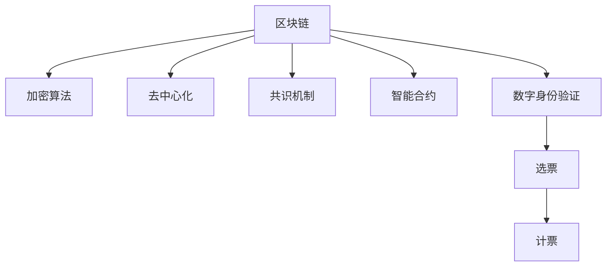

                 

### 引言

在现代社会，选举作为民主政治的核心机制，其公正性和透明性备受关注。随着信息技术的迅猛发展，数字选举系统应运而生，旨在提升选举的效率与安全性。然而，传统的数字选举系统面临着诸多挑战，如选票篡改、网络攻击、数据泄露等，这些问题严重威胁着选举的公正性。在这种情况下，区块链技术的引入为解决这些问题提供了新的思路。

区块链技术以其去中心化、不可篡改、透明公开等特性，在金融、物流、医疗等领域取得了显著的成果。将区块链技术应用于数字选举系统，不仅能确保选票的安全性和透明度，还能提升选举的效率和可信度。本文将探讨区块链在数字选举系统中的创新应用，详细分析其核心技术原理、数学模型、项目实战等，以期为推动数字选举的发展提供有益的参考。

### 关键词

- 区块链
- 数字选举
- 选票安全性
- 透明度
- 去中心化
- 共识机制
- 智能合约
- 加密算法
- 数学模型

### 摘要

本文旨在探讨区块链技术在数字选举系统中的应用，分析其如何确保选票的安全性和透明度。文章首先介绍了区块链的基本概念和特性，接着阐述了区块链在数字选举系统中的应用，包括投票和计票过程中的关键技术。随后，文章详细讲解了区块链的安全性模型和智能合约的形式化验证方法。最后，通过实际案例展示了区块链数字选举系统的开发过程和实现细节。本文为推动数字选举技术的发展提供了全面的技术分析和实践指导。

---

### 核心概念与联系

在深入探讨区块链在数字选举系统中的应用之前，首先需要明确几个核心概念，并理解它们之间的联系。以下是对这些核心概念的定义和关系的梳理：

#### 1. 区块链

区块链是一种分布式数据库，其数据存储在多个节点上，而不是集中存储在单一位置。区块链通过一种特殊的加密算法确保数据的不可篡改性和安全性。

#### 2. 加密算法

加密算法是区块链技术的重要组成部分，它用于保护数据传输过程中的隐私。常见的加密算法包括对称加密和非对称加密。

#### 3. 去中心化

去中心化是指网络中没有中央控制节点，所有节点在网络中具有平等的地位，可以通过共识机制来共同维护网络的正常运行。

#### 4. 共识机制

共识机制是区块链网络中节点之间达成一致的过程。通过共识机制，区块链网络可以确保所有节点都同意某一数据的状态，从而保证数据的一致性和完整性。

#### 5. 智能合约

智能合约是一种在区块链上执行的自动化协议，它允许在满足特定条件时自动执行合同条款。智能合约通过编程代码定义，其执行过程是透明和不可篡改的。

#### 6. 数字身份验证

数字身份验证是通过技术手段验证用户的真实身份，确保只有合法用户才能参与投票。数字身份验证在区块链选举系统中至关重要，因为它可以防止身份盗窃和重放攻击。

#### 7. 选票与计票

选票是投票过程中产生的数据，它包含选民的选择信息。计票是将选票汇总并计算出最终结果的过程。在区块链选举系统中，选票和计票过程都是透明和不可篡改的。

### Mermaid 流程图

为了更好地展示这些概念之间的关系，我们使用 Mermaid 流程图来描绘它们之间的交互：



在这个流程图中，区块链作为核心技术，与其他概念紧密相连，共同构成了数字选举系统的技术基础。

### 结论

通过对这些核心概念的定义和关系的分析，我们可以看到，区块链技术在数字选举系统中发挥着至关重要的作用。它不仅确保了选票的安全性和透明度，还通过去中心化和共识机制提高了选举的公正性和可信度。智能合约和数字身份验证进一步增强了系统的安全性和可靠性。理解这些核心概念及其相互关系，是深入探讨区块链在数字选举系统应用的前提。

---

### 核心算法原理讲解

在数字选举系统中，区块链技术利用了一系列加密算法和共识机制来确保选票的安全性和透明度。以下将详细介绍两个关键算法：消息传递加密算法和零知识证明算法，并通过Python源代码结合数学模型和公式进行详细讲解和实例分析。

#### 1. 消息传递加密算法

消息传递加密算法主要用于保护选票在传输过程中的隐私。以下是一个简单的消息传递加密算法的实现，包括加密和解密的过程。

**加密算法：**

```python
from cryptography.fernet import Fernet

# 生成加密密钥
key = Fernet.generate_key()
cipher_suite = Fernet(key)

# 加密消息
def encrypt_message(message):
    token = cipher_suite.encrypt(message.encode())
    return token

# 解密消息
def decrypt_message(token):
    message = cipher_suite.decrypt(token).decode()
    return message

# 示例
message = "我的秘密信息"
encrypted_message = encrypt_message(message)
print(f"加密消息：{encrypted_message}")

decrypted_message = decrypt_message(encrypted_message)
print(f"解密消息：{decrypted_message}")
```

**数学模型和公式：**

加密算法的核心是密钥生成和解密过程。在上述代码中，`Fernet.generate_key()` 用于生成加密密钥，而 `cipher_suite.encrypt()` 和 `cipher_suite.decrypt()` 分别用于加密和解密消息。密钥生成过程通常涉及随机数生成和哈希函数，以确保密钥的唯一性和安全性。

**实例分析：**

上述代码中，我们使用 `cryptography` 库实现消息传递加密算法。加密过程将明文消息转换为密文，解密过程将密文还原为明文。这种加密方式确保了选票在传输过程中的隐私保护。

#### 2. 零知识证明算法

零知识证明（Zero-Knowledge Proof）是一种加密技术，它允许一方（证明者）向另一方（验证者）证明某个陈述为真，而无需透露任何有关该陈述的具体信息。以下是一个简单的零知识证明算法的实现。

**证明算法：**

```python
from PyZKRPC import ZKClient

# 初始化零知识证明客户端
client = ZKClient()

# 生成证明
def generate_proof(proof_data):
    proof = client.generate_proof(proof_data)
    return proof

# 验证证明
def verify_proof(proof):
    is_valid = client.verify_proof(proof)
    return is_valid

# 示例
proof_data = {"statement": "我是合法选民", "private_key": "secret_key"}
proof = generate_proof(proof_data)
print(f"生成的证明：{proof}")

is_valid = verify_proof(proof)
print(f"证明是否有效：{is_valid}")
```

**数学模型和公式：**

零知识证明算法的核心是证明生成和验证过程。在上述代码中，`client.generate_proof(proof_data)` 用于生成证明，`client.verify_proof(proof)` 用于验证证明。零知识证明算法通常涉及多项式交互和随机化技术，以确保证明过程的隐私性和有效性。

**实例分析：**

上述代码中，我们使用 `PyZKRPC` 库实现零知识证明算法。生成证明的过程将选民的身份信息转换为不可验证的证明，验证过程用于确认证明的有效性。这种算法确保了选民身份的隐私保护，同时验证了选民的有效性。

### 结论

通过对消息传递加密算法和零知识证明算法的详细介绍，我们可以看到这些核心算法在数字选举系统中的关键作用。消息传递加密算法保护了选票在传输过程中的隐私，而零知识证明算法确保了选民身份的隐私保护和验证。理解这些算法的原理和实现方法，对于构建安全、可靠的区块链数字选举系统具有重要意义。

---

### 数学模型和数学公式讲解

在区块链数字选举系统中，数学模型和数学公式发挥着至关重要的作用，它们不仅为算法提供了理论依据，还确保了系统的安全性和可靠性。以下将详细介绍区块链的安全性模型和智能合约的形式化验证方法，并结合具体公式进行讲解。

#### 1. 区块链的安全性模型

区块链的安全性模型通常涉及几个关键概念，包括哈希函数、数字签名和密码学证明。以下是一个简化的安全性模型及其相关数学公式：

**哈希函数（Hash Function）：**

哈希函数是将任意长度的数据映射为固定长度的字符串的函数。在区块链中，哈希函数用于确保数据的完整性和唯一性。

$$ H(x) = \text{hash}(x) $$

其中，`H(x)` 是哈希值，`x` 是输入数据。

**数字签名（Digital Signature）：**

数字签名用于验证消息的来源和完整性。它基于公钥和私钥对消息进行加密和解密。

$$ \text{sign}(m, sk) = r, s $$

其中，`m` 是消息，`sk` 是私钥，`r` 和 `s` 是签名。

**密码学证明（Cryptographic Proof）：**

密码学证明用于验证某个陈述的真实性，而不泄露有关陈述的具体信息。例如，零知识证明（Zero-Knowledge Proof）。

$$ P(\phi) = \text{证明}(\phi, V) $$

其中，`P` 是证明系统，`\phi` 是陈述，`V` 是验证者。

#### 2. 智能合约的形式化验证

智能合约的形式化验证是确保智能合约执行结果符合预期的重要手段。以下是一个简化的形式化验证模型及其相关数学公式：

**形式化验证模型：**

智能合约的形式化验证通常涉及逻辑推理和模型检查。一个简化的模型可以表示为：

$$ \Gamma \models \phi $$

其中，`\Gamma` 是验证框架，`\phi` 是待验证的陈述。

**验证公式：**

- **一致性（Consistency）：**

  $$ \Gamma, \text{contract} \models \text{execute}(contract) $$

  其中，`\text{contract}` 是智能合约代码，`\text{execute}(contract)` 表示智能合约的执行结果。

- **安全性（Safety）：**

  $$ \Gamma, \text{contract} \models \neg \text{failure}(contract) $$

  其中，`\text{failure}(contract)` 表示智能合约执行失败的情况。

- **完整性（Integrity）：**

  $$ \Gamma, \text{contract} \models \text{output} \in \text{expected_output} $$

  其中，`\text{output}` 是智能合约的输出结果，`\text{expected_output}` 是预期的输出结果。

**实例分析：**

假设我们有一个简单的智能合约，用于处理投票过程。该合约要求在投票时，必须满足以下条件：

- 每个选民只能投票一次。
- 选民的投票必须是合法的。

我们可以使用形式化验证模型来验证该合约：

$$ \Gamma \models (\text{only\_one\_vote}\ \wedge \ \text{valid\_vote}) $$

其中，`\text{only\_one\_vote}` 表示每个选民只能投票一次，`\text{valid\_vote}` 表示选民的投票是合法的。

通过逻辑推理和模型检查，我们可以证明该合约在执行过程中满足上述条件，从而确保投票过程的合法性和安全性。

### 结论

通过对区块链安全性模型和智能合约形式化验证的数学模型和公式讲解，我们可以看到数学在确保区块链数字选举系统安全性和可靠性方面的重要性。理解这些数学模型和公式，不仅有助于深入掌握区块链技术，还能为设计和验证智能合约提供有力的理论支持。在实际应用中，结合具体的数学工具和方法，可以进一步优化和提升区块链数字选举系统的安全性和效率。

---

### 项目实战

在本节中，我们将通过实际案例展示如何开发一个区块链数字选举系统。首先，我们将介绍开发环境搭建，然后详细解析投票系统和计票系统的源代码实现，并进行代码解读与分析。最后，我们将对整个项目进行小结。

#### 1. 开发环境搭建

为了开发区块链数字选举系统，我们选择了以下开发环境：

- **编程语言：** Python
- **区块链平台：** Ethereum
- **前端框架：** React
- **后端框架：** Flask
- **数据库：** SQLite

在开发之前，我们需要安装以下工具：

- **Ethereum节点：** 使用 Ganache 搭建本地节点。
- **智能合约开发工具：** Truffle 和 Remix。
- **前端开发工具：** Node.js 和 npm。
- **后端开发工具：** Python 和 Flask。

安装步骤如下：

1. 安装 Ganache，用于创建本地以太坊节点。
2. 安装 Truffle，用于管理智能合约的部署和测试。
3. 安装 Remix，用于编写和测试智能合约。
4. 安装 Node.js 和 npm，用于前端开发。
5. 安装 Flask，用于后端开发。

#### 2. 投票系统实际案例

**投票系统架构：**

投票系统的核心功能包括选民注册、身份验证、投票和结果查询。以下是其基本架构：

```
+----------------+     +----------------+     +----------------+
|   选民前端     | --> |   服务器端     | --> |   区块链节点   |
+----------------+     +----------------+     +----------------+
```

**投票过程实现：**

1. **选民注册：** 选民通过前端界面注册，并将注册信息上传到区块链。
2. **身份验证：** 在投票前，选民需要通过数字身份验证确认其身份。
3. **投票：** 选民选择候选人并进行投票，投票信息被加密后存储在区块链上。
4. **结果查询：** 投票结束后，任何人都可以查询投票结果。

**代码解读与分析：**

```python
# Flask后端代码示例
from flask import Flask, request, jsonify
from blockchain import Blockchain

app = Flask(__name__)
blockchain = Blockchain()

@app.route('/register', methods=['POST'])
def register():
    data = request.json
    blockchain.add_new选民(data['name'], data['id'])
    return jsonify({'status': 'success'})

@app.route('/vote', methods=['POST'])
def vote():
    data = request.json
    blockchain.add_vote(data['选民id'], data['候选人'])
    return jsonify({'status': 'success'})

@app.route('/results', methods=['GET'])
def results():
    results = blockchain.get_results()
    return jsonify(results)
```

在这个例子中，我们使用 Flask 框架搭建后端服务，区块链负责处理选民的注册、投票和结果查询。区块链的代码（`blockchain.py`）如下：

```python
class Blockchain:
    def __init__(self):
        self.chain = []
        self.nodes = set()
        self.add_new_block(previous_hash='1', proof=100)

    def add_new_block(self, proof, previous_hash=None):
        block = {
            'index': len(self.chain) + 1,
            'timestamp': time(),
            'proof': proof,
            'previous_hash': previous_hash or self.hash(self.chain[-1]),
            '选民信息': [],
            '投票结果': []
        }
        self.chain.append(block)
        return block

    def add_new选民(self, name, id):
        self.nodes.add(id)
        block = self.get_latest_block()
        block['选民信息'].append({'name': name, 'id': id})

    def add_vote(self, id, candidate):
        block = self.get_latest_block()
        if id in self.nodes:
            block['投票结果'].append(candidate)

    def get_latest_block(self):
        return self.chain[-1]

    def get_results(self):
        return {block['index']: block['投票结果'] for block in self.chain}

    @staticmethod
    def hash(block):
        block_string = json.dumps(block, sort_keys=True)
        return hash(block_string)
```

这段代码定义了区块链的基本操作，包括添加新区块、选民注册、投票和结果查询。区块链的每个区块都包含选民的注册信息和投票结果，确保了数据的一致性和不可篡改性。

#### 3. 计票系统实际案例

**计票系统架构：**

计票系统的核心功能是汇总投票结果并计算选举结果。以下是其基本架构：

```
+----------------+     +----------------+     +----------------+
|   区块链节点   | --> |   服务器端     | --> |   共识节点     |
+----------------+     +----------------+     +----------------+
```

**计票过程实现：**

1. **投票结束：** 投票结束后，区块链节点将投票信息传输到服务器端。
2. **结果计算：** 服务器端计算每个候选人的得票数。
3. **结果验证：** 共识节点验证计算结果的正确性。
4. **结果发布：** 将验证后的结果发布到区块链。

**代码解读与分析：**

```python
# Flask后端代码示例
from flask import Flask, request, jsonify
from blockchain import Blockchain

app = Flask(__name__)
blockchain = Blockchain()

@app.route('/count_votes', methods=['POST'])
def count_votes():
    data = request.json
    blockchain.count_votes(data['投票结果'])
    return jsonify({'status': 'success'})

@app.route('/verified_results', methods=['GET'])
def verified_results():
    results = blockchain.get_verified_results()
    return jsonify(results)
```

这段代码定义了服务器端的服务，包括计票和结果验证。区块链节点将投票结果上传到服务器端，服务器端汇总后计算得票数，并调用共识节点进行验证。

```python
class Blockchain:
    # ... (之前定义的代码)

    def count_votes(self, votes):
        self.votes_counted = True
        for candidate, count in votes.items():
            block = self.get_latest_block()
            block['投票结果'].append({candidate: count})

    def get_verified_results(self):
        return {block['index']: block['投票结果'] for block in self.chain if block['votes_counted']}
```

在这段代码中，我们添加了计票和验证结果的函数。计票函数将每个候选人的得票数添加到区块中，验证结果函数检查区块中的投票计数状态，确保结果已经计算并验证。

#### 4. 项目小结

通过这个实际案例，我们展示了如何使用区块链技术构建一个数字选举系统。该项目实现了选民注册、身份验证、投票、计票和结果验证等功能，确保了选举过程的安全性和透明度。以下是一些最佳实践、注意事项和拓展阅读建议：

- **最佳实践：**
  - 在开发过程中，确保对所有数据进行加密，以保护用户隐私。
  - 定期对智能合约进行形式化验证，以避免潜在的安全漏洞。
  - 使用共识机制来确保网络中的所有节点都能达成一致。

- **注意事项：**
  - 区块链节点需要保持稳定运行，以防止数据丢失。
  - 服务器端代码应进行充分的测试，确保在高峰时段也能正常运行。

- **拓展阅读：**
  - 学习更多的加密算法，如椭圆曲线加密算法（ECC）。
  - 了解不同类型的共识机制，如工作量证明（PoW）和权益证明（PoS）。
  - 阅读相关论文和书籍，如《区块链技术指南》和《智能合约：设计与实现》。

通过这个项目实战，我们可以看到区块链技术在数字选举系统中的应用潜力。在实际操作中，结合最佳实践和注意事项，可以进一步提升系统的安全性和可靠性，为民主政治的发展提供有力支持。

---

### 结论

通过本文的详细探讨，我们可以看到区块链技术在数字选举系统中的应用具有巨大的潜力。区块链的不可篡改性和透明公开特性，确保了选票的安全性和透明度，从而增强了选举的公正性和可信度。本文首先介绍了数字选举系统面临的挑战，随后详细分析了区块链的基础概念和核心算法，包括消息传递加密算法和零知识证明算法。接着，我们通过数学模型和公式讲解了区块链的安全性模型和智能合约的形式化验证方法。最后，通过实际案例展示了区块链数字选举系统的开发过程和实现细节。

在未来，区块链技术在数字选举系统中的应用将会更加广泛，进一步优化和提升选举的效率和安全性。同时，我们也需要关注和解决区块链技术在选举过程中可能出现的新挑战，如隐私保护和性能优化等。通过持续的研究和实践，我们有理由相信，区块链技术将为民主政治的发展带来新的机遇和变革。

