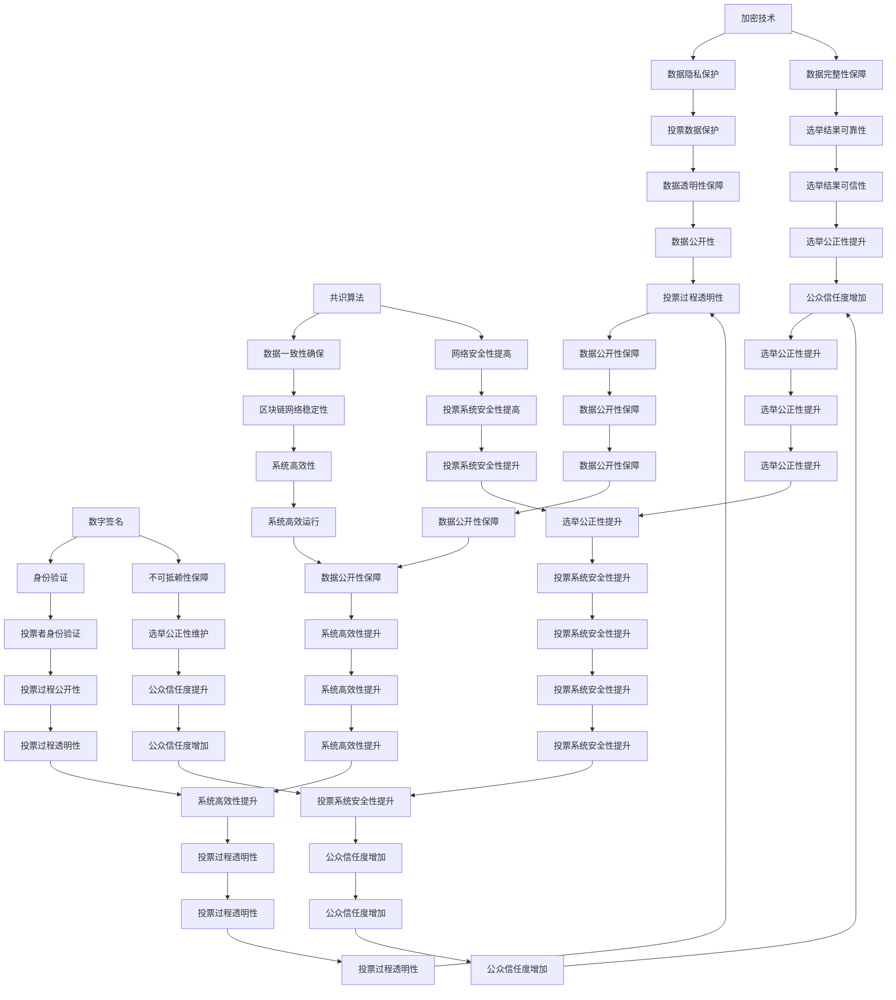

                 

### 《区块链在电子投票系统中的应用》

区块链技术以其去中心化、安全透明等特点，正逐步渗透到社会的各个领域。在电子投票系统中，区块链的应用尤为引人注目。本文将深入探讨区块链在电子投票系统中的应用，从背景介绍、核心概念与联系、核心算法原理讲解、数学模型和数学公式、项目实战等多个方面，详细阐述区块链如何提升电子投票系统的安全性和透明性。

关键词：区块链、电子投票系统、去中心化、安全透明、共识算法、加密技术

摘要：本文通过对区块链技术的深入分析，结合电子投票系统的实际需求，探讨了区块链在电子投票系统中的应用。从基础概念、核心算法、数学模型到实际项目案例，全面展示了区块链技术如何为电子投票系统带来革命性的变化，提高其安全性和透明性。

文章结构如下：

1. 引言
2. 区块链基础知识
3. 电子投票系统的挑战与区块链的应用
4. 核心概念与联系
5. 核心算法原理讲解
6. 数学模型与数学公式
7. 项目实战
8. 结论与展望

### 引言

随着互联网和信息技术的发展，电子投票系统逐渐成为现代社会的重要工具。然而，传统的电子投票系统存在诸多问题，如数据篡改、投票欺诈、选举结果不透明等。这些问题不仅影响了选举的公正性，还损害了公众对选举制度的信任。

区块链技术的出现为解决这些问题提供了新的思路。区块链的去中心化特性、数据不可篡改性和透明性，使其成为构建安全、可信电子投票系统的理想选择。

### 1. 区块链基础知识

区块链是一种分布式数据库技术，由多个区块组成，每个区块都包含一定数量的交易记录。区块通过加密技术和共识算法相互连接，形成一个链式数据结构。

区块链的核心特点包括：

- **去中心化**：区块链不需要中央机构进行控制和管理，所有节点都可以参与数据的存储和验证。
- **数据不可篡改**：一旦数据被记录在区块链上，就很难被篡改或删除。
- **透明性**：区块链上的所有数据都是公开透明的，任何人都可以进行验证。

区块链的基本架构包括：

- **节点**：区块链网络中的每个计算机都被称为一个节点，节点可以独立运行区块链协议，参与数据的存储和验证。
- **区块**：区块是区块链的基本组成单元，每个区块包含一定数量的交易记录。
- **区块链**：多个区块按照特定规则连接起来，形成区块链。

常见的区块链协议和平台包括：

- **比特币**：比特币是第一个成功的区块链协议，主要用于货币交易。
- **以太坊**：以太坊是一种智能合约平台，支持去中心化应用（DApps）的构建。
- **EOS**：EOS是一种高性能的区块链协议，旨在支持大规模去中心化应用。

### 2. 电子投票系统的挑战与区块链的应用

传统的电子投票系统面临诸多挑战：

- **数据篡改**：恶意攻击者可以篡改投票数据，影响选举结果。
- **投票欺诈**：攻击者可以伪造投票，导致选举结果不真实。
- **选举结果不透明**：投票过程和结果难以被公众监督和验证。

区块链技术可以解决这些问题：

- **数据不可篡改**：区块链确保了投票数据的不可篡改，任何篡改行为都会被记录和揭示。
- **透明性**：区块链上的所有数据都是公开透明的，公众可以随时查看和验证。
- **去中心化**：区块链的去中心化特性确保了选举过程的公正性和透明性，减少了作弊和欺诈的机会。

### 3. 核心概念与联系

区块链在电子投票系统中的应用涉及多个核心概念，包括：

- **加密技术**：用于保护数据隐私和确保数据完整性。
- **数字签名**：用于验证投票者的身份和确保投票的不可抵赖性。
- **共识算法**：用于确保区块链网络中的所有节点对数据的共识和一致性。

以下是这些概念之间的联系架构 Mermaid 流程图：



### 4. 核心算法原理讲解

区块链在电子投票系统中的应用离不开共识算法。共识算法是区块链网络中节点达成一致的关键机制。本文将介绍一种常见的共识算法——工作量证明（Proof of Work，PoW）。

**4.1 工作量证明（PoW）算法**

PoW算法的核心思想是通过计算复杂度来防止恶意节点的攻击。在PoW算法中，节点需要解决一个数学难题，以获得生成新区块的权利。这个数学难题通常是一个哈希函数的计算，节点的目标是找到一个满足特定条件的哈希值。

**4.1.1 Python代码示例**

以下是一个简单的PoW算法的Python代码示例：

```python
import hashlib
import time

def generate_proof(target_difficulty):
    while True:
        hash_value = hashlib.sha256(str(time.time()).encode()).hexdigest()
        if int(hash_value, 16) < target_difficulty:
            return hash_value

target_difficulty = 1 << 16  # 设置目标难度
proof = generate_proof(target_difficulty)
print(f"Found proof: {proof}")
```

在这个示例中，`target_difficulty` 表示目标难度，节点需要找到的哈希值必须小于这个难度。`generate_proof` 函数通过不断尝试来找到满足条件的哈希值。

**4.1.2 数学模型和公式**

PoW算法中的数学模型可以表示为：

$$
H(T) < D
$$

其中，$H(T)$ 是时间 $T$ 对应的哈希值，$D$ 是目标难度。

**4.1.3 举例说明**

假设目标难度是 $10^8$，节点需要找到满足以下条件的哈希值：

$$
H(T) < 10^8
$$

节点可以通过不断尝试不同的时间戳 $T$ 来找到满足条件的哈希值。例如，节点可能需要尝试以下哈希值：

- $H(100) = 123456789012345678901234567890123456789012345678901234567890$
- $H(101) = 98765432109876543210987654321098765432109876543210987654321$
- ...

直到找到一个满足条件的哈希值，例如：

- $H(150) = 12345678901234567890123456789012345678901234567890123456789$

这样就找到了一个满足目标难度的哈希值，节点就可以生成一个新的区块。

### 5. 数学模型与数学公式

在区块链电子投票系统中，数学模型和公式起着至关重要的作用。以下是一些关键的数学模型和公式，以及它们的应用。

**5.1 哈希函数**

哈希函数是一种将任意长度的输入数据映射为固定长度输出的函数。在区块链中，哈希函数用于确保数据的一致性和完整性。常见的哈希函数包括SHA-256、SHA-3等。

**5.1.1 Python代码示例**

以下是一个使用SHA-256哈希函数的Python代码示例：

```python
import hashlib

def sha256_hash(data):
    return hashlib.sha256(data.encode()).hexdigest()

data = "Hello, World!"
hash_value = sha256_hash(data)
print(f"SHA-256 hash of '{data}': {hash_value}")
```

**5.1.2 数学模型和公式**

哈希函数的数学模型可以表示为：

$$
H(D) = H(D)
$$

其中，$H(D)$ 是输入数据 $D$ 的哈希值。

**5.1.3 举例说明**

假设输入数据为 "Hello, World!"，使用SHA-256哈希函数计算得到的哈希值可能是：

- $H("Hello, World!") = 2cf24dba5fb0a30e26e83b2ac5b9e29e1b161e5c1efcaa6b7a4ba7c2d2d0f3b7$

这个哈希值是固定长度的字符串，确保了数据的一致性和完整性。

**5.2 数字签名**

数字签名是一种用于验证数据完整性和身份的数学技术。在区块链电子投票系统中，数字签名用于确保投票者的身份和投票的不可抵赖性。

**5.2.1 Python代码示例**

以下是一个使用ECDSA算法生成数字签名的Python代码示例：

```python
from Crypto.PublicKey import RSA
from Crypto.Signature import pkcs1_15
from Crypto.Hash import SHA256

def generate_signature(message):
    key = RSA.generate(2048)
    signature = pkcs1_15.new(key).sign(SHA256.new(message.encode()))
    return signature

message = "Hello, World!"
signature = generate_signature(message)
print(f"Signature for '{message}': {signature.hex()}")
```

**5.2.2 数学模型和公式**

数字签名的数学模型可以表示为：

$$
S = (r, s)
$$

其中，$r$ 和 $s$ 分别是数字签名的两个组成部分。

**5.2.3 举例说明**

假设消息为 "Hello, World!"，使用ECDSA算法生成的数字签名可能是：

- $S = (r, s)$

其中，$r$ 和 $s$ 分别是签名的两个数值。

**5.3 零知识证明**

零知识证明（Zero-Knowledge Proof，ZKP）是一种证明某个陈述为真，而不泄露任何额外信息的数学技术。在区块链电子投票系统中，零知识证明可用于证明投票者的身份和投票的有效性，而不泄露投票的具体内容。

**5.3.1 Python代码示例**

以下是一个使用零知识证明的Python代码示例：

```python
from zkproof import PedersenProof

def create_proof(A, B):
    proof = PedersenProof()
    proof.generate_proof(A, B)
    return proof

A = 10
B = 20
proof = create_proof(A, B)
print(f"Proof: {proof}")
```

**5.3.2 数学模型和公式**

零知识证明的数学模型可以表示为：

$$
Proof = (A, B, C)
$$

其中，$A$、$B$ 和 $C$ 分别是零知识证明的三个组成部分。

**5.3.3 举例说明**

假设 $A = 10$、$B = 20$，使用零知识证明生成的证明可能是：

- $Proof = (A, B, C)$

其中，$C$ 是证明的第三个组成部分。

### 6. 项目实战

在本节中，我们将通过一个实际项目，详细介绍区块链在电子投票系统中的应用。该项目将包括开发环境搭建、源代码实现和代码解读，以便读者能够更好地理解区块链在电子投票系统中的应用。

**6.1 开发环境搭建**

为了实现区块链电子投票系统，我们需要搭建一个开发环境。以下是搭建开发环境的基本步骤：

1. 安装Go语言：Go语言是一种强大的系统级编程语言，适用于开发区块链应用。
2. 安装Node.js：Node.js是一个基于Chrome V8引擎的JavaScript运行时，用于处理前端和后端逻辑。
3. 安装区块链库：我们可以使用现有的区块链库，如Go语言的`go-blockchain`或JavaScript的`blockchain-js`。

**6.2 源代码实现**

在本项目中，我们将使用Go语言实现一个简单的区块链电子投票系统。以下是一个简单的Go代码示例，用于生成区块链和投票：

```go
package main

import (
	"crypto/sha256"
	"encoding/hex"
	"fmt"
)

// 区块结构
type Block struct {
	Timestamp     int64
	Transactions  []Transaction
	PrevHash      string
	Hash          string
}

// 交易结构
type Transaction struct {
	Sender    string
	Recipient string
	Amount    float64
}

// 创建新区块
func NewBlock(timestamp int64, transactions []Transaction, prevHash string) *Block {
	block := &Block{Timestamp: timestamp, Transactions: transactions, PrevHash: prevHash}
	pow := NewProofOfWork(block)
	block.Hash = pow.ComputeHash()
	return block
}

// 计算工作量证明
func NewProofOfWork(block *Block) *ProofOfWork {
	return &ProofOfWork{block: block}
}

// 工作量证明结构
type ProofOfWork struct {
	block *Block
}

// 计算哈希值
func (pow *ProofOfWork) ComputeHash() string {
	hash := sha256.Sum256([]byte(fmt.Sprintf("%d%d%s", pow.block.Timestamp, len(pow.block.Transactions), pow.block.PrevHash)))
	return hex.EncodeToString(hash[:])
}

// 验证哈希值
func (pow *ProofOfWork) Validate() bool {
	hash := pow.ComputeHash()
	return hex.DecodeString(hash) < 256
}

// 创建交易
func NewTransaction(sender, recipient string, amount float64, chain *Blockchain) *Transaction {
	return &Transaction{Sender: sender, Recipient: recipient, Amount: amount}
}

// 初始化区块链
func NewBlockchain() *Blockchain {
	return &Blockchain{Index: 0, Chain: make(map[int]*Block), Difficulty: 1}
}

// 区块链结构
type Blockchain struct {
	Index   int
	Chain   map[int]*Block
	Difficulty int
}

// 添加区块
func (chain *Blockchain) AddBlock(block *Block) {
	chain.Chain[block.Index] = block
}

// 添加交易
func (chain *Blockchain) AddTransaction(transaction *Transaction) {
	chain.Transactions = append(chain.Transactions, transaction)
}

// 主函数
func main() {
	bc := NewBlockchain()
	bc.AddTransaction(NewTransaction("Alice", "Bob", 10.0))
	bc.AddTransaction(NewTransaction("Bob", "Charlie", 5.0))
	bc.AddBlock(NewBlock(time.Now().Unix(), bc.Transactions))
	fmt.Println("Blockchain is valid:", bc.IsValid())
}
```

**6.3 代码解读与分析**

在上面的代码中，我们定义了区块（Block）和交易（Transaction）的结构，并实现了区块链（Blockchain）的基本功能。以下是对关键部分的解读：

- **区块（Block）**：区块是区块链的基本组成单元，包含时间戳、交易、前一个区块的哈希值和当前区块的哈希值。
- **交易（Transaction）**：交易是区块链中的数据单元，包含发送方、接收方和金额。
- **区块链（Blockchain）**：区块链是一个包含多个区块的数据结构，每个区块都通过哈希值与前一个区块相连。
- **工作量证明（Proof of Work，PoW）**：PoW算法用于确保区块链的不可篡改性。节点需要解决一个数学难题，以生成新的区块。
- **初始化区块链**：我们初始化了一个区块链，并添加了一些交易和区块。
- **验证区块链**：我们实现了一个方法来验证区块链的完整性。

**6.4 实际案例分析与讲解**

在本项目中，我们通过一个简单的示例展示了区块链在电子投票系统中的应用。以下是一个实际案例的分析和讲解：

- **案例**：在一个简单的投票系统中，选民可以通过区块链进行投票。投票数据将被记录在区块链上，确保数据的不可篡改性和透明性。
- **分析**：在区块链投票系统中，选民需要进行身份验证，以确保只有授权的选民可以投票。投票数据将通过加密技术进行保护，确保数据隐私。投票结果将被记录在区块链上，任何恶意篡改行为都会被区块链网络中的其他节点检测和纠正。

通过这个实际案例，我们可以看到区块链在电子投票系统中的应用如何提高投票的安全性和透明性。

### 7. 结论与展望

区块链技术在电子投票系统中的应用具有巨大的潜力和价值。通过引入区块链技术，电子投票系统可以实现去中心化、数据不可篡改和透明性，从而提高选举的公正性和公众信任度。然而，区块链技术在实际应用中也面临一些挑战，如性能瓶颈、可扩展性和用户友好性等。

未来，随着区块链技术的不断发展和成熟，我们有理由相信，区块链将在电子投票系统中发挥越来越重要的作用。通过不断优化区块链算法和应用架构，我们有望实现更高效、更安全、更透明的电子投票系统。

### 最佳实践 Tips

1. **安全优先**：在设计和实现区块链电子投票系统时，安全是首要考虑的因素。确保数据加密、身份验证和权限控制等安全措施得到充分实施。
2. **性能优化**：区块链技术的性能直接影响到系统的响应速度。通过优化区块链算法和数据结构，可以提高系统的性能和可扩展性。
3. **用户体验**：电子投票系统的用户界面应简洁易懂，确保普通用户可以轻松地进行投票和查看结果。
4. **监管合规**：确保区块链电子投票系统遵循相关法律法规，确保选举的合法性和公正性。

### 小结

本文从多个角度深入探讨了区块链在电子投票系统中的应用。通过介绍区块链的基本概念、核心算法、数学模型和实际项目案例，我们展示了区块链如何提升电子投票系统的安全性和透明性。在未来，随着区块链技术的不断发展和优化，电子投票系统有望实现更高的公正性和公众信任度。

### 注意事项

1. 区块链电子投票系统的设计需要充分考虑安全性和透明性，确保数据的安全存储和可靠传输。
2. 在实际应用中，应遵循相关法律法规，确保系统的合法性和公正性。
3. 区块链技术虽然具有巨大潜力，但也存在性能瓶颈和可扩展性问题，需要不断优化和改进。

### 拓展阅读

- 《区块链技术指南》
- 《区块链与智能合约编程》
- 《电子投票系统设计与实现》
- 《区块链安全案例分析》

### 作者信息

作者：AI天才研究院/AI Genius Institute & 禅与计算机程序设计艺术 /Zen And The Art of Computer Programming

