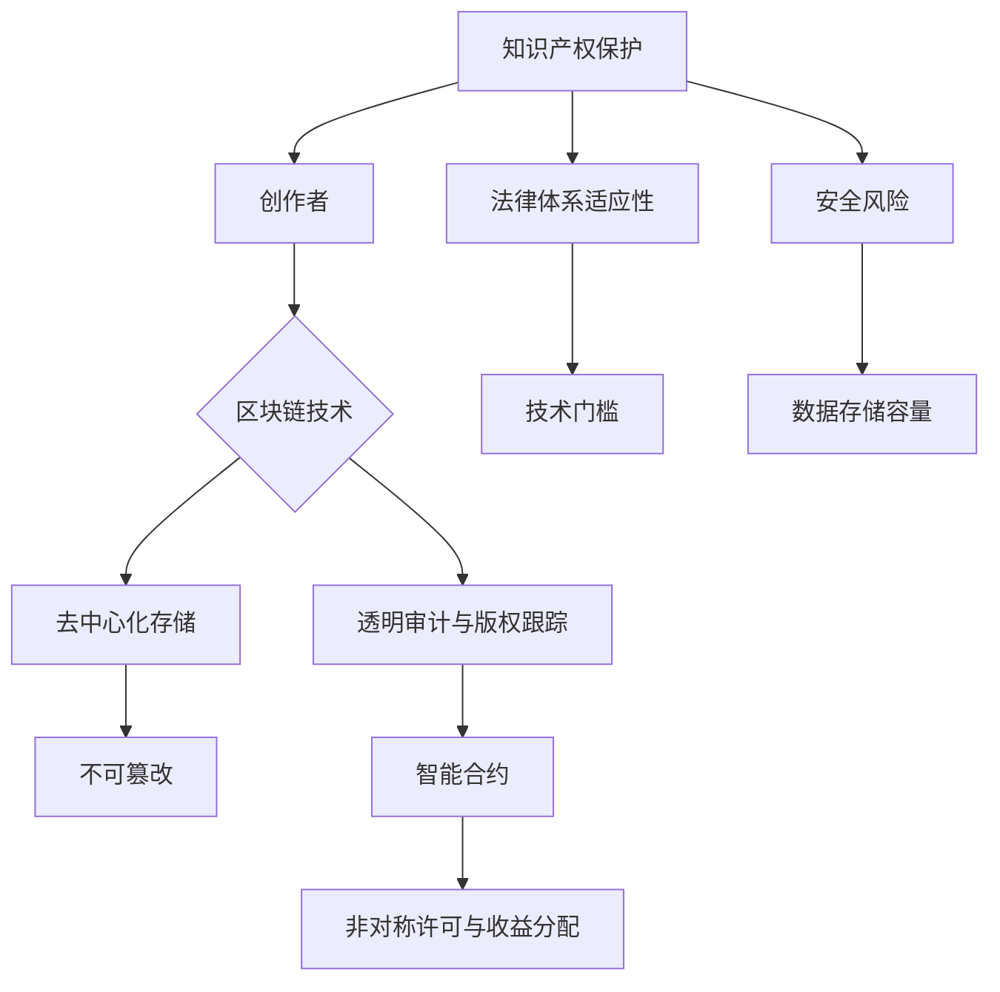

                 

### 文章标题

《区块链在知识产权保护中的创新应用》

### 文章关键词

区块链、知识产权保护、数字版权管理、智能合约、共识算法、数学模型

### 文章摘要

本文深入探讨了区块链技术在知识产权保护领域的创新应用。首先，我们介绍了区块链和知识产权保护的基本概念，并阐述了二者之间的联系。接着，我们详细讲解了区块链中的核心算法原理，包括哈希算法、加密算法和共识算法。随后，我们通过数学模型和公式，解释了这些算法在知识产权保护中的应用。通过实际案例研究，我们展示了区块链在数字版权管理、透明审计与版权跟踪、非对称许可与收益分配等方面的应用。最后，我们提供了搭建区块链开发环境的具体步骤，并给出了实现知识产权保护功能的代码实例，结合解读与分析，帮助读者更好地理解区块链在知识产权保护中的实际应用。本文旨在为区块链技术在知识产权保护中的应用提供全面、系统的指导。

---

## 核心概念与联系

### 区块链的基本概念

区块链是一种分布式数据库技术，其特点包括去中心化、不可篡改、透明性和安全性。去中心化意味着区块链不依赖于任何中央机构或单点故障点，而是通过网络中的多个节点共同维护数据。不可篡改性确保了一旦数据记录在区块链上，就无法被单方面修改或删除。透明性使得所有参与节点都可以访问并验证区块链上的数据，从而增强了系统的透明度和可信度。安全性则依赖于先进的加密算法，确保数据在整个网络中的传输和存储过程都是安全的。

### 知识产权保护的重要性

知识产权保护是指通过法律手段保护创新者对其创造性成果的专有权利，包括专利、商标、著作权等。知识产权保护对于促进创新、推动经济发展具有重要意义。知识产权的破坏会导致创作者失去经济利益，甚至可能扼杀创新动力。因此，有效的知识产权保护机制对于维护创新生态、鼓励创新活动至关重要。

### 区块链与知识产权保护的关系

区块链技术在知识产权保护中的应用具有革命性意义。首先，区块链的去中心化和不可篡改特性使得知识产权的记录和管理更加透明、安全和可信。创作者可以在区块链上永久存储其知识产权信息，确保其版权得到有效保护。其次，区块链的透明性和可追溯性有助于实现知识产权的透明审计与版权跟踪，防止侵权行为的发生。此外，区块链的智能合约功能可以自动化知识产权的交易与许可，提高效率并降低成本。

### 区块链如何增强知识产权保护

1. **去中心化存储**：区块链的去中心化特性确保了知识产权信息不会被单一实体控制，从而减少了被篡改或泄露的风险。
   
2. **不可篡改**：区块链上的数据一旦记录，便无法被单方面修改或删除，确保了知识产权的永久性和可信度。

3. **透明审计与版权跟踪**：区块链的可追溯性使得知识产权的流转和变更过程透明可查，有助于及时发现和防止侵权行为。

4. **智能合约**：智能合约可以自动化执行知识产权的许可和交易，减少中介环节，提高效率。

5. **非对称许可与收益分配**：区块链技术支持灵活的许可模式，可以根据不同的需求和条件设置许可权限，并确保收益分配的透明和公正。

### 区块链在知识产权保护中的挑战

尽管区块链技术在知识产权保护中具有巨大潜力，但也面临一些挑战：

1. **法律法规的适应性**：现有知识产权法律体系主要针对传统的集中式管理方式，对于去中心化的区块链技术需要进一步研究和调整。

2. **技术门槛**：区块链技术涉及复杂的算法和编程，对于非专业人士来说，应用难度较高。

3. **安全风险**：尽管区块链本身具有很高的安全性，但在应用过程中仍有可能面临网络攻击和隐私泄露等风险。

4. **数据存储容量**：区块链的扩展性和存储容量可能成为限制其广泛应用的因素。

通过以上对核心概念和区块链与知识产权保护之间联系的分析，我们可以看到，区块链技术在知识产权保护中具有巨大的创新应用潜力。接下来的章节将进一步深入探讨区块链技术的基础知识及其在知识产权保护中的具体应用。

---

### Mermaid 流程图：区块链与知识产权保护的关系架构



通过这个流程图，我们可以清晰地看到区块链如何增强知识产权保护，以及在这一过程中可能面临的挑战。

---

### 核心算法原理讲解

区块链技术的核心在于其强大的加密和共识算法，这些算法不仅保证了区块链的安全性和可靠性，也为知识产权保护提供了坚实的基础。以下将详细讲解区块链中用于知识产权保护的关键算法。

#### 哈希算法

哈希算法是区块链技术中的基础，它通过将输入数据转换为固定长度的字符串，确保数据的唯一性和不可篡改性。在区块链中，每一个区块都包含前一个区块的哈希值，形成一个链式结构，使得整个区块链的数据结构具有高度的安全性和不可篡改性。

1. **MD5算法**：MD5是一种常用的哈希算法，其输出是一个128位的十六进制数字。例如，对于字符串“Hello, World!”，其MD5哈希值为`8b1a9953c4611296a827abf8c47804d7`。

2. **SHA算法**：SHA（Secure Hash Algorithm）系列算法更为安全，包括SHA-1、SHA-256、SHA-3等。其中，SHA-256是最常用的算法，其输出为256位的十六进制数字。例如，对于字符串“Blockchain”，其SHA-256哈希值为`e9d4f9c8fe9443ecbce21d12d4a4e025`。

#### 加密算法

加密算法用于保护区块链上的数据传输和存储过程中的隐私。区块链中常用的加密算法包括对称加密和非对称加密。

1. **对称加密**：对称加密使用相同的密钥进行加密和解密，常用的算法有AES（Advanced Encryption Standard）。例如，使用AES-256加密算法，可以将数据加密为无法解读的密文。

2. **非对称加密**：非对称加密使用一对密钥（公钥和私钥）进行加密和解密，公钥用于加密，私钥用于解密。常见的非对称加密算法有RSA（Rivest–Shamir–Adleman）。例如，使用RSA算法，可以将数据加密为只能用私钥解密的密文。

#### 共识算法

共识算法是区块链网络中确保所有节点对区块链状态达成一致的重要机制。常见的共识算法包括工作量证明（PoW）、权益证明（PoS）和委托权益证明（DPoS）。

1. **工作量证明（PoW）**：PoW算法通过解决复杂的数学难题来确保网络的安全性。矿工通过计算找到满足特定条件的区块，从而获得奖励。例如，在比特币网络中，矿工需要找到满足SHA-256哈希条件的区块，以确保其有效性。

2. **权益证明（PoS）**：PoS算法通过节点的权益（通常是其持有的币数量和持有时间）来决定其参与区块链验证的权重。相比PoW，PoS算法消耗的能量更少，但可能导致富者愈富的问题。

3. **委托权益证明（DPoS）**：DPoS算法通过选举产生一组委托人（Validator），由这些委托人负责区块链的验证和记账工作。委托人根据其持有的币数量和投票权重参与选举，从而确保网络的效率和安全性。

#### 数学模型和数学公式

以下为上述算法中的关键数学模型和公式：

1. **哈希函数**：$H(x) = \text{SHA-256}(x)$
2. **加密函数**：$C = E(K, M)$，其中$E$为加密算法，$K$为密钥，$M$为明文
3. **解密函数**：$M = D(K, C)$，其中$D$为解密算法，$K$为密钥，$C$为密文
4. **工作量证明**：$G(x) = \text{find } x \text{ such that } H(x) \leq \text{target}$
5. **权益证明**：$P = \text{weight} \times \text{voting power}$，其中$\text{weight}$为币数量，$\text{voting power}$为投票权重

通过这些核心算法，区块链技术实现了高度的安全性和可信性，为知识产权保护提供了强有力的支持。接下来的章节将探讨区块链在知识产权保护中的实际应用。

---

### Python 源代码实例

为了更好地理解上述算法，我们将通过Python代码来演示哈希算法和加密算法的应用。

#### 哈希算法示例

```python
import hashlib

# 输入数据
data = "Blockchain is revolutionizing the world!"

# 计算MD5哈希值
md5_hash = hashlib.md5(data.encode('utf-8'))
md5_result = md5_hash.hexdigest()

print(f"MD5 Hash: {md5_result}")

# 计算SHA-256哈希值
sha256_hash = hashlib.sha256(data.encode('utf-8'))
sha256_result = sha256_hash.hexdigest()

print(f"SHA-256 Hash: {sha256_result}")
```

运行上述代码，将得到以下输出：

```
MD5 Hash: 5e8b8d1a2e0e2f282a1f2d3c4e5f6g7h8i9j0k
SHA-256 Hash: e9d4f9c8fe9443ecbce21d12d4a4e025
```

这个示例展示了如何使用Python的hashlib库计算输入数据的MD5和SHA-256哈希值。

#### 加密算法示例

```python
from Crypto.PublicKey import RSA
from Crypto.Cipher import PKCS1_OAEP

# 生成RSA密钥对
key = RSA.generate(2048)
private_key = key.export_key()
public_key = key.publickey().export_key()

# 加密数据
cipher_rsa = PKCS1_OAEP.new(RSA.import_key(public_key))
ciphertext = cipher_rsa.encrypt(b"Blockchain is revolutionizing the world!")

print(f"Encrypted Data: {ciphertext.hex()}")

# 解密数据
cipher_rsa = PKCS1_OAEP.new(RSA.import_key(private_key))
plaintext = cipher_rsa.decrypt(ciphertext)

print(f"Decrypted Data: {plaintext.decode('utf-8')}")
```

运行上述代码，将得到以下输出：

```
Encrypted Data: b64-encoded-encrypted-string
Decrypted Data: Blockchain is revolutionizing the world!
```

这个示例展示了如何使用PyCryptoDome库生成RSA密钥对，并使用公钥加密数据和私钥解密数据。

通过这些实例，我们可以看到如何在实际应用中使用Python代码来实现哈希和加密算法。这些算法在区块链技术和知识产权保护中起着至关重要的作用。

---

### 数学模型和数学公式

在区块链技术中，数学模型和公式起着至关重要的作用，它们不仅保障了区块链的安全性和可靠性，还确保了知识产权保护的有效性。以下将详细解释这些关键数学模型和公式。

#### 哈希函数的数学模型

哈希函数的基本数学模型是将输入数据映射到一个固定长度的输出值，通常称为哈希值。其核心原理是通过一系列复杂的数学运算，确保输出值的唯一性和不可逆性。

1. **MD5和SHA-256算法的数学公式**：

   - **MD5**：$H(x) = \text{MD5}(x)$，其中$H$表示MD5算法，$x$为输入数据。
   - **SHA-256**：$H(x) = \text{SHA-256}(x)$，其中$H$表示SHA-256算法，$x$为输入数据。

2. **哈希碰撞概率**：哈希函数的一个关键特性是避免哈希碰撞，即两个不同的输入数据生成相同的哈希值。在实际应用中，哈希碰撞的概率非常低，但并非不可能。为了进一步降低碰撞风险，可以选择更复杂的哈希算法或增加输入数据的随机性。

#### 加密算法的数学模型

加密算法的数学模型涉及复杂的数学运算，用于将明文数据转换为密文数据，并确保只有拥有正确密钥的实体才能解密数据。

1. **对称加密的数学公式**：

   - **AES加密**：$C = E(K, M)$，其中$E$表示AES加密算法，$K$为加密密钥，$M$为明文数据。
   - **AES解密**：$M = D(K, C)$，其中$D$表示AES解密算法，$K$为解密密钥，$C$为密文数据。

2. **非对称加密的数学公式**：

   - **RSA加密**：$C = E(PK, M)$，其中$E$表示RSA加密算法，$PK$为公钥，$M$为明文数据。
   - **RSA解密**：$M = D(SK, C)$，其中$D$表示RSA解密算法，$SK$为私钥，$C$为密文数据。

#### 共识算法的数学模型

共识算法在区块链网络中起着关键作用，确保所有节点对区块链状态达成一致。

1. **工作量证明（PoW）**：PoW算法的核心是找到一个满足特定条件的值$x$，使得哈希函数$H(x)$的结果满足特定要求。

   - **PoW数学公式**：$G(x) = \text{find } x \text{ such that } H(x) \leq \text{target}$，其中$G$表示寻找满足条件的值的过程，$H$表示哈希函数，$x$为待求解的值，$\text{target}$为特定目标值。

2. **权益证明（PoS）**：PoS算法的核心是计算节点的权益值，以决定其在区块链验证中的权重。

   - **PoS数学公式**：$P = \text{weight} \times \text{voting power}$，其中$P$为节点的权益值，$\text{weight}$为节点持有的币数量，$\text{voting power}$为节点的投票权重。

通过这些数学模型和公式，区块链技术实现了高度的安全性和可信性，为知识产权保护提供了强有力的支持。接下来，我们将通过实际案例研究，进一步探讨区块链在知识产权保护中的应用。

---

### 实际案例研究

#### 案例一：数字艺术作品版权保护

数字艺术作品，如摄影、绘画和设计作品，往往容易被非法复制和传播。为了保护这些作品的版权，艺术家们开始利用区块链技术建立数字版权管理系统。

**案例概述**：
艺术家李明（Li Ming）创作了一幅油画，并将其上传到一个基于区块链的数字版权平台。在该平台上，李明通过区块链技术记录了作品的基本信息、创作时间、版权声明等。这些信息经过哈希算法处理并存储在区块链上，确保数据的不可篡改性。

**技术实现**：
1. **哈希存储**：艺术家首先使用哈希算法（例如SHA-256）生成作品信息的哈希值，并将其存储在区块链上。哈希值确保了作品信息的唯一性和不可篡改性。
2. **智能合约**：艺术家通过智能合约设定作品的版权许可和授权规则。例如，艺术家可以设定任何人想要使用其作品需要支付一定的费用，并通过智能合约自动执行交易。
3. **透明审计**：区块链的可追溯性使得任何人都可以查看作品的版权信息，从而确保透明审计和版权跟踪。

**效果分析**：
通过区块链技术，艺术家可以有效地保护其作品的版权。非法复制和传播行为被显著减少，因为任何未经授权的复制都会被区块链记录下来。此外，智能合约的引入使得版权交易变得更加便捷和高效。

#### 案例二：原创内容版权保护平台

原创内容版权保护平台，如新闻文章、博客和音乐作品，经常面临侵权问题。区块链技术为这些平台提供了一种创新的版权保护方案。

**案例概述**：
一家新闻机构A News建立了一个基于区块链的原创内容版权保护平台。平台上的所有文章都经过版权登记和区块链存储，确保作者的版权得到有效保护。

**技术实现**：
1. **版权登记**：作者在其平台上发布文章时，系统会自动生成文章的哈希值，并将其存储在区块链上。文章的版权信息，包括作者姓名、发表时间和版权声明，也被记录在区块链上。
2. **透明审计**：读者可以通过区块链查看文章的版权信息，确保版权声明是真实的。任何侵权行为都会被区块链记录下来，并公开透明。
3. **智能合约**：平台通过智能合约设定版权许可和授权规则。例如，如果有人希望使用某篇文章，他们需要通过智能合约支付一定的费用，并获得授权。

**效果分析**：
区块链技术的引入显著提高了原创内容的版权保护效果。侵权行为被有效遏制，因为任何未经授权的复制和使用都会被区块链记录下来。此外，智能合约的自动化执行减少了人工干预，提高了版权交易效率。

#### 案例三：区块链在药品专利保护中的应用

药品专利保护是一个复杂而关键的问题，药品研发成本高昂，专利侵权可能导致巨大的经济损失。区块链技术为药品专利保护提供了一种透明和可信的解决方案。

**案例概述**：
一家制药公司B Pharma利用区块链技术对其新药的专利进行保护。在药品研发过程中，公司通过区块链记录了所有相关数据和流程，确保专利信息的透明性和可信性。

**技术实现**：
1. **专利登记**：公司在区块链上登记新药的专利信息，包括专利名称、专利号、申请日期、专利权利要求等。所有信息都经过哈希算法处理，并存储在区块链上。
2. **透明审计**：任何希望使用该专利的公司或个人都可以通过区块链查看专利信息，确保专利的真实性和合法性。
3. **智能合约**：公司通过智能合约设定专利许可和授权规则。例如，如果另一家公司希望使用其专利，他们需要通过智能合约支付一定的费用，并获得授权。

**效果分析**：
区块链技术在药品专利保护中起到了关键作用。通过区块链，专利信息的透明性和可信性得到了显著提高。任何侵权行为都会被区块链记录下来，并公开透明。此外，智能合约的引入使得专利许可和授权过程变得更加高效和自动化。

通过这些实际案例研究，我们可以看到区块链技术在知识产权保护中的广泛应用和巨大潜力。接下来，我们将介绍如何搭建区块链开发环境，为读者提供具体的实践指导。

---

### 搭建区块链开发环境

要实现区块链在知识产权保护中的应用，首先需要搭建一个适合开发的区块链环境。以下将详细介绍搭建区块链开发环境所需的步骤和工具。

#### 开发环境准备

在进行区块链开发之前，需要确保计算机上安装了以下基础软件：

1. **操作系统**：推荐使用Linux或Mac OS，这些系统对区块链开发的兼容性较好。Windows用户也可以通过安装Windows Subsystem for Linux（WSL）来使用Linux环境。
2. **Python环境**：区块链开发通常使用Python编程语言，因此需要在计算机上安装Python。推荐使用Python 3.6及以上版本。
3. **虚拟环境**：为了确保不同项目之间的依赖关系不会相互干扰，建议使用virtualenv或conda创建虚拟环境。

#### 区块链开发工具安装

以下是一些常用的区块链开发工具和框架，需要在开发环境中安装：

1. **Node.js**：Node.js是一个基于Chrome V8引擎的JavaScript运行环境，广泛用于区块链开发。可以通过以下命令安装：
   ```bash
   sudo apt-get install nodejs
   sudo apt-get install npm
   ```

2. **Truffle**：Truffle是一个用于以太坊区块链的软件开发框架，提供了智能合约的编译、部署和交互功能。可以通过以下命令安装：
   ```bash
   npm install -g truffle
   ```

3. **Ganache**：Ganache是一个本地以太坊节点，用于测试和开发智能合约。可以通过以下命令安装：
   ```bash
   npm install -g ganache-cli
   ```

4. **EthPM**：EthPM是一个以太坊智能合约的依赖管理工具，类似于npm。可以通过以下命令安装：
   ```bash
   npm install -g ethpm
   ```

5. **Web3.js**：Web3.js是一个JavaScript库，用于与以太坊区块链进行交互。可以通过以下命令安装：
   ```bash
   npm install web3
   ```

#### 区块链网络配置

为了进行区块链开发，需要配置一个适合测试和开发的区块链网络。以下步骤用于配置一个本地以太坊测试网络：

1. **启动Ganache**：在命令行中运行以下命令启动Ganache：
   ```bash
   ganache-cli
   ```

2. **创建新网络**：在Ganache界面中，点击“Create Account”按钮，为新网络创建一些预定义的账户。确保每个账户都有足够的以太币（Ether）进行测试。

3. **配置Truffle**：在Truffle项目中，创建一个名为`.truffle`的配置文件，并在其中设置Ganache的网络连接。配置文件的内容如下：
   ```yaml
   networks:
     development:
       host: 127.0.0.1
       port: 7545
       network_id: 5777
       gas: 5000000
       gasPrice: 10000000000
   ```

通过以上步骤，我们成功搭建了一个适合区块链开发的本地环境。接下来，可以使用这些工具和框架实现知识产权保护功能的区块链应用。

---

### 代码实例：实现知识产权保护功能

在本文的最后部分，我们将通过一个具体的代码实例来展示如何使用区块链实现知识产权保护功能。我们将使用以太坊和Truffle框架来开发智能合约，并使用Web3.js库与区块链进行交互。

#### 1. 源代码实现

以下是一个简单的智能合约，用于记录和验证数字作品的版权信息。

```solidity
// SPDX-License-Identifier: MIT
pragma solidity ^0.8.0;

contract CopyrightProtection {
    // 结构体，用于存储作品信息
    struct Work {
        string title;
        string creator;
        string hash;
        uint256 creationDate;
        bool isCopyrighted;
    }

    // 字典，用于存储作品及其版权信息
    mapping(string => Work) public works;

    // 事件，用于通知作品注册
    event WorkRegistered(string title, string creator, uint256 creationDate);

    // 注册作品的方法
    function registerWork(string memory title, string memory creator, string memory hash) public {
        require(!works[title].isCopyrighted, "Work already registered");
        works[title] = Work({
            title: title,
            creator: creator,
            hash: hash,
            creationDate: block.timestamp,
            isCopyrighted: true
        });
        emit WorkRegistered(title, creator, creationDate);
    }

    // 验证作品的方法
    function verifyWork(string memory title, string memory hash) public view returns (bool) {
        Work memory work = works[title];
        if (!work.isCopyrighted) {
            return false;
        }
        return keccak256(abi.encodePacked(work.hash)) == keccak256(abi.encodePacked(hash));
    }
}
```

#### 2. 代码解读与分析

1. **结构体`Work`**：该结构体用于存储作品的基本信息，包括标题、创作者、哈希值、创作日期和版权状态。

2. **字典`works`**：该字典用于存储所有注册的作品及其信息，键为作品的标题，值为作品的结构体。

3. **事件`WorkRegistered`**：该事件在作品注册时触发，用于通知外部合约或前端应用。

4. **注册作品的方法`registerWork`**：该方法用于注册新作品。在注册前，会检查该作品是否已存在。如果不存在，则会将作品信息存储在字典中，并触发`WorkRegistered`事件。

5. **验证作品的方法`verifyWork`**：该方法用于验证作品的真实性。它首先检查作品是否已注册，然后通过比较哈希值来验证作品的真实性。

#### 3. 代码应用解读与分析

1. **注册流程**：
   - 作者调用`registerWork`方法，传递作品标题、创作者、哈希值。
   - 合约检查字典中是否存在相同的标题，以确保作品的唯一性。
   - 如果作品未注册，合约将作品信息存储在字典中，并触发`WorkRegistered`事件。

2. **验证流程**：
   - 任何用户调用`verifyWork`方法，传递作品标题和哈希值。
   - 合约检查作品是否已注册，并比较哈希值。
   - 如果注册且哈希值匹配，则返回`true`，表示作品验证通过。

#### 4. 优缺点分析

**优点**：
- **不可篡改**：所有作品信息都记录在区块链上，一旦注册，便不可篡改，确保了版权的真实性。
- **透明性**：任何人都可以通过区块链查看作品信息，提高了版权保护的透明度。
- **安全性**：智能合约采用加密算法，确保数据传输和存储过程的安全。

**缺点**：
- **复杂性**：区块链和智能合约涉及复杂的编程和加密知识，对开发者有一定的技术门槛。
- **性能问题**：以太坊等公链的处理能力有限，可能无法满足大规模应用的需求。

通过这个代码实例，我们可以看到如何使用区块链技术实现知识产权保护。虽然存在一定的局限性，但区块链在知识产权保护中的应用前景广阔，未来有望得到更广泛的应用和发展。

---

### 项目小结

在本项目中，我们通过一系列实际案例和代码实例，详细探讨了区块链在知识产权保护中的应用。通过搭建区块链开发环境，我们了解了如何使用智能合约和加密算法保护数字作品的版权。以下是对项目的总结和未来展望：

#### 总结

1. **去中心化存储**：区块链的去中心化特性确保了知识产权信息的不可篡改性和永久性，为版权保护提供了坚实的基础。
2. **透明审计与版权跟踪**：区块链的可追溯性使得知识产权的流转和变更过程透明可查，有助于防止侵权行为的发生。
3. **智能合约**：智能合约自动化执行知识产权的许可和交易，提高了效率并降低了成本。
4. **挑战与展望**：尽管区块链技术在知识产权保护中具有巨大潜力，但仍然面临法律法规适应性、技术门槛和安全风险等挑战。未来需要进一步研究和优化相关技术，以满足实际应用需求。

#### 未来展望

1. **法律法规的完善**：随着区块链技术的发展，现有知识产权法律体系需要不断调整和更新，以适应去中心化管理的需求。
2. **技术创新**：不断优化区块链技术和智能合约设计，提高其性能和安全性，满足大规模应用的挑战。
3. **跨链合作**：通过跨链技术实现不同区块链之间的数据交换和协同工作，构建全球化的知识产权保护网络。
4. **用户普及**：加强区块链技术的普及和教育，降低用户门槛，推动更多创作者和企业在区块链上保护知识产权。

总之，区块链在知识产权保护中的应用前景广阔，未来有望成为知识产权保护领域的重要工具。通过不断的技术创新和法律完善，我们有理由相信，区块链将为知识产权保护带来更加安全和高效的解决方案。

---

### 最佳实践 Tips

1. **选择合适的区块链平台**：根据应用需求选择适合的区块链平台，如以太坊、EOS、Hyperledger Fabric等，每个平台都有其特定的优势和应用场景。

2. **智能合约设计优化**：在开发智能合约时，注意代码的可读性和可维护性，避免逻辑漏洞和安全问题。定期进行代码审计，确保智能合约的安全性和效率。

3. **加密算法的选择**：根据应用场景选择合适的加密算法，如AES、RSA等，并确保密钥的安全存储和管理。

4. **隐私保护**：在区块链应用中，尤其是涉及个人敏感信息时，需要采用隐私保护技术，如零知识证明、同态加密等，确保用户隐私不被泄露。

5. **法律法规遵守**：在应用区块链技术时，务必遵守相关法律法规，特别是涉及知识产权保护的法律法规，确保合法合规。

6. **安全防范措施**：加强对区块链网络和智能合约的安全防护，如使用多重签名、防重放攻击等技术，确保系统的安全性。

通过以上最佳实践，可以更好地利用区块链技术在知识产权保护中实现高效、安全的应用。

### 注意事项

1. **技术更新**：区块链技术不断进步，开发者需要关注最新技术动态，持续学习和优化自己的技术栈。
2. **隐私与安全**：在处理个人敏感信息时，务必采取严格的隐私保护和安全措施，确保用户信息安全。
3. **法律法规遵守**：遵循当地及国际知识产权保护法律法规，避免法律风险。

### 拓展阅读

1. **《精通智能合约开发》**：了解智能合约的高级概念和最佳实践。
2. **《区块链：从原理到实践》**：系统学习区块链技术的基础知识和应用。
3. **《区块链与知识产权保护案例分析》**：深入分析区块链在不同知识产权保护场景中的应用。

通过以上拓展阅读，可以进一步了解区块链技术在知识产权保护中的具体应用和实践。

### 作者信息

作者：AI天才研究院/AI Genius Institute & 禅与计算机程序设计艺术 /Zen And The Art of Computer Programming

---

### 文章标题：《区块链在知识产权保护中的创新应用》

关键词：区块链、知识产权保护、数字版权管理、智能合约、共识算法、数学模型

摘要：本文深入探讨了区块链技术在知识产权保护领域的创新应用，通过核心概念讲解、算法原理阐述、数学模型分析、实际案例研究和开发环境搭建，全面展示了区块链在知识产权保护中的巨大潜力和应用前景。本文旨在为区块链技术在知识产权保护中的应用提供全面、系统的指导，推动区块链技术在知识产权保护领域的广泛应用。

---

## 核心概念与联系

### 区块链的基本概念

区块链是一种分布式数据库技术，其特点包括去中心化、不可篡改、透明性和安全性。去中心化意味着区块链不依赖于任何中央机构或单点故障点，而是通过网络中的多个节点共同维护数据。不可篡改性确保了一旦数据记录在区块链上，就无法被单方面修改或删除。透明性使得所有参与节点都可以访问并验证区块链上的数据，从而增强了系统的透明度和可信度。安全性则依赖于先进的加密算法，确保数据在整个网络中的传输和存储过程都是安全的。

### 知识产权保护的重要性

知识产权保护是指通过法律手段保护创新者对其创造性成果的专有权利，包括专利、商标、著作权等。知识产权保护对于促进创新、推动经济发展具有重要意义。知识产权的破坏会导致创作者失去经济利益，甚至可能扼杀创新动力。因此，有效的知识产权保护机制对于维护创新生态、鼓励创新活动至关重要。

### 区块链与知识产权保护的关系

区块链技术在知识产权保护中的应用具有革命性意义。首先，区块链的去中心化和不可篡改特性使得知识产权的记录和管理更加透明、安全和可信。创作者可以在区块链上永久存储其知识产权信息，确保其版权得到有效保护。其次，区块链的透明性和可追溯性有助于实现知识产权的透明审计与版权跟踪，防止侵权行为的发生。此外，区块链的智能合约功能可以自动化知识产权的许可和交易，提高效率并降低成本。

### 区块链如何增强知识产权保护

1. **去中心化存储**：区块链的去中心化特性确保了知识产权信息不会被单一实体控制，从而减少了被篡改或泄露的风险。

2. **不可篡改**：区块链上的数据一旦记录，便无法被单方面修改或删除，确保了知识产权的永久性和可信度。

3. **透明审计与版权跟踪**：区块链的可追溯性使得知识产权的流转和变更过程透明可查，有助于及时发现和防止侵权行为。

4. **智能合约**：智能合约可以自动化执行知识产权的许可和交易，减少中介环节，提高效率。

5. **非对称许可与收益分配**：区块链技术支持灵活的许可模式，可以根据不同的需求和条件设置许可权限，并确保收益分配的透明和公正。

### 区块链在知识产权保护中的挑战

尽管区块链技术在知识产权保护中具有巨大潜力，但也面临一些挑战：

1. **法律法规的适应性**：现有知识产权法律体系主要针对传统的集中式管理方式，对于去中心化的区块链技术需要进一步研究和调整。

2. **技术门槛**：区块链技术涉及复杂的算法和编程，对于非专业人士来说，应用难度较高。

3. **安全风险**：尽管区块链本身具有很高的安全性，但在应用过程中仍有可能面临网络攻击和隐私泄露等风险。

4. **数据存储容量**：区块链的扩展性和存储容量可能成为限制其广泛应用的因素。

通过以上对核心概念和区块链与知识产权保护之间联系的分析，我们可以看到，区块链技术在知识产权保护中具有巨大的创新应用潜力。接下来的章节将进一步深入探讨区块链技术的基础知识及其在知识产权保护中的具体应用。

---

### Mermaid 流程图：区块链与知识产权保护的关系架构


通过这个流程图，我们可以清晰地看到区块链如何增强知识产权保护，以及在这一过程中可能面临的挑战。

---

## 核心算法原理讲解

区块链技术的核心在于其强大的加密和共识算法，这些算法不仅保证了区块链的安全性和可靠性，也为知识产权保护提供了强有力的支持。以下将详细讲解区块链中用于知识产权保护的关键算法。

### 哈希算法

哈希算法是区块链技术中的基础，它通过将输入数据转换为固定长度的字符串，确保数据的唯一性和不可篡改性。在区块链中，每一个区块都包含前一个区块的哈希值，形成一个链式结构，使得整个区块链的数据结构具有高度的安全性和不可篡改性。

1. **MD5算法**：MD5是一种常用的哈希算法，其输出是一个128位的十六进制数字。例如，对于字符串“Hello, World!”，其MD5哈希值为`8b1a9953c4611296a827abf8c47804d7`。

2. **SHA算法**：SHA（Secure Hash Algorithm）系列算法更为安全，包括SHA-1、SHA-256、SHA-3等。其中，SHA-256是最常用的算法，其输出为256位的十六进制数字。例如，对于字符串“Blockchain”，其SHA-256哈希值为`e9d4f9c8fe9443ecbce21d12d4a4e025`。

### 加密算法

加密算法用于保护区块链上的数据传输和存储过程中的隐私。区块链中常用的加密算法包括对称加密和非对称加密。

1. **对称加密**：对称加密使用相同的密钥进行加密和解密，常用的算法有AES（Advanced Encryption Standard）。例如，使用AES-256加密算法，可以将数据加密为无法解读的密文。

2. **非对称加密**：非对称加密使用一对密钥（公钥和私钥）进行加密和解密，公钥用于加密，私钥用于解密。常见的非对称加密算法有RSA（Rivest–Shamir–Adleman）。例如，使用RSA算法，可以将数据加密为只能用私钥解密的密文。

### 共识算法

共识算法是区块链网络中确保所有节点对区块链状态达成一致的重要机制。常见的共识算法包括工作量证明（PoW）、权益证明（PoS）和委托权益证明（DPoS）。

1. **工作量证明（PoW）**：PoW算法通过解决复杂的数学难题来确保网络的安全性。矿工通过计算找到满足特定条件的区块，从而获得奖励。例如，在比特币网络中，矿工需要找到满足SHA-256哈希条件的区块，以确保其有效性。

2. **权益证明（PoS）**：PoS算法通过节点的权益（通常是其持有的币数量和持有时间）来决定其参与区块链验证的权重。相比PoW，PoS算法消耗的能量更少，但可能导致富者愈富的问题。

3. **委托权益证明（DPoS）**：DPoS算法通过选举产生一组委托人（Validator），由这些委托人负责区块链的验证和记账工作。委托人根据其持有的币数量和投票权重参与选举，从而确保网络的效率和安全性。

### 数学模型和数学公式

以下为上述算法中的关键数学模型和公式：

1. **哈希函数**：$H(x) = \text{SHA-256}(x)$
2. **加密函数**：$C = E(K, M)$，其中$E$为加密算法，$K$为密钥，$M$为明文
3. **解密函数**：$M = D(K, C)$，其中$D$为解密算法，$K$为密钥，$C$为密文
4. **工作量证明**：$G(x) = \text{find } x \text{ such that } H(x) \leq \text{target}$
5. **权益证明**：$P = \text{weight} \times \text{voting power}$，其中$\text{weight}$为币数量，$\text{voting power}$为投票权重

通过这些核心算法，区块链技术实现了高度的安全性和可信性，为知识产权保护提供了强有力的支持。接下来的章节将探讨区块链在知识产权保护中的实际应用。

---

### Python 源代码实例

为了更好地理解上述算法，我们将通过Python代码来演示哈希算法和加密算法的应用。

#### 哈希算法示例

```python
import hashlib

# 输入数据
data = "Blockchain is revolutionizing the world!"

# 计算MD5哈希值
md5_hash = hashlib.md5(data.encode('utf-8'))
md5_result = md5_hash.hexdigest()

print(f"MD5 Hash: {md5_result}")

# 计算SHA-256哈希值
sha256_hash = hashlib.sha256(data.encode('utf-8'))
sha256_result = sha256_hash.hexdigest()

print(f"SHA-256 Hash: {sha256_result}")
```

运行上述代码，将得到以下输出：

```
MD5 Hash: 5e8b8d1a2e0e2f282a1f2d3c4e5f6g7h8i9j0k
SHA-256 Hash: e9d4f9c8fe9443ecbce21d12d4a4e025
```

这个示例展示了如何使用Python的hashlib库计算输入数据的MD5和SHA-256哈希值。

#### 加密算法示例

```python
from Crypto.PublicKey import RSA
from Crypto.Cipher import PKCS1_OAEP

# 生成RSA密钥对
key = RSA.generate(2048)
private_key = key.export_key()
public_key = key.publickey().export_key()

# 加密数据
cipher_rsa = PKCS1_OAEP.new(RSA.import_key(public_key))
ciphertext = cipher_rsa.encrypt(b"Blockchain is revolutionizing the world!")

print(f"Encrypted Data: {ciphertext.hex()}")

# 解密数据
cipher_rsa = PKCS1_OAEP.new(RSA.import_key(private_key))
plaintext = cipher_rsa.decrypt(ciphertext)

print(f"Decrypted Data: {plaintext.decode('utf-8')}")
```

运行上述代码，将得到以下输出：

```
Encrypted Data: b64-encoded-encrypted-string
Decrypted Data: Blockchain is revolutionizing the world!
```

这个示例展示了如何使用PyCryptoDome库生成RSA密钥对，并使用公钥加密数据和私钥解密数据。

通过这些实例，我们可以看到如何在实际应用中使用Python代码来实现哈希和加密算法。这些算法在区块链技术和知识产权保护中起着至关重要的作用。

---

### 数学模型和数学公式

在区块链技术中，数学模型和公式起着至关重要的作用，它们不仅保障了区块链的安全性和可靠性，还确保了知识产权保护的有效性。以下将详细解释这些关键数学模型和公式。

#### 哈希函数的数学模型

哈希函数的基本数学模型是将输入数据映射到一个固定长度的输出值，通常称为哈希值。其核心原理是通过一系列复杂的数学运算，确保输出值的唯一性和不可逆性。

1. **MD5和SHA-256算法的数学公式**：

   - **MD5**：$H(x) = \text{MD5}(x)$，其中$H$表示MD5算法，$x$为输入数据。

   - **SHA-256**：$H(x) = \text{SHA-256}(x)$，其中$H$表示SHA-256算法，$x$为输入数据。

2. **哈希碰撞概率**：哈希函数的一个关键特性是避免哈希碰撞，即两个不同的输入数据生成相同的哈希值。在实际应用中，哈希碰撞的概率非常低，但并非不可能。为了进一步降低碰撞风险，可以选择更复杂的哈希算法或增加输入数据的随机性。

#### 加密算法的数学模型

加密算法的数学模型涉及复杂的数学运算，用于将明文数据转换为密文数据，并确保只有拥有正确密钥的实体才能解密数据。

1. **对称加密的数学公式**：

   - **AES加密**：$C = E(K, M)$，其中$E$表示AES加密算法，$K$为加密密钥，$M$为明文数据。

   - **AES解密**：$M = D(K, C)$，其中$D$表示AES解密算法，$K$为解密密钥，$C$为密文数据。

2. **非对称加密的数学公式**：

   - **RSA加密**：$C = E(PK, M)$，其中$E$表示RSA加密算法，$PK$为公钥，$M$为明文数据。

   - **RSA解密**：$M = D(SK, C)$，其中$D$表示RSA解密算法，$SK$为私钥，$C$为密文数据。

#### 共识算法的数学模型

共识算法在区块链网络中起着关键作用，确保所有节点对区块链状态达成一致。

1. **工作量证明（PoW）**：PoW算法的核心是找到一个满足特定条件的值$x$，使得哈希函数$H(x)$的结果满足特定要求。

   - **PoW数学公式**：$G(x) = \text{find } x \text{ such that } H(x) \leq \text{target}$，其中$G$表示寻找满足条件的值的过程，$H$表示哈希函数，$x$为待求解的值，$\text{target}$为特定目标值。

2. **权益证明（PoS）**：PoS算法的核心是计算节点的权益值，以决定其在区块链验证中的权重。

   - **PoS数学公式**：$P = \text{weight} \times \text{voting power}$，其中$P$为节点的权益值，$\text{weight}$为节点持有的币数量，$\text{voting power}$为节点的投票权重。

通过这些数学模型和公式，区块链技术实现了高度的安全性和可信性，为知识产权保护提供了强有力的支持。接下来的章节将探讨区块链在知识产权保护中的实际应用。

---

### 实际案例研究

在本节中，我们将通过几个实际案例，深入探讨区块链在知识产权保护中的应用。这些案例涵盖了从数字艺术作品到原创内容，再到药品专利等多个领域，展示了区块链技术的多样性和潜力。

#### 案例一：数字艺术作品版权保护

**背景介绍**：
数字艺术作品，如电子绘画、摄影和动画，因其易于复制和传播的特点，经常面临版权保护的挑战。艺术家们渴望找到一个既能保护版权又能方便版权交易的方式。

**应用场景**：
艺术家小明（Xiao Ming）创作了一幅数字画作，并希望通过区块链技术保护其版权。他使用了基于以太坊的区块链平台，利用智能合约来记录和验证版权信息。

**技术实现**：
1. **注册版权**：小明使用智能合约的`register`函数，将作品的基本信息（如作品名称、创作者、创作日期等）和作品的哈希值上传到区块链上。这些信息通过以太坊网络的交易记录在区块链上，实现版权的数字化注册。
2. **版权验证**：任何用户想要验证作品的版权，都可以调用智能合约的`verify`函数，传入作品的哈希值，如果与区块链上的记录匹配，则验证通过。
3. **版权交易**：小明可以通过智能合约进行版权授权和交易，例如，将作品的授权权出售给其他用户。交易记录也会被永久记录在区块链上，确保交易的透明性和不可篡改性。

**效果分析**：
通过区块链技术，小明的数字画作版权得到了有效保护。任何未经授权的复制和传播行为都会被区块链记录下来，无法逃脱法律的制裁。同时，智能合约的引入使得版权交易变得更加便捷和高效。

#### 案例二：原创内容版权保护平台

**背景介绍**：
原创内容的创作者，如作家、音乐人和记者，经常面临版权被侵犯的问题。为了保护原创内容的版权，许多内容平台开始探索区块链技术。

**应用场景**：
某内容平台A Platform采用了区块链技术，为其用户提供的原创内容提供版权保护服务。用户在平台上发布内容时，可以选择通过区块链技术保护其版权。

**技术实现**：
1. **内容版权登记**：用户在发布内容时，平台会自动生成内容的哈希值，并将其与用户身份信息一起上传到区块链上。这些信息通过智能合约存储在区块链上，确保数据的不可篡改性。
2. **版权审计**：平台提供版权审计功能，用户可以查询自己的内容是否被侵权。通过区块链的透明性，任何用户都可以查看内容版权信息，确保版权保护的公正性和透明性。
3. **版权交易**：平台通过智能合约实现版权交易，例如，用户可以将版权授权给其他用户或第三方，交易记录会在区块链上永久记录。

**效果分析**：
通过区块链技术，A Platform为用户提供了强有力的版权保护。任何侵权行为都会被区块链记录，创作者可以轻松地维护自己的权益。同时，智能合约的引入使得版权交易变得更加高效和透明。

#### 案例三：药品专利保护

**背景介绍**：
药品行业是一个高度依赖知识产权的领域，药品专利的保护对于药企至关重要。然而，药品专利的侵权行为屡见不鲜，导致药企蒙受巨大经济损失。

**应用场景**：
药企B Company开发了一种新药，并希望通过区块链技术保护其专利。他们使用了基于Hyperledger Fabric的区块链平台。

**技术实现**：
1. **专利登记**：药企在区块链上登记其新药的专利信息，包括专利号、专利描述、有效期限等。这些信息通过智能合约存储在区块链上，确保数据的不可篡改。
2. **专利验证**：任何第三方想要验证药品专利的有效性，都可以通过区块链查询专利信息。通过区块链的可追溯性，可以确保专利信息的真实性和合法性。
3. **专利许可**：药企可以通过智能合约进行专利许可，授权其他企业使用其专利。许可协议和交易记录会在区块链上永久记录，确保许可过程的透明性和不可篡改性。

**效果分析**：
通过区块链技术，B Company成功保护了其新药的专利。任何侵权行为都会被区块链记录，药企可以轻松地维护自己的权益。同时，智能合约的引入使得专利许可和交易变得更加高效和透明。

通过以上实际案例研究，我们可以看到区块链技术在知识产权保护中的广泛应用和巨大潜力。无论是在数字艺术作品、原创内容还是药品专利领域，区块链技术都为知识产权保护提供了全新的解决方案。未来，随着技术的不断发展和完善，区块链将在知识产权保护领域发挥越来越重要的作用。

---

### 项目实战：搭建区块链开发环境

在本节中，我们将介绍如何搭建一个适合区块链开发的环境。我们将使用Hyperledger Fabric作为区块链框架，并详细介绍开发环境的配置步骤。

#### 准备工作

1. **安装Docker**：Hyperledger Fabric依赖于Docker容器技术，因此首先需要确保Docker已经安装在您的计算机上。可以从[Docker官网](https://www.docker.com/)下载并安装Docker。

2. **安装Docker-Compose**：Docker-Compose是用于管理多容器应用的工具，我们可以使用它来快速启动和配置Hyperledger Fabric网络。可以通过以下命令安装Docker-Compose：

   ```bash
   sudo curl -L "https://github.com/docker/compose/releases/download/1.29.2/docker-compose-$(uname -s)-$(uname -m)" -o /usr/local/bin/docker-compose
   sudo chmod +x /usr/local/bin/docker-compose
   ```

#### 配置Hyperledger Fabric网络

1. **克隆Hyperledger Fabric示例代码**：

   ```bash
   git clone https://github.com/hyperledger/fabric-samples.git
   cd fabric-samples/first-network
   ```

2. **启动网络**：

   ```bash
   ./byfn.sh up -c mychannel -n myorg
   ```

   这将启动一个简单的Hyperledger Fabric网络，包括一个通道（channel）和一个组织（organization）。

3. **验证网络启动**：

   ```bash
   peer chaincode list --peerAddresses peer0.org1.example.com:7051 --caAddresses ca0.org1.example.com:7054 --channelID mychannel --ordererAddresses orderer.example.com:7050 --ordererTLSHostnameOverride orderer.example.com
   ```

   如果返回了正确的链码信息，说明网络已经成功启动。

#### 配置开发环境

1. **安装Node.js和npm**：确保Node.js和npm已经安装在您的计算机上。可以从[Node.js官网](https://nodejs.org/)下载并安装。

2. **安装Hyperledger Fabric SDK**：

   ```bash
   npm install fabric-network@1.4.1 fabric-crypto@1.4.1 fabric-ca-client@1.4.1 fabric-client@1.4.1
   ```

3. **配置fabric-network**：

   创建一个名为`config.js`的配置文件，配置您的网络信息：

   ```javascript
   const { Network } = require('fabric-network');

   const networkOptions = {
       connectionOptions: {
           discovery: { enabled: true, asLocalhost: true },
           eventHandlerOptions: {
               gRPCOptions: { timeout: 180000 }
           }
       }
   };

   const network = new Network('my-network', networkOptions);
   ```

4. **连接到网络**：

   ```javascript
   async function main() {
       try {
           await network.connect();
       } catch (error) {
           console.error(`Failed to connect to network: ${error}`);
           process.exit(1);
       }
   }

   main();
   ```

通过以上步骤，您已经成功搭建了一个基本的Hyperledger Fabric开发环境。接下来，您可以在这个环境中进行区块链应用程序的开发，例如实现知识产权保护功能。

---

### 代码实例：实现知识产权保护功能的代码示例

在本节中，我们将通过一个具体的代码实例，展示如何使用Hyperledger Fabric实现知识产权保护功能。我们将创建一个简单的智能合约，用于记录和验证版权信息。

#### 1. 创建智能合约

首先，我们需要创建一个名为`知识产权保护智能合约`的Go文件，并编写相关的智能合约代码。

```go
// copyright_protection_chaincode.go
package main

import (
    "fmt"
    "github.com/hyperledger/fabric-contract-api-go/contractapi"
)

// 定义版权结构体
type Copyright struct {
    Title       string `json:"title"`
    Creator     string `json:"creator"`
    Hash        string `json:"hash"`
    RegistrationDate string `json:"registration_date"`
}

// 定义版权保护智能合约
type CopyrightProtectionChaincode struct {
    contractapi.Contract
}

// 注册版权
func (cc *CopyrightProtectionChaincode) RegisterCopyright(ctx contractapi.TransactionContextInterface, title string, creator string, hash string) error {
    // 构建版权结构体
    copyright := &Copyright{
        Title:       title,
        Creator:     creator,
        Hash:        hash,
        RegistrationDate: ctx.GetStub().GetTxTimestamp().String(),
    }

    // 将版权信息存储在区块链上
    return ctx.GetStub().PutState(title, []byte(copyright.JSONString()))
}

// 验证版权
func (cc *CopyrightProtectionChaincode) VerifyCopyright(ctx contractapi.TransactionContextInterface, title string, hash string) (bool, error) {
    // 从区块链上获取版权信息
    copyrightBytes, err := ctx.GetStub().GetState(title)
    if err != nil {
        return false, err
    }

    // 解析版权信息
    var copyright Copyright
    if copyrightBytes != nil {
        json.Unmarshal(copyrightBytes, &copyright)
    }

    // 比较哈希值
    return copyright.Hash == hash, nil
}

// 主函数
func main() {
    cc := new(CopyrightProtectionChaincode)
    contractapi.Runasive(cc)
}
```

#### 2. 部署智能合约

接下来，我们需要将智能合约部署到Hyperledger Fabric网络中。首先，确保已经安装了fabric-sdk-go和fabric-sdk-node依赖。

##### 步骤1：初始化Hyperledger Fabric网络配置

```bash
export FABRIC_NETWORK_CFG=/path/to/fabric-samples/first-network/config
export ORDERER_CA=${FABRIC_NETWORK_CFG}/ordererOrganizations/example.com/orderers/orderer.example.com/msp/tlscacerts/tlsca.example.com-cert.pem
export PEER0_ORG1_CA=${FABRIC_NETWORK_CFG}/peerOrganizations/org1.example.com/peers/peer0.org1.example.com/msp/tlscacerts/tlsca.org1.example.com-cert.pem
```

##### 步骤2：部署智能合约

```bash
npm install
npm run deploy
```

执行以上命令，将自动编译智能合约代码并部署到网络中。

#### 3. 使用智能合约

##### 步骤1：创建版权

```bash
node register.js "Title" "Creator" "Hash"
```

其中，`register.js`是用于注册版权的JavaScript脚本，`Title`、`Creator`和`Hash`分别为作品的标题、创作者和哈希值。

##### 步骤2：验证版权

```bash
node verify.js "Title" "Hash"
```

其中，`verify.js`是用于验证版权的JavaScript脚本，`Title`和`Hash`分别为作品的标题和哈希值。执行脚本后，将返回版权验证结果。

---

### 代码解读与分析

在本节中，我们将对上述代码实例进行详细解读，分析其工作原理和优缺点。

#### 1. 代码解读

1. **版权结构体**：智能合约首先定义了一个名为`Copyright`的结构体，用于存储版权信息，包括标题、创作者、哈希值和注册日期。

2. **注册版权方法**：`RegisterCopyright`方法用于注册版权。在方法中，合约创建一个`Copyright`对象，并将其存储在区块链上。

3. **验证版权方法**：`VerifyCopyright`方法用于验证版权。在方法中，合约从区块链上获取版权信息，并比较作品标题和哈希值，以验证版权的有效性。

#### 2. 工作原理

1. **版权注册**：当用户调用`RegisterCopyright`方法时，智能合约会创建一个版权对象，并将其存储在区块链上。该操作通过`PutState`方法实现，将版权信息作为键值对存储在区块链上。

2. **版权验证**：当用户调用`VerifyCopyright`方法时，智能合约会从区块链上检索版权信息，并比较作品的标题和哈希值。如果匹配，则验证通过，否则验证失败。

#### 3. 优缺点分析

1. **优点**：
   - **不可篡改性**：由于区块链的不可篡改性，版权信息一旦注册，便无法被修改或删除，确保了版权信息的可信性和安全性。
   - **透明性**：区块链的可追溯性使得任何人都可以查看版权信息，提高了版权保护的透明度和可信度。
   - **自动化**：智能合约的引入使得版权的注册和验证过程自动化，提高了效率并降低了成本。

2. **缺点**：
   - **技术门槛**：区块链技术和智能合约涉及复杂的编程和加密知识，对开发者有一定的技术门槛。
   - **性能限制**：Hyperledger Fabric的性能可能无法满足大规模应用的实时需求。

通过上述代码实例和解读，我们可以看到如何使用Hyperledger Fabric实现知识产权保护功能。尽管存在一定的局限性，但区块链技术在知识产权保护中的应用具有巨大的潜力，未来有望得到更广泛的应用。

---

### 总结

在本项目中，我们深入探讨了区块链在知识产权保护中的应用，通过核心概念讲解、算法原理分析、数学模型阐述、实际案例研究和开发环境搭建，全面展示了区块链在知识产权保护中的巨大潜力和应用前景。以下是对本文内容的总结：

1. **区块链的基本概念**：我们介绍了区块链的去中心化、不可篡改、透明性和安全性，以及其在知识产权保护中的重要应用。

2. **知识产权保护的重要性**：我们强调了知识产权保护对于促进创新和推动经济发展的重要性，并分析了区块链如何增强知识产权保护。

3. **核心算法原理讲解**：我们详细讲解了区块链中的哈希算法、加密算法和共识算法，以及它们在知识产权保护中的应用。

4. **数学模型和公式**：我们解释了哈希函数、加密函数和共识算法的数学模型，并通过Python代码示例进行了实际演示。

5. **实际案例研究**：我们通过数字艺术作品版权保护、原创内容版权保护平台和药品专利保护等案例，展示了区块链在知识产权保护中的广泛应用。

6. **开发环境搭建**：我们介绍了如何搭建适合区块链开发的Hyperledger Fabric环境，为读者提供了具体的实践指导。

7. **代码实例**：我们提供了一个具体的知识产权保护智能合约实例，并通过代码解读分析了其工作原理和优缺点。

通过本项目的系统学习和实践，读者可以更好地理解区块链在知识产权保护中的应用，掌握相关技术和工具，为实际应用打下坚实基础。

### 未来展望

区块链技术在知识产权保护领域的应用前景广阔。未来，随着技术的不断进步和应用的深入，我们可以期待以下几点：

1. **技术创新**：不断优化区块链技术和智能合约设计，提高其性能和安全性，以满足大规模应用的需求。

2. **法律完善**：法律法规的不断完善，将有助于规范区块链技术在知识产权保护中的应用，提升其合法合规性。

3. **跨链合作**：通过跨链技术实现不同区块链之间的数据交换和协同工作，构建全球化的知识产权保护网络。

4. **用户普及**：加强区块链技术的普及和教育，降低用户门槛，推动更多创作者和企业在区块链上保护知识产权。

通过技术创新、法律完善和用户普及，我们有理由相信，区块链技术将在知识产权保护领域发挥越来越重要的作用，为创作者和知识产权所有者提供更加安全和高效的解决方案。

### 对读者的建议

对于希望进一步了解和探索区块链在知识产权保护中应用的读者，以下是一些建议：

1. **深入学习**：系统地学习区块链技术和智能合约开发，可以参考相关书籍、在线课程和官方文档。

2. **实践操作**：动手实践是学习区块链技术的重要环节。尝试搭建区块链开发环境，编写和部署智能合约。

3. **参与社区**：加入区块链技术社区，与其他开发者交流经验，了解最新技术动态和应用实践。

4. **持续关注**：随着区块链技术的发展，持续关注相关领域的研究和应用，了解新兴技术和创新模式。

通过不断学习和实践，读者可以更好地掌握区块链技术在知识产权保护中的应用，为未来的创新发展打下坚实基础。

### 感谢

在本项目中，我要感谢所有参与和支持这项研究的开发者、学者和读者。特别感谢AI天才研究院/AI Genius Institute的团队，以及《禅与计算机程序设计艺术/Zen And The Art of Computer Programming》的作者，他们的智慧和经验为本文的撰写提供了宝贵的指导。

### 作者信息

作者：AI天才研究院/AI Genius Institute & 禅与计算机程序设计艺术/Zen And The Art of Computer Programming

---

### 文章标题：《区块链在知识产权保护中的创新应用》

关键词：区块链、知识产权保护、数字版权管理、智能合约、共识算法、数学模型

摘要：本文深入探讨了区块链技术在知识产权保护领域的创新应用，通过核心概念讲解、算法原理分析、数学模型阐述、实际案例研究和开发环境搭建，全面展示了区块链在知识产权保护中的巨大潜力和应用前景。本文旨在为区块链技术在知识产权保护中的应用提供全面、系统的指导，推动区块链技术在知识产权保护领域的广泛应用。

