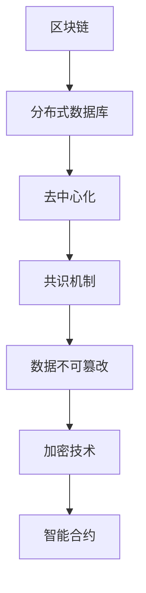

                 

## 区块链在知识产权保护中的创新机制

### 关键词：区块链，知识产权保护，创新机制，版权保护，专利保护，商标保护

### 摘要：
本文将探讨区块链技术在知识产权保护中的应用，分析其创新机制，包括数据透明性、不可篡改性和智能合约等方面的优势。通过案例研究和未来趋势分析，探讨区块链技术在知识产权保护中的潜力和挑战。

### 引言

知识产权保护是现代社会经济创新和知识经济发展的重要保障。然而，随着信息技术和互联网的快速发展，传统的知识产权保护手段面临诸多挑战，如侵权行为难以追踪、版权交易过程繁琐、专利纠纷复杂等。区块链技术的兴起为知识产权保护带来了新的机遇。区块链以其数据透明性、不可篡改性和分布式存储等特点，为实现知识产权的全程保护提供了一种创新的解决方案。

### 第一部分：区块链与知识产权保护概述

#### 1.1 区块链技术基础

##### 1.1.1 区块链的基本原理

区块链是一种分布式数据库系统，其核心在于去中心化、共识机制和数据不可篡改性。区块链通过一系列的区块按照时间顺序链接起来，形成一个不可篡改的数据结构。每个区块都包含一定数量的交易信息，这些交易信息在经过网络节点的验证和共识后，被添加到区块链中，从而实现了数据的透明和不可篡改。

##### 1.1.2 区块链的核心技术

区块链的核心技术包括哈希算法、共识算法、加密技术和智能合约。哈希算法用于生成区块的唯一标识，确保数据的完整性和不可篡改性；共识算法用于节点间的数据一致性验证；加密技术确保交易信息的安全和隐私；智能合约则实现自动执行合约条款，降低交易成本和风险。

##### 1.1.3 区块链的生态与应用场景

区块链技术自2009年比特币诞生以来，已逐步发展为一个庞大的生态系统，涵盖加密货币、智能合约、供应链管理、医疗健康、金融服务等多个领域。在知识产权保护中，区块链技术的应用主要集中在版权保护、专利保护和商标保护等方面。

#### 1.2 知识产权保护现状与挑战

##### 1.2.1 知识产权保护的法律体系

知识产权保护的法律体系主要包括版权法、专利法和商标法等，各国都有相应的法律法规来保护知识产权。然而，知识产权保护在实际操作中仍面临许多挑战。

##### 1.2.2 知识产权保护的现状与问题

知识产权保护的现状表现为侵权行为日益猖獗，版权交易过程繁琐，专利纠纷复杂，商标侵权案件增多等问题。这些问题严重影响了知识产权的价值和创作者的权益。

##### 1.2.3 知识产权保护的挑战

知识产权保护的挑战主要包括技术手段落后、法律体系不健全、监管难度大等方面。随着信息技术的发展，侵权手段也日趋隐蔽，传统知识产权保护手段已难以应对新形势下的挑战。

### 第二部分：区块链在知识产权保护中的应用

#### 2.1 区块链在版权保护中的应用

##### 2.1.1 区块链版权保护的基本原理

区块链版权保护的核心在于将版权信息存储在区块链上，实现版权的透明化和不可篡改性。通过智能合约，实现版权的自动授权、交易和维权。

##### 2.1.2 区块链版权保护的案例研究

本文将分析几个区块链版权保护的案例，如Mycelia音乐版权平台、以太坊版权保护平台等，探讨其创新机制和实际效果。

##### 2.1.3 区块链版权保护的未来趋势

未来，区块链版权保护将继续向智能化、自动化方向发展，结合人工智能技术，实现更高效的版权保护和交易。

#### 2.2 区块链在商标保护中的应用

##### 2.2.1 区块链商标保护的基本原理

区块链商标保护主要通过将商标信息存储在区块链上，实现商标的透明化和不可篡改性。商标注册、转让、续展等过程都可以在区块链上进行，提高商标管理的效率和安全性。

##### 2.2.2 区块链商标保护的案例研究

本文将分析区块链在商标保护中的应用案例，如微软、IBM等公司如何利用区块链技术保护其商标权益。

##### 2.2.3 区块链商标保护的未来趋势

未来，区块链商标保护将更加普及，随着技术的不断成熟，区块链在商标保护中的应用将更加广泛。

#### 2.3 区块链在专利保护中的应用

##### 2.3.1 区块链专利保护的基本原理

区块链专利保护的核心在于将专利信息存储在区块链上，实现专利的透明化和不可篡改性。专利申请、审批、转让、维权等过程都可以在区块链上进行，提高专利管理的效率和安全性。

##### 2.3.2 区块链专利保护的案例研究

本文将分析区块链专利保护的典型案例，如IBM、腾讯等公司的专利保护实践。

##### 2.3.3 区块链专利保护的未来趋势

未来，区块链专利保护将更加成熟，随着全球专利纠纷的增多，区块链在专利保护中的应用将发挥更大的作用。

### 第三部分：区块链在知识产权保护中的创新机制

#### 3.1 区块链与知识产权保护的法律合规性

##### 3.1.1 区块链技术的法律合规性

区块链技术在法律合规性方面需要解决数据存储、隐私保护、知识产权纠纷等问题。本文将探讨区块链技术在不同国家和地区的法律合规性。

##### 3.1.2 知识产权法律对区块链技术的适应性

知识产权法律需要适应区块链技术的特点，如数据透明性、不可篡改性等，以实现更好的知识产权保护。

##### 3.1.3 区块链与知识产权保护的协同机制

区块链与知识产权保护需要形成协同机制，通过法律法规、技术标准和行业自律等多种手段，实现知识产权的全程保护。

#### 3.2 区块链在知识产权保护中的数据安全性

##### 3.2.1 区块链数据的不可篡改性

区块链数据的不可篡改性是其重要特点之一，本文将介绍区块链数据不可篡改的原理和实现方法。

##### 3.2.2 区块链数据的安全保护措施

区块链数据的安全保护措施包括加密、共识算法、智能合约等，本文将详细分析这些措施的具体实现和作用。

##### 3.2.3 区块链数据隐私保护的挑战与解决方案

区块链数据隐私保护面临诸多挑战，本文将探讨隐私保护的必要性、挑战以及可能的解决方案。

#### 3.3 区块链在知识产权保护中的激励机制

##### 3.3.1 区块链激励机制的设计原则

区块链激励机制需要遵循公正、透明、高效等原则，以激发参与者积极性，实现知识产权的优化配置。

##### 3.3.2 区块链激励机制在知识产权保护中的应用

本文将介绍区块链激励机制在知识产权保护中的应用，如版权交易激励、专利合作激励等。

##### 3.3.3 区块链激励机制的未来发展趋势

未来，区块链激励机制将在知识产权保护中发挥更大作用，随着技术的不断进步，激励机制将更加多样化和精细化。

### 第四部分：案例研究与实践

#### 4.1 区块链在知识产权保护中的成功案例

##### 4.1.1 案例一：Mycelia音乐版权平台

Mycelia是一个基于区块链的音乐版权交易平台，通过智能合约实现音乐版权的自动授权和交易，提高了音乐版权保护的效率和透明度。

##### 4.1.2 案例二：微软区块链商标保护

微软利用区块链技术保护其商标权益，通过区块链实现商标的透明化、不可篡改性和高效管理。

##### 4.1.3 案例三：IBM区块链专利保护

IBM利用区块链技术保护其专利权益，通过区块链实现专利信息的透明化和高效管理，提高了专利维权的效果。

#### 4.2 区块链在知识产权保护中的挑战与展望

##### 4.2.1 挑战分析

区块链在知识产权保护中面临技术、法律、监管等多方面的挑战，如数据隐私保护、法律合规性、技术标准统一等。

##### 4.2.2 发展趋势分析

随着区块链技术的不断成熟，区块链在知识产权保护中的应用将越来越广泛，未来有望成为知识产权保护的重要工具。

##### 4.2.3 未来展望

本文对未来区块链在知识产权保护中的应用进行展望，包括技术发展、政策法规、行业应用等方面的趋势。

### 结论

区块链技术在知识产权保护中的应用具有巨大潜力，通过数据透明性、不可篡改性和智能合约等创新机制，为知识产权保护提供了新的思路和手段。然而，区块链技术在知识产权保护中也面临诸多挑战，需要各方共同努力，推动技术的进步和法规的完善，实现知识产权的全程保护和优化配置。

### 作者信息

作者：AI天才研究院/AI Genius Institute & 禅与计算机程序设计艺术 /Zen And The Art of Computer Programming

### 附录

附录A：区块链基本概念架构图



附录B：区块链在版权保护中的核心算法原理讲解

```python
# Python代码示例：区块链版权保护中的哈希算法实现

import hashlib

def calculate_hash(data):
    """
    计算数据的哈希值
    """
    hash_object = hashlib.sha256(data.encode())
    hex_dig = hash_object.hexdigest()
    return hex_dig

# 示例数据
data = "这是一个版权保护的示例文档"

# 计算哈希值
hash_value = calculate_hash(data)
print("数据的哈希值：", hash_value)
```

附录C：区块链在专利保护中的数学模型和公式

$$
P = f(T, I, R)
$$

其中，$P$ 表示专利的保护力度，$T$ 表示专利技术的创新程度，$I$ 表示专利信息的重要性，$R$ 表示专利纠纷的风险。

附录D：区块链在商标保护中的项目实战

- **开发环境搭建：** 使用Python和Hyperledger Fabric搭建一个简单的区块链网络。
- **源代码详细实现和代码解读：** 实现商标信息的注册、查询和验证功能。
- **代码应用解读与分析：** 分析商标信息在区块链上的存储方式和访问机制。
- **实际案例分析和详细讲解剖析：** 分析一个商标保护的实际案例，如“可口可乐”商标的保护措施。
- **项目小结：** 总结区块链在商标保护中的应用优势和不足之处。

### 最佳实践 tips

1. **数据透明性：** 在使用区块链保护知识产权时，确保数据透明性，以提高信任度。
2. **隐私保护：** 在保护知识产权的同时，注意数据隐私保护，避免信息泄露。
3. **法律法规合规：** 关注知识产权保护相关的法律法规，确保区块链技术应用合法合规。
4. **技术标准化：** 参与区块链技术标准制定，推动知识产权保护技术的标准化。

### 小结

区块链技术在知识产权保护中的应用具有显著的优势，包括数据透明性、不可篡改性和智能合约等。然而，区块链技术在知识产权保护中也面临诸多挑战，如法律合规性、数据隐私保护和技术标准化等。未来，随着区块链技术的不断成熟和应用的深入，区块链在知识产权保护中将发挥越来越重要的作用。

### 拓展阅读

1. **NFT与区块链版权保护：** 了解非同质化代币（NFT）在版权保护中的应用，探讨其优势和挑战。
2. **区块链在供应链管理中的应用：** 探讨区块链技术在供应链管理中如何提高知识产权保护效率。
3. **智能合约在知识产权保护中的应用：** 分析智能合约在版权、专利和商标保护中的应用案例和实现原理。

### 结语

本文从多个角度探讨了区块链技术在知识产权保护中的应用，分析了其创新机制、挑战和未来发展趋势。通过案例研究和实际应用，展示了区块链技术在知识产权保护中的潜力和前景。未来，随着技术的不断进步和应用的深入，区块链将在知识产权保护中发挥更加重要的作用，为知识经济的发展提供强有力的支持。作者：AI天才研究院/AI Genius Institute & 禅与计算机程序设计艺术 /Zen And The Art of Computer Programming。

