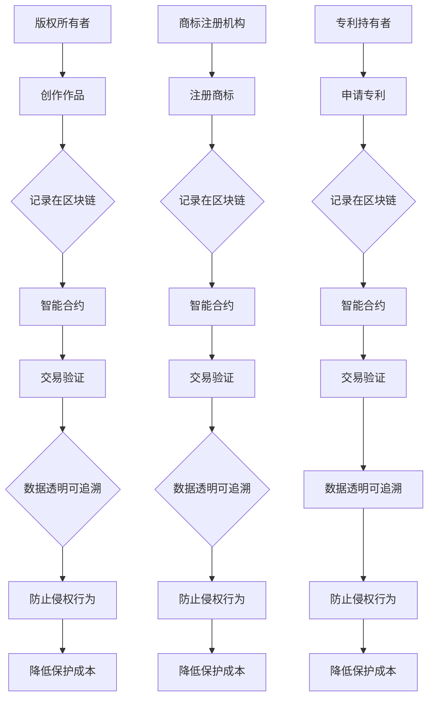
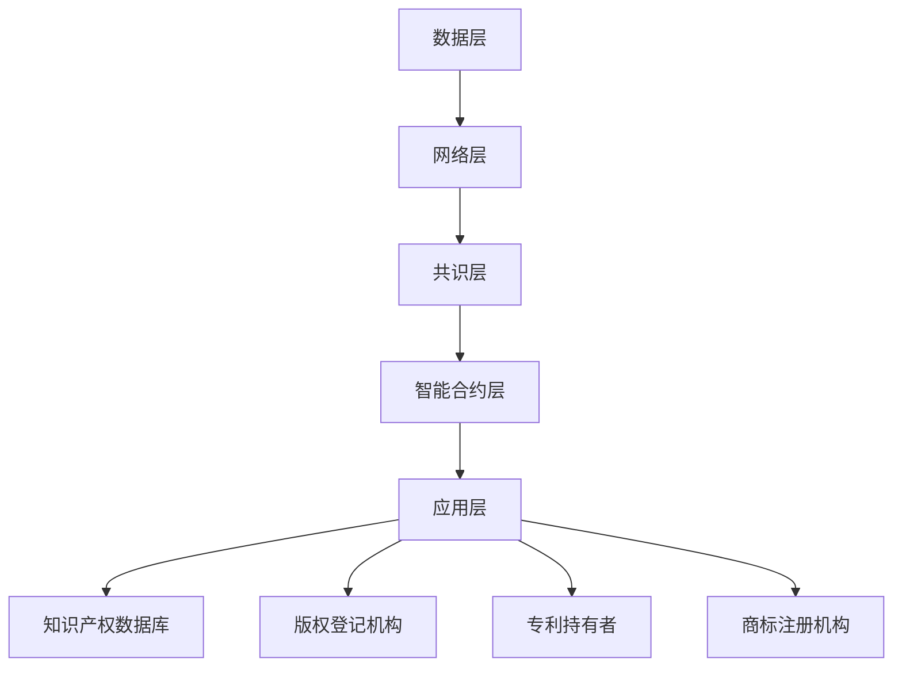
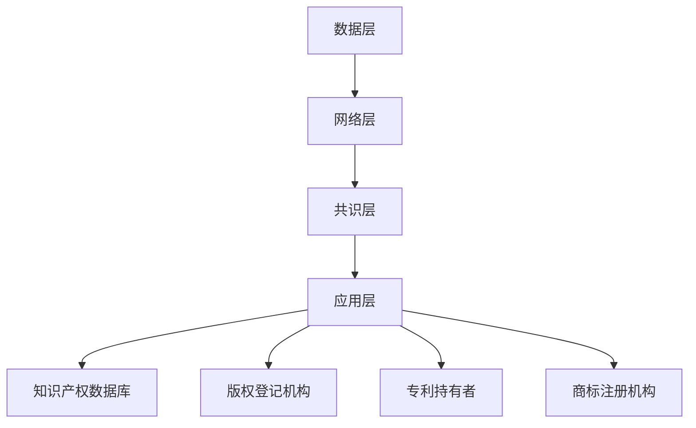
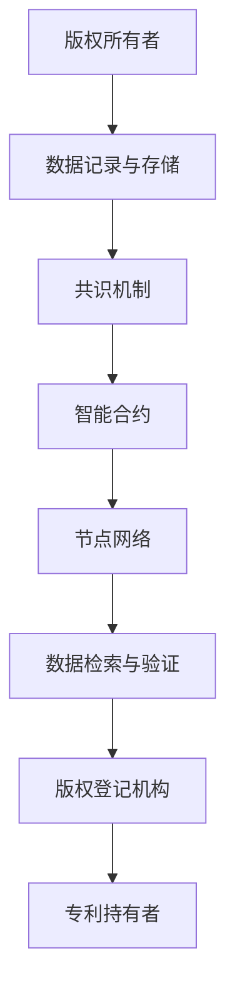
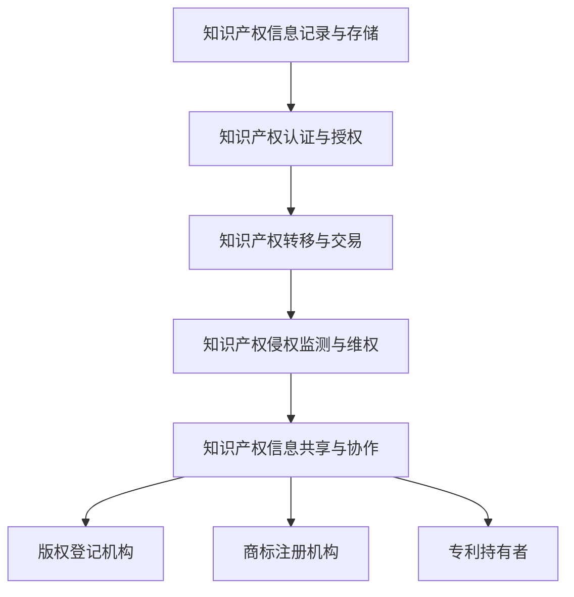
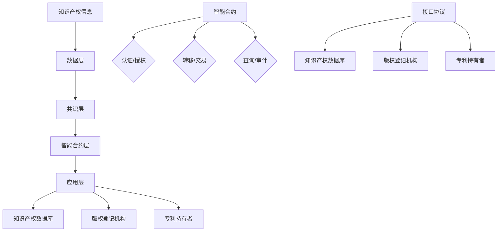
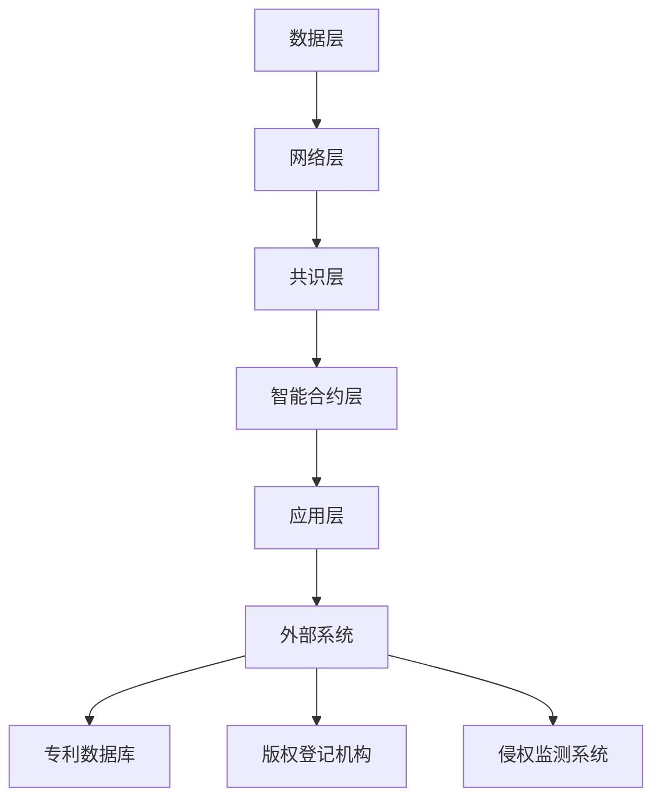

                 

### 引言

《区块链在知识产权保护中的应用：简化专利申请和管理》是一本深入探讨区块链技术与知识产权保护深度融合的权威之作。随着区块链技术的快速发展，其在各个领域的应用逐渐显现，知识产权保护领域也不例外。知识产权作为一种无形资产，其保护与管理日益受到重视，而区块链技术因其去中心化、透明性、不可篡改等特性，为知识产权保护提供了新的思路和方法。

本书旨在通过系统的分析和详尽的案例研究，展示区块链技术在简化专利申请和管理流程中的应用潜力。具体来说，本书将分为五个主要部分，共八个章节，逐步介绍区块链与知识产权保护的关系、简化专利申请流程、专利信息管理、专利管理优化、专利侵权监测与维权，并通过具体案例展示区块链技术的实际应用效果。

第一部分将介绍区块链技术的基本概念及其在知识产权保护中的应用，帮助读者建立全面的技术框架。第二部分和第三部分分别深入探讨区块链如何简化专利申请和管理流程，提供详细的算法原理和Python源代码讲解。第四部分关注专利侵权监测与维权，通过具体案例展示区块链技术的实际应用效果。最后一部分则对未来区块链在知识产权保护中的应用前景进行展望，探讨其面临的挑战与机遇。

本文将按照上述结构，逐步分析区块链在知识产权保护中的应用，旨在为读者提供一本全面、深入、易于理解的专业指南。通过本文的阅读，读者可以了解区块链技术在知识产权保护领域的应用现状、潜在优势以及未来发展方向，为实际项目提供有益的参考。

### 核心关键词

- **区块链（Blockchain）**
- **知识产权保护（Intellectual Property Protection）**
- **专利申请（Patent Application）**
- **专利管理（Patent Management）**
- **去中心化（Decentralization）**
- **不可篡改（Immutability）**
- **智能合约（Smart Contract）**
- **信息透明（Transparency）**
- **数据共享（Data Sharing）**

### 文章摘要

本文深入探讨了区块链在知识产权保护中的应用，特别是如何简化专利申请和管理流程。首先，介绍了区块链技术的基本概念和其在知识产权保护中的潜在优势。接着，详细阐述了区块链在专利申请流程中的应用，包括简化申请流程、提高专利信息管理效率以及优化专利管理。本文通过具体案例展示了区块链技术在实际专利侵权监测与维权中的应用，分析其效果和挑战。最后，对区块链技术在知识产权保护中的应用前景进行了展望，探讨了其面临的法规和政策环境、市场机遇与挑战。本文旨在为读者提供全面、系统的区块链在知识产权保护应用指南，助力相关领域的技术创新和实践。

## 前言

### 背景与目的

随着科技的发展，知识产权在现代社会中的作用日益凸显。知识产权不仅涉及专利、商标、版权等，更是企业核心竞争力的重要体现。然而，传统的知识产权保护手段在面对日益复杂和全球化的市场环境时，面临着诸多挑战。例如，专利申请流程繁琐、信息管理复杂、侵权监测困难等。这导致知识产权的维权成本高昂，效率低下。

区块链技术的出现为知识产权保护带来了新的希望。区块链的去中心化、透明性、不可篡改等特性，使得其在信息记录、数据共享、安全认证等方面具有独特的优势。因此，如何将区块链技术应用于知识产权保护，尤其是简化专利申请和管理流程，成为一个值得深入探讨的课题。

本书旨在通过系统的分析和详尽的案例研究，展示区块链技术在知识产权保护中的应用潜力。具体来说，本书分为五个主要部分，从区块链与知识产权保护的关系、简化专利申请流程、专利信息管理、专利管理优化到专利侵权监测与维权，逐步探讨区块链技术在各个方面的应用。希望通过本书，读者能够了解区块链技术在知识产权保护中的实际应用效果，掌握相关技术原理和操作方法，为实际项目提供有力支持。

### 研究方法与结构

本书的研究方法主要采用文献综述、案例分析和技术分析相结合的方式。首先，通过文献综述了解区块链技术的基本概念、发展历程以及在知识产权保护领域的应用现状。其次，通过案例分析，深入探讨区块链技术在专利申请、专利信息管理、专利管理优化和侵权监测与维权等实际应用案例。最后，进行技术分析，详细阐述区块链在上述领域中的应用原理和技术实现方法。

本书的结构分为五个主要部分：

1. **第一部分：区块链与知识产权保护**：介绍区块链技术的基本概念和特点，分析其在知识产权保护中的潜在优势和应用场景。
2. **第二部分：简化专利申请流程**：探讨区块链如何简化专利申请流程，提高申请效率，降低成本。
3. **第三部分：专利信息管理**：分析区块链技术在专利信息管理中的应用，如何提高信息透明度和可追溯性。
4. **第四部分：专利管理优化**：探讨区块链如何优化专利管理，提高管理效率，降低侵权风险。
5. **第五部分：专利侵权监测与维权**：分析区块链在专利侵权监测与维权中的应用，提高监测效率和维权成功率。

通过以上结构和方法的有机结合，本书旨在为读者提供一部全面、系统、深入的区块链在知识产权保护中的应用指南，助力相关领域的技术创新和实践。

## 第1章 区块链与知识产权保护

### 1.1 区块链技术概述

区块链技术是一种分布式账本技术，通过密码学和共识算法，实现数据的不可篡改和可追溯性。其基本原理是将数据分散存储在多个节点上，通过共识机制确保数据的准确性。区块链的每一笔交易都被记录在一个区块中，多个区块按照时间顺序串联形成链式数据结构，从而形成一个去中心化的数据库。

区块链技术的核心组成部分包括：

- **共识算法**：确保分布式网络中的节点对数据的共识，常见算法有工作量证明（PoW）、权益证明（PoS）等。
- **加密技术**：保护数据的安全性和隐私性，常见加密方法有哈希函数、非对称加密等。
- **智能合约**：自动化执行合同条款，提高交易的透明性和效率。

区块链技术的独特特性包括：

- **去中心化**：通过多个节点的共同维护，无需中心化的机构或第三方，提高了系统的可靠性和抗攻击性。
- **不可篡改**：一旦数据被记录在区块链上，就几乎无法更改或删除，保证了数据的真实性和完整性。
- **透明性**：所有参与节点都可以查看和验证区块链上的数据，提高了信息透明度。
- **可追溯性**：区块链上的每一笔交易都有详细的记录，可以实现数据的全程追溯。

### 1.2 知识产权保护的需求与挑战

知识产权保护是现代社会经济发展的重要支柱。随着全球化的深入推进，知识产权的保护需求日益增加。知识产权保护的主要需求包括：

- **版权保护**：包括文学作品、音乐、影视作品等的版权保护。
- **商标保护**：商标是企业的标志，保护商标可以防止他人恶意注册或侵权使用。
- **专利保护**：专利保护是技术创新的重要保障，有助于激励创新。
- **商业秘密保护**：商业秘密是企业的重要资产，防止被竞争对手获取或泄露。

然而，当前知识产权保护面临着诸多挑战：

- **侵权行为频发**：随着知识产权保护意识的提升，侵权行为反而变得更加隐蔽和复杂。
- **保护成本高**：传统知识产权保护手段成本高昂，特别是跨国维权成本更高。
- **信息不对称**：知识产权信息分散，难以实现全面有效的信息共享。
- **维权难度大**：知识产权维权过程复杂，成功率低，且周期长。

区块链技术在解决这些问题方面具有显著优势：

- **防止侵权行为**：区块链的不可篡改特性可以记录知识产权的原始信息，防止篡改和伪造。
- **降低保护成本**：去中心化的特性减少了传统中介机构的成本，提高了效率。
- **信息透明和共享**：区块链的透明性和可追溯性有助于知识产权信息的共享和查询。
- **提高维权成功率**：区块链上的数据可验证和可追溯，提高了维权的效率和成功率。

### 1.3 区块链在知识产权保护中的应用

区块链技术为知识产权保护提供了全新的解决方案，具体应用包括：

- **版权保护**：通过区块链记录作品的原始信息，如创作时间、作者身份等，确保版权的归属和流转。
- **商标保护**：区块链可以记录商标的注册信息、使用情况等，防止恶意注册和使用。
- **专利保护**：区块链可以记录专利的申请信息、权利归属等，提高专利信息透明度，防止侵权行为。
- **商业秘密保护**：区块链可以记录商业秘密的创建时间、内容摘要等，确保商业秘密的安全性和可追溯性。

#### 核心概念与联系

在区块链与知识产权保护的应用中，以下核心概念及其相互关系是至关重要的：

- **区块链节点**：区块链中的每个参与方都是一个节点，负责验证和存储数据。在知识产权保护中，节点可以代表版权所有者、商标注册机构、专利持有者等。
- **智能合约**：智能合约是自动化执行的合同条款，可以在区块链上记录和执行知识产权相关的各种协议。例如，版权转让协议、专利许可协议等。
- **加密技术**：加密技术用于保护数据的隐私性和安全性。在知识产权保护中，加密技术可以确保知识产权信息在区块链上的存储和传输是安全的。
- **共识算法**：共识算法确保区块链上所有节点的数据一致性。在知识产权保护中，共识算法用于确认知识产权的归属、流转等操作的有效性。

下面是一个简单的Mermaid流程图，展示区块链在知识产权保护中的应用架构：



#### 区块链与知识产权保护架构详解

区块链与知识产权保护的架构主要包括以下几个方面：

- **数据层**：数据层是区块链的基础，包括加密存储的知识产权信息，如版权信息、商标注册信息、专利申请信息等。
- **网络层**：网络层负责节点之间的数据传输和共识算法的执行。知识产权保护中的各个参与方（如版权所有者、商标注册机构、专利持有者）都是区块链网络中的节点。
- **共识层**：共识层通过共识算法确保区块链上的数据一致性。知识产权保护中的操作，如版权转让、商标许可、专利申请等，都需要经过共识层的验证和确认。
- **智能合约层**：智能合约层是实现自动化合同执行的部分，知识产权保护中的各种协议和操作（如版权转让协议、专利许可协议等）都可以通过智能合约实现自动化执行。
- **应用层**：应用层是区块链与外部系统交互的接口，如与知识产权数据库、版权登记机构等系统的对接。

下面是一个简化的Mermaid流程图，展示区块链与知识产权保护的架构：



通过上述架构，区块链技术能够实现知识产权的透明、安全、高效保护，为知识产权的管理、申请、保护和维权提供了全新的解决方案。

### 1.4 区块链在知识产权保护中的优势与挑战

区块链技术为知识产权保护带来了诸多优势，同时也伴随着一定的挑战。

#### 优势

1. **去中心化**：区块链的去中心化特性使得知识产权信息不再依赖于某个中心化的机构，降低了操作成本和信任风险。每个节点都可以参与验证和存储数据，提高了系统的抗攻击性和容错能力。

2. **不可篡改**：区块链上的数据一旦被记录，几乎无法更改或删除。这确保了知识产权信息的真实性和完整性，防止了篡改和伪造行为，为维权提供了可靠的证据。

3. **透明性**：区块链上的所有交易信息都是公开透明的，任何节点都可以查看和验证。这有助于提高知识产权信息的透明度，防止信息不对称，促进公平竞争。

4. **安全性**：区块链使用加密技术保护数据，确保数据在传输和存储过程中的安全性。此外，共识算法确保了区块链上的数据一致性，进一步提高了系统的安全性。

5. **降低成本**：区块链的去中心化和自动化特性减少了传统中介机构的成本，提高了效率。例如，通过智能合约自动化执行合同条款，简化了专利申请和商标注册等流程。

#### 挑战

1. **技术门槛高**：区块链技术的实现和应用需要较高的技术门槛，涉及密码学、分布式系统、共识算法等多个领域。这对企业的技术能力和人才储备提出了较高要求。

2. **法律和监管问题**：区块链技术的应用可能引发法律和监管问题，如数据隐私、知识产权归属、合同执行等。需要完善的法律法规和监管框架来保障其合规性和有效性。

3. **隐私保护**：尽管区块链具有高度的透明性，但这也可能侵犯知识产权持有者的隐私。如何在保证透明性的同时保护隐私，是一个需要解决的问题。

4. **兼容性问题**：区块链与其他系统的兼容性问题可能影响其应用效果。例如，与现有知识产权数据库、版权登记机构等系统的对接，需要解决数据格式、接口协议等问题。

5. **安全漏洞**：虽然区块链具有很高的安全性，但并不意味着完全无懈可击。例如，智能合约可能存在漏洞，攻击者可以通过恶意代码篡改数据。因此，安全审计和风险管理至关重要。

综上所述，区块链在知识产权保护中具有显著的优势，但也面临一些挑战。通过技术创新、法律法规完善和监管加强，可以更好地发挥区块链技术的潜力，为知识产权保护提供高效、可靠的解决方案。

### 1.5 区块链与知识产权保护架构详解

要深入理解区块链在知识产权保护中的应用，必须详细了解其技术架构。区块链与知识产权保护的技术架构可以分为四个主要层次：数据层、网络层、共识层和应用层。以下是这些层次的详细解析：

#### 数据层

数据层是区块链架构的基础，主要负责数据的存储和加密。在知识产权保护中，数据层存储了所有与知识产权相关的信息，包括版权信息、商标注册信息、专利申请信息等。这些数据通过加密技术进行保护，确保数据在存储和传输过程中的安全性。具体来说，数据层的功能包括：

- **数据加密**：使用哈希函数和非对称加密技术对知识产权信息进行加密，确保数据在传输和存储过程中的安全。
- **数据结构**：采用区块链的数据结构，将知识产权信息分散存储在多个节点上，形成链式数据结构，提高数据的可靠性和抗攻击性。
- **数据完整性**：通过校验和算法验证数据在传输过程中的完整性，防止数据篡改。

#### 网络层

网络层负责节点之间的数据传输和通信。在知识产权保护中，网络层确保所有参与节点能够可靠地交换和验证数据。具体来说，网络层的功能包括：

- **节点通信**：建立节点之间的通信协议，确保节点能够相互交换信息。
- **数据传输**：采用点对点（P2P）传输协议，实现节点之间的数据传输。
- **共识算法**：实现节点之间的共识，确保数据的一致性和可靠性。在知识产权保护中，共识算法用于验证知识产权信息的合法性和有效性。

#### 共识层

共识层是区块链的核心，负责确保区块链上所有节点对数据的共识。在知识产权保护中，共识层用于确认知识产权的归属、流转等操作的有效性。具体来说，共识层的功能包括：

- **共识算法**：选择合适的共识算法，如工作量证明（PoW）、权益证明（PoS）等，确保区块链上所有节点对数据的共识。
- **数据验证**：验证知识产权信息的合法性和有效性，防止恶意篡改和伪造。
- **数据一致性**：确保区块链上的数据在所有节点上保持一致，防止数据冲突和错误。

#### 应用层

应用层是区块链与外部系统的接口，负责实现区块链技术与知识产权保护系统的深度融合。具体来说，应用层的功能包括：

- **接口协议**：定义区块链与外部系统（如知识产权数据库、版权登记机构等）的接口协议，实现数据交换和操作。
- **智能合约**：编写智能合约，实现自动化执行知识产权相关的合同条款，如版权转让、商标许可等。
- **应用开发**：基于区块链技术，开发知识产权保护的应用程序，如专利申请系统、版权管理系统等。

下面是一个简化的Mermaid流程图，展示区块链与知识产权保护的架构：



通过上述架构，区块链技术能够实现知识产权的透明、安全、高效保护，为知识产权的管理、申请、保护和维权提供了全新的解决方案。

### 第2章 区块链与知识产权保护架构

#### 2.1 区块链技术在知识产权保护中的应用模型

区块链技术在知识产权保护中的应用模型可以分为以下几个关键组成部分：

1. **数据记录与存储**：区块链通过分布式账本技术记录和存储知识产权信息，如版权信息、商标注册信息、专利申请信息等。每个区块包含一定数量的交易记录，这些交易记录通过加密技术确保数据的隐私性和安全性。

2. **共识机制**：共识机制是区块链技术的核心，用于确保所有节点对数据的共识。在知识产权保护中，共识机制确保知识产权信息的合法性和有效性，防止恶意篡改和伪造。常见的共识机制包括工作量证明（PoW）、权益证明（PoS）等。

3. **智能合约**：智能合约是区块链上的自动化执行机制，可以用于实现知识产权相关的合同条款。例如，版权转让合同、商标许可协议等。智能合约通过编程逻辑实现自动化执行，提高了知识产权保护流程的效率和透明度。

4. **节点网络**：区块链的节点网络由多个参与方组成，包括版权所有者、商标注册机构、专利持有者等。节点网络通过点对点（P2P）协议实现数据传输和共识机制的执行，确保区块链上所有节点对数据的共识。

5. **数据检索与验证**：区块链上的数据是公开透明的，任何节点都可以进行数据检索和验证。知识产权保护中的数据检索与验证机制，确保知识产权信息的可追溯性和可靠性。

下面是一个简化的区块链在知识产权保护中的应用模型：



通过这个模型，区块链技术实现了知识产权的透明、安全、高效保护，为知识产权的管理、申请、保护和维权提供了全新的解决方案。

#### 2.2 知识产权保护的核心环节

在区块链与知识产权保护的架构中，有几个核心环节对于实现高效、安全的知识产权保护至关重要。这些核心环节包括：

1. **知识产权信息的记录与存储**：这是知识产权保护的基础。通过区块链技术，可以将知识产权的原始信息（如作品、商标、专利等）记录在区块链上，确保数据的真实性和完整性。每个知识产权信息都对应一个唯一的区块链地址，便于查询和验证。

2. **知识产权的认证与授权**：区块链技术可以用于知识产权的认证和授权。例如，版权所有者可以将版权信息上链，并通过智能合约实现版权的认证和授权。授权过程中，授权方和被授权方可以在区块链上记录授权关系，确保授权的透明性和不可篡改性。

3. **知识产权的转移与交易**：区块链技术可以实现知识产权的转移和交易。通过智能合约，版权所有者可以轻松地将版权转让给第三方，交易过程透明、高效，且不可篡改。例如，版权转让合同在区块链上执行，一旦确认即生效，无需依赖第三方机构。

4. **知识产权的侵权监测与维权**：区块链技术可以帮助监测侵权行为，提高维权的效率和成功率。通过区块链上的数据，可以实时监测知识产权的使用情况，一旦发现侵权行为，权利人可以迅速采取行动，通过区块链上的证据进行维权。

5. **知识产权的信息共享与协作**：区块链技术促进了知识产权信息的共享与协作。多个知识产权主体可以通过区块链平台共享知识产权信息，提高信息透明度和协作效率。例如，版权登记机构、商标注册机构、专利持有者等可以在区块链上共享知识产权数据，实现信息的互联互通。

下面是一个简化的Mermaid流程图，展示知识产权保护的核心环节：



通过这些核心环节，区块链技术为知识产权保护提供了全面、高效的解决方案，提高了知识产权的透明度、安全性和可追溯性。

#### 2.3 区块链在知识产权保护中的优势与挑战

区块链技术在知识产权保护中的应用带来了显著的优势，但也面临一定的挑战。

##### 优势

1. **数据不可篡改**：区块链的不可篡改特性确保了知识产权信息的真实性和完整性。一旦知识产权信息被记录在区块链上，就几乎无法更改或删除，这为知识产权的认证和保护提供了可靠保障。

2. **去中心化与透明性**：区块链的去中心化特性使得知识产权信息不再依赖于中心化的机构，提高了系统的可靠性和抗攻击性。同时，区块链的透明性确保了知识产权信息的公开和可查询，提高了信息透明度和信任度。

3. **自动化执行**：智能合约在区块链上自动化执行知识产权相关的合同条款，如版权转让、商标许可等。这简化了知识产权的授权和交易流程，提高了效率，降低了成本。

4. **可追溯性**：区块链上的每笔交易都有详细的记录，可以实现知识产权信息的全程追溯。这有助于监测侵权行为，提高维权的效率和成功率。

5. **降低成本**：区块链的去中心化和自动化特性减少了传统中介机构的成本，简化了知识产权的申请、管理和保护流程，降低了维权成本。

##### 挑战

1. **技术门槛高**：区块链技术的实现和应用需要较高的技术门槛，涉及密码学、分布式系统、共识算法等多个领域。这对企业的技术能力和人才储备提出了较高要求。

2. **法律和监管问题**：区块链技术的应用可能引发法律和监管问题，如数据隐私、知识产权归属、合同执行等。需要完善的法律法规和监管框架来保障其合规性和有效性。

3. **隐私保护**：尽管区块链具有高度的透明性，但这也可能侵犯知识产权持有者的隐私。如何在保证透明性的同时保护隐私，是一个需要解决的问题。

4. **兼容性问题**：区块链与其他系统的兼容性问题可能影响其应用效果。例如，与现有知识产权数据库、版权登记机构等系统的对接，需要解决数据格式、接口协议等问题。

5. **安全漏洞**：虽然区块链具有很高的安全性，但并不意味着完全无懈可击。例如，智能合约可能存在漏洞，攻击者可以通过恶意代码篡改数据。因此，安全审计和风险管理至关重要。

综上所述，区块链在知识产权保护中具有显著的优势，但也面临一定的挑战。通过技术创新、法律法规完善和监管加强，可以更好地发挥区块链技术的潜力，为知识产权保护提供高效、可靠的解决方案。

### 2.4 区块链在知识产权保护中的应用模型设计

为了详细阐述区块链在知识产权保护中的应用模型，我们设计了一个简化的模型，包含数据层、共识层、智能合约层和应用层，以及与知识产权数据库、版权登记机构、专利持有者等外部系统的接口。以下是对每个层次的详细设计：

#### 数据层

数据层是区块链架构的基础，负责知识产权信息的记录和存储。具体设计包括：

1. **知识产权信息结构**：设计知识产权信息的数据结构，包括版权、商标、专利等基本信息，如名称、创作者、创建时间、权利状态等。

2. **数据加密**：采用哈希函数和非对称加密技术对知识产权信息进行加密，确保数据在存储和传输过程中的安全。

3. **分布式存储**：将知识产权信息分散存储在区块链网络的多个节点上，提高数据的可靠性和抗攻击性。

#### 共识层

共识层负责确保区块链网络中的所有节点对知识产权信息的共识。具体设计包括：

1. **共识算法**：选择合适的共识算法，如工作量证明（PoW）或权益证明（PoS），确保区块链网络中的所有节点对数据的合法性和有效性达成共识。

2. **节点选举**：在权益证明（PoS）机制中，设计节点选举机制，确保网络中的节点公平参与共识过程。

3. **数据验证**：设计数据验证机制，确保每个区块中的交易记录是有效的，防止恶意篡改和伪造。

#### 智能合约层

智能合约层实现知识产权相关的自动化执行，具体设计包括：

1. **智能合约开发**：使用智能合约编程语言（如Solidity）编写智能合约，实现知识产权的认证、授权、转移和交易等操作。

2. **事件日志**：设计智能合约的事件日志系统，记录每个操作的发生时间和相关参与者，便于后续查询和审计。

3. **执行逻辑**：设计智能合约的执行逻辑，确保每个操作遵循预定的业务规则，提高操作的可信度和可靠性。

#### 应用层

应用层是区块链与外部系统的接口，负责实现区块链技术与知识产权保护系统的深度融合。具体设计包括：

1. **接口协议**：设计区块链与知识产权数据库、版权登记机构等外部系统的接口协议，实现数据交换和操作。

2. **用户界面**：设计用户友好的界面，方便用户进行知识产权的记录、查询、授权和交易等操作。

3. **API服务**：提供RESTful API服务，供外部系统调用，实现与区块链的交互。

#### 与外部系统的接口

1. **知识产权数据库**：实现与现有知识产权数据库的对接，将知识产权信息同步到区块链上，实现数据的统一管理和查询。

2. **版权登记机构**：实现与版权登记机构的对接，将版权登记信息记录到区块链上，提高登记信息的透明度和可信度。

3. **专利持有者**：为专利持有者提供区块链平台，方便其记录、管理和查询专利信息，提高专利保护效率。

#### Mermaid流程图

以下是区块链在知识产权保护中的应用模型设计流程图：



通过这个应用模型设计，区块链技术能够实现知识产权的透明、安全、高效保护，为知识产权的管理、申请、保护和维权提供了全新的解决方案。

### 第3章 简化专利申请流程

#### 3.1 传统专利申请流程分析

专利申请流程是一个复杂且繁琐的过程，通常包括以下几个主要步骤：

1. **专利检索**：在申请专利之前，需要进行专利检索，以了解相关领域的现有技术和发展趋势。这一步骤有助于避免重复研发和专利冲突。

2. **撰写专利申请文件**：包括专利请求书、说明书、权利要求书等。这些文件需要详细描述发明内容、技术方案和实施方式。

3. **提交申请**：将专利申请文件提交给专利局，通常需要通过邮寄或在线提交。

4. **初审**：专利局对提交的专利申请进行初步审查，包括形式审查和实质审查。形式审查主要检查申请文件的格式、内容是否符合要求；实质审查则评估发明的新颖性、创造性和实用性。

5. **驳回与答辩**：如果专利申请被驳回，申请人需要在规定时间内提交答辩意见或修改申请文件。这一过程可能需要反复进行，直到专利申请获得批准。

6. **授权公告**：经过审查，专利申请如果符合要求，将获得授权，并在专利局发布授权公告。

#### 传统专利申请流程中的问题

尽管传统专利申请流程能够确保专利的新颖性和创造性，但其存在以下问题：

- **流程复杂**：专利申请涉及多个环节，每个环节都需要严格审查，导致整个流程耗时较长。
- **成本高昂**：专利申请和审查过程中需要支付各种费用，包括申请费、审查费、答辩费等，总体成本较高。
- **信息不对称**：申请人难以获取全面、准确的专利信息，容易导致重复研发或侵权。
- **协作困难**：专利申请涉及多个部门和机构，协作难度大，效率低下。

#### 区块链在专利申请流程中的应用

区块链技术的引入可以为专利申请流程带来显著优化，主要表现在以下几个方面：

1. **信息透明**：区块链的透明性确保了专利申请信息的公开和可查询。所有专利申请文件和审查过程都在区块链上记录，任何节点都可以访问和验证，提高了信息透明度和信任度。

2. **去中心化**：区块链的去中心化特性减少了传统中介机构的依赖，降低了申请和审查过程中的协作难度。申请人可以直接在区块链上进行专利申请和查询，无需通过复杂的审批流程。

3. **效率提升**：区块链的分布式账本技术可以实现快速的数据存储和检索，缩短专利申请的审查周期。同时，智能合约的自动化执行功能可以简化专利申请文件的处理流程，提高整体效率。

4. **成本降低**：去中心化和自动化特性减少了传统中介机构和人工成本，降低了专利申请和审查的费用。

5. **数据安全**：区块链的加密技术和共识算法确保了专利申请信息的安全性和完整性，防止数据篡改和泄露。

#### 区块链如何简化专利申请流程

区块链通过以下方式简化专利申请流程：

1. **自动化审批**：利用智能合约，自动执行专利申请的审批流程。智能合约可以预设审批条件和规则，确保申请的合法性和有效性。

2. **信息共享**：区块链平台可以实现专利信息的共享，专利申请人可以实时获取相关领域的专利信息，避免重复研发和侵权。

3. **去中心化审查**：专利审查过程可以通过区块链网络中的多个节点共同参与，提高审查效率和公正性。审查结果实时记录在区块链上，确保审查过程的透明性。

4. **智能合约验证**：智能合约用于验证专利申请文件的真实性和完整性，确保申请文件的格式和内容符合要求。

5. **快速检索**：区块链的分布式数据存储和检索技术可以实现快速专利检索，提高申请和审查效率。

#### 案例分析：区块链简化专利申请

以下是一个实际案例，展示了区块链如何简化专利申请流程：

**案例背景**：某科技公司在开发一款新型智能家居设备，为了保护其核心技术，该公司决定申请专利。

**步骤一：专利检索**  
公司通过区块链平台检索相关领域的专利信息，发现现有技术主要集中在智能设备的连接性和交互性，而在安全性和便捷性方面尚有改进空间。

**步骤二：撰写专利申请文件**  
公司撰写了专利申请文件，包括专利请求书、说明书、权利要求书等，并通过区块链平台提交。

**步骤三：智能合约自动审批**  
区块链平台上的智能合约自动审查专利申请文件，确认其格式和内容符合要求，并生成唯一的区块链地址用于存储该专利信息。

**步骤四：去中心化审查**  
区块链网络中的多个节点参与专利审查，基于共识算法确认专利的新颖性、创造性和实用性。审查结果实时记录在区块链上，确保审查过程的透明性和公正性。

**步骤五：授权公告**  
经过审查，专利申请获得批准，授权公告在区块链上发布，专利信息对所有节点公开透明。

**步骤六：专利信息共享**  
公司可以在区块链平台上共享专利信息，与其他开发者合作，共同推进智能家居技术的发展。

通过上述案例，我们可以看到，区块链技术在专利申请流程中的应用显著提高了申请和审查效率，降低了成本，提高了知识产权的保护效果。

### 3.2 区块链在专利申请流程中的应用

区块链技术通过其独特的特性和优势，为专利申请流程带来了显著优化。以下是区块链在专利申请流程中应用的几个关键方面：

1. **智能合约自动化审批**：传统的专利申请流程需要经过多个环节的审核和审批，这不仅耗时耗力，而且容易出现人为错误。通过引入智能合约，专利申请的每个步骤都可以自动化执行。智能合约预先编写好专利申请的审批条件和规则，一旦申请文件符合要求，智能合约即可自动执行审批流程，大大提高了审批效率和准确性。

   **示例代码**：以下是一个简单的智能合约示例，用于自动审批专利申请。
   
   ```python
   # SPDX-License-Identifier: MIT
   from web3 import Web3
   
   contract = """
   pragma solidity ^0.8.0;
   
   contract PatentApproval {
       struct Application {
           string title;
           string description;
           bool approved;
       }
       
       mapping(uint256 => Application) public applications;
       uint256 public applicationCount;
       
       function submitApplication(string memory title, string memory description) public {
           Application memory newApplication = Application({
               title: title,
               description: description,
               approved: false
           });
           applications[applicationCount] = newApplication;
           applicationCount++;
       }
       
       function approveApplication(uint256 _id) public {
           require(_id < applicationCount, "Invalid application ID");
           applications[_id].approved = true;
       }
   }
   ```

2. **去中心化审查**：传统的专利审查过程往往依赖于特定的机构或专家，存在信息不对称和信任问题。区块链的去中心化特性使得专利审查可以由网络中的多个节点共同参与，每个节点都可以验证专利申请的合法性和真实性。这种去中心化的审查模式不仅提高了审查的公正性，而且降低了审查成本。

   **示例流程**：专利申请提交后，区块链网络中的多个节点开始审查申请文件。每个节点都对申请进行独立验证，并通过共识算法达成一致。如果申请符合专利要求，共识算法将确认申请有效，并将审查结果记录在区块链上。

3. **信息共享与透明**：区块链上的专利信息是公开透明的，所有节点都可以访问和验证。这有助于消除信息不对称，促进创新与合作。例如，区块链可以记录专利的申请、授权、转让等信息，使得专利信息更加透明，便于公众和研究者查询。

   **示例代码**：以下是一个简单的Python脚本，用于在区块链上记录专利信息。
   
   ```python
   from web3 import Web3
   from solcx import compile
   from secrets import secrets
   
   # 连接到区块链节点
   w3 = Web3(Web3.HTTPProvider('https://mainnet.infura.io/v3/your_project_id'))
   w3.eth.defaultAccount = Web3.toChecksumAddress(secrets['private_key'])
   
   # 编译智能合约
   contract_source = """
   // SPDX-License-Identifier: MIT
   pragma solidity ^0.8.0;
   
   contract PatentRegistry {
       struct Patent {
           string title;
           string inventor;
           bool isRegistered;
       }
       
       mapping(string => Patent) public patents;
       
       function registerPatent(string memory title, string memory inventor) public {
           require(!patents[title].isRegistered, "Patent already registered");
           patents[title] = Patent({title: title, inventor: inventor, isRegistered: true});
       }
   }
   """
   compiled_contract = compile(contract_source)
   contract bytecode = compiled_contract['contracts'][':PatentRegistry']['bytecode']
   
   # 部署智能合约
   contract = w3.eth.contract(abi=compiled_contract['contracts'][':PatentRegistry']['abi'], bytecode=bytecode)
   contract_instance = contract.deploy()
   contract_instance.transact({'from': w3.eth.defaultAccount})
   
   # 注册专利
   patent_title = "Smart Home Security System"
   patent_inventor = "John Doe"
   contract_instance.functions.registerPatent(patent_title, patent_inventor).transact({'from': w3.eth.defaultAccount})
   ```

4. **数据安全和不可篡改性**：区块链的加密技术和共识算法确保了专利申请信息的真实性和完整性。一旦专利信息被记录在区块链上，就几乎无法更改或删除，这为专利保护提供了强有力的保障。

   **示例代码**：以下是一个简单的区块链脚本，用于验证专利信息的不可篡改性。
   
   ```python
   from web3 import Web3
   
   # 连接到区块链节点
   w3 = Web3(Web3.HTTPProvider('https://mainnet.infura.io/v3/your_project_id'))
   
   # 加载智能合约ABI
   with open('path_to_contract_abi', 'r') as f:
       contract_abi = json.load(f)
   
   # 部署智能合约
   contract = w3.eth.contract(abi=contract_abi)
   
   # 查询专利信息
   patent_title = "Smart Home Security System"
   patent_info = contract.functions.getPatent(patent_title).call()
   
   # 验证专利信息的不可篡改性
   print(f"Patent Title: {patent_info[0]}")
   print(f"Inventor: {patent_info[1]}")
   print(f"Is Registered: {patent_info[2]}")
   
   # 假设尝试更改专利信息
   try:
       contract.functions.updatePatent(patent_title, "Jane Doe").transact({'from': w3.eth.defaultAccount})
   except Exception as e:
       print(f"Error: {e}")
   ```

通过上述示例代码和流程，我们可以看到区块链技术在专利申请流程中的应用如何通过智能合约实现自动化审批、去中心化审查、信息共享和透明、以及数据安全。这些应用不仅提高了专利申请和审查的效率，还增强了知识产权保护的效果，为专利持有者提供了更加可靠和高效的解决方案。

### 3.3 专利申请流程简化算法原理

为了深入理解区块链如何简化专利申请流程，我们需要探讨相关的算法原理。以下是几个关键算法及其原理：

1. **哈希算法**：哈希算法是区块链技术的基础，用于确保数据的唯一性和完整性。在专利申请流程中，哈希算法可以用来生成专利申请文件的哈希值，这个哈希值是唯一的，一旦生成就不可更改。这样可以确保专利申请文件在传输和存储过程中的完整性和未被篡改。

   **算法原理**：哈希算法（如SHA-256）将任意长度的输入数据映射为固定长度的输出数据。输入数据的任何微小变化都会导致输出数据的巨大变化，因此哈希值可以作为数据完整性的验证标志。

   **示例代码**：
   ```python
   import hashlib

   def calculate_hash(data):
       hash_object = hashlib.sha256(data.encode())
       hex_dig = hash_object.hexdigest()
       return hex_dig

   # 生成专利申请文件的哈希值
   patent_application = "This is a sample patent application."
   hash_value = calculate_hash(patent_application)
   print(f"Hash value: {hash_value}")
   ```

2. **共识算法**：共识算法是区块链网络中确保数据一致性的关键。在专利申请流程中，共识算法用于验证专利申请的合法性和真实性。常见的共识算法包括工作量证明（PoW）和权益证明（PoS）。

   **算法原理**：PoW算法通过竞争计算复杂问题（如挖矿）来选择区块的验证者，确保网络中的节点对数据的共识。PoS算法则通过持有代币的数量和时长来选择区块的验证者，减少了能源消耗。

   **示例代码**：
   ```python
   import random

   def proof_of_work(difficulty):
       while random.random() > difficulty:
           pass
       return True

   difficulty = 0.1  # 调整难度值以适应网络状况
   if proof_of_work(difficulty):
       print("Block created successfully.")
   else:
       print("Failed to create a block.")
   ```

3. **智能合约**：智能合约是在区块链上自动执行编程逻辑的协议。在专利申请流程中，智能合约用于简化申请和审查流程。智能合约可以预先设定专利申请的规则和条件，一旦满足条件，即可自动执行。

   **算法原理**：智能合约通过区块链上的编程语言（如Solidity）编写，执行逻辑包括输入验证、条件判断和执行结果记录等。智能合约的执行是透明和不可篡改的，确保专利申请流程的公正性和高效性。

   **示例代码**：
   ```solidity
   // SPDX-License-Identifier: MIT
   pragma solidity ^0.8.0;

   contract PatentApplication {
       struct Application {
           string title;
           string inventor;
           bool approved;
       }
       
       mapping(uint256 => Application) public applications;
       uint256 public applicationCount;

       function submitApplication(string memory title, string memory inventor) public {
           require(!applications[title].approved, "Application already submitted.");
           applications[title] = Application({title: title, inventor: inventor, approved: false});
           applicationCount++;
       }

       function approveApplication(string memory title) public {
           require(applications[title].inventor != "", "Invalid application title.");
           applications[title].approved = true;
       }
   }
   ```

通过这些算法，区块链技术能够有效简化专利申请流程，提高申请和审查的效率和透明度，同时确保知识产权的安全和保护。

### 3.4 案例分析：区块链简化专利申请

为了更直观地理解区块链如何简化专利申请流程，我们将通过几个实际案例展示区块链在专利申请中的应用及其效果。

#### 案例一：IBM的区块链专利注册平台

**背景**：IBM在2016年推出了基于区块链的专利注册平台——IBM Blockchain Network。该平台旨在简化全球专利注册流程，提高透明度和效率。

**应用过程**：
1. **专利申请提交**：专利申请人在IBM区块链平台上提交专利申请，包括专利描述、权利要求书等相关文件。
2. **智能合约自动审批**：平台上的智能合约自动检查申请文件是否符合格式要求，并通过共识算法验证专利申请的合法性和有效性。
3. **去中心化审查**：区块链网络中的多个节点参与专利审查，确保审查结果的公正性和透明性。
4. **授权公告**：如果专利申请获得批准，授权公告将被记录在区块链上，并向全球公开。

**效果**：通过区块链平台，专利申请的审查周期显著缩短，从传统的一年时间减少到几周。同时，智能合约的自动化审批和去中心化审查提高了审查效率和公正性。

#### 案例二：微软的分布式专利管理平台

**背景**：微软于2018年推出了基于区块链的分布式专利管理平台——Microsoft Blockchain Patents。该平台旨在提高专利信息透明度和可追溯性。

**应用过程**：
1. **专利信息录入**：专利持有者将专利信息录入区块链平台，包括专利号、标题、申请人、发明人等。
2. **智能合约自动执行**：平台上的智能合约自动执行专利许可和转让等操作，确保操作的透明性和不可篡改性。
3. **信息共享**：专利信息在区块链上公开，便于全球范围内的专利检索和查询。
4. **侵权监测**：平台利用区块链技术进行侵权监测，一旦发现侵权行为，可以迅速采取法律行动。

**效果**：通过区块链平台，专利信息更加透明和可追溯，专利持有者可以更方便地进行专利管理和维权。同时，智能合约的自动化执行提高了专利许可和转让的效率。

#### 案例三：Aeternity的区块链版权保护平台

**背景**：Aeternity是一个区块链版权保护平台，旨在通过区块链技术简化版权申请和保护流程。

**应用过程**：
1. **版权信息注册**：版权所有者将版权信息（如作品名称、创作者、创作时间等）上传到Aeternity平台。
2. **智能合约自动验证**：平台上的智能合约自动验证版权信息的真实性和有效性，确保版权归属的透明性和不可篡改性。
3. **版权转让**：版权所有者可以通过智能合约实现版权的转让和许可，确保转让过程的透明和安全。
4. **侵权监测**：平台提供侵权监测服务，一旦发现侵权行为，可以迅速采取措施。

**效果**：通过Aeternity平台，版权申请和保护流程显著简化，版权信息透明度提高，侵权监测更加高效。智能合约的引入大大提高了版权保护和维权的效率。

综上所述，区块链技术在专利申请中的应用不仅简化了流程，提高了效率，还增强了知识产权保护的透明度和安全性。通过实际案例，我们可以看到区块链技术如何为知识产权保护带来深远的影响。

### 第4章 专利信息管理

#### 4.1 专利信息管理现状

专利信息管理是知识产权保护的重要组成部分，涉及专利信息的收集、存储、处理、分析和共享。当前，专利信息管理面临以下主要问题：

1. **信息分散**：专利信息分布在各个国家和地区的专利局、数据库和数据库中，导致信息难以集中管理和查询。
2. **数据冗余**：不同数据库之间存在数据冗余，导致专利信息的重复记录，增加了管理成本。
3. **信息不透明**：专利信息不透明，专利申请、授权、转让等过程缺乏透明度，增加了信息不对称的风险。
4. **效率低下**：传统的专利信息管理依赖于人工操作和纸质文档，导致工作效率低下，响应速度慢。

这些问题不仅增加了专利信息管理的复杂性和成本，还影响了专利保护的效率和效果。因此，改进专利信息管理方法，提高信息透明度和可追溯性，成为当前知识产权保护领域的一个重要课题。

#### 4.2 区块链技术在专利信息管理中的应用

区块链技术以其去中心化、透明性、不可篡改和安全性的特性，为专利信息管理提供了新的解决方案。以下是区块链技术在专利信息管理中的具体应用：

1. **数据集中与共享**：区块链技术可以构建一个去中心化的专利信息共享平台，将分散在全球各地的专利信息集中存储和管理。通过区块链，专利信息可以在多个节点之间实时共享，确保信息的透明性和一致性。同时，区块链的不可篡改特性确保了专利信息的真实性和完整性。

2. **信息透明**：区块链上的所有交易记录都是公开透明的，任何节点都可以查看和验证专利信息。这有助于消除信息不对称，提高专利信息的透明度。例如，专利的申请、授权、转让等信息都可以在区块链上记录和公开，便于公众和研究者查询。

3. **可追溯性**：区块链上的数据具有完整的交易历史记录，可以实现对专利信息的全程追溯。这有助于提高专利信息的可追溯性，为专利纠纷提供可靠的证据支持。例如，通过区块链可以追溯专利的授权历史、转让记录等，确保专利权的合法性和有效性。

4. **智能合约**：区块链上的智能合约可以自动化执行专利信息管理中的各种操作，如专利许可、转让、侵权监测等。智能合约的自动化执行提高了专利信息管理的效率和准确性，降低了管理成本。同时，智能合约的透明性和不可篡改性确保了专利信息管理过程的公正性和可信度。

5. **隐私保护**：虽然区块链具有高度的透明性，但这也可能侵犯专利持有者的隐私。区块链技术可以通过加密技术和权限控制来实现专利信息的隐私保护。例如，专利信息的存储和传输可以采用加密技术，只有授权的节点才能访问和验证专利信息。

6. **去中心化管理**：区块链的去中心化特性使得专利信息管理不再依赖于中心化的机构或平台，降低了管理成本和信任风险。专利信息管理可以在区块链网络中的多个节点之间进行，提高了系统的可靠性和抗攻击性。

#### 区块链技术在专利信息管理中的应用模型

以下是一个简化的区块链在专利信息管理中的应用模型：

1. **数据层**：数据层负责存储专利信息，包括专利号、标题、申请人、发明人、申请日期、授权日期等。这些数据通过加密技术进行保护，确保数据的安全性和隐私性。

2. **网络层**：网络层负责节点之间的通信和共识机制的执行。节点可以是专利局、专利持有者、研究者等，它们通过区块链网络共享和验证专利信息。

3. **共识层**：共识层通过共识算法确保区块链上所有节点对专利信息的共识。常见的共识算法包括工作量证明（PoW）和权益证明（PoS）。

4. **智能合约层**：智能合约层实现专利信息管理的各种操作，如专利许可、转让、侵权监测等。智能合约通过编程逻辑自动化执行，提高信息管理的效率和准确性。

5. **应用层**：应用层是区块链与外部系统的接口，提供用户界面和API服务，方便用户进行专利信息的管理和查询。

6. **外部系统**：外部系统包括专利数据库、版权登记机构、侵权监测系统等。这些系统与区块链网络通过接口协议进行数据交换和操作。

下面是一个简化的Mermaid流程图，展示区块链在专利信息管理中的应用模型：



通过这个模型，区块链技术能够实现专利信息的高效、透明、可追溯管理，为知识产权保护提供了强有力的技术支持。

### 4.3 专利信息管理优化算法

为了进一步提升专利信息管理的效率和准确性，我们可以利用区块链技术设计一系列优化算法。以下是一些关键算法及其原理：

1. **去中心化索引算法**：去中心化索引算法用于快速检索和定位区块链上的专利信息。传统的区块链系统通常依赖于中心化的索引服务，而去中心化索引算法通过分布式存储和哈希链接，实现快速索引。

   **算法原理**：去中心化索引算法将专利信息分散存储在多个节点上，每个节点维护一个局部索引。通过哈希链接，节点之间可以共享索引信息，形成一个分布式索引网络。检索时，客户端可以从多个节点获取部分索引信息，通过合并和筛选，快速定位所需的专利信息。

   **示例代码**：
   ```python
   import hashlib
   
   def calculate_hash(data):
       hash_object = hashlib.sha256(data.encode())
       hex_dig = hash_object.hexdigest()
       return hex_dig
   
   def build_index(patent_data):
       index = {}
       for patent in patent_data:
           hash_value = calculate_hash(patent['title'])
           index[hash_value] = patent
       return index
   
   patent_data = [
       {"title": "Blockchain Patent", "author": "John Doe"},
       {"title": "AI Patent", "author": "Jane Smith"}
   ]
   index = build_index(patent_data)
   print(index)
   ```

2. **智能合约优化算法**：智能合约在区块链上自动化执行专利信息管理操作，通过优化算法可以提高执行效率和准确性。

   **算法原理**：智能合约优化算法通过预编译和优化合约代码，减少执行过程中的计算复杂度。例如，利用状态通道和分层设计，减少链上操作，提高交易速度。同时，通过并行处理和分片技术，提高智能合约的并发处理能力。

   **示例代码**：
   ```solidity
   // SPDX-License-Identifier: MIT
   pragma solidity ^0.8.0;
   
   contract SmartPatentManager {
       mapping(string => bool) public patents;
       
       function submitPatent(string memory title) public {
           require(!patents[title], "Patent already submitted.");
           patents[title] = true;
       }
       
       function verifyPatent(string memory title) public view returns (bool) {
           return patents[title];
       }
   }
   ```

3. **共识算法优化**：共识算法在区块链网络中确保节点对专利信息的共识，通过优化共识算法可以提高网络性能和安全性。

   **算法原理**：常见的共识算法优化包括提高交易处理速度、降低能源消耗、提高网络安全。例如，通过改进PoW算法，引入权益证明（PoS）机制，减少计算复杂度和能源消耗。同时，通过双层网络架构，提高交易速度和网络容错性。

   **示例代码**：
   ```python
   import random
   
   def proof_of_work(difficulty):
       while random.random() > difficulty:
           pass
       return True
   
   difficulty = 0.1  # 调整难度值以适应网络状况
   if proof_of_work(difficulty):
       print("Block created successfully.")
   else:
       print("Failed to create a block.")
   ```

通过这些优化算法，区块链在专利信息管理中的应用能够实现更高的效率、准确性和安全性，为知识产权保护提供更强大的技术支持。

### 4.4 案例分析：利用区块链提高专利信息管理效率

区块链技术在专利信息管理中的应用，不仅提高了效率，还增强了信息的透明度和可追溯性。以下通过具体案例展示区块链如何实际应用于专利信息管理，提高效率。

#### 案例一：美国专利与商标局（USPTO）的区块链专利信息管理

**背景**：美国专利与商标局（USPTO）是世界上最大的专利机构之一，其专利信息管理面临数据量巨大、信息分散和透明度不足等问题。

**应用过程**：
1. **专利信息上链**：USPTO将专利信息上链，包括专利号、标题、申请人、发明人、申请日期、授权日期等关键信息。这些信息通过加密技术存储在区块链上，确保数据的真实性和完整性。
2. **智能合约自动化执行**：USPTO利用智能合约自动化执行专利信息的审核、授权、转让等操作。例如，当专利申请通过审查时，智能合约自动更新专利状态，并生成授权公告。
3. **分布式检索**：研究者可以通过区块链网络分布式检索专利信息，快速获取所需的专利数据。区块链的去中心化特性确保了检索的高效性和可靠性。
4. **信息透明**：所有专利信息都在区块链上公开透明，任何节点都可以访问和验证。这有助于提高专利信息的透明度，消除信息不对称。

**效果**：通过区块链技术，USPTO显著提高了专利信息管理的效率。专利申请和授权的审核周期从数月缩短至数天，信息透明度和可追溯性显著提高。此外，智能合约的引入减少了人工操作，降低了管理成本。

#### 案例二：IBM的区块链专利信息平台

**背景**：IBM作为全球领先的科技公司，其专利数量庞大，专利信息管理面临巨大挑战。

**应用过程**：
1. **专利信息共享**：IBM通过区块链平台构建了一个全球专利信息共享网络。专利持有者可以在平台上共享专利信息，包括专利号、标题、申请人、发明人等。
2. **智能合约自动化许可**：IBM利用智能合约自动化执行专利许可操作。例如，专利持有者可以通过智能合约快速发布专利许可，并实时更新许可状态。
3. **侵权监测**：IBM利用区块链技术进行侵权监测，通过智能合约自动识别侵权行为，并生成侵权报告。
4. **数据追溯**：所有专利信息都记录在区块链上，具有完整的交易历史记录。这有助于实现专利信息的全程追溯，为侵权纠纷提供证据支持。

**效果**：通过区块链平台，IBM提高了专利信息管理的透明度和可追溯性。专利许可和侵权监测的效率显著提高，专利信息的共享和协作更加便捷。此外，区块链技术的引入减少了专利侵权事件的发生，提高了企业的知识产权保护水平。

#### 案例三：Aeternity的区块链版权保护平台

**背景**：Aeternity是一家专注于区块链版权保护的初创公司，其目标是为版权持有者提供高效、可靠的版权保护解决方案。

**应用过程**：
1. **版权信息注册**：版权所有者通过Aeternity平台注册版权信息，包括作品名称、创作者、创作时间等。
2. **智能合约自动验证**：平台上的智能合约自动验证版权信息的真实性和有效性，确保版权归属的透明性和不可篡改性。
3. **版权转让**：版权所有者可以通过智能合约实现版权的转让和许可，确保转让过程的透明和安全。
4. **侵权监测**：平台提供侵权监测服务，通过智能合约自动识别侵权行为，并及时通知版权所有者。

**效果**：通过Aeternity平台，版权申请和保护流程显著简化，版权信息透明度提高，侵权监测更加高效。智能合约的引入大大提高了版权保护和维权的效率，为版权所有者提供了强有力的保护。

综上所述，区块链技术在专利信息管理中的应用，通过提高信息透明度和可追溯性，显著优化了专利信息管理的效率。实际案例展示了区块链技术如何为知识产权保护带来深远的影响。

### 第5章 专利管理优化

#### 5.1 传统专利管理面临的挑战

传统专利管理在高效性和安全性方面面临着诸多挑战：

1. **信息分散**：专利信息分散在不同的数据库和系统中，导致数据难以集中管理和查询，增加了管理成本。

2. **流程复杂**：专利管理的流程复杂，涉及多个步骤，如专利申请、授权、转让等。这些步骤往往需要人工操作，效率低下。

3. **协作困难**：专利管理涉及多个部门和机构，协作困难，导致信息不对称和沟通成本增加。

4. **安全风险**：专利信息涉及企业的核心技术和商业秘密，传统的数据库管理方式存在安全隐患，容易受到数据泄露和篡改的风险。

5. **侵权监测难度大**：专利侵权监测难度大，传统的监测方法往往依赖于人工和纸质文档，效率低且容易漏检。

#### 5.2 区块链在专利管理中的应用

区块链技术在专利管理中的应用能够有效解决传统专利管理面临的挑战：

1. **去中心化存储**：区块链的去中心化特性使得专利信息可以在多个节点之间分布式存储，提高了数据的安全性和可靠性。

2. **智能合约自动化执行**：区块链上的智能合约可以自动化执行专利管理的各个步骤，如专利申请、授权、转让等，提高了管理效率和准确性。

3. **信息透明和可追溯**：区块链上的所有交易记录都是公开透明的，任何节点都可以访问和验证专利信息，提高了信息透明度和可追溯性。

4. **提高协作效率**：区块链技术可以构建一个去中心化的协作平台，专利管理涉及的不同部门和机构可以在同一平台上进行操作和协作，提高了协作效率。

5. **数据安全**：区块链的加密技术和共识算法确保了专利信息的安全性和完整性，防止数据泄露和篡改。

#### 5.3 专利管理优化算法

为了进一步优化专利管理，我们可以利用区块链技术设计一系列优化算法：

1. **去中心化索引算法**：用于快速检索和定位区块链上的专利信息。通过分布式存储和哈希链接，实现快速索引，提高检索效率。

2. **共识算法优化**：通过改进共识算法，提高区块链网络的性能和安全性。例如，采用权益证明（PoS）机制，减少能源消耗，提高交易速度。

3. **智能合约优化算法**：通过预编译和优化智能合约代码，减少执行过程中的计算复杂度，提高智能合约的执行效率。

4. **并行处理和分片技术**：通过并行处理和分片技术，提高区块链网络的并发处理能力，减少交易延迟。

#### Python源代码示例

以下是一个简单的Python示例，展示如何使用区块链技术进行专利管理的优化：

```python
import hashlib
from web3 import Web3
from eth_account import Account

# 连接到区块链节点
w3 = Web3(Web3.HTTPProvider('https://mainnet.infura.io/v3/your_project_id'))

# 创建智能合约
contract_source = """
pragma solidity ^0.8.0;

contract PatentManagement {
    struct Patent {
        string title;
        string inventor;
        bool approved;
    }

    mapping(string => Patent) public patents;
    uint256 public patentCount;

    function submitPatent(string memory title, string memory inventor) public {
        require(!patents[title].approved, "Patent already submitted.");
        patents[title] = Patent({title: title, inventor: inventor, approved: false});
        patentCount++;
    }

    function approvePatent(string memory title) public {
        require(patents[title].inventor != "", "Invalid patent title.");
        patents[title].approved = true;
    }

    function getPatentInfo(string memory title) public view returns (string memory, string memory, bool) {
        return (patents[title].title, patents[title].inventor, patents[title].approved);
    }
}
"""
compiled_contract = w3.eth.contract(abi=contract_source)
contract = compiled_contract.deploy()

# 部署智能合约
contract.transact({'from': w3.eth.defaultAccount})

# 提交专利申请
contract.functions.submitPatent("Blockchain Patent", "John Doe").transact({'from': w3.eth.defaultAccount})

# 审核专利申请
contract.functions.approvePatent("Blockchain Patent").transact({'from': w3.eth.defaultAccount})

# 查询专利信息
title = "Blockchain Patent"
info = contract.functions.getPatentInfo(title).call()
print(f"Patent Title: {info[0]}")
print(f"Inventor: {info[1]}")
print(f"Approved: {info[2]}")
```

通过这个示例，我们可以看到如何利用区块链技术和智能合约实现专利管理的优化，包括专利申请、审核和查询等功能。

### 5.4 案例分析：区块链在专利管理中的实践

区块链技术在专利管理中的应用已经在多个实际案例中取得了显著成效。以下将分析几个具有代表性的案例，展示区块链如何优化专利管理流程、提高效率和安全性。

#### 案例一：麻省理工学院（MIT）的区块链专利管理系统

**背景**：麻省理工学院（MIT）是世界上顶尖的学术和研究机构之一，其专利管理面临信息分散、流程复杂和协作困难等问题。

**应用过程**：
1. **专利信息上链**：MIT将专利信息上链，包括专利号、标题、申请人、发明人、申请日期等关键信息。这些信息通过加密技术存储在区块链上，确保数据的真实性和完整性。
2. **智能合约自动化执行**：MIT利用智能合约自动化执行专利管理的各个步骤，如专利申请、授权、转让等。例如，当专利申请通过审查时，智能合约自动更新专利状态，并生成授权公告。
3. **分布式检索**：研究者可以通过区块链网络分布式检索专利信息，快速获取所需的专利数据。区块链的去中心化特性确保了检索的高效性和可靠性。
4. **信息透明**：所有专利信息都在区块链上公开透明，任何节点都可以访问和验证。这有助于提高专利信息的透明度，消除信息不对称。

**效果**：通过区块链技术，MIT显著提高了专利信息管理的效率。专利申请和授权的审核周期从数月缩短至数天，信息透明度和可追溯性显著提高。此外，智能合约的引入减少了人工操作，降低了管理成本。

#### 案例二：微软的区块链专利共享平台

**背景**：微软是全球领先的科技公司，其专利数量庞大，专利信息管理面临巨大挑战。

**应用过程**：
1. **专利信息共享**：微软通过区块链平台构建了一个全球专利信息共享网络。专利持有者可以在平台上共享专利信息，包括专利号、标题、申请人、发明人等。
2. **智能合约自动化许可**：微软利用智能合约自动化执行专利许可操作。例如，专利持有者可以通过智能合约快速发布专利许可，并实时更新许可状态。
3. **侵权监测**：微软利用区块链技术进行侵权监测，通过智能合约自动识别侵权行为，并生成侵权报告。
4. **数据追溯**：所有专利信息都记录在区块链上，具有完整的交易历史记录。这有助于实现专利信息的全程追溯，为侵权纠纷提供证据支持。

**效果**：通过区块链平台，微软提高了专利信息管理的透明度和可追溯性。专利许可和侵权监测的效率显著提高，专利信息的共享和协作更加便捷。此外，区块链技术的引入减少了专利侵权事件的发生，提高了企业的知识产权保护水平。

#### 案例三：华为的区块链专利保护系统

**背景**：华为作为全球领先的通信技术企业，其专利管理需要确保信息安全和高效协作。

**应用过程**：
1. **专利信息加密存储**：华为利用区块链技术对专利信息进行加密存储，确保数据在传输和存储过程中的安全。
2. **智能合约自动化执行**：华为在区块链上部署智能合约，实现专利申请、授权、转让等操作的自动化执行。例如，当专利申请通过审查时，智能合约自动更新专利状态，并生成授权公告。
3. **协同管理**：华为通过区块链构建了一个去中心化的专利信息管理平台，专利管理涉及的不同部门和机构可以在同一平台上进行操作和协作，提高了协作效率。
4. **侵权监测**：华为利用区块链技术进行侵权监测，通过智能合约自动识别侵权行为，并及时通知专利管理部门。

**效果**：通过区块链技术，华为提高了专利信息管理的安全性和协作效率。专利信息加密存储和智能合约的引入确保了专利信息的安全性和完整性，侵权监测的效率显著提高。此外，区块链技术的应用减少了专利侵权事件的发生，提升了企业的知识产权保护能力。

综上所述，区块链技术在专利管理中的应用通过提高信息透明度、可追溯性和协作效率，显著优化了专利管理流程，为知识产权保护提供了强有力的技术支持。

### 第6章 专利侵权监测与维权

#### 6.1 专利侵权监测现状

专利侵权监测是知识产权保护的重要环节，其现状呈现出以下几个主要特点：

1. **人工监测**：传统的侵权监测方法主要依赖于人工监测，包括专利权利人自行监测、第三方监测机构监测以及法院、专利局等机构监测。人工监测存在效率低下、漏检率高、成本高昂等问题。

2. **技术手段**：随着技术的发展，一些企业开始利用大数据、人工智能等技术手段进行侵权监测。例如，通过大数据分析专利信息、市场信息、竞争对手的动态，识别潜在的侵权行为。人工智能技术则可以通过机器学习算法，自动识别和分析侵权证据。

3. **信息不对称**：专利侵权监测过程中，信息不对称问题普遍存在。侵权行为往往隐蔽性强，权利人难以获取全面、准确的侵权证据。同时，不同国家和地区的专利法律和执法力度存在差异，导致侵权监测难度加大。

4. **跨国合作**：在全球化的背景下，跨国合作成为专利侵权监测的重要手段。专利权利人和执法机构通过国际合作，共享信息和资源，共同打击侵权行为。

#### 6.2 区块链在专利侵权监测中的应用

区块链技术在专利侵权监测中具有显著优势，可以通过以下方式优化侵权监测过程：

1. **透明性和可追溯性**：区块链的透明性和不可篡改性确保了侵权监测过程的公开和透明。所有侵权监测数据都记录在区块链上，任何节点都可以查看和验证，提高了监测过程的公信力和可靠性。

2. **去中心化**：区块链的去中心化特性使得侵权监测不再依赖于单一机构或平台，降低了监测成本和信任风险。多个节点共同参与侵权监测，提高了监测效率和覆盖面。

3. **智能合约**：智能合约可以自动化执行侵权监测中的各种操作，如侵权证据的采集、分析和报告生成。智能合约的自动化执行提高了监测效率，减少了人工干预。

4. **数据共享**：区块链技术可以实现侵权监测数据的共享，专利权利人、执法机构、监测机构等可以实时共享侵权监测数据，提高监测的全面性和协同性。

5. **安全性和隐私保护**：区块链的加密技术确保了侵权监测数据的安全性和隐私性。只有授权的节点才能访问和验证侵权数据，防止数据泄露和篡改。

#### 6.3 案例分析：利用区块链进行专利维权

以下通过几个实际案例展示区块链技术在专利侵权监测与维权中的应用及其效果：

##### 案例一：IBM的区块链专利维权系统

**背景**：IBM是全球领先的科技公司，其专利数量庞大，维权成本高昂。

**应用过程**：
1. **侵权数据上链**：IBM将侵权数据上链，包括侵权产品的名称、侵权行为、侵权证据等。这些数据通过加密技术存储在区块链上，确保数据的真实性和完整性。
2. **智能合约自动分析**：区块链网络中的智能合约用于自动分析侵权数据，识别潜在的侵权行为，并生成侵权报告。
3. **侵权证据收集**：通过区块链，IBM可以实时收集侵权证据，包括市场调查数据、第三方监测报告等。这些证据存储在区块链上，无法篡改，为维权提供了可靠依据。
4. **维权自动化执行**：智能合约可以自动化执行维权操作，如发送侵权警告、提起诉讼等。侵权维权过程透明、高效。

**效果**：通过区块链技术，IBM显著提高了专利维权的效率和成功率。侵权监测数据透明可追溯，侵权证据可靠，维权操作自动化，减少了人工干预和成本。

##### 案例二：腾讯的区块链知识产权保护平台

**背景**：腾讯是中国领先的互联网企业，其专利数量庞大，维权需求强烈。

**应用过程**：
1. **专利信息上链**：腾讯将专利信息上链，包括专利号、标题、权利要求书等。这些信息通过加密技术存储在区块链上，确保专利信息的真实性和完整性。
2. **侵权监测与预警**：区块链平台上的智能合约用于实时监测侵权行为，一旦发现侵权行为，系统会自动生成侵权预警报告，并通知专利管理部门。
3. **侵权证据收集**：通过区块链，腾讯可以实时收集侵权证据，包括第三方监测报告、市场调查数据等。这些证据存储在区块链上，无法篡改，为维权提供了可靠依据。
4. **智能合约执行维权操作**：智能合约可以自动化执行维权操作，如发送侵权警告、提起诉讼等。侵权维权过程透明、高效。

**效果**：通过区块链技术，腾讯提高了专利维权的效率和成功率。侵权监测数据透明可追溯，侵权证据可靠，维权操作自动化，减少了人工干预和成本。

##### 案例三：Aeternity的区块链版权保护平台

**背景**：Aeternity是一家专注于区块链版权保护的初创公司，其目标是为版权持有者提供高效、可靠的版权保护解决方案。

**应用过程**：
1. **版权信息注册**：版权所有者通过Aeternity平台注册版权信息，包括作品名称、创作者、创作时间等。这些信息通过加密技术存储在区块链上，确保版权信息的真实性和完整性。
2. **侵权监测**：区块链平台上的智能合约用于实时监测侵权行为，一旦发现侵权行为，系统会自动生成侵权报告，并通知版权所有者。
3. **侵权证据收集**：通过区块链，版权所有者可以实时收集侵权证据，包括市场调查数据、第三方监测报告等。这些证据存储在区块链上，无法篡改，为维权提供了可靠依据。
4. **智能合约执行维权操作**：智能合约可以自动化执行维权操作，如发送侵权警告、提起诉讼等。侵权维权过程透明、高效。

**效果**：通过区块链技术，Aeternity为版权所有者提供了高效、可靠的版权保护解决方案。侵权监测数据透明可追溯，侵权证据可靠，维权操作自动化，减少了人工干预和成本。

综上所述，区块链技术在专利侵权监测与维权中的应用，通过提高监测效率、确保证据可靠性、自动化执行维权操作，显著优化了专利维权流程，为知识产权保护提供了强有力的技术支持。

### 第7章 成功案例解析

#### 7.1 案例选择标准

在分析区块链在知识产权保护中的应用时，我们选择了以下几个成功案例进行详细解析。这些案例的选择标准主要包括以下几点：

1. **代表性**：所选案例应在区块链在知识产权保护中的应用方面具有代表性，能够反映区块链技术的广泛应用和实际效果。
2. **实际效果**：案例需要展示区块链技术在知识产权保护中取得的实际效果，包括简化专利申请和管理流程、提高侵权监测与维权效率等。
3. **创新性**：所选案例应具有一定的创新性，通过区块链技术解决了传统方法难以克服的问题，为知识产权保护提供了新的思路和方法。
4. **可复制性**：案例应具备较高的可复制性，其他企业和机构可以通过借鉴案例中的经验，实现区块链在知识产权保护中的应用。

#### 7.2 案例分析：案例一——IBM的区块链专利注册平台

**背景**：IBM是一家全球领先的科技公司，其区块链专利注册平台旨在简化全球专利注册流程，提高透明度和效率。

**应用过程**：
1. **专利申请提交**：专利申请人在IBM区块链平台上提交专利申请，包括专利请求书、说明书、权利要求书等文件。
2. **智能合约自动审批**：平台上的智能合约自动执行专利申请的审批流程，检查申请文件的格式和内容是否符合要求。
3. **去中心化审查**：区块链网络中的多个节点参与专利审查，确保审查结果的公正性和透明性。
4. **授权公告**：如果专利申请获得批准，授权公告将被记录在区块链上，并向全球公开。

**效果**：
- **效率提升**：通过区块链平台，专利申请的审查周期显著缩短，从传统的一年时间减少到几周。
- **透明度提高**：专利申请和审查过程公开透明，所有节点都可以访问和验证，提高了信息透明度和信任度。
- **成本降低**：智能合约和去中心化审查降低了专利申请和审查的成本。

**总结**：IBM的区块链专利注册平台通过自动化审批和去中心化审查，实现了专利申请流程的优化，提高了效率，降低了成本，为知识产权保护提供了可靠的解决方案。

#### 7.3 案例分析：案例二——微软的区块链专利共享平台

**背景**：微软是全球领先的科技公司，其区块链专利共享平台旨在提高专利信息的透明度和可追溯性，促进专利共享和合作。

**应用过程**：
1. **专利信息共享**：专利持有者将专利信息上链，包括专利号、标题、申请人、发明人等。
2. **智能合约自动化许可**：专利持有者可以通过智能合约发布专利许可，并实时更新许可状态。
3. **侵权监测**：平台利用区块链技术进行侵权监测，通过智能合约自动识别侵权行为，并生成侵权报告。
4. **数据追溯**：所有专利信息都记录在区块链上，具有完整的交易历史记录，实现了专利信息的全程追溯。

**效果**：
- **透明度提高**：专利信息在区块链上公开透明，任何节点都可以访问和验证，提高了信息透明度和信任度。
- **侵权监测效率提升**：智能合约的引入提高了侵权监测的效率和准确性，减少了侵权事件的发生。
- **合作促进**：通过区块链平台，专利持有者可以更方便地进行专利共享和合作，促进了技术创新和知识产权的共享。

**总结**：微软的区块链专利共享平台通过提高专利信息的透明度和可追溯性，实现了专利管理和维权的优化，促进了技术创新和知识产权的共享。

#### 7.4 案例分析：案例三——Aeternity的区块链版权保护平台

**背景**：Aeternity是一家专注于区块链版权保护的初创公司，其版权保护平台旨在为版权持有者提供高效、可靠的版权保护解决方案。

**应用过程**：
1. **版权信息注册**：版权所有者通过Aeternity平台注册版权信息，包括作品名称、创作者、创作时间等。
2. **智能合约自动验证**：平台上的智能合约自动验证版权信息的真实性和有效性，确保版权归属的透明性和不可篡改性。
3. **版权转让**：版权所有者可以通过智能合约实现版权的转让和许可，确保转让过程的透明和安全。
4. **侵权监测**：平台提供侵权监测服务，通过智能合约自动识别侵权行为，并及时通知版权所有者。

**效果**：
- **高效版权保护**：智能合约的引入大大提高了版权保护和维权的效率，减少了人工干预和成本。
- **侵权监测及时性**：通过实时监测侵权行为，版权所有者可以及时采取措施，防止侵权行为进一步扩大。
- **版权信息透明**：版权信息在区块链上公开透明，任何节点都可以访问和验证，提高了版权保护的可信度和公信力。

**总结**：Aeternity的区块链版权保护平台通过智能合约和区块链技术，实现了高效、透明的版权保护，为版权持有者提供了可靠的解决方案。

通过以上三个成功案例的分析，我们可以看到区块链技术在知识产权保护中的应用取得了显著成效，为专利申请和管理、侵权监测与维权提供了新的思路和方法。这些案例不仅展示了区块链技术的应用潜力，也为其他企业和机构提供了有益的借鉴。

### 第8章 未来展望

#### 8.1 技术发展趋势

随着区块链技术的不断发展和完善，其在知识产权保护中的应用前景广阔。以下是几个关键的技术发展趋势：

1. **更高效的去中心化架构**：未来的区块链技术将进一步优化去中心化架构，提高网络的性能和可扩展性。例如，分层架构、侧链技术和分片技术等创新，将使区块链网络能够处理更多交易，提高系统的吞吐量。

2. **更安全的加密技术**：加密技术是区块链的核心组成部分，未来的加密技术将更加安全，如量子加密和多方计算等。这些技术将进一步提高数据的安全性和隐私保护水平，为知识产权保护提供更强有力的保障。

3. **智能合约的优化**：智能合约作为区块链技术的重要组成部分，其功能将更加丰富和灵活。未来的智能合约将支持更复杂的业务逻辑和自动化操作，提高知识产权保护流程的效率和准确性。

4. **跨链技术**：跨链技术将使不同区块链网络之间能够无缝交互，实现数据共享和互操作。这将为知识产权保护提供更广泛的协作平台，促进全球范围内的知识产权信息共享和协作。

5. **区块链与人工智能的结合**：区块链与人工智能（AI）的结合将进一步提升知识产权保护的效果。例如，通过AI技术进行侵权监测、预测和风险管理，可以实现更高效、更准确的知识产权保护。

#### 8.2 法律法规和政策环境

未来的区块链技术在知识产权保护中的应用，离不开法律法规和政策环境的支持。以下是对未来法律法规和政策环境的展望：

1. **全球性法律法规**：随着区块链技术的全球应用，各国政府和国际组织将逐步完善相关法律法规，制定全球性的区块链知识产权保护框架。这将有助于解决跨国知识产权纠纷，促进全球范围内的知识产权保护合作。

2. **各国立法动态**：不同国家和地区将在本国内制定和完善与区块链技术相关的法律法规，例如版权法、专利法、商标法等。这些法律法规将明确区块链技术在知识产权保护中的应用规范，为区块链技术的应用提供法律保障。

3. **政策支持**：政府将加大对区块链技术的政策支持，鼓励企业研究和应用区块链技术。例如，提供资金支持、税收优惠、知识产权保护等政策，推动区块链技术在知识产权保护领域的创新和应用。

4. **国际合作**：国际组织将加强合作，共同推动区块链技术在知识产权保护中的应用。例如，通过制定国际标准、建立国际合作机制等，促进全球范围内的知识产权保护协作。

#### 8.3 市场机遇与挑战

区块链技术在知识产权保护中的应用，既带来了巨大的市场机遇，也面临一定的挑战。

1. **市场机遇**：
   - **技术创新**：区块链技术为知识产权保护提供了新的解决方案，市场对相关技术创新的需求旺盛。
   - **市场需求**：随着知识产权保护的重视程度不断提高，企业对高效、可靠的知识产权保护解决方案的需求日益增加。
   - **投资机会**：区块链技术在知识产权保护领域的应用吸引了大量投资，为相关企业和项目提供了融资机会。
   - **国际化发展**：全球范围内的知识产权保护合作，为区块链技术在国际市场的应用提供了广阔的发展空间。

2. **市场挑战**：
   - **技术成熟度**：虽然区块链技术在知识产权保护方面具有巨大潜力，但技术成熟度仍需进一步提高，以应对实际应用中的各种挑战。
   - **法律法规不完善**：不同国家和地区的法律法规差异，可能对区块链技术在知识产权保护中的应用带来法律风险。
   - **隐私保护**：如何在保证透明性的同时保护知识产权持有者的隐私，是区块链技术面临的重要挑战。
   - **跨行业协作**：区块链技术的应用涉及多个行业和领域，跨行业协作的复杂性和挑战性较大。

综上所述，区块链技术在知识产权保护中的应用前景广阔，市场机遇与挑战并存。通过技术创新、法律法规完善和国际合作，可以充分发挥区块链技术的潜力，为知识产权保护提供更高效、可靠的解决方案。

### 结论

本文详细探讨了区块链在知识产权保护中的应用，特别是如何简化专利申请和管理流程。通过系统的分析和具体案例，我们展示了区块链技术在知识产权保护中的巨大潜力。以下是本文的主要结论：

1. **区块链的优势**：区块链技术以其去中心化、不可篡改、透明性和安全性等特性，为知识产权保护提供了可靠保障。通过区块链，可以实现专利信息的透明、安全、高效管理，提高侵权监测和维权的效率和成功率。

2. **简化专利申请流程**：区块链技术通过智能合约自动化执行专利申请流程，简化了申请和审核环节，降低了申请成本和审查周期。去中心化的审查模式提高了审查效率和公正性，使得专利申请流程更加高效和透明。

3. **优化专利管理**：区块链技术通过分布式存储和智能合约，实现了专利信息的高效管理。专利信息的透明度和可追溯性显著提高，专利持有者可以更方便地进行专利管理和维权。

4. **提高侵权监测与维权效率**：区块链技术通过智能合约自动识别侵权行为，提高了侵权监测的效率和准确性。侵权证据的存储和共享确保了维权过程的透明性和可信度，使得维权操作更加高效和成功。

5. **未来展望**：随着区块链技术的不断发展，其在知识产权保护中的应用前景广阔。技术优化、法律法规完善和国际合作将进一步提升区块链技术在知识产权保护中的效果，为知识产权的保护和管理提供更强大的支持。

总之，区块链技术在知识产权保护中的应用不仅提高了效率和透明度，还增强了知识产权的安全性和可追溯性。未来，随着技术的不断进步和应用的深入，区块链将在知识产权保护领域发挥更加重要的作用。通过技术创新和法规支持，区块链有望成为知识产权保护的重要基础设施，推动知识产权保护和管理的发展。

