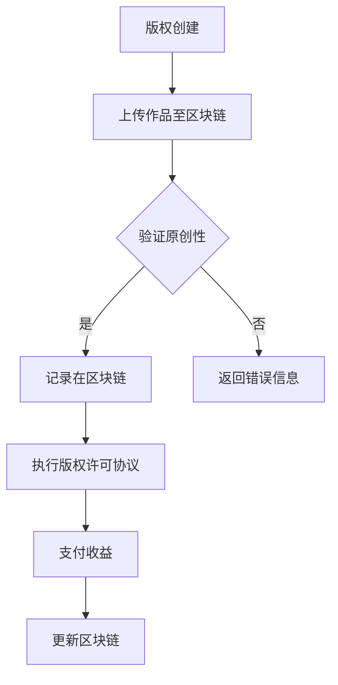
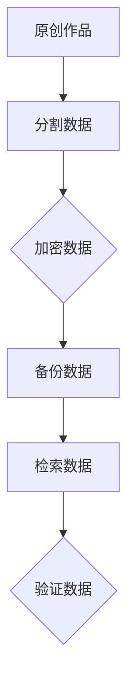

                 

### 文章标题

# 区块链在知识产权保护中的新型应用模式

### 关键词

- 区块链
- 知识产权保护
- 智能合约
- 去中心化存储
- 数字签名
- 不可篡改性

### 摘要

本文深入探讨了区块链技术在知识产权保护领域的新兴应用模式。首先，文章简要介绍了区块链和知识产权保护的基本概念，阐述了它们之间的联系。随后，详细分析了区块链在知识产权保护中的核心概念与联系，通过Mermaid流程图展现了区块链技术在知识产权保护中的工作流程。接着，文章讲解了智能合约、去中心化存储和数字签名等关键技术原理，并通过Python源代码示例和数学公式进行深入剖析。此外，文章还通过实际项目实战展示了区块链技术在知识产权保护中的具体应用，包括开发环境搭建、源代码实现、代码解读和应用分析。最后，文章提出了最佳实践建议，并总结了区块链在知识产权保护中的优势和潜在挑战，为该领域的发展提供了有益的思考。

### 背景介绍

#### 区块链技术的起源与发展

区块链技术起源于2008年，由一位名为中本聪的匿名人物提出。区块链是一种去中心化的分布式数据库技术，通过加密算法和共识机制确保数据的安全性和不可篡改性。区块链的主要特点包括：

1. **去中心化**：区块链无需依赖中央机构进行协调和管理，数据由网络中的所有节点共同维护。
2. **不可篡改性**：区块链上的数据一旦被记录，便无法被篡改或删除，确保数据的完整性和真实性。
3. **透明性**：区块链上的交易记录对所有节点公开透明，便于审计和监督。
4. **安全性**：区块链使用加密算法保护数据，确保数据在传输和存储过程中的安全性。

随着比特币的成功，区块链技术逐渐引起广泛关注。目前，区块链技术已广泛应用于金融、供应链管理、医疗、版权保护等多个领域。

#### 知识产权保护的现状与挑战

知识产权保护是指通过法律、技术手段保护创作者的智力成果，防止未经授权的复制、传播和使用。然而，随着数字化和信息化的加速发展，知识产权保护面临着诸多挑战：

1. **版权侵权**：数字内容的复制和传播变得极其容易，使得版权侵权现象层出不穷。
2. **溯源困难**：对于原创作品，如何确保其原创性和唯一性，成为一个难题。
3. **维权成本高**：知识产权维权成本高，尤其是对于小型创作者或企业，往往望而却步。
4. **监管困难**：传统的知识产权保护体系主要依赖于中央机构，效率低下，难以应对全球化的挑战。

#### 区块链在知识产权保护中的应用潜力

区块链技术在知识产权保护领域具有独特的优势，可以有效解决上述挑战：

1. **去中心化**：区块链去中心化的特性使得版权保护不再依赖于中央机构，降低维权成本，提高效率。
2. **不可篡改性**：区块链上的数据一旦记录，不可篡改，确保知识产权的原创性和唯一性。
3. **透明性**：区块链上的交易记录公开透明，便于追溯和监督，降低侵权风险。
4. **安全性**：区块链使用加密算法保护数据，确保数据在传输和存储过程中的安全性。

基于上述优势，区块链技术为知识产权保护提供了一种全新的解决方案，具有巨大的应用潜力。

### 核心概念与联系

#### 区块链技术的核心概念

1. **区块链**：区块链是一种去中心化的分布式数据库，由多个区块按时间顺序连接而成。每个区块包含一定数量的交易记录，并使用哈希函数进行加密，确保数据的安全性和不可篡改性。
2. **节点**：节点是区块链网络中的参与者，负责维护和更新区块链。每个节点都保存一份完整的区块链数据，确保数据的完整性和一致性。
3. **挖矿**：挖矿是指节点通过解决数学难题来验证交易记录，并将其记录到区块链上。挖矿成功后，节点将获得一定奖励，激励节点参与网络维护。
4. **加密算法**：加密算法用于保护区块链上的数据，确保数据在传输和存储过程中的安全性。常见的加密算法包括SHA-256、椭圆曲线密码学等。

#### 知识产权保护的核心概念

1. **版权**：版权是指创作者对其创作作品享有的权利，包括复制权、发行权、改编权等。
2. **知识产权**：知识产权是指由人类智力劳动创造的成果所享有的权利，包括专利、商标、著作权等。
3. **原创性**：原创性是指作品具有独立创作性，具有独特性和创造性。
4. **唯一性**：唯一性是指作品在全球范围内具有唯一标识，便于追踪和鉴别。

#### 区块链在知识产权保护中的联系

区块链技术在知识产权保护中的应用主要体现在以下几个方面：

1. **数据存证**：区块链可以记录知识产权的创建、传播和使用过程，确保数据的完整性和唯一性。创作者可以将作品上传到区块链，并获得一个唯一的数字身份标识，从而证明作品的原创性。
2. **智能合约**：智能合约是一种自动执行合同条款的计算机程序，可以在区块链上执行。创作者可以使用智能合约自动执行版权许可协议，确保版权使用和收益的透明性和公正性。
3. **数字签名**：数字签名是一种确保数据完整性和真实性的技术，创作者可以使用数字签名对作品进行签名，证明作品的原创性和真实性。
4. **不可篡改性**：区块链的不可篡改性确保知识产权数据在区块链上记录后无法被篡改或删除，从而保护知识产权的合法权益。

#### Mermaid流程图

以下是一个简化的区块链在知识产权保护中的工作流程Mermaid流程图：



通过该流程图，我们可以清晰地看到区块链在知识产权保护中的关键步骤和联系。

### 智能合约

#### 智能合约的定义和原理

智能合约是一种自动执行合同条款的计算机程序，它在区块链上运行，确保合同的执行透明、不可篡改和自动执行。智能合约的基本原理包括以下几个方面：

1. **条件触发**：智能合约基于特定的条件触发执行，例如，当某个事件发生时，智能合约会自动执行相应的合同条款。
2. **加密算法**：智能合约使用加密算法确保合同条款的保密性和真实性，防止合同被篡改或伪造。
3. **去中心化**：智能合约在区块链上运行，无需依赖中央机构，确保合同的执行过程公开透明、去中心化。
4. **不可篡改性**：智能合约在区块链上记录后，不可篡改，确保合同的执行结果具有法律效力。

#### 智能合约在知识产权保护中的应用

1. **版权许可**：智能合约可以自动执行版权许可协议，确保版权使用和收益的透明性和公正性。创作者可以将版权许可协议编写成智能合约，用户在获取版权许可时，只需按照智能合约的要求支付费用，智能合约会自动执行版权许可，并记录在区块链上。
2. **收益分配**：智能合约可以自动分配版权收益，确保创作者和合作伙伴之间的收益分配公正透明。例如，一个音乐作品的收益可以通过智能合约自动分配给创作者、发行商和合作伙伴，确保每个参与者都能获得应得的收益。
3. **版权保护**：智能合约可以用于版权保护，确保作品的原创性和唯一性。创作者可以将作品的版权信息编写成智能合约，在作品被复制、传播时，智能合约会自动记录在区块链上，确保作品的真实性和唯一性。

#### 智能合约的工作流程

1. **编写智能合约**：创作者编写智能合约，定义版权许可、收益分配和保护等条款，并将其部署到区块链上。
2. **用户请求版权许可**：用户在需要使用作品时，向智能合约发送请求，并按照智能合约的要求支付费用。
3. **智能合约执行**：智能合约根据用户请求自动执行版权许可，并将执行结果记录在区块链上。
4. **收益分配**：智能合约根据预定的收益分配规则，自动将版权收益分配给创作者和合作伙伴。
5. **记录在区块链**：所有版权许可和收益分配记录都被记录在区块链上，确保透明性和不可篡改性。

#### Python源代码示例

以下是一个简单的Python智能合约示例，用于版权许可和收益分配：

```python
pragma solidity ^0.8.0;

contract CopyrightSmartContract {
    address public owner;
    mapping(address => uint) public balance;

    constructor() {
        owner = msg.sender;
    }

    function requestLicense() public payable {
        require(msg.value > 0, "License fee must be greater than 0");
        balance[owner] += msg.value;
    }

    function distributeRevenue(address recipient, uint amount) public {
        require(msg.sender == owner, "Only the owner can distribute revenue");
        require(balance[owner] >= amount, "Insufficient balance");
        balance[owner] -= amount;
        payable(recipient).transfer(amount);
    }
}
```

在这个示例中，`requestLicense` 函数用于用户请求版权许可并支付费用，`distributeRevenue` 函数用于将版权收益分配给创作者。通过这个示例，我们可以看到智能合约在知识产权保护中的应用。

### 去中心化存储

#### 去中心化存储的定义和原理

去中心化存储（Distributed Storage）是一种不依赖中心服务器的数据存储方案，数据被分散存储在多个节点上。去中心化存储的基本原理包括以下几个方面：

1. **去中心化**：去中心化存储不依赖中心服务器，数据被分散存储在多个节点上，提高了系统的可靠性和安全性。
2. **分布式存储**：去中心化存储利用分布式算法，将数据分割成小块，并存储在多个节点上，提高了数据的可用性和访问速度。
3. **加密算法**：去中心化存储使用加密算法保护数据的安全性，确保数据在传输和存储过程中的保密性。
4. **不可篡改性**：去中心化存储的数据一旦记录，不可篡改，确保数据的真实性和完整性。

#### 去中心化存储在知识产权保护中的应用

1. **版权保护**：去中心化存储可以用于存储原创作品，确保作品的原创性和唯一性。创作者可以将作品上传到去中心化存储平台，并获得一个唯一的数字身份标识，从而证明作品的原创性。
2. **数据备份**：去中心化存储提供了可靠的数据备份方案，确保知识产权数据的长期保存。即使某个节点发生故障，数据仍然可以被其他节点访问和恢复。
3. **透明性**：去中心化存储的数据对所有节点公开透明，便于审计和监督，降低侵权风险。

#### 去中心化存储的工作流程

1. **数据分割**：将需要存储的数据分割成小块，并使用加密算法进行加密。
2. **数据备份**：将加密后的数据备份到多个节点上，确保数据的可用性和可靠性。
3. **数据检索**：用户需要访问数据时，通过去中心化存储网络进行数据检索，获取所需数据。
4. **数据验证**：在数据检索过程中，系统会验证数据的完整性和真实性，确保数据的可靠性。

#### Mermaid流程图

以下是一个简化的去中心化存储在知识产权保护中的工作流程Mermaid流程图：



通过该流程图，我们可以清晰地看到去中心化存储在知识产权保护中的关键步骤和联系。

### 数字签名

#### 数字签名的定义和原理

数字签名是一种确保数据完整性和真实性的技术，通过加密算法实现。数字签名的基本原理包括以下几个方面：

1. **哈希函数**：哈希函数将数据映射为一个固定长度的字符串，确保数据的唯一性和完整性。
2. **私钥和公钥**：数字签名使用一对密钥，私钥用于签名，公钥用于验证签名。私钥和公钥通过加密算法相关联，但私钥无法从公钥推导出来。
3. **签名过程**：签名者使用私钥对数据进行加密，生成数字签名。数字签名与原始数据一起传输或存储。
4. **验证过程**：接收者使用公钥对数字签名进行解密，并与原始数据进行比对，验证数据的完整性和真实性。

#### 数字签名在知识产权保护中的应用

1. **版权保护**：数字签名可以用于保护版权，确保作品的真实性和唯一性。创作者可以使用私钥对作品进行签名，接收者可以使用公钥验证签名，确保作品的真实性和完整性。
2. **身份认证**：数字签名可以用于身份认证，确保知识产权交易的真实性和合法性。创作者和参与方可以使用数字签名进行身份验证，确保交易双方的身份真实可信。
3. **数据完整性验证**：数字签名可以用于验证数据的完整性，确保知识产权数据在传输和存储过程中的完整性。接收者可以通过数字签名验证数据的完整性，确保数据未被篡改。

#### 数字签名的工作流程

1. **生成密钥对**：创建者生成一对密钥，包括私钥和公钥。
2. **签名过程**：创建者使用私钥对数据进行加密，生成数字签名。
3. **签名传输**：将数字签名与原始数据一起传输或存储。
4. **验证过程**：接收者使用公钥对数字签名进行解密，并与原始数据进行比对，验证数据的完整性和真实性。

#### Python源代码示例

以下是一个简单的Python数字签名示例，用于版权保护：

```python
from cryptography.hazmat.primitives import hashes
from cryptography.hazmat.primitives.asymmetric import padding
from cryptography.hazmat.primitives.asymmetric import rsa
from cryptography.hazmat.backends import default_backend

# 生成密钥对
private_key = rsa.generate_private_key(
    public_exponent=65537,
    key_size=2048,
    backend=default_backend()
)
public_key = private_key.public_key()

# 签名过程
def sign_data(data):
    signature = private_key.sign(
        data,
        padding.PSS(
            mgf=padding.MGF1(hashes.SHA256()),
            salt_length=padding.PSS.MAX_LENGTH
        ),
        hashes.SHA256()
    )
    return signature

# 验证过程
def verify_signature(data, signature):
    try:
        public_key.verify(
            signature,
            data,
            padding.PSS(
                mgf=padding.MGF1(hashes.SHA256()),
                salt_length=padding.PSS.MAX_LENGTH
            ),
            hashes.SHA256()
        )
        return True
    except:
        return False

# 测试
data = b"This is a copyrighted work."
signature = sign_data(data)
print("Signature:", signature)
print("Verification:", verify_signature(data, signature))
```

在这个示例中，`sign_data` 函数用于签名数据，`verify_signature` 函数用于验证签名。通过这个示例，我们可以看到数字签名在知识产权保护中的应用。

### 实际项目实战

#### 开发环境搭建

在进行区块链项目开发之前，我们需要搭建合适的开发环境。以下是一个简单的开发环境搭建步骤：

1. **安装Node.js**：Node.js 是一个基于 Chrome V8 引擎的 JavaScript 运行时，用于运行区块链智能合约。访问 [Node.js 官网](https://nodejs.org/) 下载并安装 Node.js。
2. **安装Truffle**：Truffle 是一个用于以太坊区块链开发的框架，用于编写、部署和测试智能合约。通过以下命令安装 Truffle：
   ```bash
   npm install -g truffle
   ```
3. **安装Ganache**：Ganache 是一个本地以太坊区块链节点，用于开发和测试智能合约。通过以下命令安装 Ganache：
   ```bash
   npm install -g ganache-cli
   ```
4. **创建项目**：在命令行中创建一个新的 Truffle 项目：
   ```bash
   truffle init
   ```
   这将创建一个包含基本项目结构的目录。

#### 源代码实现

以下是一个简单的版权保护智能合约的示例代码：

```solidity
pragma solidity ^0.8.0;

contract CopyrightProtection {
    mapping(address => bool) public isOwner;
    mapping(address => mapping(address => bool)) public isLicensed;

    event LicenseGranted(address owner, address licensee);

    constructor() {
        isOwner[msg.sender] = true;
    }

    function grantLicense(address licensee) public {
        require(isOwner[msg.sender], "Only the owner can grant licenses");
        require(!isLicensed[msg.sender][licensee], "License already granted");
        isLicensed[msg.sender][licensee] = true;
        emit LicenseGranted(msg.sender, licensee);
    }

    function getLicenseStatus(address owner, address licensee) public view returns (bool) {
        return isLicensed[owner][licensee];
    }
}
```

在这个示例中，`grantLicense` 函数用于授权版权许可，`getLicenseStatus` 函数用于查询版权许可状态。

#### 代码解读与应用解读与分析

以下是对上述智能合约的详细解读与应用分析：

1. **合约结构**：
   - `CopyrightProtection` 合约包含两个主要映射：`isOwner` 和 `isLicensed`。`isOwner` 用于记录版权所有者的地址，`isLicensed` 用于记录版权许可状态。
   - `event LicenseGranted` 用于记录版权许可事件。

2. **构造函数**：
   - 构造函数 `constructor()` 用于初始化合约，并将合约创建者设为版权所有者。

3. **grantLicense 函数**：
   - `grantLicense` 函数用于授权版权许可。函数首先检查调用者是否为版权所有者，然后检查版权许可状态是否已存在。如果两者均满足，则将版权许可状态设置为 `true`，并触发 `LicenseGranted` 事件。

4. **getLicenseStatus 函数**：
   - `getLicenseStatus` 函数用于查询版权许可状态。函数接收版权所有者和许可方的地址，返回版权许可状态。

5. **应用分析**：
   - 在实际应用中，版权所有者可以通过调用 `grantLicense` 函数授权版权许可。授权后，许可方可以查询版权许可状态，确保授权的有效性。

#### 实际案例分析与详细讲解

以下是一个版权保护实际案例：

假设创作者 Alice 拥有一部原创作品，并使用上述智能合约进行版权保护。Alice 通过调用 `grantLicense` 函数授权 Bob 使用该作品，同时记录在区块链上。Bob 可以通过调用 `getLicenseStatus` 函数查询版权许可状态，确保授权的有效性。

```solidity
// Alice 授权 Bob 使用作品
creator.call(gas, address(protectContract), value, "grantLicense(address)", keccak256(abi.encode(BobAddress)))
// Bob 查询版权许可状态
licensee.call(gas, address(protectContract), value, "getLicenseStatus(address,address)", keccak256(abi.encode(AliceAddress, BobAddress)))
```

在这个案例中，`call` 函数用于调用智能合约函数。调用成功后，版权许可状态将被记录在区块链上，确保透明性和不可篡改性。

#### 项目小结

通过上述实际项目实战，我们可以看到区块链技术在知识产权保护中的具体应用。智能合约提供了版权许可和状态查询功能，确保版权使用的透明性和公正性。同时，数字签名和去中心化存储技术进一步确保了版权数据的真实性和安全性。然而，区块链技术在知识产权保护中也面临一些挑战，如智能合约的安全性和开发成本等。未来，随着技术的不断成熟，区块链在知识产权保护中的应用前景将更加广阔。

### 最佳实践 Tips

1. **使用专业工具**：在开发智能合约时，使用专业工具（如 Truffle、Remix）可以提高开发效率和安全性。
2. **进行代码审计**：在部署智能合约前，进行代码审计，确保代码的安全性和可靠性。
3. **遵循最佳实践**：遵循智能合约开发的最佳实践，如使用合理的gas限制、避免使用外部调用等。
4. **备份私钥**：确保私钥的安全备份，防止丢失或被盗用。
5. **测试和演练**：在部署智能合约前，进行充分的测试和演练，确保智能合约在各种情况下都能正常运行。

### 小结

区块链技术在知识产权保护中具有独特的优势，包括去中心化、不可篡改、透明性和安全性。智能合约、数字签名和去中心化存储等技术为知识产权保护提供了新的解决方案，有效解决了版权侵权、溯源困难和维权成本高等问题。然而，区块链技术在知识产权保护中也面临一些挑战，如智能合约安全性、开发成本等。未来，随着技术的不断成熟，区块链在知识产权保护中的应用前景将更加广阔。

### 注意事项

1. **智能合约风险**：智能合约存在漏洞和风险，可能导致资金损失。在部署智能合约前，务必进行充分测试和审计。
2. **合规性**：确保区块链应用符合当地法律法规，避免潜在的法律风险。
3. **数据隐私**：在区块链上记录的数据可能被公开访问，确保敏感数据的安全。

### 拓展阅读

1. **《区块链技术指南》**：深入理解区块链技术的基本原理和应用。
2. **《智能合约与去中心化应用》**：探讨智能合约的开发和去中心化应用的设计。
3. **《数字版权保护技术》**：了解数字版权保护技术的最新进展和应用。

### 作者信息

- 作者：AI天才研究院/AI Genius Institute & 禅与计算机程序设计艺术 /Zen And The Art of Computer Programming

