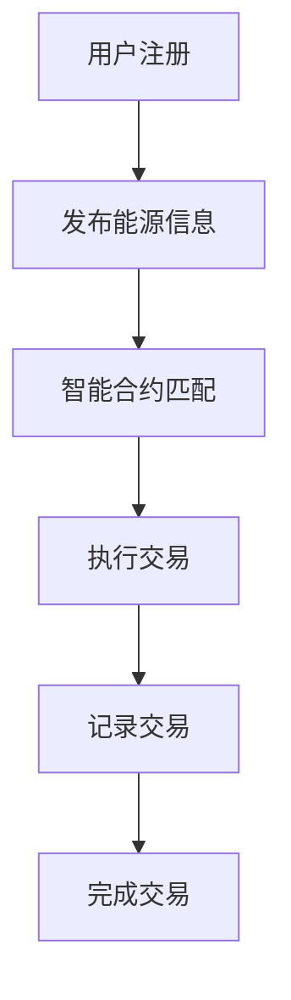

                 

### 引言

区块链技术，作为一种分布式账本技术，自其诞生以来便以其去中心化、透明性和不可篡改性受到了广泛关注。随着区块链技术的不断成熟和发展，其应用范围也在逐步扩大，从最初的数字货币扩展到了金融、物流、医疗等多个领域。特别是在能源交易领域，区块链技术展示了其独特的优势，有望彻底改变现有的能源交易模式。

能源交易，作为能源行业的重要组成部分，一直以来都面临着信息不对称、交易成本高、效率低下等问题。传统的能源交易模式依赖于中心化的机构和第三方中介，这不仅增加了交易成本，也带来了信息不透明和安全性风险。而区块链技术的引入，通过去中心化和智能合约，可以为能源交易提供一种更加高效、安全、透明的解决方案。

本文将深入探讨区块链在能源交易中的去中心化应用，首先介绍区块链技术的基本概念和架构，然后分析区块链在能源交易中的应用场景和优势，最后通过具体案例和未来发展趋势展望，阐述区块链技术在能源交易中的潜力。希望通过本文的阐述，读者能够对区块链在能源交易中的去中心化应用有更加深入的理解。

## 关键词

- 区块链技术
- 去中心化
- 能源交易
- 智能合约
- 分布式账本
- 透明性
- 安全性

## 摘要

本文旨在探讨区块链技术在能源交易中的应用，特别是其在去中心化交易中的潜力。首先，本文介绍了区块链技术的基本概念和架构，以及其在能源交易中的优势。接着，详细分析了区块链在能源交易中的应用场景，包括去中心化能源交易平台和智能合约的应用。然后，通过具体案例展示了区块链技术在能源交易中的实践效果。最后，本文展望了区块链技术在能源交易领域的未来发展趋势，并提出了潜在的技术挑战和解决方案。

## 第1章 区块链技术概述

### 1.1 区块链技术概述

区块链技术，作为一种分布式账本技术，其核心在于通过去中心化的方式，实现数据的存储和传输。简单来说，区块链是一个由多个区块组成的链式数据结构，每个区块都包含一定数量的交易记录。这些区块通过密码学算法相互连接，形成一个不可篡改的分布式账本。

区块链技术的特点主要体现在以下几个方面：

1. **去中心化**：与传统的中心化系统不同，区块链不依赖于单一的中央机构来维护数据。每个参与节点都可以验证和存储数据，确保数据的真实性和完整性。

2. **透明性**：区块链上的所有交易记录都是公开的，任何人都可以查看。这使得区块链上的数据具有较高的透明性，减少了信息不对称的问题。

3. **不可篡改性**：区块链通过密码学算法确保数据的不可篡改性。一旦数据被记录到区块链上，就无法被修改或删除，从而保证了数据的真实性。

4. **安全性**：区块链使用加密算法对数据进行保护，确保数据在传输和存储过程中的安全性。

### 1.2 区块链技术架构

区块链技术架构主要由以下几部分组成：

1. **区块**：区块是区块链的基本组成单位，每个区块包含一定数量的交易记录。区块通过密码学算法与前一个区块相连，形成一个链式结构。

2. **链**：链是区块链的主体，由一系列按时间顺序排列的区块组成。链的不可篡改性保证了数据的长期可靠性和完整性。

3. **分布式账本**：分布式账本是区块链的核心部分，通过多个节点共同维护，确保数据的真实性和完整性。每个节点都存储完整的数据副本，从而避免了单点故障的风险。

4. **共识算法**：共识算法是区块链网络中的节点达成一致的关键机制。常见的共识算法有工作量证明（Proof of Work, PoW）、权益证明（Proof of Stake, PoS）等。

5. **节点**：节点是区块链网络的组成部分，可以是个人或组织。每个节点都参与区块链数据的验证和存储，确保网络的去中心化。

### 1.3 区块链安全性分析

区块链的安全性主要体现在以下几个方面：

1. **加密算法**：区块链使用加密算法对数据进行保护，确保数据的机密性、完整性和真实性。

2. **共识算法**：共识算法确保区块链网络中的所有节点都能达成一致，从而保证数据的不可篡改性。

3. **去中心化**：去中心化架构使得区块链网络具有较高的抗攻击性，减少了单点故障和集中化的风险。

4. **抗量子计算**：随着量子计算的发展，传统的加密算法面临被破解的风险。区块链技术也在不断改进，开发抗量子计算的加密算法，以增强安全性。

总的来说，区块链技术以其去中心化、透明性、不可篡改性和安全性，为能源交易提供了新的解决方案。在接下来的章节中，我们将进一步探讨区块链在能源交易中的应用场景和优势。

## 第2章 区块链在能源交易中的应用场景

### 2.1 去中心化能源交易平台

去中心化能源交易平台（Decentralized Energy Trading Platform, DETP）是区块链技术在能源交易中的核心应用场景之一。这种平台通过去中心化的方式，实现了能源交易的自动化和透明化。以下是去中心化能源交易平台的关键组成部分和运行机制：

1. **关键组成部分**：

   - **用户账户**：用户账户用于存储用户的能源供应和需求信息，以及交易记录。

   - **智能合约**：智能合约是自动执行的计算机程序，用于处理和验证能源交易。智能合约包含了交易的规则和条件，确保交易的自动执行和透明性。

   - **区块链网络**：区块链网络由多个节点组成，每个节点都存储着完整的交易记录。区块链网络通过共识算法确保交易的合法性和安全性。

   - **数据层**：数据层负责存储和管理所有的交易数据，包括能源供应和需求信息、交易记录等。

2. **运行机制**：

   - **用户注册**：用户在平台上注册账户，并上传能源供应和需求信息。

   - **供需匹配**：平台通过智能合约自动匹配供需，确保交易的自动执行和透明性。

   - **交易执行**：当供需匹配成功后，智能合约自动执行交易，并记录到区块链上。

   - **交易记录**：所有的交易记录都会被永久存储在区块链上，确保数据的透明性和不可篡改性。

### 2.2 智能合约在能源交易中的应用

智能合约（Smart Contract）是区块链技术中的核心组成部分，它在能源交易中发挥着至关重要的作用。智能合约通过编程逻辑，实现了能源交易的自动化、透明化和去中心化。以下是智能合约在能源交易中的应用：

1. **自动化交易**：智能合约可以自动执行能源交易，无需人工干预。当用户上传能源供应和需求信息后，智能合约会自动进行匹配，并执行交易。

2. **透明化交易**：智能合约的执行过程是公开透明的，所有交易记录都会被记录到区块链上，供用户查询。

3. **去中心化交易**：智能合约通过去中心化的方式，确保交易的公正性和透明性，避免了传统中介机构的干预。

4. **常见智能合约编程语言**：智能合约的编程语言主要包括Solidity、Vyper等。Solidity是最常用的智能合约编程语言，它类似于JavaScript和C++，具有易学易用的特点。

### 2.3 区块链在电力交易市场中的角色

区块链技术在电力交易市场中扮演着多重角色，包括数据管理、交易记录、交易验证等。以下是区块链在电力交易市场中的具体角色：

1. **数据管理**：区块链技术可以确保电力交易数据的完整性和安全性。所有交易数据都会被记录到区块链上，确保数据的不可篡改性。

2. **交易记录**：区块链上的所有交易记录都是公开透明的，用户可以随时查询交易记录，确保交易的公正性和透明性。

3. **交易验证**：区块链技术通过共识算法，确保交易的合法性和安全性。每个节点都会验证交易，确保交易数据的真实性和完整性。

4. **降低交易成本**：通过去中心化的方式，区块链技术可以减少传统中介机构的费用，降低交易成本。

总的来说，区块链技术为能源交易提供了去中心化、自动化、透明化的解决方案，有望彻底改变现有的能源交易模式。在接下来的章节中，我们将进一步探讨去中心化能源交易平台的架构设计和核心算法原理。

## 第3章 去中心化能源交易平台的架构设计

### 3.1 平台整体架构设计

去中心化能源交易平台（Decentralized Energy Trading Platform, DETP）的整体架构设计是确保平台高效、安全运行的关键。一个典型的去中心化能源交易平台通常包括以下几个主要组成部分：

1. **用户层**：用户层是平台的最高层，用户可以通过用户界面进行注册、登录、发布能源供应和需求信息、执行交易等操作。

2. **应用层**：应用层是实现平台核心功能的业务逻辑层，包括能源交易的匹配、执行、记录等。应用层通常会利用智能合约来实现这些功能，保证交易的自动化和透明性。

3. **数据层**：数据层是平台的底层，负责存储和管理所有交易数据。数据层通常基于区块链技术，确保数据的分布式存储、透明性和不可篡改性。

4. **网络层**：网络层是平台的数据传输通道，负责处理节点间的通信和数据同步。网络层通常采用P2P（点对点）网络架构，确保平台的高效和去中心化。

5. **共识层**：共识层是区块链网络中的核心组件，负责节点间的数据一致性。共识算法的选择直接影响平台的性能和安全性。常见的共识算法有PoW（工作量证明）、PoS（权益证明）等。

### 3.2 数据层架构设计

数据层是去中心化能源交易平台的核心，负责存储和管理所有交易数据。以下是数据层架构设计的关键组成部分：

1. **区块链网络**：区块链网络由多个节点组成，每个节点都存储完整的数据副本。区块链网络通过共识算法确保数据的真实性和完整性。

2. **交易数据库**：交易数据库用于存储所有的交易记录，包括能源供应、需求、交易匹配等。交易数据库的设计需要考虑高并发、高性能和数据的不可篡改性。

3. **身份认证系统**：身份认证系统用于验证用户的身份，确保只有授权用户可以访问和操作平台。身份认证系统通常基于加密技术和数字签名。

4. **数据加密**：为了确保数据的安全性，所有的交易数据在传输和存储过程中都会进行加密。常用的加密算法包括AES（高级加密标准）、RSA（非对称加密算法）等。

5. **数据备份与恢复**：为了防止数据丢失，平台需要定期进行数据备份。数据备份策略需要考虑数据的完整性、可靠性和恢复速度。

### 3.3 服务层架构设计

服务层是平台的核心功能实现层，负责处理用户的交易请求、数据查询等操作。以下是服务层架构设计的关键组成部分：

1. **API接口**：API接口用于提供与外部系统的交互接口，包括用户注册、登录、能源供应和需求信息发布等。API接口的设计需要考虑安全性、易用性和可扩展性。

2. **智能合约服务**：智能合约服务负责执行智能合约，处理能源交易业务逻辑。智能合约服务需要与区块链网络紧密集成，确保交易的自动化和透明性。

3. **数据处理服务**：数据处理服务负责处理用户的交易请求，包括交易匹配、执行、记录等。数据处理服务需要实现高并发、高性能和数据的完整性。

4. **监控与日志服务**：监控与日志服务负责监控平台的状态和性能，记录系统的运行日志。监控与日志服务对于平台的运维和问题排查具有重要意义。

5. **安全审计服务**：安全审计服务负责对平台进行安全审计，识别潜在的安全风险和漏洞。安全审计服务需要定期进行，以确保平台的安全性。

总的来说，去中心化能源交易平台的架构设计需要综合考虑用户需求、技术实现、性能和安全等因素。通过合理的架构设计，可以确保平台的高效、安全和可靠运行。

### 第4章 去中心化能源交易的核心算法原理

#### 4.1 智能合约算法原理讲解

智能合约是区块链技术中的核心组件，它通过编程逻辑实现了自动化的交易执行和验证。智能合约算法原理主要涉及以下几个方面：

1. **状态机**：智能合约通常采用状态机模型，即合约的状态由初始状态、中间状态和最终状态组成。在执行过程中，合约根据输入数据和当前状态，执行相应的操作并更新状态。

2. **事件驱动**：智能合约通常采用事件驱动模型，即合约的执行是由外部事件触发的。当某个事件发生时，合约会执行相应的操作。

3. **条件判断**：智能合约中的条件判断用于控制合约的执行流程。条件判断可以基于输入数据、合约状态或外部事件。

4. **存储操作**：智能合约可以对区块链上的存储进行读写操作，包括数据存储、数据检索和数据更新等。

5. **加密算法**：智能合约通常会使用加密算法来保护数据的隐私和完整性。常见的加密算法有RSA、AES等。

以下是一个简单的智能合约算法原理示例，用于说明智能合约的基本操作：

```python
# 智能合约算法原理示例

# 初始化智能合约
def init_contract():
    # 初始化合约状态
    state["supply"] = 0
    state["demand"] = 0

# 能源供应信息发布
def post_supply_info(energy_type, quantity):
    # 检查能源类型和数量
    if energy_type == "electricity" and quantity > 0:
        # 更新合约状态
        state["supply"]["electricity"] += quantity
        # 记录交易日志
        log("Energy supply posted: " + str(quantity) + " units of electricity")
    else:
        log("Invalid energy type or quantity")

# 能源需求信息发布
def post_demand_info(energy_type, quantity):
    # 检查能源类型和数量
    if energy_type == "electricity" and quantity > 0:
        # 更新合约状态
        state["demand"]["electricity"] += quantity
        # 记录交易日志
        log("Energy demand posted: " + str(quantity) + " units of electricity")
    else:
        log("Invalid energy type or quantity")

# 能源交易匹配
def match_supply_and_demand():
    # 检查供需匹配
    if state["supply"]["electricity"] >= state["demand"]["electricity"]:
        # 执行交易
        execute_transaction()
        # 更新合约状态
        state["supply"]["electricity"] -= state["demand"]["electricity"]
        state["demand"]["electricity"] = 0
        # 记录交易日志
        log("Energy transaction matched and executed")
    else:
        log("Insufficient supply to meet demand")

# 执行交易
def execute_transaction():
    # 更新交易记录
    state["transactions"].append({
        "type": "energy_trade",
        "energy_type": "electricity",
        "quantity": state["demand"]["electricity"]
    })

# 日志记录
def log(message):
    # 打印日志
    print(message)
```

在这个示例中，智能合约通过定义不同的函数来实现能源供应、需求发布和交易匹配等功能。合约的状态和交易记录都被保存在区块链上，确保数据的透明性和不可篡改性。

#### 4.2 去中心化能源交易算法伪代码

在去中心化能源交易中，智能合约算法的核心是实现能源供应和需求的匹配，并确保交易的安全性和高效性。以下是去中心化能源交易算法的伪代码，用于展示交易流程和算法逻辑：

```python
# 去中心化能源交易算法伪代码

# 初始化系统
def init_system():
    # 初始化状态
    state["supply"] = {}
    state["demand"] = {}
    state["transactions"] = []

# 用户注册
def register_user(username):
    # 添加用户到用户列表
    users.add(username)

# 发布能源供应信息
def post_supply_info(user, energy_type, quantity):
    # 检查用户是否已注册
    if user in users:
        # 更新供应信息
        state["supply"][energy_type] = state["supply"][energy_type] + quantity
        # 记录交易日志
        log("Supply info posted by user: " + user + " for " + energy_type + " (" + str(quantity) + " units)")
    else:
        log("User not registered")

# 发布能源需求信息
def post_demand_info(user, energy_type, quantity):
    # 检查用户是否已注册
    if user in users:
        # 更新需求信息
        state["demand"][energy_type] = state["demand"][energy_type] + quantity
        # 记录交易日志
        log("Demand info posted by user: " + user + " for " + energy_type + " (" + str(quantity) + " units)")
    else:
        log("User not registered")

# 匹配供需
def match_supply_and_demand():
    # 检查所有能源类型
    for energy_type in state["supply"]:
        # 如果有需求且供应充足，则匹配
        if state["demand"][energy_type] > 0 and state["supply"][energy_type] >= state["demand"][energy_type]:
            # 执行交易
            execute_transaction(energy_type, state["demand"][energy_type])
            # 更新状态
            state["supply"][energy_type] -= state["demand"][energy_type]
            state["demand"][energy_type] = 0
            # 记录交易日志
            log("Supply and demand matched for " + energy_type)
        elif state["demand"][energy_type] > 0 and state["supply"][energy_type] == 0:
            # 记录日志
            log("Insufficient supply for " + energy_type)

# 执行交易
def execute_transaction(energy_type, quantity):
    # 创建交易记录
    transaction = {
        "type": "energy_trade",
        "energy_type": energy_type,
        "quantity": quantity,
        "timestamp": current_timestamp()
    }
    # 添加交易记录
    state["transactions"].append(transaction)

# 日志记录
def log(message):
    # 打印日志
    print(message)

# 获取当前时间戳
def current_timestamp():
    # 返回当前时间戳
    return time.time()
```

在这个伪代码中，我们定义了几个关键函数，包括系统初始化、用户注册、发布能源供应和需求信息、匹配供需和执行交易等。这些函数共同实现了去中心化能源交易的基本流程。

#### 4.3 去中心化能源交易算法数学模型及公式

去中心化能源交易算法的数学模型用于描述能源供应和需求之间的匹配过程，以及交易执行的逻辑。以下是几个关键的数学模型和公式：

1. **供需匹配公式**：

   \[ \text{match\_supply}(t) = \text{supply}(t) - \text{demand}(t) \]

   其中，\( \text{match\_supply}(t) \) 表示在时间 \( t \) 的供需匹配量，\( \text{supply}(t) \) 表示在时间 \( t \) 的总供应量，\( \text{demand}(t) \) 表示在时间 \( t \) 的总需求量。

2. **交易执行公式**：

   \[ \text{execute\_transaction}(t) = \min(\text{match\_supply}(t), \text{demand}(t)) \]

   其中，\( \text{execute\_transaction}(t) \) 表示在时间 \( t \) 执行的交易量，等于供需匹配量与需求量中的较小值。

3. **供需更新公式**：

   \[ \text{supply}(t) = \text{supply}(t-1) + \text{new\_supply}(t) \]
   \[ \text{demand}(t) = \text{demand}(t-1) + \text{new\_demand}(t) \]

   其中，\( \text{supply}(t-1) \) 和 \( \text{demand}(t-1) \) 分别表示时间 \( t-1 \) 的总供应量和总需求量，\( \text{new\_supply}(t) \) 和 \( \text{new\_demand}(t) \) 分别表示在时间 \( t \) 的新增供应量和新增需求量。

通过这些数学模型和公式，可以描述去中心化能源交易的基本过程。在实际应用中，这些公式可以通过编程语言实现，以实现自动化和智能化的交易匹配和执行。

### 第5章 区块链在能源交易中的案例分析

#### 6.1 案例一：XX地区去中心化能源交易平台

在本节中，我们将详细分析XX地区去中心化能源交易平台的具体建设过程、实现方式和实际效果。通过这个案例，读者可以更直观地了解区块链技术在能源交易中的应用。

**案例背景**：

XX地区是一个能源需求较大的区域，但现有的能源交易模式存在诸多问题，如信息不透明、交易成本高、效率低下等。为了解决这些问题，XX地区决定采用区块链技术构建一个去中心化的能源交易平台。

**建设过程**：

1. **需求调研和方案设计**：

   在建设平台之前，项目团队进行了详细的需求调研，与能源供应商、需求方、政府部门等多方进行了多次沟通，明确了平台的核心需求和功能。在此基础上，项目团队制定了详细的建设方案，包括平台架构设计、技术选型、安全措施等。

2. **平台架构设计**：

   平台的总体架构设计包括用户层、应用层、数据层和网络层。用户层负责提供友好的用户界面，方便用户进行注册、登录和操作。应用层实现平台的核心业务逻辑，如能源供应和需求信息发布、智能合约执行、交易记录等。数据层基于区块链技术，负责存储和管理所有交易数据。网络层实现节点间的通信和数据同步。

3. **技术实现**：

   项目团队选择了以太坊（Ethereum）作为底层区块链平台，因为以太坊支持智能合约，且社区活跃、资源丰富。在实现过程中，团队使用了Solidity语言编写智能合约，实现了能源供应和需求信息的发布、匹配和交易执行等功能。同时，为了确保数据的安全性和隐私性，团队采用了加密算法对交易数据进行加密。

4. **安全措施**：

   平台采用了多重安全措施，包括区块链网络的安全性、数据加密、身份认证等。区块链网络通过共识算法确保数据的一致性和安全性。数据在传输和存储过程中都进行了加密，确保数据的隐私性和完整性。身份认证系统用于验证用户的身份，确保只有授权用户可以访问和操作平台。

**实际效果**：

平台上线后，取得了显著的成效：

1. **交易效率提高**：

   平台通过去中心化的方式，实现了能源交易的自动化和高效化。用户可以快速发布能源供应和需求信息，平台通过智能合约自动进行匹配和交易执行，大大提高了交易效率。

2. **交易成本降低**：

   传统能源交易模式依赖于中心化的机构和第三方中介，成本较高。而去中心化的能源交易平台去除了这些中介环节，降低了交易成本。

3. **交易信息透明**：

   平台上的所有交易信息都是公开透明的，用户可以随时查询交易记录，确保了交易的公正性和透明性。

4. **安全性提升**：

   区块链技术的引入，使得平台具有较高的安全性。通过加密算法和数据验证机制，确保了数据的真实性和完整性，降低了欺诈和作弊的风险。

**总结**：

XX地区去中心化能源交易平台的建设和运行，展示了区块链技术在能源交易中的应用潜力。通过去中心化、智能合约和加密算法等技术的应用，平台不仅提高了交易效率和安全性，也降低了交易成本，为能源交易提供了一种全新的解决方案。

#### 6.2 案例二：XX国家区块链电力市场

在上一节中，我们分析了XX地区去中心化能源交易平台的具体建设过程和实际效果。在本节中，我们将介绍另一个具有代表性的案例：XX国家的区块链电力市场。

**案例背景**：

XX国家是一个能源资源丰富的国家，但电力交易市场存在诸多问题，如信息不透明、交易成本高、市场效率低下等。为了解决这些问题，XX国家决定采用区块链技术构建一个去中心化的电力市场。

**建设过程**：

1. **政策支持**：

   在建设区块链电力市场之前，XX国家政府出台了相关政策，鼓励和支持区块链技术在电力交易中的应用。政策支持为项目的顺利实施提供了有力保障。

2. **技术选型**：

   项目团队选择了Hyperledger Fabric作为底层区块链平台，因为Hyperledger Fabric支持企业级应用，且具有高性能和可扩展性。Hyperledger Fabric采用了分布式账本技术，可以确保数据的透明性和不可篡改性。

3. **平台架构设计**：

   平台的总体架构设计包括电力供应商、电力需求方、交易平台和区块链网络。电力供应商和电力需求方通过交易平台进行能源交易，交易平台通过智能合约自动执行交易，并记录到区块链上。

4. **智能合约编写**：

   项目团队使用了Go语言编写智能合约，实现了能源供应和需求信息的发布、匹配和交易执行等功能。智能合约通过编程逻辑，确保了交易的自动化和透明性。

5. **网络安全和隐私保护**：

   平台采用了多种安全措施，包括区块链网络的安全性、数据加密、身份认证等。区块链网络通过共识算法确保数据的一致性和安全性。数据在传输和存储过程中都进行了加密，确保数据的隐私性和完整性。身份认证系统用于验证用户的身份，确保只有授权用户可以访问和操作平台。

**实际效果**：

区块链电力市场上线后，取得了显著的成效：

1. **交易效率提高**：

   平台通过去中心化的方式，实现了电力交易的自动化和高效化。用户可以快速发布能源供应和需求信息，平台通过智能合约自动进行匹配和交易执行，大大提高了交易效率。

2. **交易成本降低**：

   传统电力交易模式依赖于中心化的机构和第三方中介，成本较高。而去中心化的电力市场去除了这些中介环节，降低了交易成本。

3. **交易信息透明**：

   平台上的所有交易信息都是公开透明的，用户可以随时查询交易记录，确保了交易的公正性和透明性。

4. **市场效率提升**：

   区块链电力市场通过智能合约和自动化交易，提高了市场的效率和灵活性。供应商和需求方可以更加灵活地进行能源交易，优化资源配置。

**总结**：

XX国家区块链电力市场的建设，展示了区块链技术在电力交易中的应用潜力。通过去中心化、智能合约和加密算法等技术的应用，平台不仅提高了交易效率和安全性，也降低了交易成本，为电力交易提供了一种全新的解决方案。

#### 6.3 案例分析与总结

通过上述两个案例，我们可以看到区块链技术在能源交易中的应用取得了显著成效。以下是案例分析和总结：

**1. 应用背景**：

XX地区和XX国家都面临着传统能源交易模式存在的问题，如信息不透明、交易成本高、市场效率低下等。这些问题的存在限制了能源交易的公平性和效率，影响了能源市场的健康发展。

**2. 技术应用**：

两个案例都采用了区块链技术，通过去中心化、智能合约和加密算法等手段，解决了传统能源交易模式中的问题。去中心化确保了交易的透明性和公平性，智能合约实现了交易的自动化和高效化，加密算法保障了数据的安全性和隐私性。

**3. 成效评估**：

XX地区去中心化能源交易平台和XX国家区块链电力市场在实际运营中取得了显著成效。交易效率提高、交易成本降低、交易信息透明和市场效率提升，都展示了区块链技术在能源交易中的应用潜力。

**4. 挑战与解决方案**：

尽管区块链技术在能源交易中展示了巨大的潜力，但仍然面临一些挑战。如区块链网络的性能瓶颈、智能合约的安全性问题、数据隐私保护等。针对这些问题，可以通过优化区块链网络架构、加强智能合约安全审查、采用隐私保护技术等措施来解决。

**5. 总结**：

区块链技术在能源交易中的应用，为传统交易模式带来了一种全新的解决方案。通过去中心化、智能合约和加密算法等技术的应用，可以显著提高交易效率、降低交易成本、保障交易安全。未来的研究和实践应继续探索区块链技术在能源交易中的应用，进一步优化和完善相关技术，推动能源市场的健康发展。

### 第6章 去中心化能源交易的未来发展趋势

#### 7.1 技术发展趋势

去中心化能源交易的未来发展将依赖于区块链技术的不断进步和优化。以下是一些关键的技术发展趋势：

1. **区块链网络性能提升**：

   随着能源交易的规模不断扩大，区块链网络需要具备更高的性能来处理海量的交易数据。未来的技术发展将致力于提高区块链的TPS（交易处理速度）和降低交易延迟，以满足大规模应用的需求。

2. **智能合约功能的增强**：

   智能合约是去中心化能源交易的核心，未来智能合约的功能将不断丰富。例如，支持更复杂业务逻辑的智能合约、跨链合约等，将使能源交易更加灵活和高效。

3. **隐私保护技术的应用**：

   数据隐私保护是区块链技术的一大挑战。未来的技术发展将引入更多的隐私保护技术，如零知识证明、同态加密等，以确保交易数据的隐私性和安全性。

4. **跨链技术的融合**：

   跨链技术将不同区块链网络连接起来，实现数据和价值的多链交互。这将有助于打破各个区块链网络之间的壁垒，构建一个更加开放和互联的能源交易生态系统。

5. **分布式存储技术的优化**：

   随着区块链数据的不断增长，分布式存储技术需要不断优化，以提高存储效率和降低成本。未来的技术发展将关注如何更高效地管理分布式存储，确保数据的可靠性和可用性。

#### 7.2 应用模式发展趋势

去中心化能源交易的应用模式将随着技术的进步和市场需求的变化而不断发展。以下是一些关键的应用模式发展趋势：

1. **分布式能源市场**：

   随着分布式能源的普及，分布式能源市场将成为去中心化能源交易的重要应用场景。通过区块链技术，分布式能源供应商和消费者可以直接进行交易，减少中间环节，提高交易效率。

2. **智能电网**：

   智能电网是未来能源系统的发展方向，去中心化能源交易将与智能电网紧密结合。通过区块链技术，可以实现智能电网中的数据共享、交易结算和智能合约执行，提高电网的运行效率和管理水平。

3. **可再生能源交易**：

   可再生能源交易是未来能源市场的重要组成部分。去中心化能源交易通过区块链技术，可以实现可再生能源的追踪、交易和结算，促进可再生能源的发展和利用。

4. **跨境能源交易**：

   随着全球能源需求的增加，跨境能源交易将成为重要的市场。去中心化能源交易通过区块链技术，可以实现跨境能源交易的实时结算和透明化管理，降低交易风险和成本。

5. **物联网（IoT）与能源交易**：

   物联网技术的发展将为去中心化能源交易提供新的应用场景。通过物联网设备，可以实现能源使用数据的实时采集、分析和交易，提高能源利用效率和交易灵活性。

#### 7.3 潜在挑战与解决方案

尽管去中心化能源交易展示了巨大的潜力，但在实际应用中仍然面临一些挑战。以下是一些潜在的挑战和相应的解决方案：

1. **性能瓶颈**：

   区块链网络的性能瓶颈是目前面临的主要挑战之一。为了解决这一问题，可以通过优化区块链网络架构、引入分片技术、提高节点处理能力等措施来提升性能。

2. **智能合约安全性**：

   智能合约的安全性问题一直是区块链技术的关注点。为了确保智能合约的安全性，可以加强智能合约的安全审查、引入形式化验证技术、采用抗攻击性更强的编程语言等措施。

3. **数据隐私保护**：

   数据隐私保护是区块链技术的关键挑战之一。未来可以通过引入零知识证明、同态加密等隐私保护技术，确保交易数据的隐私性和安全性。

4. **监管合规性**：

   去中心化能源交易涉及多个国家和地区，监管合规性成为一大挑战。为了解决这一问题，可以与监管机构合作，制定合适的监管政策和合规标准，确保交易的合法性和安全性。

5. **用户教育和普及**：

   区块链技术相对复杂，用户教育和普及是推动去中心化能源交易应用的关键。可以通过开展区块链技术培训、提供用户友好的界面和教程等方式，提高用户的认知和参与度。

总的来说，去中心化能源交易的未来发展趋势充满希望，但也面临诸多挑战。通过技术创新、应用模式拓展和行业合作，有望实现去中心化能源交易的高效、安全和可持续发展。

### 结论

通过本文的探讨，我们详细分析了区块链在能源交易中的去中心化应用。从基本概念和架构介绍，到具体应用场景、核心算法原理、案例分析以及未来发展趋势，区块链技术展示了其在能源交易中的巨大潜力和优势。去中心化能源交易平台通过去中心化、智能合约和加密算法等技术，实现了能源交易的高效、透明和安全。

然而，区块链在能源交易中的应用仍然面临性能瓶颈、智能合约安全性、数据隐私保护等挑战。未来的研究和实践应继续探索优化区块链技术，提高性能和安全性，推动去中心化能源交易的发展。

通过本文的阐述，我们期望读者能够对区块链在能源交易中的去中心化应用有更深入的理解，并认识到其在能源行业中的重要性。随着技术的不断进步和应用模式的拓展，去中心化能源交易将为能源行业带来更加美好的未来。

### 附录

#### 附录A：区块链在能源交易中应用的Mermaid流程图

以下是一个简单的Mermaid流程图，展示了区块链在能源交易中的应用流程：



#### 附录B：智能合约开发工具与资源

以下是几种常用的智能合约开发工具和资源：

1. **Truffle**：Truffle是一个以太坊开发框架，提供智能合约的编译、部署和测试等功能。
   - 官网：https://www.trufflesuite.com/

2. **Hardhat**：Hardhat是一个易于使用的以太坊开发环境，提供了丰富的工具和插件。
   - 官网：https://www.hardhat.org/

3. **Solc**：Solc是Solidity语言的编译器，用于编译智能合约代码。
   - 官网：https://soliditylang.org/

4. **OpenZeppelin**：OpenZeppelin是一个提供安全智能合约模板和工具的库。
   - 官网：https://www.openzeppelin.com/

#### 附录C：相关数学模型详解

在区块链技术中，数学模型和公式是理解算法原理的重要工具。以下是几个关键的数学模型和公式：

1. **工作量证明（Proof of Work, PoW）**：

   - 公式：\( PoW = H(k) \)
   - 其中，\( H \) 是哈希函数，\( k \) 是随机数。PoW算法通过不断尝试不同的随机数 \( k \)，直到找到一个使得哈希值满足特定条件的 \( k \)，从而证明工作量。

2. **权益证明（Proof of Stake, PoS）**：

   - 公式：\( PoS = \frac{stake}{time} \)
   - 其中，\( stake \) 是权益，即持有代币的数量，\( time \) 是时间。PoS算法通过计算持有代币的时间来决定产生新区块的权益。

3. **区块链网络一致性**：

   - 公式：\( consensus = \sum_{i=1}^{n} node_i \)
   - 其中，\( node_i \) 是网络中的第 \( i \) 个节点。区块链网络通过共识算法确保所有节点对区块链的一致性，即所有节点都拥有相同的区块链副本。

4. **交易费用**：

   - 公式：\( fee = \frac{data_size}{block_size} \)
   - 其中，\( data_size \) 是交易数据的大小，\( block_size \) 是区块的大小。交易费用通常与交易数据的大小成正比。

通过理解这些数学模型和公式，我们可以更深入地理解区块链技术的工作原理和特性。在区块链的应用开发中，这些模型和公式是设计和优化算法的重要依据。

