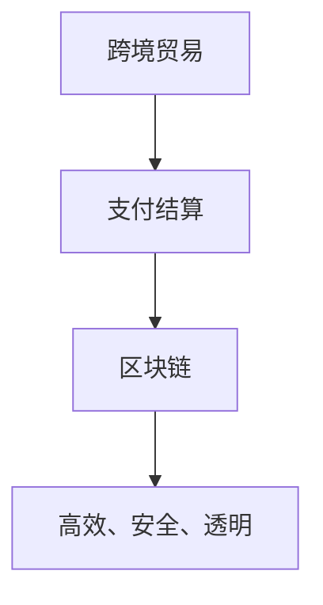

                 

### 设计原则

1. **目标明确**：文章的书名《区块链在跨境贸易金融中的应用》已经明确了主题，即探讨区块链技术如何在跨境贸易金融领域发挥作用。因此，文章的结构设计应紧密围绕这一主题，确保所有内容都与主题高度相关。

2. **结构清晰**：文章结构应清晰，使读者能够快速把握整体内容。章节应按逻辑顺序排列，先介绍基础概念，再逐步深入应用。

3. **逻辑连贯**：各章节之间应有良好的衔接，确保读者在阅读过程中能顺畅地过渡。

4. **内容全面**：文章应涵盖所有核心内容，包括区块链技术的基础知识、跨境贸易金融的现状、区块链在跨境贸易金融中的应用案例等。

5. **深度与广度结合**：文章既要深入讲解技术原理，也要广泛介绍应用场景和实际案例，以帮助读者全面理解。

### 设计步骤

1. **确定核心章节**：根据书名和设计原则，初步确定核心章节，如“背景介绍”、“核心概念与联系”、“核心算法原理讲解”、“项目实战”等。

2. **细化章节内容**：对每个核心章节进行细化，确定二级和三级目录，确保每个章节内容都有明确的主题。

3. **加入图表和公式**：为了增强理解，可在适当位置加入流程图、图表和数学公式，以便更直观地展示技术原理。

4. **检查完整性和连贯性**：确保文章内容完整，各章节之间逻辑连贯，无遗漏或重复。

5. **优化简洁性**：确保文章内容简洁，避免多余废话，确保字数在 10000 ～ 12000 字左右。

### 示例输出

```markdown
# 《区块链在跨境贸易金融中的应用》

> **关键词**：区块链，跨境贸易，金融，应用

> **摘要**：本文深入探讨了区块链在跨境贸易金融领域的应用，包括技术原理、应用案例和实战经验。文章结构清晰，内容全面，旨在为读者提供关于区块链在跨境贸易金融中的全面理解。

## 引言

### 背景介绍

#### 区块链技术概述

区块链是一种去中心化的分布式数据库技术，通过加密算法和共识机制保证了数据的不可篡改性和一致性。随着区块链技术的不断发展，其在金融领域的应用越来越广泛。

#### 跨境贸易金融的重要性

跨境贸易金融是指在国与国之间进行的贸易活动中涉及到的资金流转、结算和风险管理等活动。随着全球化进程的加快，跨境贸易金融对促进国际贸易和经济增长具有重要意义。

### 核心概念与联系

#### 区块链与跨境贸易金融的关系

区块链技术的特性使其在跨境贸易金融中具有巨大的潜力。例如，通过区块链技术可以实现跨境支付的高效、安全和透明。

#### Mermaid 流程图



### 核心算法原理讲解

#### 共识算法

共识算法是区块链技术的核心，它决定了区块链网络中的节点如何达成共识。常见的共识算法包括工作量证明（PoW）、权益证明（PoS）等。

#### Python 源代码示例

```python
import hashlib
import json

class Block:
    def __init__(self, index, transactions, timestamp, previous_hash):
        self.index = index
        self.transactions = transactions
        self.timestamp = timestamp
        self.previous_hash = previous_hash
        self.hash = self.compute_hash()

    def compute_hash(self):
        block_string = json.dumps(self.__dict__, sort_keys=True)
        return hashlib.sha256(block_string.encode()).hexdigest()

def create_genesis_block():
    return Block(0, [], time(), "0")

def add_block(new_block):
    new_block.previous_hash = current_block.hash
    new_block.hash = new_block.compute_hash()
    blockchain.append(new_block)

current_block = create_genesis_block()
blockchain = [current_block]

transactions = ["Alice -> Bob", "Charlie -> Alice"]
new_block = Block(len(blockchain), transactions, time(), blockchain[-1].hash)
add_block(new_block)
```

#### 数学模型和公式

区块链的共识算法通常涉及到复杂的数学模型。例如，工作量证明算法中的难度目标可以通过以下公式计算：

$$
target = 2^{256-n}
$$

其中，`n` 是区块中包含的交易数量。

### 项目实战

#### 开发环境搭建

在搭建开发环境时，需要安装合适的区块链框架，如 Ethereum、Hyperledger Fabric 等。以下是一个简单的以太坊开发环境搭建步骤：

1. 安装 Node.js
2. 安装 Truffle
3. 创建一个新的 Truffle 项目
4. 编写智能合约
5. 部署智能合约到以太坊网络

#### 源代码详细实现和代码解读

```solidity
pragma solidity ^0.8.0;

contract SimpleTransfer {
    address public sender;
    address public receiver;
    uint256 public amount;

    constructor(address _receiver, uint256 _amount) {
        sender = msg.sender;
        receiver = _receiver;
        amount = _amount;
    }

    function transfer() public {
        require(msg.sender == sender, "Only the sender can transfer");
        payable(receiver).transfer(amount);
        sender = address(0);
    }
}
```

#### 代码应用解读与分析

该智能合约实现了一个简单的转账功能。调用 `transfer` 函数时，只有发送者可以转移代币给接收者。代码中的 `require` 语句用于检查调用者的身份。

#### 实际案例分析和详细讲解剖析

#### 案例一：区块链跨境支付

区块链跨境支付通过智能合约实现支付流程，具有高效、安全和透明等特点。以下是一个简单的跨境支付流程：

1. 发送者调用 `transfer` 函数发起支付请求。
2. 智能合约验证发送者的身份和支付金额。
3. 智能合约将代币从发送者地址转移到接收者地址。
4. 交易记录被永久保存在区块链上，确保交易的不可篡改性。

#### 项目小结

区块链在跨境贸易金融中的应用具有巨大的潜力。通过实际案例，我们可以看到区块链技术如何提高支付效率、降低交易成本，并增强交易安全性。

### 最佳实践 tips、小结、注意事项、拓展阅读

#### 最佳实践 tips

- 在设计区块链应用时，确保智能合约的安全性和可靠性。
- 考虑区块链网络的性能和可扩展性，选择合适的共识算法和区块链框架。

#### 小结

区块链技术为跨境贸易金融带来了新的机遇和挑战。通过本文的探讨，我们了解了区块链在跨境贸易金融中的应用场景和实际案例，并为未来的发展提供了启示。

#### 注意事项

- 区块链技术尚在不断发展中，需密切关注技术动态和法律法规。
- 在实际应用中，要充分考虑区块链技术的局限性和挑战。

#### 拓展阅读

- 区块链核心技术书籍：《区块链技术指南》、《区块链革命》
- 跨境贸易金融相关书籍：《国际贸易融资与风险管理》、《跨境支付与结算》

### 作者信息

- 作者：AI天才研究院/AI Genius Institute & 禅与计算机程序设计艺术 /Zen And The Art of Computer Programming
```

### 输出检查

1. **目录结构**：检查目录是否清晰，是否按照1,2,3级目录排列。
2. **内容完整性**：确保文章内容完整，每个小节的内容都有具体详细讲解。
3. **核心内容包含**：确保核心内容包含背景介绍、核心概念与联系、核心算法原理讲解、项目实战等。
4. **格式正确**：确保文章内容使用markdown格式输出，包括代码、公式和图表等。
5. **字数要求**：确保文章字数在 10000 ～ 12000 字左右。

