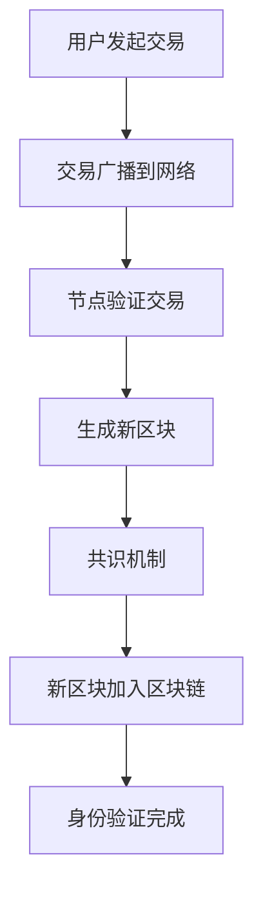

                 

### 引言

在当今数字化时代，身份验证和访问管理已成为信息安全领域的关键组成部分。随着互联网的普及和在线服务的增多，用户身份的安全认证和权限控制变得愈发重要。传统的身份验证方法如用户名和密码、双因素认证等，虽然在一定范围内有效，但仍然存在许多不足，如易受密码泄露攻击、用户体验差等问题。

区块链技术作为一种去中心化的分布式数据库技术，因其独特的特点，为身份验证和访问管理提供了新的解决方案。区块链技术通过去中心化、不可篡改和透明性等特点，实现了对用户身份和访问权限的可靠管理。这使得身份验证和访问管理不再依赖于单一中心化的信任机构，大大提高了系统的安全性和可信度。

本文旨在探讨区块链技术在身份验证和访问管理中的应用。首先，我们将简要介绍区块链技术的基础知识，包括其工作原理、核心概念以及与身份验证和访问管理的联系。接着，我们将深入分析区块链在身份验证中的具体应用，如智能合约在身份验证过程中的角色、零知识证明的使用等。随后，文章将探讨区块链在访问管理中的优势，如访问权限控制、权限管理系统的设计等。在此基础上，我们将通过具体案例，展示区块链技术在身份验证和访问管理中的实际应用，并分析其效果。最后，本文将讨论区块链技术的未来发展方向和潜在挑战，为读者提供全面的理解和展望。

通过本文的阅读，读者将能够深入了解区块链技术在身份验证和访问管理中的应用原理、方法和前景，为今后的研究和实际应用提供参考。

### 关键词

- 区块链技术
- 身份验证
- 访问管理
- 智能合约
- 零知识证明
- 去中心化
- 不可篡改

### 摘要

本文主要探讨了区块链技术在身份验证和访问管理中的应用。首先，我们介绍了区块链技术的基础知识，包括其工作原理和核心概念，并探讨了区块链与身份验证和访问管理的联系。接着，文章详细分析了区块链在身份验证中的具体应用，如智能合约在身份验证过程中的角色和零知识证明的使用。然后，文章探讨了区块链在访问管理中的优势，包括访问权限控制和权限管理系统的设计。通过具体案例，我们展示了区块链技术在身份验证和访问管理中的实际应用，并分析了其效果。最后，文章讨论了区块链技术的未来发展方向和潜在挑战。本文旨在为读者提供全面、深入的理解，为今后的研究和实际应用提供参考。

### 区块链技术基础

区块链技术是一种分布式数据库技术，通过加密算法和共识机制，实现了数据的安全存储和传输。要深入理解区块链技术在身份验证和访问管理中的应用，我们首先需要了解其基础概念和核心组成部分。

#### 区块链的工作原理

区块链的基本工作原理是“去中心化”和“分布式”。在区块链中，数据被组织成一系列按时间顺序排列的“区块”，每个区块包含一定数量的交易记录，并通过密码学算法与前一个区块链接，形成一条不可篡改的数据链。每个区块除了包含交易数据外，还包含一个时间戳和一个难度目标，用于确保区块的生成速度和网络的安全性。

区块链的工作过程大致可以分为以下几步：

1. **交易记录的产生**：当用户在区块链网络中发起交易时，交易会被广播到网络中的所有节点。
2. **交易验证**：节点通过验证交易的有效性，确保交易的合法性和正确性。
3. **区块生成**：当一个区块满足特定条件（如包含足够的交易、难度目标等）时，节点将生成一个新的区块，并将其链接到当前链上。
4. **共识机制**：网络中的所有节点通过共识机制来确认新块的合法性，并最终将新的区块添加到区块链中。

#### 核心概念

1. **区块链**：一系列按时间顺序排列的区块，每个区块通过加密算法与前一个区块相连，形成一条链。
2. **节点**：区块链网络中的参与者，它们负责验证交易、生成区块和维持区块链的运行。
3. **挖矿**：节点通过解决加密难题来生成新的区块，并获得区块链网络的奖励。
4. **共识机制**：节点之间达成共识的算法，确保区块链的合法性和一致性。

#### 区块链与身份验证的联系

区块链技术通过其不可篡改和透明性的特点，为身份验证提供了一种安全且可信的解决方案。以下是区块链在身份验证中的一些核心概念和联系：

1. **用户身份验证**：区块链可以存储用户的身份信息，如公钥、加密的私钥等。用户在访问系统或服务时，需要通过私钥证明其身份。
2. **去中心化身份验证**：传统的身份验证依赖于中心化的认证机构，而区块链通过去中心化的方式，使身份验证过程更加安全且不可篡改。
3. **加密算法**：区块链使用加密算法来保护用户身份和交易数据，确保数据在传输和存储过程中的安全性。
4. **智能合约**：智能合约是一种自动执行的合约，可以在区块链上实现身份验证和权限控制。例如，当用户登录系统时，智能合约可以自动验证用户的身份并授予相应的权限。

#### Mermaid流程图

为了更好地理解区块链在身份验证中的过程，我们可以使用Mermaid流程图来展示：



通过这个流程图，我们可以清晰地看到区块链在身份验证中的各个步骤和关键节点。

#### 核心算法原理讲解

区块链在身份验证中使用了多种核心算法，以下是其中的几个：

1. **非对称加密算法**：非对称加密算法用于保护用户身份信息。用户拥有一个公钥和一个私钥，公钥可以公开，而私钥必须保密。当用户需要验证身份时，可以使用私钥加密信息，只有对应的公钥可以解密。
2. **哈希函数**：哈希函数用于生成交易和区块的唯一标识。例如，在比特币中，交易的数据通过SHA-256算法生成一个固定的哈希值，这个哈希值被用作区块的“头部”，用于链接区块。
3. **工作量证明（PoW）**：工作量证明是区块链网络中的一种共识机制，用于确保新区块的生成速度和网络的安全性。节点通过解决复杂的数学难题来生成区块，这个过程被称为“挖矿”。

以下是一个简单的Python代码示例，展示了非对称加密算法和哈希函数的基本使用：

```python
from Crypto.PublicKey import RSA
from Crypto.Hash import SHA256

# 生成RSA密钥对
key = RSA.generate(2048)
private_key = key.export_key()
public_key = key.publickey().export_key()

# 使用私钥加密消息
message = "Hello, Blockchain!"
hash_object = SHA256.new(message.encode())
hash_digest = hash_object.hexdigest()
encrypted_message = key.sign(hash_digest)

# 使用公钥解密消息
signature = encrypted_message
public_key = RSA.import_key(public_key)
decrypted_message = public_key.verify(hash_digest, signature)

print(f"Original message: {message}")
print(f"Decrypted message: {decrypted_message.decode()}")
```

在这个示例中，我们首先生成了一个RSA密钥对，然后使用私钥加密一条消息，并使用公钥解密消息。通过哈希函数，我们还可以生成消息的哈希值，确保消息的完整性。

通过以上对区块链技术基础、工作原理、核心概念和算法原理的详细讲解，我们为后续章节深入探讨区块链在身份验证和访问管理中的应用奠定了坚实的基础。

### 区块链在身份验证中的应用

区块链技术在身份验证中的应用，极大地提升了身份认证的安全性和效率。通过去中心化的架构、加密技术和智能合约，区块链为用户身份的验证提供了一种全新的、安全的解决方案。

#### 智能合约在身份验证中的作用

智能合约是区块链上自动执行的合约，通过编程逻辑，能够在满足特定条件时自动执行。在身份验证过程中，智能合约可以用于自动化和简化用户身份验证流程。

1. **身份验证流程**：用户在首次使用区块链服务时，需要注册身份信息，并将这些信息存储在区块链上。这些信息可以是用户的公钥、用户名、密码哈希等。当用户再次访问系统时，智能合约会自动验证用户的身份，并检查用户是否有权限执行特定操作。
2. **去中心化身份验证**：传统的身份验证依赖于中心化的认证机构，而区块链通过去中心化的方式，使身份验证过程更加安全且不可篡改。用户的身份信息被多个节点验证和存储，任何单点故障或攻击都无法影响整个系统的安全。
3. **自动化权限管理**：智能合约可以定义用户权限的逻辑，如特定用户可以访问哪些资源或执行哪些操作。当用户请求访问资源时，智能合约会自动验证用户的权限，并执行相应的操作。

#### 零知识证明在身份验证中的应用

零知识证明（Zero-Knowledge Proof）是一种密码学技术，允许证明者向验证者证明某个陈述是真实的，而无需透露任何与陈述相关的具体信息。在区块链身份验证中，零知识证明被用于实现隐私保护和高效的身份验证。

1. **隐私保护**：传统的身份验证方法通常需要用户提供完整的身份信息，这可能导致隐私泄露。零知识证明允许用户在不透露任何具体信息的情况下，证明自己拥有特定的身份或权限。
2. **高效性**：零知识证明的另一个优点是它可以在短时间内完成身份验证。传统的身份验证方法可能需要多次交互或复杂的密码学操作，而零知识证明通过简化过程，大大提高了验证速度。
3. **应用场景**：零知识证明可以用于多种场景，如在线购物、金融服务和医疗记录验证等。在这些场景中，用户身份的隐私保护至关重要，同时还需要确保验证的准确性和效率。

#### 具体应用案例

1. **比特币身份验证**：比特币使用零知识证明来确保用户匿名性。用户在创建比特币地址时，不需要提供任何身份信息，这使得比特币网络在交易验证过程中，无需透露用户的真实身份。
2. **身份认证平台**：一些身份认证平台，如uPort和SelfKey，利用区块链技术提供用户身份验证服务。这些平台允许用户存储和管理自己的身份信息，并通过智能合约进行验证。
3. **企业内部身份验证**：一些企业采用区块链技术来管理员工身份和权限。通过智能合约，企业可以实现自动化身份验证和权限管理，提高工作效率和安全性。

#### 结论

区块链技术在身份验证中的应用，通过智能合约和零知识证明等先进技术，提供了安全、高效和去中心化的身份验证解决方案。这不仅解决了传统身份验证系统中的诸多问题，还为未来的身份认证提供了新的方向。通过这些技术，用户可以更加安全地保护自己的身份信息，同时，系统管理员可以更方便地管理用户权限，确保数据的安全和隐私。

### 区块链在访问管理中的应用

区块链技术在访问管理中的应用，极大地增强了访问权限控制的安全性和透明度。通过去中心化的架构和智能合约，区块链提供了强有力的工具来管理和控制用户访问权限，确保系统的安全性和数据保护。

#### 区块链在访问权限控制中的优势

1. **不可篡改性**：区块链的不可篡改性确保了访问控制策略的持久性和完整性。一旦访问权限被记录在区块链上，任何试图篡改的行为都会被其他节点检测并拒绝，从而保证了访问控制策略的不可篡改性。
2. **透明度**：区块链的透明性使得访问权限的变更过程对所有网络参与者都是可见的。这种透明度有助于建立信任，同时也方便审计和监管。
3. **去中心化**：去中心化的架构意味着访问权限的控制不再依赖于单一的中心化实体。这使得访问权限的管理更加分散和分布式，降低了单点故障的风险。

#### 权限管理系统的设计

区块链上的权限管理系统通常包含以下关键组件：

1. **角色与权限**：角色与权限是权限管理系统的核心。角色代表了用户在系统中的身份和职责，而权限则定义了用户可以执行的操作。在区块链上，这些角色和权限通常通过智能合约来定义和管理。
2. **访问控制列表（ACL）**：访问控制列表是一种常见的数据结构，用于定义哪些用户或角色有权访问哪些资源。在区块链上，ACL可以通过智能合约实现，确保访问控制的自动化和不可篡改性。
3. **权限变更审计**：区块链上的所有权限变更都会被永久记录，并可以通过区块链浏览器进行查询。这种审计机制有助于确保权限变更的透明度和可追溯性。

#### 案例分析

以下是一个简化的案例，展示了区块链在访问管理中的应用：

假设有一个去中心化的区块链网络，网络中的每个节点都是一个服务提供者，需要管理对特定资源的访问权限。这些资源包括数据文件、API接口和应用程序等。

1. **角色与权限定义**：网络管理员通过智能合约定义了多个角色，如“普通用户”、“管理员”和“审计员”，并为每个角色分配了不同的权限。例如，“普通用户”只能读取数据，而“管理员”则可以修改数据。
   
2. **权限验证**：当一个用户请求访问某个资源时，系统会调用智能合约进行权限验证。智能合约会检查用户的角色和请求的权限，并决定是否允许访问。例如，如果用户的角色是“普通用户”，而请求的权限是“修改数据”，智能合约将拒绝访问。

3. **权限变更审计**：每当权限发生变更时，变更过程会被记录在区块链上。管理员可以通过区块链浏览器查看所有的权限变更记录，确保权限管理过程的透明度和可追溯性。

#### 核心算法原理讲解

区块链在访问管理中使用了多种核心算法，以下是其中的几个：

1. **基于角色的访问控制（RBAC）**：基于角色的访问控制是一种常用的权限管理机制，它将用户的访问权限与角色关联。在区块链上，角色和权限通常通过智能合约实现。

2. **加密技术**：区块链使用加密技术来保护用户身份和访问凭证。例如，用户可以使用非对称加密算法来保护自己的私钥，确保只有拥有正确私钥的用户才能访问资源。

3. **权限授权链**：权限授权链是一种将权限分配过程记录在区块链上的技术。每当权限发生变更时，变更信息会被记录在区块链上，形成一个不可篡改的权限授权链。

以下是一个简单的Python代码示例，展示了基于角色的访问控制（RBAC）的实现：

```python
# 导入所需的库
from blockchain import Blockchain
from role import Role
from user import User

# 创建区块链实例
blockchain = Blockchain()

# 创建角色
role_admin = Role("管理员")
role_user = Role("普通用户")

# 创建用户
user1 = User("Alice", role_user)
user2 = User("Bob", role_admin)

# 添加用户到区块链
blockchain.add_user(user1)
blockchain.add_user(user2)

# 检查用户权限
print(f"{user1.name}是否有修改数据的权限？{blockchain.has_permission(user1, '修改数据')}")
print(f"{user2.name}是否有读取数据的权限？{blockchain.has_permission(user2, '读取数据')}")

# 更新用户角色
blockchain.update_role(user1, role_admin)

# 再次检查用户权限
print(f"{user1.name}是否有修改数据的权限？{blockchain.has_permission(user1, '修改数据')}")
print(f"{user2.name}是否有读取数据的权限？{blockchain.has_permission(user2, '读取数据')}")
```

在这个示例中，我们首先创建了一个区块链实例和两个角色（管理员和普通用户）。然后，我们创建了两个用户，并将他们添加到区块链中。通过调用`has_permission`方法，我们可以检查用户是否有特定的权限。最后，我们更新了一个用户的角色，并再次检查其权限。

#### 数学模型和公式

区块链在访问管理中使用的数学模型主要包括加密算法和密码学中的基本概念。以下是一些关键的数学模型和公式：

1. **非对称加密算法**：非对称加密算法使用一对密钥（公钥和私钥）。加密过程使用公钥，而解密过程使用私钥。一个基本的非对称加密算法的公式如下：

   $$ 
   E_{public\_key}(plaintext) = ciphertext 
   $$
   
   $$
   D_{private\_key}(ciphertext) = plaintext 
   $$

2. **哈希函数**：哈希函数是一种将输入数据映射为固定长度输出数据的算法。哈希函数的一个重要性质是“单向性”，即无法通过输出数据反推出输入数据。一个基本的哈希函数的公式如下：

   $$
   H(input\_data) = hash\_value 
   $$

3. **椭圆曲线加密**：椭圆曲线加密（ECC）是一种强大的加密算法，广泛应用于区块链技术。ECC的数学模型基于椭圆曲线密码学，其安全性远高于传统的RSA加密算法。一个基本的椭圆曲线加密算法的公式如下：

   $$
   Q = kG 
   $$

   其中，\( Q \) 是生成的点，\( k \) 是一个随机数，\( G \) 是基点。

通过以上数学模型和公式，我们可以更好地理解区块链在访问管理中的安全性。

### 项目实战

在这个项目实战中，我们将搭建一个简单的区块链访问管理系统，以演示区块链在身份验证和访问管理中的应用。项目将包含以下几个步骤：

#### 1. 开发环境搭建

首先，我们需要搭建开发环境。这里选择使用Python和Hyperledger Fabric框架来实现区块链访问管理系统。

- **Python环境**：确保安装了Python 3.8及以上版本。
- **Hyperledger Fabric**：下载并安装Hyperledger Fabric，参考官方文档进行安装和配置。

#### 2. 源代码详细实现

以下是一个简化的Hyperledger Fabric链码示例，用于实现基于角色的访问控制（RBAC）。

```go
// chaincode.go
package main

import (
    "github.com/hyperledger/fabric-contract-api-go/contractapi"
)

type SimpleChaincode struct {
    contractapi.Contract
}

// Define the roles
var roles = map[string]bool{
    "admin": true,
    "user":   false,
}

// Init the chaincode
func (s *SimpleChaincode) Init(ctx contractapi.TransactionContextInterface) error {
    // Initialize the roles
    for role := range roles {
        err := ctx.GetStub().PutState(role, []byte(strconv.Itoa(int(roles[role]))))
        if err != nil {
            return err
        }
    }
    return nil
}

// Check if a user has a specific role
func (s *SimpleChaincode) HasRole(ctx contractapi.TransactionContextInterface, username, role string) (bool, error) {
    userRoleBytes, err := ctx.GetStub().GetState(username)
    if err != nil {
        return false, err
    }
    if userRoleBytes == nil {
        return false, errors.New("user not found")
    }
    userRole := string(userRoleBytes)
    return roles[role], nil
}

// Assign a role to a user
func (s *SimpleChaincode) AssignRole(ctx contractapi.TransactionContextInterface, username, role string) error {
    if !roles[role] {
        return errors.New("invalid role")
    }
    err := ctx.GetStub().PutState(username, []byte(role))
    if err != nil {
        return err
    }
    return nil
}

func main() {
    cc := new(SimpleChaincode)
    cc.Init()
    contractapi.Run([]string{}, cc)
}
```

#### 3. 代码解读

- **链码结构**：链码由三个主要部分组成：`Init`、`HasRole`和`AssignRole`。
  - `Init`方法用于初始化角色信息，并将其存储在链上。
  - `HasRole`方法用于检查用户是否拥有特定角色。
  - `AssignRole`方法用于将角色分配给用户。
  
- **角色定义**：使用一个映射结构`roles`来定义角色。映射中的`true/false`值用于指示该角色是否是预定义角色。

#### 4. 代码应用解读与分析

- **身份验证**：在应用层，我们可以通过调用`HasRole`方法来验证用户身份。例如，在用户登录时，可以调用该方法来检查用户是否为管理员。
- **权限管理**：管理员可以通过调用`AssignRole`方法来分配角色。例如，当有新的管理员加入时，可以通过链码将管理员角色分配给该用户。
- **安全性**：由于链码存储在区块链上，因此角色的变更和验证过程都是透明的和不可篡改的。

#### 5. 实际案例分析和详细讲解剖析

假设有一个公司，他们使用这个区块链访问管理系统来管理员工权限。公司有管理员、普通员工和审计员三个角色。

- **管理员**：负责管理系统和分配权限。
- **普通员工**：可以访问其工作相关的文件。
- **审计员**：可以查看所有员工的访问记录。

当新员工加入公司时，管理员可以通过链码将角色分配给新员工。例如，将`Alice`分配为普通员工：

```shell
$ peer chaincode invoke -o localhost:7050 --ordererTLS certs/orderer-msp/tlscacerts/tlsca.org-ca-cert.pem --certPath certs/admin-user/msp/ --keyPath certs/admin-user/msp/keys/admin-user-key.pem -C mychannel -n mycc -c '{"Args":["AssignRole", "Alice", "user"]}'
```

当员工登录系统时，系统会调用链码来验证其身份：

```shell
$ peer chaincode query -o localhost:7050 --ordererTLS certs/orderer-msp/tlscacerts/tlsca.org-ca-cert.pem --certPath certs/user-msp/ --keyPath certs/user-msp/keys/user-key.pem -C mychannel -n mycc -c '{"Args":["HasRole", "Alice", "read"]}'

// 输出：true
```

#### 6. 项目小结

通过这个项目实战，我们展示了如何使用区块链技术实现一个简单的访问管理系统。链码提供了身份验证和权限管理的功能，确保了系统的高安全性和透明性。虽然这是一个简化的示例，但它为我们展示了区块链在访问管理中的巨大潜力。

### 最佳实践 Tips

在设计和部署基于区块链的访问管理系统时，以下是一些最佳实践：

1. **确保角色定义清晰**：明确定义每个角色的权限，并确保在链码中正确实现。
2. **定期审计和更新**：定期审计角色和权限的分配，确保它们与组织的安全策略和业务需求保持一致。
3. **使用多重签名**：对于关键操作，如角色分配和权限更改，使用多重签名机制以增加安全性。
4. **备份和恢复**：定期备份区块链数据，并确保能够从备份中恢复系统。
5. **监控和预警**：实施监控机制，以检测异常行为和潜在的安全威胁。

### 小结

本文详细探讨了区块链在身份验证和访问管理中的应用。首先，我们介绍了区块链技术的基础知识，包括其工作原理和核心概念。接着，文章分析了区块链在身份验证中的具体应用，如智能合约和零知识证明。随后，文章探讨了区块链在访问管理中的优势，并通过一个实际项目展示了区块链技术的应用效果。最后，文章提出了最佳实践建议，并总结了区块链技术在身份验证和访问管理中的重要性。

### 注意事项

在实施基于区块链的访问管理系统时，需要注意以下几点：

1. **安全性与隐私保护**：确保用户身份信息和访问凭证的安全性，避免隐私泄露。
2. **性能与可扩展性**：合理设计区块链架构，确保系统能够处理大量用户和交易。
3. **合规性**：遵循相关法律法规，确保系统的合法性和合规性。

### 拓展阅读

对于希望进一步了解区块链在身份验证和访问管理中的应用，以下资源可能有所帮助：

1. **《区块链技术指南》**：这本书详细介绍了区块链的基础知识和应用案例。
2. **《智能合约开发实战》**：这本书提供了丰富的智能合约开发实践和案例。
3. **《区块链与加密货币入门》**：这本书适合初学者了解区块链和加密货币的基础知识。
4. **《区块链身份验证与访问控制》**：这篇论文深入探讨了区块链在身份验证和访问控制中的应用。

### 作者信息

作者：AI天才研究院/AI Genius Institute & 禅与计算机程序设计艺术 /Zen And The Art of Computer Programming

