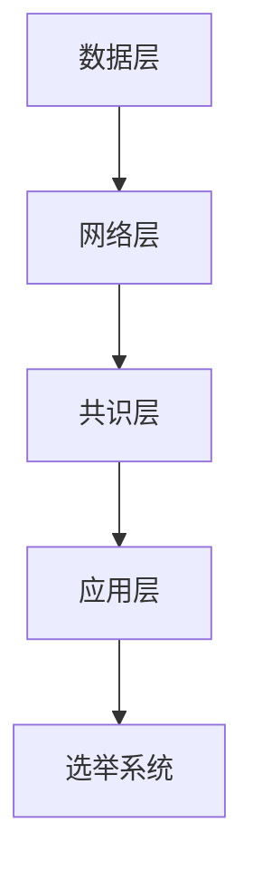

                 


## 《区块链在选举系统中的潜在应用》

> **关键词：** 区块链、选举系统、潜在应用、加密算法、智能合约、共识机制

> **摘要：** 本文深入探讨了区块链技术在选举系统中的潜在应用，分析了其增强选举安全性、提高透明度和降低成本的优势。通过详细阐述核心算法原理、设计思路、实际应用案例和安全性分析，本文旨在为区块链在选举系统中的实践提供理论支持和实际指导。

---

### 设计思路

设计一篇关于《区块链在选举系统中的潜在应用》的技术博客，需要遵循以下设计思路：

1. **引言**：首先，我们需要介绍区块链技术的基本概念和在选举系统中的潜在应用。

2. **区块链技术基础**：接着，详细介绍区块链技术的核心算法原理，如加密算法、共识机制等，并使用Python源代码和LaTeX数学公式进行详细讲解。

3. **选举系统概述**：随后，描述选举系统的基本概念、类型及其面临的挑战。

4. **区块链在选举系统中的应用案例**：分析区块链在选举系统中的具体应用案例，如智能投票系统、透明选举系统等。

5. **区块链选举系统的设计**：详细讨论区块链选举系统的架构设计、技术选型和实施与测试。

6. **区块链选举系统的安全性分析**：分析区块链选举系统面临的安全性挑战，并提出相应的解决方案。

7. **区块链选举系统的未来发展**：探讨区块链技术在选举系统中的未来发展趋势和潜在应用场景。

8. **总结与展望**：最后，对全文进行总结，并提出未来研究方向和注意事项。

---

### 第1章：区块链技术基础

#### 1.1 区块链概述

区块链是一种分布式账本技术，它通过加密算法和共识机制确保数据的安全性和不可篡改性。区块链的基本架构包括数据层、网络层、共识层和应用层。

#### 1.2 Mermaid流程图：区块链在选举系统中的架构



#### 1.3 核心算法原理讲解

##### 1.3.1 非对称加密算法

```python
from Crypto.PublicKey import RSA
from Crypto.Cipher import PKCS1_OAEP

# 生成密钥对
key = RSA.generate(2048)
private_key = key.export_key()
public_key = key.publickey().export_key()

# 加密
cipher = PKCS1_OAEP.new(RSA.import_key(public_key))
encrypted_message = cipher.encrypt(b"Hello, World!")

# 解密
cipher = PKCS1_OAEP.new(RSA.import_key(private_key))
decrypted_message = cipher.decrypt(encrypted_message)
```

##### 1.3.2 拉格朗日插值法

```latex
L(x) = \sum_{i=1}^n a_i y_i
```

##### 1.3.3 伪代码示例：智能合约

```python
def contract_logic():
    if condition_check():
        action()
```

---

### 第2章：选举系统概述

#### 2.1 选举系统基本概念

选举系统是指用于组织、管理和执行选举过程的系统。选举系统可以分为电子选举系统、纸质选举系统和混合选举系统。

#### 2.2 区块链在选举系统中的应用案例

区块链技术可以增强选举系统的安全性、提高透明度和降低成本。

#### 2.3 实际应用中的区块链选举系统

智能投票系统和透明选举系统是区块链技术在选举系统中的两个主要应用。

---

### 第3章：区块链选举系统的设计

#### 3.1 系统架构设计

区块链选举系统的架构包括数据层、网络层、共识层和应用层。

#### 3.2 技术选型

技术选型包括区块链平台选型、编程语言选型和开发工具选型。

#### 3.3 系统实施与测试

系统实施与测试包括系统部署、功能测试和性能测试。

---

### 第4章：区块链选举系统的安全性分析

#### 4.1 安全性挑战

区块链选举系统面临的安全挑战包括拒绝服务攻击、智能合约漏洞和数据隐私保护。

#### 4.2 安全性解决方案

安全性解决方案包括安全审计、加密算法优化和防护机制。

#### 4.3 安全性案例分析

案例分析包括典型攻击案例和安全防护措施。

---

### 第5章：区块链选举系统的未来发展

#### 6.1 技术趋势分析

区块链技术在选举系统中的未来发展趋势包括区块链技术的发展、应用前景和与其他技术的融合。

#### 6.2 法律法规挑战

法律法规挑战包括区块链选举的法律框架、数据保护法规和国际合作与标准制定。

#### 6.3 未来应用场景

未来应用场景包括智能投票系统、透明选举平台和安全认证系统。

---

### 总结与展望

区块链技术在选举系统中的应用具有巨大的潜力。通过本文的深入探讨，我们为区块链在选举系统中的实践提供了理论支持和实际指导。未来，随着技术的不断发展和法规的完善，区块链将在选举系统中发挥越来越重要的作用。

**作者：AI天才研究院/AI Genius Institute & 禅与计算机程序设计艺术 /Zen And The Art of Computer Programming**

