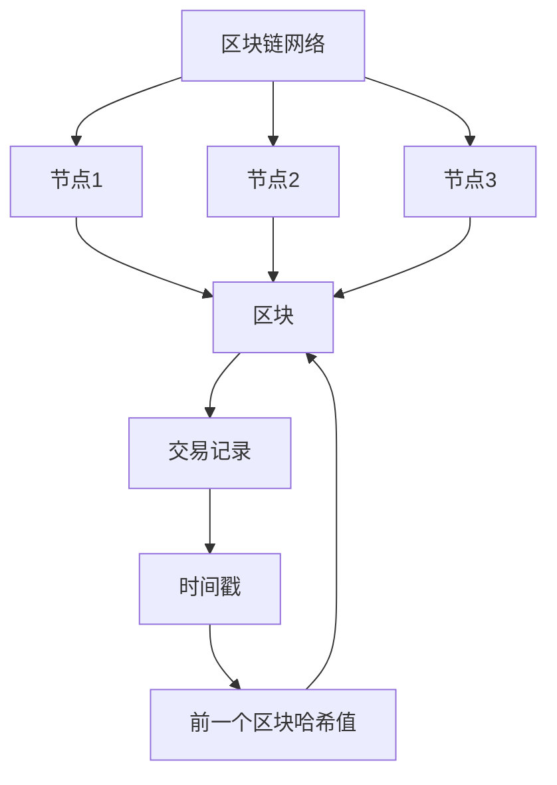

                 

### 文章标题

区块链在食品溯源中的应用

### 关键词

区块链、食品溯源、智能合约、食品安全、透明性、可追溯性

### 摘要

随着区块链技术的快速发展，其在食品溯源领域的应用逐渐受到广泛关注。本文将深入探讨区块链在食品溯源中的应用，分析其核心技术原理、系统设计、实施过程以及面临的挑战和未来发展趋势。通过本文的阅读，读者将全面了解区块链在提高食品安全和透明度方面的巨大潜力。

## 第一部分：区块链基础

### 第1章 区块链概述

区块链，作为一种分布式账本技术，其核心理念在于去中心化和不可篡改。它通过将数据分散存储在多个节点上，形成一个链式数据结构，使得每一笔交易都能被全网所有节点共同验证和记录。这种技术不仅提高了数据的透明度和安全性，还减少了中介环节，降低了交易成本。

#### 1.1 区块链的定义

区块链是一种去中心化的数据库，由一系列按时间顺序排列的“区块”组成。每个区块包含一定数量的交易记录，这些交易记录经过全网节点的验证和确认后，会被添加到区块链中，形成一条链式结构。区块链的每一个区块都包含了前一个区块的哈希值，这使得区块链具有高度的安全性和不可篡改性。

#### 1.2 区块链的核心特性

区块链具有以下几个核心特性：

1. **去中心化**：区块链没有中央控制机构，所有节点都在平等的基础上参与网络的运行和维护。
2. **不可篡改**：一旦数据被记录到区块链中，就几乎无法被篡改，保证了数据的完整性和可靠性。
3. **透明性**：区块链上的数据是公开透明的，任何节点都可以访问和查看。
4. **安全性**：区块链采用了先进的加密算法，使得数据传输过程中具有很高的安全性。

#### 1.3 区块链的发展历程

区块链技术最早由中本聪（Satoshi Nakamoto）在2008年提出，其初衷是为了创造比特币（Bitcoin）这种去中心化的数字货币。自比特币问世以来，区块链技术得到了迅速发展，并逐渐应用于各个领域，包括金融、医疗、供应链管理等。在食品溯源领域，区块链技术以其独特的优势，逐渐成为提高食品安全和透明度的重要工具。

### 第2章 区块链技术原理

#### 2.1 哈希算法

哈希算法是区块链技术中的核心组件之一。它通过将输入数据转换为一个固定长度的字符串，保证了数据的唯一性和不可篡改性。常见的哈希算法包括SHA-256、MD5等。

#### 2.2 链式区块结构

区块链由一系列按时间顺序排列的区块组成。每个区块包含一定的交易记录、一个时间戳和一个前一个区块的哈希值。这种链式结构使得区块链具有高度的安全性和可追溯性。

#### 2.3 智能合约

智能合约是区块链上的自执行合同，其代码被写入区块链中，一旦触发条件，就会自动执行。智能合约使得区块链在去中心化的环境下，能够实现复杂的业务逻辑。

#### 2.4 区块链架构 Mermaid 流程图

### 第3章 食品溯源中的区块链应用

#### 3.1 食品溯源的概念

食品溯源是指通过追踪食品的生产、加工、运输、销售等环节，实现对食品来源和流向的追踪和记录。食品溯源有助于提高食品安全，防止食品污染和欺诈行为。

#### 3.2 食品溯源中的问题

当前食品溯源领域存在以下问题：

1. **数据分散**：食品生产、加工、运输等环节涉及多个参与者，数据分散在不同系统，难以统一管理和追踪。
2. **数据篡改**：数据在传输过程中可能被篡改，导致溯源信息失真。
3. **信任缺失**：消费者对食品溯源信息的真实性和可靠性持怀疑态度。

#### 3.3 区块链在食品溯源中的应用

区块链技术可以解决食品溯源中的问题，提高食品的透明度和可追溯性。以下为区块链在食品溯源中的具体应用：

1. **数据整合**：区块链可以将食品生产、加工、运输等环节的数据整合到一个分布式账本中，实现数据的统一管理和追踪。
2. **数据安全**：区块链采用加密算法，确保数据在传输过程中不被篡改。
3. **信任建立**：区块链上的数据是公开透明的，任何节点都可以访问和验证，从而增强消费者对食品溯源信息的信任。

## 第二部分：区块链在食品溯源中的应用实践

### 第4章 食品溯源区块链系统设计

#### 4.1 系统架构设计

食品溯源区块链系统包括以下主要组件：

1. **数据采集模块**：负责收集食品生产、加工、运输等环节的数据。
2. **区块链节点**：负责存储和验证数据。
3. **智能合约**：负责实现数据存储和验证的逻辑。

#### 4.2 数据结构设计

食品溯源区块链中的数据结构包括：

1. **区块**：包含一定数量的交易记录、时间戳和前一个区块的哈希值。
2. **交易记录**：记录食品生产、加工、运输等环节的数据。
3. **智能合约**：定义数据存储和验证的逻辑。

#### 4.3 智能合约设计

智能合约的设计需要考虑以下关键要素：

1. **数据格式**：确定交易记录的数据格式。
2. **数据验证**：实现数据的验证逻辑，确保数据的真实性和完整性。
3. **事件触发**：定义事件触发条件，实现自动执行。

### 第5章 食品溯源区块链平台搭建

#### 5.1 硬件环境搭建

搭建食品溯源区块链平台需要以下硬件设备：

1. **服务器**：用于部署区块链节点。
2. **存储设备**：用于存储区块链数据。

#### 5.2 软件环境搭建

搭建食品溯源区块链平台需要以下软件环境：

1. **区块链节点软件**：如Hyperledger Fabric、Ethereum等。
2. **开发工具**：如Node.js、Python等。

#### 5.3 部署与调试

部署与调试食品溯源区块链平台需要以下步骤：

1. **安装区块链节点软件**：在服务器上安装区块链节点软件。
2. **配置节点**：配置节点参数，如节点名称、端口等。
3. **启动节点**：启动区块链节点。
4. **测试与调试**：进行测试和调试，确保平台正常运行。

### 第6章 食品溯源数据管理

#### 6.1 数据采集

数据采集包括以下步骤：

1. **确定数据来源**：确定食品生产、加工、运输等环节的数据来源。
2. **采集数据**：使用传感器、扫描器等设备采集数据。
3. **数据预处理**：对采集到的数据进行清洗和格式化。

#### 6.2 数据存储

数据存储包括以下步骤：

1. **设计数据结构**：设计符合区块链要求的数据结构。
2. **存储数据**：将预处理后的数据存储到区块链中。
3. **备份与恢复**：对数据进行备份和恢复，确保数据安全。

#### 6.3 数据分析

数据分析包括以下步骤：

1. **数据清洗**：对存储在区块链中的数据进行分析和清洗。
2. **数据可视化**：将清洗后的数据转化为可视化图表。
3. **数据挖掘**：使用数据挖掘算法分析数据，提取有价值的信息。

### 第7章 食品溯源区块链安全性

#### 7.1 安全漏洞分析

食品溯源区块链平台可能面临以下安全漏洞：

1. **数据篡改**：恶意节点可能篡改区块链数据。
2. **节点攻击**：恶意节点可能对区块链网络进行攻击。
3. **智能合约漏洞**：智能合约可能存在漏洞，导致数据泄露或损失。

#### 7.2 防护措施

为了确保食品溯源区块链平台的安全性，可以采取以下防护措施：

1. **数据加密**：对区块链数据进行加密，防止数据泄露。
2. **权限控制**：实施严格的权限控制，限制对区块链数据的访问。
3. **安全审计**：定期进行安全审计，发现并修复漏洞。

#### 7.3 应对策略

针对可能的安全威胁，可以采取以下应对策略：

1. **防范数据篡改**：采用多重签名等技术，确保数据不可篡改。
2. **防范节点攻击**：采用分布式网络架构，提高网络抗攻击能力。
3. **防范智能合约漏洞**：进行智能合约审计，确保合约安全。

### 第8章 区块链在食品溯源中的未来发展趋势

#### 8.1 新技术应用

未来，区块链在食品溯源领域的应用将更加广泛，新技术将不断涌现。例如，结合物联网（IoT）技术，实现实时数据采集和传输，提高食品溯源的效率。

#### 8.2 行业规范

随着区块链技术的普及，食品溯源领域将制定更多的行业规范，确保区块链技术的规范化和标准化。

#### 8.3 潜在挑战

区块链在食品溯源领域的应用面临以下挑战：

1. **技术成熟度**：区块链技术仍处于发展初期，技术成熟度有待提高。
2. **隐私保护**：在保证数据透明度的同时，如何保护个人隐私是一个重要问题。
3. **政策支持**：政策支持是区块链技术在食品溯源领域发展的关键因素。

### 第9章 区块链在食品溯源中的应用前景

#### 9.1 社会价值

区块链技术在食品溯源领域的应用，有助于提高食品安全，保障消费者权益，具有巨大的社会价值。

#### 9.2 经济效益

区块链技术在食品溯源领域的应用，可以降低食品生产和流通成本，提高供应链效率，带来显著的经济效益。

#### 9.3 政策支持

政府对于区块链技术的支持，将促进其在食品溯源领域的广泛应用，推动食品安全监管体系的完善。

### 附录

#### 附录A：常见问题解答

- **Q：区块链在食品溯源中的优势是什么？**
  **A：区块链在食品溯源中的优势主要包括去中心化、不可篡改、数据透明性等，能够提高食品的追溯性和安全性。**

- **Q：区块链技术在食品溯源中面临哪些挑战？**
  **A：区块链技术在食品溯源中面临的挑战主要包括技术成熟度、隐私保护、政策支持等。**

#### 附录B：参考资料

- **[1]** 区块链技术概述，https://www.blockchain.org.cn/
- **[2]** 食品溯源中的区块链应用，https://www.ibm.com/zh-cn/ibm-blockchain/food-traceability
- **[3]** 区块链与食品安全，https://www.foodnomy.com/blockchain-food-safety/

### 作者信息

作者：AI天才研究院/AI Genius Institute & 禅与计算机程序设计艺术/Zen And The Art of Computer Programming

---

本文通过逐步分析区块链在食品溯源中的应用，从基础概念到实际应用，再到未来发展趋势，全面展示了区块链技术在提高食品安全和透明度方面的巨大潜力。希望本文能够为读者提供有价值的参考，推动区块链技术在食品溯源领域的进一步发展。

