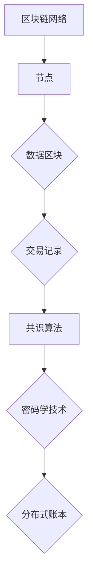

                 

### 摘要

本文深入探讨了区块链技术在数字资产管理中的创新应用。首先，我们介绍了区块链的基本概念、历史背景和关键特性，如去中心化、透明性和安全性。接着，我们探讨了数字资产的定义、类型及其在现代经济中的作用，以比特币为例展示了区块链技术的实际影响。随后，文章重点分析了区块链在数字资产管理中的应用，包括数字货币、智能合约和分布式身份验证等方面。通过具体的案例分析和代码示例，我们详细阐述了区块链技术在数字资产管理中的实际操作和潜在优势。文章还提供了最佳实践建议，并总结了区块链技术在数字资产管理中的未来发展前景。通过这篇文章，读者将全面了解区块链技术在数字资产管理中的创新应用及其带来的变革性影响。

### 关键词

区块链技术、数字资产管理、去中心化、透明性、安全性、智能合约、分布式身份验证、数字货币、比特币、加密算法、共识机制、分布式账本。

## 第一部分：区块链技术基础

### 1. 区块链概述

区块链是一种分布式数据库技术，它通过将数据分散存储在多个节点上，实现去中心化的数据管理和安全性。区块链技术最早由中本聪（Satoshi Nakamoto）在2008年提出，旨在创建一种不需要中央机构信任的数字货币——比特币（Bitcoin）。从那以后，区块链技术得到了广泛的关注和应用。

#### 1.1 定义和历史背景

区块链的基本定义是一个分布式账本，它记录了一系列按时间顺序排列的数据区块，每个区块都通过密码学技术链接在一起。这种链接方式保证了数据的不可篡改性，从而实现了数据的安全性和透明性。

区块链的起源可以追溯到2008年中本聪发表的比特币白皮书《比特币：一种点对点的电子现金系统》。该白皮书提出了一种基于密码学的去中心化数字货币系统，这一创新概念引发了广泛关注，并促成了比特币的诞生。随着比特币的成功，区块链技术逐渐从金融领域扩展到其他行业，如供应链管理、医疗保健和数字资产管理等。

#### 1.2 关键特性

区块链技术具有以下几个关键特性：

1. **去中心化**：区块链不需要中央机构或第三方中介，所有的数据都是由网络中的多个节点共同维护和验证。这种方式提高了系统的可靠性和容错能力。
   
2. **透明性**：区块链上的所有数据都是公开透明的，任何人都可以访问和查看账本上的交易记录。这有助于增加系统的信任度，减少欺诈行为。
   
3. **安全性**：区块链采用密码学技术确保数据的安全性和完整性。每个区块都通过密码学哈希函数链接，一旦数据被写入区块链，就几乎不可能被篡改。

4. **不可篡改性**：由于区块链的链接特性，任何修改都会导致后续的区块失去链接，从而被网络中的其他节点拒绝。这使得区块链上的数据具有高度的可靠性。

#### 1.3 Mermaid图：区块链架构

以下是一个使用Mermaid绘制的区块链架构示意图：

在这个示意图中，区块链网络由多个节点组成，每个节点都维护一个副本的分布式账本。数据区块包含交易记录，通过共识算法和密码学技术确保整个系统的安全性。

通过以上内容，我们对区块链技术的基本概念和历史有了初步的了解。在接下来的章节中，我们将进一步探讨区块链技术在数字资产管理中的应用，并详细分析其核心概念和原理。

### 2. 理解数字资产

数字资产是一种以数字形式存在的资产，它可以代表实物资产或虚拟资产。随着区块链技术的发展，数字资产的应用场景日益广泛。理解数字资产的概念、类型和它们在现代经济中的作用，对于探讨区块链技术在数字资产管理中的创新应用至关重要。

#### 2.1 数字资产的定义和类型

数字资产的定义相对宽泛，它涵盖了各种以数字形式存在的有价值的信息或物品。根据不同的分类标准，数字资产可以分为以下几种类型：

1. **虚拟货币**：如比特币、以太坊等，它们是一种去中心化的数字货币，具有货币的属性，可以在网络中进行交易和支付。
   
2. **代币**：代币是一种代表特定权益或资产的数字标记，通常用于区块链平台或去中心化应用程序中。根据其功能，代币可以分为实用代币（Utility Tokens）和权益代币（Security Tokens）。
   
3. **数字艺术品**：如数字画作、音乐作品、电影等，通过区块链技术确权并可以进行交易和收藏。
   
4. **数字身份**：通过区块链技术验证和存储个人身份信息，提高身份认证的效率和安全性。
   
5. **数字证书**：用于证明特定事件或成就的数字文档，如学历证书、医疗记录等。

#### 2.2 数字资产在现代经济中的作用

数字资产在现代经济中发挥着越来越重要的作用，其主要体现在以下几个方面：

1. **金融创新**：数字资产的出现为传统金融体系带来了新的机遇和挑战。例如，通过区块链技术，可以创建去中心化的金融产品，如去中心化金融（DeFi）应用，从而降低金融中介的成本，提高金融服务的效率。

2. **资产流通性**：数字资产使得资产流通变得更加便捷。例如，数字艺术品可以通过区块链平台进行快速交易，从而提升市场的流通性和透明度。

3. **隐私保护**：通过区块链技术，用户可以拥有更高的隐私保护，因为区块链上的数据是加密的，并且不可篡改。这为个人和企业提供了更安全的数据存储和交换方式。

4. **供应链管理**：数字资产可以用于供应链管理的各个环节，如追踪产品的来源、确保物流的透明性等。这有助于提高供应链的效率和可靠性。

5. **身份验证**：数字资产可以用于身份验证和权限管理，如通过区块链技术验证个人的身份信息或访问特定系统和服务。

#### 2.3 案例分析：比特币及其影响

比特币是第一种数字货币，也是区块链技术最具代表性的应用之一。自2009年诞生以来，比特币经历了快速的发展和广泛的关注。

1. **比特币的基本原理**：

   比特币是基于区块链技术的去中心化数字货币，通过密码学算法确保安全性。比特币网络通过共识机制（如工作量证明Proof of Work）来确认交易，并将交易记录在区块链上。

2. **比特币的影响**：

   - **金融体系**：比特币的出现挑战了传统金融体系，尤其是中央银行的货币发行权。它为去中心化金融（DeFi）的发展提供了基础。
   - **技术创新**：比特币的成功激发了其他数字货币和区块链项目的发展，推动了金融科技（FinTech）的进步。
   - **市场波动**：比特币的价格波动引发了市场的广泛关注，也带来了投资风险。

通过以上分析，我们理解了数字资产的定义、类型和其在现代经济中的作用。接下来，我们将进一步探讨区块链技术在数字资产管理中的应用，分析其核心概念和实际操作。

### 3. 区块链在数字资产管理中的应用

区块链技术在数字资产管理中的应用越来越广泛，其核心概念包括数字货币、智能合约和分布式身份验证等。这些应用不仅提升了资产管理的效率和安全性，还带来了新的商业模式和创新机会。

#### 3.1 数字货币

数字货币是区块链技术最直接的应用之一。它通过区块链网络实现去中心化的货币交易，避免了传统金融体系中的中介环节。以下是一些数字货币的核心概念和特性：

1. **去中心化**：数字货币通过区块链网络分布式存储，不依赖于中央机构或第三方中介。这使得交易更加透明、快捷，减少了中介成本。
   
2. **安全性**：数字货币的交易记录存储在区块链上，通过密码学技术保证数据的不可篡改性和安全性。这使得数字货币在安全性和隐私保护方面具有显著优势。
   
3. **智能合约**：许多数字货币平台集成了智能合约功能，用户可以通过编写智能合约来自动执行交易规则。例如，以太坊（Ethereum）是一个支持智能合约的区块链平台，用户可以在其上创建和部署智能合约。

4. **跨境支付**：数字货币使得跨境支付变得更加便捷和低成本。传统的跨境支付往往涉及多个中介和较高的手续费，而数字货币可以直接在区块链上进行点对点支付。

案例：比特币（Bitcoin）是第一种成功的数字货币。自2009年诞生以来，比特币已经形成了一个庞大的生态系统，包括交易市场、交易所和钱包服务。比特币的成功证明了区块链技术在数字货币领域的巨大潜力。

#### 3.2 智能合约

智能合约是区块链技术的重要创新之一，它通过计算机代码自动执行合同条款。智能合约的核心概念包括：

1. **自动化执行**：智能合约在满足特定条件时自动执行，无需人工干预。例如，如果买家付款，卖家就会自动释放商品。
   
2. **不可篡改性**：智能合约的代码一旦部署在区块链上，就几乎不可更改。这保证了合约条款的执行一致性。
   
3. **去中心化**：智能合约运行在区块链上，不依赖于任何中央机构。这使得智能合约更加透明、公正和可信。

4. **多用途**：智能合约不仅限于金融交易，还可以用于供应链管理、版权保护、投票系统等多个领域。

案例：以太坊（Ethereum）是一个支持智能合约的区块链平台，用户可以在其上创建和部署智能合约。以太坊的成功展示了智能合约在数字资产管理和其他领域的广泛应用潜力。

#### 3.3 分布式身份验证

分布式身份验证是区块链技术在数字资产管理中的另一个重要应用。它通过区块链技术实现身份信息的去中心化管理和验证，提高了身份认证的安全性和效率。以下是一些关键概念：

1. **去中心化身份验证**：分布式身份验证不依赖于中央身份验证机构，而是通过区块链网络中的多个节点共同验证身份信息。这使得身份验证更加安全、透明和难以篡改。
   
2. **身份信息加密**：区块链上的身份信息通过密码学技术加密，确保只有授权用户可以访问。这提高了身份认证的隐私保护。
   
3. **互操作性**：分布式身份验证使得不同系统之间的身份信息交换变得更加便捷。例如，一个用户可以在不同的区块链应用中使用相同的身份信息进行认证。

4. **多因素认证**：分布式身份验证可以通过多种方式（如密码学证明、生物识别等）实现多因素认证，提高了安全性。

案例：Chainlink（Chainlink Labs）是一个区块链平台，它提供了分布式身份验证解决方案。Chainlink的解决方案已经被多个应用场景采用，如金融服务、医疗保健和供应链管理等。

通过以上分析，我们可以看到区块链技术在数字资产管理中的应用具有显著的优势和潜力。在接下来的部分，我们将结合具体案例，深入探讨区块链技术在数字资产管理中的实际操作和潜在优势。

#### 3.4 案例分析：数字资产管理平台与应用

为了更好地理解区块链技术在数字资产管理中的应用，我们可以通过几个实际案例来进行分析。这些案例展示了区块链技术如何提高资产管理的效率和安全性，同时也揭示了其潜在的挑战和未来发展方向。

**案例1：加密货币交易所**

加密货币交易所是区块链技术在数字资产管理中最典型的应用之一。例如，Binance、Coinbase等知名交易所利用区块链技术提供安全、高效和透明的交易服务。

- **技术架构**：这些交易所通常基于以太坊、比特币等区块链平台，使用智能合约来管理用户资产和交易流程。智能合约确保了交易过程的自动化和不可篡改性。
- **优势**：通过区块链技术，加密货币交易所可以提供更低的交易成本、更快的交易速度和更高的安全性。用户资产的安全性得到了显著提升，因为区块链上的交易记录不可篡改，且分布式存储。
- **挑战**：尽管区块链技术带来了很多优势，但加密货币交易所仍然面临一些挑战，如市场波动、监管合规等。此外，智能合约代码的安全性也是一个重要问题，一旦出现漏洞，可能导致严重后果。

**案例2：供应链管理**

区块链技术在供应链管理中的应用逐渐增多，通过追踪产品来源、确保物流透明性和提高供应链的效率。

- **技术架构**：在供应链管理中，区块链可以记录每一个环节的交易和物流信息。这些信息通过分布式账本进行存储和验证，保证了信息的不可篡改性和透明性。
- **优势**：通过区块链技术，供应链参与者可以实时查看产品的来源、运输过程和质量信息，提高了供应链的透明度和可追溯性。这有助于降低欺诈风险、提高产品品质和客户满意度。
- **挑战**：供应链管理的复杂性使得区块链技术的实施面临一些挑战。例如，不同企业之间的数据格式和系统兼容性问题，以及如何确保数据的准确性和及时性。

**案例3：数字身份验证**

数字身份验证是区块链技术应用的另一个重要领域。通过分布式身份验证，用户可以在不同应用和服务中安全、便捷地使用自己的身份信息。

- **技术架构**：数字身份验证基于区块链的分布式账本技术，用户可以在区块链上创建和管理自己的身份信息。这些信息通过加密和共识机制保证安全性和隐私性。
- **优势**：通过区块链技术，数字身份验证可以提供更高的安全性和隐私保护。用户无需重复填写身份信息，也不必担心个人信息泄露。这提高了用户体验，同时也降低了身份验证的成本。
- **挑战**：尽管区块链技术在数字身份验证中具有显著优势，但其普及和应用仍然面临一些挑战。例如，如何确保身份信息的真实性和可靠性，以及如何处理不同应用和系统之间的数据共享问题。

通过以上案例分析，我们可以看到区块链技术在数字资产管理中具有广泛的应用场景和显著的优势。然而，实现这些应用仍然面临一些技术、法律和运营上的挑战。在接下来的部分，我们将进一步探讨区块链技术在数字资产管理中的最佳实践和未来发展趋势。

#### 3.5 最佳实践和未来趋势

在区块链技术应用于数字资产管理的实践中，一些最佳实践经验可以帮助企业和机构更好地实现其目标。以下是一些关键的最佳实践和未来趋势：

**最佳实践：**

1. **风险管理**：在采用区块链技术进行数字资产管理时，必须进行全面的风险评估和管理。这包括对技术漏洞、市场波动和法律法规的考虑。例如，定期进行智能合约的安全审计，确保其无漏洞和潜在风险。

2. **合规性**：确保区块链应用符合相关法律法规是至关重要的。在全球范围内，不同国家和地区对数字资产和区块链技术的监管政策各异。企业需要遵守当地的法律规定，确保业务运营的合法性。

3. **用户教育**：提高用户对区块链技术和数字资产管理的认识和理解，有助于增强用户对系统的信任和满意度。这可以通过举办教育研讨会、发布用户指南和提供在线支持等方式实现。

**未来趋势：**

1. **更广泛的采用**：随着区块链技术的成熟和应用场景的拓展，越来越多的企业、机构和政府开始采用区块链技术进行数字资产管理。未来，区块链将不仅仅局限于金融领域，还将广泛应用于其他行业，如供应链管理、医疗保健和政府服务等。

2. **跨链技术**：跨链技术将不同区块链之间的数据传输和互操作性变得更为简便。这有助于构建一个更广泛的区块链生态系统，促进不同区块链平台之间的协作和应用整合。

3. **可扩展性和性能优化**：区块链技术的可扩展性和性能优化是一个持续的研究方向。未来的区块链系统需要能够处理更高的交易量，并提供更快的交易速度。这可以通过分层架构、状态通道和分片技术等方式实现。

4. **隐私保护**：随着对用户隐私保护的关注日益增加，区块链技术需要提供更强的隐私保护机制。这可以通过零知识证明（Zero-Knowledge Proofs）和同态加密（Homomorphic Encryption）等先进技术来实现。

通过以上最佳实践和未来趋势的分析，我们可以看到区块链技术在数字资产管理中的潜力和发展前景。随着技术的不断进步和应用的深入，区块链技术将继续推动数字资产管理的创新和变革。

### 总结与展望

区块链技术在数字资产管理中的应用已经展现出显著的优势和广泛的前景。通过去中心化、透明性和安全性等特性，区块链技术不仅提高了资产管理的效率，还带来了新的商业模式和创新机会。从数字货币、智能合约到分布式身份验证，区块链技术在各个应用场景中都有所体现，并且不断推动行业的发展。

展望未来，区块链技术在数字资产管理中的应用将更加深入和广泛。随着技术的不断成熟和跨链技术的应用，不同区块链平台之间的协作和互操作性将得到提升。同时，隐私保护和性能优化等关键问题也将得到进一步解决。然而，区块链技术在实际应用中仍面临一些挑战，如合规性、安全性、用户接受度等。这些问题需要通过技术创新、政策支持和行业合作来解决。

总之，区块链技术在数字资产管理中的应用前景广阔，它将为金融、供应链管理、医疗保健等多个领域带来深远的变革。通过持续的研究和实践，我们可以期待区块链技术在未来发挥更大的作用，推动数字资产管理的不断创新和进步。

### 结语

区块链技术在数字资产管理中的应用已经逐渐成为金融科技领域的重要趋势。从基础概念到实际应用，区块链技术为数字资产提供了前所未有的安全性、透明性和效率。本文通过详细分析区块链技术的核心概念、应用场景和未来趋势，展示了其在数字资产管理中的巨大潜力。

然而，区块链技术的应用仍然面临诸多挑战，如合规性问题、技术漏洞和用户接受度等。这些问题需要行业内外共同努力，通过技术创新、政策支持和合作来逐步解决。

在此，我们呼吁更多的企业和机构关注区块链技术，积极探索其在数字资产管理中的应用。通过不断的实践和探索，我们相信区块链技术将为数字资产管理带来更多的创新和变革。

**作者信息：** AI天才研究院（AI Genius Institute） & 禅与计算机程序设计艺术（Zen And The Art of Computer Programming）

