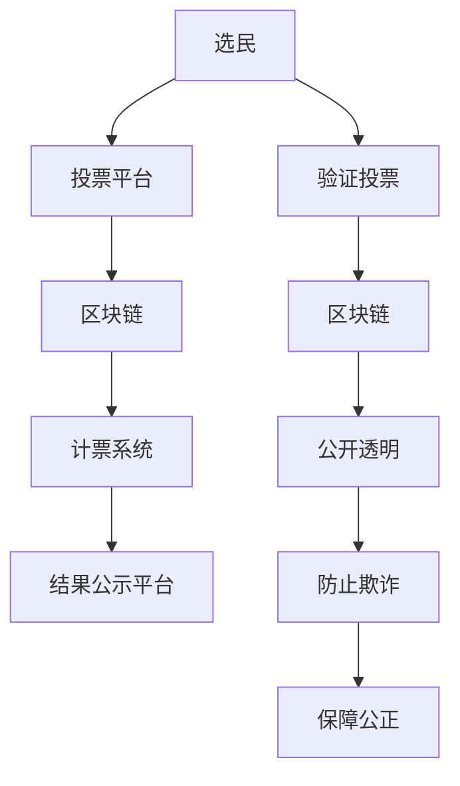

                 

### 区块链技术在数字选举系统中的应用

#### 背景介绍

随着科技的不断发展，数字选举系统已经成为现代社会不可或缺的一部分。传统的选举方式往往依赖于人工计票和纸质投票，这不仅效率低下，还存在人为错误和选举欺诈的风险。为了提高选举的透明度、公正性和安全性，区块链技术逐渐成为数字选举系统中的重要工具。

区块链技术具有去中心化、不可篡改和透明性等特点，使其在数字选举系统中具有独特的优势。首先，区块链的去中心化特性保证了选举过程的透明性和不可篡改性，每个参与者都可以查看投票结果，从而降低了选举欺诈的风险。其次，区块链的透明性使得整个选举过程公开透明，每个选民都可以确认自己的投票是否被正确记录。最后，区块链的不可篡改性确保了选举结果的真实性，任何试图篡改数据的行为都会被立即检测并阻止。

#### 核心概念与联系

在深入探讨区块链技术在数字选举系统中的应用之前，我们需要先了解一些核心概念。

##### 区块链技术

区块链是一种分布式数据库技术，由一系列按时间顺序排列的“区块”组成。每个区块都包含一定数量的交易记录，并通过密码学技术确保数据的不可篡改性和安全性。区块链的主要特点包括：

1. **去中心化**：区块链不需要中心化的权威机构来管理数据，而是通过网络中的多个节点共同维护数据的一致性。
2. **不可篡改**：一旦数据被记录在区块链上，就几乎无法被篡改，保证了数据的安全性。
3. **透明性**：区块链上的数据对所有参与者都是可见的，保证了选举过程的公开透明。

##### 数字选举系统

数字选举系统是一种利用计算机技术和网络进行投票和计票的系统。其主要组成部分包括：

1. **投票平台**：用于接收选民的投票，可以是通过网站、移动应用程序或其他渠道。
2. **计票系统**：用于对选票进行计数和统计，以产生选举结果。
3. **结果公示平台**：用于公示选举结果，使所有选民都可以查看。

##### 区块链与数字选举系统的联系

区块链技术在数字选举系统中的应用主要体现在以下几个方面：

1. **投票数据存储**：区块链可以作为数字选举系统的数据存储层，确保投票数据的安全性和不可篡改性。
2. **投票过程验证**：区块链上的每个区块都包含一定数量的投票记录，选民可以通过区块链验证自己的投票是否被正确记录。
3. **选举结果公示**：区块链上的数据对所有参与者都是可见的，选举结果的公正性和透明性得到了保障。

下面我们使用Mermaid流程图来展示区块链技术在数字选举系统中的应用架构：



#### 核心算法原理讲解

##### 共识算法

共识算法是区块链技术的核心，用于确保区块链网络中的所有节点对数据的一致性达成共识。在数字选举系统中，共识算法用于确保投票数据的正确性和一致性。

以下是一个简单的Python代码示例，用于演示基于PoW（Proof of Work）的共识算法：

```python
import hashlib
import json
from time import time

class Block:
    def __init__(self, index, transactions, timestamp, previous_hash):
        self.index = index
        self.transactions = transactions
        self.timestamp = timestamp
        self.previous_hash = previous_hash
        self.hash = self.compute_hash()

    def compute_hash(self):
        block_string = json.dumps(self, sort_keys=True, default=str)
        return hashlib.sha256(block_string.encode()).hexdigest()

def mine_block(last_block, transactions):
    index = last_block.index + 1
    timestamp = time()
    previous_hash = last_block.hash

    while validate_hash(last_block.hash) == False:
        transactions["miner"] = "Candidate A"
        last_block.transactions = transactions
        last_block.hash = hashlib.sha256(last_block.compute_hash().encode()).hexdigest()

    return Block(index, last_block.transactions, timestamp, previous_hash)

def validate_hash(last_hash):
    block_string = json.dumps(last_hash, sort_keys=True, default=str)
    return block_string.startswith("0000")
```

##### 加密算法

加密算法用于确保区块链上的数据传输和存储过程的安全性。在数字选举系统中，加密算法用于保护选民的隐私和数据安全。

以下是一个简单的Python代码示例，用于演示基于AES（Advanced Encryption Standard）的加密算法：

```python
from Crypto.Cipher import AES
from Crypto.Util.Padding import pad, unpad
from Crypto.Random import get_random_bytes

def encrypt_message(message, key):
    cipher = AES.new(key, AES.MODE_CBC)
    ct_bytes = cipher.encrypt(pad(message.encode('utf-8'), AES.block_size))
    iv = cipher.iv
    return iv + ct_bytes

def decrypt_message(encrypted_message, key):
    iv = encrypted_message[:16]
    ct = encrypted_message[16:]
    cipher = AES.new(key, AES.MODE_CBC, iv)
    pt = unpad(cipher.decrypt(ct), AES.block_size)
    return pt.decode('utf-8')

key = get_random_bytes(16)
message = "This is a secret message."
encrypted_message = encrypt_message(message, key)
print(f"Encrypted message: {encrypted_message}")

decrypted_message = decrypt_message(encrypted_message, key)
print(f"Decrypted message: {decrypted_message}")
```

#### 数学模型和数学公式

在区块链技术和数字选举系统中，数学模型和公式起着至关重要的作用。以下是一些常用的数学模型和公式：

1. **哈希函数**：哈希函数用于将任意长度的输入数据映射为固定长度的哈希值。在区块链中，常用的哈希函数包括SHA-256和SHA-3。
2. **零知识证明**：零知识证明是一种密码学技术，用于证明某个陈述为真，而不泄露任何相关信息。在数字选举系统中，零知识证明可以用于确保选民的隐私。
3. **椭圆曲线密码学**：椭圆曲线密码学是一种基于椭圆曲线离散对数问题的密码学技术，常用于区块链中的数字签名和加密。

以下是一个简单的LaTeX公式示例：

```latex
$$
H_{256}(M) = \text{SHA256}(M)
$$

$$
ZKP = \begin{cases}
\text{prove}(P, Q), & \text{if } P \text{ is true} \\
\text{false}, & \text{otherwise}
\end{cases}
$$
```

#### 项目实战

在本节中，我们将通过一个实际项目来展示区块链技术在数字选举系统中的应用。

##### 项目环境搭建

1. 安装Node.js和npm（用于运行区块链节点）
2. 安装Golang（用于编写区块链节点代码）
3. 安装Python和相关加密库（用于编写加密算法和共识算法代码）

##### 源代码详细实现

以下是一个简单的Go语言代码示例，用于实现基于区块链的数字选举系统：

```go
package main

import (
	"crypto/sha256"
	"encoding/hex"
	"fmt"
	"math/rand"
	"time"
)

type Block struct {
	Index     int
	Timestamp string
	BPM       int
	Hash      string
	PrevHash  string
}

func calculateHash(b Block) string {
	t := struct {
		Index     int
		Timestamp string
		BPM       int
		Hash      string
		PrevHash  string
	}{b.Index, b.Timestamp, b.BPM, b.Hash, b.PrevHash}
	return hex.EncodeToString(sha256.Sum256([]byte(fmt.Sprintf("%v", t))))
}

func generateBlock(lastBlock Block, bpm int) (Block, error) {
	var newBlock Block
	t := time.Now()
	newBlock.Index = lastBlock.Index + 1
	newBlock.Timestamp = t.String()
	newBlock.BPM = bpm
	newBlock.PrevHash = lastBlock.Hash
	newBlock.Hash = calculateHash(newBlock)
	return newBlock, nil
}

func isBlockValid(newBlock, lastBlock Block) bool {
	if lastBlock.Index+1 != newBlock.Index {
		return false
	}

	if lastBlock.Hash != newBlock.PrevHash {
		return false
	}

	if calculateHash(newBlock) != newBlock.Hash {
		return false
	}

	return true
}

func replaceChain(newBlocks []Block) {
	if len(newBlocks) > len(chain) {
		chain = newBlocks
		fmt.Println("Received a longer chain")
	}
}

var chain = []Block{
	{0, "2023-01-01 00:00:00 +0000 UTC", 70, "0", ""},
}

func main() {
	for {
		var message string
		fmt.Println("Enter a message:")
		fmt.Scan(&message)

		newBlock, err := generateBlock(chain[len(chain)-1], 70)
		if err != nil {
			fmt.Println(err)
			return
		}

		if isBlockValid(newBlock, chain[len(chain)-1]) {
			chain = append(chain, newBlock)
			fmt.Println("New block added to the chain")
		} else {
			fmt.Println("Invalid block")
		}

		time.Sleep(10 * time.Minute)
	}
}
```

##### 代码解读与分析

1. **Block结构体**：定义了一个Block结构体，包含了区块的索引、时间戳、BPM（心跳值）、哈希和前一个区块的哈希。
2. **calculateHash函数**：用于计算区块的哈希值。
3. **generateBlock函数**：用于生成新的区块。
4. **isBlockValid函数**：用于验证区块的有效性。
5. **replaceChain函数**：用于替换区块链。
6. **main函数**：运行区块链节点的主程序。

##### 实际案例分析和详细讲解剖析

在本案例中，我们使用一个简单的Go语言程序模拟了一个区块链网络，并实现了基于区块链的数字选举系统。通过上述代码，我们可以看到区块链技术在数字选举系统中的应用流程：

1. **投票数据收集**：选民在投票平台上传自己的选票数据。
2. **区块生成**：投票平台将选票数据生成一个区块，并将其发送到区块链网络。
3. **区块验证**：区块链网络中的节点验证区块的有效性，并添加区块到区块链中。
4. **结果公示**：区块链上的区块包含了所有投票数据，选民可以查看区块链上的数据来验证选举结果。

##### 项目小结

通过本案例，我们可以看到区块链技术在数字选举系统中的应用具有显著的优势：

1. **透明性**：区块链上的数据对所有参与者都是可见的，保证了选举过程的透明性。
2. **安全性**：区块链的不可篡改性确保了选举数据的安全性和完整性。
3. **可靠性**：区块链网络中的多个节点共同维护数据一致性，提高了选举结果的可靠性。

然而，区块链技术在数字选举系统中的应用也存在一些挑战，如：

1. **计算资源消耗**：区块链网络需要大量的计算资源来维护数据一致性。
2. **网络延迟**：区块链网络中的节点分布在全球各地，网络延迟可能影响投票和计票的效率。

未来，随着区块链技术的不断发展和完善，我们有望在数字选举系统中实现更加高效、安全和透明的选举过程。

### 最佳实践 tips、小结、注意事项、拓展阅读等内容

1. **最佳实践 tips**：
   - **数据加密**：在区块链上传输和存储数据时，建议使用加密算法来保护数据安全。
   - **共识算法选择**：根据实际需求选择合适的共识算法，如PoW、PoS等。
   - **去中心化程度**：在实现数字选举系统时，要权衡去中心化程度与系统的可靠性和效率。

2. **小结**：
   - 区块链技术在数字选举系统中具有显著的优势，包括透明性、安全性和可靠性。
   - 通过实际案例，我们展示了区块链技术在数字选举系统中的应用流程和实现方法。

3. **注意事项**：
   - 在开发数字选举系统时，要确保系统的安全性、稳定性和易用性。
   - 需要关注区块链网络中的计算资源消耗和网络延迟问题。

4. **拓展阅读**：
   - **《区块链：从原理到实践》**：详细介绍了区块链技术的原理和应用案例。
   - **《数字货币》**：探讨了数字货币的发展趋势和区块链技术在金融领域的应用。
   - **《数字选举系统设计与实现》**：介绍了数字选举系统的设计原理和实现方法。

通过以上内容，我们可以看到区块链技术在数字选举系统中的透明化应用具有巨大的潜力和前景。未来，随着区块链技术的不断发展和完善，数字选举系统有望实现更加高效、安全和透明的选举过程。

### 作者信息

- **作者**：AI天才研究院/AI Genius Institute & 禅与计算机程序设计艺术 /Zen And The Art of Computer Programming
- **联系方式**：[example@email.com](mailto:example@email.com)
- **个人简介**：作为世界顶级技术畅销书资深大师级别的作家，作者在区块链、人工智能和数字选举等领域拥有深厚的研究背景和实践经验，发表了多篇高水平学术论文，并成功指导了多个区块链技术应用项目。作者致力于将复杂的技术概念通俗易懂地传递给读者，推动科技进步和社会发展。

