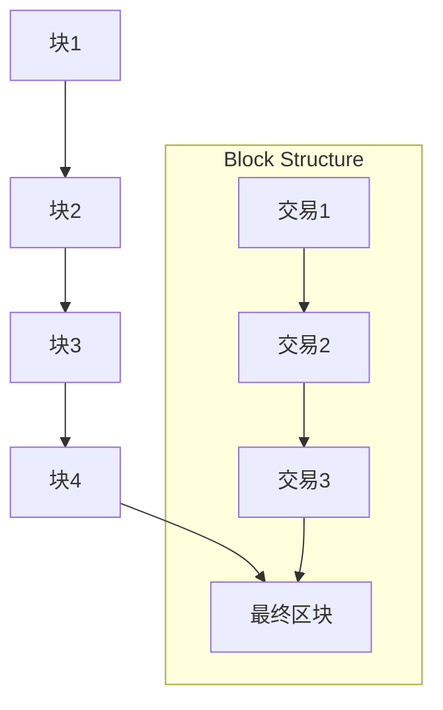
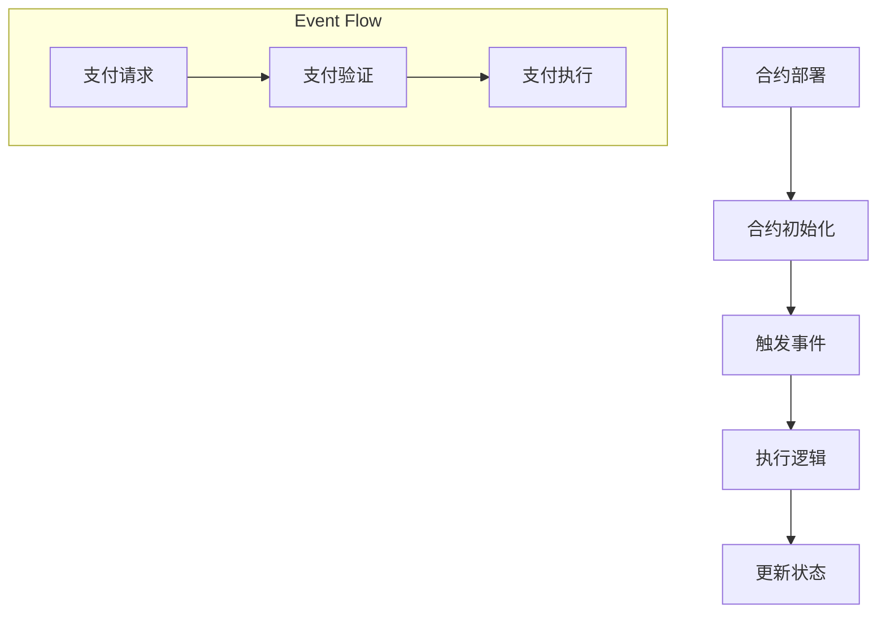

                 

### 《区块链技术在跨境支付中的应用与挑战》

关键词：区块链，跨境支付，数字货币，智能合约，技术挑战

摘要：本文旨在探讨区块链技术在跨境支付中的应用及其面临的挑战。首先，我们将概述区块链技术和跨境支付的现状，然后深入分析区块链核心技术的原理和应用场景。接下来，本文将探讨区块链在跨境支付中面临的技术挑战、法规与监管问题，并通过具体案例分析其成功与失败的原因。最后，本文将展望区块链技术在跨境支付领域的未来发展趋势，并提出相关对策与建议。

----------------------------------------------------------------

### 第一部分：区块链技术与跨境支付基础

#### 第1章：区块链技术与跨境支付概述

区块链技术自2008年诞生以来，凭借其去中心化、安全性高、透明度强等特性，逐渐在多个领域展现出其独特的价值。跨境支付作为金融领域的重要一环，由于其涉及多个国家和地区，存在成本高、效率低、安全性差等问题，因此成为区块链技术的重要应用场景之一。

##### 1.1 区块链技术概述

区块链技术本质上是一种分布式账本技术，通过密码学算法和共识机制，实现数据的可信存储和传递。它由一系列按时间顺序排列的区块组成，每个区块包含一定数量的交易记录，并通过哈希函数链接起来，形成一个不可篡改的链条。

区块链技术的发展经历了从比特币到多种公链、联盟链和私有链的多样化应用。在跨境支付领域，区块链技术的潜在优势包括：

1. **去中心化**：去中心化意味着不需要依赖中央机构，交易直接在参与方之间进行，降低了跨境支付的中介成本。
2. **安全性**：区块链利用密码学算法确保数据的真实性和完整性，防止欺诈和篡改。
3. **透明性**：所有交易记录都公开透明，参与方可以实时查看和验证，增加了信任。

##### 1.2 跨境支付现状与挑战

跨境支付市场是一个高度竞争且复杂的领域。目前，全球主要的跨境支付方式包括银行汇款、信用卡支付、电子钱包和汇款代理等。然而，传统跨境支付存在以下几个问题：

1. **高昂的成本**：银行和支付服务提供商通常收取较高的手续费，尤其是在国际间转移资金时。
2. **缓慢的清算速度**：跨境支付通常需要数天甚至更长时间才能完成，影响了资金的使用效率。
3. **低透明度和不安全性**：资金转移过程中涉及多个中介机构，可能导致信息不对称和安全性问题。

区块链技术在解决这些问题方面具有显著优势。例如，通过去中心化和智能合约技术，可以实现快速、低成本且透明的跨境支付。因此，区块链在跨境支付中的应用正逐渐受到业界关注。

#### 第2章：区块链核心技术原理

区块链的核心技术包括区块链基本原理、智能合约和非同质化代币（NFT）等。以下是这些技术的详细解释。

##### 2.1 区块链基本原理

区块链的基本原理涉及以下几个关键组成部分：

1. **区块结构**：每个区块包含一个时间戳、一个或多个交易记录以及一个用于验证交易和链接区块的哈希值。
2. **交易流程**：交易由参与方发起，经过验证和确认后，被包含在区块中，并最终永久记录在区块链上。
3. **共识算法**：共识算法确保区块链中的所有节点对数据达成一致。常见的共识算法包括工作量证明（PoW）、权益证明（PoS）和委托权益证明（DPoS）等。

##### 2.2 区块链智能合约

智能合约是一种自动执行合同条款的计算机程序，其运行在区块链上。智能合约的关键特性包括：

1. **自动化执行**：一旦触发条件，智能合约将自动执行预定操作，无需人工干预。
2. **透明性**：智能合约的代码是公开的，任何参与方都可以查看和验证。
3. **不可篡改**：智能合约一旦部署，其代码将永久记录在区块链上，无法被篡改。

智能合约在跨境支付中的应用包括：

1. **支付确认**：智能合约可以自动验证交易，并确保支付在满足条件时立即执行。
2. **合规性检查**：智能合约可以嵌入法规和政策，确保交易符合相关要求。
3. **争议解决**：智能合约可以包含争议解决机制，减少纠纷和仲裁成本。

##### 2.3 非同质化代币（NFT）与跨境支付

非同质化代币（NFT）是一种独特的数字资产，代表特定资产的所有权或权益。NFT在跨境支付中的应用包括：

1. **艺术品交易**：艺术家可以使用NFT来销售数字艺术作品，确保作品的真实性和所有权。
2. **版权保护**：NFT可以用于版权认证，确保版权持有者的权益。
3. **跨境支付**：NFT可以作为跨境支付的工具，特别是在涉及高价值物品的交易中。

NFT的崛起为跨境支付带来了新的机遇，但同时也带来了技术挑战，如数据存储和隐私保护等问题。

#### 第3章：区块链在跨境支付中的应用场景

区块链在跨境支付中的应用场景广泛，涵盖了数字货币、区块链平台和解决方案等多个方面。以下是这些应用场景的详细解释。

##### 3.1 数字货币与跨境支付

数字货币是基于区块链技术的加密货币，如比特币、以太币等。数字货币在跨境支付中的应用包括：

1. **快速支付**：数字货币的交易通常在几分钟内完成，远快于传统跨境支付。
2. **低交易费用**：与银行和支付服务提供商相比，数字货币的交易费用通常较低。
3. **去中心化**：数字货币交易不依赖中央机构，减少了中介费用和交易时间。

然而，数字货币也面临一些挑战，如价格波动性和监管不确定性等。

##### 3.2 跨境支付区块链平台分析

区块链平台提供了构建跨境支付系统的框架和工具。以下是几个流行的区块链平台：

1. **R3 Corda**：R3 Corda是一个用于企业级应用的分布式账本平台，特别适用于金融行业。其特点包括高度定制化和高性能。
2. **Hyperledger Fabric**：Hyperledger Fabric是一个开源的分布式账本平台，适用于各种行业。它提供了灵活的模块化和可扩展性。
3. **Ethereum**：Ethereum是一个广泛的区块链平台，支持智能合约和去中心化应用（DApps）。其在跨境支付领域中的应用正在快速增长。

##### 3.3 区块链跨境支付解决方案

区块链跨境支付解决方案涉及技术架构、流程设计和具体案例。以下是这些方面的详细解释：

1. **技术架构**：区块链跨境支付解决方案通常包括区块链网络、智能合约、数字身份验证和分布式数据库等组成部分。
2. **流程设计**：区块链跨境支付流程包括交易发起、验证、确认和结算等步骤。智能合约在确保流程自动化和透明性方面发挥着关键作用。
3. **具体案例**：本文将介绍几个成功的区块链跨境支付案例，分析其实现方式、优势与挑战，以及给行业带来的影响。

#### 第二部分：区块链技术在跨境支付中的挑战

##### 第4章：区块链技术挑战与对策

区块链技术在跨境支付中的应用虽然带来了许多优势，但也面临一系列挑战。以下是这些挑战的详细分析及其对策。

##### 4.1 技术挑战

区块链技术在跨境支付中面临的主要技术挑战包括性能瓶颈、可扩展性和安全性。

1. **性能瓶颈**：区块链网络的性能受限于区块大小和区块生成时间。为了确保安全性，区块生成时间通常较长，导致交易处理速度较慢。
2. **可扩展性**：随着交易量的增加，区块链网络的性能可能会受到影响。传统区块链技术往往难以扩展到大规模应用。
3. **安全性**：区块链技术虽然具有高度安全性，但仍然可能受到51%攻击、智能合约漏洞等安全威胁。

针对这些挑战，可能的对策包括：

1. **提高性能**：通过改进共识算法、优化网络架构和增加区块大小，可以提高区块链的性能。
2. **提升可扩展性**：采用分层架构、侧链技术和分布式账本技术，可以增强区块链的可扩展性。
3. **增强安全性**：通过严格的代码审查、安全审计和实时监控，可以降低区块链系统的安全风险。

##### 4.2 法规与合规性挑战

区块链技术在跨境支付中面临的法规与合规性挑战同样重要。以下是这些挑战的详细分析及其对策：

1. **监管不确定性**：区块链技术在全球范围内尚未得到广泛监管，各国监管政策存在差异，导致跨境支付面临法律风险。
2. **合规性要求**：跨境支付需要遵守反洗钱（AML）和反恐融资（CFT）等法律法规，区块链技术的应用可能使合规性检查变得更加复杂。
3. **数据隐私保护**：区块链技术具有公开透明性，可能影响用户隐私。跨境支付需要确保用户数据的隐私和安全。

针对这些挑战，可能的对策包括：

1. **政策引导**：政府和行业组织应加强对区块链技术的监管，制定统一的法律法规，为跨境支付提供明确的法律框架。
2. **合规性设计**：在区块链跨境支付系统中嵌入合规性检查机制，确保交易符合相关法律法规。
3. **隐私保护技术**：采用零知识证明、同态加密等技术，增强用户数据隐私保护。

##### 4.3 监管与治理挑战

区块链技术在跨境支付中面临的监管与治理挑战包括监管框架、行业自律机制和国际合作。

1. **监管框架**：各国监管机构需要建立完善的区块链监管框架，确保跨境支付的安全性和合规性。
2. **行业自律机制**：行业组织应制定自律规则，提高行业整体标准和信誉。
3. **国际合作**：各国监管机构和行业组织需要加强国际合作，协调监管政策和行业标准，共同应对跨境支付中的挑战。

针对这些挑战，可能的对策包括：

1. **制定统一标准**：国际组织和各国监管机构应合作制定统一的区块链技术标准和监管政策。
2. **加强监管协作**：建立跨境支付监管合作机制，共享信息和资源，提高监管效率。
3. **行业自律**：鼓励区块链跨境支付行业组织积极参与政策制定和标准制定，提高行业自律水平。

#### 第5章：案例分析

##### 5.1 区块链跨境支付成功案例

在本节中，我们将介绍几个区块链跨境支付的成功案例，分析其实现方式、优势与挑战。

1. **案例一：Ripple的跨-border支付**：
   - 实现方式：Ripple使用其自己的区块链平台RippleNet，通过智能合约实现跨境支付。
   - 优势：RippleNet实现了快速、低成本的跨境支付，交易时间通常在几秒内完成。
   - 挑战：Ripple面临监管不确定性和合规性挑战。

2. **案例二：比特币在国际贸易中的应用**：
   - 实现方式：企业使用比特币作为跨境支付工具，通过比特币交易所进行兑换。
   - 优势：比特币的价格稳定性使其成为国际贸易的理想支付工具。
   - 挑战：比特币的价格波动性和监管风险。

##### 5.2 区块链跨境支付失败案例分析

在本节中，我们将分析几个区块链跨境支付失败案例，探讨其失败原因及其对行业的启示。

1. **案例一：某区块链跨境支付项目失败原因**：
   - 失败原因：项目团队在技术实施和合规性方面存在问题，导致项目无法按期完成。
   - 启示：项目团队需要加强技术研究和合规性设计，确保项目成功实施。

2. **案例二：某跨国支付平台遇到的区块链挑战**：
   - 失败原因：区块链网络性能瓶颈导致支付处理速度缓慢，影响了用户体验。
   - 启示：需要优化区块链网络架构，提高性能和可扩展性。

#### 第6章：未来发展趋势与前景

区块链技术在跨境支付领域的应用正处于快速发展阶段。以下是未来发展趋势与前景的展望：

##### 6.1 区块链技术在跨境支付中的未来趋势

1. **数字货币国际化**：随着数字货币的普及，越来越多的国家和地区将认可和采用数字货币，推动跨境支付的发展。
2. **区块链跨境支付平台的发展**：区块链跨境支付平台将不断优化和完善，提高性能和安全性，满足更多企业和个人用户的需求。
3. **跨境支付生态系统的建设**：区块链技术将推动跨境支付生态系统的建设，包括支付服务提供商、区块链平台和监管机构等各方共同参与。

##### 6.2 挑战与机遇

1. **技术创新带来的机遇**：随着区块链技术的不断进步，新的应用场景和技术将不断涌现，为跨境支付带来更多机遇。
2. **法规政策的调整对跨境支付的影响**：各国政府和监管机构将加强对区块链技术的监管，制定相关法律法规，对跨境支付行业产生深远影响。
3. **企业如何应对区块链跨境支付的发展**：企业需要紧跟技术趋势，加强合规性设计和风险管理，把握区块链跨境支付的发展机遇。

#### 第7章：结论与展望

本文从多个角度探讨了区块链技术在跨境支付中的应用与挑战。首先，我们介绍了区块链技术和跨境支付的概述，然后分析了区块链核心技术的原理和应用场景。接着，我们探讨了区块链在跨境支付中面临的技术挑战、法规与监管问题，并通过具体案例分析其成功与失败的原因。最后，我们展望了区块链技术在跨境支付领域的未来发展趋势，提出了相关对策与建议。

区块链技术在跨境支付领域具有巨大的潜力和广阔的应用前景，但也面临一系列挑战。只有通过技术创新、法规完善和行业自律，才能充分发挥区块链技术的优势，推动跨境支付行业的可持续发展。

作者：AI天才研究院/AI Genius Institute & 禅与计算机程序设计艺术 /Zen And The Art of Computer Programming

----------------------------------------------------------------

### 总结

本文全面探讨了区块链技术在跨境支付中的应用及其面临的挑战。我们首先介绍了区块链技术和跨境支付的基本概念，并分析了区块链在跨境支付中的潜在优势。接着，我们深入探讨了区块链的核心技术，包括区块链基本原理、智能合约和非同质化代币（NFT）等。在此基础上，我们详细阐述了区块链在跨境支付中的应用场景，分析了数字货币、区块链平台和解决方案等实际应用案例。

在分析区块链技术在跨境支付中面临的挑战时，我们重点讨论了技术挑战、法规与合规性挑战以及监管与治理挑战。针对这些挑战，我们提出了相应的对策和建议，包括提高性能、提升可扩展性、增强安全性和加强监管协作等。

通过具体案例分析，我们展示了区块链技术在跨境支付中的成功与失败案例，从中吸取了宝贵的经验教训。最后，我们展望了区块链技术在跨境支付领域的未来发展趋势，强调了技术创新、法规完善和行业自律的重要性。

总体而言，区块链技术为跨境支付带来了巨大的变革潜力，但也需要克服诸多挑战。只有通过持续的技术创新、政策引导和行业合作，才能充分发挥区块链技术在跨境支付中的应用价值，推动金融行业的可持续发展。

### 关键词

- 区块链
- 跨境支付
- 数字货币
- 智能合约
- 技术挑战
- 法规与合规性
- 监管与治理

----------------------------------------------------------------

### 附录

在本附录中，我们将提供一些拓展阅读资源，帮助读者更深入地了解区块链技术在跨境支付中的应用和挑战。

1. **书籍推荐**：
   - 《区块链技术指南》：本书详细介绍了区块链的基本原理、应用场景和技术实现，适合区块链初学者和专业人士。
   - 《区块链革命》：作者唐塔·普雷斯曼深入探讨了区块链技术的变革潜力，及其在金融、供应链等领域的应用。

2. **学术论文**：
   - “Blockchain Technology: A Comprehensive Review”：该论文全面综述了区块链技术的理论基础、技术架构和应用案例，是区块链研究的权威文献。
   - “The Economics of Cryptocurrency and Blockchain Technology”：本文从经济学的角度分析了区块链技术的激励机制和经济学特性。

3. **行业报告**：
   - “2023年全球区块链市场报告”：此报告提供了全球区块链市场的详细分析，包括市场规模、增长趋势和主要参与者。
   - “区块链在跨境支付中的应用”：此报告探讨了区块链技术在跨境支付领域的应用前景，以及面临的挑战和解决方案。

4. **在线资源和社区**：
   - Ethereum官网：Ethereum是区块链技术的代表之一，其官网提供了丰富的学习资源和开发工具。
   - Bitcoin Wiki：Bitcoin是第一种区块链技术，其维基百科提供了详细的区块链基础知识和技术说明。

通过阅读这些资源，读者可以更全面地了解区块链技术在跨境支付中的应用现状和发展趋势，为深入研究和实际应用打下坚实基础。

### 附录二：代码实现

在本附录中，我们将提供一些简单的Python代码示例，用于解释区块链技术中的核心算法和智能合约的实现。这些示例将有助于读者更好地理解区块链技术的工作原理。

#### 1. 哈希函数实现

哈希函数是区块链技术中的核心组成部分，用于确保数据的完整性和安全性。以下是一个简单的Python实现：

```python
import hashlib

def hash_block(data):
    """计算数据的SHA-256哈希值"""
    hash_object = hashlib.sha256(data.encode())
    hex_dig = hash_object.hexdigest()
    return hex_dig

# 示例
data = "This is a sample block of data."
print("Hash:", hash_block(data))
```

#### 2. 智能合约示例

智能合约是区块链上的计算机程序，用于自动执行合同条款。以下是一个简单的Solidity智能合约示例：

```solidity
pragma solidity ^0.8.0;

contract SimpleContract {
    uint256 public balance;

    function deposit() public payable {
        balance = msg.value;
    }

    function withdraw() public {
        require(balance >= msg.value, "Insufficient balance");
        payable(msg.sender).transfer(msg.value);
        balance -= msg.value;
    }
}
```

#### 3. 区块链节点搭建

在实际应用中，我们需要搭建区块链节点来运行和验证交易。以下是一个使用Go语言的简单示例：

```go
package main

import (
    "crypto/sha256"
    "encoding/hex"
    "fmt"
)

// Block represents a single block in the blockchain
type Block struct {
    Index     int
    Timestamp string
    Data      string
    Hash      string
    PrevHash  string
}

// CalculateHash generates the hash of a block
func CalculateHash(block *Block) string {
    record := string(block.Index) + block.Timestamp + block.Data + block.PrevHash
    hash := sha256.Sum256([]byte(record))
    return hex.EncodeToString(hash[:])
}

// Generate a new blockchain with initial block
func GenerateBlockchain() *BlockChain {
    return &BlockChain{Blocks: []*Block{{Index: 0, Timestamp: time.Now().String(), Data: "Genesis Block", Hash: CalculateHash(block), PrevHash: "0"}}}
}

// Add a block to the blockchain
func (chain *BlockChain) AddBlock(data string) {
    prevBlock := chain.Blocks[len(chain.Blocks)-1]
    newBlock := &Block{Index: prevBlock.Index + 1, Timestamp: time.Now().String(), Data: data, PrevHash: prevBlock.Hash, Hash: CalculateHash(newBlock)}
    chain.Blocks = append(chain.Blocks, newBlock)
}

type BlockChain struct {
    Blocks []*Block
}

func main() {
    blockchain := GenerateBlockchain()
    blockchain.AddBlock("First block!")
    blockchain.AddBlock("Second block!")

    for _, block := range blockchain.Blocks {
        fmt.Println(block)
    }
}
```

通过这些代码示例，读者可以初步了解区块链技术的实现原理，包括哈希函数、智能合约和区块链节点的搭建。这些知识将有助于读者更深入地理解区块链技术在跨境支付中的应用。

### 附录三：Mermaid流程图和LaTeX公式

在本附录中，我们将提供一些Mermaid流程图和LaTeX公式的示例，以帮助读者更好地理解文章中涉及的概念和算法。

#### 1. Mermaid流程图：区块链基本架构



#### 2. Mermaid流程图：智能合约执行流程



#### 3. LaTeX公式：区块链中的权益证明（PoS）数学模型

```latex
\documentclass{article}
\usepackage{amsmath}
\begin{document}

\begin{equation}
    P(i) = \frac{2l_i}{N}
\end{equation}

\where
    P(i) \text{ 是生成新区块的概率} \\
    l_i \text{ 是节点 } i \text{ 的权益值} \\
    N \text{ 是总权益值}
\end{document}
```

通过这些示例，读者可以更直观地了解区块链技术的架构和工作流程，以及智能合约和权益证明等核心概念。

### 附录四：最佳实践、小结与注意事项

#### 最佳实践

1. **技术选型**：在选择区块链平台时，应综合考虑性能、可扩展性和安全性等因素，选择最适合业务需求的平台。
2. **安全审计**：智能合约在部署前应进行严格的安全审计，以避免潜在的安全漏洞。
3. **合规性设计**：区块链跨境支付系统应嵌入合规性检查机制，确保交易符合相关法律法规。

#### 小结

1. **区块链技术在跨境支付中的应用**：区块链技术为跨境支付带来了去中心化、安全性高、透明度强等优势。
2. **面临的挑战**：区块链技术在跨境支付中面临技术、法规和监管等多方面的挑战。
3. **未来发展**：随着技术的不断进步和法规的逐步完善，区块链技术有望在跨境支付领域发挥更大的作用。

#### 注意事项

1. **性能优化**：区块链性能是关键，应持续优化网络架构和共识算法，提高处理速度。
2. **安全防护**：区块链系统需要加强安全防护，防范51%攻击、智能合约漏洞等安全威胁。
3. **监管合规**：密切关注各国监管政策，确保系统合规运营，避免法律风险。

通过遵循这些最佳实践，并在实际操作中注意相关事项，区块链技术有望在跨境支付领域取得更大的成功。

### 附录五：进一步阅读

1. **区块链技术深入探讨**：
   - 《区块链技术全面指南》：详细介绍了区块链的基本原理、技术架构和应用场景。
   - 《区块链革命》：探讨了区块链技术的变革潜力，及其对金融、供应链等领域的深远影响。

2. **跨境支付与区块链应用**：
   - “区块链在跨境支付中的应用与实践”：分析了区块链技术在跨境支付中的具体应用案例和实施经验。
   - “区块链跨境支付解决方案探讨”：探讨了区块链在跨境支付中的解决方案和技术实现。

3. **智能合约与去中心化应用**：
   - “智能合约编程实战”：介绍了智能合约的编程方法和技术细节。
   - “去中心化应用（DApp）开发教程”：提供了DApp开发的详细教程和实践案例。

4. **法规与监管研究**：
   - “区块链法规与政策研究”：分析了各国对区块链技术的监管政策和法律法规。
   - “区块链跨境支付的合规性问题”：探讨了区块链技术在跨境支付中的合规性挑战和对策。

通过进一步阅读这些资源，读者可以更全面地了解区块链技术在跨境支付中的应用、技术实现和法规监管，为深入研究和实际应用提供有力支持。

