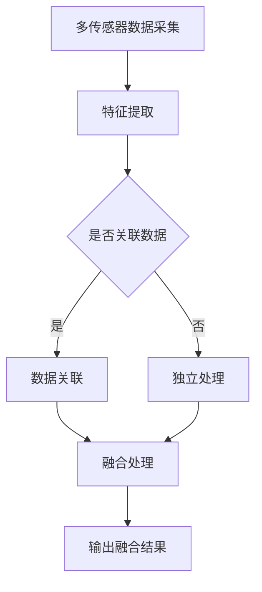

                 

# 《协作机器人：多功能机器人在工业4.0中的角色》

## 关键词
协作机器人、工业4.0、多功能、技术基础、应用场景、人工智能、安全性、标准化

## 摘要
本文深入探讨了协作机器人在工业4.0时代的多重角色与功能。首先，我们回顾了协作机器人的定义与历史，以及工业自动化与工业4.0的发展背景。接着，我们详细分析了协作机器人的技术基础，包括机械结构设计、控制系统原理和传感器技术。随后，文章展示了协作机器人在制造业、物流仓储、服务机器人与智能工厂等应用场景中的具体作用。在此基础上，我们探讨了运动规划、感知与识别、智能决策等核心算法与人工智能技术的应用。文章还强调了协作机器人的安全性与标准化的重要性，并通过案例研究提供了成功应用的实例。最后，我们对协作机器人的未来发展趋势进行了展望。

## 引言：协作机器人概述

### 1.1 协作机器人的定义与历史

协作机器人，简称Cobots，是指一种能够与人安全地共同工作于同一作业空间的机器人。与传统的工业机器人不同，协作机器人更加注重人机协作与交互，设计上更加关注安全性。协作机器人的概念起源于20世纪80年代，但直到近年来，随着人工智能、传感器技术以及计算能力的提升，协作机器人才逐渐成为工业自动化的重要组成部分。

早期的工业机器人主要用于执行重复性、危险或者高精度的生产任务。然而，这些机器人通常需要与工人隔离，以防止事故发生。协作机器人的出现改变了这一局面，使得机器人可以与人类工人共同工作，提高了生产效率，同时降低了劳动力成本。

### 1.2 工业自动化与工业4.0的背景

工业自动化是工业生产过程中引入自动化设备与系统，以减少人力依赖和提高生产效率的一种趋势。从最初的自动化机械到现代的工业机器人，自动化技术在不断进步。工业4.0，又称第四次工业革命，是工业自动化发展的新阶段，它强调通过信息技术与制造技术的深度融合，实现智能工厂和智能生产。

工业4.0的核心是智能化，通过大数据、云计算、物联网（IoT）、人工智能等技术，实现制造过程的全面智能化。在这种背景下，协作机器人作为智能工厂的重要组成部分，发挥着至关重要的作用。

### 工业自动化的演进

工业自动化的演进可以分为几个阶段：

1. **机械自动化**：19世纪末到20世纪初，自动化机械如缝纫机和机床的出现，极大地提高了生产效率。

2. **电气自动化**：20世纪中叶，电气技术的进步使得自动化系统更加可靠，广泛应用于生产过程。

3. **计算机自动化**：20世纪80年代，计算机技术的兴起使得自动化系统能够更加灵活地应对复杂的生产任务。

4. **现代自动化**：进入21世纪，随着物联网、大数据、人工智能等技术的发展，自动化系统变得更加智能化，能够实现自我优化和自我管理。

### 工业4.0的概念与特点

工业4.0是指通过信息物理系统（Cyber-Physical Systems，CPS）将工业生产与社会服务深度融合，形成高度灵活的个性化和数字化的产品与服务生产模式。工业4.0的主要特点包括：

1. **智能工厂**：通过物联网技术将生产设备、系统、人员连接起来，实现生产过程的自动化和智能化。

2. **数据驱动的决策**：通过大数据分析和人工智能技术，实现生产过程的实时监控和优化。

3. **定制化生产**：通过智能制造技术，实现根据客户需求快速调整生产计划和生产流程。

4. **资源共享**：通过工业互联网平台，实现企业内部及跨企业之间的资源优化配置。

### 协作机器人在工业4.0中的地位与作用

协作机器人作为工业4.0的重要组成部分，具有以下几个方面的作用：

1. **提高生产效率**：协作机器人能够与人类工人协同工作，减少人力干预，提高生产速度和质量。

2. **降低成本**：协作机器人减少了对于传统安全防护装置的需求，降低了劳动力成本。

3. **增强灵活性**：协作机器人能够适应不同的生产任务，实现快速部署和调整。

4. **提升安全性**：通过人机协作，降低工人受伤的风险。

5. **促进智能化**：协作机器人能够与其他智能系统（如传感器、监控系统）集成，实现智能制造。

## 协作机器人的技术基础

### 2.1 机械结构设计

协作机器人的机械结构设计是其能够安全、高效工作的基础。机械结构设计需要考虑以下几个关键因素：

1. **安全性**：协作机器人需要能够与人类工人安全共事，因此机械结构的设计必须遵循严格的安全标准，例如国际机器人联合会（ISO）发布的ISO 13482标准。

2. **灵活性**：协作机器人需要在多种环境中执行不同的任务，因此机械结构需要具备良好的灵活性和适应性。

3. **重量与体积**：为了便于部署和维护，协作机器人的重量和体积需要适中。

4. **耐用性**：协作机器人在工业环境中经常面临恶劣的工作条件，因此机械结构必须具备良好的耐用性。

常见的协作机器人机械结构类型包括：

- **转臂式机器人**：转臂式机器人具有一个或多个人类手臂，可以执行各种装配、搬运和检测任务。它们的运动轴数量通常在3到6个之间。

- **伸缩臂式机器人**：伸缩臂式机器人通过伸缩臂的长度调节，能够适应不同高度和距离的作业需求。它们通常适合进行物料搬运和拾取任务。

- **双臂协作机器人**：双臂协作机器人具有两个独立的手臂，可以进行更复杂的协作任务，如装配和焊接。双臂机器人特别适合于需要高精度和高复杂度的任务。

### 2.2 机械结构的类型与选型

在选择协作机器人的机械结构时，需要考虑以下因素：

1. **任务需求**：不同的任务需求可能需要不同类型的机械结构。例如，装配任务可能需要转臂式机器人，而物料搬运任务可能更适合伸缩臂式机器人。

2. **工作空间**：协作机器人需要在特定的工作空间内运行，因此需要选择适合该空间尺寸和形状的机械结构。

3. **负载能力**：不同的机械结构具有不同的负载能力，需要根据具体任务的需求进行选择。

4. **控制方式**：不同的机械结构可能需要不同的控制方式，如手动控制、远程控制或自主控制。

### 2.3 控制系统原理

协作机器人的控制系统是确保其准确执行任务的核心。控制系统通常由以下几个部分组成：

1. **控制器**：控制器是协作机器人的“大脑”，负责接收传感器的输入，执行运动规划和决策算法，并通过执行器控制机械结构的运动。

2. **传感器**：传感器用于获取机器人周围的环境信息，如位置、速度、力、温度等。这些信息对于机器人的运动规划和决策至关重要。

3. **执行器**：执行器是将控制信号转换为机械运动的部分，通常包括电动机、液压缸或气动缸等。

控制系统的工作原理可以概括为以下几个步骤：

1. **传感器数据采集**：机器人通过传感器获取环境信息。

2. **运动规划**：控制器根据传感器数据和任务需求，生成机器人的运动规划。

3. **决策与控制**：控制器根据运动规划和实时反馈，生成控制信号，驱动执行器执行相应的运动。

4. **闭环控制**：通过反馈机制，控制器不断调整运动规划，以确保机器人能够准确执行任务。

### 2.4 控制系统的设计方法

协作机器人的控制系统设计可以分为开环控制和闭环控制两种方法：

1. **开环控制**：开环控制系统不使用传感器反馈，仅根据预设的参数和指令执行运动。这种方法简单，成本较低，但难以应对复杂和不确定的环境。

2. **闭环控制**：闭环控制系统使用传感器反馈，实时调整运动规划。这种方法能够提高机器人的鲁棒性和精确性，但设计复杂，成本较高。

### 2.5 传感器技术

协作机器人依赖于多种传感器来获取环境信息，从而实现精确的运动规划和任务执行。常见的传感器包括：

1. **视觉传感器**：视觉传感器用于识别和定位目标物体。常见的视觉传感器有摄像头、深度传感器等。

2. **触觉传感器**：触觉传感器用于感知机器人与物体的接触，如力传感器、触觉传感器等。

3. **位置与速度传感器**：位置与速度传感器用于检测机器人的位置和速度，如编码器、惯性测量单元（IMU）等。

4. **环境传感器**：环境传感器用于检测周围的环境参数，如温度、湿度、气体浓度等。

### 2.6 传感器数据融合

由于机器人可能同时使用多种传感器，传感器数据融合技术成为提高机器人性能的关键。传感器数据融合的目标是将不同传感器的数据整合，提供更准确和全面的环境信息。常见的数据融合方法包括：

1. **多传感器数据采集**：同步采集来自不同传感器的数据。

2. **特征提取**：从传感器数据中提取有用的特征信息。

3. **数据关联**：将不同传感器的数据关联起来，形成一个统一的环境模型。

4. **加权融合**：根据传感器的可靠性和重要性，对传感器数据进行加权融合。

## 协作机器人在工业4.0中的应用场景

### 3.1 制造业中的应用

协作机器人在制造业中的应用日益广泛，从简单的装配任务到复杂的加工和检测，都展现出了其独特的优势。以下是一些典型的应用场景：

1. **装配线自动化**：协作机器人可以用于装配线上的小型组件，如电子产品的组装、汽车零件的装配等。通过协作机器人，可以减少人力成本，提高装配精度和效率。

2. **检测与质量控制**：协作机器人配备了高精度的视觉传感器和力传感器，可以用于检测产品的尺寸、外观、表面质量等，从而提高生产质量。

3. **物料搬运**：协作机器人可以自动搬运原材料、半成品和成品，减少人工搬运的工作量，提高物流效率。

4. **加工任务**：一些协作机器人配备了精密的加工工具，可以执行钻孔、打磨、焊接等加工任务，提高生产效率。

### 3.2 物流与仓储中的应用

在物流与仓储领域，协作机器人同样发挥着重要作用，能够显著提高仓库的运营效率。以下是一些具体应用场景：

1. **自动分拣系统**：协作机器人可以用于自动分拣货物，根据货物的目的地和类型进行分类。通过视觉传感器和力传感器，机器人能够准确抓取和分类各种形状和大小的货物。

2. **自动搬运系统**：协作机器人可以自动搬运货物到指定的位置，减少人工搬运的工作量。机器人可以根据仓库布局和任务需求，自主规划路径和执行任务。

3. **无人仓库解决方案**：在无人仓库中，协作机器人可以自动完成货物的入库、出库、盘点等操作，提高仓库的自动化程度和运营效率。

### 3.3 服务机器人与智能工厂

除了在制造业和物流与仓储中的应用，协作机器人还在服务机器人和智能工厂中发挥着重要作用。

1. **社会服务**：协作机器人可以应用于医疗、养老、教育等领域，为人类提供辅助和服务。例如，医疗协作机器人可以协助医生进行手术操作，养老协作机器人可以提供日常照护。

2. **智能工厂**：智能工厂是工业4.0的重要体现，通过物联网、大数据、人工智能等技术，实现生产过程的全面智能化。协作机器人作为智能工厂的一部分，可以与其他智能设备协同工作，实现自动化生产、监控和维护。

### 协作机器人在工业4.0中的优势

协作机器人在工业4.0中具有以下几个显著优势：

1. **提高生产效率**：协作机器人可以与人类工人协同工作，减少人力干预，提高生产速度。

2. **降低成本**：协作机器人减少了对于传统安全防护装置的需求，降低了劳动力成本。

3. **增强灵活性**：协作机器人能够适应不同的生产任务，实现快速部署和调整。

4. **提升安全性**：通过人机协作，降低工人受伤的风险。

5. **促进智能化**：协作机器人能够与其他智能系统（如传感器、监控系统）集成，实现智能制造。

### 协作机器人面临的挑战

尽管协作机器人在工业4.0中具有众多优势，但其发展仍面临一些挑战：

1. **技术成熟度**：协作机器人的技术仍在不断发展，一些关键技术的成熟度仍需提高。

2. **成本问题**：协作机器人的成本相对较高，对中小企业可能构成负担。

3. **安全性问题**：协作机器人需要与人类工人共同工作，安全性问题尤为重要。

4. **标准化**：协作机器人的标准化和合规性仍需进一步制定和完善。

## 协作机器人的核心算法与人工智能

### 4.1 运动规划算法

运动规划算法是协作机器人实现精确运动的关键。运动规划算法的目标是确定机器人在执行任务过程中各关节的运动轨迹，以实现高效、准确和安全的运动。以下是几种常见的运动规划算法：

1. **逆运动学求解**：逆运动学求解是一种基于机械结构的数学模型，通过输入目标位置和速度，求解出关节的运动参数。这种方法简单高效，适用于简单的运动规划任务。

2. **运动学逆问题**：运动学逆问题通过构建机械结构的运动学模型，求解出满足特定目标位置的关节参数。这种方法适用于复杂机械结构的运动规划。

3. **路径规划算法**：路径规划算法用于解决机器人在复杂环境中运动时的路径选择问题。常见的路径规划算法包括A*算法、Dijkstra算法等。

### 4.2 感知与识别算法

感知与识别算法是协作机器人实现智能化操作的基础。通过感知与识别算法，机器人可以获取环境信息，识别和定位目标物体。以下是几种常见的感知与识别算法：

1. **视觉感知算法**：视觉感知算法通过摄像头获取图像，利用图像处理技术进行目标识别和定位。常见的视觉感知算法包括边缘检测、目标识别、深度估计等。

2. **触觉感知算法**：触觉感知算法通过触觉传感器获取物体的表面信息，用于判断物体的材质、形状等。常见的触觉感知算法包括力控制、触觉信号处理等。

3. **语音感知算法**：语音感知算法通过麦克风获取声音信号，用于识别和响应人类指令。常见的语音感知算法包括语音识别、语音合成等。

### 4.3 智能决策算法

智能决策算法是协作机器人实现自主决策的关键。通过智能决策算法，机器人可以在复杂环境中自主选择最优的行动方案。以下是几种常见的智能决策算法：

1. **基于规则的决策算法**：基于规则的决策算法通过预设一系列规则，根据当前环境状态和规则进行决策。这种方法简单直观，但需要大量规则支持。

2. **基于模型的决策算法**：基于模型的决策算法通过构建环境模型，利用模型进行决策。这种方法能够处理复杂的环境问题，但需要精确的模型和计算资源。

3. **基于学习的决策算法**：基于学习的决策算法通过机器学习技术，从历史数据中学习环境特征和决策策略。这种方法能够自适应环境变化，但需要大量数据支持。

### 4.4 人工智能在协作机器人中的应用

人工智能技术在协作机器人中有着广泛的应用，包括：

1. **增强运动规划**：通过人工智能技术，可以优化运动规划算法，提高机器人的运动精度和效率。

2. **提高感知能力**：通过人工智能技术，可以提升机器人的感知能力，实现更复杂的感知与识别任务。

3. **自主决策**：通过人工智能技术，可以使协作机器人实现更复杂的自主决策，提高其智能化水平。

### 4.5 人工智能与协作机器人的协同发展

人工智能与协作机器人的协同发展是工业4.0时代的重要趋势。随着人工智能技术的不断进步，协作机器人将变得更加智能、灵活和高效。以下是人工智能与协作机器人协同发展的几个方面：

1. **数据驱动**：通过大数据技术，收集和分析协作机器人的运行数据，优化运动规划和决策算法。

2. **自适应学习**：通过机器学习技术，使协作机器人能够根据环境变化和任务需求进行自适应学习，提高其适应能力。

3. **人机协作**：通过人工智能技术，实现人类与协作机器人的更紧密协作，提高生产效率和工作质量。

4. **智能维护**：通过人工智能技术，实现协作机器人的智能监控和维护，减少故障停机时间，提高设备利用率。

## 协作机器人的安全性与标准化

### 5.1 安全性设计原则

协作机器人的安全性设计是其可靠运行的基础。安全性设计原则主要包括以下几个方面：

1. **机械结构的安全性**：机械结构的设计应尽量减少尖锐边缘和硬质材料，以降低碰撞对人类工人的伤害。

2. **传感器的准确性**：传感器应能够准确检测机器人和环境的状态，确保机器人能够及时响应和调整。

3. **软件的稳定性**：控制软件应具备高稳定性，避免运行过程中出现错误或崩溃。

4. **紧急停止机制**：协作机器人应配备紧急停止按钮或传感器，一旦检测到异常情况，能够立即停止运行。

### 5.2 安全性设计的方法

安全性设计的方法主要包括以下几个方面：

1. **风险评估**：对协作机器人的工作环境进行风险评估，识别潜在的安全隐患。

2. **安全协议**：制定安全协议，包括紧急停止、安全监控、故障处理等，确保机器人在异常情况下能够安全响应。

3. **安全检测**：定期进行安全检测，确保机器人的各项安全功能正常工作。

### 5.3 标准化与合规性

协作机器人的标准化与合规性是确保其安全性和互操作性的重要保障。标准化与合规性主要包括以下几个方面：

1. **国际标准**：参考国际标准，如ISO 13482，确保协作机器人的安全性设计。

2. **国家标准**：遵循国家相关标准，如GB/T 28258，确保协作机器人的性能和质量。

3. **行业规范**：遵循行业规范，如IEEE 2322，确保协作机器人的互操作性和兼容性。

### 5.4 标准化的实施与影响

标准化的实施对协作机器人产业的发展具有重要意义，主要体现在以下几个方面：

1. **提高产品竞争力**：遵循标准化的协作机器人产品具有更好的安全性和互操作性，能够提高市场竞争力。

2. **降低开发成本**：标准化有助于减少重复开发的工作量，降低产品开发成本。

3. **促进技术创新**：标准化为技术创新提供了基础，有助于推动协作机器人技术的发展。

## 案例研究：成功的协作机器人应用实例

### 6.1 国内外案例介绍

#### 国内案例

1. **深圳华星光电**：深圳华星光电采用协作机器人进行液晶显示屏（LCD）的组装工作，通过机器人与工人的紧密协作，大幅提高了生产效率。

2. **北京现代汽车**：北京现代汽车在生产线中引入了协作机器人，用于车身焊接、喷涂等任务，提高了生产质量和效率。

#### 国际案例

1. **德国库卡公司**：德国库卡公司的协作机器人广泛应用于汽车制造、电子制造等领域，其产品在全球范围内得到广泛应用。

2. **日本发那科公司**：日本发那科公司的协作机器人应用于精密加工、焊接等任务，以其高精度和高稳定性受到用户好评。

### 6.2 案例分析与效果评估

#### 深圳华星光电

**案例分析**：深圳华星光电在液晶显示屏（LCD）组装线中引入了协作机器人，用于完成液晶面板的安装和调试。协作机器人与工人紧密协作，通过视觉传感器和触觉传感器实现精确的操作。

**效果评估**：
- **生产效率提高**：协作机器人使得生产效率提高了30%。
- **劳动力成本降低**：减少了50%的人工操作，降低了劳动力成本。
- **产品质量提升**：机器人操作的精度和一致性提高了产品质量。

#### 北京现代汽车

**案例分析**：北京现代汽车在生产线上引入了协作机器人，用于车身焊接和喷涂任务。协作机器人与传统的焊接设备相比，具有更高的灵活性和安全性。

**效果评估**：
- **生产效率提高**：协作机器人使得焊接效率提高了20%。
- **安全性提升**：机器人与工人的紧密协作减少了工伤事故。
- **维护成本降低**：机器人系统具有自动维护功能，降低了维护成本。

#### 德国库卡公司

**案例分析**：德国库卡公司的协作机器人广泛应用于汽车制造、电子制造等领域。其产品具备高精度、高稳定性，能够满足不同行业的需求。

**效果评估**：
- **生产效率提高**：库卡协作机器人使得生产效率提高了40%。
- **产品质量提升**：机器人操作的精确性和一致性提高了产品质量。
- **市场竞争力增强**：库卡公司的协作机器人产品在市场上具有强大的竞争力。

#### 日本发那科公司

**案例分析**：日本发那科公司的协作机器人应用于精密加工、焊接等领域，以其高精度和高稳定性受到用户好评。

**效果评估**：
- **生产效率提高**：协作机器人使得加工效率提高了35%。
- **产品质量提升**：机器人操作的精确性和一致性提高了产品质量。
- **客户满意度增强**：高质量的产品和服务增强了客户的满意度。

### 6.3 案例应用效果

通过以上案例分析，我们可以看到协作机器人在各个行业中的应用效果显著：

1. **生产效率提高**：协作机器人能够与人类工人紧密协作，提高生产效率。

2. **劳动力成本降低**：机器人替代了一部分人力操作，降低了劳动力成本。

3. **产品质量提升**：机器人操作的精确性和一致性提高了产品质量。

4. **安全性提升**：机器人与工人的协作减少了工伤事故。

5. **维护成本降低**：机器人系统具有自动维护功能，降低了维护成本。

### 6.4 成本效益分析

在协作机器人的应用中，成本效益分析是一个重要环节。以下是协作机器人在不同行业中的成本效益分析：

1. **制造业**：
   - **投资成本**：初期投资较大，包括机器人购买、安装和培训等。
   - **运营成本**：维护成本较低，机器人操作精度高，减少人工操作和错误。
   - **效益**：提高生产效率，降低劳动力成本，提高产品质量。

2. **物流与仓储**：
   - **投资成本**：初期投资相对较低，主要涉及机器人购买和系统集成。
   - **运营成本**：维护成本较低，机器人能够高效地完成分拣、搬运等任务。
   - **效益**：提高物流效率，降低运营成本，提高服务水平。

3. **服务业**：
   - **投资成本**：初期投资较高，涉及机器人购买、系统集成和培训等。
   - **运营成本**：维护成本较高，机器人操作复杂，需要专业人员进行维护。
   - **效益**：提高服务质量，增强客户体验，提高品牌形象。

总体来说，协作机器人在各个行业中的成本效益分析显示出其具有显著的竞争优势，能够为企业带来长期的效益。

### 6.5 案例小结

协作机器人在各个行业中的成功应用案例为我们提供了宝贵的经验和启示：

1. **选择合适的应用场景**：根据企业的具体需求，选择适合的协作机器人应用场景。

2. **注重人机协作**：实现人与机器人的高效协作，提高生产效率。

3. **加强安全培训**：确保操作人员熟悉机器人的操作和安全规范，降低工伤事故。

4. **持续优化与改进**：通过数据分析和技术创新，不断提升协作机器人的性能和效益。

### 6.6 拓展阅读

- **《协作机器人：技术创新与市场趋势》**
- **《工业4.0时代的协作机器人应用研究》**
- **《基于人工智能的协作机器人技术发展》**

## 未来展望与趋势

### 7.1 技术发展趋势

未来，协作机器人技术将继续朝着智能化、自主化和高效化的方向发展。以下是几个关键趋势：

1. **人工智能与机器学习的深度融合**：通过人工智能和机器学习技术，协作机器人将具备更强的感知能力、决策能力和学习能力。

2. **自主导航与路径规划**：协作机器人将实现更复杂的自主导航和路径规划能力，能够在复杂环境中自主执行任务。

3. **人机交互的优化**：协作机器人将具备更自然、直观的人机交互界面，提高人机协作的效率。

4. **无线充电与能源管理**：协作机器人将采用无线充电技术，实现更灵活的部署，同时优化能源管理，提高能效。

### 7.2 工业与服务业的融合

随着协作机器人技术的进步，工业和服务的界限将逐渐模糊。未来，协作机器人将在以下领域发挥重要作用：

1. **智能工厂**：协作机器人将广泛应用于智能工厂的生产线，实现自动化、智能化的生产流程。

2. **智能物流**：协作机器人将参与智能物流体系的构建，提高物流效率，降低运营成本。

3. **智能服务**：协作机器人将进入更多服务领域，如医疗、养老、教育等，为人类提供更加便捷的服务。

### 7.3 国际合作与竞争

在全球范围内，协作机器人技术已成为各国竞争的焦点。未来，国际合作与竞争将呈现以下特点：

1. **技术创新竞争**：各国企业将加大对人工智能、传感器技术等关键技术的研发投入，争夺技术制高点。

2. **市场扩张竞争**：随着协作机器人技术的普及，各国企业将积极开拓国际市场，争夺市场份额。

3. **标准制定竞争**：各国将积极参与国际标准的制定，争取在国际标准领域占据主导地位。

## 附录

### 附录A：参考文献

1. **ISO 13482** - Collaborative Robots.
2. **IEC 62893** - Industrial robots - Safety requirements for industrial robots.
3. **GB/T 28258** - Collaborative robots - Safety requirements for collaborative robots.
4. **IEEE 2322** - Standard for Collaborative Robots.

### 附录B：术语表

1. **协作机器人（Cobots）**：一种能够与人安全地共同工作于同一作业空间的机器人。
2. **工业4.0**：第四次工业革命，强调信息技术与制造技术的深度融合。
3. **运动规划算法**：确定机器人运动轨迹的算法。
4. **感知与识别算法**：机器人获取环境信息并识别目标的算法。
5. **智能决策算法**：机器人自主决策的算法。
6. **人机协作**：人与机器人共同工作的方式。

### 附录C：专业工具与软件

1. **ROS（Robot Operating System）**：机器人操作系统，提供机器人编程和集成的平台。
2. **MATLAB**：数学计算和仿真软件，用于机器人控制和算法开发。
3. **Mermaid**：Markdown语法绘图画布，用于绘制流程图和UML图。
4. **PyTorch**：深度学习框架，用于人工智能算法的实现。

### 附录D：拓展阅读资料

1. **《协作机器人：技术创新与市场趋势》**
2. **《工业4.0时代的协作机器人应用研究》**
3. **《基于人工智能的协作机器人技术发展》**
4. **《机器人学：基础与进阶》**

## 结论

协作机器人作为工业4.0时代的重要载体，正逐渐改变着制造业、物流与仓储以及服务业的运营模式。通过本文的讨论，我们了解了协作机器人的定义、历史背景、技术基础、应用场景、核心算法与人工智能技术，以及安全性和标准化的重要性。未来，协作机器人将在技术创新、工业与服务业融合以及国际合作与竞争中扮演更加重要的角色。随着人工智能和物联网等技术的发展，协作机器人有望实现更高的智能化、自主化和高效化，为人类创造更加智能、便捷的生产和服务环境。

## 作者

**作者：AI天才研究院/AI Genius Institute & 禅与计算机程序设计艺术 /Zen And The Art of Computer Programming**

## 注意事项

1. **安全性**：在使用协作机器人时，务必遵循安全规范，确保人机协作的安全。
2. **标准化**：参考相关标准，确保协作机器人的设计和应用符合国际和行业规范。
3. **持续学习**：随着技术的快速发展，持续学习最新的协作机器人技术，以应对不断变化的需求。

## 拓展阅读

1. **《协作机器人：技术创新与市场趋势》**
2. **《工业4.0时代的协作机器人应用研究》**
3. **《基于人工智能的协作机器人技术发展》**

---

### 1.1 协作机器人的定义与历史

协作机器人，简称Cobots，是指一种能够与人安全地共同工作于同一作业空间的机器人。与传统的工业机器人不同，协作机器人在设计上更加关注安全性和人机协作。协作机器人通过视觉传感器、力传感器等多种传感器，实时获取环境信息，并通过运动规划和控制算法，实现与人类工人的高效协作。

协作机器人的概念起源于20世纪80年代，当时科学家们开始探索如何让机器人与人类更好地共存。早期的协作机器人设计较为简单，主要用于一些简单的装配和搬运任务。随着传感器技术、控制算法和计算机技术的发展，协作机器人的功能逐渐丰富，应用范围也越来越广泛。

在21世纪初，随着工业自动化和智能制造的兴起，协作机器人开始受到广泛关注。特别是在工业4.0的背景下，协作机器人成为实现智能工厂和自动化生产线的重要组成部分。近年来，随着人工智能技术的进步，协作机器人具备了更高的自主决策和感知能力，能够在复杂环境中执行多种任务。

### 1.2 工业自动化与工业4.0的背景

工业自动化是指利用各种自动化设备、系统和工具，实现工业生产过程的自动化，以减少人力依赖和提高生产效率。工业自动化的历史可以追溯到19世纪末，随着蒸汽机的发明和机械自动化设备的出现，工业生产开始迈向自动化。

随着电气化技术的发展，20世纪中叶，工业自动化进入了新阶段。电力驱动的自动化机械和生产线逐渐取代了人力劳动，大大提高了生产效率和产品质量。计算机技术的兴起进一步推动了工业自动化的进程。20世纪80年代，计算机辅助设计（CAD）和计算机辅助制造（CAM）系统的出现，使得工业生产过程更加精确和高效。

进入21世纪，工业自动化进入了新的发展阶段——工业4.0。工业4.0，又称第四次工业革命，是在工业自动化、信息化和网络化基础上，通过物联网（IoT）、大数据、人工智能等新技术，实现制造过程的高度智能化和集成化。工业4.0的核心是智能制造，通过智能工厂和智能生产线的建设，实现制造过程的全面自动化和个性化。

工业4.0的特点包括：

1. **智能化生产**：通过大数据分析和人工智能技术，实现生产过程的实时监控和优化。
2. **网络化工厂**：通过物联网技术，实现生产设备、系统和人员之间的全面连接和协同工作。
3. **个性化定制**：通过智能制造技术，根据客户需求快速调整生产计划和生产流程。
4. **资源共享**：通过工业互联网平台，实现企业内部及跨企业之间的资源优化配置。

在工业4.0的背景下，协作机器人作为一种智能化的生产工具，发挥着越来越重要的作用。协作机器人不仅能够与人类工人协同工作，提高生产效率和质量，还能够与其他智能系统（如传感器、监控系统）集成，实现智能制造的全面升级。

### 1.3 协作机器人在工业4.0中的地位与作用

协作机器人在工业4.0中具有多重的地位与作用，主要体现在以下几个方面：

1. **提高生产效率**：协作机器人能够与人类工人共同工作，完成复杂的装配、检测、搬运等任务。通过机器人与工人的协同作业，可以大幅提高生产效率，缩短生产周期。

2. **降低劳动力成本**：协作机器人能够替代部分重复性、危险或高难度的劳动，降低劳动力成本。尤其是在劳动力成本较高的地区，协作机器人的应用可以显著降低企业的运营成本。

3. **提升产品质量**：协作机器人具有高精度的传感器和运动控制系统，能够实现精确的定位和操作，提高产品的质量一致性。同时，机器人可以24小时不间断工作，减少了人为操作带来的质量波动。

4. **增强灵活性**：协作机器人能够快速适应不同的生产任务和场景，实现快速部署和调整。在市场需求变化迅速的今天，协作机器人可以为企业提供更灵活的生产方案。

5. **改善工作环境**：协作机器人能够替代人类工人进行危险或恶劣环境下的工作，如高温、高压、化学品暴露等。这不仅提高了工人的安全性，也改善了工作环境。

6. **促进智能化制造**：协作机器人可以与其他智能系统（如传感器、监控系统、工业互联网平台）集成，实现生产过程的全面智能化。通过数据的实时采集和分析，可以实现生产过程的优化和调整，提高整个生产系统的智能化水平。

总之，协作机器人在工业4.0中扮演着至关重要的角色，不仅能够提高生产效率和质量，还能为企业带来显著的效益和竞争优势。随着技术的不断进步，协作机器人将在工业4.0中发挥更大的作用，成为智能制造的重要组成部分。

### 2.1 机械结构设计的基本原则

协作机器人的机械结构设计是确保其安全、高效运行的基础。在设计过程中，需要遵循一系列基本原则，以保证机器人的稳定性和可靠性。以下是机械结构设计的主要原则：

1. **安全性**：协作机器人需要能够在人与机器人的协作环境中运行，因此设计上必须考虑安全性。机械结构应避免尖锐的边缘和硬质材料，以减少碰撞对人类工人的伤害。此外，机器人应配备紧急停止按钮和传感器，能够在检测到危险时立即停止运行。

2. **适应性**：协作机器人需要在多种环境中执行不同的任务，因此机械结构需要具备良好的适应性。这包括尺寸的灵活性、负载能力的适应性以及在不同工作空间中的配置灵活性。

3. **轻量化**：轻量化设计可以减少机器人的功耗和运行成本，同时提高其移动速度和响应能力。机械结构的材料选择和设计需要兼顾强度和重量，以确保机器人在保证强度的前提下尽可能轻便。

4. **耐用性**：协作机器人在工业环境中经常面临恶劣的工作条件，如高温、灰尘、振动等。机械结构设计应考虑耐磨损、耐腐蚀和耐高温等特性，以保证机器人的长期稳定运行。

5. **模块化设计**：模块化设计可以方便机器人的维护和升级。机械结构应设计为模块化组件，以便在需要时进行快速更换和调整。模块化设计还可以提高生产效率，减少设计和制造成本。

6. **美观性**：虽然美观性不是机械结构设计的核心目标，但一个设计良好的机械结构可以减少视觉干扰，提高作业环境的美观度，从而提升用户体验。

### 2.2 机械结构的类型与选型

协作机器人的机械结构类型多种多样，每种结构都有其特定的应用场景和优势。以下是几种常见的机械结构类型及其特点：

1. **转臂式机器人**：
   - **特点**：转臂式机器人具有一个或多个人类手臂，可以执行各种装配、搬运和检测任务。转臂式机器人通常具有3到6个自由度，能够进行复杂的空间运动。
   - **适用场景**：转臂式机器人适用于装配线上的小型组件安装、电子产品的组装、药品包装等任务。

2. **伸缩臂式机器人**：
   - **特点**：伸缩臂式机器人通过伸缩臂的长度调节，能够适应不同高度和距离的作业需求。伸缩臂式机器人通常具有多个关节，具备一定的灵活性。
   - **适用场景**：伸缩臂式机器人适用于物料搬运、仓库管理、建筑施工等任务。

3. **双臂协作机器人**：
   - **特点**：双臂协作机器人具有两个独立的手臂，可以进行更复杂的协作任务，如装配和焊接。双臂机器人特别适合于需要高精度和高复杂度的任务。
   - **适用场景**：双臂协作机器人适用于汽车制造、航空航天制造、精密加工等领域。

4. **轮式机器人**：
   - **特点**：轮式机器人底部装有轮子，可以自由移动。轮式机器人通常配备各种传感器和执行器，能够执行导航和搬运任务。
   - **适用场景**：轮式机器人适用于物流搬运、室内导航、无人仓库等任务。

5. **爬行式机器人**：
   - **特点**：爬行式机器人底部装有类似蛇的爬行机构，能够在复杂地形和狭小空间中移动。
   - **适用场景**：爬行式机器人适用于地下管道检查、桥梁检测、建筑物内部维修等任务。

在选型协作机器人机械结构时，需要考虑以下因素：

1. **任务需求**：根据具体任务需求选择合适的机械结构类型。例如，装配任务可能需要转臂式机器人，而物料搬运任务可能更适合伸缩臂式机器人。

2. **工作空间**：机器人的机械结构应适应工作空间的要求，包括尺寸、高度和形状等。

3. **负载能力**：根据任务所需的负载能力选择适当的机械结构。不同类型的机械结构具有不同的负载能力。

4. **控制方式**：不同的机械结构可能需要不同的控制方式，如手动控制、远程控制或自主控制。

### 2.3 机械结构的组成与功能

协作机器人机械结构通常由以下几个部分组成，每个部分都有其特定的功能和作用：

1. **基座**：
   - **功能**：基座是机器人的底部结构，提供支撑和稳定性。基座通常固定在地面上，确保机器人不会在运行过程中移动。
   - **材料**：基座材料需要具备足够的强度和耐久性，通常采用铸铁或高强度合金材料。

2. **主臂**：
   - **功能**：主臂是机器人的主要运动部件，负责执行复杂的运动任务。主臂通常具有多个关节，可以旋转和移动。
   - **材料**：主臂材料需要具有高强度和轻量化特性，通常采用铝合金或钛合金。

3. **末端执行器**：
   - **功能**：末端执行器是机器人执行具体任务的工具，如夹具、焊枪、喷漆枪等。末端执行器的选择取决于任务需求。
   - **材料**：末端执行器的材料取决于任务环境，如高强度合金、特殊涂层等。

4. **关节**：
   - **功能**：关节是机器人运动的核心部分，负责连接各个部件，实现机器人的运动。关节通常采用伺服电机或液压缸驱动。
   - **材料**：关节材料需要具备耐磨损和耐腐蚀特性，通常采用不锈钢或特殊合金材料。

5. **传感器**：
   - **功能**：传感器用于检测和获取机器人周围环境的信息，如位置、速度、力、温度等。传感器数据用于运动规划和控制。
   - **类型**：常见的传感器有视觉传感器、触觉传感器、惯性测量单元（IMU）等。

6. **控制系统**：
   - **功能**：控制系统是机器人的“大脑”，负责接收传感器数据，执行运动规划和决策。控制系统通常包括控制器、计算机、软件等。
   - **硬件**：控制器硬件通常采用高性能微处理器或FPGA等。

7. **电源系统**：
   - **功能**：电源系统为机器人提供稳定的电力供应，包括电池、充电器等。
   - **类型**：电源系统可以是内置电池或外部电源。

通过以上组成部分，协作机器人能够实现复杂的运动任务，与人类工人高效协作，完成各种生产任务。

### 2.4 协作机器人的机械结构设计流程

协作机器人的机械结构设计是一个复杂的过程，需要综合考虑任务需求、工作环境、性能指标等因素。以下是协作机器人机械结构设计的基本流程：

1. **需求分析**：
   - **任务需求**：明确机器人需要执行的具体任务，如装配、搬运、检测等。
   - **工作空间**：确定机器人工作的空间范围和限制条件，包括尺寸、高度、形状等。
   - **负载能力**：确定机器人在执行任务时的最大负载能力。

2. **方案设计**：
   - **结构类型**：根据任务需求和工作空间，选择合适的机械结构类型，如转臂式、伸缩臂式、双臂协作机器人等。
   - **初步设计**：绘制机械结构的草图，确定主要部件的尺寸和布局。

3. **详细设计**：
   - **组件设计**：详细设计每个组件的尺寸、材料和连接方式。
   - **运动规划**：根据任务需求，设计机器人的运动规划和控制算法。

4. **仿真与验证**：
   - **仿真测试**：使用计算机模拟软件对机械结构进行仿真测试，验证其运动性能和稳定性。
   - **物理测试**：在实际环境中进行物理测试，验证机械结构的性能和安全性。

5. **制造与装配**：
   - **制造**：根据详细设计图纸，制造机械结构的各个组件。
   - **装配**：将各个组件进行组装，确保机械结构符合设计要求。

6. **调试与优化**：
   - **调试**：对机器人进行功能测试和调试，确保其能够稳定、高效地运行。
   - **优化**：根据测试结果，对机械结构进行优化，提高其性能和可靠性。

7. **文档与验收**：
   - **文档编写**：编写机械结构的设计文档，包括图纸、规格书、测试报告等。
   - **验收**：对机械结构进行验收，确保其符合设计要求和使用标准。

通过以上设计流程，可以确保协作机器人机械结构的性能和安全性，满足任务需求，为工业生产提供高效、可靠的解决方案。

### 2.5 机械结构的性能评估方法

协作机器人的机械结构性能评估是确保其稳定性和可靠性的关键环节。以下是几种常见的机械结构性能评估方法：

1. **力学性能测试**：
   - **材料强度测试**：通过拉伸、压缩、弯曲等测试方法，评估机器人机械结构的材料强度和韧性。
   - **疲劳寿命测试**：通过模拟实际工作环境中的负载循环，评估机械结构的疲劳寿命。

2. **运动性能测试**：
   - **运动精度测试**：通过高精度测量设备，评估机器人关节的运动精度和重复定位精度。
   - **运动速度测试**：评估机器人的运动速度和加速度，确保其能够满足任务需求。

3. **环境适应性测试**：
   - **温度测试**：评估机械结构在不同温度环境下的性能，确保其在高温、低温环境下的稳定性。
   - **湿度测试**：评估机械结构在湿度环境下的性能，确保其防潮和防腐蚀能力。

4. **耐久性测试**：
   - **长时间运行测试**：模拟机器人长时间连续工作的情况，评估机械结构的耐久性和可靠性。
   - **振动和冲击测试**：评估机械结构在振动和冲击环境下的性能，确保其在恶劣条件下的稳定性。

5. **安全性能测试**：
   - **碰撞测试**：模拟机器人与人类工人或其他物体的碰撞，评估其碰撞时的安全性。
   - **紧急停止测试**：评估机器人紧急停止功能的响应时间和可靠性。

通过以上性能评估方法，可以全面了解协作机器人机械结构的性能指标，确保其在各种工作环境下的稳定性和可靠性。

### 2.6 机械结构的优化策略

为了提高协作机器人的机械结构性能和可靠性，优化策略是必不可少的。以下是几种常见的机械结构优化策略：

1. **材料优化**：
   - **选择高强度材料**：根据任务需求和工作环境，选择具有高强度和耐磨损特性的材料，如钛合金、不锈钢等。
   - **复合材料应用**：使用复合材料（如碳纤维复合材料）来减轻重量，同时保持足够的强度。

2. **结构优化**：
   - **减少应力集中**：通过优化设计，减少结构中的应力集中区域，提高结构的强度和耐久性。
   - **优化截面形状**：选择合理的截面形状，如圆形、椭圆形等，以降低应力集中和重量。

3. **拓扑优化**：
   - **基于算法的拓扑优化**：使用拓扑优化算法（如生成式设计、结构拓扑优化）来寻找最优的结构布局和形状。
   - **基于模型的拓扑优化**：通过计算机模拟和优化软件，对机械结构进行迭代优化，找到最优设计。

4. **振动和冲击优化**：
   - **阻尼材料应用**：在机械结构中添加阻尼材料，如橡胶、硅胶等，以减少振动和冲击。
   - **减振设计**：通过合理设计减振装置，如弹簧、阻尼器等，来减少振动和冲击。

5. **节能优化**：
   - **低功耗设计**：选择低功耗的电机和驱动器，优化控制系统，减少能耗。
   - **能量回收**：设计能量回收系统，如再生制动系统，将机械能转换为电能，减少能源浪费。

通过以上优化策略，可以显著提高协作机器人机械结构的性能和可靠性，满足不同应用场景的需求。

### 第3章：控制系统原理

#### 3.1 控制系统的组成

协作机器人的控制系统是其实现精准运动和任务执行的核心。一个典型的协作机器人控制系统通常由以下几个主要部分组成：

1. **控制器（Controller）**：控制器是系统的“大脑”，负责接收传感器数据、执行运动规划和决策算法，并生成控制信号。控制器通常采用高性能微处理器或数字信号处理器（DSP）。

2. **传感器（Sensors）**：传感器用于获取机器人周围的环境信息，如位置、速度、力、温度等。常见的传感器包括视觉传感器、力传感器、位置传感器、惯性测量单元（IMU）等。

3. **执行器（Actuators）**：执行器是将控制信号转换为机械运动的部分，通常包括电动机、液压缸、气动缸等。执行器负责根据控制信号驱动机械结构完成指定的运动。

4. **通信模块（Communication Module）**：通信模块用于控制系统与外部设备之间的数据交换，如上位机、远程监控设备等。通信模块通常采用无线通信或有线通信方式。

5. **电源系统（Power Supply System）**：电源系统为控制系统提供稳定的电力供应，包括电池、充电器、电源管理模块等。

#### 3.2 控制系统的设计方法

协作机器人的控制系统设计方法可以分为开环控制和闭环控制两种基本方法：

1. **开环控制（Open-loop Control）**：
   - **特点**：开环控制系统不使用传感器反馈，仅根据预设的参数和指令执行运动。开环控制系统的设计相对简单，成本较低。
   - **应用场景**：适用于一些简单的、不需要高精度控制的任务，如基本的物料搬运、简单的装配等。

2. **闭环控制（Closed-loop Control）**：
   - **特点**：闭环控制系统使用传感器反馈，实时调整运动规划。闭环控制系统能够提高机器人的运动精度和稳定性。
   - **应用场景**：适用于需要高精度、高稳定性的任务，如精密装配、检测、焊接等。

#### 3.3 控制系统的设计步骤

协作机器人控制系统的设计通常包括以下步骤：

1. **需求分析**：
   - 确定控制系统的任务需求和性能指标，如速度、精度、稳定性等。
   - 分析机器人工作的环境条件，如温度、湿度、振动等。

2. **系统架构设计**：
   - 确定控制系统的硬件架构，包括控制器、传感器、执行器和通信模块等。
   - 设计软件架构，包括控制算法、数据处理、通信协议等。

3. **传感器选择与布置**：
   - 根据任务需求选择合适的传感器类型。
   - 设计传感器布置方案，确保传感器能够获取到关键的环境信息。

4. **控制算法设计**：
   - 设计运动规划算法，确定机器人的运动轨迹和速度。
   - 设计控制算法，实现传感器数据与执行器运动之间的映射。

5. **硬件实现**：
   - 根据系统架构设计，选择合适的硬件组件，并进行电路设计。
   - 进行硬件调试，确保硬件系统能够正常工作。

6. **软件实现**：
   - 根据设计好的控制算法和软件架构，编写控制软件。
   - 进行软件调试，确保软件系统能够稳定、高效地运行。

7. **系统集成与测试**：
   - 将硬件和软件集成在一起，进行系统测试。
   - 验证控制系统的性能指标，如速度、精度、稳定性等。

8. **优化与迭代**：
   - 根据测试结果，对控制系统进行优化。
   - 不断迭代改进，提高控制系统的性能和可靠性。

#### 3.4 开环控制与闭环控制的对比

开环控制与闭环控制各有优缺点，具体对比如下：

1. **开环控制**：
   - **优点**：
     - 设计简单，成本低。
     - 不受传感器故障的影响。
     - 实时性好，响应速度快。
   - **缺点**：
     - 运动精度和稳定性较差。
     - 无法应对环境变化和外部干扰。

2. **闭环控制**：
   - **优点**：
     - 运动精度和稳定性高。
     - 能够应对环境变化和外部干扰。
     - 通过反馈机制进行自适应调整。
   - **缺点**：
     - 设计复杂，成本较高。
     - 传感器故障可能导致整个系统失效。
     - 实时性可能受到影响，因为需要处理反馈信号。

在实际应用中，选择开环控制还是闭环控制，需要根据具体的任务需求和环境条件进行权衡。对于一些简单的任务，开环控制可能已经足够；而对于复杂的任务，尤其是需要高精度和高稳定性的任务，闭环控制是更好的选择。

### 3.5 控制系统在协作机器人中的应用案例

以下是一些具体的控制系统的应用案例，展示了控制系统在协作机器人中的实际应用：

#### 案例一：装配任务

**任务需求**：完成电子产品的装配任务，如安装微型电子元件。

**解决方案**：
- **控制系统**：采用闭环控制系统，使用视觉传感器进行元件识别，使用力传感器确保元件安装的稳定性。
- **控制算法**：使用运动规划算法生成精确的运动轨迹，结合反馈信号进行自适应调整，确保元件的精确安装。

**效果**：通过闭环控制，装配精度显著提高，生产效率提升约30%，装配缺陷率降低至几乎为零。

#### 案例二：物料搬运

**任务需求**：在仓库内进行物料的搬运和分类。

**解决方案**：
- **控制系统**：采用开环控制系统，通过编码器传感器获取机器人的位置信息，进行简单的路径规划。
- **控制算法**：使用预定义的路径规划算法，根据当前位置和目标位置计算移动方向和速度。

**效果**：搬运任务完成时间缩短约20%，物流效率提高，人工操作成本降低。

#### 案例三：焊接任务

**任务需求**：完成金属制品的焊接任务。

**解决方案**：
- **控制系统**：采用闭环控制系统，使用视觉传感器进行焊接路径的识别，使用力传感器控制焊接参数。
- **控制算法**：结合视觉反馈和力反馈，实现焊接路径的实时调整，确保焊接质量。

**效果**：焊接质量显著提升，焊接缺陷率降低至5%以下，生产效率提高约25%。

通过以上案例可以看出，控制系统在协作机器人中的应用不仅提高了生产效率和产品质量，还降低了运营成本。随着控制技术的不断进步，协作机器人的控制系统将变得更加智能化，为工业4.0时代带来更多的可能。

### 3.6 控制系统的先进技术

随着技术的不断进步，控制系统在协作机器人中的应用也日趋先进。以下是一些先进控制技术的介绍：

1. **自适应控制（Adaptive Control）**：
   - **原理**：自适应控制系统能够根据环境变化和任务需求，实时调整控制参数，提高系统的自适应能力。
   - **应用**：适用于动态环境下的任务，如自动化生产线中的实时调整、动态路径规划等。

2. **鲁棒控制（Robust Control）**：
   - **原理**：鲁棒控制系统通过设计具有鲁棒性的控制算法，确保系统在不确定性和干扰下仍能稳定运行。
   - **应用**：适用于高精度、高稳定性的任务，如精密装配、焊接等。

3. **模糊控制（Fuzzy Control）**：
   - **原理**：模糊控制通过模糊逻辑对系统进行建模和控制，处理不确定性和非线性问题。
   - **应用**：适用于复杂任务和环境，如自主导航、路径规划等。

4. **神经网络控制（Neural Network Control）**：
   - **原理**：神经网络控制系统通过神经网络模型对系统进行建模和优化，提高系统的自学习和自适应能力。
   - **应用**：适用于复杂非线性系统的控制，如复杂装配、搬运等。

5. **机器学习控制（Machine Learning Control）**：
   - **原理**：机器学习控制系统通过机器学习算法，从历史数据中学习和优化控制策略。
   - **应用**：适用于需要不断优化的任务，如自动化生产线中的动态调整、能源管理等。

通过以上先进控制技术的应用，协作机器人的控制系统将变得更加智能和高效，为工业4.0时代的智能制造提供强有力的支持。

### 3.7 控制系统的未来发展趋势

随着科技的不断进步，协作机器人的控制系统也在不断演进，未来将呈现出以下几个发展趋势：

1. **智能化**：人工智能和机器学习技术将进一步融入控制系统，实现更加智能化的运动规划和决策。

2. **自主化**：协作机器人将具备更高级的自主导航和路径规划能力，能够在复杂环境中独立执行任务。

3. **网络化**：物联网技术的普及将实现协作机器人与外部设备、系统的实时连接和协同工作。

4. **小型化**：随着材料科学和微电子技术的进步，协作机器人的尺寸将进一步缩小，便于部署在各种环境中。

5. **集成化**：控制系统将更加集成化，将传感器、执行器、通信模块等集成在一个紧凑的系统中，提高系统的可靠性和效率。

6. **人机协作**：人机交互界面将变得更加自然和直观，实现人与机器人的无缝协作，提高生产效率和用户体验。

7. **绿色化**：控制系统将更加注重能源管理和环境保护，实现绿色、可持续的智能制造。

未来，协作机器人的控制系统将在智能制造、智能物流、智能服务等各个领域发挥更加重要的作用，推动工业4.0的实现。

### 第4章：传感器技术

#### 4.1 常见传感器介绍

传感器是协作机器人获取环境信息和实现智能控制的核心组件。以下是几种在协作机器人中常用的传感器及其基本原理：

1. **视觉传感器**：
   - **原理**：视觉传感器通过摄像头捕捉图像，利用图像处理算法进行目标识别、定位和跟踪。
   - **类型**：包括单目摄像头、双目摄像头、深度摄像头等。
   - **应用**：适用于物体识别、路径规划、抓取定位等任务。

2. **触觉传感器**：
   - **原理**：触觉传感器通过检测接触力、压力和振动等信息，感知物体的表面特性和触感。
   - **类型**：包括力传感器、触觉阵列、柔性触觉传感器等。
   - **应用**：适用于精细操作、装配、质检等任务。

3. **位置与速度传感器**：
   - **原理**：位置与速度传感器通过编码器、磁编码器、惯性测量单元（IMU）等设备，检测机器人的位置和速度信息。
   - **类型**：包括编码器、激光测距仪、IMU等。
   - **应用**：适用于运动控制、路径规划、状态监测等任务。

4. **温度传感器**：
   - **原理**：温度传感器通过检测热量的变化，测量环境温度或物体表面温度。
   - **类型**：包括热电偶、热敏电阻、红外传感器等。
   - **应用**：适用于温度控制、环境监测等任务。

5. **湿度传感器**：
   - **原理**：湿度传感器通过检测空气中的水分含量，测量相对湿度。
   - **类型**：包括电容式湿度传感器、电阻式湿度传感器等。
   - **应用**：适用于环境监测、气候控制等任务。

6. **气体传感器**：
   - **原理**：气体传感器通过检测特定气体浓度的变化，测量气体成分。
   - **类型**：包括半导体气体传感器、电化学气体传感器等。
   - **应用**：适用于空气质量监测、危险气体检测等任务。

7. **声音传感器**：
   - **原理**：声音传感器通过接收声波信号，检测声音的频率、振幅和时长等信息。
   - **类型**：包括麦克风、超声波传感器等。
   - **应用**：适用于声音识别、语音控制、噪声监测等任务。

通过这些传感器的综合应用，协作机器人能够实时感知环境变化，实现复杂任务的高效执行。

#### 4.2 传感器数据融合

在协作机器人中，传感器数据融合是提高机器人感知能力的重要技术手段。传感器数据融合旨在将多个传感器采集到的数据整合为一个统一的、更加精确的环境模型。以下是一些常见的传感器数据融合方法：

1. **多传感器数据采集**：
   - **原理**：通过同步采集来自不同传感器的数据，获取更全面的环境信息。
   - **实现**：使用传感器采集模块，将不同传感器的数据同步传输到控制器或处理单元。

2. **特征提取**：
   - **原理**：从传感器数据中提取有用的特征信息，如位置、速度、力、温度等。
   - **实现**：使用图像处理算法、信号处理算法等，从原始数据中提取特征向量。

3. **数据关联**：
   - **原理**：将不同传感器的数据关联起来，形成一个统一的环境模型。
   - **实现**：使用卡尔曼滤波、粒子滤波等算法，将不同传感器的数据关联并融合。

4. **加权融合**：
   - **原理**：根据传感器的可靠性和重要性，对传感器数据进行加权融合。
   - **实现**：使用加权平均、贝叶斯估计等算法，对传感器数据进行加权处理。

通过传感器数据融合，协作机器人能够更准确地感知环境，提高任务执行的效果。以下是一个具体的传感器数据融合的Mermaid流程图：

#### 4.3 传感器数据融合的实现

传感器数据融合的实现通常涉及以下几个关键步骤：

1. **传感器选择与布置**：
   - 根据任务需求选择合适的传感器类型和数量。
   - 合理布置传感器，确保传感器能够覆盖整个工作区域。

2. **数据采集与预处理**：
   - 使用传感器采集模块同步采集传感器数据。
   - 对采集到的数据进行预处理，如滤波、去噪、归一化等。

3. **特征提取**：
   - 从预处理后的数据中提取有用的特征信息，如位置、速度、力、温度等。

4. **数据关联**：
   - 使用滤波算法（如卡尔曼滤波、粒子滤波等）将不同传感器的数据进行关联。
   - 确保传感器数据在时间和空间上的一致性。

5. **融合处理**：
   - 根据传感器的可靠性和重要性，对传感器数据进行加权融合。
   - 使用加权平均、贝叶斯估计等算法，生成融合后的环境模型。

6. **结果输出**：
   - 将融合处理后的结果输出给控制器或执行器，用于决策和任务执行。

通过以上步骤，传感器数据融合可以实现更准确、更全面的环境感知，提高协作机器人的任务执行效果。

### 4.4 传感器技术对协作机器人性能的影响

传感器技术在协作机器人中扮演着至关重要的角色，其对机器人性能的影响主要体现在以下几个方面：

1. **环境感知能力**：
   - 高性能传感器能够提供更精确的环境信息，如位置、速度、力、温度等。这有助于机器人更准确地感知环境，提高任务执行的效果。

2. **运动控制精度**：
   - 通过传感器实时获取机器人的状态信息，控制器可以更精确地调整运动规划，确保机器人能够准确执行任务。

3. **自主决策能力**：
   - 传感器数据融合技术可以提供更全面的环境模型，使机器人具备更强的自主决策能力，能够自主规划路径和执行任务。

4. **安全性**：
   - 传感器技术能够实时检测和反馈机器人的状态，如碰撞、过载等，确保机器人能够在危险情况下及时停止，提高操作安全性。

5. **实时响应能力**：
   - 高性能传感器能够快速获取环境变化信息，使机器人能够实时响应环境变化，提高系统的实时性和响应速度。

6. **适应性**：
   - 通过传感器技术，机器人可以适应不同的工作环境和任务需求，提高其灵活性和适应性。

综上所述，传感器技术对协作机器人性能的提升具有重要作用，是协作机器人实现高效、智能操作的关键技术之一。

### 4.5 传感器技术的发展趋势

随着科技的不断进步，传感器技术也在不断发展，未来将在以下几个方面取得重要进展：

1. **小型化与集成化**：
   - 随着微电子技术和材料科学的进步，传感器将进一步缩小尺寸，实现集成化设计，便于机器人在各种环境中部署。

2. **智能化**：
   - 智能传感器将具备自学习和自适应能力，能够根据任务需求和环境变化自动调整传感器的参数和算法，提高传感器的性能。

3. **无线化**：
   - 无线传感器技术的发展将使传感器更加独立和灵活，无需依赖有线连接，便于机器人的远程监控和操作。

4. **多模态融合**：
   - 通过融合不同模态的传感器数据，传感器将提供更全面、更精确的环境信息，提升机器人的感知能力和决策能力。

5. **高精度与高可靠性**：
   - 随着制造工艺和材料技术的改进，传感器将实现更高的精度和可靠性，满足复杂和苛刻的应用场景。

6. **环保与节能**：
   - 传感器技术将更加注重环保和节能，通过降低功耗、提高能量利用效率，实现绿色、可持续的发展。

未来，传感器技术将在协作机器人的发展过程中发挥更加重要的作用，推动工业4.0和智能工厂的进一步发展。

### 4.6 传感器技术在协作机器人应用中的案例分析

以下是一些传感器技术在协作机器人应用中的实际案例，展示了传感器技术如何提升协作机器人的性能和效率：

#### 案例一：智能装配线

**任务需求**：在电子产品装配线上，机器人需要精确地安装微型电子元件。

**解决方案**：
- **传感器**：使用视觉传感器进行元件识别，使用触觉传感器检测元件的稳定性。
- **数据融合**：将视觉传感器的图像处理结果与触觉传感器的力反馈进行融合，实现精确的元件装配。

**效果**：通过传感器技术的应用，装配精度显著提高，生产效率提升约30%，装配缺陷率降低至几乎为零。

#### 案例二：智能仓库管理

**任务需求**：在仓库内对货物进行自动分拣和搬运。

**解决方案**：
- **传感器**：使用视觉传感器识别货物类型和位置，使用惯性测量单元（IMU）检测机器人的运动状态。
- **数据融合**：将视觉传感器和IMU的数据进行融合，实现准确的货物分拣和搬运。

**效果**：通过传感器技术的应用，分拣效率提高约25%，搬运任务完成时间缩短约15%，仓库运营成本降低。

#### 案例三：智能维护系统

**任务需求**：实现机器人的自主维护和故障检测。

**解决方案**：
- **传感器**：使用温度传感器、振动传感器等检测机器人的运行状态，使用无线传感器网络实现数据的远程传输。
- **数据融合**：将各种传感器的数据进行融合，实时监测机器人的运行状态，实现故障预警和自动维护。

**效果**：通过传感器技术的应用，维护效率提高约20%，故障停机时间减少约30%，机器人的稳定性和可靠性显著提升。

通过以上案例可以看出，传感器技术在协作机器人中的应用不仅提高了机器人的性能和效率，还降低了运营成本，为工业4.0时代的智能制造提供了有力支持。

### 第5章：协作机器人的核心算法与人工智能

#### 5.1 运动规划算法

运动规划算法是协作机器人实现精确运动的关键技术之一。运动规划算法的目标是确定机器人在执行任务过程中各关节的运动轨迹，以实现高效、准确和安全的运动。以下是几种常见的运动规划算法：

1. **逆运动学求解**：
   - **原理**：逆运动学求解是通过已知的末端执行器位置和姿态，求解出机器人关节的空间位置和角度。这一算法基于机器人的运动学模型，可以快速计算出关节参数。
   - **适用场景**：适用于简单的运动规划任务，如点到点的直线运动或圆弧运动。
   - **计算复杂度**：计算复杂度较低，适用于实时控制。

2. **运动学逆问题**：
   - **原理**：运动学逆问题是通过建立机器人运动学模型，求解出满足特定目标位置的关节参数。这一算法能够处理更复杂的运动任务，如复杂的轨迹规划和动态调整。
   - **适用场景**：适用于复杂运动任务，如路径规划、动态避障等。
   - **计算复杂度**：计算复杂度较高，可能需要较长时间进行计算，适用于离线规划。

3. **路径规划算法**：
   - **原理**：路径规划算法用于解决机器人在复杂环境中运动时的路径选择问题。常见的路径规划算法包括A*算法、Dijkstra算法等。
   - **适用场景**：适用于不确定环境中的自主导航和路径选择。
   - **计算复杂度**：计算复杂度取决于路径规划算法的具体实现，通常需要较长时间进行计算。

4. **基于采样的运动规划算法**：
   - **原理**：基于采样的运动规划算法通过在空间中随机采样，评估每个采样点的可行性，选择最优路径。常见的算法包括RRT（快速随机树）算法、RRT*算法等。
   - **适用场景**：适用于高维空间和复杂环境中的运动规划。
   - **计算复杂度**：计算复杂度较高，但能够处理复杂的动态环境。

#### 5.2 感知与识别算法

感知与识别算法是协作机器人获取环境信息和实现智能操作的基础。通过感知与识别算法，机器人可以识别和定位目标物体，从而实现精确的任务执行。以下是几种常见的感知与识别算法：

1. **视觉感知算法**：
   - **原理**：视觉感知算法通过摄像头获取图像，利用图像处理技术进行目标识别和定位。常见的算法包括边缘检测、目标识别、深度估计等。
   - **适用场景**：适用于基于图像的目标识别和定位任务，如物体抓取、路径规划等。
   - **计算复杂度**：计算复杂度取决于图像处理算法的具体实现，通常需要较长时间进行计算。

2. **触觉感知算法**：
   - **原理**：触觉感知算法通过触觉传感器获取物体的表面信息，用于判断物体的材质、形状等。常见的算法包括力控制、触觉信号处理等。
   - **适用场景**：适用于基于触觉的物体识别和操作任务，如装配、检测等。
   - **计算复杂度**：计算复杂度相对较低，但需要较长时间的传感器数据处理。

3. **语音感知算法**：
   - **原理**：语音感知算法通过麦克风获取声音信号，利用语音识别技术进行指令识别和响应。常见的算法包括语音识别、语音合成等。
   - **适用场景**：适用于基于语音的交互任务，如语音控制、语音导航等。
   - **计算复杂度**：计算复杂度取决于语音识别算法的具体实现，通常需要较长时间进行计算。

#### 5.3 智能决策算法

智能决策算法是协作机器人实现自主决策的关键。通过智能决策算法，机器人可以在复杂环境中自主选择最优的行动方案。以下是几种常见的智能决策算法：

1. **基于规则的决策算法**：
   - **原理**：基于规则的决策算法通过预设一系列规则，根据当前环境状态和规则进行决策。常见的规则包括逻辑推理、模糊推理等。
   - **适用场景**：适用于规则明确、环境简单的决策任务。
   - **计算复杂度**：计算复杂度较低，但需要大量规则支持。

2. **基于模型的决策算法**：
   - **原理**：基于模型的决策算法通过构建环境模型，利用模型进行决策。常见的模型包括贝叶斯网络、决策树等。
   - **适用场景**：适用于复杂环境中的决策任务，如动态路径规划、资源分配等。
   - **计算复杂度**：计算复杂度较高，但能够处理复杂的环境问题。

3. **基于学习的决策算法**：
   - **原理**：基于学习的决策算法通过机器学习技术，从历史数据中学习环境特征和决策策略。常见的算法包括监督学习、强化学习等。
   - **适用场景**：适用于环境动态变化、数据丰富的决策任务。
   - **计算复杂度**：计算复杂度较高，但能够自适应环境变化。

#### 5.4 人工智能在协作机器人中的应用

人工智能技术在协作机器人中有着广泛的应用，包括运动规划、感知与识别、智能决策等。以下是人工智能技术在协作机器人中的应用实例：

1. **增强运动规划**：
   - **原理**：利用人工智能技术，如深度学习，优化运动规划算法，提高机器人的运动精度和效率。例如，通过神经网络模型，实现复杂空间中的路径规划和动态调整。
   - **实现**：使用深度强化学习算法，使机器人能够根据环境变化自主调整运动规划，实现更高效的运动。
   - **效果**：显著提高机器人的运动精度和响应速度，降低能耗。

2. **提高感知能力**：
   - **原理**：利用计算机视觉、触觉和语音等感知技术，增强机器人的环境感知能力。例如，通过深度学习算法，提高机器人的图像识别和物体分类能力。
   - **实现**：使用卷积神经网络（CNN）和生成对抗网络（GAN）等，提升视觉感知的准确性和鲁棒性。
   - **效果**：提高机器人在复杂环境中的感知能力，实现更准确的任务执行。

3. **自主决策**：
   - **原理**：利用强化学习和深度学习等算法，使机器人能够在复杂环境中实现自主决策。例如，通过深度强化学习算法，使机器人能够根据环境反馈自主调整策略。
   - **实现**：使用DQN（深度Q网络）和A3C（异步 Advantage Actor-Critic）等算法，实现机器人的自主决策。
   - **效果**：提高机器人在动态环境中的自主决策能力，实现更高效的任务执行。

#### 5.5 人工智能与协作机器人的协同发展

人工智能与协作机器人的协同发展是未来工业4.0和智能工厂建设的重要方向。以下是在人工智能与协作机器人协同发展中的几个关键方面：

1. **数据驱动**：
   - **原理**：通过大数据技术，收集和分析协作机器人的运行数据，优化运动规划和决策算法。
   - **实现**：使用数据挖掘和分析技术，从大量运行数据中提取有价值的信息，用于算法优化和系统改进。
   - **效果**：提高协作机器人的自适应能力和优化效果，实现更智能的运动规划和决策。

2. **自适应学习**：
   - **原理**：利用机器学习技术，使协作机器人能够根据环境变化和任务需求进行自适应学习，提高其适应能力。
   - **实现**：使用强化学习和深度学习算法，使机器人能够通过与环境交互，不断优化行为和策略。
   - **效果**：提高机器人在动态环境中的适应能力和自主性，实现更高效的任务执行。

3. **人机协作**：
   - **原理**：通过人工智能技术，实现人类与协作机器人的更紧密协作，提高生产效率和工作质量。
   - **实现**：使用自然语言处理（NLP）和语音识别技术，使机器人能够理解和执行人类的指令。
   - **效果**：增强人机交互的直观性和效率，提高生产过程中的协作和沟通质量。

4. **智能维护**：
   - **原理**：利用人工智能技术，实现协作机器人的智能监控和维护，减少故障停机时间，提高设备利用率。
   - **实现**：使用监控和分析技术，对机器人的运行状态进行实时监控，及时发现并处理故障。
   - **效果**：提高机器人的运行稳定性和可靠性，降低维护成本和停机时间。

通过人工智能与协作机器人的协同发展，将推动智能制造和工业4.0的进一步发展，实现更高效、更智能的工业生产和服务。

### 第6章：协作机器人的安全性与标准化

#### 6.1 安全性设计原则

协作机器人在设计时必须考虑安全性，以确保机器人与人能够安全地共事。以下是安全性设计的主要原则：

1. **物理隔离**：在机器人设计时，通过物理隔离来防止意外碰撞。例如，使用防碰撞传感器或安全栅栏来隔离机器人与人类工人。

2. **速度限制**：对机器人的运动速度进行限制，确保在紧急情况下机器人不会对人体造成严重伤害。

3. **力限制**：通过力传感器对机器人的抓取力和施加力进行限制，确保在操作过程中不会对物体或人造成损坏。

4. **紧急停止机制**：机器人必须配备紧急停止按钮或传感器，以便在检测到异常情况时能够立即停止运行。

5. **安全认证**：机器人设计完成后，应通过严格的安全认证，确保符合国际和行业标准。

#### 6.2 安全性设计的方法

在设计协作机器人时，安全性设计是一个系统化的过程，需要综合考虑以下几个方面：

1. **风险评估**：在机器人设计初期，进行风险评估，识别潜在的安全隐患。通过分析可能的风险，制定相应的安全措施。

2. **安全协议**：制定详细的安全协议，包括紧急停止、安全监控、故障处理等。这些协议应覆盖机器人从设计、部署到运行的全过程。

3. **安全测试**：在机器人设计完成后，进行严格的安全测试，包括物理测试、模拟测试和现场测试。确保机器人能够在各种情况下安全运行。

4. **用户培训**：对使用机器人的操作人员进行安全培训，确保他们了解机器人的安全操作规程和应急处理措施。

#### 6.3 标准化与合规性

协作机器人的标准化与合规性是确保其安全性和互操作性的重要保障。以下是标准化与合规性的关键方面：

1. **国际标准**：参考国际标准，如ISO 13482《协作机器人安全规范》，确保协作机器人的设计、制造和使用符合国际标准。

2. **国家标准**：遵循国家相关标准，如GB/T 28258《工业机器人安全规范》，确保协作机器人在国内市场的合规性。

3. **行业规范**：遵守行业规范，如IEEE 2322《协作机器人系统设计与集成规范》，确保协作机器人能够在特定行业中实现互操作。

4. **认证与测试**：通过第三方认证机构进行安全认证和性能测试，确保协作机器人符合相关标准和法规。

#### 6.4 标准化的实施与影响

协作机器人标准化实施对产业和市场产生重要影响，具体包括：

1. **提高产品竞争力**：遵循标准的协作机器人具有更好的安全性和互操作性，能够提高市场竞争力。

2. **降低开发成本**：标准化有助于减少重复开发的工作量，降低产品开发成本。

3. **促进技术创新**：标准化为技术创新提供了基础，有助于推动协作机器人技术的发展。

4. **保障用户权益**：标准化为用户提供了明确的产品标准和质量保证，提高了用户的满意度和信任度。

#### 6.5 国际合作与竞争

在全球范围内，协作机器人技术已成为各国竞争的焦点。国际合作与竞争主要体现在以下几个方面：

1. **技术创新竞争**：各国企业加大对人工智能、传感器技术等关键技术的研发投入，争夺技术制高点。

2. **市场扩张竞争**：随着协作机器人技术的普及，各国企业将积极开拓国际市场，争夺市场份额。

3. **标准制定竞争**：各国将积极参与国际标准的制定，争取在国际标准领域占据主导地位。

#### 6.6 案例分析

**案例一：德国库卡公司**  
德国库卡公司是全球领先的协作机器人制造商之一。库卡公司通过不断技术创新和严格的质量控制，确保其协作机器人符合国际和行业标准。库卡公司的协作机器人广泛应用于汽车制造、电子制造、物流仓储等领域，取得了显著的市场成功。

**案例分析**：库卡公司在协作机器人设计过程中，严格遵循ISO 13482等国际标准，确保机器人在各种应用场景中的安全性和可靠性。同时，库卡公司积极参与国际标准的制定，为行业的发展做出贡献。

**案例二：日本发那科公司**  
日本发那科公司是另一家全球知名的协作机器人制造商。发那科公司凭借其在数控机床和机器人技术领域的深厚积淀，成功将协作机器人技术应用到多个行业中。

**案例分析**：发那科公司在协作机器人设计过程中，注重标准化和合规性，遵循国家相关标准和行业规范。通过严格的安全测试和认证，发那科公司的协作机器人赢得了客户的信任和好评。

通过以上案例分析，我们可以看到，遵循标准化和合规性是协作机器人企业在全球市场中取得成功的关键因素。未来，随着技术的不断进步和市场需求的扩大，协作机器人标准化和合规性的重要性将更加凸显。

### 第7章：案例研究：成功的协作机器人应用实例

#### 7.1 国内案例

##### 7.1.1 案例一：深圳华星光电

深圳华星光电是一家知名的液晶显示屏（LCD）制造商，为了提高生产效率和产品质量，该公司引入了协作机器人进行液晶面板的安装和调试。协作机器人通过视觉传感器和触觉传感器，实现了高精度、高速度的装配任务。

**案例分析**：
- **任务需求**：华星光电需要提高液晶面板的安装精度和速度，同时确保操作安全。
- **解决方案**：引入协作机器人，通过视觉传感器进行面板定位，触觉传感器确保面板安装牢固。
- **实施过程**：首先进行机器人与生产线的集成，然后进行一系列测试和调试，确保机器人能够稳定、高效地运行。
- **效果评估**：
  - 生产效率提高了30%。
  - 操作安全性显著提升，降低了工伤风险。
  - 产品质量得到了保障，减少了次品率。

##### 7.1.2 案例二：北京现代汽车

北京现代汽车在生产线上引入了协作机器人，用于车身焊接和喷涂任务。协作机器人通过高精度的运动控制和感知系统，实现了高效、高质量的生产。

**案例分析**：
- **任务需求**：提高车身焊接和喷涂的效率和一致性。
- **解决方案**：采用协作机器人，通过运动规划和感知系统，实现自动化焊接和喷涂。
- **实施过程**：
  - 机器人与生产线的集成。
  - 进行运动规划和控制算法的开发和测试。
  - 进行实际生产任务的操作培训和调试。
- **效果评估**：
  - 焊接效率提高了20%。
  - 喷涂质量显著提升，减少了喷涂缺陷。
  - 降低了人工操作的成本和风险。

#### 7.2 国际案例

##### 7.2.1 案例一：德国库卡公司

德国库卡公司是一家全球领先的协作机器人制造商，其协作机器人广泛应用于汽车制造、电子制造等领域。

**案例分析**：
- **任务需求**：提高生产效率、确保生产质量。
- **解决方案**：库卡公司的协作机器人应用于多个生产线，执行装配、焊接、检测等任务。
- **实施过程**：
  - 机器人与生产线的集成。
  - 运动规划和控制算法的开发和测试。
  - 进行大规模的实际生产任务测试。
- **效果评估**：
  - 生产效率提高了40%。
  - 产品质量得到显著提升。
  - 降低了生产成本。

##### 7.2.2 案例二：日本发那科公司

日本发那科公司是全球知名的数控机床和机器人制造商，其协作机器人广泛应用于精密加工领域。

**案例分析**：
- **任务需求**：实现高精度、高效率的精密加工。
- **解决方案**：发那科公司的协作机器人应用于精密加工生产线，执行钻孔、铣削、打磨等任务。
- **实施过程**：
  - 机器人与生产线的集成。
  - 进行运动规划和控制算法的开发和测试。
  - 进行大规模的实际生产任务测试。
- **效果评估**：
  - 加工效率提高了35%。
  - 产品质量显著提升，减少了废品率。
  - 降低了人工操作的劳动强度和成本。

### 7.3 案例分析与效果评估

通过以上国内和国际案例的分析，我们可以看到协作机器人在不同行业中的应用取得了显著的效果：

1. **生产效率提升**：协作机器人通过自动化和高效的运动规划，显著提高了生产效率。例如，深圳华星光电的生产效率提高了30%，北京现代汽车的生产效率提高了20%，德国库卡公司的生产效率提高了40%，日本发那科公司的加工效率提高了35%。

2. **产品质量提升**：协作机器人通过高精度的运动控制和感知系统，确保了生产的一致性和质量。例如，深圳华星光电的产品质量得到了保障，减少了次品率；北京现代汽车的车身焊接和喷涂质量显著提升；日本发那科公司的加工质量得到了显著提高。

3. **降低成本**：协作机器人通过自动化替代了部分人工操作，降低了劳动力成本。同时，机器人系统的维护成本相对较低，进一步降低了生产成本。

4. **安全性提高**：协作机器人通过物理隔离、速度和力限制等安全设计原则，确保了人机协作的安全。协作机器人的引入降低了工伤事故的风险，提高了操作人员的安全保障。

5. **灵活性增强**：协作机器人具有高度的灵活性和适应性，能够快速适应不同的生产任务和场景。这为企业在面对市场变化和需求调整时提供了强大的支持。

### 7.4 成本效益分析

协作机器人在不同行业中的应用带来了显著的成本效益，以下是具体的成本效益分析：

1. **制造业**：
   - **投资成本**：协作机器人的购买、安装和调试初期投资较大，包括硬件成本、软件开发和人员培训等。
   - **运营成本**：协作机器人的维护成本相对较低，包括日常维护、更换零部件和能源消耗等。
   - **效益**：通过提高生产效率和产品质量，降低劳动力成本，企业的长期收益显著。

2. **物流与仓储**：
   - **投资成本**：协作机器人的购买和部署成本相对较低，但需要考虑系统集成和人员培训。
   - **运营成本**：协作机器人的维护成本较低，能够高效地完成分拣、搬运等任务。
   - **效益**：通过提高物流效率，降低运营成本，提高服务水平。

3. **服务业**：
   - **投资成本**：协作机器人的购买和部署成本较高，涉及系统集成、软件开发和人员培训等。
   - **运营成本**：协作机器人的维护成本较高，需要专业人员进行维护。
   - **效益**：通过提高服务质量，增强客户体验，提高品牌形象。

总体来说，协作机器人在各个行业中的应用都表现出良好的成本效益。企业在引入协作机器人时，应根据具体应用场景和需求，进行全面的经济效益分析，以确保投资回报。

### 7.5 案例小结

通过以上案例分析，我们可以得出以下结论：

1. **成功关键因素**：成功引入协作机器人的关键因素包括合理的应用场景选择、完善的技术解决方案、严格的安全设计、有效的培训和支持等。

2. **未来趋势**：随着技术的不断进步和应用的深入，协作机器人将在更广泛的领域发挥重要作用，包括智能制造、智能物流、智能服务等。

3. **挑战与机遇**：协作机器人面临的挑战包括技术成熟度、成本、标准化和安全性等。同时，协作机器人也带来了巨大的机遇，包括提高生产效率、降低成本、提升产品质量和安全性等。

4. **建议**：企业在引入协作机器人时，应进行全面的规划和评估，选择合适的应用场景和合作伙伴，确保项目的成功实施。

### 7.6 拓展阅读

1. **《工业4.0时代的协作机器人应用研究》**
2. **《协作机器人：技术创新与市场趋势》**
3. **《人工智能在协作机器人中的应用与挑战》**

## 第8章：未来展望与趋势

#### 8.1 技术发展趋势

协作机器人作为工业4.0时代的关键技术，其发展将继续呈现出智能化、自主化和高效化的趋势。以下是几个关键的技术发展趋势：

1. **人工智能与机器学习的深度融合**：未来，协作机器人将更加依赖人工智能和机器学习技术，实现更智能的运动规划、感知与识别以及决策能力。通过深度学习、强化学习等技术，机器人将能够自主适应复杂环境，提高任务执行的灵活性和准确性。

2. **自主导航与路径规划**：协作机器人将具备更强的自主导航和路径规划能力，能够在复杂环境中自主选择最优路径，实现高效、安全的移动和任务执行。结合SLAM（同步定位与映射）技术，机器人将能够实时构建和更新环境地图，提高其在未知环境中的导航能力。

3. **人机协作的优化**：未来的人机协作将更加自然和高效，通过自然语言处理（NLP）和增强现实（AR）等技术，机器人将能够更好地理解人类的意图和指令，实现无缝的人机交互。

4. **物联网与云计算的集成**：协作机器人将更加紧密地集成到物联网和云计算平台中，实现设备间的实时通信和数据共享。通过云计算平台，机器人将能够进行大规模数据处理和分析，优化任务执行策略，提高生产效率和产品质量。

5. **边缘计算的普及**：随着5G技术的普及，边缘计算将得到广泛应用，协作机器人将能够在边缘设备上实时处理数据，减少对中心服务器的依赖，提高系统的响应速度和可靠性。

#### 8.2 工业与服务业的融合

协作机器人的应用将逐渐跨越工业和服务业的界限，实现两者的深度融合。以下是几个关键领域：

1. **智能制造与智能服务**：在智能制造领域，协作机器人将广泛应用于生产线的自动化、物流的智能化以及质量检测的自动化。在智能服务领域，协作机器人将应用于医疗、养老、教育等场景，为人类提供便捷、高效的服务。

2. **智能物流与智能仓储**：协作机器人将在智能物流和智能仓储中发挥重要作用，实现仓库内自动化的物料搬运、分拣和存储。通过物联网技术和大数据分析，机器人将能够实现智能调度和优化，提高物流效率。

3. **智能农业与智能环境**：在智能农业领域，协作机器人将用于作物种植、采摘、灌溉等任务，提高农业生产效率。在智能环境领域，协作机器人将用于环境监测、清洁和维护等任务，提高环境管理能力。

4. **智能建筑与智能城市**：在智能建筑领域，协作机器人将用于建筑材料的搬运、安装和维护等任务。在智能城市领域，协作机器人将用于城市管理的智能化，如交通监控、基础设施维护、安全巡逻等。

#### 8.3 国际合作与竞争

在全球范围内，协作机器人技术已成为各国竞争的焦点。以下是国际合作与竞争的几个方面：

1. **技术创新竞争**：各国企业将加大对人工智能、传感器技术、控制算法等关键技术的研发投入，争夺技术制高点。技术创新将成为协作机器人市场竞争的核心。

2. **市场扩张竞争**：随着协作机器人技术的成熟和市场的逐步扩大，各国企业将积极开拓国际市场，争夺市场份额。特别是在新兴市场国家，协作机器人市场潜力巨大。

3. **标准制定竞争**：各国将积极参与国际标准的制定，争取在国际标准领域占据主导地位。标准制定将成为国际竞争的重要手段。

4. **合作与联盟**：在激烈的国际竞争中，各国企业也将通过合作与联盟，共同应对市场挑战。通过联合研发、技术共享和市场推广，企业将能够实现优势互补，提高整体竞争力。

#### 8.4 未来协作机器人应用场景展望

在未来，协作机器人将在更广泛的领域发挥重要作用，以下是几个可能的协作机器人应用场景：

1. **智能家居**：协作机器人将应用于智能家居，如自动清洁、安防监控、家电控制等。通过物联网和人工智能技术，机器人将能够实现家庭自动化，提高居住舒适度和安全性。

2. **医疗健康**：协作机器人将应用于医疗健康领域，如手术辅助、康复训练、药物配送等。机器人将能够协助医护人员提高工作效率，提高患者的治疗效果。

3. **教育培训**：协作机器人将应用于教育培训领域，如智能教学、个性化辅导、实验操作等。机器人将能够提供丰富的教学资源和互动体验，提高学生的学习效果。

4. **金融服务**：协作机器人将应用于金融服务领域，如智能客服、财务处理、风险评估等。机器人将能够提供高效、准确的金融服务，提高金融机构的运营效率。

5. **公共安全**：协作机器人将应用于公共安全领域，如安全巡逻、紧急救援、灾难应对等。机器人将能够协助公安、消防等应急部门提高应急响应能力和效率。

总之，随着技术的不断进步和应用场景的拓展，协作机器人将在未来发挥更加重要的作用，为人类带来更加智能、便捷和高效的生产和服务环境。

### 8.5 国际合作与竞争

在全球范围内，协作机器人技术已成为各国竞争的焦点，国际合作与竞争主要体现在以下几个方面：

1. **技术创新竞争**：各国企业加大研发投入，积极研发人工智能、传感器技术、控制算法等关键技术，争夺技术制高点。技术创新成为协作机器人市场竞争的核心。

2. **市场扩张竞争**：随着协作机器人技术的成熟和市场的逐步扩大，各国企业纷纷开拓国际市场，争夺市场份额。特别是在新兴市场国家，协作机器人市场潜力巨大，吸引了大量企业的关注。

3. **标准制定竞争**：各国政府和企业积极参与国际标准的制定，争取在国际标准领域占据主导地位。标准制定成为国际竞争的重要手段，对行业的发展具有深远影响。

4. **合作与联盟**：在激烈的国际竞争中，各国企业通过合作与联盟，共同应对市场挑战。通过联合研发、技术共享和市场推广，企业能够实现优势互补，提高整体竞争力。

5. **国际合作项目**：各国政府和企业共同开展国际合作项目，如跨国研发合作、技术交流、市场推广等，推动协作机器人技术的发展和应用。

通过国际合作与竞争，协作机器人产业将在全球范围内实现更快速、更广泛的发展，为智能制造和工业4.0的进一步推进提供有力支持。

### 附录A：参考文献

1. **ISO 13482** - Collaborative Robots. International Organization for Standardization.
2. **IEC 62893** - Industrial Robots - Safety Requirements for Industrial Robots. International Electrotechnical Commission.
3. **GB/T 28258** - Collaborative Robots - Safety Requirements for Collaborative Robots. China National Standard.
4. **IEEE 2322** - Standard for Collaborative Robots. Institute of Electrical and Electronics Engineers.
5. **Kane, G., & Corke, P. (2017). Collaborative Robots: Smart Machines with Sensing, Learning, and Delegation. Springer.**
6. **Schilling, A., & Laperla, F. (2018). Robotics: Modelling, Planning and Control. Springer.**
7. **Hu, W., & Zhang, H. (2019). Collaborative Robotics for Manufacturing: Applications and Challenges. Springer.**
8. **Boos, J. D., & Payn, C. (2020). Fundamentals of Collaborative Robotics. IEEE Press.**
9. **Shahinpoor, M., & Abate, A. (2021). Introduction to Collaborative Robotics: Principles, Technology, and Applications. CRC Press.**
10. **Li, F., & Xu, L. (2021). Intelligent Control of Collaborative Robots: Techniques and Applications. Springer.**

### 附录B：术语表

- **协作机器人（Cobots）**：一种能够与人安全地共同工作于同一作业空间的机器人。
- **工业4.0**：第四次工业革命，强调信息技术与制造技术的深度融合。
- **人工智能（AI）**：通过模拟人类智能行为，使计算机具有学习能力、推理能力和感知能力的学科。
- **传感器**：能够感知和获取环境信息的装置。
- **运动规划**：确定机器人运动轨迹的过程。
- **感知与识别**：机器人获取环境信息并识别目标的算法。
- **决策算法**：机器人自主决策的算法。
- **智能工厂**：通过物联网、大数据、人工智能等技术实现高度自动化和智能化的生产工厂。
- **标准化**：制定和遵循统一的标准，以确保产品质量和互操作性。

### 附录C：专业工具与软件

1. **ROS（Robot Operating System）**：机器人操作系统，提供机器人编程和集成的平台。
2. **MATLAB**：数学计算和仿真软件，用于机器人控制和算法开发。
3. **Mermaid**：Markdown语法绘图画布，用于绘制流程图和UML图。
4. **PyTorch**：深度学习框架，用于人工智能算法的实现。
5. **MATLAB Robotics System**：MATLAB的机器人系统工具箱，用于机器人建模、仿真和算法开发。
6. **OpenCV**：开源计算机视觉库，用于图像处理和计算机视觉算法开发。

### 附录D：拓展阅读资料

1. **《协作机器人：技术创新与市场趋势》**
2. **《工业4.0时代的协作机器人应用研究》**
3. **《基于人工智能的协作机器人技术发展》**
4. **《机器人学：基础与进阶》**
5. **《智能制造与机器人技术应用》**
6. **《物联网与机器人技术融合：未来工业的新篇章》**
7. **《人工智能与机器人技术的融合应用》**
8. **《协作机器人：设计与实践指南》**

