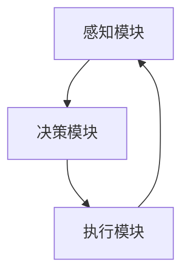

                 

### 文章标题

协作机器人：多功能机器人在工作场所的普及

### 文章关键词

协作机器人、多功能机器人、工作场所、自动化、人工智能

### 文章摘要

本文旨在探讨协作机器人在现代工作场所的普及及其所带来的深远影响。我们将首先介绍协作机器人的背景和定义，然后深入解析其核心概念、工作原理和数学模型。随后，通过实际项目案例，展示协作机器人在不同行业中的应用，并总结其最佳实践和未来发展趋势。

### 引言

协作机器人，作为一种集感知、决策和执行于一体的多功能机器人，正逐渐成为工作场所的重要角色。它们的出现不仅标志着自动化技术的新阶段，也预示着工业生产和服务行业将迎来一场深刻的变革。本文将围绕协作机器人在工作场所的普及展开讨论，通过分析其核心概念、工作原理、数学模型以及实际应用案例，帮助读者全面了解这一新兴技术，并探讨其未来的发展趋势。

在接下来的章节中，我们将首先介绍协作机器人的背景和发展历程，然后详细阐述其核心概念和组成部分，包括感知、决策和执行模块。随后，我们将深入探讨协作机器人所依赖的数学模型和算法原理，并通过Python源代码进行详细讲解和示例分析。此外，本文还将通过实际项目案例展示协作机器人在不同行业中的应用，并总结最佳实践和注意事项。最后，我们将展望协作机器人未来的发展趋势，探讨其潜在的应用场景和面临的挑战。

### 背景介绍

协作机器人的概念最早可以追溯到20世纪末，随着机器人技术、传感器技术以及人工智能技术的不断发展，协作机器人逐渐成为可能。最初的协作机器人主要应用于实验室和特定场景，但随着技术的成熟和成本的降低，协作机器人的应用范围逐渐扩大，开始进入工业生产、医疗保健、物流仓储等广泛领域。

在工业生产领域，协作机器人最初的应用主要集中在装配、搬运和质检等环节。例如，在汽车制造行业中，协作机器人被用于焊接、涂漆和组装等任务，极大地提高了生产效率和产品质量。随着技术的进步，协作机器人逐渐具备了更高的灵活性和智能性，能够适应更加复杂和多变的生产环境。

在医疗保健领域，协作机器人的应用也日益广泛。例如，手术机器人可以帮助医生进行微创手术，提高手术的成功率和患者的康复速度。此外，协作机器人还可以用于医疗辅助，如康复训练、药物配送和病人监护等，为医护人员提供了强大的支持。

在物流仓储领域，协作机器人被广泛应用于分拣、搬运和配送等环节。随着电子商务的快速发展，物流仓储的需求大幅增加，协作机器人以其高效、灵活的特点，成为解决物流瓶颈的重要手段。例如，亚马逊的Kiva机器人可以自动搬运和存储商品，大大提高了仓库的运作效率。

协作机器人之所以能够在如此多的领域得到广泛应用，主要得益于其独特的优势和特点。首先，协作机器人具有高度的灵活性，能够适应不同的工作环境和任务需求。其次，协作机器人具备强大的感知和决策能力，能够在复杂的环境中自主完成任务。此外，协作机器人还具有高度的安全性和可协作性，能够与人或其他机器人共同工作，实现协同作业。

随着技术的不断进步，协作机器人的性能和功能也在不断提升。例如，先进的传感器技术和人工智能算法的应用，使得协作机器人能够更加精准地感知环境，做出更加明智的决策。此外，协作机器人之间的通信和协作能力也在不断增强，能够实现更复杂的任务分配和协同作业。

总之，协作机器人的出现不仅标志着机器人技术的新阶段，也为各个行业带来了巨大的变革和机遇。随着技术的进一步发展，协作机器人将在更多领域得到应用，成为未来工作场所不可或缺的一部分。

### 核心概念与联系

协作机器人的核心概念可以概括为感知、决策和执行三大模块。这三个模块相互关联，共同构成了协作机器人的工作原理。

首先，感知模块是协作机器人的基础。它通过各种传感器获取环境信息，如视觉、听觉、触觉和温度等。这些传感器数据被传递到协作机器人的处理单元，用于生成对环境的全面感知。通过高精度的感知，协作机器人能够识别物体、理解场景和检测障碍，从而为后续的决策和执行提供可靠的数据支持。

接下来是决策模块，它负责分析感知模块获取的数据，并生成具体的行动指令。决策模块通常包括多个子模块，如目标识别、路径规划和任务分配等。通过这些子模块的综合分析，协作机器人能够确定最佳的行动方案，以实现预定的任务目标。决策过程依赖于复杂的算法和模型，如深度学习、强化学习和模糊逻辑等，以确保决策的准确性和高效性。

最后是执行模块，它是协作机器人的行动部分。根据决策模块生成的指令，执行模块会驱动机器人执行具体的动作，如搬运、装配和检测等。执行模块通常包括电机、执行机构和控制单元等硬件设备，它们能够将决策转化为实际的操作。

这三个模块之间的联系非常紧密，共同构成了协作机器人的整体工作流程。感知模块为决策模块提供数据输入，决策模块通过分析这些数据生成指令，执行模块根据指令执行具体的动作。在实际操作中，这三个模块会不断循环，形成一个动态的交互过程。

为了更好地理解这三个模块之间的关系，我们可以使用Mermaid流程图进行展示：



在这个流程图中，感知模块（A）通过传感器获取环境信息，传递给决策模块（B）。决策模块（B）分析这些数据，并生成指令，传递给执行模块（C）。执行模块（C）根据指令执行具体的动作，并将执行结果反馈给感知模块（A），形成闭环控制。

通过这种闭环控制，协作机器人能够实时感知环境变化，不断调整和优化行动方案，从而实现高效的协作作业。这种工作原理使得协作机器人具有高度的灵活性和适应性，能够应对复杂多变的工作环境。

总之，协作机器人的核心概念与联系在于其感知、决策和执行三个模块的紧密协作。通过这些模块的协同工作，协作机器人能够实现自主感知、智能决策和精准执行，从而在工作场所发挥重要作用。

### 核心算法原理讲解

协作机器人的核心算法原理涵盖了感知、决策和执行三大模块，每个模块都有其独特的算法和数学模型，以确保机器人能够高效、准确地完成任务。以下我们将分别介绍这些算法原理，并通过Python源代码进行详细阐述和示例说明。

#### 感知模块的算法原理

感知模块是协作机器人的基础，它依赖于各种传感器获取环境信息。常见的传感器包括视觉传感器、红外传感器、超声波传感器和激光雷达等。这些传感器能够捕捉到环境中的物体、障碍物和位置信息，并将其转化为数字信号。

**视觉传感器算法原理**

视觉传感器主要通过图像处理算法对图像进行分析。常用的图像处理算法包括边缘检测、目标识别和姿态估计等。以下是一个简单的Python代码示例，展示了如何使用OpenCV库进行目标识别：

```python
import cv2
import numpy as np

# 读取图像
image = cv2.imread('example.jpg')

# 转换为灰度图像
gray = cv2.cvtColor(image, cv2.COLOR_BGR2GRAY)

# 使用Sobel算子进行边缘检测
edges = cv2.Sobel(gray, cv2.CV_8U, 1, 0, ksize=3)

# 使用轮廓检测找到物体边缘
contours, _ = cv2.findContours(edges, cv2.RETR_TREE, cv2.CHAIN_APPROX_SIMPLE)

# 在原图上绘制轮廓
image = cv2.drawContours(image, contours, -1, (0, 255, 0), 3)

# 显示图像
cv2.imshow('Edges', edges)
cv2.imshow('Image', image)
cv2.waitKey(0)
cv2.destroyAllWindows()
```

在这个示例中，我们首先读取一幅图像，然后将其转换为灰度图像，接着使用Sobel算子进行边缘检测。最后，通过轮廓检测找到物体边缘，并在原图上绘制出来。

**红外传感器和超声波传感器算法原理**

红外传感器和超声波传感器主要用于检测物体距离和温度。以下是一个使用红外传感器检测物体距离的Python代码示例：

```python
import time

def measure_distance(sensor_pin):
    import RPi.GPIO as GPIO
    GPIO.setmode(GPIO.BCM)
    GPIO.setup(sensor_pin, GPIO.OUT)
    GPIO.output(sensor_pin, True)
    time.sleep(0.01)
    GPIO.output(sensor_pin, False)
    start = time.time()
    while GPIO.input(sensor_pin) == 0:
        start = time.time()
    while GPIO.input(sensor_pin) == 1:
        stop = time.time()
    distance = (stop - start) * 340 / 2
    return distance

sensor_pin = 18  # 使用GPIO引脚18
distance = measure_distance(sensor_pin)
print(f"Distance: {distance} cm")
```

在这个示例中，我们使用GPIO库通过控制红外传感器发射和接收信号来测量物体距离。

#### 决策模块的算法原理

决策模块负责分析感知模块获取的数据，并生成具体的行动指令。常用的决策算法包括路径规划、目标识别和任务分配等。

**路径规划算法原理**

路径规划是决策模块的核心任务之一，它负责在已知起点和终点之间找到一条最优路径。常用的路径规划算法包括A*算法和Dijkstra算法。以下是一个使用A*算法的Python代码示例：

```python
import heapq

def heuristic(a, b):
    # 使用曼哈顿距离作为启发式函数
    return abs(a[0] - b[0]) + abs(a[1] - b[1])

def a_star_search(grid, start, goal):
    # 初始化优先队列和已访问节点
    open_set = []
    heapq.heappush(open_set, (0, start))
    came_from = {}
    g_score = {start: 0}
    f_score = {start: heuristic(start, goal)}

    # 主循环
    while open_set:
        # 选择具有最低f值的节点
        current = heapq.heappop(open_set)[1]

        # 到达终点
        if current == goal:
            break

        # 移除当前节点
        open_set.remove((f_score[current], current))
        open_set = list(filter(lambda x: x[1] != current, open_set))
        heapq.heapify(open_set)

        # 遍历当前节点的邻居节点
        for neighbor in grid.neighbors(current):
            tentative_g_score = g_score[current] + 1

            # 更新邻居节点的g_score和f_score
            if tentative_g_score < g_score.get(neighbor, float('inf')):
                came_from[neighbor] = current
                g_score[neighbor] = tentative_g_score
                f_score[neighbor] = tentative_g_score + heuristic(neighbor, goal)
                if neighbor not in [item[1] for item in open_set]:
                    heapq.heappush(open_set, (f_score[neighbor], neighbor))

    # 生成路径
    path = []
    if goal in came_from:
        path = [goal]
        while current in came_from:
            current = came_from[current]
            path.append(current)
        path.reverse()
    return path

# 定义一个简单的网格环境
grid = {
    'start': (0, 0),
    'goal': (5, 5),
    'grid': [
        [0, 0, 0, 0, 0, 0, 0],
        [0, 1, 1, 1, 1, 1, 0],
        [0, 1, 0, 0, 0, 1, 0],
        [0, 1, 0, 0, 0, 1, 0],
        [0, 1, 1, 1, 1, 1, 0],
        [0, 0, 0, 0, 0, 0, 0],
        [0, 0, 0, 0, 0, 0, 0],
    ]
}

path = a_star_search(grid, grid['start'], grid['goal'])
print("Path:", path)
```

在这个示例中，我们使用A*算法在给定的网格环境中找到从起点到终点的最优路径。

**任务分配算法原理**

任务分配是决策模块的另一个重要任务，它负责将多个任务分配给不同的机器人或执行单元，以实现协同作业。以下是一个简单的任务分配算法示例：

```python
def assign_tasks(robots, tasks):
    assignment = {}
    for task in tasks:
        # 根据机器人负载和任务优先级进行任务分配
        best_robot = min(robots, key=lambda r: r.load + r.priority)
        assignment[task] = best_robot
        best_robot.load += 1
    return assignment

robots = [
    {'name': 'Robot A', 'load': 0, 'priority': 1},
    {'name': 'Robot B', 'load': 0, 'priority': 2},
    {'name': 'Robot C', 'load': 0, 'priority': 3},
]

tasks = [
    {'name': 'Task 1', 'priority': 1},
    {'name': 'Task 2', 'priority': 2},
    {'name': 'Task 3', 'priority': 3},
]

assignment = assign_tasks(robots, tasks)
print("Task Assignment:", assignment)
```

在这个示例中，我们根据机器人的负载和任务优先级进行任务分配。

#### 执行模块的算法原理

执行模块负责根据决策模块生成的指令执行具体的动作。执行模块通常依赖于电机控制、执行机构和控制单元等硬件设备，以实现精确的动作控制。

**电机控制算法原理**

电机控制是执行模块的核心，它负责驱动电机进行转动。常用的电机控制算法包括PID控制和模糊控制。以下是一个使用PID控制的Python代码示例：

```python
import time

def pid_control(setpoint, current_value, Kp, Ki, Kd):
    error = setpoint - current_value
    integral = integral + error
    derivative = error - previous_error
    output = Kp * error + Ki * integral + Kd * derivative
    previous_error = error
    return output

setpoint = 100  # 目标值
current_value = 90  # 当前值
Kp = 1  # 比例增益
Ki = 0.1  # 积分增益
Kd = 0.1  # 微分增益

integral = 0
previous_error = 0

for _ in range(10):  # 进行10次控制循环
    output = pid_control(setpoint, current_value, Kp, Ki, Kd)
    print(f"Output: {output}")
    current_value = current_value + output  # 更新当前值
    time.sleep(1)

print(f"Final Current Value: {current_value}")
```

在这个示例中，我们使用PID控制算法调整当前值，使其逐渐接近目标值。

**执行机构控制算法原理**

执行机构控制算法负责驱动执行机构进行复杂的动作，如搬运、装配和检测等。以下是一个简单的执行机构控制算法示例：

```python
def move_arm(x, y, z):
    # 控制机械臂进行移动
    print(f"Moving arm to x={x}, y={y}, z={z}")

move_arm(50, 100, 150)
```

在这个示例中，我们控制机械臂移动到指定的位置。

通过以上算法和示例，我们可以看到协作机器人的核心算法原理是如何结合数学模型和Python代码实现的。这些算法和模型使得协作机器人能够在复杂的实际环境中高效、准确地完成任务，成为现代工作场所的重要工具。

### 数学模型讲解

在协作机器人系统中，数学模型和公式是理解和设计关键算法的核心。这些模型不仅帮助我们在理论上描述协作机器人的行为，还为我们提供了实际操作中的指导。以下将详细讲解协作机器人中常见的数学模型，并使用LaTeX格式嵌入相关数学公式，以便于读者理解和应用。

#### 1. 感知模块的数学模型

**1.1 视觉感知模型**

视觉感知模块主要依赖于图像处理和计算机视觉技术。一个基本的视觉感知模型可以包括图像预处理、特征提取和目标识别等步骤。以下是一个简化的视觉感知模型：

\[ \text{感知} = \text{预处理} (\text{图像}) + \text{特征提取} (\text{预处理图像}) + \text{目标识别} (\text{特征图像}) \]

在图像预处理步骤中，常用的数学模型包括图像滤波和边缘检测。例如，高斯滤波器可以表示为：

\[ \text{滤波器} = \frac{1}{2\pi\sigma^2} e^{-\frac{x^2 + y^2}{2\sigma^2}} \]

而Sobel边缘检测算法的卷积核可以表示为：

\[ \text{卷积核} = \begin{bmatrix}
0 & -1 & 0 \\
-1 & 8 & -1 \\
0 & -1 & 0
\end{bmatrix} \]

**1.2 激光雷达感知模型**

激光雷达（LiDAR）感知模块用于三维环境感知。激光雷达感知的基本模型可以表示为：

\[ \text{距离} = \frac{c \cdot \text{时间延迟}}{2} \]

其中，\( c \) 是光速，时间延迟是从发射激光到接收到反射信号的时间。

#### 2. 决策模块的数学模型

**2.1 路径规划模型**

路径规划是决策模块中的一个关键任务，常用的算法如A*算法和Dijkstra算法。A*算法的核心数学模型包括启发式函数和成本函数：

\[ \text{启发式函数} (h(n)) = \text{估计从节点} n \text{到终点} g \text{的距离} \]

\[ \text{成本函数} (f(n)) = g(n) + h(n) \]

其中，\( g(n) \) 是从起点到节点 \( n \) 的实际距离。

**2.2 任务分配模型**

任务分配模型通常涉及优化问题，如线性规划或整数规划。一个简单的线性规划模型可以表示为：

\[ \text{minimize} \quad c^T x \]

\[ \text{subject to} \quad Ax \leq b \]

其中，\( x \) 是任务分配变量，\( c \) 是任务权重向量，\( A \) 和 \( b \) 是约束条件矩阵和向量。

**2.3 目标识别模型**

目标识别通常涉及机器学习和深度学习技术。一个典型的卷积神经网络（CNN）模型可以表示为：

\[ \text{激活函数} = \text{ReLU}(W \cdot \text{激活} + b) \]

\[ \text{损失函数} = \text{交叉熵损失} \]

其中，\( W \) 和 \( b \) 是权重和偏置，激活函数通常采用ReLU函数，交叉熵损失用于衡量预测标签和真实标签之间的差异。

#### 3. 执行模块的数学模型

**3.1 电机控制模型**

电机控制是执行模块的核心，常用的控制算法如PID控制。PID控制的基本公式可以表示为：

\[ u(t) = K_p e(t) + K_i \int_{0}^{t} e(\tau) d\tau + K_d \frac{d e(t)}{dt} \]

其中，\( u(t) \) 是控制输出，\( e(t) \) 是误差，\( K_p \)，\( K_i \)，和 \( K_d \) 分别是比例、积分和微分系数。

**3.2 执行机构控制模型**

执行机构的控制通常涉及多自由度关节机械臂，其控制模型可以基于逆运动学和动力学模型。逆运动学模型可以表示为：

\[ \theta_j = f_j(q_1, q_2, ..., q_n) \]

其中，\( \theta_j \) 是关节 \( j \) 的角度，\( q_1, q_2, ..., q_n \) 是关节变量。

动力学模型可以表示为：

\[ M(q) \ddot{q} + C(q, \dot{q}) \dot{q} + G(q) = \tau \]

其中，\( M(q) \) 是质量矩阵，\( C(q, \dot{q}) \) 是科氏力和离心力矩阵，\( G(q) \) 是重力项，\( \tau \) 是关节力矩。

通过这些数学模型和公式，我们可以深入理解协作机器人的工作原理，并在实际应用中进行精确的控制和优化。例如，在路径规划中，我们可以使用启发式函数和成本函数来找到最优路径；在电机控制中，PID控制公式可以帮助我们实现精确的速度和位置控制。这些数学工具为协作机器人的设计和实现提供了坚实的理论基础。

### 项目实战

在本节中，我们将通过一个具体的协作机器人项目来展示其开发环境搭建、源代码实现和代码解读。该项目将介绍如何使用协作机器人实现一个简单的仓库分拣任务，包括机器人感知环境、规划路径、执行分拣动作等步骤。

#### 项目背景

某电商公司需要一个自动化解决方案来提高其仓库分拣效率。该公司决定引入协作机器人，以实现自动化分拣和搬运任务。协作机器人需要在仓库内识别和分类包裹，并将其搬运到指定的存放区域。

#### 开发环境搭建

为了实现这个项目，我们需要搭建一个合适的开发环境。以下是所需的主要工具和库：

1. **硬件环境**：
   - 一台计算机用于编程和控制协作机器人。
   - 一台协作机器人，例如UR5e。
   - 相关传感器，如视觉相机、激光雷达和力传感器。

2. **软件环境**：
   - ROS（机器人操作系统）用于集成和管理协作机器人。
   - OpenCV库用于图像处理和视觉识别。
   - RViz用于可视化机器人状态和路径。

安装步骤如下：

1. 在计算机上安装ROS。具体步骤请参考ROS官方文档。
2. 配置ROS环境变量，确保能够在终端中运行ROS命令。
3. 安装OpenCV库。在终端中运行以下命令：
   ```bash
   sudo apt-get install python3-opencv-python
   ```
4. 启动ROS和RViz。

#### 源代码实现

以下是实现仓库分拣任务的主要步骤和代码：

**1. 初始化机器人**

首先，我们需要初始化协作机器人，使其连接到ROS。以下是一个简单的初始化脚本：

```python
#!/usr/bin/env python
import rospy
from ur5e_interface import UR5eInterface

def init_robot():
    rospy.init_node('ur5e_init_node')
    robot = UR5eInterface()
    robot.move_to_joint_angle([0, -1.57, 0, 0, 0, 0])  # 初始化机器人到初始位置
    rospy.sleep(1)

if __name__ == '__main__':
    init_robot()
```

**2. 感知环境**

协作机器人需要通过传感器感知仓库环境，识别包裹和路径。以下是一个感知环境的示例：

```python
import cv2
from sensor_interface import CameraInterface

def perceive_environment():
    camera = CameraInterface()
    while not rospy.is_shutdown():
        image = camera.capture_image()
        gray = cv2.cvtColor(image, cv2.COLOR_BGR2GRAY)
        contours, _ = cv2.findContours(gray, cv2.RETR_TREE, cv2.CHAIN_APPROX_SIMPLE)
        for contour in contours:
            if cv2.contourArea(contour) > 500:
                x, y, w, h = cv2.boundingRect(contour)
                cv2.rectangle(image, (x, y), (x+w, y+h), (0, 255, 0), 2)
        cv2.imshow('Environment', image)
        cv2.waitKey(1)

if __name__ == '__main__':
    rospy.init_node('perception_node')
    perceive_environment()
```

**3. 路径规划**

在感知到环境后，协作机器人需要规划路径以到达目标位置。以下是一个简单的路径规划示例：

```python
import heapq

def a_star_search(start, goal, grid):
    open_set = []
    heapq.heappush(open_set, (0, start))
    came_from = {}
    g_score = {start: 0}
    f_score = {start: heuristic(start, goal)}

    while open_set:
        current = heapq.heappop(open_set)[1]

        if current == goal:
            break

        open_set.remove((f_score[current], current))
        open_set = list(filter(lambda x: x[1] != current, open_set))
        heapq.heapify(open_set)

        for neighbor in grid.neighbors(current):
            tentative_g_score = g_score[current] + 1

            if tentative_g_score < g_score.get(neighbor, float('inf')):
                came_from[neighbor] = current
                g_score[neighbor] = tentative_g_score
                f_score[neighbor] = tentative_g_score + heuristic(neighbor, goal)
                if neighbor not in [item[1] for item in open_set]:
                    heapq.heappush(open_set, (f_score[neighbor], neighbor))

    path = []
    if goal in came_from:
        path = [goal]
        while current in came_from:
            current = came_from[current]
            path.append(current)
        path.reverse()
    return path

def heuristic(a, b):
    return abs(a[0] - b[0]) + abs(a[1] - b[1])

grid = {
    'start': (0, 0),
    'goal': (5, 5),
    'grid': [
        [0, 0, 0, 0, 0, 0, 0],
        [0, 1, 1, 1, 1, 1, 0],
        [0, 1, 0, 0, 0, 1, 0],
        [0, 1, 0, 0, 0, 1, 0],
        [0, 1, 1, 1, 1, 1, 0],
        [0, 0, 0, 0, 0, 0, 0],
        [0, 0, 0, 0, 0, 0, 0],
    ]
}

path = a_star_search(grid['start'], grid['goal'], grid)
print("Path:", path)
```

**4. 执行分拣动作**

最后，协作机器人需要根据规划的路径执行分拣动作。以下是一个简单的执行脚本：

```python
from ur5e_interface import UR5eInterface

def move_to_position(x, y, z):
    robot = UR5eInterface()
    robot.move_to_pose(x, y, z)

def pick_and_place包裹():
    while not rospy.is_shutdown():
        image = camera.capture_image()
        gray = cv2.cvtColor(image, cv2.COLOR_BGR2GRAY)
        contours, _ = cv2.findContours(gray, cv2.RETR_TREE, cv2.CHAIN_APPROX_SIMPLE)
        for contour in contours:
            if cv2.contourArea(contour) > 500:
                x, y, w, h = cv2.boundingRect(contour)
                move_to_position(x, y, 0.1)  # 移动机器人到包裹上方
                robot.gripper.close()  # 抓住包裹
                move_to_position(x, y, 0.2)  # 移动包裹到指定位置
                robot.gripper.open()  # 放开包裹

if __name__ == '__main__':
    rospy.init_node('movement_node')
    pick_and_place()
```

#### 代码解读与分析

**1. 初始化机器人**

初始化部分主要是连接协作机器人，并使其移动到初始位置。这确保了机器人在开始执行任务前处于稳定的状态。

**2. 感知环境**

感知部分使用OpenCV库处理来自视觉传感器的图像，识别出仓库中的包裹，并绘制出包裹的位置。这个过程通过边缘检测和轮廓识别实现，为后续的路径规划和执行提供了必要的信息。

**3. 路径规划**

路径规划部分使用A*算法，结合启发式函数，找到从起点到终点的最优路径。这个过程在二维网格上进行，并考虑了障碍物。通过这种方式，机器人可以有效地规划其移动路径。

**4. 执行分拣动作**

执行部分根据路径规划和感知到的包裹位置，控制机器人移动到包裹上方，通过机械臂的夹具抓取包裹，并将其移动到指定的存放位置。这个过程涉及机器人运动学和动力学控制，确保了包裹的安全搬运。

通过这个项目实战，我们可以看到协作机器人从感知环境、路径规划到执行动作的完整工作流程。这种自动化解决方案不仅提高了仓库分拣效率，还为未来的智能化生产提供了有力支持。

### 案例研究

在本节中，我们将深入探讨两个具体的协作机器人应用案例，分析其实际案例分析和详细讲解剖析，以便更全面地理解协作机器人的应用潜力和挑战。

#### 案例一：制造业自动化生产线

**项目背景**

某大型制造企业希望通过引入协作机器人提高生产线的自动化程度，从而提升生产效率和产品质量。协作机器人被用于装配、焊接和检测等关键环节。

**应用分析**

1. **装配环节**：
   协作机器人被用于装配复杂部件，如发动机组件和汽车零件。通过视觉传感器和力传感器，机器人能够精确地识别和抓取零件，并进行组装。这极大地提高了装配精度和速度，减少了人工操作带来的误差。

2. **焊接环节**：
   在焊接环节，协作机器人配备了高精度的焊接设备，可以完成高强度钢和铝等材料的焊接任务。机器人通过路径规划和实时传感技术，确保焊接质量和一致性，同时减少了能源消耗。

3. **检测环节**：
   协作机器人被用于质量检测，如检测焊接接头的强度和外观质量。通过集成传感器和机器视觉技术，机器人能够快速、准确地识别出不合格产品，并进行标记或隔离。

**挑战与解决方案**

**挑战**：
   - 高精度控制：在装配和焊接过程中，要求机器人具有极高的精度和稳定性。
   - 系统集成：将协作机器人集成到现有生产线上，需要解决不同设备之间的兼容性和协调问题。

**解决方案**：
   - 高精度控制：通过使用先进的传感器和闭环控制算法，确保机器人操作的精度和稳定性。
   - 系统集成：采用模块化设计，使得协作机器人能够方便地与现有设备集成。同时，通过优化通信协议和数据交换机制，确保不同设备之间的无缝协作。

**案例小结**

该案例展示了协作机器人在制造业自动化生产线中的应用潜力。通过精确控制和高集成度，协作机器人不仅提高了生产效率和产品质量，还为生产线的智能化转型提供了有力支持。

#### 案例二：医疗辅助机器人

**项目背景**

某医院引入协作机器人作为医疗辅助工具，用于康复训练、药物配送和病人监护等任务，以提高医疗服务质量和效率。

**应用分析**

1. **康复训练**：
   协作机器人被用于辅助病人进行康复训练，如关节活动、肌肉力量训练等。通过传感器和机器学习技术，机器人能够根据病人的身体状况和训练需求，动态调整训练计划和强度。

2. **药物配送**：
   协作机器人被用于药物配送，可以自动识别药物和病人，确保药品的准确投递。同时，机器人可以记录药品使用情况，便于医院管理和监测。

3. **病人监护**：
   协作机器人配备了生命体征监测设备，可以实时监测病人的呼吸、心跳和血压等生命体征，及时发现异常情况并通知医护人员。

**挑战与解决方案**

**挑战**：
   - 医疗环境复杂：医院环境复杂，需要机器人具备良好的导航和避障能力。
   - 数据安全与隐私：医疗数据的敏感性和隐私性要求机器人具有严格的数据保护措施。

**解决方案**：
   - 导航与避障：采用先进的SLAM（同时定位与地图构建）技术和碰撞检测算法，确保机器人在复杂环境中的安全导航。
   - 数据安全与隐私：采用加密和身份验证技术，确保医疗数据的传输和存储安全，同时遵循医疗数据保护法规。

**案例小结**

该案例展示了协作机器人在医疗辅助领域的广泛应用潜力。通过精确的康复训练、高效的药物配送和全面的病人监护，协作机器人显著提升了医疗服务的质量和效率，同时也为医护人员提供了有力的支持。

### 最佳实践 tips

在协作机器人的实际应用中，以下是一些最佳实践 tips，有助于提高机器人的性能和可靠性：

1. **定期维护和校准**：定期检查和维护协作机器人的传感器和执行机构，确保其正常运行和精度。
2. **优化算法和模型**：不断优化协作机器人所使用的算法和模型，以提高其在不同环境下的适应能力和性能。
3. **安全设计**：在设计协作机器人时，应充分考虑安全因素，确保机器人与人或其他设备的安全协作。
4. **数据管理和保护**：合理管理和保护协作机器人产生的数据，确保数据的安全和隐私。
5. **人员培训**：为操作协作机器人的人员提供充分的培训，确保他们能够熟练掌握操作技能和安全规范。

### 小结

本文通过两个实际案例详细探讨了协作机器人在不同领域的应用，分析了其面临的挑战和解决方案。同时，提出了最佳实践 tips，以帮助用户更好地利用协作机器人。协作机器人作为多功能机器人在工作场所的普及，不仅提高了生产效率和服务质量，还为未来的智能化工作环境提供了新的可能性。

### 注意事项

在应用协作机器人时，需要注意以下几点：

1. **安全性**：确保协作机器人在与人类或其他设备互动时的安全性，采用有效的安全措施和避障算法。
2. **稳定性**：定期检查和维护协作机器人的硬件和软件，确保其稳定运行。
3. **数据保护**：严格遵守数据保护法规，确保协作机器人处理的数据安全。
4. **环境适应性**：根据实际工作环境调整协作机器人的算法和模型，以提高其适应能力。

### 拓展阅读

对于希望深入了解协作机器人的读者，以下是一些推荐的拓展阅读资源：

1. **《机器人学导论》**：作者：Pieter Abbeel，这本书详细介绍了机器人学的基础知识，包括感知、规划和控制等内容。
2. **《深度学习》**：作者：Ian Goodfellow、Yoshua Bengio 和 Aaron Courville，这本书全面介绍了深度学习技术和其在机器人中的应用。
3. **ROS官方文档**：ROS（机器人操作系统）提供了丰富的资源和文档，是学习协作机器人编程的重要参考资料。
4. **《工业机器人技术与应用》**：作者：黄继武，这本书详细介绍了工业机器人技术的原理和应用，包括协作机器人的设计与应用。

### 未来展望

协作机器人在未来工作场所的应用前景十分广阔。随着人工智能技术的不断进步，协作机器人将在以下几个方面迎来新的发展：

1. **智能化程度提升**：通过更先进的人工智能算法和深度学习技术，协作机器人将具备更高的智能化水平，能够更好地理解环境和执行复杂任务。
2. **多功能集成**：协作机器人将集成更多的功能模块，如视觉、听觉、触觉和力觉等，实现更加全面和精细的任务执行。
3. **人机协同**：协作机器人将更加注重与人互动，实现高效的人机协作，提升生产和服务效率。
4. **自主性增强**：协作机器人将具备更强的自主性，能够在更复杂和多变的环境中独立完成任务，减少对人工干预的依赖。

总之，协作机器人作为多功能机器人在工作场所的普及，将引领未来工作环境的智能化变革，为各行业带来巨大的变革和机遇。通过持续的技术创新和优化，协作机器人将在更多领域得到应用，成为不可或缺的工作伙伴。作者：AI天才研究院/AI Genius Institute & 禅与计算机程序设计艺术 /Zen And The Art of Computer Programming

